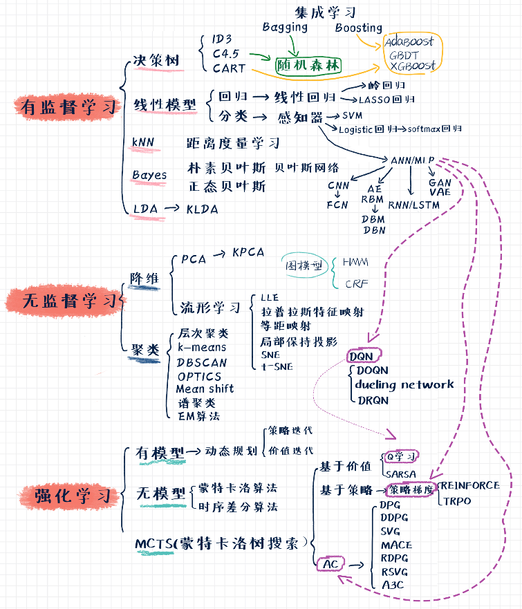

# [=>点此阅读<=](https://luweiagi.github.io/machine-learning-notes/)

# 目录
[机器学习算法地图](http://www.tensorinfinity.com/paper_18.html)

# [前言](perface/perface.md)
* [个人前言](perface/personal-perface/personal-perface.md)
* [机器学习前言](perface/machine-learning-perface/machine-learning-perface.md)
* [机器学习的学习路径](perface/machine-learning-learning-path/machine-learning-learning-path.md)
* [机器学习面试](perface/interview/interview.md)
* [机器学习发展史](perface/machine-learning-history/machine-learning-history.md)

# [数学基础](mathematics/mathematics.md)
* [机器学习需要的数学](mathematics/mathematics-ml-needs/mathematics-ml-needs.md)
* [数学系课程地图](mathematics/mathematics-map/mathematics-map.md)
* [微积分](mathematics/calculus/calculus.md)
  * [泰勒展开](mathematics/calculus/taylor-expansion/taylor-expansion.md)
  * [e的直观认识](mathematics/calculus/intuition-of-e/intuition-of-e.md)
  * [傅里叶变换](mathematics/calculus/fourier-transform/fourier-transform.md)
  * [希尔伯特空间](mathematics/calculus/hilbert-space/hilbert-space.md)
  * [卷积](mathematics/calculus/convolution/convolution.md)
* [线性代数](mathematics/linear-algebra/linear-algebra.md)
  * [范数](mathematics/linear-algebra/norm/norm.md)
  * [矩阵求导](mathematics/linear-algebra/matrix-derivative/matrix-derivative.md)
  * [特征值](mathematics/linear-algebra/eigenvalue/eigenvalue.md)
  * [SVD奇异值分解](mathematics/linear-algebra/singular-value-decomposition/singular-value-decomposition.md)
* [概率统计](mathematics/statistics/statistics.md)
  * [概率统计基础](mathematics/statistics/statistics-introduction/statistics-introduction.md)
  * [方差和协方差](mathematics/statistics/variance-and-covariance/variance-and-covariance.md)
    * [协方差矩阵](mathematics/statistics/variance-and-covariance/covariance-matrix/covariance-matrix.md)
    * [样本方差的无偏估计](mathematics/statistics/variance-and-covariance/sample-variance-unbiased-estimate/sample-variance-unbiased-estimate.md)
    * [Welfor算法：迭代更新方差](mathematics/statistics/variance-and-covariance/welford-algorithm-for-updating-variance/welford-algorithm-for-updating-variance.md)
  * [贝叶斯分析方法](mathematics/statistics/bayesian-analysis/bayesian-analysis.md)
    * [概率论与贝叶斯先验](mathematics/statistics/bayesian-analysis/probability-and-bayesian-prior/probability-and-bayesian-prior.md)
    * [贝叶斯概率](mathematics/statistics/bayesian-analysis/bayes-probability/bayes-probability.md)
    * [共轭先验](mathematics/statistics/bayesian-analysis/conjugate-prior/conjugate-prior.md)
  * [概率分布](mathematics/statistics/probability-distribution/probability-distribution.md)
    * [Normal正态分布](mathematics/statistics/probability-distribution/normal-distribution/normal-distribution.md)
    * [Gamma伽马函数](mathematics/statistics/probability-distribution/gamma-function/gamma-function.md)
    * [Gamma伽马分布](mathematics/statistics/probability-distribution/gamma-distribution/gamma-distribution.md)
    * [Beta贝塔分布](mathematics/statistics/probability-distribution/beta-distribution/beta-distribution.md)
    * [Dirichlet狄利克雷分布](mathematics/statistics/probability-distribution/dirichlet-distribution/dirichlet-distribution.md)
* [信息论](mathematics/information-theory/information-theory.md)
  * [信息论基础](mathematics/information-theory/information-theory-introduction/information-theory-introduction.md)
* [数值计算与优化](mathematics/numerical-calculation-and-optimization/numerical-calculation-and-optimization.md)
  * [最小二乘法](mathematics/numerical-calculation-and-optimization/least-square-method/least-square-method.md)
  * [等式约束的拉格朗日乘子法](mathematics/numerical-calculation-and-optimization/lagrangian-multiplier-method/lagrangian-multiplier-method.md)
  * [凸优化](mathematics/numerical-calculation-and-optimization/convex-optimization/convex-optimization.md)
    * [凸集和凸函数](mathematics/numerical-calculation-and-optimization/convex-optimization/convex-set-and-convex-function/convex-set-and-convex-function.md)
    * [凸优化问题](mathematics/numerical-calculation-and-optimization/convex-optimization/convex-optimization-problem/convex-optimization-problem.md)
* [梯度更新算法](mathematics/gradient-update-algorithm/gradient-update-algorithm.md)
  * [离线学习](mathematics/gradient-update-algorithm/offline-learning/offline-learning.md)
    * [梯度下降算法的演化](mathematics/gradient-update-algorithm/offline-learning/gradient-descent-algorithms-evolution/gradient-descent-algorithms-evolution.md)
    * [随机梯度下降SGD](mathematics/gradient-update-algorithm/offline-learning/sgd/sgd.md)
    * [动量法Momentum](mathematics/gradient-update-algorithm/offline-learning/momentum/momentum.md)
    * [牛顿动量Nesterov](mathematics/gradient-update-algorithm/offline-learning/nesterov/nesterov.md)
    * [AdaGrad](mathematics/gradient-update-algorithm/offline-learning/adagrad/adagrad.md)
    * [RMSprop](mathematics/gradient-update-algorithm/offline-learning/rmsprop/rmsprop.md)
    * [Adadelta](mathematics/gradient-update-algorithm/offline-learning/adadelta/adadelta.md)
    * [Adam](mathematics/gradient-update-algorithm/offline-learning/adam/adam.md)
    * [Nadam](mathematics/gradient-update-algorithm/offline-learning/nadam/nadam.md)
    * AdamW
    * [AMSGrad](mathematics/gradient-update-algorithm/offline-learning/amsgrad/amsgrad.md)
    * [AdasMax](mathematics/gradient-update-algorithm/offline-learning/adamax/adamax.md)
  * [增量学习](mathematics/gradient-update-algorithm/incremental-learning/incremental-learning.md)
    * [LwF: Learning-without-Forgetting](mathematics/gradient-update-algorithm/incremental-learning/lwf/Learning-without-Forgetting.md)
  * [在线学习](mathematics/gradient-update-algorithm/online-learning/online-learning.md)
    * [FTRL](mathematics/gradient-update-algorithm/online-learning/ftrl/ftrl.md)

# [编程基础](coding/coding.md)
* [计算机科目](coding/cs-courses/cs-courses.md)
  * [计算机科目概述](coding/cs-courses/cs-courses-introduction/cs-courses-introduction.md)
  * [计算机组成原理](coding/cs-courses/computer-organization/computer-organization.md)
    * [嵌入式系统](coding/cs-courses/computer-organization/embedded-system/embedded-system.md)
  * [数据结构与算法](coding/cs-courses/data-structures-and-algorithms/data-structures-and-algorithms.md)
    * [数据结构与算法概述](coding/cs-courses/data-structures-and-algorithms/data-structures-and-algorithms-introduction/data-structures-and-algorithms-introduction.md)
    * [数据结构](coding/cs-courses/data-structures-and-algorithms/data-structures/data-structures.md)
    * [算法思想](coding/cs-courses/data-structures-and-algorithms/algorithms/algorithms.md)
      * [排序](coding/cs-courses/data-structures-and-algorithms/algorithms/sort/sort.md)
        * [堆排序](coding/cs-courses/data-structures-and-algorithms/algorithms/sort/heap-sort.md)
        * [归并排序](coding/cs-courses/data-structures-and-algorithms/algorithms/sort/merge-sort.md)
        * [快速排序](coding/cs-courses/data-structures-and-algorithms/algorithms/sort/quick-sort.md)
      * [递归](coding/cs-courses/data-structures-and-algorithms/algorithms/recursion/recursion.md)
    * [剑指offer](coding/cs-courses/data-structures-and-algorithms/jianzhi-offer/jianzhi-offer.md)
      * [链表](coding/cs-courses/data-structures-and-algorithms/jianzhi-offer/list/list.md)
      * [二叉树](coding/cs-courses/data-structures-and-algorithms/jianzhi-offer/binary-tree/binary-tree.md)
      * [数组](coding/cs-courses/data-structures-and-algorithms/jianzhi-offer/array/array.md)
      * [字符串](coding/cs-courses/data-structures-and-algorithms/jianzhi-offer/string/string.md)
      * [栈和队列](coding/cs-courses/data-structures-and-algorithms/jianzhi-offer/stack-and-queue/stack-and-queue.md)
      * [递归和回溯法](coding/cs-courses/data-structures-and-algorithms/jianzhi-offer/recursion-and-back-tracking/recursion-and-back-tracking.md)
      * [动态规划](coding/cs-courses/data-structures-and-algorithms/jianzhi-offer/dynamic-programming/dynamic-programming.md)
      * [其他](coding/cs-courses/data-structures-and-algorithms/jianzhi-offer/others/others.md)
    * [Leetcode](coding/cs-courses/data-structures-and-algorithms/leetcode/leetcode.md)
      * [动态规划](coding/cs-courses/data-structures-and-algorithms/leetcode/dynamic-programming/dynamic-programming.md)
  * [编译原理](coding/cs-courses/compiler-principles/compiler-principles.md)
    * [编译过程、静态库和动态库](coding/cs-courses/compiler-principles/compilation-process-and-link-library/compilation-process-and-link-library.md)
    * [关于extern "C"](coding/cs-courses/compiler-principles/extern-c/extern-c.md)
    * [GCC编译器介绍](coding/cs-courses/compiler-principles/gcc-compiler-introduction/gcc-compiler-introduction.md)
    * [Make](coding/cs-courses/compiler-principles/make/make.md)
    * [CMake](coding/cs-courses/compiler-principles/cmake/cmake.md)
    * [QMake生成Makefile](coding/cs-courses/compiler-principles/qmake/qmake.md)
  * [操作系统](coding/cs-courses/operating-system/operating-system.md)
    * [Linux](coding/cs-courses/operating-system/linux/linux.md)
      * [Linux常用命令](coding/cs-courses/operating-system/linux/linux-command/linux-command.md)
      * [Shell](coding/cs-courses/operating-system/linux/shell/shell.md)
        * [输入输出重定向](coding/cs-courses/operating-system/linux/shell/input_output_redirection/input_output_redirection.md)
      * [Vim编辑器](coding/cs-courses/operating-system/linux/vim/vim.md)
    * [Docker](coding/cs-courses/operating-system/docker/docker.md)
    * [实时操作系统](coding/cs-courses/operating-system/rtos/rtos.md)
      * [freeRTOS](coding/cs-courses/operating-system/rtos/freertos/freertos.md)
  * [计算机网络](coding/cs-courses/computer-network/computer-network.md)
    * [TCP/IP协议族](coding/cs-courses/computer-network/tcp-ip-protocol-family/tcp-ip-protocol-family.md)
      * [TCP](coding/cs-courses/computer-network/tcp-ip-protocol-family/tcp/tcp.md)
* [编程语言](coding/programing-language/programing-language.md)
  * [C/C++](coding/programing-language/c-c++/c-c++.md)
    * [STL容器](coding/programing-language/c-c++/stl-container/stl-container.md)
    * [algorithm算法库](coding/programing-language/c-c++/algorithm-lib/algorithm-lib.md)
    * [知识点](coding/programing-language/c-c++/tips/tips.md)
      * [string字符串类](coding/programing-language/c-c++/tips/string/string.md)
      * [volatile关键字](coding/programing-language/c-c++/tips/volatile/volatile.md)
      * [float的精度和取值范围](coding/programing-language/c-c++/tips/float/float.md)
  * [Python](coding/programing-language/python/python.md)
    * [Python简介](coding/programing-language/python/introduction/introduction.md)
    * [Python语法](coding/programing-language/python/grammar/grammar.md)
      * [基础语法](coding/programing-language/python/grammar/basis/basis.md)
      * [数据结构](coding/programing-language/python/grammar/data-structure/data-structure.md)
      * [过程控制](coding/programing-language/python/grammar/process-control/process-control.md)
      * [函数](coding/programing-language/python/grammar/function/function.md)
      * [类和对象](coding/programing-language/python/grammar/class/class.md)
      * [文件操作](coding/programing-language/python/grammar/file/file.md)
      * [正则表达式](coding/programing-language/python/grammar/regular-expression/regular-expression.md)
    * [Python知识点](coding/programing-language/python/tips/tips.md)
    * [Python库](coding/programing-language/python/library/library.md)
      * [numpy](coding/programing-language/python/library/numpy.md)
      * [pandas](coding/programing-language/python/library/pandas.md)
      * [scipy](coding/programing-language/python/library/scipy.md)
      * [matplotlib](coding/programing-language/python/library/matplotlib.md)
      * [scikit-learn](coding/programing-language/python/library/scikit-learn.md)
    * [Python应用](coding/programing-language/python/application/application.md)
      * [排序算法](coding/programing-language/python/application/sort/sort.md)
    * [Cython](coding/programing-language/python/cython/cython.md)
* [大数据](coding/big-data/big-data.md)
  * [Hadoop](coding/big-data/hadoop/hadoop.md)
    * [Hadoop简介](coding/big-data/hadoop/hadoop-introduction.md)
    * [MapReduce](coding/big-data/hadoop/map-reduce.md)
  * [Hive](coding/big-data/hive/hive.md)
  * [Spark](coding/big-data/spark/spark.md)

# [机器学习](machine-learning/machine-learning.md)
* [机器学习概论](machine-learning/machine-learning-introduction/machine-learning-introduction.md)
  * [机器学习的哲学思想](machine-learning/machine-learning-introduction/philosophy/philosophy.md)
  * [机器学习模型组成与分类](machine-learning/machine-learning-introduction/model-composition-and-classification/model-composition-and-classification.md)
  * [模型评估方法与性能度量](machine-learning/machine-learning-introduction/model-evaluation-and-performance/model-evaluation-and-performance.md)
  * [过拟合与模型复杂度](machine-learning/machine-learning-introduction/over-fitting-and-model-complexity/over-fitting-and-model-complexity.md)
  * [正则化](machine-learning/machine-learning-introduction/regularization/regularization.md)
* [特征工程](machine-learning/feature-engineering/feature-engineering.md)
* [感知机](machine-learning/perceptron/perceptron.md)
* [k近邻](machine-learning/k-nearest-neighbor/k-nearest-neighbor.md)
* [朴素贝叶斯](machine-learning/naive-bayes/naive-bayes.md)
* [线性模型](machine-learning/linear-model/linear-model.md)
  * [最大熵模型](machine-learning/linear-model/maximum-entropy-model/maximum-entropy-model.md)
  * [指数族分布与广义线性模型](machine-learning/linear-model/exponential-family-distribution-and-generalized-linear-model/exponential-family-distribution-and-generalized-linear-model.md)
  * [线性回归](machine-learning/linear-model/linear-regression/linear-regression.md)
  * [Logistic回归](machine-learning/linear-model/logistic-regression/logistic-regression.md)
* [决策树](machine-learning/decision-tree/decision-tree.md)
* [支持向量机](machine-learning/support-vector-machine/support-vector-machine.md)
  * [线性可分支持向量机与硬间隔最大化](machine-learning/support-vector-machine/linear-separable-svm/linear-separable-svm.md)
  * [线性支持向量机与软间隔最大化](machine-learning/support-vector-machine/linear-svm/linear-svm.md)
  * [非线性支持向量机与核函数](machine-learning/support-vector-machine/nonlinear-svm-and-kernel-function/nonlinear-svm-and-kernel-function.md)
  * [序列最小最优化算法SMO](machine-learning/support-vector-machine/smo/smo.md)
  * [SVM总结](machine-learning/support-vector-machine/svm-summary/svm-summary.md)
* [liblinear](machine-learning/liblinear/liblinear.md)
* [集成学习](machine-learning/ensemble-learning/ensemble-learning.md)
  * [集成学习概述](machine-learning/ensemble-learning/ensemble-learning-introduction/ensemble-learning-introduction.md)
  * [Bagging](machine-learning/ensemble-learning/bagging/bagging.md)
    * [随机森林](machine-learning/ensemble-learning/bagging/random-forest/random-forest.md)
  * [Boosting](machine-learning/ensemble-learning/boosting/boosting.md)
    * [AdaBoost](machine-learning/ensemble-learning/boosting/adaboost/adaboost.md)
    * [GradientBoosting](machine-learning/ensemble-learning/boosting/gradient-boosting/gradient-boosting.md)
      * [GBDT](machine-learning/ensemble-learning/boosting/gradient-boosting/gbdt/gbdt.md)
      * [XGBoost](machine-learning/ensemble-learning/boosting/gradient-boosting/xgboost/xgboost.md)
        * [XGBoost理论](machine-learning/ensemble-learning/boosting/gradient-boosting/xgboost/xgboost-theory/xgboost-theory.md)
        * [XGBoost实践](machine-learning/ensemble-learning/boosting/gradient-boosting/xgboost/xgboost-practice/xgboost-practice.md)
      * [LightGBM](machine-learning/ensemble-learning/boosting/gradient-boosting/light-gbm/light-gbm.md)
  * [Stacking](machine-learning/ensemble-learning/stacking/stacking.md)
* [降维](machine-learning/dimensionality-reduction/dimensionality-reduction.md)
  * [降维概述](machine-learning/dimensionality-reduction/dimensionality-reduction-introduction/dimensionality-reduction-introduction.md)
  * [PCA主成分分析](machine-learning/dimensionality-reduction/principal-component-analysis/principal-component-analysis.md)
  * LDA线性判别分析
  * t-SNE
  * ICA独立分量分析
  * 多维缩放（可能不重要）
  * 自编码器
  * [流形学习](machine-learning/dimensionality-reduction/manifold-learning/manifold-learning.md)
* [EM算法](machine-learning/expectation-maximization-algorithm/expectation-maximization-algorithm.md)
* [概率图模型](machine-learning/probability-graphical-model/probability-graphical-model.md)
  * [概率图模型简介](machine-learning/probability-graphical-model/probability-graphical-model-introduction/probability-graphical-model-introduction.md)
  * [概率图简介](machine-learning/probability-graphical-model/probability-graph-introduction/probability-graph-introduction.md)
* [HMM隐马尔科夫模型](machine-learning/hidden-markov-model/hidden-markov-model.md)
* [CRF条件随机场](machine-learning/conditional-random-field/conditional-random-field.md)
* [聚类](machine-learning/clustering/clustering.md)
  * [k均值聚类](machine-learning/clustering/k-means-clustering/k-means-clustering.md)
  * [高斯混合模型](machine-learning/clustering/gaussian-mixture-model/gaussian-mixture-model.md)
  * [DPMM狄利克雷过程混合模型](machine-learning/clustering/dirichlet-process-mixture-model/dirichlet-process-mixture-model.md)
* [主题模型](machine-learning/topic-model/topic-model.md)
  * [LDA隐狄利克雷分布](machine-learning/topic-model/latent-dirichlet-allocation/latent-dirichlet-allocation.md)
* [知识点](machine-learning/tips/tips.md)
  * [损失函数](machine-learning/tips/loss-function/loss-function.md)
  * [负采样](machine-learning/tips/negtive-sampling/negtive-sampling.md)
* [机器学习算法总结](machine-learning/machine-learning-algorithm-summary/machine-learning-algorithm-README.md)

# [深度学习](deep-learning/deep-learning.md)
* [深度学习概论](deep-learning/deep-learning-introduction/deep-learning-introduction.md)
* [ANN人工神经网络](deep-learning/artificial-neural-network/artificial-neural-network.md)
* [Hopfield神经网络](deep-learning/hopfield-neural-network/hopfield-neural-network.md)
* [知识点](deep-learning/tips/tips.md)
  * [激活函数](deep-learning/tips/activation-functions/activation-functions.md)
  * [深度学习中的正则化](deep-learning/tips/normalization/normalization.md)
    * [Batch Normalization](deep-learning/tips/normalization/batch-normalization/batch-normalization.md)
    * [Layer Normalization](deep-learning/tips/normalization/layer-normalization/layer-normalization.md)
  * [深度学习的高阶特征交叉原理](deep-learning/tips/feature-crossing/feature-crossing.md)
  * [梯度爆炸与梯度消失](deep-learning/tips/gradient-explosion-and-vanishing/gradient-explosion-and-vanishing.md)
* [CNN卷积神经网络](deep-learning/convolutional-neural-network/convolutional-neural-network.md)
  * [CNN卷积神经网络](deep-learning/convolutional-neural-network/convolutional-neural-network/convolutional-neural-network.md)
  * [TextCNN: Convolutional Neural Networks for Sentence Classification EMNLP2014](deep-learning/convolutional-neural-network/textcnn/Convolutional-Neural-Networks-for-Sentence-Classification.md)
* [RNN循环神经网络](deep-learning/recurrent-neural-network/recurrent-neural-network.md)
  * [RNN循环神经网络](deep-learning/recurrent-neural-network/recurrent-neural-network/recurrent-neural-network.md)
  * [LSTM长短期记忆网络](deep-learning/recurrent-neural-network/long-short-term-memory-networks/long-short-term-memory-networks.md)
    * [LSTM长短期记忆网络](deep-learning/recurrent-neural-network/long-short-term-memory-networks/long-short-term-memory-networks/long-short-term-memory-networks.md)
    * [pix2code: Generating Code from a Graphical User Interface Screenshot EICS2018](deep-learning/recurrent-neural-network/long-short-term-memory-networks/pix2code/pix2code-Generating-Code-from-a-Graphical-User-Interface-Screenshot.md)
  * [GRU门控循环单元](deep-learning/recurrent-neural-network/gated-recurrent-unit/gated-recurrent-unit.md)
* [BNN贝叶斯神经网络](deep-learning/beyesian-neural-network/beyesian-neural-network.md)
  * [贝叶斯神经网络](deep-learning/beyesian-neural-network/beyesian-neural-network/beyesian-neural-network.md)
  * [Weight Uncertainty in Neural Networks ICML2015](deep-learning/beyesian-neural-network/weight-uncertainty-in-neural-networks/Weight-Uncertainty-in-Neural-Networks.md)
* [GNN图神经网络](deep-learning/graph-neural-networks/graph-neural-networks.md)
  * [GNN图神经网络综述](deep-learning/graph-neural-networks/graph-neural-networks-review/graph-neural-networks-review.md)
  * [GCN图卷积网络](deep-learning/graph-neural-networks/graph-convolutional-networks/graph-convolutional-networks.md)
    * [GCN图卷积网络初步理解](deep-learning/graph-neural-networks/graph-convolutional-networks/gcn-preliminary-understand/gcn-preliminary-understand.md)
    * [GCN图卷积网络的numpy简单实现](deep-learning/graph-neural-networks/graph-convolutional-networks/gcn-numpy-fulfillment/gcn-numpy-fulfillment.md)
    * [GCN图卷积网络本质理解](deep-learning/graph-neural-networks/graph-convolutional-networks/gcn-essential-understand/gcn-essential-understand.md)
    * [GCN图卷积网络全面理解](deep-learning/graph-neural-networks/graph-convolutional-networks/gcn-comprehensive-understand/gcn-comprehensive-understand.md)
    * [Semi-Supervised-Classification-With-Graph-Convolutional-Networks ICLR2017](deep-learning/graph-neural-networks/graph-convolutional-networks/semi-supervised-gcn/Semi-Supervised-Classification-With-Graph-Convolutional-Networks.md)
* [深度生成模型](deep-learning/deep-generative-models/deep-generative-models.md)
  * [深度生成模型概述](deep-learning/deep-generative-models/deep-generative-models-introduction/deep-generative-models-introduction.md)
  * [GAN生成对抗网络](deep-learning/deep-generative-models/generative-adversarial-nets/generative-adversarial-nets.md)
  * [VAE变分自编码器](deep-learning/deep-generative-models/variational-autoencoder/variational-autoencoder.md)
  * Flow-based Models流模型
  * [Diffusion Models扩散模型](deep-learning/deep-generative-models/diffusion-models/diffusion-models.md)
* [Few-shot Learning小样本学习](deep-learning/few-shot-learning/few-shot-learning.md)

# [强化学习](reinforcement-learning/reinforcement-learning.md)
* [强化学习](reinforcement-learning/reinforcement-learning/reinforcement-learning.md)
  * [强化学习概论](reinforcement-learning/reinforcement-learning/reinforcement-learning-introduction/reinforcement-learning-introduction.md)
  * [状态、奖励、动作](reinforcement-learning/reinforcement-learning/state-reward-action/state-reward-action.md)
    * [奖励](reinforcement-learning/reinforcement-learning/state-reward-action/reward/reward.md)
  * [多臂赌博机及其解法](reinforcement-learning/reinforcement-learning/multi-armed-bandit-and-solutions/multi-armed-bandit-and-solutions.md)
  * [马尔科夫决策过程](reinforcement-learning/reinforcement-learning/markov-decision-processes/markov-decision-processes.md)
  * [动态规划](reinforcement-learning/reinforcement-learning/dynamic-programming/dynamic-programming.md)
  * [无模型方法一：蒙特卡洛](reinforcement-learning/reinforcement-learning/model-free-methods-1-monte-carlo/model-free-methods-1-monte-carlo.md)
  * [无模型方法二：时间差分](reinforcement-learning/reinforcement-learning/model-free-methods-2-time-difference/model-free-methods-2-time-difference.md)
  * [无模型方法三：多步自举](reinforcement-learning/reinforcement-learning/model-free-methods-3-multi-step-bootstrap/model-free-methods-3-multi-step-bootstrap.md)
  * [函数近似和深度网络](reinforcement-learning/reinforcement-learning/function-approximation-and-deep-network/function-approximation-and-deep-network.md)
  * [策略梯度算法](reinforcement-learning/reinforcement-learning/policy-gradient-algorithm/policy-gradient-algorithm.md)
  * [深度强化学习](reinforcement-learning/reinforcement-learning/deep-reinforcement-learning/deep-reinforcement-learning.md)
  * [基于模型的强化学习](reinforcement-learning/reinforcement-learning/model-based-reinforcement-learning/model-based-reinforcement-learning.md)
  * [强化学习前景](reinforcement-learning/reinforcement-learning/reinforcement-learning-prospect/reinforcement-learning-prospect.md)
  * [强化学习论文](reinforcement-learning/reinforcement-learning/paper/paper.md)
    * [DDPG: Continuous Control With Deep Reinforcement Learning ICLR2016](reinforcement-learning/reinforcement-learning/paper/ddpg/ddpg.md)
    * [PPO: Proximal Policy Optimization arXiv2017OpenAI](reinforcement-learning/reinforcement-learning/paper/ppo/Proximal-Policy-Optimization.md)
    * [Soft Actor-Critic](https://www.paperexplained.cn/articles/paper/detail/811df72e210e20de99719539505da54762a11c6d/)
* [仿真环境](reinforcement-learning/simulation-platform/simulation-platform.md)
  * [OpenAI: Gym](reinforcement-learning/simulation-platform/openai-gym/openai-gym.md)
  * MuJoCo
  * Unity3D: ml-agents
    简言之：行为树是适合解决复杂AI的解决方案。
    对于Unity用户，Unity商店现在已经有一个比较完善的行为树设计(Behavior Designer)插件可供购买使用。  
  * [OpenDILab: GoBigger多智能体仿真平台](reinforcement-learning/simulation-platform/OpenDILab-GoBigger/OpenDILab-GoBigger.md)
* [Sim2Real从仿真器到现实环境的迁移](reinforcement-learning/sim2real/sim2real.md)
  * [论文](reinforcement-learning/sim2real/paper/paper.md)
    * [i-Sim2Real: Reinforcement Learning of Robotic Policies in Tight Human-Robot Interaction Loops arXiv2022 Google](reinforcement-learning/sim2real/paper/i-sim2real/i-Sim2Real-Reinforcement-Learning-of-Robotic-Policies-in-Tight-Human-Robot-Interaction-Loops.md)
    * [Legged Robots that Keep on Learning: Fine-Tuning Locomotion Policies in the Real World arXiv2022 Google](reinforcement-learning/sim2real/paper/legged-robots-keep-on-learning/Legged-Robots-that-Keep-on-Learning-Fine-Tuning-Locomotion-Policies-in-the-Real-World.md)
* [MCTS蒙特卡洛树搜索](reinforcement-learning/monte-carlo-tree-search/monte-carlo-tree-search.md)
* [模仿学习](reinforcement-learning/imatation-learning/imatation-learning.md)
  * [模仿学习介绍](reinforcement-learning/imatation-learning/imatation-learning-introduction/imatation-learning-introduction.md)
  * [BC行为克隆:Behavior Cloning](reinforcement-learning/imatation-learning/behavior-cloning/behavior-cloning.md)
    * [论文](reinforcement-learning/imatation-learning/behavior-cloning/paper/paper.md)
      * [Visual Backtracking Teleoperation: A Data Collection Protocol for Offline Image-Based Reinforcement Learning arXir2022 Google](reinforcement-learning/imatation-learning/behavior-cloning/paper/visual-backtracking-teleoperation/Visual-Backtracking-Teleoperation-A-Data-Collection-Proto.md)
      * [GoalsEye: Learning High Speed Precision Table Tennis on a Physical Robot Google2022](reinforcement-learning/imatation-learning/behavior-cloning/paper/goals-eye/GoalsEye-Learning-High-Speed-Precision-Table-Tennis-on-a-Physical-Robot.md)
  * [IRL逆强化学习Inverse Reinforcement Learning](reinforcement-learning/imatation-learning/inverse-reinforcement-learning/inverse-reinforcement-learning.md)
    * [论文](reinforcement-learning/imatation-learning/inverse-reinforcement-learning/paper/paper.md)
      * [XIRL: Cross-embodiment Inverse Reinforcement Learning arXir2022 Google](reinforcement-learning/imatation-learning/inverse-reinforcement-learning/paper/xirl/XIRL-Cross-embodiment-Inverse-Reinforcement-Learning.md)
  * [GAIL生成式对抗模仿学习: Generative Adversarial Imitation Learning NeurIPS2016](reinforcement-learning/imatation-learning/generative-adversarial-imitation-learning/Generative-Adversarial-Imitation-Learning.md)
  * [论文](reinforcement-learning/imatation-learning/paper/paper.md)
    * [Augmenting GAIL with BC for sample efficient imitation learning](reinforcement-learning/imatation-learning/paper/BC+GAIL/Augmenting-GAIL-with-BC-for-sample-effici.md)
    * [Robotic Table Wiping via Reinforcement Learning and Whole-body Trajectory Optimization arXiv2022 Google](reinforcement-learning/imatation-learning/paper/robotic-table-wiping/Robotic-Table-Wiping-via-Reinforcement-Learning-and-Whole-body-Trajectory-Optimization.md)
    * [On the Sample Complexity of Stability Constrained Imitation Learning PMLR2022 Google](reinforcement-learning/imatation-learning/paper/sample-complexity/On-the-Sample-Complexity-of-Stability-Constrained-Imitation-Learning.md)
* [多智能体强化学习](reinforcement-learning/multi-agent-reinforcement-learning/multi-agent-reinforcement-learning.md)
  * [MAPPO](reinforcement-learning/multi-agent-reinforcement-learning/mappo/mappo.md)
  * [多智能体强化学习论文](reinforcement-learning/multi-agent-reinforcement-learning/paper/paper.md)
    * [mean-field: Mean Field Multi-Agent Reinforcement Learning ICML2018](reinforcement-learning/multi-agent-reinforcement-learning/paper/mean-field/Mean-Field-Multi-Agent-Reinforcement-Learning.md)
* [Transformer+RL](reinforcement-learning/transformer-rl/transformer-rl.md)
* [决策大模型](reinforcement-learning/decision-making-big-model/decision-making-big-model.md)
* [Offline RL离线强化学习](reinforcement-learning/offline-reinforcement-learning/offline-reinforcement-learning.md)
* [MMRL多模态强化学习](reinforcement-learning/multi-modal-reinforcement-learning/multi-modal-reinforcement-learning.md)
* [LLM+RL](reinforcement-learning/llm-rl/llm-rl.md)
* [DiffusionModel+RL](reinforcement-learning/diffusion-model-rl/diffusion-model-rl.md)
* [业界应用](reinforcement-learning/industry-application/industry-application.md)
  * [DeepMind](reinforcement-learning/industry-application/deepmind/deepmind.md)
    * AlphaGo
    * [AlphaGo-Zero: Mastering the Game of Go without Human Knowledge Nature2017](reinforcement-learning/industry-application/deepmind/alpha-go-zero/Mastering-the-Game-of-Go-without-Human-Knowledge.md)
    * [AlphaStar: Grandmaster level in StarCraft II using multi-agent reinforcement learning Nature2019](reinforcement-learning/industry-application/deepmind/alpha-star/Grandmaster-level-in-StarCraft-II-using-multi-agent-reinforcement-learning.md)
    * AlphaZero
    * MuZero
    * AlphaFold
    * AlphaCode
    * [AlphaTensor: Discovering faster matrix multiplication algorithms with reinforcement learning Nature2022](reinforcement-learning/industry-application/deepmind/alpha-tensor/Discovering-faster-matrix-multiplication-algorithms-with-reinforcement-learning.md)
    * Agent57 2020
    * DeepNash
  * [OpenAI](reinforcement-learning/industry-application/openai/openai.md)
    * Emergence of grounded compositional language in multi agent populations 2017 在模拟游戏环境里从无到有进化出一种语言
      OpenAI在2017年先完成了具身智能演化出语言的原理模型之后才立项GPT，Emergence of grounded compositional language in multi agent populations.现在多模态模型的关键要素在文章里都有了，而之前OpenAI还在打游戏。而且这还只是对外公开的部分，谁知道内部发生了啥，马斯克骂骂咧咧的退出了。
    * [OpenAI Five: Dota 2 with Large Scale Deep Reinforcement Learning 2019](reinforcement-learning/industry-application/openai/oepnai-five/openai-five.md)
    * 玩魔方
  * [腾讯](reinforcement-learning/industry-application/tencent/tencent.md)
    * [王者荣耀Honor of Kings](reinforcement-learning/industry-application/tencent/honor-of-kings/honor-of-kings.md)
  * [InspirAI启元世界](reinforcement-learning/industry-application/inspir-ai/inspir-ai.md)
    * [InspirAI启元世界](reinforcement-learning/industry-application/inspir-ai/inspir-ai/inspir-ai.md)
    * [TimeChamber大规模并行的大规模自对弈框架](reinforcement-learning/industry-application/inspir-ai/time-chamber/time-chamber.md)
      * [TimeChamber大规模并行的大规模自对弈框架](reinforcement-learning/industry-application/inspir-ai/time-chamber/time-chamber/time-chamber.md)
      * [Humanoid Strike人类击剑](reinforcement-learning/industry-application/inspir-ai/time-chamber/humanoid-strike/humanoid-strike.md)

# [机器学习框架](machine-learning-framework/machine-learning-framework.md)
* [Anaconda](machine-learning-framework/anaconda/anaconda.md)
* [TensorFlow](machine-learning-framework/tensorflow/tensorflow.md)
  * [TensorFlow1.0](machine-learning-framework/tensorflow/tensorflow1.0/tensorflow1.0.md)
    * [TensorFlow基础](machine-learning-framework/tensorflow/tensorflow1.0/basis/basis.md)
    * [TensorFlow基础概念解析](machine-learning-framework/tensorflow/tensorflow1.0/basic-concept-analysis/basic-concept-analysis.md)
    * [TensorFlow机器学习基础](machine-learning-framework/tensorflow/tensorflow1.0/machine-learning-foundation/machine-learning-foundation.md)
  * [TensorFlow2.0](machine-learning-framework/tensorflow/tensorflow2.0/tensorflow2.0.md)
    * [TensorFlow2.0基础](machine-learning-framework/tensorflow/tensorflow2.0/basis/basis.md)
    * [TensorFlow2.0安装](machine-learning-framework/tensorflow/tensorflow2.0/install/install.md)
    * [keras](machine-learning-framework/tensorflow/tensorflow2.0/keras/keras.md)
  * [Tensorflow分布式架构](machine-learning-framework/tensorflow/tensorflow-distributed-architecture/tensorflow-distributed-architecture.md)
  * [TensorFlow Serving](machine-learning-framework/tensorflow/tf_serving/tf_serving.md)
  * [工具](machine-learning-framework/tensorflow/tools/tools.md)
    * [TensorFlow中使用GPU](machine-learning-framework/tensorflow/tools/gpu/gpu.md)
    * [TensorFlow中ckpt转pb文件（模型持久化）](machine-learning-framework/tensorflow/tools/ckpt-to-pb/ckpt-to-pb.md)
    * [得到模型参数值](machine-learning-framework/tensorflow/tools/get-weight/get-weight.md)
* [PyTorch](machine-learning-framework/pytorch/pytorch.md)
  * [PyTorch基础](machine-learning-framework/pytorch/basis/basis.md)
* [模型训练云服务器平台](machine-learning-framework/cloud-server-platform/cloud-server-platform.md)
* [Ray分布式计算框架](machine-learning-framework/ray/ray.md)
* [RLlib分布式强化学习系统](machine-learning-framework/rllib/rllib.md)
* [大模型训练框架](machine-learning-framework/large-model-trainning-method/large-model-trainning-method.md)
* [超算集群](machine-learning-framework/supercomputing-cluster/supercomputing-cluster.md)
  * [微软: 用于训练ChatGPT的超算](machine-learning-framework/supercomputing-cluster/microsoft-supercomputing-cluster-for-chatgpt/microsoft-supercomputing-cluster-for-chatgpt.md)

# [计算机视觉](computer-vision/computer-vision.md)
* ResNet 有捷径的(resnet的跳跃连接)
* InceptionNet 多岔路的(inception的多分支)
* DenseNet 通往多个地点的捷径的(densenet的密集连接)
* [YOLO](computer-vision/yolo/yolo.md)
  * [YOLO原理](computer-vision/yolo/yolo-principle/yolo-principle.md)
  * [DarkNet深度学习框架](computer-vision/yolo/darknet/darknet.md)
  * [YOLO-v5]()
* [图像标注工具](computer-vision/image-mark-tool/image-mark-tool.md)
  * [YOLO_Mark](computer-vision/image-mark-tool/yolo-mark/yolo-mark.md)
  * [Labelme](computer-vision/image-mark-tool/labelme/labelme.md)
* Vision Transformer
* Swin Transformer

# [自然语言处理](natural-language-processing/natural-language-processing.md)
* [自然语言处理概论](natural-language-processing/natural-language-processing-introduction/natural-language-processing-introduction.md)
* [自然语言](natural-language-processing/natural-language/natural-language.md)
* [语言模型和中文分词](natural-language-processing/language-model-and-chinese-word-segmentation/language-model-and-chinese-word-segmentation.md)
* [TF-IDF词频-逆文档频率](natural-language-processing/tf-idf/tf-idf.md)
* [word2vec](natural-language-processing/word2vec/word2vec.md)
* [Seq2Seq模型和Attention机制](natural-language-processing/seq2seq-and-attention-mechanism/seq2seq-and-attention-mechanism.md)
* [Self-Attention和Transformer](natural-language-processing/self-attention-and-transformer/self-attention-and-transformer.md)
  * [Transformer: Attention Is All You Need  NIPS2017](natural-language-processing/self-attention-and-transformer/attention-is-all-you-need/attention-is-all-you-need.md)
  * [Transformer模型tensorflow2.0官网demo代码解读](natural-language-processing/self-attention-and-transformer/transformer-tf2-demo-code-explain/transformer-tf2-demo-code-explain.md)
  * [Transformer的细节问题](natural-language-processing/self-attention-and-transformer/transformer-details/transformer-details.md)
* [BERT](natural-language-processing/bert/bert.md)
* [LLM大语言模型](natural-language-processing/large-language-model/large-language-model.md)
  * [RLHF基于人工反馈的强化学习方法](natural-language-processing/large-language-model/rlhf/rlhf.md)
    * Alpaca 斯坦福大学
      - Alpaca 近日，斯坦福基于 Meta 的 LLaMA 7B 模型微调出一个新模型 Alpaca。该研究让 OpenAI 的 text-davinci-003 模型以 self-instruct 方式生成 52K 指令遵循（instruction-following）样本，以此作为Alpaca的训练数据。研究团队已将训练数据、生成训练数据的代码和超参数开源，后续还将发布模型权重和训练代码。 [斯坦福70亿参数开源模型媲美GPT-3.5，100美元即可复现](https://mp.weixin.qq.com/s/U6ioEygg5mlVpAIb2L3cZw)
    * [ColossalChat By ](natural-language-processing/large-language-model/rlhf/ColossalChat/ColossalChat.md) ColossalChat开源了第一个完整的RLHF pipeline，斯坦福Alpaca没有做RLHF
  * [LoRA大语言模型的低秩适应](natural-language-processing/large-language-model/lora/lora.md)
  * [Prompt Learning](natural-language-processing/large-language-model/prompt-learning/prompt-learning.md)
  * [Emergence涌现现象](natural-language-processing/large-language-model/emergence/emergence.md)
  * [自己训练ChatGPT](natural-language-processing/large-language-model/train-ChatGPT-DIY/train-ChatGPT-DIY.md)
  * [业界应用](natural-language-processing/large-language-model/industry-application/industry-application.md)
    * [OpenAI](natural-language-processing/large-language-model/industry-application/openai/openai.md)
      * [GTP系列介绍](natural-language-processing/large-language-model/industry-application/openai/gpt-series-introduction/gpt-series-introduction.md)
      * [GPT前身Unsupervised Sentiment Neuron](natural-language-processing/large-language-model/industry-application/openai/unsupervised-sentiment-neuron/unsupervised-sentiment-neuron.md)
        * [Unsupervised Sentiment Neuron](natural-language-processing/large-language-model/industry-application/openai/unsupervised-sentiment-neuron/unsupervised-sentiment-neuron/unsupervised-sentiment-neuron.md)
        * [Learning to Generate Reviews and Discovering Sentiment ArXiv2017](natural-language-processing/large-language-model/industry-application/openai/unsupervised-sentiment-neuron/paper/Learning-to-Generate-Reviews.md)
      * GPT1
      * GPT2
      * GPT3 语言生成模型 根据Lambda官网数据，微软为OpenAI设计了一个包含10000块Nvidia V100 GPU的分布式集群进行GPT-3的模型训练，由于模型参数量较大（共1750亿参数），训练完成共耗费30天，消耗总算力为 3640PF-days。以Nvidia Tesla V100的 Lambda GPU实例定价为1.50 美元/小时测算，GPT-3的完整训练成本将达到466万美元/次。
      * Codex
      * GPT-3.5
      * instructGPT
      * [ChatGPT](natural-language-processing/large-language-model/industry-application/openai/ChatGPT/ChatGPT.md) 聊天机器人
      * [GPT-4](natural-language-processing/large-language-model/industry-application/openai/GPT-4/GPT-4.md) 202303 输入图/文，输出文
    * MiscroSoft
      - Copilot MiscroSoft和OpenAI联合打造的AI编程工具，基于OpenAI的大模型Codex，基于GPT-3框架进行训练
      - Kosmos-1 20230227发布，第二种才是真正的多模态LLM，才是GPT-4的魅力，他的原理目前OpenAI没有公布细节，但是大家可以参考微软在2月27日发布的Kosmos-1的论文（想一想，为什么偏偏是OpenAI的深度合作伙伴发了这篇论文）。
    * [Meta](natural-language-processing/large-language-model/industry-application/meta/meta.md)
      - [OPT](natural-language-processing/large-language-model/industry-application/meta/opt/opt.md) 复现开源了GPT3
      - [LLaMa](natural-language-processing/large-language-model/industry-application/meta/LLaMa/LLaMa.md) ** 对标OpenAI的ChatGPT，开源，发布于202302
    * [Google](natural-language-processing/large-language-model/industry-application/google/google.md)
      * LaMDA 发布于202105 I/O大会
      * PaLM 202204 5400亿参数
      * LaMDA-2 202205 I/O大会
      * T5
      * [Bard](natural-language-processing/large-language-model/industry-application/google/Bard/Bard.md) 聊天机器人，对标OpenAI的ChatGPT，发布于202302
      * ReAct是来自谷歌论文《Synergizing Reasoning and Acting in Language Models》中的一个方法，它是2022年12月发表的。这是一种eason+Act（ReAct）的方式，让大模型的行动和推理一起协同，提高大模型解决问题的能力。也就是让模型在访问外部知识的情况下和自己的模型能力结合。其实这就是Bing中的ChatGPT的运行方式！这个简单的方法可以让模型有更强的能力。而它的实现其实只需要简单的几行代码即可。因此，在前面的低成本+浏览器运行的基础上，加上ReAct改造，几乎可以得到一个与ChatGPT类似或者甚至更好的对话模型！
    * Together
      * OpenChatKit ChatGPT的开源平替来了，源代码、模型权重和训练数据集全部公开。由前OpenAI研究员共同打造。[如何看待 Together 推出的开源聊天大模型 OpenChatKit？能否替代 ChatGPT？](https://www.zhihu.com/question/589094770/answer/2934277284)，[ChatGPT开源平替来了，开箱即用！前OpenAI团队打造](https://mp.weixin.qq.com/s/EQk9i6Bu_BMsc6AEYCFI3A)
    * [阿里达摩院](natural-language-processing/large-language-model/industry-application/alibaba/alibaba.md)
      * [中文GPT3](natural-language-processing/large-language-model/industry-application/alibaba/gpt3-chinese/gpt3-chinese.md) 对标GPT-3的开源项目
    * 元语智能
      * PromptCLUE1.0 202210
      * PromptCLUE1.5 202211
      * ChatYuan 202212
    * [百度](natural-language-processing/large-language-model/industry-application/baidu/baidu.md)
      * [ERNIE-Bot文心一言](natural-language-processing/large-language-model/industry-application/baidu/ERNIE-Bot/ERNIE-Bot.md) 202302
    * [BlinkDL](natural-language-processing/large-language-model/industry-application/blinkdl/blinkdl.md)
      * [ChatRWKV](natural-language-processing/large-language-model/industry-application/blinkdl/ChatRWKV/ChatRWKV.md) 对标ChatGPT的开源项目，基于RNN架构 202208
    * [HPC-AI Tech](natural-language-processing/large-language-model/industry-application/hpcaitech/hpcaitech.md)
      * [ColossalAI](natural-language-processing/large-language-model/industry-application/hpcaitech/colossal-ai/ColossalAI.md) 对标ChatGPT的开源项目 202302
    * [复旦大学自然语言处理实验室邱锡鹏团队](natural-language-processing/large-language-model/industry-application/fudan-university-nlp-group/fudan-university-nlp-group.md)
      * [MOSS](natural-language-processing/large-language-model/industry-application/fudan-university-nlp-group/moss/moss.md) 对标ChatGPT已开源 202302
    * 智谱AI
      * ChatGLM 近日，由清华技术成果转化的公司智谱AI开源了GLM系列模型的新成员——**中英双语对话模型ChatGLM-6B**，支持在单张消费级显卡上进行推理使用。这是继此前开源GLM-130B千亿基座模型之后，智谱AI再次推出大模型方向的研究成果。与此同时，基于千亿基座模型的ChatGLM也同期推出，初具问答和对话功能 [ChatGLM：千亿基座的对话模型启动内测，单卡版模型已全面开源](https://mp.weixin.qq.com/s/08s-BlV5N3jytlSsd5hZ0g)
    * [百川智能](natural-language-processing/large-language-model/industry-application/baichuan-intelligence/baichuan-intelligence.md)
      * [baichuan-7B](natural-language-processing/large-language-model/industry-application/baichuan-intelligence/baichuan-7B/baichuan-7B.md) 开源 202306

# [多模态大模型](multimodal-large-model/multimodal-large-model.md)
* [Foundation Models基础模型](multimodal-large-model/foundation-models/foundation-models.md)
  * [On the Opportunities and Risks of Foundation Models Stanford2021李飞飞](multimodal-large-model/foundation-models/foundation-models-LeiFeiFei/On-the-Opportunities-and-Risks-of-Foundation-Models.md)
  * [Can Foundation Models Perform Zero Shot For Robot PMLR2022](multimodal-large-model/foundation-models/Can-Foundation-Models-Perform-Zero-Shot-For-Robot/Can-Foundation-Models-Perform-Zero-Shot-For-Robot.md)
* [业界应用](multimodal-large-model/industry-application/industry-application.md)
  * [OpenAI](multimodal-large-model/industry-application/openai/openai.md)
    * DALL·E 图像生成平台
    * CLIP
    * DALL·E2
    * [Point-E 202212 文本生成3D点云模型](multimodal-large-model/industry-application/openai/point-e/point-e.md)
    * [sora202402文字生成视频]()
  * Stability.ai
    * Stable Diffusion开源
  * Salesforce Research
    * BLIP-2 图像生成文字，能力堪比ChatGPT

# [AutoML](auto-machine-learning/auto-machine-learning.md)
* [AutoML介绍](auto-machine-learning/auto-machine-learning-introduction/auto-ml-introduction.md)
* 自动数据清理AutoClean
* 自动特征工程AutoFE
* [超参数优化HPO](auto-machine-learning/hyperparameter-optimization/hyperparameter-optimization.md)
* 元学习MetaLearning 
* [神经网络架构搜索NAS](auto-machine-learning/neural-architecture-search/neural-architecture-search.md)
  * [Weight-Agnostic-Neural-Networks Google2019](auto-machine-learning/neural-architecture-search/weight-agnostic-nn/Weight-Agnostic-Neural-Networks.md)

# 知识图谱

# [推荐系统](recommender-systems/recommender-systems.md)
* [推荐系统概述](recommender-systems/recommender-systems-introduction/recommender-systems-introduction.md)
* 基础知识
  * 协同过滤
  * 用户画像
* [进阶知识](recommender-systems/advanced-knowledge/advanced-knowledge.md)
  * [排序模型概述](recommender-systems/advanced-knowledge/rank-model-introduction/rank-model-introduction.md)
  * [召回模型概述](recommender-systems/advanced-knowledge/recall-model-introduction/recall-model-introduction.md)
  * [机器学习](recommender-systems/advanced-knowledge/machine-learning/machine-learning.md)
    * [FM: Factorization Machines ICDM2010](recommender-systems/advanced-knowledge/machine-learning/fm/Factorization-Machines.md)
  * [Graph Embedding](recommender-systems/advanced-knowledge/graph-embedding/graph-embedding.md)
    * [图表征概述](recommender-systems/advanced-knowledge/graph-embedding/graph-embedding-introduction/graph-embedding-introduction.md)
    * [LINE: Large-scale Information Network Embedding ACM2015](recommender-systems/advanced-knowledge/graph-embedding/line/LINE-Large-scale-Information-Network-Embedding.md)
  * [深度学习](recommender-systems/advanced-knowledge/deep-learning/deep-learning.md)
    * [DeepFM: A Factorization-Machine based Neural Network for CTR Prediction 2017](recommender-systems/advanced-knowledge/deep-learning/deepfm/DeepFM-A-Factorization-Machine-based-Neural-Network-for-CTR-Prediction.md)
    * [DSSM: Learning Deep Structured Semantic Models for Web Search using Clickthrough Data CIKM2013](recommender-systems/advanced-knowledge/deep-learning/dssm/Learning-Deep-Structured-Semantic-Models-for-Web-Search-using-Clickthrough-Data.md)
  * [图卷积网络](recommender-systems/advanced-knowledge/graph-convolutional-network/graph-convolutional-network.md)
    * [Graph Convolutional Neural Networks for Web-Scale Recommender Systems KDD2018](recommender-systems/advanced-knowledge/graph-convolutional-network/gcn-web-scale/Graph-Convolutional-Neural-Networks-for-Web-Scale-Recommender-Systems.md)
  * [强化学习](recommender-systems/advanced-knowledge/reinforcement-learning/reinforcement-learning.md)
    * [DRN: A Deep Reinforcement Learning Framework for News Recommendation WWW2018](recommender-systems/advanced-knowledge/reinforcement-learning/drn/DRN-A-Deep-Reinforcement-Learning-Framework-for-News-Recommendation.md)
* [业界应用](recommender-systems/industry-application/industry-application.md)
  * [YouTube](recommender-systems/industry-application/youtube/youtube.md)
    * [YouTubeDNN: Deep Neural Networks for YouTube Recommendations RecSys2016](recommender-systems/industry-application/youtube/youtube-dnn/Deep-Neural-Networks-for-YouTube-Recommendations.md)
  * [Facebook](recommender-systems/industry-application/facebook/facebook.md)
    * [XGB+LR: Practical Lessons from Predicting Clicks on Ads at Facebook KDD2014](recommender-systems/industry-application/facebook/xgboost+lr/Practical-Lessons-from-Predicting-Clicks-on-Ads-at-Facebook.md)
  * [Alibaba](recommender-systems/industry-application/alibaba/alibaba.md)
    * [TDM: Learning Tree-based Deep Model for Recommender Systems KDD2018](recommender-systems/industry-application/alibaba/tree-based-deep-model/Learning-Tree-based-Deep-Model-for-Recommender-Systems.md)
    * [DIN: Deep Interest Network for Click-Through Rate Prediction KDD2018](recommender-systems/industry-application/alibaba/deep-interest-network/Deep-Interest-Network-for-Click-Through-Rate-Prediction.md)
    * [DSIN: Deep Session Interest Network for Click-Through Rate Prediction IJCAI2019](recommender-systems/industry-application/alibaba/deep-session-interest-network/DSIN-Deep-Session-Interest-Network-for-Click-Through-Rate-Prediction.md)
    * [ESMM: Entire Space Multi-Task Model: An Effective Approach for Estimating Post-Click Conversion Rate SIGIR2018](recommender-systems/industry-application/alibaba/esmm/Entire-Space-Multi-Task-Model-An-Effective-Approach-for-Estimating-Post-Click-Conversion-Rate.md)
  * [Google](recommender-systems/industry-application/google/google.md)
    * [MMoE: Modeling Task Relationships in Multi-task Learning with Multi-gate Mixture-of-Experts KDD2018](recommender-systems/industry-application/google/mmoe/Modeling-Task-Relationships-in-Multi-task-Learning-with-Multi-gate-Mixture-of-Experts.md)

# [模型部署](model-deployment/model-deployment.md)
* [矩阵加速算法](model-deployment/matrix-acceleration-algorithm/matrix-acceleration-algorithm.md)
  * [im2col: 将卷积转为矩阵乘法来加速计算](model-deployment/matrix-acceleration-algorithm/im2col/im2col.md)
  * [winograd: Fast Algorithms for Convolutional Neural Networks CVPR2016](model-deployment/matrix-acceleration-algorithm/winograd/Fast-Algorithms-for-Convolutional-Neural-Networks.md)
* [并行计算](model-deployment/parallel-computing/parallel-computing.md)
  * [OpenCL](model-deployment/parallel-computing/opencl/opencl.md)
  * [CUDA](model-deployment/parallel-computing/cuda/cuda.md)
  * [OpenBlas](model-deployment/parallel-computing/openblas/openblas.md)
  * [OpenMP](model-deployment/parallel-computing/openmp/openmp.md)
* [模型压缩](model-deployment/model-compression/model-compression.md)
  * [模型压缩概述](model-deployment/model-compression/model-compression-introduction/model-compression-introduction.md)
  * 剪枝
  * [量化](model-deployment/model-compression/quantization/quantization.md)
  * [知识蒸馏](model-deployment/model-compression/knowledge-distillation/knowledge-distillation.md)
* [模型部署](model-deployment/model-deployment/model-deployment.md)
  * [TensorRT](model-deployment/model-deployment/tensor-rt/tensor-rt.md)
  * [基于C/C++部署TensorFlow模型](model-deployment/model-deployment/tensorflow-cpp-deployment/tensorflow-cpp-deployment.md)
* [AI编译器](model-deployment/ai-compiler/ai-compiler.md)

# [自动驾驶](autopilot/autopilot.md)
* [机电系统](autopilot/electromechanical-systems/electromechanical-systems.md)
  * [各类型传感器](autopilot/electromechanical-systems//sensors.md)
    * [加速度计](autopilot/electromechanical-systems/sensors/accelerometer/accelerometer.md)
      * [加速度计的六面校准法](autopilot/electromechanical-systems/sensors/accelerometer/accelerometer-six-sided-calibration-method/accelerometer-six-sided-calibration-method.md)
    * [陀螺仪](autopilot/electromechanical-systems/sensors/gyroscope/gyroscope.md)
      * [陀螺仪校准](autopilot/electromechanical-systems/sensors/gyroscope/gyroscope-calibration/gyroscope-calibration.md)
    * [磁力计](autopilot/electromechanical-systems/sensors/magnetometer/magnetometer.md)
      * [磁力计校准](autopilot/electromechanical-systems/sensors/magnetometer/magnetometer-calibration/magnetometer-calibration.md)
    * [电流计](autopilot/electromechanical-systems/sensors/ammeter/ammeter.md)
      * [使用电流计测量电池电动势用于pwm电压补偿](autopilot/electromechanical-systems/sensors/ammeter/measure-voltage-for-compensation-to-pwm/measure-voltage-for-compensation-to-pwm.md)
    * [空速计](autopilot/electromechanical-systems/sensors/airspeed_meter/airspeed_meter.md)
  * [动力系统](autopilot/electromechanical-systems/dynamic-system/dynamic-system.md)
    * [多旋翼组装选型](autopilot/electromechanical-systems/dynamic-system/copter-assemble-and-lectotype/copter-assemble-and-lectotype.md)
    * [电调](autopilot/electromechanical-systems/dynamic-system/ESC/ESC.md)
      * [螺旋桨推力与电调pwm的曲线映射关系](autopilot/electromechanical-systems/dynamic-system/ESC/thrust2pwm_curve/thrust2pwm_curve.md)
    * [电机](autopilot/electromechanical-systems/dynamic-system/motor/motor.md)
      * [电机的原理](autopilot/electromechanical-systems/dynamic-system/motor/motor-principle/motor-principle.md)
* 感知
* [决策](autopilot/decision/decision.md)
* [规划](autopilot/planning/planning.md)
  * [基于LLM大语言模型的规划](autopilot/planning/llm-based-planning/llm-based-planning.md)
    * [Socratic Models: Composing Zero-Shot Multimodal Reasoning with Language arXiv2022 Google](autopilot/planning/llm-based-planning/socratic-models/Socratic-Models-Composing-Zero-Shot-Multimodal-Reasoning-with-Language.md)
    * [Towards Helpful Robots: Grounding Language in Robotic Affordances Google2022](autopilot/planning/llm-based-planning/towards-helpful-robots-grounding/Towards-Helpful-Robots-Grounding-Language-in-Robotic-Affordances.md)
    * [Value Function Spaces: Skill-Centric State Abstractions for Long-Horizon Reasoning arXiv2022 Google](autopilot/planning/llm-based-planning/value-function-spaces/Value-Function-Spaces-Skill-Centric-State-Abstractions-for-Long-Horizon-Reasoning.md)
    * [Inner Monologue: Embodied Reasoning through Planning with Language Models arXiv2022 Google](autopilot/planning/llm-based-planning/inner-monologue/Inner-Monologue-Embodied-Reasoning-through-Planning-with-Language-Models.md)
    * [Interactive Language: Talking to Robots in Real Time arXiv2022 Google](autopilot/planning/llm-based-planning/interactive-language/Interactive-Language-Talking-to-Robots-in-Real-Time.md)
    * [ChatGPT for Robotics: Design Principles and Model Abilities Microsoft2023](https://www.microsoft.com/en-us/research/uploads/prod/2023/02/ChatGPT___Robotics.pdf)
* [制导](autopilot/guidance/guidance.md)
* [控制](autopilot/control/control.md)
  * [PID控制](autopilot/control/pid-control/pid-control.md)
    * [Sqrt Controller开方控制器](autopilot/control/pid-control/sqrt-controller/sqrt-controller.md)
  * [基于强化学习的控制](autopilot/control/reinforcement-learning-based-control/reinforcement-learning-based-control.md)
  * [基于LLM大语言模型的控制](autopilot/control/llm-based-control/llm-based-control.md)
    * [Code as Policies: Language Model Programs for Embodied Control arXiv2022 Google](autopilot/control/llm-based-control/code-as-policies/Code-as-Policies-Language-Model-Programs-for-Embodied-Control.md)
    * [RT-1: Robotics Transformer for Real-World Control at Scale arXiv2022 Google](autopilot/control/llm-based-control/rt-1/RT-1-Robotics-Transformer-for-Real-World-Control-at-Scale.md)
    * [Performer MPC: Learning Model Predictive Controllers with Real-Time Attention for Real-World Navigation Google2022](autopilot/control/llm-based-control/performer-mpc/Learning-Model-Predictive-Controllers-with-Real-Time-Attention-for-Real-World-Navigation.md)
    * [ChatGPT for Robotics: Design Principles and Model Abilities MicroSoft2023](autopilot/control/llm-based-control/chatGPT-for-robotics/ChatGPT-for-Robotics-Design-Principles-and-Model-Abilities.md) ***
    * [PaLM-E: An Embodied Multimodal Language Model arXiv2023 Google](autopilot/control/llm-based-control/PaLM-E/PaLM-E.md) ***
    * [Towards a Robotics Foundation Model ML-Collective协会2023]()
    * 
* [导航](autopilot/navigation/navigation.md)
  * [欧拉旋转定理](autopilot/navigation/euler-rotation-theorem/euler-rotation-theorem.md)
  * [坐标变换与欧拉运动学方程](autopilot/navigation/coord-trans-and-euler-kinematics-equation/coord-trans-and-euler-kinematics-equation.md)
  * [导航常用坐标系及变换](autopilot/navigation/navigation-coord-system-and-trans/navigation-coord-system-and-trans.md)
  * [哥氏定理/科里奥利定理](autopilot/navigation/coriolis-theorem/coriolis-theorem.md)
  * [四元数](autopilot/navigation/quaternion/quaternion.md)
  * [罗德里格斯公式](autopilot/navigation/rodrigues-formula/rodrigues-formula.md)
  * [李群李代数](autopilot/navigation/lie-group-and-lie-algebra/lie-group-and-lie-algebra.md)
  * [基于互补滤波的组合导航](autopilot/navigation/complementary-filtering/complementary-filtering.md)
* 仿真
  - [gym-jsbsim:使用JSBSim飞行动力学模型的飞机控制强化学习环境](https://download.csdn.net/download/weixin_42165980/18471290)
  - [GymFC是一个OpenAI环境](https://blog.csdn.net/dumao0620/article/details/127667719)
* [动力学模型](autopilot/dynamic-model/dynamic-model.md)
  * 六自由度动力学与运动学模型
  * [空气动力学](autopilot/dynamic-model/aerodynamics/aerodynamics.md)
    * [熵](autopilot/dynamic-model/aerodynamics/entropy/entropy.md)
* [集群](autopilot/swarm/swarm.md)

# [通用人工智能](artificial-general-intelligence/artificial-general-intelligence.md)
* [业界应用](artificial-general-intelligence/industry-application/industry-application.md)
  * [DeepMind](artificial-general-intelligence/industry-application/deepmind/deepmind.md)
    * [DeepMind介绍](artificial-general-intelligence/industry-application/deepmind/deepmind-introduction/deepmind-introduction.md)
    * [PathNet: Evolution Channels Gradient Descent in Super Neural Networks  arXiv2017](artificial-general-intelligence/industry-application/deepmind/pathnet/PathNet：Evolution-Channels-Gradient-Descent-in-Super-Neural-Networks.md)
    * [Reward is enough AI2021](artificial-general-intelligence/industry-application/deepmind/reward-is-enough/Reward-is-enough.md)
    * [Gato: A Generalist Agent arXiv2022](artificial-general-intelligence/industry-application/deepmind/gato/A-Generalist-Agent.md)
  * [OpenAI](artificial-general-intelligence/industry-application/openai/openai.md)
    * [OpenAI介绍](artificial-general-intelligence/industry-application/openai/openai-introduction/openai-introduction.md)
    * [Emergence of Grounded Compositional Language in Multi-Agent Populations arXiv2017](artificial-general-intelligence/industry-application/openai/emergence_lauguage_in_ma/Emergence-of-Grounded-Compositional-Language-in-Multi-Agent-Populations.md)
  * [Google](artificial-general-intelligence/industry-application/google/google.md)

# [任务清单](personal/list.md)
* [收集的各种资料](personal/material.md)
* [有用的工具](personal/tools.md)
