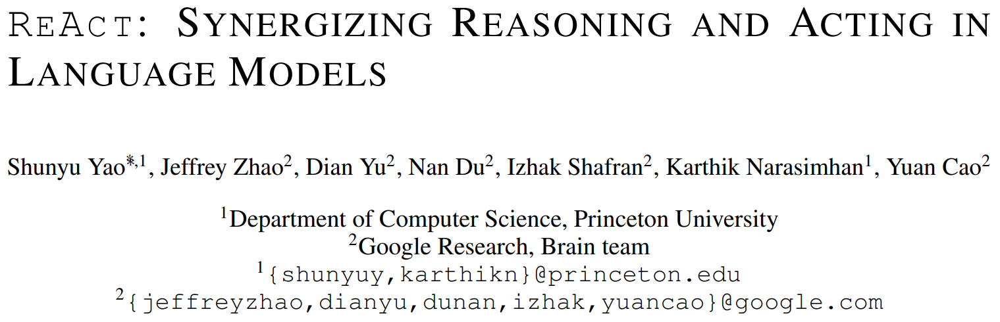
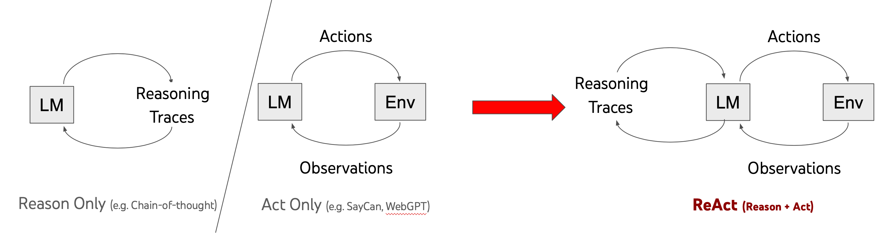
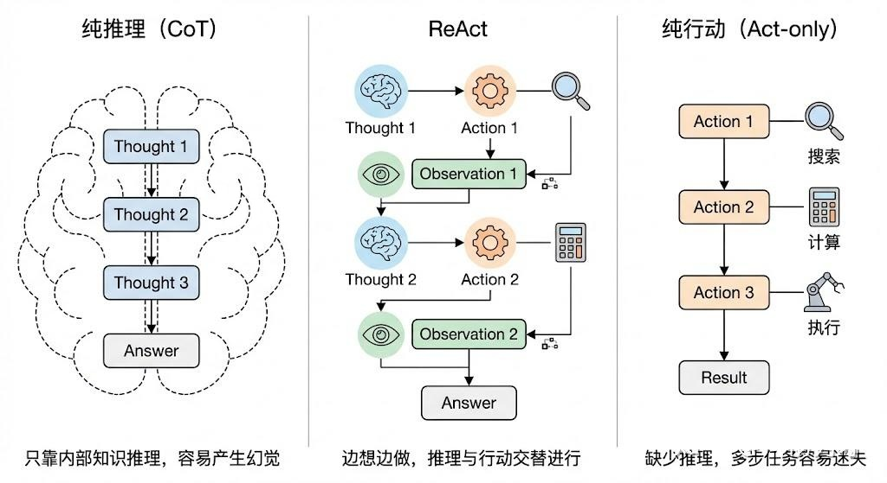
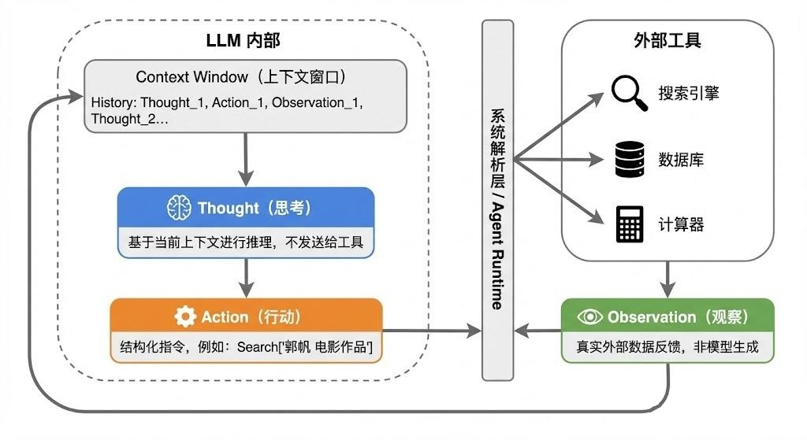
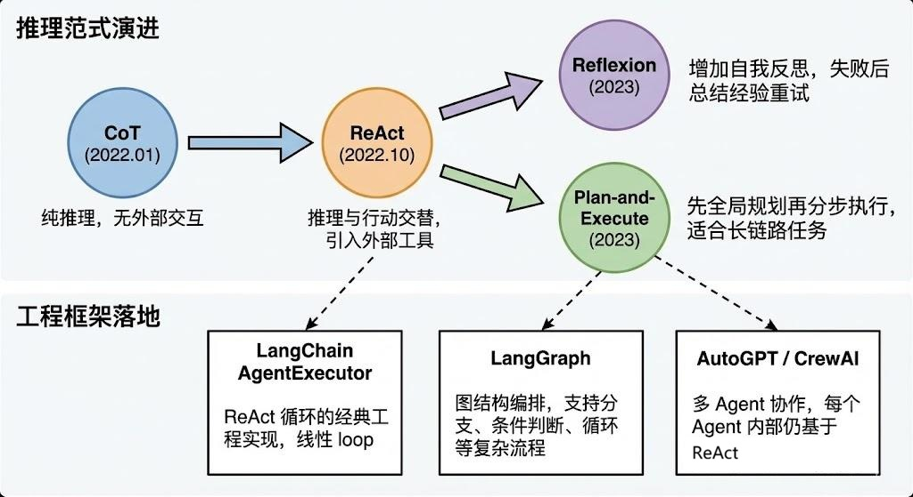

# ReAct：让大模型一边思考，一边行动

* [返回上层目录](../react.md)
* [前言](#前言)
* [一句话理解ReAct](#一句话理解ReAct)
* [ReAct的由来和核心思想](#ReAct的由来和核心思想)
* [ReAct的工作流程](#ReAct的工作流程)
* [ReAct的三个基本元素及其各自角色](#ReAct的三个基本元素及其各自角色)
  * [Thought](#Thought)
  * [Action](#Action)
  * [Observation](#Observation)
* [ReAct与Prompt工程的关系](#ReAct与Prompt工程的关系)
* [ReAct方法论](#ReAct方法论)
* [实验与结果分析](#实验与结果分析)
  * [知识密集型推理任务](#知识密集型推理任务)
  * [决策制定决策任务](#决策制定决策任务)
  * [微调的潜力](#微调的潜力)
* [ReAct的影响力与理解误区](#ReAct的影响力与理解误区)
  * [ReAct的影响力为何如此之大](#ReAct的影响力为何如此之大)
  * [ReAct的理解误区](#ReAct的理解误区)
* [ReAct的优势和局限](#ReAct的优势和局限)
  * [ReAct的优势](#ReAct的优势)
  * [ReAct的局限](#ReAct的局限)
* [ReAct在现代Agent框架中的演进](#ReAct在现代Agent框架中的演进)
* [为什么这篇论文值得反复读](#为什么这篇论文值得反复读)



- 论文：[ReAct: Synergizing Reasoning and Acting in Language Models](https://arxiv.org/abs/2210.03629)
- 项目页：[`react-lm.github.io`](https://react-lm.github.io/)

# 前言

如果要从 Agent 发展史里挑一篇绕不过去的论文，`ReAct` 一定在名单里。

2022 年 10 月，Shunyu Yao 等人在论文 [ReAct: Synergizing Reasoning and Acting in Language Models](https://arxiv.org/abs/2210.03629) 中提出了 ReAct。它的名字来自 `Reasoning + Acting`，核心观点非常直接：**大模型不应该只是“想”，也不应该只是“做”，而应该在思考与行动之间来回切换。**

今天我们看到的很多 Agent 系统，不管外面包着的是 `LangChain`、`LangGraph`、工作流编排，还是浏览器自动化，底层都还能看到 ReAct 的影子。

# 一句话理解ReAct

传统的大模型调用，往往是“一次输入，一次输出”：

```text
Question -> Answer
```

而 ReAct 把这个过程改造成一个循环：

```text
Thought -> Action -> Observation -> Thought -> Action -> Observation -> ...
```

也就是说，模型会先形成一个当前判断，再去执行一个动作，从外部环境拿回反馈，然后根据新信息继续思考，直到完成任务。

这就是 ReAct 最重要的价值：**把推理过程和外部交互连接起来。**

通过一个直观例子来感受ReAct：

假设问题是：

> 《奥本海默》的导演出生在哪个国家？

如果只让模型直接回答，它可能凭记忆给出答案，也可能答错。

ReAct 的过程更像这样：

```text
Question: 《奥本海默》的导演出生在哪个国家？
Thought: 先确定这部电影的导演是谁，再查导演的出生地。
Action: Search[Oppenheimer director]
Observation: The film was directed by Christopher Nolan.
Thought: 已经知道导演是 Christopher Nolan，接下来查询他的出生地。
Action: Search[Christopher Nolan birthplace]
Observation: Christopher Nolan was born in London, England.
Thought: London 位于 England，而 England 属于 the United Kingdom。
Action: Finish[英国]
```

这个例子很简单，但它很好地体现了 ReAct 的特点：**不是直接给答案，而是先查证，再推理，再收束。**

# ReAct的由来和核心思想



在 ReAct 之前，大模型已经展示出两类能力：

1. `Chain-of-Thought` （CoT，思维链）很擅长推理，能把复杂问题拆成中间步骤。
2. `Action-only` 风格的方法可以调用搜索、环境接口或执行动作。

但这两类能力各有明显短板。

如果只有推理，没有行动，模型很容易陷入“闭门造车”：它只能依赖参数里的知识和当前上下文，一旦题目需要最新信息、外部事实或多步检索，就容易产生幻觉。

如果只有行动，没有清晰推理，模型又容易变成“无头苍蝇”：会调用工具，但不知道为什么调用、下一步该做什么，也很难在中途纠错。

ReAct 的贡献就在这里。它不是简单地把“推理”和“工具调用”并排放在一起，而是让两者**交替发生、彼此修正**：

- 推理帮助模型决定下一步该做什么；
- 行动帮助模型拿到新的外部证据；
- 观察结果再反过来更新推理。

ReAct 的核心思想其实非常朴素：**让大模型像人一样，边想边做**。人在解决复杂问题的时候，不会先把所有事情想清楚再动手，也不会不过脑子就蛮干，而是想一步、做一步、看一步，根据每一步的反馈来调整下一步的计划。ReAct 就是把这种"交替进行推理和行动"的过程形式化了。

这套机制让模型不再是一次性吐出答案，而是更像一个会边查边想、边做边调整的执行者。



# ReAct的工作流程

ReAct 框架的名字本身就说明了一切：**Re**asoning + **Act**ing，推理加行动。它的工作流程可以用一个循环来概括：**Thought → Action → Observation → Thought → Action → Observation → ... → Finish**。

我们用一个具体例子来说明。假设用户问："《流浪地球》的导演还执导过哪些电影？这些电影中评分最高的是哪一部？"

这个问题对人来说不难，但需要分步骤完成。ReAct 的处理过程大致是这样的：

第一轮：

> - **Thought（思考）**：我需要先查一下《流浪地球》的导演是谁。
> - **Action（行动）**：调用搜索工具，搜索"流浪地球 导演"。
> - **Observation（观察）**：搜索结果返回——导演是郭帆。

第二轮：

> - **Thought（思考）**：好的，导演是郭帆。接下来我需要查一下郭帆还导演过哪些电影。
>   **Action（行动）**：调用搜索工具，搜索"郭帆 导演 电影作品"。
> - **Observation（观察）**：搜索结果返回——郭帆导演的电影有《流浪地球》《流浪地球2》《同桌的你》《李献计历险记》等。

第三轮：

> - **Thought（思考）**：现在我知道了他的作品列表，接下来需要比较这些电影的评分，找出最高的。
> - **Action（行动）**：调用搜索工具，搜索这些电影的评分信息。
> - **Observation（观察）**：返回评分数据。

第四轮：

> - **Thought（思考）**：根据评分数据，《流浪地球2》评分最高。我现在可以给出最终答案了。
> - **Action（行动）**：Finish，输出最终答案。

可以看到，整个过程中，模型的每一次行动都有明确的推理依据，每次获得新信息后都会重新思考下一步该怎么走。这就是 ReAct 的精髓——**推理指导行动，行动反馈推理，二者交替螺旋式推进，直到任务完成**。

# ReAct的三个基本元素及其各自角色

在 ReAct 的三元组中，每个部分承担着不同的职责：

## Thought

> **Thought** 是模型的"内心独白"，它不会被发送给外部工具，而是留在推理链中供模型自己参考。Thought 的作用非常关键，它负责分解任务、分析当前进度、决定下一步策略。可以说 Thought 就是 CoT 思维链在 ReAct 中的体现，它让模型的决策过程变得可解释、可追溯。

`Thought` 可以理解为当前这一步的思考。它不一定是完整答案，更像是：

- 问题拆解；
- 当前假设；
- 下一步计划；
- 对已有信息的整理。

例如，模型可能会先判断：“这个问题需要先确认人物身份，再查他的出生地。”

## Action

> **Action** 是模型与外部世界交互的桥梁。Action 通常是对某个外部工具的调用，比如搜索引擎、计算器、数据库查询、API 调用等。Action 的关键在于它是结构化的，通常包含工具名和调用参数，这样系统才能解析并执行。

`Action` 是模型对外部世界发起的操作。不同任务里的动作可以完全不同，比如：

- 搜索一个关键词；
- 查询知识库；
- 点击网页按钮；
- 调用 API；
- 与环境交互。

重点不在“动作长什么样”，而在于：**模型不再只待在文本里，而是开始接触外部环境。**

## Observation

> **Observation** 是外部环境给模型的反馈，也就是 Action 执行后返回的结果。Observation 不是模型生成的，而是真实的外部数据，这就保证了模型的推理过程是"接地气"的，基于真实信息而非臆想。

`Observation` 是动作执行后的反馈，也就是环境返回给模型的新信息。

这个反馈可能是一段搜索结果、一个页面状态、一条数据库记录，或者一次执行是否成功。模型随后会把这些信息并入上下文，进入下一轮 `Thought`。

这三者的协同关系，本质上构成了一个**闭环反馈系统**：Thought 基于当前上下文做出判断，Action 将判断转化为具体操作，Observation 将操作结果反馈回来更新上下文，然后新一轮的 Thought 再基于更新后的上下文继续推理。



# ReAct与Prompt工程的关系

在实际实现中，ReAct 的核心机制是通过精心设计的 Prompt 来驱动的。一个典型的 ReAct Prompt 模板大致包含以下几个部分：

```text
你是一个智能助手，可以使用以下工具来回答问题：
1. Search[query] - 搜索相关信息
2. Lookup[term] - 在文档中查找特定内容
3. Finish[answer] - 给出最终答案

请按照以下格式交替进行思考和行动：
Thought: 你的思考过程
Action: 工具名[参数]
Observation: 工具返回的结果
...（重复以上过程）
Thought: 我现在可以给出答案了
Action: Finish[最终答案]
```

通过这种 Prompt 模板，我们实际上是在用 few-shot 或 instruction 的方式"教会"大模型按照 Thought-Action-Observation 的固定格式来输出。模型生成到 Action 时，系统会截断模型输出、解析 Action 内容、调用相应工具、获取结果，然后将 Observation 拼接回上下文，再让模型继续生成下一轮的 Thought。

这也是为什么说 ReAct 是一个**框架**而非一个模型——它是一种组织大模型推理和行动的协议和流程，可以套用在任何足够强的大模型上。

# ReAct方法论

在这个框架下，我们将解决问题的 Agent 视为与环境交互的过程。 在时间步 $t$，Agent 接收到来自环境的观察  $o_t\in \mathcal{O}$，并根据当前的上下文 $c_t = \left( o_1, a_1, ... , o_{t-1}, a_{t-1}, o_t \right)$ 采取行动。

传统策略通常是学习一个映射 $\pi$，其中 $a_t \in \mathcal{A}$ 是外部动作空间（如`search[query]`, `click[button]`）。

ReAct 的核心创新在于扩充了动作空间：
$$
\hat{\mathcal{A}} = \mathcal{A} \cup \mathcal{L}
$$
其中 $\mathcal{L}$ 是语言空间。

**Thought：** $\hat{a}_t \in \mathcal{L}$。这是一个内部动作，不会影响外部环境，因此没有对应的观察反馈。它的作用是更新上下文 $c_{t+1} = (c_t, \hat{a}_t)$，帮助 Agent 整理思路、分解目标或提取关键信息。

**Action：** $\hat{a}_t \in \mathcal{A}$。这是外部动作，执行后环境会返回新的观察 $O_{t+1}$。

# 实验与结果分析

论文在两类不同的任务上进行了评估：知识密集型推理和交互式决策。

ReAct 主要通过 In-context Learning (Few-shot Prompting) 来实现，利用冻结参数的 LLM（论文中使用了 PaLM-540B，对比实验用了 GPT-3）。

Prompt 的构建非常直观：包含若干个人类编写的 `(Thought, Action, Observation)` 轨迹示例。

- **对于推理密集型任务（如 QA）**: 采用交替结构 `Thought -> Action -> Observation -> Thought ...`。
- **对于决策密集型任务（如玩游戏）**: Thought 不需要每一步都出现，可以让模型自主决定何时进行 Thought，实现稀疏推理。

## 知识密集型推理任务

这类任务要求模型回答多跳问题或验证事实。ReAct 被允许调用一个简单的 Wikipedia API（只有 Search, Lookup, Finish 三个动作）。

**对比基线**:

- Standard (标准 Prompt)
- CoT (思维链，纯推理)
- Act-only (纯行动，无 Thought)
- ReAct (本文方法)

**主要发现**:

1. **幻觉问题：**CoT 的主要失败模式是事实幻觉。因为它只能依靠内部参数记忆，无法访问外部数据。
2. **结构限制：**ReAct 的主要失败模式是推理错误。因为 ReAct 被强制要求与外部环境交互，有时这种结构约束会打断模型的推理流畅性。
3. **最佳策略 (ReAct + CoT-SC)：**论文提出了一种结合策略。由于 ReAct 擅长根据事实行动，而 CoT 擅长逻辑结构，因此可以让两者互补：

- Heuristic A：先试 ReAct，如果失败（没找到答案），退回到 Self-Consistency。
- Heuristic B：先试 CoT-SC，如果多个采样答案分歧大（模型不自信），则启用 ReAct 查证。
- **结果**: 这种组合在 HotpotQA 和 FEVER 上都取得了最佳性能。

## 决策制定决策任务

**ALFWorld：**基于文本的家庭环境模拟游戏（如“去客厅把所有灯关了”）。

- ReAct 的表现远超 Act-only（成功率 71% vs 45%）。
- **关键点：**在 Act-only 中，模型经常在长时间跨度任务中忘记“通过子目标 A 之后该干什么”，或者一旦失败就陷入死循环。ReAct 通过 Thought 显式地记录了状态（“我现在拿着钥匙，下一步该去找锁”）。

**WebShop：**模拟电商购物网站，需浏览网页并根据指令购买商品。

- ReAct 能够处理极其模糊的指令与具体商品选项之间的 Gap。
- 例子：用户要“适合户外的保护套”，ReAct 会推理出“这意味着我需要找材质耐用的、防水的选项”。

## 微调的潜力

论文还探索了微调。

- **Prompting：**在大模型（540B）上 ReAct 效果好，但在小模型上较难。
- **Fine-tuning：**使用 ReAct 生成的成功轨迹（包含 Thought）去微调较小的模型（PaLM-8B/62B）。
- **结论：**微调后的 ReAct 效果显著优于微调后的 CoT 或 Standard。

> 微调 CoT 本质上是在教模型“背诵”知识（容易过时/幻觉），而微调 ReAct 是在教模型一种“如何寻找信息并推理”的能力。

# ReAct的影响力与理解误区

## ReAct的影响力为何如此之大

站在今天回头看，ReAct 的影响力主要来自三个层面。

1、**它定义了 Agent 的基本循环**

很多后来者虽然名字不同，但核心结构几乎都还是：

```text
分析任务 -> 调用工具 -> 获取结果 -> 继续分析 -> 结束
```

这就是 ReAct 的思想延续。

2、**它让“工具使用”变得自然**

在 ReAct 之后，大家越来越习惯把大模型看作一个**推理中枢**，而不是一个封闭的回答器。搜索、数据库、浏览器、代码执行器、检索系统，都可以成为它的“手”和“眼”。

3、**它提升了可解释性**

相比“直接给最终答案”的黑盒方式，ReAct 至少能让人看到任务是怎么一步步推进的：模型为什么查这个、为什么换方向、最后为什么结束。

这并不意味着它完全透明，但至少更容易调试，也更容易定位错误出在哪一轮。

## ReAct的理解误区

理解 ReAct 时，一个常见误区是把它当成某个具体框架。

其实不是。

ReAct 首先是一种**方法范式**，而不是某个固定库或某段复杂工程代码。论文里的核心实现思路并不复杂，本质上就是通过 prompt 设计，让模型按 `Thought / Action / Observation` 的节奏输出，并在每次 `Action` 后把环境返回的 `Observation` 拼接回上下文。

也正因为它足够简单，后来各种框架才能很自然地把它吸收进去。

# ReAct的优势和局限

## ReAct的优势

ReAct 的优势主要体现在三个方面：

1、**可解释性强**

因为每一步行动之前都有明确的推理过程，出了问题可以回溯到具体是哪一步的思考出了偏差；

2、**减少幻觉**

通过调用外部工具获取真实数据，而不是让模型凭空编造，大大提高了事实准确性；

3、**泛化能力好**

同一套 ReAct 框架可以对接不同的工具集，适用于问答、数据分析、代码生成等多种场景。

## ReAct的局限

虽然 ReAct 很重要，但它并不是万能解法，也有明显的局限性：

1、**效率问题**

每一轮 Thought-Action-Observation 都需要一次 LLM 调用加一次工具调用，对于简单任务来说开销过大；

2、**错误累积**

如果中间某一步的推理或工具调用出错，后续步骤可能会在错误的基础上越走越偏；

3、**对模型能力的依赖**

ReAct 需要模型有较强的指令遵循能力和格式控制能力，弱模型很容易输出不符合格式要求的内容导致解析失败。

4、**对提示格式和动作设计比较敏感**

如果动作空间定义得不好，或者 prompt 约束不清晰，模型就可能频繁做出无效动作，甚至陷入循环。

5、**上下文会越来越长**

ReAct 每一轮都会把新的 `Thought`、`Action`、`Observation` 加进上下文。任务一长，成本、延迟和注意力负担都会增加。

6、**工具质量决定上限**

如果外部搜索本身质量差、返回结果噪声大，ReAct 也只是“更努力地使用一个不够好的工具”。

7、**它解决的是“边推理边交互”，不是所有 Agent 问题**

长期记忆、复杂规划、权限控制、多 Agent 协作、稳定执行，这些都不是 ReAct 单独能解决的。后来的很多 Agent 工程，实际上是在 ReAct 之上继续补这些能力。

# ReAct在现代Agent框架中的演进

在理解了 ReAct 的基本原理之后，还需要知道它在实际工程中的演进。现在主流的 Agent 框架基本都是在 ReAct 的基础上做了增强和扩展。

比如 LangChain 中的 AgentExecutor 就是 ReAct 的典型实现，它的 Agent 循环本质就是不断地让 LLM 生成 Thought 和 Action，然后执行工具获取 Observation，直到 LLM 输出 Final Answer。再比如更新的框架像 LangGraph，它把 ReAct 的线性循环扩展成了**图结构**，允许更复杂的分支和条件跳转，但底层的 Thought-Action-Observation 三元组逻辑依然没变。

另外还有一些变体和增强方案值得关注，比如 **Reflexion** 在 ReAct 的基础上加入了自我反思机制，当任务失败时模型会回顾整个推理过程并总结经验教训，下次再遇到类似问题时可以避免犯同样的错误。**Plan-and-Execute** 则是先做全局规划再分步执行，适合更长链路的复杂任务。



# 为什么这篇论文值得反复读

如果只看形式，ReAct 好像只是把几个标签排成了一个循环；但如果看得更深一点，它其实改变了我们对大模型的使用方式。

在 ReAct 之前，我们更容易把大模型理解成“更强的文本预测器”。

在 ReAct 之后，我们开始更认真地把它理解成一个可以：

- 分解任务；
- 选择动作；
- 获取反馈；
- 动态修正；
- 最终完成目标

的系统核心。

这也是为什么今天几乎所有 Agent 讨论里，都会隐含地回到这篇论文提出的问题：**模型应该如何在思考中行动，又如何在行动后继续思考？**

# 结语

如果要用一句话总结 ReAct，那就是：

> ReAct 的价值，不是让模型“会用工具”这么简单，而是让模型学会在推理过程中使用工具、利用反馈、修正路径，并最终把“想法”变成“行动”。

从这个意义上说，ReAct 不是一篇已经过时的老论文，反而仍然是理解 Agent 系统最好的起点之一。

# 参考资料

- [LLM Agent读书笔记：ReAct Synergizing Reasoning and Acting in Language Models](https://zhuanlan.zhihu.com/p/701036143)
- [重读 ReAct 论文：LLM Agent 的开山之作](https://zhuanlan.zhihu.com/p/1986190160241644560)

- [京东大模型二面：请详细解释 ReAct 框架。它是如何将思维链和行动结合起来，以完成复杂任务的？](https://zhuanlan.zhihu.com/p/2015455438410380393)

本文主要参考和复制这三篇知乎博客的内容。

===

ReAct的代码实现参考了：

* [第四章 智能体经典范式构建](https://mp.weixin.qq.com/s/CUhLAL6q28gY81YkMlGisg)

