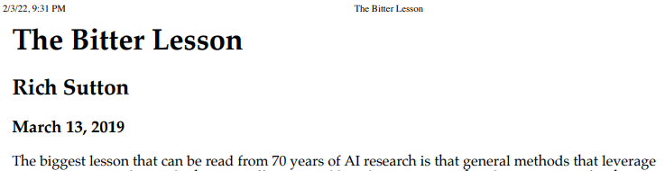

# The Bitter Lesson惨痛的教训

- [返回上层目录](../paper.md)

paper：[The Bitter Lesson](https://www.cs.utexas.edu/~eunsol/courses/data/bitter_lesson.pdf) 或者 [The Bitter Lesson](http://www.incompleteideas.net/IncIdeas/BitterLesson.html)

一句话总结：

**惨痛的教训：利用计算的人工智能方法最终是最有效的**

> 我认为所有做AI的人都应该熟读这篇文章。“The bitter lesson” 说的事情是，长期来看，AI领域所有的奇技淫巧都比不过强大的算力夹持的通用的AI算法（这里“强大的算力”隐含了大量的训练数据和大模型）。某种意义上，强大的算力夹持的通用的AI算法才是AGI路径的正道，才是AI技术真正进步的方向。从逻辑主义，到专家系统，到SVM等核方法，到深度神经网络，再到现在的大语音模型，莫不过此。[为什么 OpenAI 可以跑通所有 AGI 技术栈？](https://www.zhihu.com/question/644486081/answer/3398751210)
>
> 尽管研究者期望依靠人类领域知识在短期内实现突破，从长远来看，计算能力的有效利用才是关键。这两种方法理论上并不对立，但在实践中经常出现冲突，投入资源于一方往往意味着牺牲另一方。人们对某一方法的偏好往往基于心理上的坚持，而基于人类知识的方法容易使程序复杂化，难以充分利用计算力。

[The Bitter Lesson: AI methods that leverage computation are ultimately the most effective](https://zhuanlan.zhihu.com/p/678987185)

这是Rich Sutton（《Reinforcement Learning: An Introduction》作者之一）在2019年写的一篇博文。如今LLM的发展再一次验证了他的观点。

Rich Sutton的核心观点是：我们从过去70年AI研究中得到的最大教训是**基于计算的通用方法**是最有效的，并且远远优于基于人类经验的方法。

他认为在过去的每个时代，AI研究者都在基于“算力有限”的假设在做研究。在算力有限的情况下，提升AI模型效果的唯一办法就是加入**人类经验**。基于人类经验的方法短期有效，**但长期来看会被基于更大算力的简单方法轻易打败**。基于大算力的简单方法就是Rich Sutton核心观点中提到的“基于计算的通用方法”。

原文中举了一些例子。在国际象棋中，基于大算力的搜索方法击败了试图利用人类经验的方法；在语音识别中，基于深度学习的端到端方法大幅优于基于人类专家提取特征的方法；等等。原文是2019年写的，所以没有提及大语言模型。但大语言模型恰好是“基于计算的通用方法是最有效的”的极致体现。

如果历史总是这样重复，是不是意味着研究者们应该花更多时间去研究基于**计算的通用方法**，而不是基于人类经验的**improvement**？换言之，我们需要长期的insight，而不是短期的trick。但AI的研究始终在犯相同的错误，包括现在。

[听说OpenAI工程师必背的经典：The Bitter Lesson（苦涩的教训）--理查德·萨顿（ Richard S. Sutton ）](https://zhuanlan.zhihu.com/p/683308438)

在过去年的人工智能研究历程中，一个显著的教训浮现：那些能够充分发挥计算力的通用方法最终能够取得显著的成功。这一现象背后的驱动力是摩尔定律，即计算成本的持续指数级下降。大多数AI研究基于这样一个前提：智能体可利用的计算资源是固定的，在这种情况下，提升性能的主要途径是人类知识的应用。然而，随着时间推移，原本超出一般科研项目周期的庞大计算资源终将变为现实。尽管研究者期望依靠人类领域知识在短期内实现突破，从长远来看，计算能力的有效利用才是关键。这两种方法理论上并不对立，但在实践中经常出现冲突，投入资源于一方往往意味着牺牲另一方。人们对某一方法的偏好往往基于心理上的坚持，而基于人类知识的方法容易使程序复杂化，难以充分利用计算力。

许多AI研究者在项目后期才意识到这一点，通过回顾几个突出的例子，我们可以获得宝贵的启示。例如，在计算机国际象棋领域，1997年战胜世界冠军卡斯帕罗夫的深度搜索策略表明，简单但广泛的搜索方法结合专门的硬件和软件极为有效，让那些依赖人类棋局结构理解的研究者感到失望。他们未能接受这种“暴力”搜索策略的成功，坚称它并非普适策略，也不符合人类下棋的方式。计算机围棋研究的发展模式与此类似，只是比国际象棋研究晚了20年。最初，研究者试图避免通过搜索来解决问题，而是利用对围棋特有性质的理解，但这些努力在面对大规模搜索的有效应用时显得微不足道。

在语音识别领域，20世纪70年代DARPA赞助的竞赛中，采用基于统计的方法，如隐马尔可夫模型（HMMs），执行大量计算的方法取得了胜利，引发了自然语言处理领域的重大转变。深度学习方法的兴起进一步证明了少依赖人类知识、更多利用计算资源进行大规模数据训练的有效性。

从这些历史观察中，我们应当学习到的是：长期来看，试图构建符合我们对思维方式的主观想象的系统是行不通的。AI研究应该转向那些能够发现并捕捉外部世界无穷复杂性的通用方法，即搜索和学习，这些方法能够有效地扩展计算能力的利用。我们应当停止尝试将心智的内容简单化，转而构建能够探索和理解这些复杂性的系统。这就要求我们不是将已知的内容硬编码到系统中，而是让AI智能体能够像我们一样进行发现，从而深化我们对心智过程本身的理解。

# 参考资料

* [The Bitter Lesson: AI methods that leverage computation are ultimately the most effective](https://zhuanlan.zhihu.com/p/678987185)

本文参考了此知乎博客。

* [听说OpenAI工程师必背的经典：The Bitter Lesson（苦涩的教训）--理查德·萨顿（ Richard S. Sutton ）](https://zhuanlan.zhihu.com/p/683308438)

本文参考了此知乎博客。

# 附录

## 全文翻译

**The Bitter Lesson**

Rich Sutton

March 13, 2019

从70年的人工智能研究中可以读出的最大教训是，利用计算的通用方法最终是最有效的，而且效果远远超过其他方法。究其根本原因，是摩尔定律，或者说是计算单位成本持续指数级下降的普遍化。大多数人工智能研究都是假设代理可用的计算资源是恒定的（在这种情况下，利用人类知识是提高性能的唯一方式之一），但是，比典型研究项目稍长一些的时间后，不可避免地会有大量更多的计算资源变得可用。寻求短期内的改进，研究人员寻求利用他们对领域的人类知识，但从长远来看，真正重要的是利用计算能力。这两种方法不必相互对立，但在实践中它们往往是这样。投入到一种方法上的时间就不能投入到另一种方法上。对一种方法或另一种方法的投资有心理上的承诺。而且，基于人类知识的方法往往会使方法复杂化，使它们不适合利用通用计算方法。有许多例子表明人工智能研究人员迟迟才学到这个苦涩的教训，回顾其中一些最突出的例子是有益的。

在计算机国际象棋中，1997年击败世界冠军卡斯帕罗夫的方法是基于大规模、深度搜索的。当时，这被大多数计算机国际象棋研究人员视为沮丧，他们追求的是利用人类对国际象棋特殊结构的理解的方法。当一个更简单、基于搜索的方法配合特殊硬件和软件被证明远更有效时，这些基于人类知识的国际象棋研究人员并不是好输家。他们说，“蛮力”搜索可能这次赢了，但它不是通用策略，而且无论如何，这不是人们下棋的方式。这些研究人员希望基于人类输入的方法获胜，当它们没有获胜时，他们感到失望。

在计算机围棋中，看到了类似的研究进展模式，只是晚了20年。巨大的初始努力投入到避免搜索中，利用人类知识或游戏的特殊特征，但一旦在大规模上有效应用搜索，所有这些努力都被证明是无关紧要的，甚至更糟。同样重要的是通过自我对弈学习价值函数的使用（就像在许多其他游戏甚至国际象棋中一样，尽管学习在1997年首次击败世界冠军的程序中并没有扮演重要角色）。自我对弈学习，以及一般的学习，就像搜索一样，它使得大规模的计算得以应用。搜索和学习是利用大规模计算的两个最重要的技术类别。在计算机围棋中，像在计算机国际象棋中一样，研究人员的最初努力是利用人类理解（这样就需要更少的搜索），只有在后来，通过拥抱搜索和学习，才取得了更大的成功。

在语音识别中，有一个早期的比赛，由DARPA在1970年代赞助。参赛者包括许多特殊方法，这些方法利用了人类知识——对单词、音素、人类声道等的知识。另一方面，更新的方法在性质上更统计，并且做了更多的计算，基于隐马尔可夫模型（HMMs）。同样，统计方法战胜了基于人类知识的方法。这导致了所有自然语言处理领域几十年来的重大变化，统计和计算逐渐主导了这个领域。深度学习在语音识别中的最近兴起是这一持续方向的最新步骤。深度学习方法更少依赖于人类知识，并且使用更多的计算，结合在巨大的训练集上的学习，以产生戏剧性更好的语音识别系统。像在游戏一样，研究人员总是试图制造出他们认为像他们自己的思维一样工作的系统——他们试图将这种知识放入他们的系统中——但最终证明这是适得其反的，是巨大的浪费时间，当通过摩尔定律，大规模计算变得可用并且找到了有效利用它的方法时。

在计算机视觉中，也有类似的模式。早期的方法将视觉视为寻找边缘，或广义圆柱体，或以SIFT特征为术语。但现在所有这些都被抛弃了。现代深度学习神经网络只使用卷积的概念和某些类型的不变性，并且表现得更好。

这是一个大教训。作为一个领域，我们仍然没有完全学会它，因为我们继续犯同样的错误。要看到这一点，并有效地抵制它，我们必须理解这些错误的诱惑。我们必须学会苦涩的教训，即构建我们认为我们如何思考的方式在长远来看是行不通的。苦涩的教训基于历史观察：1)人工智能研究人员经常试图将知识构建到他们的代理中，2)这在短期内总是有帮助的，并且对研究人员个人来说是令人满意的，但3)从长远来看，它会导致进步停滞甚至阻碍进一步的进展，4)突破性的进步最终是通过基于搜索和学习的计算扩展方法实现的。最终的成功带有苦涩，并且往往没有被完全消化，因为它是对抗一个受青睐的、以人类为中心的方法的成功。

从苦涩的教训中应该学到的一件事是通用方法的巨大力量，这些方法即使在可用计算变得非常大时也能继续扩展。似乎可以任意扩展的两种方法是搜索和学习。

从苦涩的教训中学到的第二个普遍观点是，心灵的实际内容极其、不可挽回地复杂；我们应该停止寻找思考心灵的简单方式，比如思考空间、物体、多个代理或对称性的简单方式。所有这些都是任意的、固有复杂的外部世界的一部分。它们不应该被内置，因为它们的复杂性是无尽的；相反，我们应该只内置可以找到和捕捉这种任意复杂性的元方法。这些方法的关键是它们可以找到好的近似值，但寻找它们应该由我们的方法来完成，而不是由我们来完成。我们希望AI代理能够像我们一样发现，而不是包含我们已经发现的东西。内置我们的发现只会让看到发现过程如何完成变得更加困难。

## 英文全文

**[The Bitter Lesson](http://www.incompleteideas.net/IncIdeas/BitterLesson.html)** 

Rich Sutton

March 13, 2019 

The biggest lesson that can be read from 70 years of AI research is that general methods that leverage computation are ultimately the most effective, and by a large margin. The ultimate reason for this is Moore's law, or rather its generalization of continued exponentially falling cost per unit of computation. Most AI research has been conducted as if the computation available to the agent were constant (in which case leveraging human knowledge would be one of the only ways to improve performance) but, over a slightly longer time than a typical research project, massively more computation inevitably becomes available. Seeking an improvement that makes a difference in the shorter term, researchers seek to leverage their human knowledge of the domain, but the only thing that matters in the long run is the leveraging of computation. These two need not run counter to each other, but in practice they tend to. Time spent on one is time not spent on the other. There are psychological commitments to investment in one approach or the other. And the human-knowledge approach tends to complicate methods in ways that make them less suited to taking advantage of general methods leveraging computation.  There were many examples of AI researchers' belated learning of this bitter lesson, and it is instructive to review some of the most prominent.

In computer chess, the methods that defeated the world champion, Kasparov, in 1997, were based on massive, deep search. At the time, this was looked upon with dismay by the majority of computer-chess researchers who had pursued methods that leveraged human understanding of the special structure of chess. When a simpler, search-based approach with special hardware and software proved vastly more effective, these human-knowledge-based chess researchers were not good losers. They said that ``brute force" search may have won this time, but it was not a general strategy, and anyway it was not how people played chess. These researchers wanted methods based on human input to win and were disappointed when they did not.

A similar pattern of research progress was seen in computer Go, only delayed by a further 20 years. Enormous initial efforts went into avoiding search by taking advantage of human knowledge, or of the special features of the game, but all those efforts proved irrelevant, or worse, once search was applied effectively at scale. Also important was the use of learning by self play to learn a value function (as it was in many other games and even in chess, although learning did not play a big role in the 1997 program that first beat a world champion). Learning by self play, and learning in general, is like search in that it enables massive computation to be brought to bear. Search and learning are the two most important classes of techniques for utilizing massive amounts of computation in AI research. In computer Go, as in computer chess, researchers' initial effort was directed towards utilizing human understanding (so that less search was needed) and only much later was much greater success had by embracing search and learning.

In speech recognition, there was an early competition, sponsored by DARPA, in the 1970s. Entrants included a host of special methods that took advantage of human knowledge---knowledge of words, of phonemes, of the human vocal tract, etc. On the other side were newer methods that were more statistical in nature and did much more computation, based on hidden Markov models (HMMs). Again, the statistical methods won out over the human-knowledge-based methods. This led to a major change in all of natural language processing, gradually over decades, where statistics and computation came to dominate the field. The recent rise of deep learning in speech recognition is the most recent step in this consistent direction. Deep learning methods rely even less on human knowledge, and use even more computation, together with learning on huge training sets, to produce dramatically better speech recognition systems. As in the games, researchers always tried to make systems that worked the way the researchers thought their own minds worked---they tried to put that knowledge in their systems---but it proved ultimately counterproductive, and a colossal waste of researcher's time, when, through Moore's law, massive computation became available and a means was found to put it to good use.

In computer vision, there has been a similar pattern. Early methods conceived of vision as searching for edges, or generalized cylinders, or in terms of SIFT features. But today all this is discarded. Modern deep-learning neural networks use only the notions of convolution and certain kinds of invariances, and perform much better.

This is a big lesson. As a field, we still have not thoroughly learned it, as we are continuing to make the same kind of mistakes. To see this, and to effectively resist it, we have to understand the appeal of these mistakes. We have to learn the bitter lesson that building in how we think we think does not work in the long run. The bitter lesson is based on the historical observations that 1) AI researchers have often tried to build knowledge into their agents, 2) this always helps in the short term, and is personally satisfying to the researcher, but 3) in the long run it plateaus and even inhibits further progress, and 4) breakthrough progress eventually arrives by an opposing approach based on scaling computation by search and learning. The eventual success is tinged with bitterness, and often incompletely digested, because it is success over a favored, human-centric approach.

One thing that should be learned from the bitter lesson is the great power of general purpose methods, of methods that continue to scale with increased computation even as the available computation becomes very great. The two methods that seem to scale arbitrarily in this way are *search* and *learning*.

The second general point to be learned from the bitter lesson is that the actual contents of minds are tremendously, irredeemably complex; we should stop trying to find simple ways to think about the contents of minds, such as simple ways to think about space, objects, multiple agents, or symmetries. All these are part of the arbitrary, intrinsically-complex, outside world. They are not what should be built in, as their complexity is endless; instead we should build in only the meta-methods that can find and capture this arbitrary complexity. Essential to these methods is that they can find good approximations, but the search for them should be by our methods, not by us. We want AI agents that can discover like we can, not which contain what we have discovered. Building in our discoveries only makes it harder to see how the discovering process can be done.