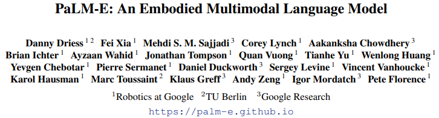

# PaLM-E: An Embodied Multimodal Language Model

* [返回上层目录](../llm-based-control.md)

paper: [PaLM-E: An Embodied Multimodal Language Model](https://palm-e.github.io/assets/palm-e.pdf)

github.io: [palm-e.github.io](https://palm-e.github.io/)

blog: [ai.googleblog.com](https://ai.googleblog.com/2023/03/palm-e-embodied-multimodal-language.html)

===

[620亿参数！谷歌发布史上最大“通才”AI模型，可让机器人更自主](https://baijiahao.baidu.com/s?id=1759791673785408077&wfr=spider&for=pc)

[中信计算机：谷歌发布多模态模型PaLM-E，智能化水平提升较大](https://baijiahao.baidu.com/s?id=1759961764975705843)

[谷歌推出PaLM-E，能超越ChatGPT么？](https://www.thepaper.cn/newsDetail_forward_22198823)

[OpenAI 发布 GPT-4，有哪些技术上的优化或突破？张俊林](https://www.zhihu.com/question/589639535/answer/2937928726)

**具身智能毫无疑问会是LLM下一阶段的重点研究方向。这方面的代表就是前阵子Google放出来的PaLM-E了**。目前的GPT 4，我们可以认为人类创造出了一个超级大脑，但还是把它封锁在GPU集群里。而这个超级大脑需要一个身体，GPT 4要和物理世界发生联系、交流和互动，并在物理世界中获得真实的反馈，来学会在真实世界里生存，并根据真实世界的反馈，利用比如强化学习来学习在世界游走的能力。这个肯定是最近的将来最热门的LLM研究方向。

