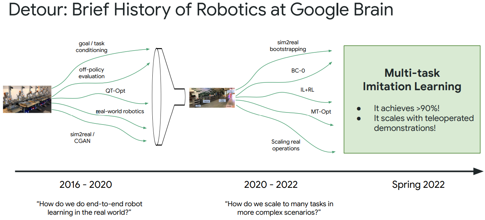

# Towards a Robotics Foundation Model

* [返回上层目录](../llm-based-control.md)

这是ML Collective协会的一次个人ML分享。

从ML Collective协会的[官网](https://mlcollective.org/dlct/)往下拉，在历史分享记录里，可以找到20230303讲的这次分享。

| 时间       | 分享人                   | 标题，相关材料                                               |
| ---------- | ------------------------ | ------------------------------------------------------------ |
| 2023.03.03 | Keerthana Gopalakrishnan | *Towards a Robotics Foundation Model* [[1\] ](https://arxiv.org/abs/2204.01691)[[3\] ](https://arxiv.org/abs/2209.09874)[[4\] ](https://arxiv.org/abs/2212.06817)[[5\] ](https://robot-moo.github.io/assets/moo.pdf)[[Slides\]](https://rosanneliu.com/dlctfs/dlct_230303.pdf) [[Recording\]](https://youtu.be/6Zoa_UZ_xQs) |

Slides中，有一张图：

分享者是谷歌大脑机器人团队的一位女工程师，其[博客](https://twitter.com/keerthanpg/status/1631837301239341057)写了关于本次分享：

> https://twitter.com/keerthanpg/status/1631837301239341057
>
> Today I gave a talk on "Towards a Foundation Model for Robotics" [@ml_collective](https://twitter.com/ml_collective) by invitation from [@savvyRL](https://twitter.com/savvyRL). The talk outlines recent developments in robot learning [@GoogleAI](https://twitter.com/GoogleAI) & a possible path towards building a robotics foundation model. Watch it here:

