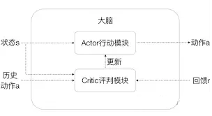

# 基于强化学习的控制

* [返回上层目录](../control.md)

===

[Science Robotics 预定？ETH最新四足“跑酷”](https://zhuanlan.zhihu.com/p/641918952)

23年6月26号，ETH在arxiv挂出了他们最新的论文，视频暂时还没有放出来。推测这篇应该是投了science robotics。

我们趁热打铁来分析一波这篇论文。

https://arxiv.org/pdf/2306.14874.pdf

“什么mpc和rl不实用，都是老一代思想”，mpc我不懂，rl在真实的运动控制上还是差的很远的。

我读博开始那会也是这么认为的，想想都觉得不靠谱，直到ETH的rl狗给所有做rl控制的人打了一剂强心针

eth基本上现在每年一篇science robotics，基本上都有用rl，算是现在四足rl标杆了。

谢谢分享，我还是第一次看到这个工作。RL做机器人我一直知道，做的最好的我以前以为是DeepMind的[Towards General and Autonomous Learning of Core Skills: A Case Study in Locomotion](https://arxiv.org/abs/2008.12228)。DeepMind这个工作没有任何MPC，他就靠设计一个多层次的reward function然后不断training就出来了。DeepMind一直是致力于通用智能，我觉得他们搞的hierarchical RL来做控制方向还是很对的。相比之下ETH这个结构复杂的多，还需要MPC和一堆传统控制用的方法，效果上来说似乎ETH的好一点（从地形上看）。但是似乎还是比不过波士顿动力的人工调的MPC。

来自：[在实际工程系统中，MPC太复杂，难以做到realtime。因此都利用数据，MPC对比RL还有优势么?](https://www.zhihu.com/question/402251886/answer/2449239868)

这个Actor Critic网络是不是颇有点控制中反馈的意味：

来自：[在实际工程系统中，MPC太复杂，难以做到realtime。因此都利用数据，MPC对比RL还有优势么?](https://www.zhihu.com/question/402251886/answer/1294806970)

[09-基于强化学习的固定翼无人机着陆飞行控制仿真](https://zhuanlan.zhihu.com/p/68960762)

其中使用的代码来自[deep-reinforcement-learning-drone-control](https://github.com/tobiasfshr/deep-reinforcement-learning-drone-control)。

[【重磅综述】如何在少量尝试下学习机器人强化学习控制](https://zhuanlan.zhihu.com/p/144544347)

