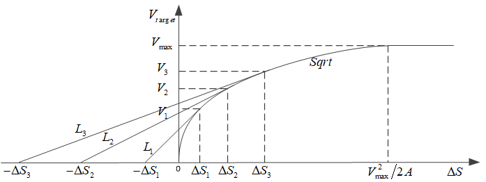
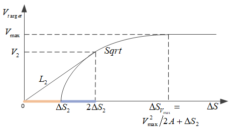

# 开方控制器sqrt-controller

* [返回上层目录](../pid-control.md)
* [开方控制器的原理](#开方控制器的原理)
* [路径控制器的参数 ](#路径控制器的参数 )
* [总结](#总结)

一句话解释开方控制器本质：

> 开方控制器就是一个变结构比例P控制器（线性加开方），如果只有开方的话，在误差为零的地方，斜率就为无穷大，不稳定，所以，要零误差点附近要加入线性控制器，这样的代价就是速度要提前减速，不能像Bang-Bang控制那样达到时间最优了，也就是说，为了控制的稳定性，牺牲了一些时间。稳定性和快速性的折衷而已。

开方控制器用于位置/角度控制器中，给出速度/角速度设定值。开方控制器采用平方根曲线和直线相结合，兼顾了位置/姿态控制中对快速性和精确性的要求。

为了方便，下面只以位置控制器来理解开方控制器，角度和位置其实是一样的。

# 开方控制器的原理

下面介绍开方控制器, 根据$\Delta s$如何得到合理的$V_{target}$。 

设定位置和实际位置的偏差$\Delta S$较大时，受控设备应该以允许的最大速度$V_{max}$运行，满足位置控制的快速性。受控设备以$V_{max}$的速度行进向设定位置靠近，$\Delta S$逐渐减小,为了能准确停在设定位置处，合理选择路径控制器成为关键。位置控制器的功能是**根据$\Delta S$的变化改变速度设定值$V_{target}$，以满足对位置控制精确性和快速性的要求**。 

当$\Delta S$小于一定值时,受控设备开始减速,减速过程中的最大加速度由最大加速度$A$决定。 

由匀加速运动公式（这里假设场景为以最大减速度的匀减速运动）
$$
v_1^2-v_2^2=2as
$$
其中，式中$v_1$为起始速度，$v_2$为结束速度，$a$为加速度，$s$为经过的距离。

位置控制的结束速度为0 , 得到
$$
V_{target}^2=2A\Delta S
$$
所以，可算出$\Delta S$减小到$\frac{V_{max}^2}{2A}$后，就要开始以最大减速度做匀减速运动了，然后之后输出的期望速度$V_{target}$就会被时刻更新为$V_{target}=\sqrt{2A\Delta S}$。

由上述原理，位置控制器采用平方根曲线，如下图所示。

采用平方根曲线做位置控制器的缺点：

* 从上图中可以看出，速度开始减小以后，曲线的斜率逐渐增加，当$\Delta S$很小时，曲线变得非常陡，这对位置控制是不利的，使得实际位置容易产生超调；

* 当$\Delta S=\frac{V_{max}^2}{2A}$时，才开始减速。假定速度开始减小后的某一时刻，期望速度为$V_{target\_t}$，期望位置和实际位置的偏差$\Delta S=\frac{V_{target\_t}^2}{2A}$。由于某种原因，受控设备的实际速度$V_{actual\_t}$大于$V_{target\_t}$，则停车需要的距离$S_{stop}=\frac{V_{actual\_t}^2}{2A}>\Delta S$（由于加速度已经是最大了，不能更大了，所以$S_{stop}>\Delta S_t$）。当速度减为0时，实际位置会发生超调，因此这时候需要以更大的加速度减速，但最大加速度$A$已经是最大了。 

由于以上原因，当$\Delta S$较小时，位置控制器可以采用直线，如下图所示。 

上图中，当$\Delta S$小于$\Delta S_2$时，位置控制器采用直线$L_2$，直线$L_2$和平方根曲线Sqrt​相切于$(\Delta S_2, v_2)$。直线$L_2$的斜率为$k_2$，这样当$\Delta S$小于$\Delta S_2$时，位置控制器曲线的斜率恒定，不会继续增大，此时需要的加速度也会随着距离$\Delta S$而线性减小，为什么呢？证明如下：

速度$V$和距离$\Delta S$的斜率关系为：
$$
\begin{aligned}
&V^2-0^2=2aS\\
\Rightarrow&V=\sqrt{2aS}\\
\Rightarrow&\frac{\part V}{\part S}=\frac{\frac{1}{2}\cdot 2a}{\sqrt{2aS}}=\sqrt{\frac{a}{2S}}\\
\end{aligned}
$$
可得，当速度$V$和距离$\Delta S$的斜率保持不变时，加速度$a$随着距离$S$的减小而**线性减小**，当距离$S$为0时，加速度$a$也为0。

## 计算直线L的方程

下面计算直线$L$的方程

首先计算直线和曲线切线相交处的斜率。

在相切点$(\Delta S_2, v_2)$处，$V_2=\sqrt{2A\Delta S_2}$。

对曲线Sqrt（即$V_{target}=\sqrt{2A\Delta S}$）求导得到其斜率为$\frac{1}{2}\sqrt{\frac{2A}{\Delta S}}$，则在相切点$(\Delta S_2, v_2)$处曲线Sqrt的斜率为
$$
\begin{aligned}
\frac{1}{2}\sqrt{\frac{2A}{\Delta S_2}}&=\frac{1}{2}\frac{\sqrt{2A}}{\sqrt{\Delta S_2}}=\frac{1}{2}\frac{\sqrt{2A}}{\frac{V_2}{\sqrt{2A}}}=\frac{1}{2}\frac{2A}{V_2}\\
&=\frac{A}{V_2}
\end{aligned}
$$
因此，在相切点$(\Delta S_2, V_2)$处与曲线Sqrt相切的直线$L_2$的斜率$k_2$与曲线Sqrt在该点的斜率相同，即
$$
k_2=\frac{1}{2}\sqrt{\frac{2A}{\Delta S_2}}=\frac{A}{V_2}
$$
现在计算$L_2$的直线方程，假设为
$$
\begin{aligned}
V_{target}&=k_2\Delta S+b\\
&=\frac{A}{V_2}\Delta S+b
\end{aligned}
$$
$L_2$要通过相切点$(\Delta S_2, V_2)$，把该点带入直线$L_2$的方程，因此可求出$b$：
$$
\begin{aligned}
&V_2=\frac{A}{V_2}\Delta S_2+b\\
\Rightarrow &b=V_2-\frac{A}{V_2}\Delta S_2\\
&=V_2-\frac{A}{V_2}\frac{V_2^2}{2A}\quad \text{given}\ V_2=\sqrt{2A\Delta S_2}\\
&=V_2-\frac{V_2}{2}\\
&=\frac{V_2}{2}\\
\end{aligned}
$$
因此，$L_2$的直线方程为
$$
\begin{aligned}
V_{target}&=k_2\Delta S+b\\
&=\frac{A}{V_2}\Delta S+b\\
&=\frac{A}{V_2}\Delta S+\frac{V_2}{2}
\end{aligned}
$$
## 计算直线和曲线的切点

现在求直线$L_2$和横坐标的交点。

令$V_{target}=0$，则
$$
\begin{aligned}
&0=\frac{A}{V_2}\Delta S+\frac{V_2}{2}\\
\Rightarrow&\Delta S=-\frac{V_2}{2}\cdot \frac{V_2}{A}=-\frac{V_2^2}{2A}\\
&=-\frac{2A\Delta S_2}{2A}\quad \text{given}\ V_2=\sqrt{2A\Delta S_2}\\
&=-\Delta S_2
\end{aligned}
$$
可知直线$L_2$和横坐标的交点为$(-\Delta S_2, 0)$。

直线$L_1$、$L_3$和$L_2$同理，直线$L_1$和平方根曲线Sqrt的交点为$(\Delta S_1, V_1)$，斜率为$k_1$，直线$L_3$和平方根曲线Sqrt的交点为 $(\Delta S_3, V_3)$，斜率为$k_3$。

## 得到开方控制器

直线$L_2$（$V_{target}=\frac{A}{V_2}\Delta S+\frac{V_2}{2}$）和纵坐标的交点为$(0,\frac{V_2}{2})$，即当$\Delta S=0$时，$V_{target}=\frac{V_2}{2}$，**这显然是不合理的**，将直线$L_2$和平方根曲线Sqrt沿横坐标方向向右平移$\Delta S_2$，如下图所示：

这样就得到了平方根曲线和直线相结合的路径控制器：
$$
\left\{\begin{matrix}
V_{target}=\sqrt{2A(\Delta S-\Delta S_2)} &V_{target}>V_2\\ 
V_{target}=\frac{A}{V_2}(\Delta S-\Delta S_2)+\frac{V_2}{2} &V_{target}\leqslant V_2
\end{matrix}\right.
$$
同时，用$V_{max}$对$V_{target}$进行限幅。

当$\Delta S < \Delta S_{V_{max}}$后，开始减速，$\Delta S_{V_{max}}=\frac{V_{max}^2}{2A}+\Delta S_2$。在$V_{target}$小于等于$V_2$后，曲线的斜率恒定。同时和下图

相比，提前开始减速，提前减速的距离为$\Delta S_2$。在减速过程中，如果实际速度和期望速度始终相同，则期望加速度等于最大加速度，即使出现实际速度和期望速度不同的情况，也可以增大或者减小加速度来进行调节。

# 计算ΔS2的值

这里假设已知直线的斜率为$k$。

**$\Delta S_2$是直线和曲线的切点的横坐标的一半**，则这里曲线的斜率等于直线的斜率$k$。而曲线的斜率计算公式由前面可知为$\frac{A}{V_2}$，则此时切点处的$V_2$的值为
$$
\begin{aligned}
&k=\frac{A}{V_2}\\
\Rightarrow &V_2=\frac{A}{k}
\end{aligned}
$$
则根据曲线方程可得到$\Delta S_2$：
$$
\begin{aligned}
&V=\sqrt{2A\Delta S}\\
\Rightarrow &\frac{A}{k}=\sqrt{2A\Delta S}\\
\Rightarrow &\Delta S=\frac{A^2}{k^2}\cdot \frac{1}{2A}=\frac{1}{2}\cdot A\cdot \frac{1}{k^2}\\
\Rightarrow &\Delta S_2=\Delta S=\frac{1}{2}\cdot A\cdot \frac{1}{k^2}
\end{aligned}
$$

# 位置控制器的参数

位置控制器的特性由以下参数确定:

* $V_{max}$（最大速度）和$A$（设定的最大加速度）；
* 平方根曲线到直线的切换点$(2\Delta S_2, V_2)$，$\Delta S_2$和$V_2$满足关系式$V_2=\sqrt{2A\Delta S_2}$。

根据调试过程中的实际情况，可以调整以上参数。如果在位置控制的过程中容易出现较大的超调，应适当减小$V _{max}$和$A$；如果位置控制过程太长需要加快定位过程，则应适当增大$V_{max}$和$A$。

在不改变$V_{max}$和$A$的情况下，可以调节切换点$(2\Delta S_2, V_2)$。如果在位置控制的过程中容易出现较大的超调，则应提前开始减速，比如将切换点调整为$(2\Delta S_3, V_3)$，即将前面多根直线的那张图中的直线$L_3$和平方根曲线Sqrt右移$\Delta S_3$作为位置控制器；如果需要加快定位过程或者在定位过程中速度变为0时还没达到设定值，则可以延后开始减速，比如将切换点调整为$(2\Delta S_1, V_1)$，即将直线$L_1$和平方根曲线Sqrt右移$\Delta S_1$作为位置控制器。 

# 总结

开方控制器就是一个变结构比例P控制器（线性加开方），如果只有开方的话，在误差为零的地方，斜率就为无穷大，不稳定，所以，要零误差点附近要加入线性控制器，这样的代价就是速度要提前$\Delta S$减速，不能像Bang-Bang控制那样达到时间最优了，也就是说，为了控制的稳定性，牺牲了一些时间。稳定性和快速性的折衷而已。

# 参考资料

* 论文《位置控制中速度设定值的给定方法》2013年发表在《自动化技术与应用》  

