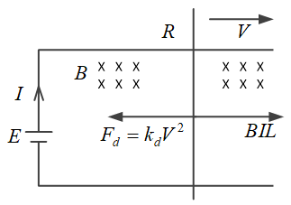
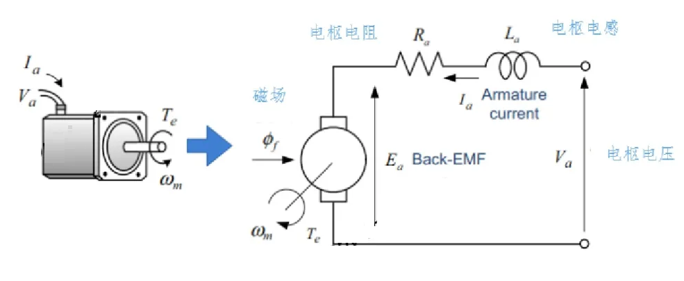

# 电机的原理

* [返回上层目录](../motor.md)

# 电机模型简化为切割磁力线的金属棒

我们把电机化简为一个带电源的切割磁感线的金属棒，即

其中，$B$为磁场强度，$E$为电源电压，$I$为电路中的电流，$L$为导体棒的切割磁场的有效长度，$V$为导体棒的速度。

导体棒的动力学模型为
$$
BIL-F_d=ma
$$
其中，$BIL$是安培力，即电流在磁场中会受到磁场力，用左手定则判断。$F_d$为空气阻力，计算式为$F_d=1/2 \rho V^2\cdot s\cdot C_d=k_d V^2$，而$k_d=1/2\rho\cdot s\cdot C_d$，这里$C_d$为导体棒的阻力系数。

继续细化上式：
$$
\begin{aligned}
&BIL-F_d=ma\\
\Rightarrow&B\frac{E-BLV}{R}L-k_dV^2=ma
\end{aligned}
$$
当导体棒达到受力平衡时，其加速度为0，安培力等于空气阻力，则根据上式，可得电源电压$E$和速度$V$的关系：
$$
\begin{aligned}
&B\frac{E-BLV}{R}L=k_dV^2\\
\Rightarrow&E-BLV=\frac{k_dR}{BL}V^2\\
\Rightarrow&E=\frac{k_dR}{BL}V^2+BLV\\
\end{aligned}
$$
即
$$
E=f(V)=\frac{k_dR}{BL}\cdot V^2+BL\cdot V
$$
而我们又知道，空气阻力
$$
\begin{aligned}
&F_d=1/2 \rho V^2\cdot s\cdot C_d=k_d V^2\\
\Rightarrow&
\left\{\begin{matrix}
V^2=\frac{F_d}{k_d}\\ 
V=\sqrt{\frac{F_d}{k_d}}
\end{matrix}\right.
\end{aligned}
$$
则电源电压$E$和空气阻力$F_d$的关系为：
$$
\begin{aligned}
&E=f(V)=\frac{k_dR}{BL}\cdot V^2+BL\cdot V\\
\Rightarrow&E=g(F_d)=\frac{k_dR}{BL}\cdot \frac{F_d}{k_d}+BL\cdot \sqrt{\frac{F_d}{k_d}}
\end{aligned}
$$
即
$$
E=g(F_d)=\frac{R}{BL}\cdot F_d+\frac{BL}{\sqrt{k_d}}\cdot \sqrt{F_d}
$$
假设把导体棒看成一个旋翼，则导体棒由于空气动力学产生的升力$F_l$为：
$$
\begin{aligned}
&F_l=1/2 \rho V^2\cdot s\cdot C_l=k_l V^2\\
\Rightarrow&
\left\{\begin{matrix}
V^2=\frac{F_l}{k_l}\\ 
V=\sqrt{\frac{F_l}{k_l}}
\end{matrix}\right.
\end{aligned}
$$
其中，$C_l$为旋翼的升力系数。

则电源电压$E$和导体棒由于空气动力学产生的升力$F_l$的关系为：
$$
\begin{aligned}
&E=f(V)=\frac{k_dR}{BL}\cdot V^2+BL\cdot V\\
\Rightarrow&E=h(F_l)=\frac{k_dR}{BL}\cdot \frac{F_l}{k_l}+BL\cdot \sqrt{\frac{F_l}{k_l}}
\end{aligned}
$$
即
$$
\begin{aligned}
E=h(F_l)&=\frac{k_dR}{k_lBL}\cdot F_l+\frac{BL}{\sqrt{k_l}}\cdot \sqrt{F_l}\\
&=\frac{R}{BL}/\frac{k_l}{k_d}\cdot F_l+\frac{BL}{\sqrt{k_l}}\cdot \sqrt{F_l}\\
&=\frac{R}{BL}/\frac{C_l}{C_d}\cdot F_l+\frac{BL}{\sqrt{k_l}}\cdot \sqrt{F_l}\\
&=\frac{R}{BL}/\frac{L}{D}\cdot F_l+\frac{BL}{\sqrt{k_l}}\cdot \sqrt{F_l}\\
&=\frac{R}{BL\cdot (L/D)}\cdot F_l+\frac{BL}{\sqrt{\frac{1}{2}\cdot \rho \cdot S\cdot C_l}}\cdot \sqrt{F_l}\\
\end{aligned}
$$
其中，$L/D$为旋翼（导体棒）的升阻比。

而电调给电机供电，电调的输入PWM波其实就是电压的占空比，即有效电压，简而言之，你可以把电调的输入PWM看成正比于电调的输出电压$E$，即有
$$
PWM=k_{E2PWM}\cdot E
$$
即PWM和旋翼推力$T$（即升力$F_l$）的关系为：
$$
PWM=k_{E2PWM}\cdot E=k_{E2PWM} \left[ \frac{R}{BL\cdot (L/D)}\cdot T+\frac{BL}{\sqrt{\frac{1}{2}\cdot \rho \cdot S\cdot C_l}}\cdot \sqrt{T} \right]
$$

# 直流电机动态模型

下图是直流电机的等效回路图：

**（1）电枢回路方程**

直流电机电枢绕组的电压方程可以表示为
$$
V_a=R_ai_a+L_a\frac{di_a}{dt}+e_a
$$
其中，$i_a$为绕组电流，$L_a$为绕组电压，$e_a$是反电动势。反电动势是电枢绕组在永磁体的磁场下旋转产生的。

**（2）反电动势方程**

当长度为$l$的导体在磁感应强度为$B$的次场内，以速度$v$运动时，会产生感应电压：
$$
e=Blv
$$
该电压被称为反电动势。我们从上式可粗略推导到电机的电枢绕组旋转时产生的反电动势：
$$
e=Blv=Blrw=lr\cdot B\cdot w
$$
其中，$r$为电枢绕组旋转半径。

而实际上，当电枢绕组导体以角速度$w_m$在磁通量为$\phi_f$下运动时，产生的反电动势为：
$$
e_a=k_e\phi_fw_m\quad\leftarrow(lr\cdot B\cdot w)
$$
其中，$k_e$是反电动势常数，对比可知，本质就是电枢绕组的线圈总长度和其旋转半径，其实意义和切割磁感线的金属棒的长度一样，也就是线圈绕组的构型，即其产生电流的能力。单位是$m^2$，通常，由于磁通量是常数，反电动势$e_a$正比于角速度$w_m$。

**（3）扭矩方程**

我们可通过电压$V_a$和反电动势$e_a$计算出电流$i_a$，从而可以获得直流电机的扭矩。

我们知道，当长度为$l$的导体棒在磁感应强度$B$的磁场内流过电流$i$，该导体将受到安培力的作用，作用力按下式计算，力的方向为左手定则：
$$
F=Bil
$$
我们把上式改造一下适配到电机电枢上，即把力变为扭矩：
$$
Fr=lr\cdot B\cdot i
$$
同理，在直流电机中，电枢载流导体在定子磁场的作用下，将产生扭矩：
$$
T_e=k_T\cdot \phi_f \cdot i_a\quad\leftarrow(Fr=lr\cdot B\cdot i)
$$
其中，$k_T$是扭矩常数，对比可知，本质就是电枢绕组的线圈总长度和其旋转半径，其实意义和切割磁感线的金属棒的长度一样，也就是线圈绕组的构型，即其产生电流的能力。单位是$m^2$。当使用国际单位制SI时，在数值上扭矩常数$k_T$和反电动势常数$k_e$相等。

对于直流有刷电机，碳刷和换向器保证了电枢电流$i_a$始终和磁通量$\phi_f$垂直。因此，直流有刷电机总是可以输出最大扭矩。

**（4）机械负载系统**

如果将直流电机与负载相连，直流电机根据上式产生的电磁转矩将驱动负载旋转，电机的旋转速度可以由下式决定：
$$
T_e=J\frac{dw_m}{dt}+B_vw_m+T_L
$$
其中，$w_m$为转子的机械角速度，$T_L$是负载扭矩，$J$是转动惯量，$B_v$是转子的旋转摩擦系数。

**（5）直流电机的稳态特性**

从上述4点，我们可得到直流电机的稳态和瞬态下的电流和速度等信息。

首先，让我们基于这些公式来研究转速和扭矩在稳态下的关系。

稳态是指电机的电流和速度已经稳定，分析直流电机的稳态可认为$di_a/dt=0$，$dw_m/dt=0$。根据上述4个公式，可得到稳态下的速度和扭矩关系：
$$
\begin{aligned}
T_e&=J\frac{dw_m}{dt}+B_vw_m+T_L\\
\Rightarrow T_e-T_L&=J\frac{dw_m}{dt}\quad (B_v\ \text{is very small, ignore it})\\
\Rightarrow k_T\cdot \phi_f \cdot i_a-T_L&=0\quad(\frac{dw_m}{dt}\ \text{is 0, }w_m\ \text{not change})\\
\Rightarrow k_T\cdot \phi_f \cdot \frac{V_a-e_a}{R_a}&=T_L\\
\Rightarrow k_T\cdot \phi_f \cdot \frac{V_a-k_e\phi_fw_m}{R_a}&=T_L\\
\Rightarrow \frac{k_T\cdot \phi_f}{R_a} \cdot V_a&=\frac{k_Tk_e\cdot \phi_f^2}{R_a}w_m+T_L\\
\end{aligned}
$$
对于负载力矩$T_L$，这里的场景是螺旋桨，所以，负载力矩其实就是螺旋桨旋转的阻力带来的力矩，即
$$
\begin{aligned}
T_L&=l_{\text{drag}}\cdot F_{\text{drag}}\\
&=\frac{2}{3}r_p\cdot F_{\text{drag}}\\
&=\frac{2}{3}r_p\cdot \frac{1}{2}\rho V^2\cdot S\cdot C_d\\
&=\frac{2}{3}r_p\cdot \frac{1}{2}\rho (w_m\cdot \frac{2}{3}r_p)^2\cdot S\cdot C_d\\
&=\frac{2}{3}r_p\cdot \frac{1}{2}\rho (\frac{2}{3}r_p)^2\cdot S\cdot C_d\cdot w_m^2\\
&=\frac{1}{2}\rho\cdot(\frac{2}{3}r_p)^3\cdot S\cdot C_d\cdot w_m^2\\
&=k_L w_m^2
\end{aligned}
$$
其中，

* $l_{\text{drag}}=2/3\cdot r_p$是假设了螺旋桨的阻力$F_{\text{drag}}$的等效作用点在螺旋桨半径$r_p$的$2/3$处，不一定准确，就是个大概意思，你可以自己改。计算阻力时出现的$2/3\cdot r_p$意思是，要通过旋翼的角速度来得到等效的旋翼速度，也选了$2/3$这个位置，你可以自己改。
* $k_L=\frac{1}{2}\rho\cdot(\frac{2}{3}r_p)^3\cdot S\cdot C_d$，是指阻力力矩和角速度之间的正比系数，这是和螺旋桨的性质相关。

所以外接电压和直流电机的旋转速度的关系是
$$
\begin{aligned}
\frac{k_T\cdot \phi_f}{R_a} \cdot V_a&=\frac{k_Tk_e\cdot \phi_f^2}{R_a}w_m+T_L\\
&=\frac{k_Tk_e\cdot \phi_f^2}{R_a}w_m+\frac{1}{2}\rho\cdot(\frac{2}{3}r_p)^3\cdot S\cdot C_d\cdot w_m^2\\
\end{aligned}
$$

现在我们计算电压和升力之间的关系，即
$$
F_{\text{lift}}=f(V_a)
$$
首先，我们需要知道$w_m$和$F_{\text{lift}}$的关系，
$$
\begin{aligned}
F_{\text{lift}}&=\frac{1}{2}\rho V^2\cdot S\cdot C_l\\
&=\frac{1}{2}\rho (w_m\cdot \frac{2}{3}r_p)^2\cdot S\cdot C_l\\
&=\frac{1}{2}\rho (\frac{2}{3}r_p)^2\cdot S\cdot C_l\cdot w_m^2\\
&=\frac{1}{2}\rho(\frac{2}{3}r_p)^2\cdot S\cdot C_l\cdot w_m^2\\
&=k_{\text{lift}} w_m^2
\end{aligned}
$$
可得
$$
\begin{aligned}
w_m^2&=\frac{F_{\text{lift}}}{k_{\text{lift}}}=\frac{F_{\text{lift}}}{\frac{1}{2}\rho(\frac{2}{3}r_p)^2\cdot S\cdot C_l}\\
w_m&=\sqrt{\frac{F_{\text{lift}}}{k_{\text{lift}}}}=\sqrt{\frac{F_{\text{lift}}}{\frac{1}{2}\rho(\frac{2}{3}r_p)^2\cdot S\cdot C_l}}\\ 
\end{aligned}
$$
将上式带入外接电压和直流电机的旋转速度的关系式中，可得外接电压和直流电机产生升力的关系：
$$
\begin{aligned}
\frac{k_T\cdot \phi_f}{R_a} \cdot V_a&=\frac{k_Tk_e\cdot \phi_f^2}{R_a}w_m+T_L\\
&=\frac{k_Tk_e\cdot \phi_f^2}{R_a}w_m+\frac{1}{2}\rho\cdot(\frac{2}{3}r_p)^3\cdot S\cdot C_d\cdot w_m^2\\
&=\frac{k_Tk_e\cdot \phi_f^2}{R_a}\sqrt{\frac{F_{\text{lift}}}{\frac{1}{2}\rho(\frac{2}{3}r_p)^2\cdot S\cdot C_l}}+\frac{1}{2}\rho\cdot(\frac{2}{3}r_p)^3\cdot S\cdot C_d\cdot \frac{F_{\text{lift}}}{\frac{1}{2}\rho(\frac{2}{3}r_p)^2\cdot S\cdot C_l}\\
&=\frac{k_Tk_e\cdot \phi_f^2}{R_a\sqrt{\frac{1}{2}\rho(\frac{2}{3}r_p)^2\cdot S\cdot C_l}}\sqrt{F_{\text{lift}}}+\frac{\frac{2}{3}r_p}{C_l/C_d}F_{\text{lift}}
\end{aligned}
$$
现在需要反过来，已知电压$V_a$，求升力$F_{\text{lift}}$

对于上式，进行化简，即
$$
\begin{aligned}
&\frac{k_T\cdot \phi_f}{R_a} \cdot V_a=\frac{k_Tk_e\cdot \phi_f^2}{R_a\sqrt{\frac{1}{2}\rho(\frac{2}{3}r_p)^2\cdot S\cdot C_l}}\sqrt{F_{\text{lift}}}+\frac{\frac{2}{3}r_p}{C_l/C_d}F_{\text{lift}}\\
\Rightarrow &a \cdot V_a=b\sqrt{F_{\text{lift}}}+cF_{\text{lift}}\\
\end{aligned}
$$
其中，
$$
\begin{aligned}
a&=\frac{k_T\cdot \phi_f}{R_a}\\
b&=\frac{k_Tk_e\cdot \phi_f^2}{R_a\sqrt{\frac{1}{2}\rho(\frac{2}{3}r_p)^2\cdot S\cdot C_l}}\\
c&=\frac{\frac{2}{3}r_p}{C_l/C_d}
\end{aligned}
$$

# 参考资料

* [切割磁感线为什么能产生电流？](https://baijiahao.baidu.com/s?id=1760508671839692793)
* [左手定则、右手定则各用来判别什么？怎么使用？](https://baijiahao.baidu.com/s?id=1760249872019153107)
* [电磁感应导体棒切割磁感线问题之有动力型](http://www.myliushu.com/8945.html)
* [电磁感应导体棒切割磁感线问题之无动力型](http://www.myliushu.com/8814.html)

上述资料帮助回忆高中所学内容。

* [直流电机数学模型及稳态曲线](https://zhuanlan.zhihu.com/p/471463515)

"直流电机动态模型"这一节参考了该知乎博客。

===

* [中学知识推导直流电机数学模型](https://blog.csdn.net/qq_34288751/article/details/115764525)

这个模型更简单，要是对电机不太懂，可以先看这个。

* [运动控制第一篇之直流电动机建模](https://blog.csdn.net/qq_17525633/article/details/103722184)

这个讲了怎么用传递函数在simulink中建模。

- [Copter: Voltage compensation to throttle/pwm is used in many places in motor output function, is it used repeatedly? #23575](https://github.com/ArduPilot/ardupilot/issues/23575)

这个Issue详细分析了曲线的来由和电机动力学模型。

