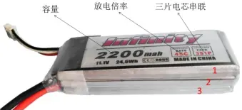

# 多旋翼组装选型

* [返回上层目录](../dynamic-system.md)
* [多旋翼各部件概述](#多旋翼各部件概述)
  * [机架](#机架)
  * [电机](#电机)
  * [锂电池](#锂电池)
  * [遥控器](#遥控器)
  * [GPS](#GPS)
* [组装选型](#组装选型)
  * [选型流程](#选型流程)
  * [GPS选择](#GPS选择)
  * [无刷电机的主要参数及选择](#无刷电机的主要参数及选择)
  * [遥控接收机选择](#遥控接收机选择)
  * [电子调速器的选择](#电子调速器的选择)
  * [电池的选择](#电池的选择)
  * [螺旋桨主要参数及选择](#螺旋桨主要参数及选择)
  * [电机与螺旋桨的搭配](#电机与螺旋桨的搭配)
  * [四轴无人机桨和轴距搭配](#四轴无人机桨和轴距搭配)
* [飞行时间估算](#飞行时间估算)

# 多旋翼各部件概述

## 机架

机架轴距：无人机轴距是指两个处于正对角位置的电机中心轴之间的距离，通常都是按照毫米计算，轴距越大代表无人机整体尺寸越大，能用的桨的尺寸也越大，对于新入门的玩家来说选择小于等于450毫米轴距的机架为宜，不宜选用轴距太大的机架。

## 电机

转速/KV值：有刷电机有些会标出转速，例如30000rpm @ 7.2V，意思则是7.2V时电机可以实现三万转每分钟的空载转速。无刷电机则常见是标KV值，无刷的KV值是无刷特有，是指电压每增加1V，电机的转速增加多少RPM。

电机四个数字的含义： 2216电机、4114电机等等，这表示电机的尺寸。不管什么牌子的电机，具体都要对应4位这类数字，其中前面2位是电机转子的直径，后面2位是电机转子的高度。注意，不是外壳。简单来说，前面2位越大，电机越肥，后面2位越大，电机越高。又高又大的电机，功率就更大，适合做大四轴。

2216/860KV电机

## 锂电池

常用的是3S、4S、6S，1S，最小是1S电池，代表3.7V电压，充满电为4.2V，放电后的单片保护电压为3.6V；S数越大，电池的电压越大。3S就是三片电芯串联起来电压为11.1V，充满电为12.6V，通常我们看到的3S1P 11.1V就是三片电芯串联起来电压为11.1V，6S2P则表示将两个六片锂电池串联的结构在并联，总电压为22.2V，电流是单个结构的两倍。P数越大，电池的电流越大。

容量：电池容量的单位是毫安时（mAh），即电池以某个电流可以持续放电一小时。

放电倍率：电池的放电能力用放电倍率（C）表示，即以电池的标示容量最大可以达到多少的放电电流。如图2200mAh电池45C放电倍率，即电池最大可以达到2.2A*45=99A的放电电流。

电池充电：航模锂电池充电必须用平衡充电器充电，非平衡充很容易导致电池过充。具体操作见厂商说明书

充电器的特性。

电池充电器主要有以下特性：

1、平衡电压测量分辨率，可以充分保护电池。

2、节能环保的再生放电功能，当使用汽车电瓶供电时，放电电流可反向给汽车电瓶充电。

3、超快平衡能力，平衡电流高达1000mA。

4、提供智能电源管理系统，可设置放电电流、电压限制和放电量告警，避免过度放电。

5、支持并联充电，在并联充电板的支持下，可同时给多块电池充电。

## 遥控器

一般按照通道数将遥控器分成四通道、六通道、七通道、八通道遥控器等,遥控器因为油门摇杆不同分为美国手和日本手，左手油门是美国手，右手油门是日本手。遥控器的无线电的常用频率是2.4GHz。遥控的距离跟天线和功率有关，与硬件及电路设计也有一定关系，有的控制距离小于500米、有的控制距离可以达到5公里甚至更远。常用遥控器品牌有富斯、华科尔、乐迪、天地飞、Futaba等

## GPS

测量多旋翼无人机当前的经纬度、高度、航迹方向、地速等信息。一般在GPS模块中还会包含地磁罗盘（三轴磁力计）：测量飞机当前的航向。

当GPS模块接收到的卫星数目越多时无人机的定位精度越高，这就是玩家常形容的“定钉子”。

市面上的GPS模块种类有多种，大部分成品的GPS模块都自带外置陀螺仪，用户可以根据飞控板的实际情况选择板载陀螺仪或者外置陀螺仪。GPS模块所用芯片的好坏决定了GPS的定位精度和搜星速度。常见的GPS模块型号有6M GPS、7M GPS、M8N GPS。

其中M8N GPS采用NEO-M8N芯片，能够同时获取和跟踪不同的全球导航卫星系统：GPS、 GLONASS或BEIDOU。和单一模式的6M或7M GPS相比具有更快的搜星速度、更多的搜星数量和更高的定位精度。搜星数量可以达到20颗，hdop(GPS定位精度因子，越小代表定位精度越高)可以达到0.5以下。

# 组装选型

## 选型流程

* 确认用途
* 要负载的重量和整机重量
* 机架选择（根据用途和整机重量及桨叶尺寸）
* 由整机重量选择电机（电机出厂就有明了的参数，选择电机时一定仔细阅读参数和询问店家并说出自已的组机情况）
* 根据电机参数配置电调和桨叶
* 根据飞行器耗能选择电池（电池的节数是根据电机电调选择）
* 飞控的选择（根据用途和个人经济）

## GPS选择

GPS模块和飞控相比，GPS模块的选择就很简单了，像DJ这类的闭源飞控厂家都会配备和飞控配套的GPS模块，选购飞控时GPS模块会和飞控一起出售。

开源飞控可选购的GPS模块主要有三类，分别为6M GPS模块、 7M GPS模块、M8N GPS模块。它们的性能由髙到低顺序是M8N>7M>6M。

它们的区别主要在于搜星数和搜星速度。搜星数越多代表GPS模块的定位精度就越高，反映到无人机上就是飞机的定位飘移就越小。这种可以选购的GPS模块一般都会附带外置罗盘，可以在地面站中选择使用飞控板的板载罗盘或者外置罗盘。

## 无刷电机的主要参数及选择

无刷电机的主要参数及选择如下：

1、电机型号：如2212,3508,4010，这些数字分别表示电机定子的直径和高度，单位是毫米。前两位数字越大，表示电机直径大扭矩大；后两位数字越大，表示电机越高平衡越好。又胖又高的电机扭矩大、效率高、价格也偏贵。

2、电机KV值：KV值是指每增加1V电压，电机每分钟增加的空转转数。例如1000KV是指在1V的电压下空转转数是1000转每分钟，10V的电压就是10000KV转每分钟的空转转数。

那么是什么决定KV值的大小呢？这和电机的绕线匝数有关，绕线匝数多的电机KV值低、扭矩大，最高输出电流大。同等电压下，KV值越小转数越低，扭力越大可带更大的浆；KV值越大转速越高，扭力越小适配小浆。

相对来说KV值越小，效率就越高。比如航拍就要选用低KV值的电机并配上大浆。因为电机的转速越低、效率高，同时低转速电机的震动也小，这些因素都是对航拍来说这些都是极为有利的。

用于航模的无刷电机就主要分三大类：高KV（2000KV以上）、中KV（700KV~1500KV）、低KV（100KV~500KV）。固定翼和穿越机一般选用高KV电机；小轴距航拍机一般选用中KV或者低KV电机；自重大、负重大、负载大、轴距大的无人机一般选择低KV电机。

3、电机效率：电机效率是指电机消耗的电能与转换成机械动能之比，无刷电机效率的标注方式是：gW(克/每瓦)，这里的克指的是电机推力而不是电机重量，比如推力为1000克。

首先我们要知道电机的功率和拉力不是简单的倍数关系。例如：

电机工作在50W时产生450g拉力，而当电机工作在100W时就不是

900拉力了，可能只会达到700g拉力，实际拉力是多少要查电机配备的效率表。大多数电机工作在3A~8A的电流下效率是最高的。

以朗宇X3508S-700KV电机为例说明。配APC1147桨，4S电池,5A电流时，产生推力为600g，效率8.1gW；如果是4轴飞行器，就将单一电机推力乘以4，即共产生24kg的推力。

## 遥控接收机选择

飞行前务必在未安装螺旋桨时，测试关控后飞控是否进入正确状态，接收机失控保护是否正确运转。

接收机天线摆放：

市面流行的接收机存在FM、2.4G、433M、900M几种，统一遵循的原则是，尽可能远离信号发射和接收装置，尤其是远离图传、碳纤材料、和金属，使用泡沫材料把天线与碳纤材料隔开3~5厘米。

- FM天线摆放需不缠绕，不重叠，尽可能舒展天线长度。能在确保不会缠绕到螺旋桨的情况下，耷拉在机体下方一段长度最好。

- 433M、900M接收天线须垂直于地面，

- 2.4G接收两根天线互为90度摆放即可。

FUTABA的接收机说明书中，有明确写到接收机应远离碳纤、导体，可能的话将接收机与碳纤材料隔开15厘米以上距离。当然这在多轴上是很难做到的，但尽你所能，为接收机创造良好的收讯条件。

## 电子调速器的选择

电调分为无刷电调和有刷电调，分别适用于无刷电机和有刷电机。

本节主要介绍无刷电调的选择。

无刷电调的输入与锂电池相连，是直流电；电调输入端还有三根或两根信号线需要和飞控板连接，用于控制电机的转速。

输出是三相交流，直接与电机的三相输入端相连。

无刷电调的选择主要和电机功率有关，不同功率的电机对应不同安数的电调。选用的电调安数要比电机最大输出电流安数大，比如当电压一定时电机输出的最大电流是25A，那么就要选用30A电调。否则会出现电机转速不足或者烧坏电调的情况。

## 电池的选择

主要按照无人机机型进行选择。表给出了三种常见机型的锂电池选择参考方案。

| 机型   | 锂电池                              |
| ------ | ----------------------------------- |
| 穿越机 | 3S-4S / 1000mAh-2200Ah / 25C以上    |
| 航拍机 | 3S-6S / 4800mAh-12000Ah / 15C-25C   |
| 载重机 | 6S-12S / 12000mAh-22000Ah / 15C-25C |

注：我们知道无人机的续航与无人机自重和电池容量有关。无人机自重越重续航时间越短，电池容量越小续航时间也越短。可是当我们增大电池容量时无人机自重也会随之增加，这就形成了矛盾。所以并不是选择的电池容量越大越好，电池的选取还要参考无人机的自重。

## 螺旋桨主要参数及选择

安装在电机上，多旋翼无人机安装的都是不可变总距的螺旋桨，主要指标有螺距和尺寸。

浆的指标是4位数字，前面2位代表桨的直径（单位：英寸，1英寸=254毫米）后面2位是桨的螺距。螺距表示的是螺旋桨旋转一圈所上升的距离。如9450桨：94代表桨叶直径9.4英寸，50代表桨叶螺距5英寸，1英寸=2.54CM。

## 电机与螺旋桨的搭配

**无刷电机的选择**主要和无人机自重有关，需要参照各厂商的无刷电机力效表，挑选适合自己无人机的无刷电机。所选电机的最大动力输出之和要大于无人机自重，否则会造成无人机没有充足的动力冗余，会让无人机的负载能力、抗风性、稳定都大大下降。一般来说，当无人机的自重是无人机全部电机输出的动力之和的一半时，无人机才会具有充足的动力冗余用于负载、抗风、稳定飞行等。

**无刷电机和螺旋桨的搭配**，是指我们将根据选用的无刷电机的参数来选择与电机相匹配的螺旋桨，

* 螺旋桨越大，升力就越大，但对应需要更大的力量来驱动；

* 螺旋桨转速越高，升力越大；
* 电机的kv越小，转动力量就越大；

综上所述，大螺旋桨就需要用低kv电机，小螺旋桨就需要高kv电机（因为需要用转速来弥补升力不足）。如果高kv带大桨，力量不够，那么就很困难，实际还是低速运转，电机和电调很容易烧掉。如果低kv带小桨，完全没有问题，但升力不够，可能造成无法起飞。例如：常用1000kv电机，配10寸左右的桨

归结：

* 大直径小螺距需要转速低扭力大的电机；

* 小直径大螺距需要转速高扭力小的电机；

11.1V/3S锂电池条件下无刷电机和螺旋桨的搭配：

| 电机KV值  | 桨尺寸/in |
| --------- | --------- |
| 300       | 15~17     |
| 400       | 13~14     |
| 600       | 11~12     |
| 800~1000  | 10~11     |
| 1000~1200 | 9~10      |
| 1200~1800 | 8~9       |
| 1800~2200 | 7~8       |
| 2200~2600 | 7以下     |

上表给出了一些常用的电机型号和螺旋桨的搭配。

## 四轴无人机桨和轴距搭配

机架轴距 = (桨的尺寸(英寸)x25.4/0.8/$\sqrt{2}$)x2

桨的尺寸(英寸) = (机架轴距/2)x$\sqrt{2}$x0.8/25.4

下面是一些桨和轴距的搭配建议：

> 10寸桨搭配轴距450MM机架
>
> 11寸桨搭配轴距500MM机架
>
> 12寸桨搭配轴距550MM机架
>
> 13寸桨搭配轴距600MM机架
>
> 14寸桨搭配轴距650MM机架
>
> 15寸桨搭配轴距680MM机架
>
> 16寸桨搭配轴距720MM机架
>
> 17寸桨搭配轴距780MM机架
>
> 18寸桨搭配轴距820MM机架
>
> 19寸桨搭配轴距860MM机架
>
> 20寸桨搭配轴距900MM机架

四轴的螺旋桨和轴距匹配：

> (1)螺旋桨长度为:228.60mm (9 inch)
>
> 占用长度为:242.60mm
>
> 机架最小轴距为:343mm
>
> 建议中心板直径100mm
>
> (2)螺旋桨长度为:254.00mm (10 inch)
>
> 占用长度为:268.00mm
>
> 机架最小轴距为:379mm
>
> 建议中心板直径111mm
>
> (3)螺旋桨长度为:304.80mm (12 inch)
>
> 占用长度为:318.80mm
>
> 机架最小轴距为:450mm
>
> 建议中心板直径132mm
>
> (4)螺旋桨长度为:381.00mm (15 inch)（航拍佳选）
>
> 占用长度为:395.00mm
>
> 机架最小轴距为:558mm
>
> 建议中心板直径163mm
>
> (5)螺旋桨长度为:445.62mm (17 inch)（航拍佳选）
>
> 占用长度为:459.62mm
>
> 机架最小轴距为:650mm
>
> 建议中心板直径190mm
>
> (6)螺旋桨长度为:480.97mm (18 inch)
>
> 占用长度为:494.97mm
>
> 机架最小轴距为:700mm
>
> 建议中心板直径205mm
>
> (7)螺旋桨长度为:551.69mm (21 inch)
>
> 占用长度为:565.69mm
>
> 机架最小轴距为:800mm
>
> 建议中心板直径234mm

# 飞行时间估算

（1）飞行时间 = 60 / (飞行重量 / (电池实际容量x电池电压x效率))。电池容量以AH计算，重量以克单位计算。

（2）例如：一架无人机参数是这样：4S 5000MAH的电池（重500克）、六轴机架（重400克）、电调（6x20克）、飞控图传（200克）、云台和相机（200克）、电机和桨（6x100克），飞行器的飞行重量在2000克左右。假设根据厂家给出的数据，电机在和某桨搭配时，在30%的输出功率时拉力是300克效率是13克瓦，在50%的输出功率时拉力是500克效率是10克瓦，在80%的输出功率时拉力是800克效率是7克瓦，根据多轴的2000克飞行重量得知每个电机的输出拉力应在333克以上才能实现悬停，那么我们可以根据厂家给出的参数保守的推算一下，在输出333克的拉力时效率应该还会有12克瓦左右。所有参数都知道了，我们就可以推算出自己的配置大概能飞几分钟了。

飞行时间 = 60 / (2000 / (5 x 14.8 x 12)) = 24分钟

所以理论上这套配置配出的多轴可以飞行24分钟，但最后剔除一些电池放电是否能达到标称值、电机参数是否存在虚标、桨的标准程度等因素，保守估计应该会有20分钟左右的悬停时间。

# 参考资料

* [多旋翼无人机飞行原理及硬件配置](https://zhuanlan.zhihu.com/p/356700593)

