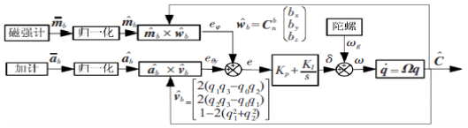

# 基于互补滤波器的姿态估计

* [返回上层目录](../navigation.md)
* [互补滤波的来源](#互补滤波的来源)
* [互补滤波的复频域表达式](#互补滤波的复频域表达式)
* [互补滤波总体流程](#互补滤波总体流程)

首先，澄清一点很多人都在讨论的问题：卡尔曼滤波器是不是真的优于互补滤波器？

答案是肯定的，但有一些前提：

* 传感器的噪声是随机的，服从正态分布的，我们大概知道噪声的协方差矩阵；

* 并且“优于”是在最小均方误差（least mean squared error）的意义上。

参考文献*Brown, Robert Grover, and Patrick YC Hwang.*Introduction to random signals and applied Kalman filtering*. Vol. 3. New York: Wiley, 1992.* 第284页中对于互补滤波器和卡尔曼滤波器的优劣有非常好的描述，在这里做一摘抄：

> 在很多实际应用中，我们对于一些测量变量的误差模型很难有准确的估计，……，或者一些误差不是随机的或正态分布的。因此，如果有不需要对测量变量的误差作任何假设的方法可能会更好，从而避免错误的模型带来的巨大的估计错误。这样的方法在最小均方误差的意义上可能会有些损失，但它比在一些不通常的情况下因为模型错误造成的巨大错误要好。

互补滤波器就是一种不需要对误差模型做过多假设的方法。

# 一维互补滤波器

## 互补滤波的来源

已知有IMU（陀螺仪和加速度计），磁传感器，求欧拉角姿态。

分析：

（1）**加速度计**是低频准确，带有高频噪声。只能在飞行器稳定运行，即只能在物体除重力外不受其他力，即加速度计除了感受到重力加速度外没有其他加速度下使用，但是实际使用时有很大的高频噪声，如发动机或者电机的震动噪声。所以**直接用加速度计来计算姿态角是不可行的**。

如果对加计做低通滤波，然后计算角度，这样又会造成系统响应滞后。

（2）**陀螺仪**是高频准确，带有低频噪声。**通过积分角速度是可以得到角度**，但是积分结果只能短时间准确（数秒内），长时间积分会漂移。

那么如何利用加计和陀螺仪自身的特性，来得到姿态呢？

1、滤除加速度计的高频噪声

2、滤除陀螺仪积分后的低频噪声

3、两个传感器数据权重相加为1.0

4、低频和高频滤波的截至频率要衔接

写成公式，即

其中，$C(s)$为一阶滤波器的截止频率，本来是固定的，这里写成了：

由于加了积分进去，本质上相当于**一阶滤波器的截止频率是动态自适应的**。

由于加了积分进去，本质上相当于**一阶滤波器的截止频率是动态自适应的**。

由于加了积分进去，本质上相当于**一阶滤波器的截止频率是动态自适应的**。

在继续推导下面的公式之前，需要简单回顾下低通滤波器公式中截止频率的含义。

下图是一个标准的一阶RC滤波器，但是设计成低通还是高通，由选取的输出变量来决定，若选取电阻两端的电压为输出，设计出来的是一阶高通滤波器；若选取电容两端的电压为输出，设计出来的是一阶低通滤波器，现在我们就以常见的一阶低通滤波器为例进行分析。

现在分析电路及传函。输入为电源电压 $V_s(t)$，输出为电容两端电压$V_c(t)$，那么列出电压方程：
$$
V_s(t)=RC\frac{dV_c(t)}{dt}+V_c(t)
$$
两端拉式变换：
$$
(RCs+1)V_c(s)=V_s(s)
$$
传递函数：
$$
G(s)=\frac{V_c(s)}{V_s(s)}=\frac{1}{RCs+1}
$$
这个形式是不是很熟悉，这就是典型的惯性环节啊。

那么由惯性环节的形式1
$$
G(s)=\frac{1}{\tau s+1}
$$
可以看出，时间常数$\tau=RC$。

由惯性环节的形式2
$$
G(s)=\frac{Y(s)}{X(s)}=\frac{w_c}{s+w_c}
$$
可以看出，其截止频率$w=\frac{1}{RC}$。

至此一阶滤波器推导完毕。继续看互补。

## 互补滤波的复频域表达式

把前面的内容稍微复制一点：

其中，$C(s)$为一阶滤波器的截止频率，本来是固定的，这里写成了：

所以，这里的C(s)就是截止频率。

现在推导复频域表达式：
$$
\begin{aligned}
&\hat{\theta}=\omega_g\times \frac{s}{s+C(s)}\times \frac{1}{s}+\theta_a\times\frac{C(s)}{s+C(s)}\\
\Rightarrow&(s+C(s))\hat{\theta}=\omega_g+\theta_aC(s)\\
\Rightarrow&s\hat{\theta}=\omega_g+(\theta_a-\hat{\theta})C(s)\\
\Rightarrow&s\hat{\theta}=\omega_g+(k_p+\frac{k_i}{s})\times(\theta_a-\hat{\theta})
\end{aligned}
$$
其中，复频域$s\hat{\theta}$表示时域的微分，复频域$k_i/s$代表时域的积分。

上式就是最终的互补滤波的公式。

## 一维互补滤波器完整推导

下面来做一下理论分析

假设角度信号$y(t)$有两种测量方法：
$$
\begin{aligned}
z_1(t)&=y(t)+n_1(t)\\
z_2(t)&=y(t)+n_2(t)
\end{aligned}
$$
其中，$n_1(t)$和$n_2(t)$是测量噪声。希望对$z_1(t)$和$z_t(t)$作加权平均，从而使平均后的误差尽可能最小。

在IMU的姿态估计中，

- 陀螺仪积分时间越久越不准确，短时间内很准确，所以误差是低频的；

  如果认为$z_1(t)$是陀螺仪积分出的角度，那么$z_1(t)$在短时间内是准确的，但长时间后因为漂移误差精度会大幅下降，也就是说n_1(t)主要是低频噪声；

- 加速度计对比重力方向短时间内很不准确，因为有其他加速度，但长时间平均后很准确，因为现实中的物体不可能总朝一个方向加速，所以误差是高频的。

  如果认为$z_2(t)$是加速度计通过和重力对比解算出的及爱都，那么$z_2(t)$在短时间内因为运动造成的加速度是不准确的，但IMU不可能长时间沿一个方向加速，所以在长时间内的$z_2(t)$平均值是准确的，也就是说$n_2(t)$主要是高频噪声。

因此，自然的想法是：可以把陀螺仪积分角度$z_1(t)$通过高通滤波器，滤掉低频噪声；把$z_2(t)$通过低通滤波器，滤掉高频噪声，再做平均，那么得到的结果应该是准确的。这就是互补滤波器的核心想法，也是它为什么叫“互补”的原因。

如果把$z_1(t)$和$z_2(t)$做拉普拉斯变换写成频域中的信号，并用$G(s)$表示低通滤波器，对两个信号进行平均可以得到：
$$
\hat{Y}(s)=Z_1(s)[1-G(s)]+Z_2(s)G(s)
$$
其中$\hat{Y}(s)$是对需要测量的角度新高$y(t)$的估计，$1-G(s)$是互补的高通滤波器。因为$Z_1(t)$是角速度积分得到的，因此可以写成：
$$
\begin{aligned}
z_1(t)&=\int_{0}^{t}[\omega_{true}(t)+n_{\omega}(t)]dt\\
&=\int_{0}^{t}\omega(t)dt
\end{aligned}
$$
其中，$\omega(t)$是测量得到的包含误差的角速度。把上式代入上上式可得：
$$
\hat{Y}(s)=\frac{\Omega(s)}{s}[1-G(s)]+Z_2(s)G(s)
$$
如果我们使用最简单的一阶低通滤波器，也就是$G(s)=\frac{k}{s+k}$，代入上式整理:
$$
\begin{aligned}
&\hat{Y}(s)=\frac{\Omega(s)}{s}[1-G(s)]+Z_2(s)G(s)\\
\Rightarrow&\hat{Y}(s)=\frac{\Omega(s)}{s}\left[1-\frac{k}{s+k}\right]+Z_2(s)\frac{k}{s+k}\\
\Rightarrow&\hat{Y}(s)=\frac{\Omega(s)}{s}\left[\frac{s}{s+k}\right]+Z_2(s)\frac{k}{s+k}\\
\Rightarrow&\hat{Y}(s)=\Omega(s)\left[\frac{1}{s+k}\right]+Z_2(s)\frac{k}{s+k}\\
\Rightarrow&(s+k)\hat{Y}(s)=\Omega(s)+k\cdot Z_2(s)\\
\Rightarrow&s\hat{Y}(s)=\Omega(s)+k\cdot Z_2(s)-k\cdot \hat{Y}(s)\\
\Rightarrow&s\hat{Y}(s)=\Omega(s)+k\left[Z_2(s)-\hat{Y}(s)\right]\\
\end{aligned}
$$
用拉普拉斯逆变换回到时域可以得到：
$$
\begin{aligned}
&s\hat{Y}(s)=\Omega(s)+k\left[Z_2(s)-\hat{Y}(s)\right]\\
\Rightarrow&\dot{\hat{y}}(t)=w(t)+k\left[z_2(t)-\hat{y}(t)\right]
\end{aligned}
$$
再将上式做一阶积分可得到：
$$
\begin{aligned}
\hat{y}_{n+1}&=\hat{y}_{n}+\dot{\hat{y}}_n\Delta t\\
&=\hat{y}_n+\{w_n+k\left[z_{2,n}-\hat{y}_n\right]\}\Delta t\\
&=(1-k\Delta t)\hat{y}_n+k\Delta t z_{2,n}+\omega_n \Delta t\\
\end{aligned}
$$
上式也就是互补滤波器在时域中的表达式。可以看到，互补滤波器实际是对陀螺仪积分得到的角度（**这里有问题啊，应该是上次积分得到的角度啊**）和加速度计解算出的角度做了加权平均，权重分别是$1-k\Delta t$和$\Delta t$。需要注意的是，**权重是不随时间变化的**，这是互补滤波器和卡尔曼滤波器的本质区别。直观上讲，因为加速计的噪声特性不随时间改变，但陀螺仪积分得到的角度随着滤波的进行会越来越准确，因此在卡尔曼滤波器中$z_2(t)$得到的权重会越来越小，这是卡尔曼滤波器优于互补滤波器的原因。这样简单的一维互补滤波器在IMU姿态估计中也有实际应用。例如在两轮平衡车中，我们只需要估计平衡车倾斜的角度，因此可以把姿态简化为一维角度，使用加速度计和陀螺仪进行估计。

# SO(3)上的互补滤波器

在无人机的姿态估计中，一个十分流行的算法是Mahony等人提出的在SO(3)群上的互补滤波器。这个滤波器的思路是仿照下式的形式，把一维的角度$y$换成三维的可表示姿态的旋转矩阵$R$，其中的加减法替换为SO(3)群上的运算。
$$
\begin{aligned}
&s\hat{Y}(s)=\Omega(s)+k\left[Z_2(s)-\hat{Y}(s)\right]\\
\Rightarrow&\dot{\hat{y}}(t)=w(t)+k\left[z_2(t)-\hat{y}(t)\right]
\end{aligned}
$$
在前面介绍罗德里格斯公式的文章中，我们给出了旋转矩阵$R$的导数，$\dot{R}=R\omega^{\wedge}$，其中$\omega$是IMU的角速度，并且表示在IMU体坐标系中。仿照上式，我们需要在$R$的导数中添加一项：通过陀螺仪积分和其它方式测量得到的姿态的差值，乘以一个比例系数。如果我们把$R$的估计记为$\hat{R}$，其它方式测量得到的姿态记为$R_y$，那么两者的“差”在 SO(3) 群上可以表示为
$$
\tilde{R}=\hat{R}^{-1}R_y=\hat{R}^TR_y
$$
如果你不理解上式为什么这么写，可以这么想：如果姿态是一维，那么测量值假设为5度，估计值为3度，那差值就是5-3=2，用旋转表示就是，先正向旋转5度，再反向旋转3度，那么类似的，现在升维到3维，用姿态矩阵表示就是，先旋转测量值的姿态，然后逆向旋转预估值的姿态，即$\hat{R}^{-1}R_y$，这就是测量姿态和预估姿态的差值。

所以，上上式中的差值$k\left[z_2(t)-\hat{y}(t)\right]$可类比写成$k\left[\hat{R}^TR_y\right]$，但这是矩阵形式，这时就需要把矩阵形式写成向量像是，来加到$\dot{R}=R\omega^{\wedge}$从而更新姿态矩阵。可通过指数映射的逆映射，得到姿态矩阵$R$的向量形式，即轴角向量表示$\theta k$，即一个so(3)的量。现在可写出SO(3)群上互补滤波器的表达式：
$$
\begin{aligned}
\dot{\hat{R}}&=R\omega^{\wedge}\\
&=\hat{R}\left(w(t)+k\left[z_2(t)-\hat{y}(t)\right]\right)\quad\text{当然，这是错的}\\
&=\hat{R}\left(w(t)+k\left[\hat{R}^TR_y\right]\right)\quad\text{当然，这是错的}\\
&=\hat{R}(\omega+k\theta u)^{\wedge}
\end{aligned}
$$
需要注意的是，上式中的$\omega$之所以可以像下式
$$
\begin{aligned}
&s\hat{Y}(s)=\Omega(s)+k\left[Z_2(s)-\hat{Y}(s)\right]\\
\Rightarrow&\dot{\hat{y}}(t)=w(t)+k\left[z_2(t)-\hat{y}(t)\right]
\end{aligned}
$$
中那样和$k\theta u$相加，是因为它们都是so(3)中的量，而so(3)是线性空间。直观的解释是，$\omega$和$k\theta u$都可以理解为三维角速度，因此可以相加。在Mahony文章中，$\theta u$被替换为$\frac{1}{2}\left(\tilde{R}-\tilde{R}^T\right)^{\vee}$，其中$(.)^{\vee}$是$(.)^{\wedge}$的逆运算。这个替换是无关紧要的，因为$u$和$\frac{1}{2}\left(\tilde{R}-\tilde{R}^T\right)^{\vee}$是平行的，它们的系数都可以被吸收进比例系数$k$中。

$u$和$\frac{1}{2}\left(\tilde{R}-\tilde{R}^T\right)^{\vee}$是平行的这个结论的具体证明如下：
$$
\begin{aligned}
R&=I+(1-\cos\theta)K^2+\sin\theta\cdot K\\
R^T&=I+(1-\cos\theta)K^2-\sin\theta\cdot K\\
\end{aligned}
$$
这是因为$K$是反对称矩阵，而$K^2$是对称矩阵。

所以有
$$
\begin{aligned}
&\frac{1}{2}\left(\tilde{R}-\tilde{R}^T\right)^{\vee}\\
=&\frac{1}{2}\left(2\sin\theta\cdot K\right)^{\vee}\\
=&\sin\theta\cdot K^{\vee}\\
=&\sin\theta\cdot u\\
\approx&\theta\cdot u\quad\text{when}\ \theta\ \text{is small}
\end{aligned}
$$
$\dot{\hat{R}}=\hat{R}(\omega+k\theta u)^{\wedge}$可以积分为在IMU姿态估计中可以使用的表达式：
$$
\hat{R}_{n+1}=\hat{R}_ne^{\left(\omega_n+k\theta_n u_n\right)^{\wedge}\Delta t}
$$
总结：介绍了简单的一维互补滤波器，和比较复杂的在 SO(3) 群上的互补滤波器。互补滤波器的思路是把一个主要包含高频噪声，和一个主要包含低频噪声的信号分别通过一个低通滤波器和高通滤波器，并做平均，从而使平均后的结果是真实信号较为准确的估计。虽然 Mahony 提出的互补滤波器在无人机领域十分流行，但在最小均方误差的意义下，它是劣于卡尔曼滤波器的。

# 互补滤波流程

## 互补滤波总体流程

（1）通过gyro获取角速度

（2）通过姿态矩阵微分方程，将体轴gyro的旋转向量不断添加到微分方程矩阵上，就可以实时更新姿态矩阵了

（3）通过姿态矩阵就可以获取姿态角A了

（4）将由姿态矩阵计算得出的姿态角A，与由加速度计和GPS或磁传感器得出的姿态角B相比作差，得到姿态角偏差

（5）将姿态角偏差进行PI运算，并用此结果对gyro值进行修正。

以上就是互补滤波的核心原理。

## 互补滤波详细流程

更具体的流程图如下：

### 从传感器获取正确姿态值

从传感器读取到加速度测量值并归一化为$\hat{a}_b=[a_x,a_y,a_z]^T$；磁力计测量值$\hat{m}_b=[m_x,m_y,m_z]^T$。

将加速度计测量值、磁力计测量值正则化为单位向量，作为期望值，这个值是符合实际的。

### 从姿态矩阵获取当前实际姿态值

（1）获取机体轴系中的重力向量

加速度计在静止时测量的是地球重力加速度$[0,0,1]^T$。有一点要注意，如果在运动时测量，需要减去离心加速度。

需要把归一化后的地轴系的重力向量，通过当前姿态矩阵转到体轴系下，因为要和加速度计传感器测量值进行比较，得到误差，来修正当前姿态。

此时体轴系下的重力向量$\hat{v}_b$其实包含了当前姿态矩阵$C_n^b$的信息，并不是绝对准确的，因为当前姿态$C_n^b$并不准确，需要校正。
$$
\begin{aligned}
\hat{v}_b=\begin{bmatrix}
v_x\\
v_y\\
v_z
\end{bmatrix}
&=
C_n^b
\begin{bmatrix}
0\\
0\\
1
\end{bmatrix}\\
\end{aligned}
$$
如果姿态矩阵$C_n^b$是基于四元数，则
$$
\begin{aligned}
\hat{v}_b
&=
\begin{bmatrix}
1-2(q_2^2+q_3^2)&2(q_1q_2+q_0q_3)&2(q_1q_3-q_0q_2)\\
2(q_1q_2-q_0q_3)&1-2(q_1^2+q_3^2)&2(q_2q_3+q_0q_1)\\
2(q_1q_3+q_0q_2)&2(q_2q_3-q_0q_1)&1-2(q_1^2+q_2^2)\\
\end{bmatrix}
\begin{bmatrix}
0\\
0\\
1
\end{bmatrix}\\
&=
\begin{bmatrix}
2(q_1q_3-q_0q_2)\\
2(q_2q_3+q_0q_1)\\
1-2(q_1^2+q_2^2)\\
\end{bmatrix}
\end{aligned}
$$
如果姿态矩阵$C_n^b$是基于DCM矩阵，则
$$
\begin{aligned}
\hat{v}_b
&=
\begin{bmatrix}
\cos\psi \cos\theta & \cos\theta \sin\psi & -\sin\theta\\
\cos\psi \sin\theta \sin\phi - \sin\psi \cos\phi & \sin\psi \sin\theta \sin\phi + \cos\psi \cos\phi & \cos\theta \sin\phi\\
\cos\psi \sin\theta \cos\phi + \sin\psi \sin\phi & \sin\psi \sin\theta \cos\phi - \cos\psi \sin\phi & \cos\theta \cos\phi\\
\end{bmatrix}
\begin{bmatrix}
0\\
0\\
1
\end{bmatrix}\\
&=
\begin{bmatrix}
-\sin\theta\\
\cos\theta \sin\phi\\
\cos\theta \cos\phi\\
\end{bmatrix}
\end{aligned}
$$
（2）获取机体轴系中的磁场向量

磁传感器测量的是地球的磁场的大小和方向，只不过这个方向不再是竖直向下，而是在北半球磁场线是向北且向下的，这里，其中，如果磁偏角为0，那么$b_y=0$。

类似加速度计在地轴系下的参考向量是$[0,0,1]^T$，那么磁传感器在地轴系下的参考向量是$[b_x,b_y,b_z]^T$，这里只考虑其北东二维水平向量，即只取$[b_x,b_y]^T$并归一化，如果磁偏角为0或者不考虑磁偏角，则$[b_x,b_y]^T=[1,0]^T$。

### 正确值与实际值做差并进行PI来修正当前姿态

此时，需要回顾一下前面的互补滤波复频域表达式：
$$
\begin{aligned}
&\hat{\theta}=\omega_g\times \frac{s}{s+C(s)}\times \frac{1}{s}+\theta_a\times\frac{C(s)}{s+C(s)}\\
\Rightarrow&(s+C(s))\hat{\theta}=\omega_g+\theta_aC(s)\\
\Rightarrow&s\hat{\theta}=\omega_g+(\theta_a-\hat{\theta})C(s)\\
\Rightarrow&s\hat{\theta}=\omega_g+(k_p+\frac{k_i}{s})\times(\theta_a-\hat{\theta})
\end{aligned}
$$
上式的$\theta_a$其实就是加速度计测量的重力向量为$\hat{a}_b=[a_x,a_y,a_z]^T$，上式的$\hat{\theta}$其实就是$\hat{v}_b$，

而上式的角度误差$\theta_a-\hat{\theta}$在小角度下可近似为向量叉乘，即$\hat{a}_b\times \hat{v}_b$。

### 加速度计差值

### 磁传感器差值

需要把磁传感器测量值从体轴系$m_b$转到地轴系下的$m_e$，然后取北东地的北东二维水平向量$[m_{ex},m_{ey}]$，然后和地磁场的参考向量$[b_x,b_y]^T=[1,0]^T$做叉乘进行比较得到误差$error_{bz}$，来修正当前姿态。

注意，这个误差是地轴系下的z向。为什么只取z向呢，因为xy向的地轴误差不需要磁传感器来纠正，用加速度计纠正就够了。

此时地轴系下的重力向量$m_e$其实包含了当前姿态矩阵$C_n^b$的信息，并不是绝对准确的，因为当前姿态$C_n^b$并不准确，需要校正。

然后把地轴系下的z向误差转到体轴系下，但是只取体轴系的z向误差$error_{bz}$，即
$$
\begin{aligned}
&C_n^b
\begin{bmatrix}
0\\
0\\
error_{nz}
\end{bmatrix}\\
=&\begin{bmatrix}
\cos\psi \cos\theta & \cos\theta \sin\psi & -\sin\theta\\
\cos\psi \sin\theta \sin\phi - \sin\psi \cos\phi & \sin\psi \sin\theta \sin\phi + \cos\psi \cos\phi & \cos\theta \sin\phi\\
\cos\psi \sin\theta \cos\phi + \sin\psi \sin\phi & \sin\psi \sin\theta \cos\phi - \cos\psi \sin\phi & \cos\theta \cos\phi\\
\end{bmatrix}
\begin{bmatrix}
0\\
0\\
error_{bz}
\end{bmatrix}\\
=&
\begin{bmatrix}
...\\
...\\
(\cos\theta \cos\phi)error_{nz}\\
\end{bmatrix}
=
\begin{bmatrix}
...\\
...\\
error_{bz}\\
\end{bmatrix}
\end{aligned}
$$

# 参考资料

* [The Balance Filter: A Simple Solution for Integrating Accelerometer and Gyroscope Measurements for a Balancing Platform ](https://d1.amobbs.com/bbs_upload782111/files_44/ourdev_665531S2JZG6.pdf)

本文开始的几张图片中的部分参考该pdf。

* [一阶低通滤波器公式的推导](https://zhuanlan.zhihu.com/p/161948566)

一阶低通滤波器的推导参考此知乎博客。

* [3. 互补滤波器](https://zhuanlan.zhihu.com/p/70410542)

“SO(3)上的互补滤波器”参考此知乎博客。

===

[Mahony航姿算法的参数调节方法](https://zhuanlan.zhihu.com/p/582694093)

