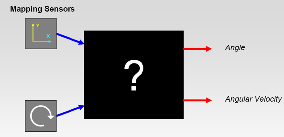
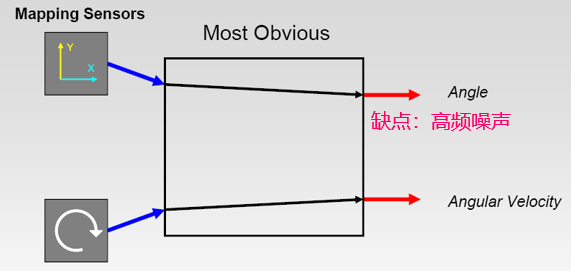
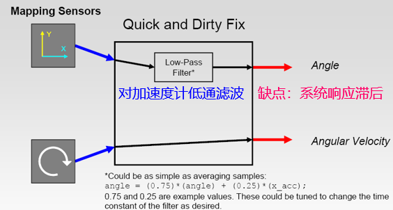
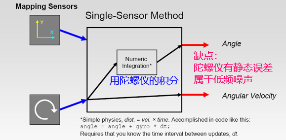
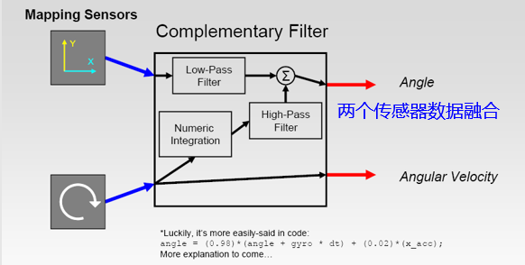
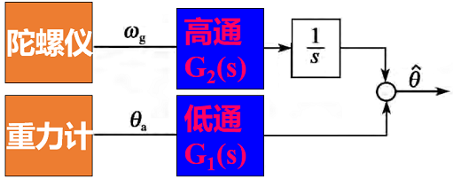
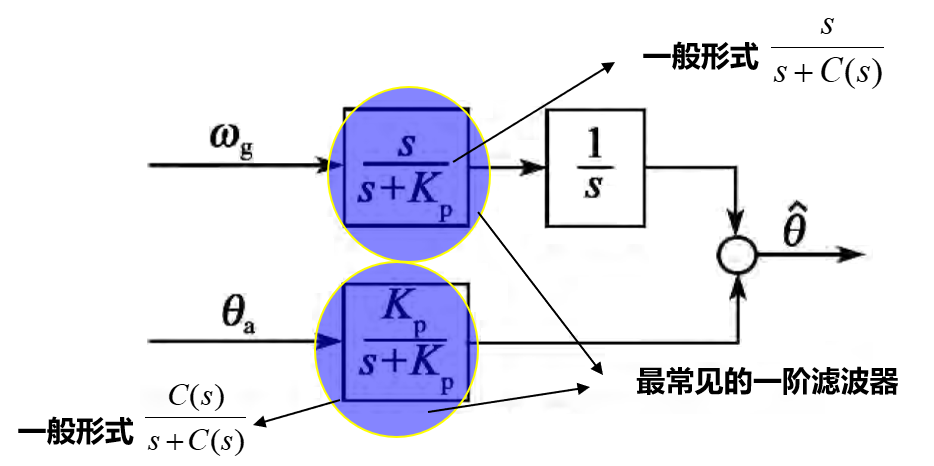
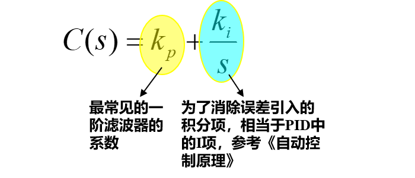
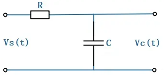
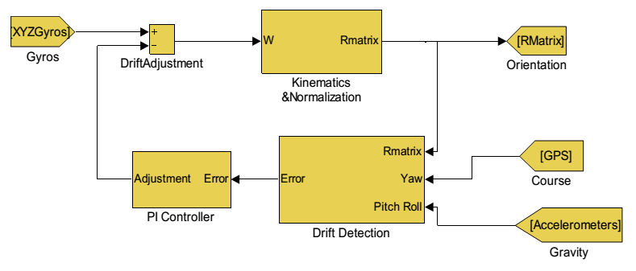

# 基于互补滤波的组合导航

* [返回上层目录](../navigation.md)
* [互补滤波的来源](#互补滤波的来源)
* [互补滤波的复频域表达式](#互补滤波的复频域表达式)
* [互补滤波总体流程](#互补滤波总体流程)

# 互补滤波的来源

已知有IMU（陀螺仪和加速度计），磁传感器，求欧拉角姿态。

分析：

（1）**加速度计**是低频准确，带有高频噪声。只能在飞行器稳定运行，即只能在物体除重力外不受其他力，即加速度计除了感受到重力加速度外没有其他加速度下使用，但是实际使用时有很大的高频噪声，如发动机或者电机的震动噪声。所以**直接用加速度计来计算姿态角是不可行的**。

如果对加计做低通滤波，然后计算角度，这样又会造成系统响应滞后。

（2）**陀螺仪**是高频准确，带有低频噪声。**通过积分角速度是可以得到角度**，但是积分结果只能短时间准确（数秒内），长时间积分会漂移。

那么如何利用加计和陀螺仪自身的特性，来得到姿态呢？

1、滤除加速度计的高频噪声

2、滤除陀螺仪积分后的低频噪声

3、两个传感器数据权重相加为1.0

4、低频和高频滤波的截至频率要衔接

写成公式，即

其中，$C(s)$为一阶滤波器的截止频率，本来是固定的，这里写成了：

由于加了积分进去，本质上相当于**一阶滤波器的截止频率是动态自适应的**。

由于加了积分进去，本质上相当于**一阶滤波器的截止频率是动态自适应的**。

由于加了积分进去，本质上相当于**一阶滤波器的截止频率是动态自适应的**。

在继续推导下面的公式之前，需要简单回顾下低通滤波器公式中截止频率的含义。

> 下图是一个标准的一阶RC滤波器，但是设计成低通还是高通，由选取的输出变量来决定，若选取电阻两端的电压为输出，设计出来的是一阶高通滤波器；若选取电容两端的电压为输出，设计出来的是一阶低通滤波器，现在我们就以常见的一阶低通滤波器为例进行分析。
>
> 
>
> 现在分析电路及传函。输入为电源电压 $V_s(t)$，输出为电容两端电压$V_c(t)$，那么列出电压方程：
> $$
> V_s(t)=RC\frac{dV_c(t)}{dt}+V_c(t)
> $$
> 两端拉式变换：
> $$
> (RCs+1)V_c(s)=V_s(s)
> $$
> 传递函数：
> $$
> G(s)=\frac{V_c(s)}{V_s(s)}=\frac{1}{RCs+1}
> $$
> 这个形式是不是很熟悉，这就是典型的惯性环节啊。
>
> 那么由惯性环节的形式1
> $$
> G(s)=\frac{1}{\tau s+1}
> $$
> 可以看出，时间常数$\tau=RC$。
>
> 由惯性环节的形式2
> $$
> G(s)=\frac{Y(s)}{X(s)}=\frac{w_c}{s+w_c}
> $$
> 可以看出，其截止频率$w=\frac{1}{RC}$。

至此一阶滤波器推导完毕。继续看互补。

# 互补滤波的复频域表达式

把前面的内容稍微复制一点：

其中，$C(s)$为一阶滤波器的截止频率，本来是固定的，这里写成了：

所以，这里的C(s)就是截止频率。

现在推导复频域表达式：
$$
\begin{aligned}
&\hat{\theta}=\omega_g\times \frac{s}{s+C(s)}\times \frac{1}{s}+\theta_a\times\frac{C(s)}{s+C(s)}\\
\Rightarrow&(s+C(s))\hat{\theta}=\omega_g+\theta_aC(s)\\
\Rightarrow&s\hat{\theta}=\omega_g+(\theta_a-\hat{\theta})C(s)\\
\Rightarrow&s\hat{\theta}=\omega_g+(k_p+\frac{k_i}{s})\times(\theta_a-\hat{\theta})
\end{aligned}
$$
其中，复频域$s\hat{\theta}$表示时域的微分，复频域$(k_p+k_i/s)$代表时域的积分。

上式就是最终的互补滤波的公式。

# 互补滤波总体流程

1. 通过gyro获取角速度
2. 通过姿态矩阵微分方程，将体轴gyro的旋转向量不断添加到微分方程矩阵上，就可以实时更新姿态矩阵了
3. 通过姿态矩阵就可以获取姿态角A了
4. 将由姿态矩阵计算得出的姿态角A，与由加速度计和GPS或磁传感器得出的姿态角B相比作差，得到姿态角偏差
5. 将姿态角偏差进行PI运算，并用此结果对gyro值进行修正。

以上就是DCM矩阵的核心原理。

# 参考资料

* [The Balance Filter: A Simple Solution for Integrating Accelerometer and Gyroscope Measurements for a Balancing Platform ](https://d1.amobbs.com/bbs_upload782111/files_44/ourdev_665531S2JZG6.pdf)

本文开始的几张图片中的部分参考该pdf。

* [一阶低通滤波器公式的推导](https://zhuanlan.zhihu.com/p/161948566)

一阶低通滤波器的推导参考此知乎博客。

