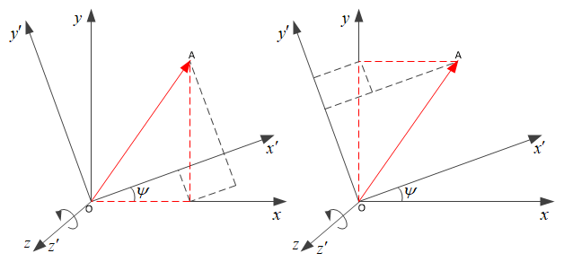
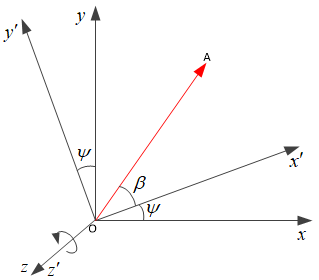
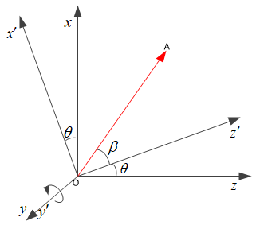
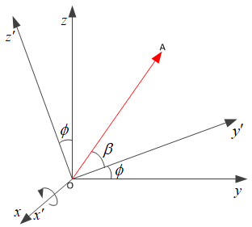
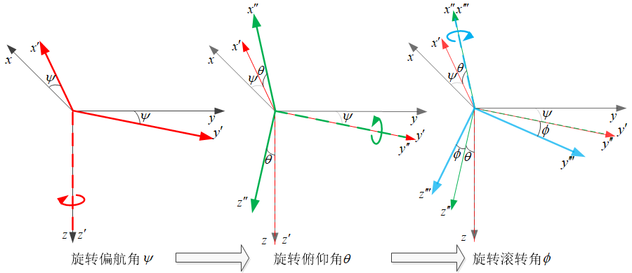
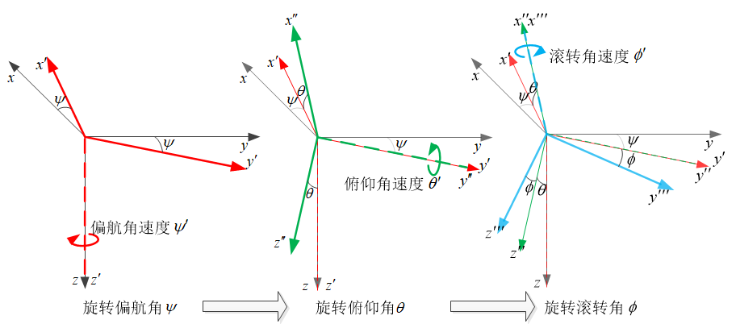

# 坐标变换与欧拉运动学方程

* [返回上层目录](../navigation.md)
* [基本假定](#基本假定)
* [对坐标变换的基本理解](#对坐标变换的基本理解)
  * [矢量旋转与坐标变换的关系](#矢量旋转与坐标变换的关系)
* [矩阵旋转](#矩阵旋转)
  * [绕z轴旋转](#绕z轴旋转)
  * [绕y轴旋转](#绕y轴旋转)
  * [绕x轴旋转](#绕x轴旋转)
* [基于欧拉角的坐标变换](#基于欧拉角的坐标变换)
  * [坐标变换矩阵推导](#坐标变换矩阵推导)
  * [万向节死锁](#万向节死锁)
  * [已知多旋翼水平加速度求姿态角](#已知多旋翼水平加速度求姿态角)
* [欧拉运动学方程](#欧拉运动学方程)
  * [欧拉运动学方程推导](#欧拉运动学方程推导)
  * [由体轴角加速度限制求欧拉角角加速度限制](#由体轴角加速度限制求欧拉角角加速度限制)

# 基本假定

若将飞行器看作刚体，则它在空间中的姿态主要是指与机体固连的机体坐标系跟与大地固连的坐标系之间的旋转关系。旋转关系可以用欧拉角描述，为了方便叙述，先约定下面的一些基本假定：

（1）建立的坐标系均是右手系，且欧拉角的旋转方向也满足右手定则；

（2）与机体固连的机体坐标系的$x$轴，$y$轴，$z$轴的正方向分别为前右下，与大地固连的大地坐标系的$X$轴，$Y$轴，$Z$轴的正方向分别为北东地；

（3）机体坐标系绕其$z$轴旋转所得到的欧拉角称为偏航角$\psi$，机体坐标系绕其$y$轴旋转所得到的欧拉角称为俯仰角$\theta$，机体坐标系绕其$x$轴旋转所得到的欧拉角称为横滚角$\phi$；

（4）用上下标$b$来表示向量在机体（body）坐标系中，用上下标$e$来表示向量在大地（earth）坐标系中；

# 对坐标变换的基本理解

机体坐标系在任一时刻的姿态都可以分解为通过大地坐标系绕固定点的三次旋转，每次旋转的的旋转轴对应于将要旋转的坐标系的某一坐标轴，也就是上面提到的欧拉角。旋转的次序不同，最终得到的姿态也不相同，因此，这里也规定这三次旋转的次序分别为先绕$z$旋转，再绕$y$旋转，最后绕$x$旋转，即$\psi\rightarrow \theta \rightarrow \phi$。如下图所示，机体坐标系的旋转已经分解成了三次坐标系之间基本变换。下面就分别推导绕$z$，绕$y$，绕$x$的坐标变换矩阵。

需要注意到的一点是，这里讨论的都是**坐标系之间的变换（不是将向量本身进行旋转）**。也就是说**空间中的位置向量或坐标点本身并不发生变化，而只是将它们从一个参考坐标系变换到了另一个参考系当中**。


## 矢量旋转与坐标变换的关系

矢量旋转和坐标变换是逆向关系。


设有参考坐标系$R$，坐标轴为$x,y,z$。$r$为固连在刚体上的位置向量，可通过旋转矩阵将其旋转到$r'$位置，即
$$
{r'}^R=Dr^R=
\begin{bmatrix}
\cos\theta&-\sin\theta\\
\sin\theta&\cos\theta
\end{bmatrix}
r^R
$$
记住，此时的$D$是个向量旋转矩阵，而还不是坐标转换矩阵。

记初始时刻的刚体固连坐标系为$b_0$，在初始时刻，刚体固连坐标系和参考坐标系重合，所以
$$
r^R=r^{b_0}
$$
而在转动过程中，位置向量$r$和$b$系都和刚体固连，所以位置向量和$b$系的相对角位置始终不变，即有
$$
r^{b_0}={r'}^{b}
$$
根据上两式，有
$$
r^R={r'}^b
$$
把上式带入前面的向量旋转公式，有
$$
{r'}^R=Dr^R=
\begin{bmatrix}
\cos\theta&-\sin\theta\\
\sin\theta&\cos\theta
\end{bmatrix}
r^R=
\begin{bmatrix}
\cos\theta&-\sin\theta\\
\sin\theta&\cos\theta
\end{bmatrix}
{r'}^b
$$
即，$D$为$b$系至$R$系的坐标变换矩阵。

即矢量旋转和坐标变换是逆向关系。

# 矩阵旋转

## 绕z轴旋转



**第一种解法**：几何作图法

上图左侧，向量在$x'$上的投影，等于向量在$x$轴上的分量在$x'$上的投影，加上向量在$y$轴上的分量在$x'$上的投影。

上图右侧，向量在$y'$上的投影，等于向量在$y$轴上的分量在$y'$上的投影，减去向量在$x$轴上的分量在$y'$上的投影。
$$
\left\{\begin{matrix}
x'=x\cos\psi+y\sin\psi\\
y'=-x\sin\psi+y\cos\psi
\end{matrix}\right.
$$
即
$$
\begin{bmatrix}
x'\\ 
y'
\end{bmatrix}
=
\begin{bmatrix}
\cos\psi & \sin\psi\\ 
-\sin\psi & \cos\psi
\end{bmatrix}
\begin{bmatrix}
x\\ 
y
\end{bmatrix}
$$
由于这种方式需要几何作图，比较麻烦，之后均采用下面讲的第二种。第一种解法仅在这里展示一次，后面不再采用。

**第二种解法**：（默认）



如上图所示，当坐标系绕$z$轴旋转时，空间中的向量与$z$轴之间的相对关系不会改变，因此在旋转前后$z′=z$，现在就只考虑该向量在垂直于$z$轴的平面上的投影$\overrightarrow{OA}$，分别在平面直角坐标系$Oxy$跟平面直角坐标系$Ox'y'$上坐标之间的关系。如果向量$\overrightarrow{OA}$的模为$r$，它在坐标系$Oxy$中的坐标可以表示如下：
$$
\left\{\begin{matrix}
x=r\cos(\beta+\psi)=r\cos\beta \cos\psi-r\sin\beta \sin\psi\\
y=r\sin(\beta+\psi)=r\sin\beta \cos\psi+r\cos\beta \sin\psi
\end{matrix}\right.
$$
在坐标系$Ox'y’$中的坐标可以表示如下：
$$
\left\{\begin{matrix}
x'=r\cos\beta\\
y'=r\sin\beta
\end{matrix}\right.
$$
联合这两组式子可以得到：
$$
\left\{\begin{matrix}
x=x'\cos\psi-y'\sin\psi\\
y=y'\cos\psi+x'\sin\psi
\end{matrix}\right.
$$
即
$$
\begin{bmatrix}
x\\ 
y
\end{bmatrix}
=
\begin{bmatrix}
\cos\psi & -\sin\psi\\ 
\sin\psi & \cos\psi
\end{bmatrix}
\begin{bmatrix}
x'\\ 
y'
\end{bmatrix}
$$
求逆可得
$$
\begin{bmatrix}
x'\\ 
y'
\end{bmatrix}
=
\begin{bmatrix}
\cos\psi & \sin\psi\\ 
-\sin\psi & \cos\psi
\end{bmatrix}
\begin{bmatrix}
x\\ 
y
\end{bmatrix}
$$
看，两种解法的结果是一样的！

并且已经知道$z′=z$了，所以把上面的式子写成矩阵的形式则是：
$$
\begin{bmatrix}
x'\\ 
y'\\
z'
\end{bmatrix}
=
\begin{bmatrix}
\cos\psi & \sin\psi & 0\\
-\sin\psi & \cos\psi & 0\\
0 & 0 & 1
\end{bmatrix}
\begin{bmatrix}
x\\ 
y\\
z
\end{bmatrix}
$$
即
$$
R_z(\psi)
=
\begin{bmatrix}
\cos\psi & \sin\psi & 0\\
-\sin\psi & \cos\psi & 0\\
0 & 0 & 1
\end{bmatrix}
$$
上面这个矩阵就描述了坐标系绕$z$轴的一次旋转。

## 绕y轴旋转



绕$y$轴旋转的公式推导也与上面是一样的,首先$y'=y$，然后向量$\overrightarrow{OA}$在坐标系$Ozx$中的坐标可以表示如下：
$$
\left\{\begin{matrix}
z=r\cos(\beta+\theta)=r\cos\beta \cos\theta-r\sin\beta \sin\theta\\
x=r\sin(\beta+\theta)=r\sin\beta \cos\theta+r\cos\beta \sin\theta
\end{matrix}\right.
$$
在坐标系$Oz'x’$中的坐标可以表示如下：
$$
\left\{\begin{matrix}
z'=r\cos\beta\\
x'=r\sin\beta
\end{matrix}\right.
$$
联合这两组式子可以得到：
$$
\left\{\begin{matrix}
z=z'\cos\theta-x'\sin\theta\\
x=z'\sin\theta+x'\cos\theta
\end{matrix}\right.
$$
即
$$
\begin{bmatrix}
z\\ 
x
\end{bmatrix}
=
\begin{bmatrix}
\cos\theta & -\sin\theta\\ 
\sin\theta & \cos\theta
\end{bmatrix}
\begin{bmatrix}
z'\\ 
x'
\end{bmatrix}
$$
求逆可得
$$
\begin{bmatrix}
z'\\ 
x'
\end{bmatrix}
=
\begin{bmatrix}
\cos\theta & \sin\theta\\ 
-\sin\theta & \cos\theta
\end{bmatrix}
\begin{bmatrix}
z\\ 
x
\end{bmatrix}
$$
变换一下顺序，可得
$$
\begin{bmatrix}
x'\\ 
z'
\end{bmatrix}
=
\begin{bmatrix}
\cos\theta & -\sin\theta\\
\sin\theta & \cos\theta
\end{bmatrix}
\begin{bmatrix}
x\\ 
z
\end{bmatrix}
$$
注意：**这里由于变换了一下坐标轴$z'$和$x'$的顺序，所以导致坐标转换矩阵也和上面的$x$和$y$坐标轴的坐标转换矩阵不一样了**。

并且已经知道$y′=y$了，所以把上面的式子写成矩阵的形式则是：
$$
\begin{bmatrix}
x'\\ 
y'\\
z'
\end{bmatrix}
=
\begin{bmatrix}
\cos\theta & 0 & -\sin\theta\\
0 & 1 & 0\\
\sin\theta & 0 & \cos\theta\\
\end{bmatrix}
\begin{bmatrix}
x\\ 
y\\
z
\end{bmatrix}
$$
即
$$
R_y(\theta)
=
\begin{bmatrix}
\cos\theta & 0 & -\sin\theta\\
0 & 1 & 0\\
\sin\theta & 0 & \cos\theta\\
\end{bmatrix}
$$
上面这个矩阵就描述了坐标系绕$y$轴的一次旋转。

## 绕x轴旋转



绕$x$轴旋转的公式推导也与上面是一样的,首先$x'=x$，然后向量$\overrightarrow{OA}$在坐标系$Oyz$中的坐标可以表示如下：
$$
\left\{\begin{matrix}
y=r\cos(\beta+\phi)=r\cos\beta \cos\phi-r\sin\beta \sin\phi\\
z=r\sin(\beta+\phi)=r\sin\beta \cos\phi+r\cos\beta \sin\phi
\end{matrix}\right.
$$
在坐标系$Oy'z’$中的坐标可以表示如下：
$$
\left\{\begin{matrix}
y'=r\cos\phi\\
z'=r\sin\phi
\end{matrix}\right.
$$
联合这两组式子可以得到：
$$
\left\{\begin{matrix}
y=y'\cos\phi-z'\sin\phi\\
z=y'\sin\phi+z'\cos\phi
\end{matrix}\right.
$$
即
$$
\begin{bmatrix}
y\\ 
z
\end{bmatrix}
=
\begin{bmatrix}
\cos\phi & -\sin\phi\\ 
\sin\phi & \cos\phi
\end{bmatrix}
\begin{bmatrix}
y'\\ 
z'
\end{bmatrix}
$$
求逆可得
$$
\begin{bmatrix}
y'\\ 
z'
\end{bmatrix}
=
\begin{bmatrix}
\cos\phi & \sin\phi\\ 
-\sin\phi & \cos\phi
\end{bmatrix}
\begin{bmatrix}
y\\ 
z
\end{bmatrix}
$$
并且已经知道$x′=x$了，所以把上面的式子写成矩阵的形式则是：
$$
\begin{bmatrix}
x'\\ 
y'\\
z'
\end{bmatrix}
=
\begin{bmatrix}
1 & 0 & 0\\
0 & \cos\phi & \sin\phi\\
0 & -\sin\phi & \cos\phi\\
\end{bmatrix}
\begin{bmatrix}
x\\ 
y\\
z
\end{bmatrix}
$$
即
$$
R_x(\phi)
=
\begin{bmatrix}
1 & 0 & 0\\
0 & \cos\phi & \sin\phi\\
0 & -\sin\phi & \cos\phi\\
\end{bmatrix}
$$
上面这个矩阵就描述了坐标系绕$x$轴的一次旋转。

# 基于欧拉角的坐标变换

## 坐标变换矩阵推导

这里基于欧拉角的坐标变换按照`偏航角->俯仰角->滚转角`的变换顺序，具体过程如下图所示。



具体为：

* 绕$z$轴旋转偏航角$\psi$，坐标轴由$xyz$变为$x'y'(z'/z)$
* 绕$y'$轴旋转俯仰角$\theta$，坐标轴由$x'y'(z'/z)$变为$x''(y''/y')z''$
* 绕$x''$轴旋转滚转角$\phi$，坐标轴由$x''(y''/y')z''$变为$(x'''/x'')y'''z'''$

已知坐标坐标转换矩阵的转换顺序，再加上前面的矩阵旋转的知识，可得矢量坐标从大地轴系转换到机体轴系的坐标转换矩阵为三个矩阵旋转的连乘，

- 绕$z$轴旋转偏航角$\psi$，坐标轴由$xyz$变为$x'y'(z'/z)$

  由该坐标转换矩阵，可将大地轴系$xyz$的矢量坐标，变换到$x'y'(z'/z)$临时轴系下的坐标

- 绕$y'$轴旋转俯仰角$\theta$，坐标轴由$x'y'(z'/z)$变为$x''(y''/y')z''$

  由该坐标转换矩阵，可将$x'y'(z'/z)$临时轴系的矢量坐标，变换到$x''(y''/y')z''$临时轴系下的坐标

- 绕$x''$轴旋转滚转角$\phi$，坐标轴由$x''(y''/y')z''$变为$(x'''/x'')y'''z'''$

  由该坐标转换矩阵，可将$x''(y''/y')z''$临时轴系的矢量坐标，变换到最终$(x'''/x'')y'''z'''$机体轴系下的坐标

已知坐标坐标转换矩阵的转换顺序，再加上前面的矩阵旋转的知识，可知，将上述三个坐标转换矩阵顺序相乘，即可得到能够将大地轴系下的矢量坐标转换为机体轴系下的矢量坐标的坐标转换矩阵。即
$$
\begin{bmatrix}
x_b\\ 
y_b\\
z_b
\end{bmatrix}
=
T_n^b
\begin{bmatrix}
x_n\\ 
y_n\\
z_n
\end{bmatrix}
=
R_x(\phi)\cdot R_y(\theta)\cdot R_z(\psi)
\begin{bmatrix}
x_n\\ 
y_n\\
z_n
\end{bmatrix}
$$
其中，$[x_b, y_b, z_b]^T$是矢量在机体轴系下的坐标，$[x_n, y_n, z_n]^T$是矢量在大地轴系下的坐标。

可利用MatLab求解坐标转换矩阵：

```matlab
syms \cos_psi \sin_psi \cos_theta \sin_theta \cos_phi \sin_phi;

R_psi = [ % 绕z轴旋转
    \cos_psi  \sin_psi 0; 
    -\sin_psi \cos_psi 0;
    0        0       1];
R_theta = [ % 绕y轴旋转
    \cos_theta 0 -\sin_theta; 
    0         1 0;
    \sin_theta 0 \cos_theta];
R_phi = [ % 绕x轴旋转
    1 0        0; 
    0 \cos_phi  \sin_phi;
    0 -\sin_phi \cos_phi];

% 大地轴系到机体轴系的坐标转换矩阵
R_phi * R_theta * R_psi;
% 机体轴系到大地轴系的坐标转换矩阵
inv(R_phi * R_theta * R_psi);
```

结果为

```matlab
% 大地轴系到机体轴系的坐标转换矩阵
R_phi * R_theta * R_psi =
[\cos_psi*\cos_theta, \cos_theta*\sin_psi, -\sin_theta]
[\cos_psi*\sin_phi*\sin_theta - \cos_phi*\sin_psi, \cos_phi*\cos_psi + \sin_phi*\sin_psi*\sin_theta, \cos_theta*\sin_phi]
[\sin_phi*\sin_psi + \cos_phi*\cos_psi*\sin_theta, \cos_phi*\sin_psi*\sin_theta - \cos_psi*\sin_phi, \cos_phi*\cos_theta]
```

也就是

大地轴系转机体轴系的坐标转换矩阵$T_n^b$为
$$
T_n^b
=
\begin{bmatrix}
\cos\psi \cos\theta & \cos\theta \sin\psi & -\sin\theta\\
\cos\psi \sin\theta \sin\phi - \sin\psi \cos\phi & \sin\psi \sin\theta \sin\phi + \cos\psi \cos\phi & \cos\theta \sin\phi\\
\cos\psi \sin\theta \cos\phi + \sin\psi \sin\phi & \sin\psi \sin\theta \cos\phi - \cos\psi \sin\phi & \cos\theta \cos\phi\\
\end{bmatrix}
$$
机体轴系转大地轴系的坐标转换矩阵$T_b^n$为$T_n^b$的转置：
$$
T_b^n=\left(T_n^b\right)^{-1}=\left(T_n^b\right)^T
$$

## 万向节死锁

比如机头向上抬头90度，那么飞机的滚转角旋转的$x'''$轴就会和偏航角旋转的$z$轴相重合，就无法做出绕$z'''$的侧向摆动了。

即此时$\theta=90^{\circ}$，那么大地轴系转机体轴系的坐标转换矩阵$T_n^b$为
$$
\begin{aligned}
T_n^b
&=
\begin{bmatrix}
\cos\psi \cos\theta & \cos\theta \sin\psi & -\sin\theta\\
\cos\psi \sin\theta \sin\phi - \sin\psi \cos\phi & \sin\psi \sin\theta \sin\phi + \cos\psi \cos\phi & \cos\theta \sin\phi\\
\cos\psi \sin\theta \cos\phi + \sin\psi \sin\phi & \sin\psi \sin\theta \cos\phi - \cos\psi \sin\phi & \cos\theta \cos\phi\\
\end{bmatrix}\\
&=
\begin{bmatrix}
0 & 0 & -1\\
\cos\psi \sin\phi - \sin\psi \cos\phi & \sin\psi \sin\phi + \cos\psi \cos\phi & 0\\
\cos\psi \cos\phi + \sin\psi \sin\phi & \sin\psi \cos\phi - \cos\psi \sin\phi & 0\\
\end{bmatrix}\\
&=
\begin{bmatrix}
0 & 0 & -1\\
-\sin(\psi-\phi) & \cos(\psi-\phi) & 0\\
cos(\psi-\phi) & \sin(\psi-\phi) & 0\\
\end{bmatrix}
\end{aligned}
$$
此时的姿态，其实对应了无数种欧拉角变换，即当俯仰角$\theta=90^{\circ}$时，只要偏航角$\psi$和滚转角$\phi$的大小相等且为任意值，均对应了同一种姿态。

## 已知多旋翼水平加速度求姿态角

已知多旋翼水平加速飞行（即推力$T$在竖直方向上的分量等于重力），以及水平方向（前向和右向）的加速度$a_f$和$a_r$，求其姿态角。

即有（偏航角$\psi=0$）：
$$
T_b^n
\begin{bmatrix}
0\\
0\\
-T\\
\end{bmatrix}
=
\begin{bmatrix}
ma_f\\
ma_r\\
-mg\\
\end{bmatrix}
$$
把坐标变换公式（令偏航角$\psi=0$）具体带入上式中的$M_b^e$，可得
$$
\begin{bmatrix}
\cos\theta & \sin\theta\sin\phi & \sin\theta \cos\phi\\
0 & \cos\phi & -\sin\phi\\
-\sin\theta & \cos\theta\sin\phi & \cos\theta\cos\phi\\
\end{bmatrix}
\begin{bmatrix}
0\\
0\\
-T\\
\end{bmatrix}
=
\begin{bmatrix}
ma_f\\
ma_r\\
-mg\\
\end{bmatrix}
$$
由上式第三行可得推力$T$：
$$
\begin{aligned}
&\cos\theta\cos\phi \cdot T=mg\\
\Rightarrow &T=\frac{mg}{\cos\theta\cos\phi}
\end{aligned}
$$
由上上式第一行可得俯仰角$\theta$：
$$
\begin{aligned}
&\sin\theta \cos\phi \cdot (-T)=ma_f\\
\Rightarrow &\sin\theta \cos\phi \cdot (-\frac{mg}{\cos\theta\cos\phi})=ma_f\\
\Rightarrow &-\tan\theta \cdot mg=ma_f\\
\Rightarrow &\theta=\arctan(-\frac{a_f}{g})
\end{aligned}
$$
由上上上式第二行可得滚转角$\phi$：
$$
\begin{aligned}
&\sin\phi \cdot T=ma_r\\
\Rightarrow &\sin\phi \cdot \frac{mg}{\cos\theta\cos\phi}=ma_r\\
\Rightarrow &\tan\phi\cdot \frac{mg}{\cos\theta}=ma_r\\
\Rightarrow &\phi=\arctan(\cos\theta \frac{a_r}{g})
\end{aligned}
$$

# 欧拉运动学方程

## 欧拉运动学方程推导

已知机体角速度$w=[p,q,r]^T$，想求欧拉角速度$\phi'$，$\theta'$，$\psi'$。

这个不太方便求，故先得出由欧拉角速度求机体角速度的公式，然后反向变换得到由机体角速度得到欧拉角速度的公式。

现在求由欧拉角速度求机体角速度的公式：



（1）偏航角速度的矢量方向为$z'$，其大小为$\psi'$，所以偏航角速度矢量在坐标系$x'y'z'$中为$\overrightarrow{\psi'}_{x'y'z'}=[0,0,\psi']^T$。

（2）俯仰角速度的矢量方向为$y''$，其大小为$\theta'$，所以俯仰角速度矢量在坐标系$x''y''z''$中为$\overrightarrow{\theta'}_{x''y''z''}=[0,\theta',0]^T$。

（3）滚转角速度的矢量方向为$x'''$，其大小为$\phi'$，所以滚转角速度矢量在坐标系$x'''y'''z'''$中为$\overrightarrow{\phi'}_{x'''y'''z'''}=[\phi',0,0]^T$。

接下来，只需要分别把上述三个偏航、俯仰、滚转角速度矢量使用坐标转换矩阵从其所在的坐标系变换到机体坐标系，加起来，就组成了机体轴角速度$w=[p,q,r]^T$了，这是因为三维空间中的矢量可以由三个线性无关的矢量组合表示（线性代数课本上讲的）。

（1）将偏航角速度矢量使用坐标转换矩阵从其所在的坐标系变换到机体坐标系：
$$
\begin{aligned}
R_x(\phi)\cdot R_y(\theta)\cdot\overrightarrow{\psi'}_{x'y'z'}
&=
\begin{bmatrix}
1 & 0 & 0\\
0 & \cos\phi & \sin\phi\\
0 & -\sin\phi & \cos\phi\\
\end{bmatrix}
\cdot
\begin{bmatrix}
\cos\theta & 0 & -\sin\theta\\
0 & 1 & 0\\
\sin\theta & 0 & \cos\theta\\
\end{bmatrix}
\cdot
\begin{bmatrix}
0\\
0\\
\psi'\\
\end{bmatrix}\\
&=
\begin{bmatrix}
-\sin\theta\\
\cos\theta \sin\phi\\
\cos\theta \cos\phi\\
\end{bmatrix}
\cdot
\psi'
\end{aligned}
$$
（2）将俯仰角速度矢量使用坐标转换矩阵从其所在的坐标系变换到机体坐标系：
$$
\begin{aligned}
R_x(\phi)\cdot\overrightarrow{\theta'}_{x''y''z''}
&=
\begin{bmatrix}
1 & 0 & 0\\
0 & \cos\phi & \sin\phi\\
0 & -\sin\phi & \cos\phi\\
\end{bmatrix}
\cdot
\begin{bmatrix}
0\\
\theta'\\
0\\
\end{bmatrix}\\
&=
\begin{bmatrix}
0\\
\cos\phi\\
-\sin\phi\\
\end{bmatrix}
\cdot
\theta'
\end{aligned}
$$
（3）将滚转角速度矢量使用坐标转换矩阵从其所在的坐标系变换到机体坐标系：
$$
\begin{aligned}
I\cdot \overrightarrow{\phi'}_{x'''y'''z'''}
&=
\begin{bmatrix}
1&0&0\\
0&1&0\\
0&0&1\\
\end{bmatrix}
\cdot
\begin{bmatrix}
\phi'\\
0\\
0\\
\end{bmatrix}\\
&=
\begin{bmatrix}
1\\
0\\
0\\
\end{bmatrix}
\cdot
\phi'
\end{aligned}
$$
则机体轴角速度$w$可表示为
$$
\begin{aligned}
w=\begin{bmatrix}
p\\
q\\
r\\
\end{bmatrix}
&=
R_x(\phi)\cdot R_y(\theta)\cdot\overrightarrow{\psi'}_{x'y'z'}+
R_x(\phi)\cdot\overrightarrow{\theta'}_{x''y''z''}+
I\cdot \overrightarrow{\phi'}_{x'''y'''z'''}\\
&=
\begin{bmatrix}
-\sin\theta\\
\cos\theta \sin\phi\\
\cos\theta \cos\phi\\
\end{bmatrix}
\cdot
\psi'+
\begin{bmatrix}
0\\
\cos\phi\\
-\sin\phi\\
\end{bmatrix}
\cdot
\theta'+
\begin{bmatrix}
1\\
0\\
0\\
\end{bmatrix}
\cdot
\phi'\\
&=
\begin{bmatrix}
1&0&-\sin\theta\\
0&\cos\phi&\cos\theta \sin\phi\\
0&-\sin\phi&\cos\theta \cos\phi\\
\end{bmatrix}
\cdot
\begin{bmatrix}
\phi'\\
\theta'\\
\psi'\\
\end{bmatrix}
\end{aligned}
$$
至此，我们已经得出由欧拉角速度求机体角速度的公式，然后反向变换得到由机体角速度得到欧拉角速度的公式：
$$
\begin{aligned}
\begin{bmatrix}
\phi'\\
\theta'\\
\psi'\\
\end{bmatrix}
&=
\begin{bmatrix}
1&0&-\sin\theta\\
0&\cos\phi&\cos\theta \sin\phi\\
0&-\sin\phi&\cos\theta \cos\phi\\
\end{bmatrix}^{-1}
\cdot
\begin{bmatrix}
p\\
q\\
r\\
\end{bmatrix}\\
&=
\begin{bmatrix}
1&\tan\theta \sin\phi&\tan\theta \cos\phi\\
0&\cos\phi&-\sin\phi\\
0&\frac{\sin\phi}{\cos\theta}&\frac{\cos\phi}{\cos\theta}\\
\end{bmatrix}
\cdot
\begin{bmatrix}
p\\
q\\
r\\
\end{bmatrix}
\end{aligned}
$$
上式中矩阵求逆的MatLab代码如下：

```matlab
syms \cos_psi \sin_psi \cos_theta \sin_theta \cos_phi \sin_phi;

Mat_rpy2pqr = [
     1 0        -\sin_theta;
     0 \cos_phi  \sin_phi * \cos_theta;
     0 -\sin_phi \cos_phi * \cos_theta];

Mat_pqr2rpy = inv(Mat_rpy2pqr)
```

输出为

```matlab
Mat_pqr2rpy =
 
[1, (\sin_phi*\sin_theta)/(\cos_theta*\cos_phi^2 + \cos_theta*\sin_phi^2), (\cos_phi*\sin_theta)/(\cos_theta*\cos_phi^2 + \cos_theta*\sin_phi^2)]
[0, \cos_phi/(\cos_phi^2 + \sin_phi^2), -\sin_phi/(\cos_phi^2 + \sin_phi^2)]
[0, \sin_phi/(\cos_theta*\cos_phi^2 + \cos_theta*\sin_phi^2), \cos_phi/(\cos_theta*\cos_phi^2 + \cos_theta*\sin_phi^2)]
```

## 由体轴角加速度限制求欧拉角角加速度限制

由
$$
\begin{aligned}
\begin{bmatrix}
p\\
q\\
r\\
\end{bmatrix}
&=
\begin{bmatrix}
1&0&-\sin\theta\\
0&\cos\phi&\cos\theta \sin\phi\\
0&-\sin\phi&\cos\theta \cos\phi\\
\end{bmatrix}
\cdot
\begin{bmatrix}
\phi'\\
\theta'\\
\psi'\\
\end{bmatrix}
\end{aligned}
$$
可得
$$
\begin{aligned}
\text{AccMax}_{roll}&=\min(p'_{\max})\\
\text{AccMax}_{pitch}&=\min(\frac{q'_{\max}}{\cos\phi},\frac{r'_{\max}}{\sin\phi})\\
\text{AccMax}_{yaw}&=\min(\frac{p'_{\max}}{\sin\theta},\frac{q'_{\max}}{\cos\theta \sin\phi},\frac{r'_{\max}}{\cos\theta \cos\phi})
\end{aligned}
$$
分析：

假设向量$\overrightarrow{a}$和$\overrightarrow{b}$一起构成了向量$\overrightarrow{c}$，已知向量之间的夹角（即夹角已经固定），那么，$\overrightarrow{c}$的最大限制，其实就是$\overrightarrow{c}$在$\overrightarrow{a}$和$\overrightarrow{b}$上的投影，分别不能超过$\overrightarrow{a}$和$\overrightarrow{b}$各自的最大限制，也即：
$$
c_{\max}=\min(\frac{a_{\max}}{\cos<a,c>},\frac{b_{\max}}{\cos<b,c>})
$$

重新思考，上述分析真的对吗？要注意，我们是求角加速度限制，而不是角速度限制，所以应该根据角加速度的关系式进行推导。

体轴角加速度和欧拉角加速度的关系为：
$$
\begin{aligned}
&p=\phi'-\sin\theta\psi'\\
\Rightarrow &p'=\phi''-\cos\theta\theta'\psi'-\sin\theta\psi''\\
&q=\cos\phi\theta'+\cos\theta\sin\phi\psi'\\
\Rightarrow &q'=-\sin\phi\phi'\theta'+\cos\phi\theta''-\sin\theta\sin\phi\theta'\psi'+\cos\theta\cos\phi\phi'\psi'+\cos\theta\sin\phi\psi''\\
&r=-\sin\phi\theta'+\cos\theta\cos\phi\psi'\\
\Rightarrow &r'=-\cos\phi\phi'\theta'-\sin\phi\theta''-\sin\theta\cos\phi\theta'\psi'-\cos\theta\sin\phi\phi'\psi'+\cos\theta\cos\phi\psi''\\
\end{aligned}
$$
即
$$
\begin{aligned}
\begin{bmatrix}
p'\\
q'\\
r'\\
\end{bmatrix}
&=
\begin{bmatrix}
1&0&-\sin\theta\\
0&\cos\phi&\cos\theta \sin\phi\\
0&-\sin\phi&\cos\theta \cos\phi\\
\end{bmatrix}
\cdot
\begin{bmatrix}
\phi''\\
\theta''\\
\psi''\\
\end{bmatrix}
+
\begin{bmatrix}
-\cos\theta\theta'\psi'\\
-\sin\phi\phi'\theta'-\sin\theta\sin\phi\theta'\psi'+\cos\theta\cos\phi\phi'\psi'\\
-\cos\phi\phi'\theta'-\sin\theta\cos\phi\theta'\psi'-\cos\theta\sin\phi\phi'\psi'\\
\end{bmatrix}
\end{aligned}
$$
即
$$
\begin{aligned}
\begin{bmatrix}
p'\\
q'\\
r'\\
\end{bmatrix}
+
\begin{bmatrix}
\cos\theta&0&0\\
\sin\theta\sin\phi&-\cos\theta\cos\phi&\sin\phi\\
\sin\theta\cos\phi&\cos\theta\sin\phi&\cos\phi\\
\end{bmatrix}
\cdot
\begin{bmatrix}
\theta'\psi'\\
\phi'\psi'\\
\phi'\theta'\\
\end{bmatrix}
&=
\begin{bmatrix}
1&0&-\sin\theta\\
0&\cos\phi&\cos\theta \sin\phi\\
0&-\sin\phi&\cos\theta \cos\phi\\
\end{bmatrix}
\cdot
\begin{bmatrix}
\phi''\\
\theta''\\
\psi''\\
\end{bmatrix}
\end{aligned}
$$
令
$$
\begin{bmatrix}
p'_{add}\\
q'_{add}\\
r'_{add}\\
\end{bmatrix}
=
\begin{bmatrix}
\cos\theta&0&0\\
\sin\theta\sin\phi&-\cos\theta\cos\phi&\sin\phi\\
\sin\theta\cos\phi&\cos\theta\sin\phi&\cos\phi\\
\end{bmatrix}
\cdot
\begin{bmatrix}
\theta'\psi'\\
\phi'\psi'\\
\phi'\theta'\\
\end{bmatrix}
$$
则有
$$
\begin{aligned}
\begin{bmatrix}
p'\\
q'\\
r'\\
\end{bmatrix}
+
\begin{bmatrix}
p'_{add}\\
q'_{add}\\
r'_{add}\\
\end{bmatrix}
&=
\begin{bmatrix}
1&0&-\sin\theta\\
0&\cos\phi&\cos\theta \sin\phi\\
0&-\sin\phi&\cos\theta \cos\phi\\
\end{bmatrix}
\cdot
\begin{bmatrix}
\phi''\\
\theta''\\
\psi''\\
\end{bmatrix}
\end{aligned}
$$


下面有两种方法来确定欧拉角加速度限制：

（1）简单但不精确的方法：
$$
\begin{aligned}
p'_{\max}=&\min(abs(\text{AccMax}_p+p'_{add}),abs(-\text{AccMax}_p+p'_{add}))\\
q'_{\max}=&\min(abs(\text{AccMax}_q+q'_{add}),abs(-\text{AccMax}_q+q'_{add}))\\
r'_{\max}=&\min(abs(\text{AccMax}_r+r'_{add}),abs(-\text{AccMax}_r+r'_{add}))\\
\end{aligned}
$$
则有
$$
\begin{aligned}
\text{AccMax}_{roll}&=\min(p'_{\max})\\
\text{AccMax}_{pitch}&=\min(\frac{q'_{\max}}{\cos\phi},\frac{r'_{\max}}{\sin\phi})\\
\text{AccMax}_{yaw}&=\min(\frac{p'_{\max}}{\sin\theta},\frac{q'_{\max}}{\cos\theta \sin\phi},\frac{r'_{\max}}{\cos\theta \cos\phi})
\end{aligned}
$$
（1）复杂但精确的方法：可能是错的

判断出


# 参考资料

* [飞行器控制笔记（二）——姿态解算之坐标变换与欧拉角更新姿态](https://blog.csdn.net/bitaohu/article/details/80358773)
* [四旋翼飞行器建模（一）— 动力学及运动学方程](https://zhuanlan.zhihu.com/p/349306054)

`矩阵旋转`和`欧拉运动学方程`两节参考此博客。


===

[三维旋转：欧拉角、四元数、旋转矩阵、轴角之间的转换](https://zhuanlan.zhihu.com/p/45404840)

[飞行器飞行动力学（二）坐标系与夹角们](https://zhuanlan.zhihu.com/p/20926052)

[欧拉角速度与角速度的关系推导——欧拉运动方程](https://blog.csdn.net/a735148617/article/details/116740453)

[欧拉角速度和机体角速度](https://blog.csdn.net/qq_25544855/article/details/81944829)

[刚体的运动学与动力学方程](https://zhuanlan.zhihu.com/p/512513564)

