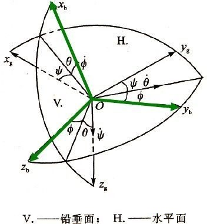

# 坐标变换

* [返回上层目录](../navigation.md)

[三维旋转：欧拉角、四元数、旋转矩阵、轴角之间的转换](https://zhuanlan.zhihu.com/p/45404840)

[飞行器飞行动力学（二）坐标系与夹角们](https://zhuanlan.zhihu.com/p/20926052)

[欧拉角速度与角速度的关系推导——欧拉运动方程](https://blog.csdn.net/a735148617/article/details/116740453)

[欧拉角速度和机体角速度](https://blog.csdn.net/qq_25544855/article/details/81944829)

[刚体的运动学与动力学方程](https://zhuanlan.zhihu.com/p/512513564)

