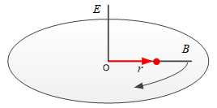

# 哥氏定理/科里奥利定理

- [返回上层目录](../navigation.md)

哥式定理用于描述绝对变化率和相对变化率间的关系

设有矢量$r$，$n$和$b$是相对旋转的两个坐标系，其中，$n$为与大地固连的导航坐标系，即北东地坐标系，$b$为与$oB$机体固连的体轴系。$b$系相对于$n$系的旋转角速度为$w_{eb}$，则哥式定理可以描述为
$$
\left.\frac{dr}{dt}\right|_n=\left.\frac{dr}{dt}\right|_b+w_{eb}\times r
$$

其中，$\left.\frac{dr}{dt}\right|_n$是在$n$系下观察到的矢量$r$相对于时间的变化率（绝对变化率），$\left.\frac{dr}{dt}\right|_b$是在$b$系下观察到的矢量$r$相对于时间的变化率（相对变化率），$w_{eb}\times r$是$b$系相对于$n$系旋转造成的矢量$r$相对于时间的变化率（牵连变化率）。

将公式中的矢量向$n$系投影，即定理公式在$n$系下表示，则为

$$
\dot{r}^e=C_b^e\dot{r}^b+w_{eb}^e\times r^m
$$
直观一点从小球绕柱的例子会好理解一些。如上图，以中间柱子为固定的$n$系，平面上的柱子为$b$系，中心为原点，指向小球的矢量为$r$，在$b$柱绕$n$柱旋转的同时，小球沿着$b$柱做沿着半径方向的平移运动，考虑小球的速度矢量。那么，从$n$系的角度来看小球的运动$\left.\frac{dr}{dt}\right|_n$，包括小球沿$b$柱方向的运动$\left.\frac{dr}{dt}\right|_b$，和$b$柱绕$n$柱产生的运动$w_{eb}^e\times r$。

# 参考资料

* [哥式定理](https://zhuanlan.zhihu.com/p/268592199)

本文复制自此知乎博客。

