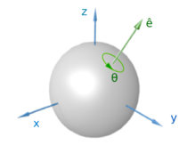
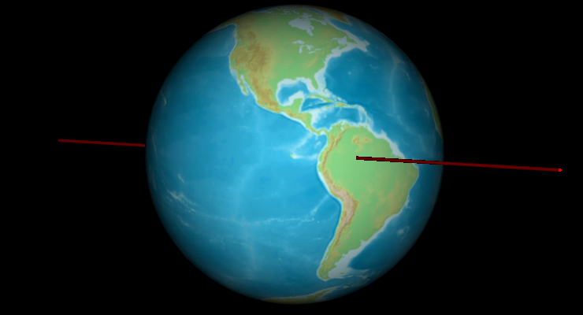

# 欧拉旋转定理

* [返回上层目录](../navigation.md)
* [欧拉旋转定理概述](#欧拉旋转定理概述)
  * [杜克大学的交互式网页体验](#杜克大学的交互式网页体验)
* [欧拉旋转定理证明](#欧拉旋转定理证明)

在运动学里，欧拉旋转定理(Euler's rotation theorem)表明，在三维空间里，假设一个刚体在做一个旋转的时候，刚体内部至少有一点固定不动，则此位移等价于一个绕着包含那固定点的固定轴的旋转。

这定理是以瑞士数学家莱昂哈德·欧拉命名。于1775年，欧拉使用简单的几何论述证明了这定理。

# 欧拉旋转定理概述

在几何学中，欧拉旋转定理指出，**在三维空间中，刚体的任何位移使得刚体上的点保持固定，相当于绕穿过该固定点的某个轴的单个旋转**。这也意味着两个旋转的组合也是一个旋转。因此，**旋转集合具有群结构，称为旋转群SO(3)**。

下图为由欧拉轴和角度表示的旋转：

该定理以Leonhard Euler的名字命名，他于1775年通过球面几何证明了该定理。旋转轴称为欧拉轴，通常由单位向量$\hat{e}$表示。它与旋转角度的乘积称为轴角向量。该定理向运动学的扩展产生了瞬时旋转轴（一条固定点的线）的概念。

在线性代数术语中，该定理指出，在3D空间中，任何两个具有共同原点的笛卡尔坐标系通过绕某个固定轴的旋转而相关。这也意味着两个旋转矩阵的乘积又是一个旋转矩阵，并且对于非单位旋转矩阵，一个特征值为1，另外两个都是复数，或者都等于-1。该特征值对应的特征向量就是连接两个系统的旋转轴。

## 杜克大学的交互式网页体验

与刚体固连的坐标系B相对坐标系A经过任意多次的简单转动后的最终方位，可由与刚体固连的坐标系B相对坐标系A的一次简单转动实现。

点击该网址：[https://services.math.duke.edu/~ajd91/so3/so3.html](https://services.math.duke.edu/~ajd91/so3/so3.html)，然后点击地球开始基于随机转轴的旋转，再次点击绕某个固定转轴就可以一次性返回开始旋转的姿态。

# 欧拉旋转定理证明

采用矩阵来证明：

空间旋转是与3x3旋转矩阵$R$一一对应的线性映射，将坐标向量$x$变换为$X$，即$Rx=X$。因此，欧拉旋转定理的另一个版本是，对于每次旋转$R$，都有一个非零向量$n$，满足$Rn=n$，这正是所说的$n$是$R$矩阵的特征值为1的特征向量。因此，只需要证明1是$R$矩阵的特征值即可。$R$矩阵表示的旋转的旋转轴将是$\mu n$向量表示的直线，其中$n$就是特征值为1的特征向量。

旋转矩阵有一个基本特性就是其逆矩阵等于其转置矩阵，即
$$
R^TR=R^TR=I
$$
其中，$I$是3x3的单位阵。

计算上式的行列式，会发现旋转矩阵的行列式的值为$\pm 1$：
$$
\begin{aligned}
&1=\det(I)=\det(R^TR)=\det(R^T)\det(R)=\det(R)\det(R)=\det(R)^2\\
\Rightarrow&\det(R)=\pm 1
\end{aligned}
$$
行列式为1的旋转矩阵被称为正确旋转。行列式为-1的旋转矩阵被称为不正确旋转，是反射和正确旋转的结合。

现在将证明，正确的旋转矩阵$R$（即$\det(R)=1$）具有至少一个不变向量$n$，即$Rn=n$，因为这要求$(R-I)n=0$，所以向量$n$必须是矩阵$R$的特征向量，其特征值为$\lambda=1$。因此，这相当于证明$\det(R-I)=0$。这是因为$Ax=0$，当$x$不是全零向量时，$A$矩阵必然是线性相关的，所以$\det(A)=0$。

**下面证明$\det(R-I)=0$，证明后就能说明$R$存在特征值为1的特征向量$n$了，也即说明$\mu n$是旋转轴了，这就证明了欧拉旋转定理**。

利用如下两个等式

（1）对于3x3矩阵$A$有：
$$
\det(-A)=(-1)^3\det(A)=-\det(A)
$$
（2）由于$\det(R)=1$，可得
$$
\det(R^{-1})=\det(R^T)=\det(R)=1
$$
来计算
$$
\begin{aligned}
&\det(R-I)\\
=&\det((R-I)^T)\\
=&\det(R^T-I)\\
=&\det(R^{-1}-R^{-1}R)\\
=&\det(R^{-1}(I-R))\\
=&\det(R^{-1})\det(-(R-I))\\
=&1\cdot(-1)^3\det(R-I)\\
=&-\det(R-I)
\end{aligned}
$$
可得
$$
\det(R-I)=0
$$
这表明$\lambda=1$是特征方程的解，因为$\det(R-\lambda I)=0$意味着$\lambda$为矩阵$R$的特征值。

所以当$\det(R-I)=0$时，$\lambda=1$是矩阵$R$的特征值。

换句话说，矩阵$R-I$是奇异的并且有非零解（即$(R-I)x=0$的解存在非零的$x$），即至少有一个非零向量$n$，对于$n$有
$$
(R-I)n=0
$$
即
$$
Rn=n
$$
对于实数$\mu$的直线$\mu n$在$R$下是不变的，即$\mu n$是旋转轴。这就证明了欧拉旋转定理。

# 参考资料

* [wikipedia: Euler's rotation theorem](https://en.wikipedia.org/wiki/Euler%27s_rotation_theorem)

本文主要参考了此维基百科。

* [简单转动与欧拉定理](https://www.bilibili.com/video/BV1Uh4y1E7rP/?vd_source=147fb813418c7610c21b6a5618c85cb7)

`与刚体固连的坐标系B相对坐标系A经过任意多次的简单转动后的最终方位，可由与刚体固连的坐标系B相对坐标系A的一次简单转动实现。`来自该视频22:30处。

