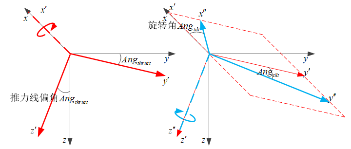
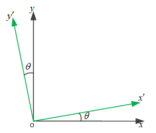
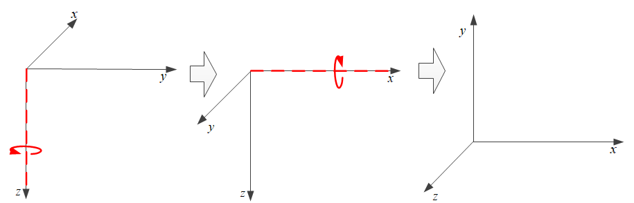
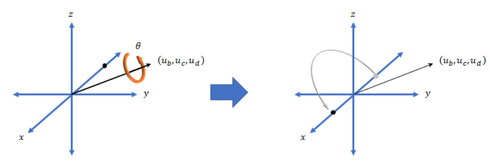

# 四元数

- [返回上层目录](../navigation.md)
- [为什么要用四元数](#为什么要用四元数)
- [四元数表示](#四元数表示)
- [四元数乘法](#四元数乘法)
  - [乘法定义](#乘法定义)
  - [共轭四元数](#共轭四元数)
- [四元数旋转](#四元数旋转)
  - [刚体的定点转动](#刚体的定点转动)
  - [四元数连乘表示连续旋转](#四元数连乘表示连续旋转)
  - [坐标变换](#坐标变换)
    - [由四元数得到坐标变换矩阵](#由四元数得到坐标变换矩阵)
    - [由四元数直接做坐标变换](#由四元数直接做坐标变换)
  - [线性插值](#线性插值)


# 为什么要用四元数

四元数的矢量部分直接对应了旋转轴，标量和矢量部分共同决定了旋转角，这是比欧拉角三个角表示旋转更为接近本质的方法。

相较于欧拉角求旋转向量坐标的方法，

* 四元数方法不需要进行求三角函数的运算，因此运算精度更高；
* 四元数不存在欧拉角的框架自锁问题

框架自锁问题如下：

欧拉角速率和机体轴角速率的关系为：
$$
\begin{aligned}
\begin{bmatrix}
\phi'\\
\theta'\\
\psi'\\
\end{bmatrix}
&=
\begin{bmatrix}
1&\tan\theta \sin\phi&\tan\theta \cos\phi\\
0&\cos\phi&-\sin\phi\\
0&\frac{\sin\phi}{\cos\theta}&\frac{\cos\phi}{\cos\theta}\\
\end{bmatrix}
\cdot
\begin{bmatrix}
p\\
q\\
r\\
\end{bmatrix}
\end{aligned}
$$
由上式可看出欧拉角表示方法存在的问题。例如，当俯仰角$\theta\rightarrow\pm90^{\circ}$时，由于方程含有$(\cos\theta)^{-1}$和$\tan\theta$项，使得横滚角变化率$\dot{\phi}$和航向角变化率$\dot{\psi}$无穷大，这种现象在工程上被称为框架自锁现象。解决这个问题的方法是采用四元数法。

# 四元数表示

四元数可看做高维版的复数：
$$
Q=q_0+q_1\overrightarrow{i}+q_2\overrightarrow{j}+q_3\overrightarrow{k}
$$
$Q$的大小（范数）为
$$
\left\|Q\right\|=q_0^2+q_1^2+q_2^2+q_3^2
$$
若$\left\|Q\right\|=1$，则$Q$称为规范化四元数，即**单位**四元数。


四元数$Q$的**共轭**四元数$Q^*$为（可类比为矩阵的转置）：
$$
\begin{aligned}
Q&=q_0+q_1\overrightarrow{i}+q_2\overrightarrow{j}+q_3\overrightarrow{k}\\
Q^*&=q_0-q_1\overrightarrow{i}-q_2\overrightarrow{j}-q_3\overrightarrow{k}
\end{aligned}
$$
则有
$$
Q\otimes Q^*=q_0^2+q_1^2+q_2^2+q_3^2=\left\| Q\right\|
$$

# 四元数乘法

## 乘法定义

两个四元数$Q_a$和$Q_b$相乘表示为
$$
Q_c=Q_a\otimes Q_b
$$
上式可写成矩阵形式
$$
\begin{aligned}
Q_c=Q_a\otimes Q_b&=
\begin{bmatrix}
q_{a_0}&-q_{a_1}&-q_{a_2}&-q_{a_3}\\
q_{a_1}&q_{a_0}&-q_{a_3}&q_{a_2}\\
q_{a_2}&q_{a_3}&q_{a_0}&-q_{a_1}\\
q_{a_3}&-q_{a_2}&q_{a_1}&q_{a_0}\\
\end{bmatrix}
\begin{bmatrix}
q_{b_0}\\
q_{b_1}\\
q_{b_2}\\
q_{b_3}\\
\end{bmatrix}
=M(Q_a)Q_b\\
&=
\begin{bmatrix}
q_{b_0}&-q_{b_1}&-q_{b_2}&q_{b_3}\\
q_{b_1}&q_{b_0}&q_{b_3}&-q_{b_2}\\
q_{b_2}&-q_{b_3}&q_{b_0}&q_{b_1}\\
q_{b_3}&q_{b_2}&-q_{b_1}&q_{b_0}\\
\end{bmatrix}
\begin{bmatrix}
q_{a_0}\\
q_{a_1}\\
q_{a_2}\\
q_{a_3}\\
\end{bmatrix}
=M'(Q_b)Q_a\\
\end{aligned}
$$

## 共轭四元数

四元数有一个类似矩阵转置的性质（*号代表**共轭**）：
$$
(Q_a\otimes Q_b)^*=Q_b^*\otimes Q_a^*
$$
四元数的逆$Q^{-1}$满足
$$
Q\otimes Q^{-1}=1
$$
而前面已知
$$
Q\otimes Q^*=q_0^2+q_1^2+q_2^2+q_3^2=\left\| Q\right\|
$$
上面两式对比可知四元数的逆$Q^{-1}$为：
$$
Q^{-1}=\frac{Q^*}{\left\|Q\right\|}
$$
若$Q$为单位四元数，即$\left\|Q\right\|=1$，则
$$
Q^{-1}=\frac{Q^*}{\left\|Q\right\|}=Q^*=q_0-q_1\overrightarrow{i}-q_2\overrightarrow{j}-q_3\overrightarrow{k}
$$

# 四元数旋转

## 刚体的定点转动

**四元数乘法相当于坐标转换，但是不能和向量直接相乘进行转换，必须要先转成旋转矩阵，再和向量相乘**

**单位四元数描述了刚体的定点转动**，可将单位四元数$Q$写为
$$
\begin{aligned}
Q&=q_0+q_1\overrightarrow{i}+q_2\overrightarrow{j}+q_3\overrightarrow{k}\\
&=\cos\frac{\theta}{2}+\overrightarrow{u}^R\sin\frac{\theta}{2}
\end{aligned}
$$
可看做是以三维空间单位向量$\overrightarrow{u}^R$（出发点在向量出发点处）为轴，右手定则，将向量旋转$\theta$，形成旋转后的新向量。如果把固连在向量上的坐标系看做机体坐标系$b$，那就可以认为，$b$系是由$R$系（初始坐标系，可看做惯性坐标系或大地坐标系）经过无中间过程的一次性等效旋转形成的。

记住，这里的**四元数$Q$表示的是，从大地轴系$R$，旋转到机体轴系$b$，别搞反了**。

## 四元数连乘表示连续旋转

**四元数乘法相当于坐标转换，但是不能和向量直接相乘进行转换，必须要先转成旋转矩阵，再和向量相乘**

如何把一个向量从四元数$Q_a$的姿态，旋转到$Q_b$的姿态呢？

想法很简单，先给四元数$Q_a$乘以其逆$Q_a^{-1}$，逆向旋转恢复到初始姿态，然后再乘以$Q_b$，从初始姿态旋转到$Q_b$的姿态。即
$$
Q_a\otimes Q_a^{-1}\otimes Q_b=Q_b
$$
如果规定四元数$Q_a^b$代表从$Q_a$的姿态旋转到$Q_b$表示的姿态，那么有
$$
Q_a\otimes Q_a^b=Q_b
$$
比较上两式，则显然有
$$
Q_a^b=Q_a^{-1}\otimes Q_b
$$
这就是**将四元数$Q_a$的姿态旋转到$Q_b$的姿态的四元数$Q_a^b$**。

注意，该四元数$Q_a^b$标识的旋转，是基于四元数$Q_a$表示的姿态的基础上的，而不是基于初始姿态（$Q_0=\cos(0)+\sin(0)\overrightarrow{u}$），就好比$Q_a$旋转时把基础姿态$$Q_0=\cos(0)+\sin(0)\overrightarrow{u}$$当做基础姿态一样

想要更深入的理解，那就看下面的matlab代码：

即**四元数连乘，其实就和基于欧拉角连续转动是一样的**

```matlab
% 由欧拉角转换到四元数
quat_yaw = quaternion([pi/3, 0, 0], 'euler', 'ZYX', 'frame')  % 0.866+0i+0j+0.5k
quat_pitch = quaternion([0, pi/3, 0], 'euler', 'ZYX', 'frame')  % 0.866+0i+0.5j+0k
quat_roll = quaternion([0, 0, pi/3], 'euler', 'ZYX', 'frame')  % 0.866+0.5i+0j+0k

% 定义基于欧拉角的旋转[yaw=60, pitch=60, roll=0]
% 欧拉角转四元数
quat_yp = quaternion([pi/3, pi/3, 0], 'euler', 'ZYX', 'frame')  % 0.75-0.25i+0.433j+0.433k
% 四元数转欧拉角（度）
euler_zyx = eulerd(quat_yp,'ZYX', 'frame')  % [yaw=60, pitch=60, roll=0]
% 四元数转旋转矩阵（注意是大地轴系转机体轴系）
C_n2b_yp = rotmat(quat_yp, 'frame')
% [ 0.250    0.433   -0.866
%  -0.866    0.500        0
%   0.433    0.750    0.500]

% 由两个表示中间旋转过程的的四元数连乘得到最终四元数
% 先yaw旋转60度，再pitch旋转60度
quat_yp_q = quat_yaw * quat_pitch  % 0.75-0.25i+0.433j+0.433k
% 由四元数转换为欧拉角
euler_zyx_q = eulerd(quat_yp_q,'ZYX','frame')  % [yaw=60, pitch=60, roll=0]
% 四元数转为旋转矩阵（注意是大地轴系转机体轴系）
C_n2b_q = rotmat(quat_yp_q,'frame')
% [ 0.250    0.433   -0.866
%  -0.866    0.500        0
%   0.433    0.750    0.500]

% 直接从欧拉角得到坐标变换矩阵（大地轴系到机体轴系）
psi = pi/3;
theta = pi/3;
R_psi = [cos(psi)  sin(psi) 0; -sin(psi) cos(psi) 0; 0 0 1];
R_theta = [cos(theta) 0 -sin(theta); 0 1 0; sin(theta) 0 cos(theta)];
C_n2b = R_theta * R_psi  % （大地轴系到机体轴系）
% [ 0.250    0.433   -0.866
%  -0.866    0.500        0
%   0.433    0.750    0.500]
```

现在应该已经初步理解了四元数连乘表示连续旋转了吧。那么就继续接着看。

下面来深入理解一下飞控程序中倾斜和旋转分离的四元数变换，解释一下倾转分离：多旋翼的姿态控制，首先要保证俯仰角和滚转角优先达到期望姿态，然后偏航角再达到期望姿态，偏航角并不重要，因为就算偏航角有偏差，也坠毁不了。

所以我们的任务是，要把一个包换pitch和roll倾斜加yaw旋转的姿态变换，分离成单独的两个四元数变换，先进行pitch和roll倾斜的四元数变换，然后yaw旋转的四元数变换。然后对yaw旋转的角度做一个缩小限制后得到新的四元数，再把原来的倾斜四元数和缩小后的旋转四元数相乘，就得到新的旋转，这个旋转保证了飞机的倾斜角和原来的旋转一致，但是yaw旋转角小于原来的旋转，即新旧坐标变换的z轴保持一致，xy轴不一致。

那现在就开始吧。

首先定义pitch和roll倾斜，假设倾斜只旋转了滚转角，即从0转为30度，等效为推力矢量线偏转（即$Ang_{thrust}$）。

然后定义yaw旋转，yaw旋转45度（即$Ang_{tilt}$）。

也就是说，新的姿态是先roll倾斜30度，再yaw旋转45度。

对于变换后的姿态，我们要把倾斜和旋转分离，并把旋转从45度限制为30度。



使用下面一段代码验证了倾转分离的等效性，即**四元数直接的一次旋转等于先roll旋转再yaw旋转**。

```matlab
% 欧拉角转四元数（注意，为了模拟推力线倾斜和yaw旋转的作用，采用XYZ欧拉角旋转方式，即roll->pitch-yaw）
quat_ry = quaternion([pi/6, 0, pi/4], 'euler', 'XYZ', 'frame')  % 0.8924+0.23912i-0.099046j+0.36964k
% 四元数转欧拉角（度）
euler_xyz = eulerd(quat_ry,'XYZ', 'frame')  % [roll=30, pitch=0, yaw=45]
% 四元数转旋转矩阵（注意是大地轴系转机体轴系）
C_n2b_ry = rotmat(quat_ry, 'frame')
% [ 0.7071    0.6124    0.3536
%  -0.7071    0.6124    0.3536
%  -0.0000   -0.5000    0.8660]

% 由欧拉角转换到四元数
quat_roll = quaternion([pi/6, 0, 0], 'euler', 'XYZ', 'frame')  % 0.96593+0.25882i+0j+0k
quat_yaw = quaternion([0, 0, pi/4], 'euler', 'XYZ', 'frame')  % 0.92388+0i+0j+0.38268k
% 由两个表示中间旋转过程的的四元数连乘得到最终四元数
% 先roll旋转30度，再yaw旋转45度
quat_ry_q = quat_roll * quat_yaw  % 0.8924+0.23912i-0.099046j+0.36964k
% 由四元数转换为欧拉角
euler_xyz_q = eulerd(quat_ry_q,'XYZ','frame')  % [[roll=30, pitch=0, yaw=45]
% 四元数转为旋转矩阵（注意是大地轴系转机体轴系）
C_n2b_q = rotmat(quat_ry_q,'frame')
% [ 0.7071    0.6124    0.3536
%  -0.7071    0.6124    0.3536
%  -0.0000   -0.5000    0.8660]

% 直接从欧拉角得到坐标变换矩阵（大地轴系到机体轴系）
psi = pi/4;
phi = pi/6;
R_psi = [cos(psi) sin(psi) 0; -sin(psi) cos(psi) 0; 0 0 1];
R_phi = [1 0 0; 0 cos(phi) sin(phi); 0 -sin(phi) cos(phi)];
C_n2b = R_psi * R_phi  % （大地轴系到机体轴系）
% [ 0.7071    0.6124    0.3536
%  -0.7071    0.6124    0.3536
%  -0.0000   -0.5000    0.8660]
```

然后，由前面的理论

> 如果规定四元数$Q_a^b$代表从$Q_a$的姿态旋转到$Q_b$表示的姿态，那么有
> $$
> Q_a\otimes Q_a^b=Q_b
> $$
> 比较上两式，则显然有
> $$
> Q_a^b=Q_a^{-1}\otimes Q_b
> $$
> 这就是**将四元数$Q_a$的姿态旋转到$Q_b$的姿态的四元数$Q_a^b$**。

这里$Q_a=Q_{roll}$，$Q_a^b=Q_{yaw}$，$Q_b=Q_{ry}$，即有
$$
Q_{roll}\otimes Q_{yaw} = Q_{ry}
$$
则可知$Q_{yaw}=Q_{roll}^{-1}\otimes Q_{ry}$

下面用matlab来实现上面的公式

```matlab
% 根据quat_ry_q = quat_roll * quat_yaw，已知quat_ry_q和quat_roll，求quat_yaw
% 方法就是quat_yaw = inv(quat_roll) * quat_ry_q
% 已知quat_ry_q = 0.8924+0.23912i-0.099046j+0.36964k
%     quat_roll = 0.96593+0.25882i+0j+0k
%     quat_yaw = 0.92388+0i+0j+0.38268k
% 嗯，和预想的一样
quat_yaw_q = quat_roll' * quat_ry_q  % 0.92388+0i+0j+0.38268k
euler_xyz = eulerd(quat_yaw_q,'XYZ', 'frame')  % [roll=0, pitch=0, yaw=45]
```

现在我们成功地将yaw的四元数给分离出来了，并且验证了分离出来的yaw四元数可以转换成欧拉角。

下面我们把分离出来的yaw四元数转换成轴角，并进行缩小，然后又转换成yaw四元数，再和roll四元数连乘，就是新的缩小yaw角后的tilt减小的四元数了，再把该四元数转到欧拉角，可以清楚地看到yaw角被缩小成了30度，不再是原来的45度了。该过程的具体matlab代码如下：

```matlab
% 转为轴角
yaw_vec = rotvecd(quat_yaw_q)  % [0 0 45]
yaw_vec = [0 0 30]
quat_yaw_vec = quaternion(yaw_vec,'rotvecd')  % 0.96593+0i+0j+0.25882k
% 由四元数转换为欧拉角
euler_xyz_q = eulerd(quat_yaw_vec, 'XYZ', 'frame')  % [[roll=0, pitch=0, yaw=30]

% 重新计算新的四元数quat_ry_q = quat_roll * quat_yaw
quat_ry_q = quat_roll * quat_yaw_vec  % 0.93301+0.25i-0.066987j+0.25k
% 看，就是我们想要的欧拉姿态角：[roll=30, pitch=0, yaw=30]，roll和pitch没变，yaw变为了30度
euler_xyz = eulerd(quat_ry_q, 'XYZ', 'frame')  % [roll=30, pitch=0, yaw=30]
```

总结：

要**正确理解四元数连乘的作用**，就要认识到，**四元数连乘本质就是做坐标变换，你想想欧拉角的坐标变换矩阵的推导过程，是不是就是单独欧拉角的坐标变换矩阵的连乘得到的？是吧。只不过，单独四元数不能直接和向量相乘来完成坐标变换罢了。**

## 坐标变换

虽然**四元数乘法相当于坐标转换，但是不能和向量直接相乘进行转换，必须要先转成旋转矩阵，再和向量相乘**，那有没有办法能直接让四元数和向量相乘进行坐标转换呢？

有的，两种方式

### 由四元数得到坐标变换矩阵

$$
C_b^n=
\begin{bmatrix}
1-2(q_2^2+q_3^2)&2(q_1q_2-q_0q_3)&2(q_1q_3+q_0q_2)\\
2(q_1q_2+q_0q_3)&1-2(q_1^2+q_3^2)&2(q_2q_3-q_0q_1)\\
2(q_1q_3-q_0q_2)&2(q_2q_3+q_0q_1)&1-2(q_1^2+q_2^2)\\
\end{bmatrix}
$$

注意：前面我们一直在各种推导的$Q$都是把矢量从$n$系（大地轴系）旋转到$b$系（机体轴系），但是现在这个坐标转换矩阵是将坐标从$b$系（机体轴系）转到$n$系（大地轴系）。

这就好比，旋转矩阵
$$
\begin{aligned}
R_b^n=
\begin{bmatrix}
\cos(\theta)&-\sin(\theta)\\
\sin(\theta)&\cos(\theta)
\end{bmatrix}
\end{aligned}
$$
可以将$xoy$系的向量$r$绕$z$轴旋转$\theta$角。



以$xoy$系的向量$[1,0]$为例，旋转$\theta$角的过程为
$$
\begin{aligned}
\begin{bmatrix}
\cos(\theta)\\
\sin(\theta)
\end{bmatrix}
=
\begin{bmatrix}
\cos(\theta)&-\sin(\theta)\\
\sin(\theta)&\cos(\theta)
\end{bmatrix}
\end{aligned}
\begin{bmatrix}
1\\
0
\end{bmatrix}
$$
注意，这是在$xoy$系旋转向量，还不涉及坐标转换。

然后，如果需要把$x'oy'$系的向量的坐标变换到$xoy$系，类似于从$b$系变到$n$系，则可使用该矩阵：
$$
\begin{aligned}
\begin{bmatrix}
\cos(\theta)\\
\sin(\theta)
\end{bmatrix}
=
\begin{bmatrix}
\cos(\theta)&-\sin(\theta)\\
\sin(\theta)&\cos(\theta)
\end{bmatrix}
\end{aligned}
\begin{bmatrix}
1\\
0
\end{bmatrix}
$$
注意，上式的向量$[1,0]^T$是在$x'oy'$系中的坐标，然后该向量在$xoy$系中的坐标，就是$[\cos(\theta), \sin(\theta)]^T$。

### 由四元数直接做坐标变换

四元数是四维的，向量坐标是三维的，那怎么直接做坐标变换呢？

需要把待变换坐标的向量$r$看做零标量的四元数，即$r=[0, r^T]^T$，扩增成四维的。则$r^n$和$r^b$之间的变换关系可采用四元数乘法来直接表示：
$$
r_n=Q\otimes r_b\otimes Q^*
$$
这就是坐标变换的四元数乘法表示。注意：$Q$是将向量从$n$系旋转到$b$系的旋转四元数。

证明过程略。

其实，**这可以扩充到对四元数旋转的变换**：

> qo_f1 = orientation of frame F1(b) as seen from frame F2(n)
> qo_f2  = orientation of frame F2(n) as seen from F1(b))
> q_f1 = some quaternion in F1(b) frame
> q_f2 = q_f1 as seen from F2(n)

则

> q_f2 = qo_f2 * q_f1 * qo_f2.inverse()

参考来源：[Convert Quaternion representing rotation from one coordinate system to another](https://stackoverflow.com/questions/18818102/convert-quaternion-representing-rotation-from-one-coordinate-system-to-another)

下面用matlab来验证

> q_f1 = qo_f2.inverse() * q_f2 * qo_f2



对于上述旋转，

```matlab
% 在地轴系下把向量旋转为体轴系
quat_n = quaternion([pi/2, 0, -pi/2], 'euler', 'ZYX', 'frame')  % 0.5-0.5i-0.5j+0.5k
euler_zyx = eulerd(quat_n ,'ZYX', 'frame')  % [yaw=90, pitch=0, roll=-90]
% 把地轴系下的向量[1,0,0]变成四元数形态，为了方便做四元数坐标转换
r_n = quaternion(0, 1, 0, 0)  % 0+1i+0j+0k,绕x旋转180度
% 把向量坐标从地轴系转换到体轴系系下
r_n_roted = quat_n' * r_n * quat_n  % 0+0i+0j-1k，绕-z旋转180度
```

把地轴系下的轴角转换的四元数，坐标变换到体轴系下，还是同一个旋转，只不过不同轴系下的表示方式不一样而已。在地轴系下，轴角四元数为绕着x轴转30度；在体轴系下，变换后的轴角四元数为绕着z轴转-30度。你自己模拟一下，是不是这个旋转在绝对空间中是一样的，方向大小都没变！

```matlab
% 地轴系下的轴角合成的四元数
quat_n_rot = quaternion([30, 0, 0],'rotvecd') % from轴角 0.96593+0.25882i+0j+0k
quat_n_rot = quat_n' * quat_n_rot * quat_n  % 0.96593+0i+0j-0.25882k
euler_zyx = eulerd(quat_n_rot,'ZYX', 'frame')  % [yaw=-30, pitch=0, roll=0]
```

## 四元数的轴角矢量表示法的高级用法

轴角法的轴和角如下图：



地轴系下，先绕$x$轴（roll）旋转$30^{\circ}$，然后绕$z$轴（yaw）旋转$45^{\circ}$。注意，这里是按照XYZ的顺序旋转的欧拉角，不是我们平时使用的ZYX顺序的欧拉角。这里这么做的目的是为了简单起见。


然后我们想做的就是，把这两次旋转用四元数表示，即

* 先绕$x$轴（roll）旋转$30^{\circ}$，对应四元数为

  ```matlab
  quat_roll = quaternion([pi/6, 0, 0], 'euler', 'XYZ', 'frame')  
  % 0.96593+0.25882i+0j+0k 注意：cosd(30/2)=0.96593, sind(30/2)=0.25882
  ```

* 然后绕$z$轴（yaw）旋转$45^{\circ}$。

  ```matlab
  quat_yaw = quaternion([0, 0, pi/4], 'euler', 'XYZ', 'frame')
  % 0.92388+0i+0j+0.38268k
  ```

然后把这两个旋转合成为一个旋转，即可以用四元数相乘：

```matlab
%  get final quat from two middle quat
%  roll 30 deg, then yaw 45 deg
quat_ry_q = quat_roll * quat_yaw  
% 0.8924+0.23912i-0.099046j+0.36964k
```

来验证下这个合成后的四元数对不对，将该四元数转换成欧拉角（注意是YXZ顺序）进行验证

```matlab
% from quat to euler (XYZ)
euler_xyz_q = eulerd(quat_ry_q,'XYZ','frame')  
% [roll=30, pitch=0, yaw=45]
```

结果显示就是先绕roll转$30^{\circ}$，然后绕yaw转$45^{\circ}$。说明组合的旋转是对的。其次，又再次验证了四元数的旋转和旋转坐标的旋转是一样的。

下面将这个合成的四元数，转换成轴角表示：

```matlab
% get angle (NOT euler angel) with no order
angle_xyz = rotvecd(quat_ry_q)
% 28.4280  -11.7753   43.9459
```

可以看出，先绕roll转$30^{\circ}$，然后绕yaw转$45^{\circ}$，这种按顺序的欧拉角旋转，等效于按照矢量[x=28.4280  y=-11.7753   z=43.9459]​进行一次旋转，其中，该矢量的方向代表旋转轴，各轴分量代表旋转轴在各轴分量上的旋转角度。

此外，该矢量[x=28.4280  y=-11.7753   z=43.9459]也可以认为是姿态控制中的角度误差，而不能是欧拉角表示的[x=30  y=-0   z=45]，因为该角度不是一次旋转而成的，而是按顺序旋转得到的。实际控制的时候，肯定会同时转，而不是按欧拉角顺序转。欧拉角顺序只是数学上表示姿态的方式，实际的旋转都是一次旋转到位的。

上述代码总结如下：

```matlab
% from XYZ euler to quat
quat_roll = quaternion([pi/6, 0, 0], 'euler', 'XYZ', 'frame')  % 0.96593+0.25882i+0j+0k
quat_yaw = quaternion([0, 0, pi/4], 'euler', 'XYZ', 'frame')  % 0.92388+0i+0j+0.38268k
%  get final quat from two middle quat
%  roll 30 deg, then yaw 45 deg
quat_ry_q = quat_roll * quat_yaw  % 0.8924+0.23912i-0.099046j+0.36964k
% from quat to euler (XYZ)
euler_xyz_q = eulerd(quat_ry_q,'XYZ','frame')  % [roll=30, pitch=0, yaw=45]
% get angle (NOT euler angel) with no order
angle_xyz = rotvecd(quat_ry_q) % 28.4280  -11.7753   43.9459
```

## 线性插值

请查看matlab中的四元数的slerp函数。

# 参考资料


===

* [一个对四元数旋转的简单推导](https://zhuanlan.zhihu.com/p/166674954)
* [Understanding Quaternions 中文翻译《理解四元数》](https://www.qiujiawei.com/understanding-quaternions/)

四元数旋转与插值（slerp）。

* [四元数与三维旋转](https://krasjet.github.io/quaternion/quaternion.pdf)

这个讲四元数旋转讲的很详细。

* [3Blue1Brown四元数的可视化](https://www.bilibili.com/video/BV1SW411y7W1)

* [3Blue1Brown四元数和三维转动](https://www.bilibili.com/video/BV1Lt411U7og)，[可互动的探索式视频](https://eater.net/quaternions)

直观认识四元数，不过比较难以想象四维空间。。

* [四元数的定义与性质](https://blog.csdn.net/wxc_1998/article/details/119038069)

Graßmann积。纯四元数有一个很重要的特性：如果有两个纯四元数

* [一文详解四元数、欧拉角、旋转矩阵、轴角如何相互转换](https://mp.weixin.qq.com/s?__biz=MzU0NjgzMDIxMQ==&mid=2247487439&idx=1&sn=da8c277d40911b114038a415f5873ac9&chksm=fb56ed23cc216435c3bac0429620492e6b4380a63f30f026c8377f37bd81577a320188e1a404&scene=27)

* [三维旋转：欧拉角、四元数、旋转矩阵、轴角之间的转换](https://zhuanlan.zhihu.com/p/45404840)


