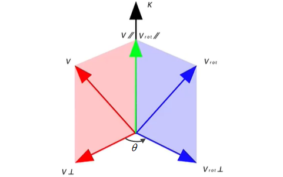
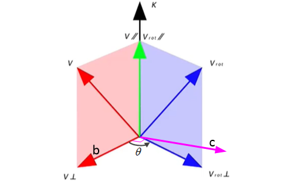
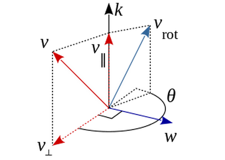

# 罗德里格斯公式

* [返回上层目录](../navigation.md)
* [旋转向量](#旋转向量)
* [罗德里格斯公式定义](#罗德里格斯公式定义)
* [罗德里格斯公式推导](#罗德里格斯公式推导)
  * [叉积矩阵讲解](#叉积矩阵讲解)
  * [罗德里格斯公式推导一](#罗德里格斯公式推导一)
  * [罗德里格斯公式推导二](#罗德里格斯公式推导二)
* [已知旋转矩阵求旋转角度和旋转向量](#已知旋转矩阵求旋转角度和旋转向量)
* [罗德里格斯公式理解和深入](#罗德里格斯公式理解和深入)
* [极限的方式简洁推导罗德里格斯公式](#极限的方式简洁推导罗德里格斯公式)

罗德里格斯公式（Rodrigues‘s Formula）是数学中一种广泛应用于旋转向量计算和旋转矩阵表示的几何变换方法。

罗德里格斯公式是由19世纪的数学家罗德里格斯（Rodrigues）提出的，它为旋转向量的计算和旋转矩阵的表示提供了一种简洁高效的方式。通过该公式，我们可以方便地描述和应用旋转操作，实现在三维空间中的几何变换。

# 旋转向量

根据**欧拉旋转定理**（具体内容和证明可查看对应章节），实际上，任意旋转都可以用一个旋转轴和一个旋转角来刻画。我们可以使用一个向量$u$，其方向与旋转轴一致，其长度等于旋转角$\theta$，那么向量$\theta u$就可以描述这个旋转，这种向量称为旋转向量（或轴角/角轴，Axis-Angle），只需一个三维向量即可描述旋转。

# 罗德里格斯公式定义

罗德里格斯公式是计算机视觉中的一大经典公式，在描述相机位姿的过程中很常用。

旋转矩阵$R$的表达式为
$$
R=I+(1-\cos\theta)K^2+\sin\theta K
$$
或者
$$
R=\cos\theta\cdot I+(1-\cos\theta)kk^T+\sin\theta K
$$
其中，$K$为$k=[k_x,k_y,k_z]^T$的叉积矩阵，显然$K$是一个反对称矩阵：
$$
K=
\begin{bmatrix}
0 & -k_z & k_y\\
k_z & 0 & -k_x\\
-k_y & k_x & 0
\end{bmatrix}
$$
在三维空间中，旋转矩阵$R$可以对坐标系（基向量组）进行刚性的旋转变换。
$$
R=
\begin{bmatrix}
r_{xx}&r_{xy}&r_{xz}\\
r_{yx}&r_{yy}&r_{yz}\\
r_{zx}&r_{zy}&r_{zz}
\end{bmatrix}
$$
通常为了方便计算，基向量组中的向量是相互正交的且都为单位向量，那么$R$就是一个标准三阶正交矩阵。

由于$R$矩阵每两列都正交，所以有三个约束，由于$R$矩阵每列的模都是1，所以有三个约束。而$R$矩阵一共有9个参数，减去这6个约束，就剩3个自由度了。

所以，**$R$矩阵的自由度为3，说明最少可以用三个变量来表示旋转矩阵$R$，这就是罗德里格斯公式存在的基础**。

罗德里格斯公式首先要确定一个三维的单位向量$k=[k_x,k_y,k_z]^T$（两个自由度）和一个标量$\theta$。

# 罗德里格斯公式推导

## 叉积矩阵讲解

作为前置知识，这里提前讲引入叉积矩阵的概念。

记$K$为$k=[k_x,k_y,k_z]^T$的叉积矩阵。显然$K$是一个反对称矩阵。
$$
K=
\begin{bmatrix}
0 & -k_z & k_y\\
k_z & 0 & -k_x\\
-k_y & k_x & 0
\end{bmatrix}
$$
它有如下性质：
$$
k\times v=Kv
$$
这是为什么呢？现在来推导
$$
\begin{aligned}
a\times b
&=\begin{vmatrix}
i & j & k\\
a_1 & a_2 & a_3\\
b_1 & b_2 & b_3
\end{vmatrix}\\
&=(a_2b_3-a_3b_2)i+(a_3b_1-a_1b_3)j+(a_1b_2-a_2b_1)k\\
&=\begin{bmatrix}
a_2b_3-a_3b_2\\
a_3b_1-a_1b_3\\
a_1b_2-a_2b_1
\end{bmatrix}\\
&=\begin{bmatrix}
0 & -a_3 & a_2\\
a_3 & 0 & -a_1\\
-a_2 & a_1 & 0
\end{bmatrix}
\begin{bmatrix}
b_1\\
b_2\\
b_3
\end{bmatrix}\\
&=a^{\land}b
\end{aligned}
$$
$a^{\land}$实际上是一个反对称矩阵，可以把$a\times b$写成矩阵与向量的乘法$a^{\land}b$，变成线性运算。此符号是一个一一映射，意味着任意向量都对应着唯一的一个反对称矩阵，反之亦然。

注意叉积矩阵$K$的平方$K^2$为
$$
\begin{aligned}
K^2&=
\begin{bmatrix}
0 & -k_z & k_y\\
k_z & 0 & -k_x\\
-k_y & k_x & 0
\end{bmatrix}
\begin{bmatrix}
0 & -k_z & k_y\\
k_z & 0 & -k_x\\
-k_y & k_x & 0
\end{bmatrix}\\
&=\begin{bmatrix}
-k_z^2-k_y^2 & k_xk_y & k_xk_z\\
k_xk_y & -k_z^2-k_x^2 & k_yk_z\\
k_xk_z & k_yk_z & -k_y^2-k_x^2
\end{bmatrix}
\end{aligned}
$$
这个$K^2$下面要多次用到，就先提前在这写出来。

## 罗德里格斯公式推导一

这是第一种推导方法，没推导二巧妙和简洁，**不建议看这个**，仅仅作为备用放在这，**直接看推导二吧**。

如下图所示，需要把向量$v$以单位向量$k$为转轴，旋转角度$\theta$到向量$v_{rot}$的位置。

这其实相当于把单位向量$k$和$v$组成的红色矩形（$v$为该矩形的对角线），旋转$\theta$角度到$k$和$v_{rot}$组成的蓝色矩形（$v_{rot}$为该矩形的对角线），具体如下图所示：

现在开始正式推导：

做辅助向量$v_{\bot}$，该向量在$v$和$k$形成的平面内并且垂直于$k$。

类似地，做辅助向量$v_{rot\bot}$，该向量在$v_{rot}$和$k$形成的平面内并且垂直于单位向量$k$。

做辅助向量$v_{\parallel}$或者叫$v_{rot\parallel}$，是向量$v$或者向量$v_{rot}$在单位向量$k$上的投影，为了方便起见，以后就只称其为$v_{\parallel}$。

根据
$$
\begin{aligned}
v&=v_{\bot}+v_{\parallel}\\
v_{rot}&=v_{rot\bot}+v_{\parallel}
\end{aligned}
$$
计算$v_{\parallel}$：上式中的把$v_{\parallel}$用已知的$v$和$k$来表示，就是
$$
v_{\parallel}=(v\cdot k)k
$$
计算$v_{\bot}$：则$v_{\bot}$为$v_{\bot}=v-v_{\parallel}=v-(v\cdot k)k$。

但还有另一种计算方法：仔细观察，其实$v_{\bot}$的长度就是$\left \|v\times k\right \|$（$k$为单位向量）。那么接下来只需要确定$v_{\bot}$的方向即可。仔细观察，先构造垂直于红色矩形的向量，即$k\times v$，这个向量已经包含了$v_{\bot}$的长度了，那只需要把这个向量转到和$v_{\bot}$一个方向就行，该怎么转向呢？用$-k$和这个向量叉乘就行。即
$$
v_{\bot}=-k\times(k\times v)
$$
计算$v_{rot\bot}$：因为$v_{rot\bot}$就是$v_{\bot}$旋转了$\theta$角度转过来的，所以其模长和$v_{\bot}$是一样的，只不过方向不一样。计算$v_{rot\bot}$前，需要先定义两个相互垂直的基坐标$b$和$c$，然后用这两个基坐标来表示$v_{rot\bot}$。

如下图所示，

坐标轴$b$就是和$v_{\bot}$同方向的单位向量，即
$$
b=\frac{v_{\bot}}{\left\|v_{\bot}\right\|}
$$
坐标轴$c$在$v_{\bot}$和$v_{rot\bot}$构成的平面上，且垂直于$v_{\bot}$，方向与$k\times v_{\bot}$同向，即
$$
c=\frac{k\times v_{\bot}}{\left\|v_{\bot}\right\|}=\frac{k\times v}{\left\|v_{\bot}\right\|}
$$
那显然，$v_{rot\bot}$为
$$
\begin{aligned}
v_{rot\bot}&=\left\|v_{\bot}\right\|(\cos\theta\cdot b+\sin\theta\cdot c)\\
&=\left\|v_{\bot}\right\|(\cos\theta\cdot \frac{v_{\bot}}{\left\|v_{\bot}\right\|}+\sin\theta\cdot \frac{k\times v}{\left\|v_{\bot}\right\|})\\
&=\cos\theta\cdot v_{\bot}+\sin\theta\cdot (k\times v)
\end{aligned}
$$
那结果就很显然了
$$
\begin{aligned}
v_{rot}&=v_{rot\bot}+v_{\parallel}\\
&=\cos\theta\cdot v_{\bot}+\sin\theta\cdot (k\times v)+v_{\parallel}\\
&=\cos\theta\cdot (v-v_{\parallel})+\sin\theta\cdot (k\times v)+v_{\parallel}\\
&=\cos\theta\cdot v+(1-\cos\theta)v_{\parallel}+\sin\theta\cdot (k\times v)\\
&=\cos\theta\cdot v+(1-\cos\theta)(v\cdot k)k+\sin\theta\cdot (k\times v)\\
\end{aligned}
$$
**这就是罗德里格斯公式了**！推导结束，有点累人。

为了方便，下面写成矩阵形式：

再引入叉积矩阵的概念：记$K$为$k=[k_x,k_y,k_z]^T$的叉积矩阵。显然$K$是一个反对称矩阵。
$$
K=
\begin{bmatrix}
0 & -k_z & k_y\\
k_z & 0 & -k_x\\
-k_y & k_x & 0
\end{bmatrix}
$$
它有如下性质：
$$
k\times v=Kv
$$
接着化简
$$
\begin{aligned}
v_{rot}&=\cos\theta\cdot v+(1-\cos\theta)(v\cdot k)k+\sin\theta\cdot (k\times v)\\
&=\cos\theta \cdot I\cdot v+(1-\cos\theta)k(k\cdot v)+\sin\theta\cdot k\times v\\
&=\cos\theta \cdot I\cdot v+(1-\cos\theta)k(k\cdot v)+\sin\theta\cdot k\times v\\
&=\cos\theta \cdot I\cdot v+(1-\cos\theta)\cdot M\cdot v+\sin\theta\cdot K\cdot v\quad\text{what's M?}\\
&=[\cos\theta \cdot I+(1-\cos\theta)\cdot M+\sin\theta\cdot K]\cdot v\\
\end{aligned}
$$
上式中把$k(k\cdot v)$形式化为了$M\cdot v$，现在推导$M$的具体形式：
$$
\begin{aligned}
k(k\cdot v)&=
\begin{bmatrix}
k_x\\
k_y\\
k_z
\end{bmatrix}
(
\begin{bmatrix}
k_x & k_y & k_z
\end{bmatrix}
\begin{bmatrix}
v_x\\
v_y\\
v_z
\end{bmatrix}
)\\
&=(k_x\cdot v_x + k_y\cdot v_y + k_z\cdot v_z)\cdot
\begin{bmatrix}
k_x\\
k_y\\
k_z
\end{bmatrix}\\
&=\begin{bmatrix}
k_x^2\cdot v_x + k_xk_y\cdot v_y + k_xk_z\cdot v_z\\
k_xk_y\cdot v_x + k_y^2\cdot v_y + k_yk_z\cdot v_z\\
k_xk_z\cdot v_x + k_yk_z\cdot v_y + k_z^2\cdot v_z
\end{bmatrix}\\
&=\begin{bmatrix}
k_x^2 & k_xk_y & k_xk_z\\
k_xk_y & k_y^2 & k_yk_z\\
k_xk_z & k_yk_z & k_z^2
\end{bmatrix}
\begin{bmatrix}
v_x\\
v_y\\
v_z
\end{bmatrix}\\
&=Mv
\end{aligned}
$$
所以，矩阵$M$为
$$
\begin{aligned}
M&=\begin{bmatrix}
k_x^2 & k_xk_y & k_xk_z\\
k_xk_y & k_y^2 & k_yk_z\\
k_xk_z & k_yk_z & k_z^2
\end{bmatrix}\\
&=\begin{bmatrix}
1 & 0 & 0\\
0 & 1 & 0\\
0 & 0 & 1
\end{bmatrix}
+
\begin{bmatrix}
-k_z^2-k_y^2 & k_xk_y & k_xk_z\\
k_xk_y & -k_z^2-k_x^2 & k_yk_z\\
k_xk_z & k_yk_z & -k_y^2-k_x^2
\end{bmatrix}\\
&=I+K^2\\
&=\begin{bmatrix}
k_x\\
k_y\\
k_z
\end{bmatrix}
\begin{bmatrix}
k_x & k_y & k_z\\
\end{bmatrix}\\
&=kk^T
\end{aligned}
$$
其中，$K$为转轴向量$k$的叉积矩阵。

替换$M$矩阵，有
$$
\begin{aligned}
v_{rot}&=(\cos\theta \cdot I+(1-\cos\theta)\cdot M+\sin\theta\cdot K)\cdot v\\
&=(\cos\theta \cdot I+(1-\cos\theta)\cdot (I+K^2)+\sin\theta\cdot K)\cdot v\\
&=(\cos\theta\cdot I+I+K^2-\cos\theta\cdot I-\cos\theta \cdot K^2-\sin\theta\cdot K)\cdot v\\
&=[I+(1-\cos\theta)K^2+\sin\theta\cdot K]\cdot v
\end{aligned}
$$
或者
$$
\begin{aligned}
v_{rot}&=[\cos\theta \cdot I+(1-\cos\theta)\cdot M+\sin\theta\cdot K]\cdot v\\
&=[\cos\theta \cdot I+(1-\cos\theta)\cdot kk^T+\sin\theta\cdot K]\cdot v
\end{aligned}
$$
所以旋转矩阵$R$（即满足$v_{rot}=R\cdot v$）为
$$
R=I+(1-\cos\theta)K^2+\sin\theta\cdot K
$$
或者
$$
R=\cos\theta \cdot I+(1-\cos\theta)\cdot kk^T+\sin\theta\cdot K
$$
终于彻底推导出来了。。。

## 罗德里格斯公式推导二

这是第二种推导方法：

对向量$v$做旋转，三维的单位向量$k=[k_x,k_y,k_z]^T$是旋转轴，$\theta$是旋转角度，$v_{rot}$是旋转后的向量。

先通过点积得到$v$在$k$方向的平行向量$v_{\parallel}$。
$$
v_{\parallel}=(v\cdot k)k
$$
再通过叉乘得到与$k$正交的两个向量$v_{\bot}$和$w$。
$$
\begin{aligned}
v_{\bot}&=v-v_{\parallel}=v-(v\cdot k)k=-k\times(k\times v)\\
w&=k\times v
\end{aligned}
$$
这样就得到了三个相互正交的向量，刚好可以作为三维基坐标来描述三维空间内的任意向量。那么不难得出
$$
v_{rot}=v_{\parallel}+\cos\theta v_{\bot}+\sin\theta w
$$
再引入叉积矩阵的概念：记$K$为$k=[k_x,k_y,k_z]^T$的叉积矩阵。显然$K$是一个反对称矩阵。
$$
K=
\begin{bmatrix}
0 & -k_z & k_y\\
k_z & 0 & -k_x\\
-k_y & k_x & 0
\end{bmatrix}
$$
它有如下性质：
$$
k\times v=Kv
$$
为了利用该性质，需要将$v_{rot}$代换为$v$和$k$的叉积关系，前面已知了$v_{\bot}=v-v_{\parallel}=-k\times(k\times v)$，则可得
$$
v_{\parallel}=v+k\times(k\times v)
$$
然后得到
$$
\begin{aligned}
v_{rot}&=v_{\parallel}+\cos\theta v_{\bot}+\sin\theta w\\
&=v+k\times(k\times v)-\cos\theta k\times(k\times v)+\sin\theta k\times v\\
&=v+(1-\cos\theta)k\times(k\times v)+\sin\theta k\times v\\
&=v+(1-\cos\theta)K^2v+\sin\theta Kv\quad (\text{based}\ k\times v=Kv)\\
&=(I+(1-\cos\theta)K^2+\sin\theta K)v\\
&=Rv
\end{aligned}
$$
可得旋转矩阵$R$为
$$
R=I+(1-\cos\theta)K^2+\sin\theta K
$$
**这就是罗德里格斯公式了**！

但是有的地方习惯把上式中的$K^2$用$k$来表示，那么可把上式中的$K^2$换成$k$的表达式。

注意到在上一小节中，有
$$
\begin{aligned}
M&=\begin{bmatrix}
k_x^2 & k_xk_y & k_xk_z\\
k_xk_y & k_y^2 & k_yk_z\\
k_xk_z & k_yk_z & k_z^2
\end{bmatrix}\\
&=\begin{bmatrix}
1 & 0 & 0\\
0 & 1 & 0\\
0 & 0 & 1
\end{bmatrix}
+
\begin{bmatrix}
-k_z^2-k_y^2 & k_xk_y & k_xk_z\\
k_xk_y & -k_z^2-k_x^2 & k_yk_z\\
k_xk_z & k_yk_z & -k_y^2-k_x^2
\end{bmatrix}\\
&=I+K^2\\
&=\begin{bmatrix}
k_x\\
k_y\\
k_z
\end{bmatrix}
\begin{bmatrix}
k_x & k_y & k_z\\
\end{bmatrix}\\
&=kk^T
\end{aligned}
$$
可得
$$
K^2=kk^T-I
$$
则有
$$
\begin{aligned}
R&=I+(1-\cos\theta)K^2+\sin\theta K\\
&=I+(1-\cos\theta)(kk^T-I)+\sin\theta K\\
&=I+kk^T-I-\cos\theta kk^T+\cos\theta\cdot I+\sin\theta K\\
&=\cos\theta\cdot I+(1-\cos\theta)kk^T+\sin\theta K
\end{aligned}
$$
综上所述，旋转矩阵$R$的表达式为
$$
R=I+(1-\cos\theta)K^2+\sin\theta K
$$
或者
$$
R=\cos\theta\cdot I+(1-\cos\theta)kk^T+\sin\theta K
$$

# 已知旋转矩阵求旋转角度和旋转向量

有了上节的推导和转换结果，我们可以在转换公式的基础上，进行旋转矩阵到旋转向量的转换。

（1）求旋转角度$\theta$

首先对转换公式两边取迹，得
$$
\begin{aligned}
tr(R)&=tr(I+(1-\cos\theta)K^2+\sin\theta K)\\
&=tr(I)+(1-\cos\theta)tr(K^2)+\sin\theta tr(K))\\
&=3+(1-\cos\theta)tr(K^2)\\
&=3+(1-\cos\theta)(-2)\quad\text{why}\ tr(K^2)=-2\text{?}\\
&=1+2\cos\theta\\
\end{aligned}
$$
其中，$tr(K^2)=-2$，下面来解释：
$$
\begin{aligned}
K^2&=
\begin{bmatrix}
0 & -k_z & k_y\\
k_z & 0 & -k_x\\
-k_y & k_x & 0
\end{bmatrix}
\begin{bmatrix}
0 & -k_z & k_y\\
k_z & 0 & -k_x\\
-k_y & k_x & 0
\end{bmatrix}\\
&=\begin{bmatrix}
-k_z^2-k_y^2 & k_xk_y & k_xk_z\\
k_xk_y & -k_z^2-k_x^2 & k_yk_z\\
k_xk_z & k_yk_z & -k_y^2-k_x^2
\end{bmatrix}
\end{aligned}
$$
所以，
$$
tr(K^2)=-2(k_x^2+k_y^2+k_z^2)=-2
$$
解释完毕。

则可得
$$
\begin{aligned}
&\cos\theta=\frac{tr(R)-1}{2}\\
\Rightarrow&\theta=arccos(\frac{tr(R)-1}{2})
\end{aligned}
$$
（2）求旋转向量$k$

对于旋转轴$k$和之前的图及结果，我们可以知道，旋转轴上的向量在旋转后不会发生改变，说明：
$$
Rk=k
$$
显然，旋转轴$k$是旋转矩阵$R$特征值1对应的特征向量。求解这个方程（即$(R-I)k=0$），进行归一化，就可以得到旋转轴。

# 罗德里格斯公式理解和深入

罗德里格斯公式，将3D旋转表达成了$(k^{\wedge}, \theta)$的形式，其中$k^{\wedge}$为转轴向量的叉积矩阵。一般记作
$$
\omega=\theta\cdot k=[\omega_x,\omega_y,\omega_z]^T
$$
这是一种非常简洁和简单的表示形式，但是这不是一个奇异的变换。主要原因有两点：

（1）旋转$\theta$和旋转$\theta+2\pi$表达了相同的旋转；

（2）$(k^{\wedge}, \theta)$与$(-k^{\wedge}, -\theta)$也表达了相同的旋转。

但是这样的好处在于，对于非常小的旋转，罗德里格斯公式可以表示成
$$
\begin{aligned}
R(\omega)&=R(k^{\wedge},\theta)\\
&=I+(1-\cos\theta)K^2+\sin\theta K\\
&\approx I+\sin\theta \cdot K\\
&\approx I+\theta \cdot K\\
&=I+\theta\cdot
\begin{bmatrix}
0 & -k_z & k_y\\
k_z & 0 & -k_x\\
-k_y & k_x & 0
\end{bmatrix}\\
&=\begin{bmatrix}
1 & -\theta k_z & \theta k_y\\
\theta k_z & 1 & -\theta k_x\\
-\theta k_y & \theta k_x & 1
\end{bmatrix}\\
&=\begin{bmatrix}
1 & -\omega_z & \omega_y\\
\omega_z & 1 & -\omega_x\\
-\omega_y & \omega_x & 1
\end{bmatrix}
\end{aligned}
$$
这个式子给出了，非常漂亮的的$\omega$与$R$之间的线性的关系。

# 极限的方式简洁推导罗德里格斯公式

这个其实算是循环论证了，已知结果推结果了。但也有助于理解罗德里格斯公式。

这种方法叫做exponential twist（Murray, Li, and Sastry 1994），旋转$\theta$角度，等价于旋转n次$\theta$角度。
$$
R(k^{\wedge}, \theta)=\lim_{n\to\infty}\left(I+\frac{1}{n}(\theta\cdot K)\right)^n=e^{\theta\cdot K}
$$
而
$$
e^{\theta\cdot K}=I+(\theta\cdot K)+\frac{(\theta\cdot K)^2}{2!}+\frac{(\theta\cdot K)^3}{3!}+...
$$
因为
$$
K^{n+2}=-K^n,\quad n>0
$$
所以有
$$
\begin{aligned}
e^{\theta\cdot K}&=I+(\theta\cdot K)+\frac{(\theta\cdot K)^2}{2!}+\frac{(\theta\cdot K)^3}{3!}+...\\
&=I+(\theta\cdot K)+\frac{\theta^2\cdot K^2}{2!}-\frac{\theta^3\cdot K}{3!}-\frac{\theta^4\cdot K^2}{4!}+\frac{\theta^5\cdot K}{5!}+\frac{\theta^6\cdot K^2}{6!}+...\\
&=I+\left(\theta-\frac{\theta^3}{3!}+\frac{\theta^5}{5!}-...\right)\cdot N+(\frac{\theta^2}{2!}-\frac{\theta^4}{4!}+\frac{\theta^6}{6!}-)\cdot N^2\\
&=I+\sin\theta\cdot N+(1-\cos\theta)\cdot N^2
\end{aligned}
$$
这是因为$\sin\theta$和$\cos\theta$的泰勒展开级数为：
$$
\begin{aligned}
\sin\theta&=x-\frac{x^3}{3!}+\frac{x^5}{5!}-\frac{x^7}{7!}+...\\
\cos\theta&=1-\frac{x^2}{2!}+\frac{x^4}{4!}-\frac{x^6}{6!}+...\\
\end{aligned}
$$
为什么$K^{n+2}=-K^n,\quad n>0$呢？下面开始解释：
$$
\begin{aligned}
K&=\begin{bmatrix}
0 & -k_z & k_y\\
k_z & 0 & -k_x\\
-k_y & k_x & 0
\end{bmatrix};\\
K^2&=\begin{bmatrix}
-k_z^2-k_y^2 & k_xk_y & k_xk_z\\
k_xk_y & -k_z^2-k_x^2 & k_yk_z\\
k_xk_z & k_yk_z & -k_y^2-k_x^2
\end{bmatrix}\\
K^3&=\begin{bmatrix}
-k_z^2-k_y^2 & k_xk_y & k_xk_z\\
k_xk_y & -k_z^2-k_x^2 & k_yk_z\\
k_xk_z & k_yk_z & -k_y^2-k_x^2
\end{bmatrix}
\begin{bmatrix}
0 & -k_z & k_y\\
k_z & 0 & -k_x\\
-k_y & k_x & 0
\end{bmatrix}
=\begin{bmatrix}
0 & k_z & -k_y\\
-k_z & 0 & k_x\\
k_y & -k_x & 0
\end{bmatrix}
=-K\\
\end{aligned}
$$
以此类推，$K^4=-K^2$，$K^5=K$，$K^6=K^2$...

# 参考资料

* [bilibili: 罗德里格斯公式推导](https://www.bilibili.com/video/BV1DF411s7sn/?vd_source=147fb813418c7610c21b6a5618c85cb7)

本文的推导一过程主要来自该视频。

* [罗德里格斯公式 理解、推导](https://blog.csdn.net/q583956932/article/details/78933245)

本文的推导二过程主要来自该csdn博客。

* [关于罗德里格斯公式(Rodrigues‘sFormula)的详细推导过程](https://blog.csdn.net/Sugerdadada/article/details/129239849)

“已知旋转矩阵求旋转角度和旋转向量”这一节的内容来自该csdn博客。

* [罗德里格斯公式附图推导，理解](https://blog.csdn.net/renhaofan/article/details/103706544)
* [罗德里格斯公式推导（Rodrigues‘ Formula）超全，超详细](https://blog.csdn.net/qq_42658249/article/details/114494198)

“已知旋转矩阵求旋转角度和旋转向量”和“极限的方式简洁推导罗德里格斯公式”参考该csdn博客。

