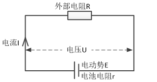

# 通过电流计测量电池电动势用于pwm压降补偿

* [返回上层目录](../ammeter.md)

整个飞控系统供电电路我们可以化简看成

# 计算电池的内部电阻和电动势

只需要知道电流计测量的电压和电流，就能算出电池的内阻和电动势。

电池的内部电阻等于，电流计测得的电池两端的电压变化$\Delta U$，除以，电流计测得的电流变化$\Delta I$，再乘以负号。

具体证明如下：

飞控的外接电阻基本上就是电调的电阻了，而电调随着动力输出的不同是在不断变化的，所以，外接电阻是不断变化的，我们可以利用外阻不断变化的特点来计算电池本身的内阻及其电动势。

当外接电阻为$R_1$时
$$
\begin{aligned}
I_1&=\frac{E}{R_1+r}\\
U_1&=I_1R_1=\frac{E}{R_1+r}R_1
\end{aligned}
$$
当外接电阻为$R_2$时
$$
\begin{aligned}
I_2&=\frac{E}{R_2+r}\\
U_2&=I_1R_1=\frac{E}{R_2+r}R_2
\end{aligned}
$$
那么
$$
\begin{aligned}
&\frac{\Delta U}{\Delta I}\\
=&\frac{U_2-U_1}{I_2-I_1}\\
=&\frac{\frac{E}{R_2+r}R_2-\frac{E}{R_1+r}R_1}{\frac{E}{R_2+r}-\frac{E}{R_1+r}}\\
=&\frac{\frac{1}{R_2+r}R_2-\frac{1}{R_1+r}R_1}{\frac{1}{R_2+r}-\frac{1}{R_1+r}}\\
=&\frac{(R_1+r)R_2-(R_2+r)R_1}{(R_1+r)-(R_2+r)}\\
=&\frac{rR_2-rR_1}{R_1-R_2}\\
=&\frac{r(R_2-R_1)}{R_1-R_2}\\
=&-r
\end{aligned}
$$
所以，电池的内阻$r$就等于
$$
r=-\frac{\Delta U}{\Delta I}
$$
注意，有**负号**，因为如果外部电路中的电阻$R$变小，则$\Delta I$为正，$\Delta U$为负，这两个变量变化趋势是相反的，所以要加负号。

现在我们知道了电池内阻，那就能知道整个电路的电动势$E$，由于电路电动势$E$等于电池两端电压加上电池内阻消耗的电压，所以，
$$
E=U+I\cdot r=U-I \cdot \frac{\Delta U}{\Delta I}
$$

# 参考资料

* APM开源飞控中的`update_resistance_estimate()`函数。

