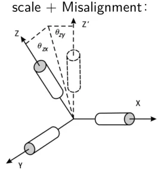

# 加速度计的六面校准法

* [返回上层目录](../accelerometer.md)
* [加速度计的误差类型](#加速度计的误差类型)
* [加速度计校准方法简介](#加速度计校准方法简介)
* [加速度校准模型](#加速度校准模型)
* [计算加速度校准参数](#计算加速度校准参数)
  * [计算加速度计零点偏移](#计算加速度计零点偏移)
  * [计算加速度计变换矩阵](#计算加速度计变换矩阵)

# 加速度计的误差类型

标定的本质是参数辨识，参数包括陀螺仪和加速度计各自的零偏、刻度系数误差、安装误差。

* 零偏

陀螺仪或加速度计输出中的长值偏移，就是经常说的bias。由于零偏存在不稳定性，所以零偏并不是固定不变的。所以解决方法一般是，只能一段时间内近似为常量

* 刻度系数误差

器件的输出往往为脉冲值或模数转换得到的值，需要乘以一个刻度系数才能转换成角速度或加速度值。比如0.01v的传感器电压，然后要乘以刻度系数10才是物理世界的测量参数，但是，本来应该是10，但是因为制造工艺的问题，导致10变成了10.1，那么就会因为多出来的0.1而产生误差。这就是刻度系数误差。刻度系数误差不一定是常值，它会随着输入大小的不同而发生变化，这个就是标度因数的非线性。 如果非线性程度比较大，则需要在标定之前先拟合该非线性曲线，并补偿成线性再去做标定。画图来说就是，本来不管传感器检测到的电压是0.01v，0.1v，1v，理想状态应该是下图中的绿色线一样，斜率应该是个常数，但是往往一般不是这样的。更常见的可能是类似于黑色的线，他的斜率是不一样的。同样的传感器电压对应不同的刻度系数（黑，绿），就会导致产生不一样的加速度和角速度的测量值。

* 安装误差

由于加工工艺原因，陀螺仪的三个轴并不正交，而且和IMU坐标系的轴不重合，二者之间的偏差即为安装误差。这个引起的问题举例来说就是，当理想状态下，IMU沿着Z轴旋转的时候，$x$和$y$的轴上不应该有测量值的。但是现实中，因为这个安装误差的原因，IMU以$z$轴进行旋转的时候，会在$x$和$y$轴上产生对应的分量，从而产生误差。实际系统中，由于硬件结构受温度影响，安装误差也会随温度发生变化。解决方案就是在不同温度下做标定，补偿温度变化量，这个步骤叫温度补偿。

# 加速度计校准方法简介

一般在加速度计安装到飞机上前进行校准，校准一次即可，然后把参数保存到飞控里，飞控每次上电后加载校正参数进行加速度计的初始化。

**加速度计校准主要有两种方法**

（1）一种是依赖于高精度的外部设备，比如转台等，进行的精确标定。主要校准安装误差，比例系数和零位偏移。方法为静态六位置法标定法。六位置法一般需要借助高精度转台进行试验测试，将姿态解算测试系统水平固定在转台测试台面上，安装过程中保证系统坐标系与转台测试面坐标系重合，对加速度传感器的各敏感轴进行竖直向上和向下测试，通过转动转台的内框-中框-外框对加速度计三个轴共测试六次。利用最小二乘法计算对六位置数据行进最小误差估计得到 12 个误差系数。具体方法可以参考一些导航方面的书籍论文。

（2）**第二种采用重力参考标定，飞控会自动运行代码或离线数据采集进行参数计算**。我们主要讲工程上最实用的，明显第二种比较**简单实用**，一般来讲，是不会用到转台这类设备进行精确标定的，原因就是设备太贵，买不起。所以一般采用重力参考标定方式。

**校准的意义**

如果不校准会怎样？简单来讲，会**影响姿态解算的精度**。

实际应用也可以不校准加速度计，毕竟，精度再差，也不差那么一些，当然，如果对飞控的精度要求比较高，还是校准最好。

但是注意，**加速度数据的标定并不能保证你的飞行是水平的**，如果有几度的安装误差，飞起来会怎样？很显然，飞机会以固定的角度，一直往一个地方飘。

# 加速度校准模型

静态放置情况下，无论加速度计计的位置在哪，所测的的加速度模值始终应该是当地重力加速度。即
$$
\sqrt{a_x^2+a_y^2+a_z^2}=g
$$
采用重力加速度作为参考。建立模型：
$$
acc_{corr}[3\times1]=T_{acc}[3\times3](acc_{raw}[3\times1]-acc_{offs}[3\times1])
$$
其中

- $acc_{corr}[3\times1]$是参考向量，也就是重力加速度向量

- $T_{acc}[3\times3]$是转换矩阵，包含旋转和尺度缩放

- $acc_{raw}[3\times1]$是实际测量的加速度向量

- $acc_{offs}[3\times1]$是加速度计的零点偏移

**需要估计的参数为零点偏移$acc_{offs}[3\times1]$和转换矩阵$$T_{acc}[3\times3]$$**。

上式可逐元素具体写为
$$
\begin{aligned}
\begin{bmatrix}
acc_{corrx}[x]\\
acc_{corrx}[y]\\
acc_{corrx}[z]\\
\end{bmatrix}
&=
\begin{bmatrix}
T_{11} & T_{12} & T_{13}\\
T_{21} & T_{22} & T_{23}\\
T_{31} & T_{32} & T_{33}\\
\end{bmatrix}
\begin{bmatrix}
(acc_{raw}[x]-acc_{offs}[x])\\
(acc_{raw}[y]-acc_{offs}[y])\\
(acc_{raw}[z]-acc_{offs}[z])\\
\end{bmatrix}\\
&=
\begin{bmatrix}
T_{11} & T_{12} & T_{13}\\
T_{21} & T_{22} & T_{23}\\
T_{31} & T_{32} & T_{33}\\
\end{bmatrix}
\begin{bmatrix}
a_x\\
a_y\\
a_z\\
\end{bmatrix}\\
\end{aligned}
$$
其中，$[a_x, a_y, a_z]^T$表示实际测量的加速度值向量减去加速度三轴的零点偏移。

# 计算加速度校准参数

飞控采用六面校准，即取6个面的数据，则可以得到6组参考向量
$$
acc_{corr}[3\times6]=
\begin{bmatrix}
g & -g & 0 & 0 & 0 & 0\\
0 & 0 & g & -g & 0 & 0\\
0 & 0 & 0 & 0 & g & -g\\
\end{bmatrix}
$$
依次是机体的$x$轴朝上（**注意，不是朝下！**），$x$轴朝下，$y$轴朝上，$y$轴朝下，$z$轴朝上，$z$轴朝下，分别采样一次数据。

则6组参考向量的计算可合并为
$$
acc_{corr}[3\times6]=T_{acc}[3\times3](acc_{raw}[3\times6]-acc_{offs}[3\times1])
$$
其中，在实际计算中，$acc_{offs}[3\times1]$会沿着列数增长方向复制6次，即每一列都是相同的，类似python中的nuumpy或者Tensorflow中的tensor的广播机制。

可具体写为
$$
\begin{aligned}
\begin{bmatrix}
g & -g & 0 & 0 & 0 & 0\\
0 & 0 & g & -g & 0 & 0\\
0 & 0 & 0 & 0 & g & -g\\
\end{bmatrix}=
\begin{bmatrix}
T_{11} & T_{12} & T_{13}\\
T_{21} & T_{22} & T_{23}\\
T_{31} & T_{32} & T_{33}\\
\end{bmatrix}
\begin{bmatrix}
a_{x1} & a_{x2} & a_{x3} & a_{x4} & a_{x5} & a_{x6}\\
a_{y1} & a_{y2} & a_{y3} & a_{y4} & a_{y5} & a_{y6}\\
a_{z1} & a_{z2} & a_{z3} & a_{z4} & a_{z5} & a_{z6}\\
\end{bmatrix}
\end{aligned}
$$

## 计算加速度计零点偏移

即需要计算$acc_{offs}[3\times1]$。求出每个轴的偏移方法是利用重力加速度在每个轴上的最大最小数据，求和后除以2得到。

忽略$T_{acc}$的影响（~~TODO: 影响有多小？~~），则有
$$
\begin{aligned}
acc_{corr}[3\times6]&=T_{acc}[3\times3](acc_{raw}[3\times6]-acc_{offs}[3\times1])\\
&=acc_{raw}[3\times6]-acc_{offs}[3\times1]
\end{aligned}
$$
具体化为
$$
\begin{aligned}
&\begin{bmatrix}
g & -g & 0 & 0 & 0 & 0\\
0 & 0 & g & -g & 0 & 0\\
0 & 0 & 0 & 0 & g & -g\\
\end{bmatrix}\\
=&
\begin{bmatrix}
a_{x1} & a_{x2} & a_{x3} & a_{x4} & a_{x5} & a_{x6}\\
a_{y1} & a_{y2} & a_{y3} & a_{y4} & a_{y5} & a_{y6}\\
a_{z1} & a_{z2} & a_{z3} & a_{z4} & a_{z5} & a_{z6}\\
\end{bmatrix}\\
=&
\begin{bmatrix}
acc\_row_{x1}-acc\_offs_{x} & acc\_row_{x2}-acc\_offs_{x} & ... & acc\_row_{x6}-acc\_offs_{x}\\
acc\_row_{y1}-acc\_offs_{y} & acc\_row_{y2}-acc\_offs_{y} & ... & acc\_row_{y6}-acc\_offs_{y}\\
acc\_row_{z1}-acc\_offs_{z} & acc\_row_{z2}-acc\_offs_{z} & ... & acc\_row_{z6}-acc\_offs_{z}\\
\end{bmatrix}
\end{aligned}
$$
对于$acc\_offs_{x}$：

直接将上式第一行相加，可得
$$
\begin{aligned}
&\sum_{i=1}^6acc\_row_{xi} - 6\cdot acc\_offs_x = g + (-g) + 0 + 0 + 0 + 0\\
\Rightarrow &acc\_offs_x = \frac{\sum_{i=1}^6acc\_row_{xi}}{6}
\end{aligned}
$$
但是**在PX4中，只选了该轴的最大值和最小值**（即第1和第2个），即
$$
\begin{aligned}
&\sum_{i=1}^2 acc\_row_{xi} - 2\cdot acc\_offs_x = g + (-g)\\
\Rightarrow &acc\_offs_x = \frac{acc\_row_{x1} + acc\_row_{x2}}{2}
\end{aligned}
$$
这就让人很奇怪，明明能使用6个数据的平均值来计算体轴$x$向的加速度计的零偏，为啥PX4却只使用了体轴$x$向垂直于水平面的两个值来进行平均呢？这不科学啊。。

经过仔细分析，发现，其实，在校正时，加速度计所放置的水平面，其实不一定就是真正水平的，比如你把加速度计放在办公桌上进行校正，并不能保证办公桌表面就是完全水平的，基本上是有个倾斜角的。

当校正加速度计时放置的平面存在倾斜角时，假设倾斜角度为$\theta$。

那么，理想中的
$$
\begin{bmatrix}
g & -g & 0 & 0 & 0 & 0\\
0 & 0 & g & -g & 0 & 0\\
0 & 0 & 0 & 0 & g & -g\\
\end{bmatrix}
$$
就不再成立，而是会变为
$$
\begin{bmatrix}
gcos\theta & -gcos\theta & gsin\theta sin\phi_3 & gsin\theta sin\phi_4 & gsin\theta sin\phi_5 & gsin\theta sin\phi_6\\
gsin\theta sin\phi_1 & gsin\theta sin\phi_2 & gcos\theta & -gcos\theta & gsin\theta cos\phi_5 & -gsin\theta cos\phi_6\\
gsin\theta cos\phi_1 & -gsin\theta cos\phi_2 & gsin\theta cos\phi_3 & -gsin\theta cos\phi_4 & gcos\theta & -gcos\theta\\
\end{bmatrix}\\
$$
其中，$\phi$代表了放置加速度计时，绕垂直于桌面的轴的旋转角度，每次放置的这个角度都是随机的。

这个时候，非垂直于表面的其他轴会存在重力的分量$gsin\theta$随旋转角度$\phi$不同在该轴上的分量。如果还是按照原来的方式计算非垂直表面方向的轴的零偏，**会导致把该分量当做该方向的轴的零偏**。

那么，为什么在垂直表面方向的轴就可以计算呢？因为该轴上无论怎么旋转$\phi$，其理论值始终为$gcos\theta$，虽然不是理想情况下的$g$，但是也依然会**始终正负抵消为0**，即$g+(-g)=gcos\theta+(-gcos\theta)=0$。

所以，**在校准时，任意轴上的零偏，应当只是用该轴垂直于加速度计所放置表面的数据，直观上就表现为只使用了该轴的最大最小值进行校正**。

对于$acc\_offs_{y}$同理：

直接将上式第一行相加，可得
$$
\begin{aligned}
&\sum_{i=1}^6acc\_row_{yi} - 6\cdot acc\_offs_y = 0 + 0 + g + (-g) + 0 + 0\\
\Rightarrow &acc\_offs_y = \frac{\sum_{i=1}^6acc\_row_{yi}}{6}
\end{aligned}
$$
如前面分析$acc\_offs_{x}$轴时所述，在非绝对水平的放置平台表面，这样不行。

所以，在PX4中，只选了该轴的最大值和最小值（即只选了第3和第4个），即
$$
acc\_offs_y = \frac{acc\_row_{y3} + acc\_row_{y4}}{2}
$$
对于$acc\_offs_{z}$同理：

直接将上式第一行相加，可得
$$
\begin{aligned}
&\sum_{i=1}^6acc\_row_{zi} - 6\cdot acc\_offs_z = 0 + 0 + 0 + 0 + g + (-g)\\
\Rightarrow &acc\_offs_z = \frac{\sum_{i=1}^6acc\_row_{zi}}{6}
\end{aligned}
$$
如前面分析$acc\_offs_{x}$轴时所述，在非绝对水平的放置平台表面，这样不行。

所以，在PX4中，只选了该轴的最大值和最小值（即第5和第6个），即
$$
acc\_offs_z = \frac{acc\_row_{z5} + acc\_row_{z6}}{2}
$$
## 计算加速度计变换矩阵

即需要计算$T_{acc}[3\times3]$。

这里为了方便看，复制一下上面的等式，即
$$
acc_{corr}[3\times6]=T_{acc}[3\times3](acc_{raw}[3\times6]-acc_{offs}[3\times1])
$$
扩充为
$$
\begin{aligned}
\begin{bmatrix}
g & -g & 0 & 0 & 0 & 0\\
0 & 0 & g & -g & 0 & 0\\
0 & 0 & 0 & 0 & g & -g\\
\end{bmatrix}=
\begin{bmatrix}
T_{11} & T_{12} & T_{13}\\
T_{21} & T_{22} & T_{23}\\
T_{31} & T_{32} & T_{33}\\
\end{bmatrix}
\begin{bmatrix}
a_{x1} & a_{x2} & a_{x3} & a_{x4} & a_{x5} & a_{x6}\\
a_{y1} & a_{y2} & a_{y3} & a_{y4} & a_{y5} & a_{y6}\\
a_{z1} & a_{z2} & a_{z3} & a_{z4} & a_{z5} & a_{z6}\\
\end{bmatrix}
\end{aligned}
$$
$T_{acc}[3\times3]$有9个未知量，需要9个等式，这里使用6个测量值中的3个，即选择
$$
\begin{aligned}
\begin{bmatrix}
g & 0 & 0\\
0 & g & 0\\
0 & 0 & g\\
\end{bmatrix}=
\begin{bmatrix}
T_{11} & T_{12} & T_{13}\\
T_{21} & T_{22} & T_{23}\\
T_{31} & T_{32} & T_{33}\\
\end{bmatrix}
\begin{bmatrix}
a_{x1} & a_{x3} & a_{x5}\\
a_{y1} & a_{y3} & a_{y5}\\
a_{z1} & a_{z3} & a_{z5}\\
\end{bmatrix}
\end{aligned}
$$
接下来，我们打算求解$T_{acc}[3\times3]$，把上式写成$Ax=b$的经典形式来求解$T_{acc}[3\times3]$。

对上式进行转置，根据$(MN)^T=N^TM^T$，可得
$$
\begin{aligned}

&\begin{bmatrix}
g & 0 & 0\\
0 & g & 0\\
0 & 0 & g\\
\end{bmatrix}^T
=
\left\{
\begin{bmatrix}
T_{11} & T_{12} & T_{13}\\
T_{21} & T_{22} & T_{23}\\
T_{31} & T_{32} & T_{33}\\
\end{bmatrix}
\begin{bmatrix}
a_{x1} & a_{x3} & a_{x5}\\
a_{y1} & a_{y3} & a_{y5}\\
a_{z1} & a_{z3} & a_{z5}\\
\end{bmatrix}
\right\}^T\\

\Rightarrow &\begin{bmatrix}
a_{x1} & a_{x3} & a_{x5}\\
a_{y1} & a_{y3} & a_{y5}\\
a_{z1} & a_{z3} & a_{z5}\\
\end{bmatrix}^T
\begin{bmatrix}
T_{11} & T_{12} & T_{13}\\
T_{21} & T_{22} & T_{23}\\
T_{31} & T_{32} & T_{33}\\
\end{bmatrix}^T
=
\begin{bmatrix}
g & 0 & 0\\
0 & g & 0\\
0 & 0 & g\\
\end{bmatrix}^T\\

\Rightarrow &\begin{bmatrix}
a_{x1} & a_{y1} & a_{z1}\\
a_{x3} & a_{y3} & a_{z3}\\
a_{x5} & a_{y5} & a_{z5}\\
\end{bmatrix}
\begin{bmatrix}
T_{11} & T_{21} & T_{31}\\
T_{12} & T_{22} & T_{32}\\
T_{13} & T_{23} & T_{33}\\
\end{bmatrix}
=
\begin{bmatrix}
g & 0 & 0\\
0 & g & 0\\
0 & 0 & g\\
\end{bmatrix}

\end{aligned}
$$
然后分成3组等式
$$
\begin{aligned}

\begin{bmatrix}
a_{x1} & a_{y1} & a_{z1}\\
a_{x3} & a_{y3} & a_{z3}\\
a_{x5} & a_{y5} & a_{z5}\\
\end{bmatrix}
\begin{bmatrix}
T_{11}\\
T_{12}\\
T_{13}\\
\end{bmatrix}
&=
\begin{bmatrix}
g\\
0\\
0\\
\end{bmatrix}
\\

\begin{bmatrix}
a_{x1} & a_{y1} & a_{z1}\\
a_{x3} & a_{y3} & a_{z3}\\
a_{x5} & a_{y5} & a_{z5}\\
\end{bmatrix}
\begin{bmatrix}
T_{21}\\
T_{22}\\
T_{23}\\
\end{bmatrix}
&=
\begin{bmatrix}
0\\
g\\
0\\
\end{bmatrix}
\\

\begin{bmatrix}
a_{x1} & a_{y1} & a_{z1}\\
a_{x3} & a_{y3} & a_{z3}\\
a_{x5} & a_{y5} & a_{z5}\\
\end{bmatrix}
\begin{bmatrix}
T_{31}\\
T_{32}\\
T_{33}\\
\end{bmatrix}
&=
\begin{bmatrix}
0\\
0\\
g\\
\end{bmatrix}

\end{aligned}
$$
其中，
$$
\begin{bmatrix}
a_{xi}\\
a_{yi}\\
a_{zi}\\
\end{bmatrix}
=
\begin{bmatrix}
acc\_row_{xi}-acc\_offs_{x}\\
acc\_row_{yi}-acc\_offs_{y}\\
acc\_row_{zi}-acc\_offs_{z}\\
\end{bmatrix}
$$
即一组加速度计三轴测量值减去加速度计零偏。

然后可根据上式分别求出三组位置变量，即
$$
\begin{bmatrix}
T_{11}\\
T_{12}\\
T_{13}\\
\end{bmatrix},
\begin{bmatrix}
T_{21}\\
T_{22}\\
T_{23}\\
\end{bmatrix},
\begin{bmatrix}
T_{31}\\
T_{32}\\
T_{33}\\
\end{bmatrix}
$$
具体求解方式：
$$
\begin{aligned}
&A\times x=b\\
\Rightarrow &A^{-1}A\times x = A^{-1}\times b\\
\Rightarrow &x = A^{-1}\times b
\end{aligned}
$$
那么接下来只需要求出矩阵
$$
A=
\begin{bmatrix}
a_{x1} & a_{y1} & a_{z1}\\
a_{x3} & a_{y3} & a_{z3}\\
a_{x5} & a_{y5} & a_{z5}\\
\end{bmatrix}
$$
的逆矩阵$A^{-1}$，就可以算出来$T_{acc}[3\times3]$的元素，即
$$
\begin{bmatrix}
T_{11}\\
T_{12}\\
T_{13}\\
\end{bmatrix},
\begin{bmatrix}
T_{21}\\
T_{22}\\
T_{23}\\
\end{bmatrix},
\begin{bmatrix}
T_{31}\\
T_{32}\\
T_{33}\\
\end{bmatrix}
$$

# 参考资料

[加速度校准分析（Pixhawk加速度校准算法简析）](https://zhuanlan.zhihu.com/p/24452753)

[PX4-AutoPilot accelerometer_calibration.cpp](https://github.com/PX4/PX4-Autopilot/blob/main/src/modules/commander/accelerometer_calibration.cpp)

[IMU的内参标定1](https://zhuanlan.zhihu.com/p/352539057)

===

[IMU的内参标定2](https://zhuanlan.zhihu.com/p/353369479)

这个标定方法更准确但更复杂。

[IMU传感器（五）- 校准](https://www.bilibili.com/read/cv18445807/)

讲了加速度计和陀螺仪的校准模型。讲到了十二面体加速度计校准，相比六面校准更准确。

