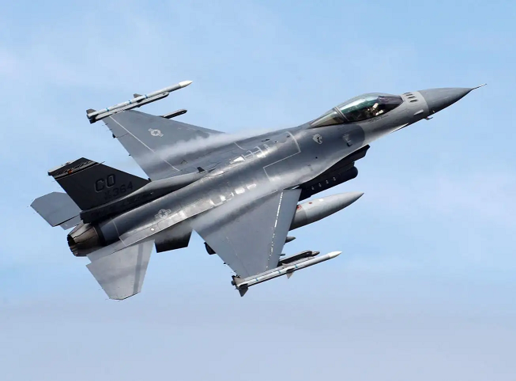
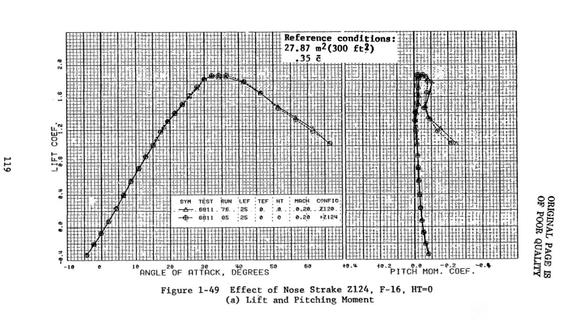
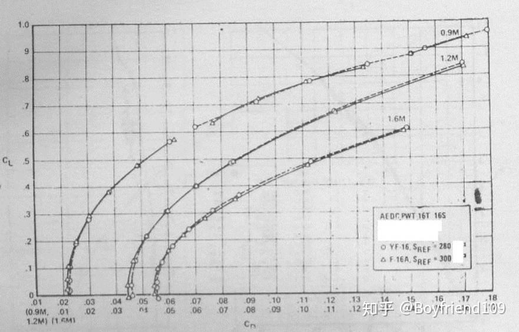
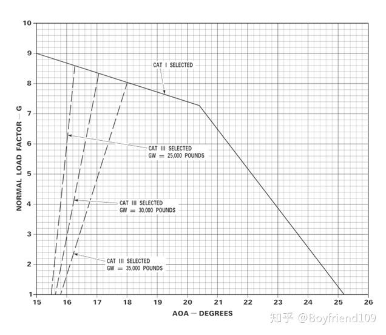
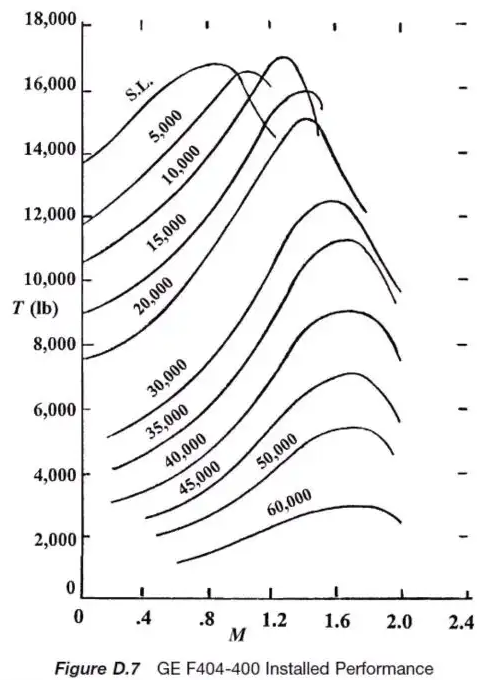

# 三自由度动力学与运动学模型

* [返回上层目录](../dynamic-model.md)
* [三自由度动力学与运动学公式](#三自由度动力学与运动学公式)
* [基于F-16的数据建模](#基于F-16的数据建模)
  * [F-16的气动特性](#F-16的气动特性)
    * [升力系数随迎角的变化](#升力系数随迎角的变化)
    * [阻力系数（零升阻力系数和升致阻力系数）](#阻力系数（零升阻力系数和升致阻力系数）)
  * [飞行性能](#飞行性能)
  * [发动机推力随高度的变化](#发动机推力随高度的变化)

# 三自由度动力学与运动学公式

$$
\dot{x}=f(x, u)
$$

其中，状态量$x=[pos_N, pos_E, h, v, \psi, \theta, \phi, \alpha]^T$，控制量为$\mu=[\zeta, \phi, \alpha]$。

即
$$
\left\{\begin{matrix}
\dot{pos_N}\\
\dot{pos_E}\\
\dot{h}\\
\dot{v}\\
\dot{\psi}\\
\dot{\theta}\\
\end{matrix}\right\}
=
\left\{\begin{matrix}
v\cdot \cos\theta\cdot \cos\psi\\
v\cdot \cos\theta\cdot \sin\psi\\
v\cdot \sin\theta\\
\frac{T\cdot \cos\alpha-D}{m}-g\cdot \sin\theta\\
\frac{(L+T\cdot \sin\alpha)\cdot \sin\phi}{m\cdot v\cdot \cos\theta}\\
\frac{(L+T\cdot \sin\alpha)\cdot \cos\phi}{m\cdot v}-\frac{g\cos\theta}{v}
\end{matrix}\right\}
$$
其中，$pos_N, pos_E, h$是无人机的北东高位置，$v, \psi, \theta, \phi, \alpha$分别是速度、偏航角、航迹角、滚转角和迎角。$D$是空气阻力，$T=\zeta T_{amx}$为发动机推力，$\zeta$为油门量，$T_{max}$为最大推力。

# 基于F-16的数据建模



F16有好多种，下面的数据基本是综合了一下的平均值，而不是某一款机型的准确值。

* 空重：约8500千克（具体数值因批次和配置而异）
* 总重：15吨
* 燃油：3200公斤
* 机翼面积：27.87平方米
* 零升阻力系数：0.02
* 最大俯仰角速率：25°/秒
* 实用升限：约18000米
* 最大平飞速度：正常最大马赫数达到1.6，但可冲刺到2马赫（约2,410公里/小时）
* 推重比：约1.095
* 最大滚转速度：270°/秒
* 发动机最大推力：75千牛。耗油率：不加力状态：0.694 kg/(daN*h)，daN=10N（千达牛顿等于10牛顿）
* 迎角限制：[-5度, 25度]
* 迎角变化率限制为？还没查到

## F-16的气动特性

### 升力系数随迎角的变化

下图是F-16的升力曲线图（图片来源：[聊聊F15的升力曲线图](https://tieba.baidu.com/p/7975190877)）：



可根据下面的代码，通过迎角就能算出来升力系数。

下面的代码为升力系数-迎角（度）的映射函数：

```c++
float cl_of_aoa(float aoa) {
    // aoa_deg  cl   cl_aoa
    // -10   -0.72
    // -5    -0.4
    //  20    1.35
    //  30    1.88
    //  37    1.88
    //  42    1.78
    //  67    1.0
    const int arr_size = 7;
    static float aoa_deg_arr[arr_size] = {-10.0f, -5.0f, 20.0f, 30.0f, 37.0f, 42.0f, 67.0f};
    static float cl_arr[arr_size] = {-0.72f, -0.4f, 1.35f, 1.88f, 1.88f, 1.78f, 1.0f};


    if (aoa < aoa_deg_arr[0]) {
        return cl_arr[0];
    } else if (aoa >= aoa_deg_arr[arr_size -1]) {
        return cl_arr[arr_size -1];
    }

    float cl = 0.0f;
    for (int i = 0; i < arr_size - 1; ++i) {
        if (aoa < aoa_deg_arr[i + 1]) {
            cl = map_between(aoa, aoa_deg_arr[i], aoa_deg_arr[i + 1], cl_arr[i], cl_arr[i + 1]);
            break;
        }
    }
    return cl;
}
```

### 阻力系数（零升阻力系数和升致阻力系数）

下图（来自[敏捷战隼-四十年后再谈 F-16](https://zhuanlan.zhihu.com/p/306718442)）是F-16的极曲线：



阻力分为零升阻力$C_{D0}$和升致阻力$C_{Di}$。

其中，零升阻力$C_{D0}$经过网上搜索，基本确认是0.02。

下面开始计算升致阻力$C_{Di}$：

在中等迎角时的诱导阻力系数$C_{Di}$与升力系数$C_L$的平方成正比，此正比系数称作“升致阻力因子”或“K”。即
$$
C_{Di}=KC_l^2
$$
我们从上图的最左边的曲线取一些数据点来拟合$K$。

| $C_L$ | $C_{Di}$ |
| ----- | -------- |
| 0     | 0.0215   |
| 0.2   | 0.025    |
| 0.296 | 0.03     |
| 0.4   | 0.04     |
| 0.49  | 0.05     |
| 0.55  | 0.06     |
| 0.618 | 0.07     |
| 0.655 | 0.08     |
| 0.7   | 0.09     |
| 0.742 | 0.1      |
| 0.774 | 0.11     |
| 0.8   | 0.12     |
| 0.83  | 0.13     |
| 0.855 | 0.14     |
| 0.875 | 0.15     |
| 0.905 | 0.16     |
| 0.935 | 0.17     |
| 0.96  | 0.18     |

 注意：上表中拟合数据时需要减去零升阻力系数0.0215

求出来$K=0.14$。所以
$$
C_D=C_{D0}+C_{Di}=C_{D0}+KC_L^2=0.02+0.14C_L^2
$$
所以，可通过上式，知道升力系数$C_L$就能算出来阻力系数。

总结一下：

（1）通过迎角就能算出来升力系数$C_L$。

（2）知道升力系数$C_L$就能算出来阻力系数$C_D$。

## 飞行性能

F-16则是美国三代机里攻角限制最严格的一架，其最大可用攻角仅为25度，这是因为F-16的飞控系统中集成了一个攻角限制器，限制飞机的使用迎角，如下图所示（来自[敏捷战隼-四十年后再谈 F-16](https://zhuanlan.zhihu.com/p/306718442)）：



随着过载增大，限制器允许的可用攻角会变小，在1G平飞的情况下，其攻角上限为25度，在大约7.3G的过载情况下，攻角上限下降为20.4度，在9G过载情况下仅为15度。

## 发动机推力随高度的变化

航空发动机的推力曲线图的话，要看懂其实是非常简单的，因为它的参数都是固定不变的那三项:高度，速度，推力。只要弄明白这三个就行了。接下来大家看看下图（来自[关于航空发动机的推力曲线图](http://www.360doc.com/content/19/1204/22/37844335_877482579.shtml)），这是美国F-404发动机的推力曲线图



横坐标代表速度，单位是马赫，纵坐标代表推力，单位是磅，然后那些一条一条的曲线，上面的数字是高度，单位是英尺。搞懂了这些，下面的就非常简单了。

我们为了化简，假设不同速度下的推力是一样的，只是发动机的推力会随高度变化，下面我们需要拟合发动机推力随高度变化的关系，以马赫数0.8为准。

| 高度（英尺） | 推力（磅） |
| ------------ | ---------- |
| 0            | 16860      |
| 5000         | 15600      |
| 10000        | 13900      |
| 15000        | 12000      |
| 20000        | 10750      |
| 30000        | 7500       |
| 35000        | 6000       |
| 40000        | 4700       |
| 45000        | 3500       |
| 50000        | 2700       |
| 60000        | 1500       |

用代码来表示推力因子-高度映射关系：

```c++
float thrust_alt_ratio(float alt) {
    // alt（英尺）   thrust（磅）   ratio
    // 0            16860
    // 5000         15600
    // 10000        13900
    // 15000        12000
    // 20000        10750
    // 30000        7500
    // 35000        6000
    // 40000        4700
    // 45000        3500
    // 50000        2700
    // 60000        1500
    const int arr_size = 11;
    static float alt_arr[arr_size] = {0.0f, 5000.0f, 10000.0f, 15000.0f, 20000.0f, 30000.0f, 35000.0f, 40000.0f, 45000.0f, 50000.0f, 60000.0f};
    static float thrust_arr[arr_size] = {16860.0f, 15600.0f, 13900.0f, 12000.0f, 10750.0f, 7500.0f, 6000.0f, 4700.0f, 3500.0f, 2700.0f, 1500.0f};

    alt = alt / 0.3048f;  // m -> ft

    float ratio = 1.0f;
    if (alt < alt_arr[0]) {
        return 1.0f;
    } else if (alt >= alt_arr[arr_size - 1]) {
        return thrust_arr[arr_size - 1] / thrust_arr[0];
    }

    for (int i = 0; i < arr_size - 1; ++i) {
        if (alt < alt_arr[i + 1]) {
            float thrust = map_between(alt, alt_arr[i], alt_arr[i + 1], thrust_arr[i], thrust_arr[i + 1]);
            ratio = thrust / thrust_arr[0];
            break;
        }
    }
    return ratio;
}
```

