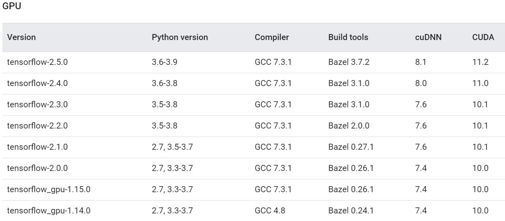
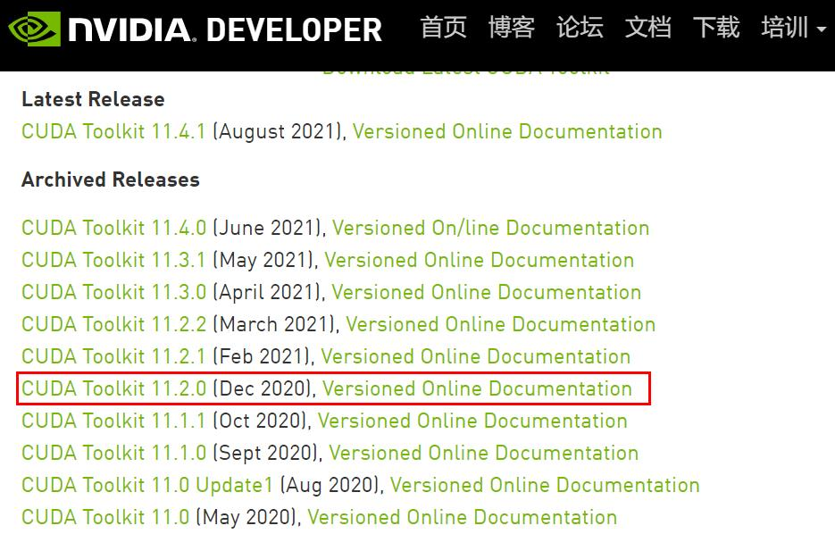
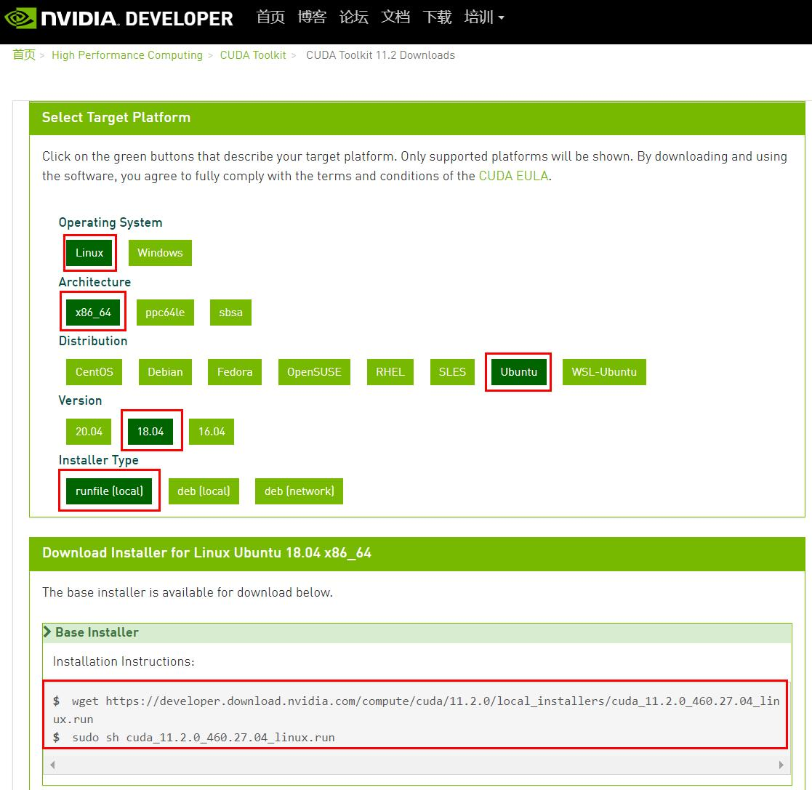
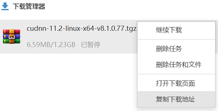
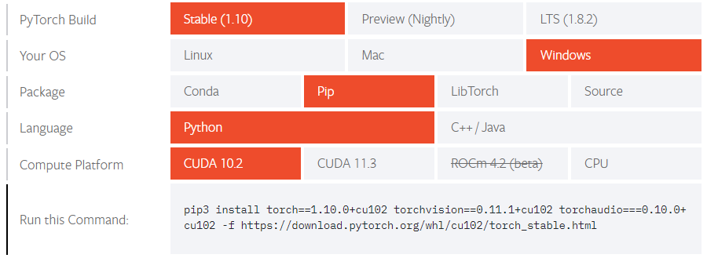
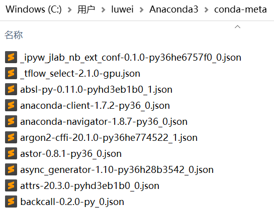
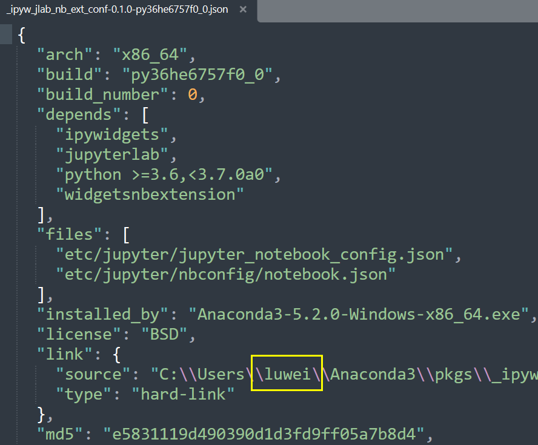
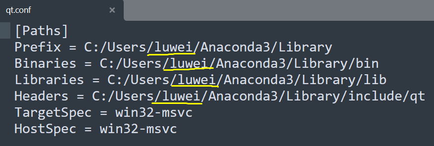

# anaconda

* [返回上层目录](../coding.md)
* [下载安装anaconda](#下载安装anaconda)
* [环境操作](#环境操作)
  * [新建环境](#新建环境)
  * [删除环境](#删除环境)
  * [环境重命名](#环境重命名)
* [安装tensorflow](#安装tensorflow)
  * [安装tensorflow2.5-gpu](#安装tensorflow2.5-gpu)
    * [安装tensorflow-gpu](#安装tensorflow-gpu)
    * [根据tf-gpu版本找对应cuda和cudnn版本](#根据tf-gpu版本找对应cuda和cudnn版本)
    * [安装cuda](#安装cuda)
    * [安装cudnn](#安装cudnn)
    * [查看安装的tensorflow能否使用gpu](#查看安装的tensorflow能否使用gpu)
  * [安装tensorflow2.1-gpu](#安装tensorflow2.1-gpu)
  * [测试是否支持GPU](#测试是否支持GPU)
* [其他操作](#其他操作)
  * [手动复制其他用户的anaconda](#手动复制其他用户的anaconda)
  * [删除anaconda里的pkgs文件下的包](#删除anaconda里的pkgs文件下的包)
  * [ubuntu中手动安装nvidia显卡驱动](#ubuntu中手动安装nvidia显卡驱动)


# 下载安装anaconda

下载最新版或指定版的anaconda：

[清华大学开源软件镜像站](https://mirrors.tuna.tsinghua.edu.cn/anaconda/archive/)

```shell
wget https://mirrors.tuna.tsinghua.edu.cn/anaconda/archive/Anaconda3-2021.05-Linux-x86_64.sh
```

下好之后，进行安装：

```shell
sh Anaconda3-2021.05-Linux-x86_64.sh
```

激活conda

```bash
source ~/.bashrc或者. ~/.bashrc # 初始化conda环境 出现(base)则说明安装成功
# 后续就可使用下面的命令进入base或退出base
conda activate # 进入conda环境 出现(base)
conda deactivate # 退出conda环境
```

新建虚拟环境：

```shell
conda create -n tf2 python=3.8
```

配置国内镜像源：

第一次运行 conda config命令时，将会在用户的home目录创建`.condarc`配置文件，是一种可选的（optional）运行期配置文件，其默认情况下是不存在的。 

（windows：C:\users\username\，linux：/home/username/）

```shell
conda config
# 第一条不行的话，就试试第二条
conda config --set show_channel_urls yes
```

添加清华镜像和中科大镜像，文件内容如下：

```shell
channels:
  - https://mirrors.tuna.tsinghua.edu.cn/anaconda/pkgs/main/
  - https://mirrors.tuna.tsinghua.edu.cn/anaconda/pkgs/free/
  - https://mirrors.ustc.edu.cn/anaconda/pkgs/free/
  - https://mirrors.tuna.tsinghua.edu.cn/anaconda/cloud/conda-forge/
  - https://mirrors.tuna.tsinghua.edu.cn/anaconda/cloud/msys2/
  - https://mirrors.tuna.tsinghua.edu.cn/anaconda/cloud/bioconda/
  - https://mirrors.tuna.tsinghua.edu.cn/anaconda/cloud/menpo/
  - https://mirrors.tuna.tsinghua.edu.cn/anaconda/cloud/pytorch/
  - defaults
show_channel_urls: true
```

或者

```shell
# 配置国内源，方便安装Numpy,Matplotlib等
conda config --add channels https://mirrors.tuna.tsinghua.edu.cn/anaconda/pkgs/free/
conda config --add channels https://mirrors.tuna.tsinghua.edu.cn/anaconda/pkgs/main/
# 配置国内源，安装PyTorch用
conda config --add channels https://mirrors.tuna.tsinghua.edu.cn/anaconda/cloud/pytorch/
# 显示源地址
conda config --set show_channel_urls yes
```

效果都一样。

关闭控制台窗口，重新打开才会重新加载配置。

如果有更好用的源，可以按照上面的格式继续增加。

查看conda信息

```shell
conda info
```

# 环境操作

## 新建环境

```shell
conda create -n tf2 python=3.8
```

注意：win7最高支持python3.8版本，3.9版本以上win7不支持。

## 删除环境

```shell
conda remove -n xxx --all
```

## 环境重命名

conda其实没有重命名指令，实现重命名是通过clone完成的，分两步：

- 先clone一份new name的环境
- 删除old name的环境

比如，想把环境rcnn重命名成tf

```shell
conda create -n tf --clone rcnn
conda remove -n rcnn --all
```


# 安装tensorflow

tensorflow在2.0之前的GPU版本和CPU版本是分开的，tensorflow在2.0后的版本不用区分GPU和CPU版本。

## 安装tensorflow2.5-gpu

本节默认安装的是Tensorflow2.5-GPU版本。其他版本安装方法也可以参考。

先下载安装anaconda。

### 安装tensorflow-gpu

 pip会自动给你安装最新的Tensorflow-gpu版本

```shell
pip install -i https://pypi.tuna.tsinghua.edu.cn/simple tensorflow-gpu
```

如果pip安装失败怎么办，手动下载安装文件：

打开[清华镜像源](https://pypi.tuna.tsinghua.edu.cn/simple/)，找到tensorflow-gpu

下载pip安装时命令行里出现的版本，我这里是

 ```
tensorflow_gpu-2.6.0-cp38-cp38-manylinux2010_x86_64.whl (458.4 MB)
 ```

下载后在该文件目录下cmd输入（注意换成自己对应的名字）：

```shell
pip install tensorflow_gpu-2.6.0-cp38-cp38-manylinux2010_x86_64.whl
```

其实到这里tensorflow部分安装完了，接下来安装显卡部分的。

### 根据tf-gpu版本找对应cuda和cudnn版本

Tensorflow2.5 GPU相关配置一览

| 本文安装项目          | 版本                         |
| --------------------- | ---------------------------- |
| python                | 3.6-3.9（博主是3.7.0）       |
| Tensorflow（CPU/GPU） | 2.5.0                        |
| Cuda（GPU版本所需）   | 11.2                         |
| Cudnn（GPU版本所需）  | v8.1.0（与Cuda版本匹配即可） |

如果要安装其他版本亦可类似从→[官网](https://tensorflow.google.cn/install/source?hl=en)这里找。Tensorflow、Cuda和Cudnn版本必须对应好。



### 安装cuda

直接先安装CUDA，而不是先独立安装GPU驱动，在安装CUDA的过程中，会安装好相应的GPU驱动，省时省力，比较方便。

[Cuda下载](https://developer.nvidia.com/cuda-toolkit-archive)



点击上图红框后然后按下图操作：



按上图操作下载：

```shell
wget https://developer.download.nvidia.com/compute/cuda/11.2.0/local_installers/cuda_11.2.0_460.27.04_linux.run
sudo sh cuda_11.2.0_460.27.04_linux.run
```

如果你已经预装了nvidia驱动，可能会遇到这个问题：

> Existing package manager installation of the driver found. It is strongly recommended that you remove this before continuing。

这时候选择只装cuda而不装驱动：

```shell
sudo sh cuda_11.2.0_460.27.04_linux.run --toolkit --silent --override
```

或者先删除现有的驱动然后再安装，具体见：

[Error installing Cuda toolkit: Existing package manager installation of the driver found](https://askubuntu.com/questions/1211919/error-installing-cuda-toolkit-existing-package-manager-installation-of-the-driv)

> Just run into this exact problem in Ubuntu18.04. And after some search, my solution is the following:
>
> 1. If you are sure that your driver version matches the cuda-toolkit version you are gonna install, refer to @domainxz answer, add `--toolkit` to only install toolkit and not to care about nvidia driver. Check [this](https://docs.nvidia.com/cuda/cuda-toolkit-release-notes/index.html) link for compatibility. (Scroll down to CUDA Driver table).
> 2. If you want CUDA to handle the compatibility problem for you, you need to uninstall your current drivers. Follow the instructions in [the official documentation](https://docs.nvidia.com/cuda/cuda-installation-guide-linux/index.html#runfile). After you entered the text screen after reboot, uninstall your previous Nvidia driver and run the cuda runfile. For Ubuntu 18.04, what I did and worked:
>
> ```
>     sudo apt-get remove --purge nvidia\*
>     sudo apt-get autoremove
>     sudo sh cuda-*.run --silient --override
> ```
>
> The official documentation is actually very detailed... Just make sure you follow each step and you should be fine.

也可以这样卸载：

1、查看系统中安装了哪些NVIDIA的驱动

```
sudo dpkg --list | grep nvidia-*
```

2、卸载NVIDIA驱动

可以直接在软件管理中卸载驱动（参考），同时也可以使用apt-get卸载NVIDIA驱动：

```shell
sudo apt-get --purge remove nvidia-*
# 也有的说用下面的命令进行卸载，我个人均有尝试，无碍
sudo apt-get --purge remove "*nvidia*"
```

**添加环境变量**

安装完之后，在`.bashrc配置文件`中`添加环境变量`

```shell
vim ~/.barshrc
export PATH=/usr/local/cuda-11.2/bin:$PATH 
export LD_LIBRARY_PATH=/usr/local/cuda-11.2/lib64:$LD_LIBRARY_PATH
```

使`.bashrc`生效：`source .bashrc `。

**测试cuda是否安装成功**

查看版本信息：一般当你安装好cuda之后，可以输入`nvcc -V`查看安装cuda的版本信息。

```shell
nvcc: NVIDIA (R) Cuda compiler driver
Copyright (c) 2005-2020 NVIDIA Corporation
Built on Mon_Nov_30_19:08:53_PST_2020
Cuda compilation tools, release 11.2, V11.2.67
Build cuda_11.2.r11.2/compiler.29373293_0
```

**卸载cuda**

如果安装cuda失败，或者是安装的版本不能够匹配，此时可能面临重新安装，同样也要卸载之前安装打cuda。

直接删除安装位置的cuda文件：

```python
sudo rm -rf /usr/local/cuda
sudo rm -rf /usr/local/cuda-11.2
```

### 安装cudnn

[Cudnn下载地址](https://developer.nvidia.com/rdp/cudnn-archive)

有很多版本，选了个兼容Cuda 11.2，因为前面高版本出错问题多的缘故，最终选择出现早的版本


需要注册后下载，如果想从linux上直接线上下载，那么就请不要下载到本地，在下载前的最后一步复制下载地址，因为只有一次机会，在linux下载。或者下载到window，上传到linux上也行。



```shell
wget https://developer.download.nvidia.cn/compute/machine-learning/cudnn/secure/8.1.0.77/11.2_20210127/cudnn-11.2-linux-x64-v8.1.0.77.tgz?fIolTbf7p-EYtg1E2vyPHzxFoAdBgzd-6WmHkgOnq2Wvgt9QRehQXvqzYkQsKdxHPjqAVLFpW_90p3IMSF6XXifm7v1AY0NrYiEanPyNv7mDEaiq8uCI_bCMnTytKngNF-pXj_jHpIBtNyiRM6gwirh74pRTlHWmpR-CTN2d_RN9U8SXB12ohvy0T5k8RG3jYCkHPlHCULmnQA8YM9A
```

然后再把上面的名字改为原名：

```shell
mv cudnn-11.2-linux-x64-v8.1.0.77.tgz\?fIolTb...lHCU cudnn-11.2-linux-x64-v8.1.0.77.tgz
```

解压文件，解压后目录为cuda：

```shell
tar -xvf cudnn-11.2-linux-x64-v8.1.0.77.tgz
```

查看cuda安装路径

```shell
which nvcc
# 显示
# /usr/local/cuda-11.2/bin/nvcc
```

进入解压cudnn目录，拷贝文件到cuda目录，并更改文件权限

```shell
cd cuda/
sudo cp include/cudnn* /usr/local/cuda-11.2/include
sudo cp lib64/libcudnn* /usr/local/cuda-11.2/lib64
sudo chmod a+r /usr/local/cuda-11.2/include/cudnn*
sudo chmod a+r /usr/local/cuda-11.2/lib64/libcudnn*
```

删除刚才解压的cudnn目录

```shell
cd ~
rm -rf cuda
```

Linux到此安装结束。

对于Win系统：

* 把`\cuda\bin\cudnn64_7.dll`复制到`C:\Program Files\NVIDIA GPU Computing Toolkit\CUDA\v9.0\bin`目录下。
* 把`\cuda\include\cudnn.h`复制到`C:\Program Files\NVIDIA GPU Computing Toolkit\CUDA\v9.0\include`目录下。
* 把`\cuda\lib\x64\cudnn.lib`复制到`C:\Program Files\NVIDIA GPU Computing Toolkit\CUDA\v9.0\lib\x64`目录下。

### 查看安装的tensorflow能否使用gpu

```shell
conda activate tf2
python
```

在python中输入

```python
import tensorflow as tf
print(tf.__version__)
print(tf.test.is_gpu_available())  # 返回true值代表GPU可用，返回false代表GPU不可用
print(tf.config.list_physical_devices('GPU'))
```

即可得知结果：

```
2.6.0
True
[PhysicalDevice(name='/physical_device:GPU:0', device_type='GPU')]
```

如果返回的结果里有这样的语句：

```
successful NUMA node read from SysFS had negative value (-1), but there must be at least one NUMA node, so returning NUMA node zero
```

则意味着你的内核没有NUMA支持。你可以在[这里](https://en.wikipedia.org/wiki/Non-uniform_memory_access)和[这里](https://pubs.vmware.com/vsphere-4-esx-vcenter/index.jsp?topic=/com.vmware.vsphere.resourcemanagement.doc_41/using_numa_systems_with_esx_esxi/c_what_is_numa.html)阅读关于NUMA的[信息](https://pubs.vmware.com/vsphere-4-esx-vcenter/index.jsp?topic=/com.vmware.vsphere.resourcemanagement.doc_41/using_numa_systems_with_esx_esxi/c_what_is_numa.html)。

关于NUMA，粗略地说，如果你有双核CPU，它们都有自己的内存，并且必须通过较慢的QPI链接访问另一个处理器的内存。所以每个CPU +内存都是NUMA节点。

潜在地，你可以将两个不同的NUMA节点视为两个不同的设备，并将你的网络结构化以优化不同的节点内/节点间带宽 

不过，我认为现在TF中没有足够的线路来执行此操作。检测也无法正常工作 - 我只是在装有2个NUMA节点的机器上尝试过，它仍然打印相同的消息并初始化为1个NUMA节点。

## 安装tensorflow2.1-gpu

具体参考：[Centos7 安装Tensorflow2.1 GPU以及Pytorch1.3 GPU（CUDA10.1）](https://blog.csdn.net/qq_37541097/article/details/103933366)

参照上述教程安装完之后，可能会出现一些问题，如：

**关于import tensorflow出现的FutureWarning问题及解决**

在安装完tensorflow-gpu之后，等不及进去python里试验一下是否装成功，结果第一个import tensorflow as tf便出现了如下问题：

```
FutureWarning: Passing (type, 1) or ‘1type’ as a synonym of type is deprecated; in a future version of numpy, it will be understood as (type, (1,)) / ‘(1,)type’.
_np_quint8 = np.dtype([(“quint8”, np.uint8, 1)])
```

**解决办法：**

对h5py进行升级：`pip install h5py==2.8.0rc1`，对numpy包进行降级：`pip install numpy==1.6.0`。

**cuda 10.1下使用tensorflow-gpu 1.4报错解决办法**

报错信息:

```；
ImportError: libcublas.so.10.0: cannot open shared object file: No such file or directory
```

解决办法：[cuda 10.1下使用tensorflow-gpu 1.4报错解决办法](https://blog.csdn.net/weixin_42398077/article/details/101158496)


## 测试是否支持GPU

```python
import tensorflow as tf
print(tf.__version__)
print(tf.test.is_gpu_available())  # 返回true值代表GPU可用，返回false代表GPU不可用
print(tf.config.list_physical_devices('GPU'))
```

# 安装pytorch

检查显卡，安装CUDA和cuDNN，然后安装GPU版的pytorch。

使用`nvidia-smi`命令得到你的CUDA版本。

先到[pytorch官网](https://pytorch.org/get-started/locally/)找到在你的操作系统、包、CUDA版本、语言版本下对应的安装脚本，官网地址为`https://pytorch.org/get-started/locally/`，直接根据你的实际情况选择pytorch安装包版本，然后复制页面自动生成的脚本进行安装。



说明：

* 电脑实际安装的CUDA版本不能比所选的CUDA版本更高。比如实际安装的是11.2版本，就不能选择11.3版本，必须等于或低于11.2版本，所以这里就选择10.2版本。CUDA可以兼容低版本。
* pip安装的时候，需要使用`conda activate xxx`先切换到对应环境，再使用pip，不然就安装到其他环境去了。

检查是否安装成功

等待下载完成，输入python进入环境，然后依次输入

```python
import torch
print(torch.__version__)
torch.cuda.is_available()
```

如果都ok的话，就安装成功啦！

# 其他操作

## 安装指定源和版本

```shell
conda install --channel https://conda.anaconda.org/anaconda tensorflow=2.1
```

## anaconda各种源

对于win系统，在`C:\Users\User\.condarc`中写入；对于linux系统，在xxx中写入。

清华源：

```shell
show_channel_urls: true
channels:
  - http://mirrors.tuna.tsinghua.edu.cn/anaconda/pkgs/main/win-64
  - http://mirrors.tuna.tsinghua.edu.cn/anaconda/pkgs/free/win-64
  - http://mirrors.tuna.tsinghua.edu.cn/anaconda/cloud/conda-forge/win-64
  - http://mirrors.tuna.tsinghua.edu.cn/anaconda/cloud/msys2/win-64
```

另外一种清华源：

```shell
channel_alias: https://mirrors.tuna.tsinghua.edu.cn/anaconda
default_channels:
  - https://mirrors.tuna.tsinghua.edu.cn/anaconda/pkgs/main
  - https://mirrors.tuna.tsinghua.edu.cn/anaconda/pkgs/free
  - https://mirrors.tuna.tsinghua.edu.cn/anaconda/pkgs/r
  - https://mirrors.tuna.tsinghua.edu.cn/anaconda/pkgs/pro
  - https://mirrors.tuna.tsinghua.edu.cn/anaconda/pkgs/msys2
custom_channels:
  conda-forge: https://mirrors.tuna.tsinghua.edu.cn/anaconda/cloud
  msys2: https://mirrors.tuna.tsinghua.edu.cn/anaconda/cloud
  bioconda: https://mirrors.tuna.tsinghua.edu.cn/anaconda/cloud
  menpo: https://mirrors.tuna.tsinghua.edu.cn/anaconda/cloud
  pytorch: https://mirrors.tuna.tsinghua.edu.cn/anaconda/cloud
  simpleitk: https://mirrors.tuna.tsinghua.edu.cn/anaconda/cloud
ssl_verify: true
```


## ananconda不同机器离线移植

本节基于windows系统，场景是将A机器上的Anaconda移植到B机器上，因为A机器上的Anaconda安装了很多包，要一个一个包在B机器上安装简直是不太可能的。

### Anaconda打包压缩与文件替换

（1）将`C:\Users\xxx`下的`Anaconda`文件夹打包压缩，并复制解压到B电脑的`C:\Users\yourname`路径下。

（2）将`C:\Users\xxx\Anaconda`文件夹和`C:\Users\xxx\Anaconda\envs\tf1.4`文件夹中的`conda-meta`文件夹和`qt.conf`文件复制到linux系统里，其内容分别如下：

`conda-meta`文件夹：



`conda-meta`文件夹中的json文件：



`qt.conf`文件：



可以看出，上述文件里均含有A电脑上的用户名，要想复制到B电脑上还能用，就需要把里面的A电脑用户名替换为B电脑上的用户名，方法如下所示：

在Linux系统中，在装有两个`conda-meta`文件夹和`qt.conf`文件的根目录下，打开终端，输入：

```shell
find ./ -name "*.json" | xargs sed -i "s/luwei/yourname/g"
find ./ -name "*.conf" | xargs sed -i "s/luwei/yourname/g"
```

如果提示出错，可试试下面的命令：

```shell
find ./ -name "*.json" | xargs sed -i "" "s/luwei/yourname/g"
find ./ -name "*.conf" | xargs sed -i "" "s/luwei/yourname/g"
```

然后用这两份`conda-meta`文件夹和`qt.conf`文件来替换B电脑中的对应文件夹和文件。

### 添加环境变量

在B电脑的环境变量的系统变量的`Path`中，添加：

```shell
C:\Users\yourname\Anaconda3
C:\Users\yourname\Anaconda3\Scripts
C:\Users\yourname\Anaconda3\Library\bin
```

## 手动复制其他用户的anaconda

注意，这种方法对于pip install安装的可能不能复制。

**（1）复制并修改其他**

切换到root用户，将其他用户的anaconda复制过来：

```shell
cp ../other_user/anaconda ./
```

然后赋予当前用户权限：

```shell
chown -R user ./anaconda
```

然后切换回当前用户，将其他用户的`.bashrc`复制到当前用户中覆盖。如果你并不是一个刚新建的用户，不想改变`.bashrc`中的其他变量，那么就只复制下面的内容，然后注意把其他用户的名字改成你自己的名字：

```shell
# >>> conda initialize >>>
# !! Contents within this block are managed by 'conda init' !!
__conda_setup="$('/home/other_user/anaconda3/bin/conda' 'shell.bash' 'hook' 2> /dev/null)"
if [ $? -eq 0 ]; then
    eval "$__conda_setup"
else
    if [ -f "/home/other_user/anaconda3/etc/profile.d/conda.sh" ]; then
        . "/home/other_user/anaconda3/etc/profile.d/conda.sh"
    else
        export PATH="/home/other_user/anaconda3/bin:$PATH"
    fi
fi
unset __conda_setup
# <<< conda initialize <<<
```

让修改后的环境变量生效

```shell
source ~/.bashrc
```

然后退出当前shell窗口重新打开。`which conda`就会显示你的地址了。

**（2）修改base环境中的可执行文件**

```shell
cd ~/anaconda3/bin
sed -i 's/other_user/user/g' *
```

这个操作，会把bin文件夹下所有文件中第一行含有用户名的文件进行修改，改为当前用户名，

```shell
#!/home/other_user/anaconda3/bin/python
->
#!/home/user/anaconda3/bin/python
```

比如下面这些文件中都含有上述第一行内容。

```shell
/home/anaconda3/bin/conda
/home/anaconda3/bin/pip
/home/anaconda3/bin/conda-env
```

**（3）修改所有虚拟环境中的可执行文件**

比如修改虚拟环境下的可执行文件pip之后，进入虚拟环境后pip和python才可用。

分别进入到每个虚拟环境的bin文件中，将bin文件夹下所有文件中第一行含有用户名的文件进行修改，改为当前用户名，

```shell
cd ~/anaconda3/envs/gpu3070_enabled/bin
sed -i 's/other_user/user/g' *
```

即会修改为

```shell
#!/home/other_user/anaconda3/bin/python
->
#!/home/user/anaconda3/bin/python
```

比如下面这些文件中都含有上述第一行内容。

```shell
/home/anaconda3/envs/gpu3070_enabled/bin/pip
```

## 删除anaconda里的pkgs文件下的包

anaconda文件夹下有个pkgs文件夹。据我观测（没找到正式说明），里面是各种包的各个使用过的版本及压缩包。比如用conda update pandas，那在Lib\site-packages里会更新到新版本。但pkgs里既有新版本，也有旧版本。我推测是conda先把包下载到pkgs里，解压，然后更新site-packages里正式用到的包。所以这个pkgs里的东西能不能删？删了不就可以省很多空间了么？

> 可以通过命令行删除，
>
> Google讨论组里推荐用`conda clean -p`删除未使用的的包；实际`conda clean -a`更强力些。

在Anaconda python中手动删除pkgs文件夹中的所有文件是否安全?

> 实际上，在某些情况下，可以选择除去 pkgs 子目录.如Anaconda社区支持在[此处](https://groups.google.com/a/continuum.io/g/anaconda/c/xV1BiGPmgao?pli=1)所述." pkgs 目录只是一个缓存.您可以将其完全删除.但是，在创建新环境时，将高速缓存中的所有程序包都留在周围效率更高."
>
> 根据[文档](https://docs.conda.io/projects/conda/en/latest/commands/clean.html)，您可以使用 conda clean --packages 删除 pkgs 中未使用的软件包(这会将它们移动到 pkgs/.trash 中，然后可以从中安全删除它们).虽然这不会检查使用返回到程序包缓存的符号链接安装的程序包，但是如果您不使用此类环境或在Windows下工作，则不是主题.我想这就是 conda clean --all 中包含 conda clean --packages 的原因.
>
> 要更积极地节省空间，可以使用 conda clean --force-pkgs-dirs 删除*所有*可写程序包缓存(但要注意的是可能存在环境)与这些目录相关联).如果您不使用环境或在Windows下使用Anaconda，则可能很安全.就我个人而言，我使用此选项没有问题.


## ubuntu中手动安装nvidia显卡驱动

### 在官网下载Nvidia驱动

根据自己的型号下载：放在`/Downloads`下，以GPU型号RTX3090为例

nvidia驱动官网下载地址：[Download *Drivers* | *NVIDIA*](https://www.nvidia.com/Download/index.aspx?lang=en-us)


### 删除旧NVIDIA驱动

安装之前先卸载已经存在的驱动版本：

```shell
sudo apt-get --purge remove nvidia*
sudo apt-get --purge remove "*nvidia*"
sudo apt-get --purge remove xserver-xorg-video-nouveau
```

### 屏蔽开源驱动nouveau

需要禁用nouveau，只有在禁用掉nouveau后才能顺利安装NVIDIA显卡驱动，禁用方法就是在 `/etc/modprobe.d/blacklist-nouveau.conf`文件中添加一条禁用命令，将Ubuntu自带的显卡驱动加入黑名单。

```shell
sudo vim /etc/modprobe.d/blacklist.conf
```

在文末添加以下内容保存：

```shell
blacklist nouveau
options nouveau modeset=0
```

注意此时还需执行以下命令使禁用nouveau真正生效：

```shell
sudo update-initramfs -u
```

重启系统（一定要重启）`reboot`

验证nouveau是否已禁用 `lsmod | grep nouveau`

没有信息显示，说明nouveau已被禁用，接下来可以安装nvidia的显卡驱动。

### 重启电脑，按Ctrl+Alt+F1进入命令行界面

重启之后,这里要尤其注意，安装显卡驱动要先切换到文字界面，(按Ctrl+Alt+F1~F6).所以，启动电脑后，先进入文字界面。 

先输入用户名密码登录（数字不能用小键盘输入），然后

```shell
sudo service lightdm stop
```

如果提示`unit lightdm.service not loaded`，

则先安装LightDm：`sudo apt install lightdm`，安装完毕后跳出一个界面，选择lightdm，

再`sudo service lightdm stop`。

### 执行安装驱动

依然是在命令行界面：

```shell
cd Downloads
sudo chmod a+x NVIDIA-Linux-x86_64-470.63.01.run
sudo ./NVIDIA-Linux-x86_64-396.18.run -no-x-check -no-nouveau-check -no-opengl-files
```

> -no-x-check：安装驱动时关闭X服务
> -no-nouveau-check：安装驱动时禁用nouveau
> -no-opengl-files：只安装驱动文件，不安装OpenGL文件，只有禁用opengl这样安装才不会出现循环登陆的问题

后面就一路Accept就可以~

安装过程中的选项

* The distribution-provided pre-install script failed! Are you sure you want to continue? 

  选择yes继续。

* Would you like to register the kernel module souces with DKMS? This will allow DKMS to automatically build a new module, if you install a different kernel later? 

  选择no继续。

* 问题没记住，选项是：install without signing

* 问题大概是：Nvidia’s 32-bit compatibility libraries?

  选择no继续。

* Would you like to run the nvidia-xconfigutility to automatically update your x configuration so that the NVIDIA x driver will be used when you restart x? Any pre-existing x confile will be backed up. 

  选择yes继续，最重要的一步，安装程序问你是否使用nv的xconfig文件，这里一定要选yes，否则在启动x-window时不会使用nv驱动。

这些选项如果选择错误可能会导致安装失败，没关系，只要前面不出错，多尝试几次就好。

### 重启X-window服务

依然是在命令行界面：

```shell
sudo service lightdm start
```

### 重启电脑进入BIOS关闭secure-boot

进入BIOS把 `secure boot` 选项关掉。

关掉secure boot的原因：如果 secure boot 是开启状态，内核不能安装自己定制的模块；

解决方法：我们进入BIOS 把 secure boot 选项关掉；secure boot 大概的作用时为了保护内核的启动安全。

linux secure boot状态查询：`mokutil --sb-state`

看的文章里有这么一个步骤，但是我并没用到，但是依然写在这里，目前用不到，但已备不时之需：

> #### 挂载Nvidia驱动： `modprobe nvidia`
>
> ERROR: could not insert ‘nvidia’: Operation not permitted
> secure boot 的原因；如果 secure boot 是开启状态，内核不能安装自己定制的模块；
> 解决方法：我们进入BIOS 把 secure boot 选项关掉；secure boot 大概的作用时为了保护内核的启动安全；
> linux secure boot 状态查询：mokutil --sb-state
> 再次挂载 nvidia

### 查看是否挂载成功 `nvidia-smi`

如果开机黑屏，则按Ctrl+Alt+F1进入命令行界面，或者按两次Esc进入。

然后输入`nvidia-smi`。


则显卡挂载成功。

### 显卡挂载成功但黑屏无法进入图形化界面

首先确保NVIDIA显卡驱动安装成功：使用命令 sudo nvidia-smi

重装desktop来解决，按Ctrl+Alt+F1进入命令行方式，输入账户密码登入，输入命令

```shell
sudo apt uninstall ubuntu-desktop
sudo apt install ubuntu-desktop
```

删除再重新安装。

Ubuntu安装NVIDIA显卡驱动后可以进入命令行界面TYY1 ，但是无法进入图形界面。开机显示`/dev/nvme0n1p8:clean`

综合查找，最后认定是驱动安装不匹配的原因，最后的解决方法很简单，方法如下：

```shell
sudo rm /etc/X11/xorg.conf
sudo reboot
```

然后`reboot`重启，恭喜成功~

# 参考资料

* [Tensorflow2.5安装（安装问题，这一篇全解决）](https://blog.csdn.net/QAQIknow/article/details/118858870)

“安装anaconda+tensorflow-gpu”参考了该博客。

* [Ubuntu18.04安装NVIDIA显卡驱动](https://blog.csdn.net/chentianting/article/details/85089403)

* [ubuntu20.04安装NVIDIA显卡驱动 /dev/nvme0n1p8:clean](https://blog.csdn.net/simplyou/article/details/119838829)

"ubuntu中手动安装nvidia显卡驱动"参考此博客

===

* [将nvidia-docker容器导出给其他人使用](https://zhuanlan.zhihu.com/p/112703446)

装docker里的tensorflow可供参考。


