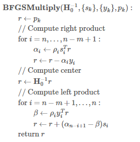

# MLlib机器学习库

* [返回上层目录](../spark.md)
* [LR逻辑回归](lr.md)
* [机器学习库（MLlib）指南](#机器学习库（MLlib）指南)
* [MLlib和ML库的区别](#MLlib和ML库的区别)

# 机器学习库（MLlib）指南

MLlib是Spark的机器学习（ML）库。其目标是使实际的机器学习可扩展和容易。在高层次上，它提供了如下工具：

- ML算法：通用学习算法，如分类，回归，聚类和协同过滤
- 特征提取，特征提取，转换，降维和选择
- 管道：用于构建，评估和调整ML管道的工具
- 持久性：保存和加载算法，模型和管道
- 实用程序：线性代数，统计，数据处理等

**依赖：**

MLlib使用线性代数包Breeze，它依赖于 netlib-java进行优化的数值处理。如果本机库在运行时不可用，您将看到一条警告消息，而将使用纯JVM实现。

# MLlib基本数据类型

[Spark入门：MLlib基本数据类型(1)](https://dblab.xmu.edu.cn/blog/1172/)

# MLlib和ML库的区别

**公告：基于DataFrame的API是主要的API**

**MLlib基于RDD的API现在处于维护模式。**

从Spark 2.0开始，包中的基于RDD的API `spark.mllib`已进入维护模式。Spark的主要机器学习API现在是包中的基于DataFrame的API `spark.ml`。

**有什么影响？**

- MLlib将仍然支持基于RDD的API `spark.mllib`并修复错误。
- MLlib不会将新功能添加到基于RDD的API。
- 在Spark 2.x版本中，MLlib将向基于DataFrame的API添加功能，以便与基于RDD的API达成功能对等。
- 达到功能对等（大致估计为Spark 2.2）后，基于RDD的API将被弃用。
- 基于RDD的API预计将在Spark 3.0中被删除。

**为什么MLlib切换到基于DataFrame的API？**

- DataFrames提供比RDD更友好的API。DataFrame的许多优点包括Spark数据源，SQL / DataFrame查询，Tungsten和Catalyst优化以及跨语言的统一API。
- MLlib的基于DataFrame的API提供跨ML算法和跨多种语言的统一API。
- 数据框便于实际的ML管线，特别是功能转换。

**什么是“Spark ML”？**

- “Spark ML”不是一个正式的名字，偶尔用于指代基于MLlib DataFrame的API。这主要是由于`org.apache.spark.ml`基于DataFrame的API所使用的Scala包名以及我们最初用来强调管道概念的“Spark ML Pipelines”术语。

**MLlib是否被弃用？**

- 编号MLlib包括基于RDD的API和基于DataFrame的API。基于RDD的API现在处于维护模式。

[请别再问我Spark的MLlib和ML库的区别](https://mp.weixin.qq.com/s?__biz=MzA3MDY0NTMxOQ==&mid=2247484273&idx=1&sn=830eee29f7078dd85d6b3156a2880acd&chksm=9f38e059a84f694f99480c6e831d788187d1943704ca69f881721bf40dbf9745c8701902c4db&scene=21#wechat_redirect)

# 基于RDD的MLlib的缺陷

Spark的核心概念是RDD，而RDD的关键特性之一是其不可变性，来规避分布式环境下复杂的各种并行问题。这个抽象，在数据分析的领域是没有问题的，它能最大化的解决分布式问题，简化各种算子的复杂度，并提供高性能的分布式数据处理运算能力。

然而在机器学习领域，RDD的弱点很快也暴露了。机器学习的核心是迭代和参数更新。RDD凭借着逻辑上不落地的内存计算特性，可以很好的解决迭代的问题，然而RDD的不可变性，却非常不适合参数反复多次更新的需求。这本质上的不匹配性，导致了Spark的MLlib库，发展一直非常缓慢，从2015年开始就没有实质性的创新，性能也不好。

为此，Angel在设计生态圈的时候，优先考虑了Spark。在V1.0.0推出的时候，就已经具备了Spark on Angel的功能，基于Angel为Spark加上了PS功能，在不变中加入了变化的因素，可谓如虎添翼。

我们将以L-BFGS为例，来分析Spark在机器学习算法的实现上的问题，以及Spark on Angel是如何解决Spark在机器学习任务中的遇到的瓶颈，让Spark的机器学习更加强大。

## L-BFGS算法说明

$$
w_{k+1}=w_k-\lambda\cdot p_k
$$

计算$p_k=H_k^{-1}g_k$伪代码如下所示，这是人们常说的two-loop recursion算法，是Limited-BFGS算法的核心部分。
返回值$r$是我们说要的$p_k$。

其中，$H_0^{-1}$是单位阵，$y_k=g_k-g_k^{-1}, s_k=w_k-w_k^{-1}k^{-1}$，L-BFGS算法将最近$m$轮生成的$y_k$和$s_k$序列，记做$\{y_k\}$和$\{s_k\}$。基于计算$\{y_k\}$和$\{s_k\}$计算$p_k$。（**注：这一行不对，需要修改**）

## L-BFGS的Spark实现

### 实现框架

Spark中的driver负责协调整个Spark任务执行的同时，需要保存最近$m$轮的$\{y_k\}$和$\{s_k\}$序列，并在driver上执行two-loop recursion算法。而executor负责分布式地计算梯度向量。

迭代过程：
（1）每轮迭代，将每个executor计算的梯度Aggregate到driver
（2）$y_k$和$s_k$保存在driver上，在driver端执行two-loop recursion算法
（3）driver上更新模型$w$，并将$w$广播到每个Executor

### 性能分析

基于Spark的L-BFGS实现的算法优点比较明显：

- HDFS I/O
  Spark可以快速读写HDFS上的训练数据；
- 细粒度的负载均衡
  并行计算梯度时，Spark具有强大的并行调度机制，保证task快速执行；
- 容错机制
  当计算节点挂掉、任务失败，Spark会根据RDD的DAG关系链实现数据的重计算。但是对于迭代式算法，每轮迭代要用RDD的action操作，打断RDD的DAG，避免因为重计算引起逻辑的错乱；
- 基于内存的计算
  基于内存的计算过程，可以加速机器学习算法中计算梯度过程的耗时。

该实现的缺点：

- **treeAggregate引起的网络瓶颈**
  **Spark用treeAggregate聚合梯度时，如果模型维度达到亿级，每个梯度向量都可能达到几百兆；此时treeAggregate的shuffle的效率非常低**；
- driver单点
  - 保存$\{y_k\}$和$\{s_k\}$序列需要较大的内存空间；
  - two-loop recursion算法是由driver单点执行，该过程是多个高维度的向量的运算；
  - **每轮迭代，driver都需要和executor完成高维度向量的aggregate和broadcast**。

## L-BFGS的Spark on Angel实现

Spark on Angel借助Angel PS-Service的功能为Spark引入PS的角色，减轻整个算法流程对driver的依赖。two-loop recursion算法的运算交给PS，而driver只负责任务的调度，大大减轻的对driver性能的依赖。

Angel PS由一组分布式节点组成，每个vector、matrix被切分成多个partition保存到不同的节点上，同时支持vector和matrix之间的运算；

$\{y_k\}$和$\{s_k\}$序列分布式地保存到Angel PS上，two-loop recursion算法中高维度的向量计算也是在PS上完成。Spark executor每轮迭代过程会从PS上`Pull` w 到本地，并将计算的梯度向量`Push`到PS。

迭代过程：

（1）每轮迭代，executor 将PS上的模型$w$ pull到本地，计算梯度，然后梯度向量push给PS

（2）$y_k$和$s_k$保存在PS上，在PS端执行two-loop recursion算法

（3）PS上更新模型$w$

### 性能分析

整个算法过程，driver只负责任务调度，而复杂的two-loop recursion运算在PS上运行，**梯度的Aggregate和模型的同步是executor和PS之间进行，所有运算都变成分布式**。在网络传输中，高维度的PSVector会被切成小的数据块再发送到目标节点，**这种节点之间多对多的传输大大提高了梯度聚合和模型同步的速度**。

这样Spark on Angel完全避开了Spark中driver单点的瓶颈，以及网络传输高维度向量的问题。

Spark on Angel的出现可以高效、低成本地克服Spark在机器学习领域遇到的瓶颈；我们将继续优化Spark on Angel，并提高其性能。也欢迎大家在Github上一起参与我们的改进。

Angel项目Github：[Angel](https://github.com/Tencent/angel)，喜欢的话到Github上给我们Star。

# 参考资料

* [请别再问我Spark的MLlib和ML库的区别](https://mp.weixin.qq.com/s?__biz=MzA3MDY0NTMxOQ==&mid=2247484273&idx=1&sn=830eee29f7078dd85d6b3156a2880acd&chksm=9f38e059a84f694f99480c6e831d788187d1943704ca69f881721bf40dbf9745c8701902c4db&scene=21#wechat_redirect)

“机器学习库（MLlib）指南”参考了此资料

* [请别再问我Spark的MLlib和ML库的区别](https://mp.weixin.qq.com/s?__biz=MzA3MDY0NTMxOQ==&mid=2247484273&idx=1&sn=830eee29f7078dd85d6b3156a2880acd&chksm=9f38e059a84f694f99480c6e831d788187d1943704ca69f881721bf40dbf9745c8701902c4db&scene=21#wechat_redirect)

"MLlib和ML库的区别"参考了此资料

* [Spark on Angel：Spark机器学习的核心加速器](https://www.zybuluo.com/nataliecai1988/note/855008)

“基于RDD的MLlib的缺陷”参考了此资料
