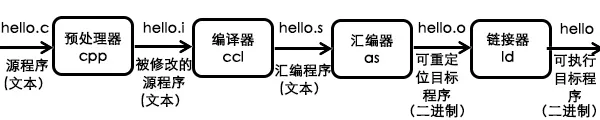

# 编译过程、静态库和动态库

* [返回上层目录](../compiler-principles.md)
* [编译过程](#编译过程)
  * [编译过程（预处理、编译、汇编和链接）介绍](#编译过程（预处理、编译、汇编和链接）介绍)
  * [编译过程例子](#编译过程例子)
* [静态库和动态库](#静态库和动态库)
  * [静态库](#静态库)
  * [动态库](#动态库)

注：这篇文章只是简单了解下GCC编译器的编译过程和制作静态库、动态库的流程和方法，更具体的详见编译原理部分的GCC编译器教程。

# 编译过程

## 编译过程（预处理、编译、汇编和链接）介绍

C语言的编译过程一般认为分为4个步骤：预处理、编译、汇编和链接。



* **预处理**`.i`：预处理，生成`.i`的文件 [*预处理器cpp*]

  主要是进行文本替换，处理在源代码文件中以“#”开始的预编译指令，如宏展开、处理条件编译指令、处理#include指令（C程序的头文件编译进来，把`include<>`中的头文件插入到当前`.c`程序文本中）等。预处理之后，得到的文件名习惯上以`.i`结尾。

  命令：`gcc -E main.c -o main.i`，必须加`-o`，不然只会输出到终端。

  作用：将`main.c`预处理输出`main.i`

* **编译**`.s`：将预处理后的文件转换成汇编语言，生成文件`.s` [*编译器egcs*]

  这个阶段编译器主要做词法分析、语法分析、语义分析等，在检查无错误后后，把预处理之后的`.i`代码翻译成汇编语言，通常以`.s`结尾。可用gcc的参数`-S`来参看。

  编译器(ccl)将文本文件`main.i`翻译成文本文件`main.s`，它包含一个汇编语言程序。汇编语言程序中的每条语句都以一种标准的文本格式描述了一条低级机器语言指令。

  命令：`gcc -S main.i -o main.s`，也可以不加`-o`，直接`gcc -S main.i`，默认输出`main.s`。

  作用：将预处理输出文件`main.i`汇编成`main.s`文件

* **汇编**`.o`：由汇编变为目标代码(机器代码)生成`.o`(obj)的文件 [*汇编器as*]

  将编译阶段生成的`.s`文件转换为二进制目标代码（机器语言），称为以`.o`结尾的目标对象，此时已经是01形式的二进制文件了，不再是文本文件。编译过程就是把预处理完的文件进行一系列词法分析、语法分析、语义分析以及优化后生成相应的汇编代码文件。

  可用gcc的参数`-c`来参看。汇编器(as)将main.s翻译成机器语言指令，把这些指令打包成可重定位目标程序的格式，并将结果保存在目标文件`main.o`中。`main.o`文件是一个二进制文件，它的字节编码是机器语言。

  命令1：`gcc -c main.s -o main.o`，也可以不加`-o`，直接`gcc -c main.s`，默认输出`main.o`。

  作用：作用：将汇编输出文件`main.s`汇编输出`main.o`文件

  命令2：`gcc -c main.c -o main.o`，也可以不加`-o`，直接`gcc -c main.s`，默认输出`main.o`。

  作用：从源码`main.c`直接进行预处理编译汇编输出`main.o`文件

* **链接**：把obj文件链接为可执行的文件，生成可执行程序 [*链接器ld*]

  `.o`的目标对象并不是可以执行的，还需要把所需要的其他目标对象链接在一起。比如你编译了一个`main.o`的目标对象，但是其中用到了`printf`函数，那么就需要将该`main.o`的目标对象，和另一个`printf.o`的目标对象链接起来，这样才能实现一个真正可执行的程序。

  链接器(ld)负责`.o`文件的并入。结果就是`main`文件，它是一个可执行的目标文件，可以加载到存储器后由系统调用。

  链接将二进制文件链接成一个可执行的命令，主要是把分散的数据和代码收集并合成一个单一的可加载并可执行的的文件。链接可以发生在代码静态编译、程序被加载时以及程序执行时。**链接过程的主要工作是符号解析和重定位**。
  
  命令：`gcc main.o -o main`，也可以不加`-o`，直接`gcc main.o`，默认输出`a.out`。

即：代码`main.c`(文本) => 预处理`main.i`(文本) => 编译`main.s`（汇编）=> 链接`main.o`(二进制机器码) => 可执行程序`main.exe`或`main`。


```shell
gcc -E main.c -o main.i  # 预处理
gcc -S main.i -o main.s  # 编译
gcc -c main.s -o main.o  # 汇编 或 gcc -c main.c -o main.o
gcc main.o -o hello      # 链接
```

## 编译过程例子

用main函数调用`myadd`函数计算`10+12=22`。

### 定义add.c函数源码

假设现在有一个`add.c`的源文件，里面包含一个`myadd()`的函数，如下：

```c++
int myadd(int a, int b) {
    int c = a + b;
    return c;
}
```

### add.c编译为add.o二进制机器码

首先我们将该`add.c`文件直接编译成目标对象文件`add.o`，以备后用。

```shell
gcc -c add.c 
```

> gcc知识：
>
> `gcc -c`是指只激活预处理，编译和汇编，也就是它只把程序做成obj文件（`.o`二进制文件）。
>
> 例子用法：
>
> ```c++
> gcc -c main.c  // 预处理，编译，汇编
> ```
>
> 将生成`.o`的obj文件。
>
> 经测试，等价于
>
> ```c++
> gcc -E main.c -o main.i  // 预处理
> gcc -S main.i -o main.s  // 编译
> gcc -c main.s -o main.o  // 汇编
> ```

### 定义add.h头文件

当然，还要有一个该文件的文件头`add.h`

```c++
int myadd(int a, int b);
```

### 定义并逐步编译main函数

#### 定义main并调用myadd函数

如果我们在下面的源代码`main.c`中调用`add.c`文件中的`myadd()`函数

```c++
#include <stdio.h>
#include "add.h"
int main()
{
    int x = 12;
    int y = 10;
    int z = myadd(x,y);
    printf("x + y = %d\n",z);
    return 0;
}
```

#### main.c预处理为main.i（文本）

下面我们来逐步进行编译，首先是**预处理**，将`main.c`添加头文件扩充为`main.i`（会删除注释）：

```shell
gcc -E main.c -o main.i
```

> gcc知识：
>
> `gcc -E`编译器将C程序的头文件编译进来，还有宏的替换。
>
> 只激活预处理,这个不生成文件, 你需要把它重定向到一个输出文件里面。
>
> ```c++
> gcc -E main.c > pianoapan.txt 
> gcc -E main.c | more
> ```
>
> 默认情况下，预处理器的输出会被导入到标准输出流（也就是显示器），可以利用`-o`(输出output的意思)选项把它导入到某个输出文件：
>
> ```c++
> gcc -E main.c -o main.i
> ```

查看`main.i`文件可看到多了很多行代码，其中很多一部分是因为我们`include <stdio.h>`中的内容，而我们自己写的`add.h`也通过文本替换进行了预处理：

```c++
...
# 2 "main.c" 2
# 1 "add.h" 1
int myadd(int a, int b); 
# 3 "main.c" 2 // 为什么.i里还有#开头的？

int main()
{
    int x = 12;
    int y = 10;
    int z = myadd(x,y);
    printf("x + y = %d\n",z);
    return 0;
}
```

#### main.i编译为main.s（汇编语言）

然后是编译，将预处理之后的`main.i`翻译成`main.s`的汇编语言：

```bash
gcc -S main.i
```

得到的汇编语言如下（省略部分内容）：

```c++
        .file   "main.c"
...
        movl    -4(%rbp), %eax
        movl    %edx, %esi
        movl    %eax, %edi
        call    myadd
...
        .ident  "GCC: (GNU) 4.8.5 20150623 (Red Hat 4.8.5-39)"
        .section        .note.GNU-stack,"",@progbits
```

#### main.s翻译为main.o（二进制机器码）

然后是编译，将汇编语言翻译成机器码，生成`main.o`的目标对象。

```c++
gcc -c main.s
```

此时的目标对象并不是一个可执行的对象，我们可以使用`nm`命令来查看二进制文件中的函数。

```shell
nm main.o
# 0000000000000000 T main
#                 U myadd
#                 U printf
```

这儿的`myadd`和`printf`都是`U`，即表示未定义。所以这也是为什么要进行链接的原因。

#### main.c编译为main（可执行文件）

我们尝试执行下面的代码，直接从源文件，编译成最后的可执行文件。

```shell
gcc main.c -o main
# /tmp/ccl95whV.o: In function `main':
# main.c:(.text+0x21): undefined reference to `myadd'
# collect2: error: ld returned 1 exit status
```

会出现错误提示，因为我们前面提到了，`myadd`是一个未定义的对象。但是为什么没有提示`printf`错误呢？`printf`也是一个未定义的对象啊！

其实，gcc编译器在编译的时候会在系统默认路径下寻找相应的目标对象，而`printf`是C语言标准库中的函数，所以不用我们指定目标对象，gcc便能够找到相应的函数。但是，`myadd`，是我们在当前路径下自定义的一个函数，gcc不会在当前路径下寻找对应的目标对象，所以我们上述的编译过程就出现了无法找到`myadd`的错误。

为了解决上述问题，我们在编译的时候需要指定`myadd`函数所在的目标对象，即`add.o`。如果你想看一下链接到的C语言标准库，可以使用`-Wl,--trace`参数：

```shell
gcc main.c add.o -o main -Wl,--trace
# /usr/bin/ld: mode elf_x86_64
# /usr/lib/gcc/x86_64-linux-gnu/7/../../../x86_64-linux-gnu/Scrt1.o
# /usr/lib/gcc/x86_64-linux-gnu/7/../../../x86_64-linux-gnu/crti.o
# /usr/lib/gcc/x86_64-linux-gnu/7/crtbeginS.o
# /tmp/ccYnhbxa.o
# add.o
# libgcc_s.so.1 (/usr/lib/gcc/x86_64-linux-gnu/7/libgcc_s.so.1)
# /lib/x86_64-linux-gnu/libc.so.6
# (/usr/lib/x86_64-linux-gnu/libc_nonshared.a)elf-init.oS
# /lib/x86_64-linux-gnu/ld-linux-x86-64.so.2
# /lib/x86_64-linux-gnu/ld-linux-x86-64.so.2
# libgcc_s.so.1 (/usr/lib/gcc/x86_64-linux-gnu/7/libgcc_s.so.1)
# /usr/lib/gcc/x86_64-linux-gnu/7/crtendS.o
# /usr/lib/gcc/x86_64-linux-gnu/7/../../../x86_64-linux-gnu/crtn.o
```

这儿， `printf`链接到了`/lib/x86_64-linux-gnu/libc.so.6`动态库中。而`myadd`链接了`add.o`目标对象中。

这时，再执行编译后的程序，就完全没有问题了。

```shell
./main
# x + y = 22
```

# 静态库和动态库

你可能还会留意到一个问题，为什么在上面链接过程中，一个是`.o`的目标对象，而另一个是`.so.6`的文件？这就涉及到C语言函数库库的两种形式。

函数库一般分为`静态库`和`动态库`两种，所谓静态、动态是指链接过程。

|         | 静态库 | 动态库 |
| :-----: | :----: | :----: |
| Windows |  .lib  |  .dll  |
|  Linux  |   .a   |  .so   |

**静态库**是指编译链接时，把库文件的代码全部加入到可执行文件中，因此生成的文件比较大，但在运行时也就不再需要库文件了。其后缀名一般为`.a`。

**动态库**与之相反，在编译链接时并没有把库文件的代码加入到可执行文件中，而是在程序执行时由运行时链接文件加载库，这样可以节省系统的开销。动态库一般后缀名为`.so`，如前面所述的`libc.so.6`就是动态库。gcc在编译时默认使用动态库。

**什么是库？**

库是一组目标文件的包，就是**一些最常用的代码编译成目标文件后打包存放。**而最常见的库就是运行时库（Runtime Library）,如C运行库CRT。

## 静态库

制作静态库比较简单，使用`ar`命令直接生成就可以了。比如，我们把上面`add.o`的目标对象转换成一个静态库。

```shell
# # 其实add.o后面还能跟多个.o文件，类似zip压缩包的感觉
ar -rv libadd.a add.o  # 将目标文件add.o打包成静态库文件add.a，可以同时打包多个
# ar: creating libadd.a
# a - add.o
# a - xxx.o add.o后面所跟的多个.o文件
```

习惯上，静态库以`.a`为文件名结尾。

然后我们将此静态库链接到之前的`main.c`源代码中：

```c++
gcc main.c libadd.a -o main_static
./main_static
# x + y = 22
```

此时生成的可执行。如果将`libadd.a`的静态库删除，那么main_static仍然可以执行。

## 动态库

动态库在链接的时候并没有将代码拷贝到最终生成的可执行程序中，而是在执行的时候才去加载。动态库的使用很广泛，但是制作一个动态库要比静态库麻烦一些。

不同的操作系统中，我们习惯上使用不同的后缀名，在Linux上，动态库通常是`.so`结尾，在OSX上，通常是`.dylib`结尾，而在Windows上，通常是`.dll`结尾。

与静态库不同的是，不需要打包工具（ar、lib.exe），直接使用gcc/g++编译器 即可创建动态库。

```shell
# 其实add.o后面还能跟多个.o文件，类似zip压缩包的感觉
gcc -shared -fpic add.c -o libadd.so
# 或
gcc -shared -fpic add.o -o libadd.so
```

其中，`-shared`即表示创建一个动态库，`-fpic` (position-independent code)将绝对地址转换成相对地址，这样不同的程序可以在不同的虚拟地址中加载该动态库。

我们将上述动态库`libadd.so`链接到我们的`main.c`的程序中，

```shell
gcc main.c libadd.so -o main_dyn
```

或者可以通过指定动态库名和路径来链接，如下：

```shell
gcc main.c -L /home/xxx -l add -o main_dyn
```

这儿`-L`用来指定动态库所在的路径，`-l`用来指定库名称，注意这个库名称是`libadd.so`去掉前缀`lib`和后缀`.so`之后的名称。上述两种方法编译后的可执行程序是完全一样的。

此时我们运行上述在动态库上建立的可执行程序，如下：

```shell
./main_dyn 
#  ./main_dyn: error while loading shared libraries: libadd.so: cannot open shared object file: No such file or directory
```

此时居然提示**错误**，说找不到`libadd.so`的动态库！

这就是动态库和静态库的区别，静态库编译完成之后，完全不依赖于静态库，即便删除了静态库，程序仍然可以正确执行，但是动态库不一样，**编译好的程序的运行需要依赖于外部动态库的存在**。程序在运行时会按照一定的顺序寻找所需要的动态库，比如`RPATH`，`LD_LIBRARY_PATH`, `/etc/ld.so.conf`, `/lib/`, `/usr/lib/`等，如果在这些路径中没有找到所需动态库，那么就出出现上述错误提示。

因为我们自定义的`libadd.so`动态库并不在上述路径中，所以我们必须给链接器指定其所在的路径。一种方法是，我们可以把`libadd.so`所在的路径添加到链接路径`LD_LIBRARY_PATH`中，然后再运行程序，就不会出现错误了。如下

```shell
export LD_LIBRARY_PATH=${LD_LIBRARY_PATH}:/home/xxx
./main_dyn
# x + y = 22
```

另一种方法是在我们链接的时候，使用`RPATH`，即“runtime library path”，该路径会保存在最后生成的可执行程序中，在程序运行中，会按照该路径寻找相应的动态库。如下，使用`-Wl,-rpath`来指定该路径。

```shell
gcc main.c -Wl,-rpath=./ libadd.so -o main_dyn1
# 或者
gcc main.c -Wl,-rpath=./ -L ./ -l add -o main_dyn1
```

我们比较一下加入了RPATH的可执行程序main_dyn1和没有加入该路径的main_dyn两个程序的链接情况，如下：

```shell
ldd main_dyn
	# linux-vdso.so.1 (0x00007ffc9e1db000)
	# libadd.so => not found
	# libc.so.6 => /lib/x86_64-linux-gnu/libc.so.6 (0x00007f748a028000)
	# /lib64/ld-linux-x86-64.so.2 (0x00007f748a61b000)

ldd main_dyn1
	# linux-vdso.so.1 (0x00007ffce21da000)
	# libadd.so => ./libadd.so (0x00007f216990e000)
	# libc.so.6 => /lib/x86_64-linux-gnu/libc.so.6 (0x00007f216951d000)
	# /lib64/ld-linux-x86-64.so.2 (0x00007f2169d12000)
```

可以看到加入`RPATH`的`main_dyn1`程序已经可以成功连接到`libadd.so`动态库上了，而另一个则仍然提示没有找到对应的动态库。

和静态库相比，整个程序的运行完全依赖于动态库，所以如果你把动态库删除，上述程序仍然会提示错误。

```shell
mv libadd.so libadd.so1
./main_dyn1
# ./main_dyn1: error while loading shared libraries: libadd.so: cannot open shared object file: No such file or directory
```

综上，动态库相比于静态库，主要的难点就是如何在程序执行过程中顺利找到外部所依赖的动态库。而动态库的优点是能都很大程度上减少程序的大小。比如我们可以比较一下上述静态库链接的可执行程序`main_static`和动态库链接的可执行程序`main_dyn`的大小。

```shell
ls -l main_*
-rwxrwxr-x 1 xxx xxx 8328 Oct  7 04:56 main_dyn
-rwxrwxr-x 1 xxx xxx 8328 Oct  7 04:54 main_dyn1
-rwxrwxr-x 1 xxx xxx 8360 Oct  6 01:34 main_static
```

静态库链接的程序比动态库链接的程序大了32B。当然，此处它们相差不是太大，主要是我们的库文件很简单，如果是一个很大很长的库文件，那么静态库链接的程序可能会比动态库的大很多。

此外，动态库还能够更有效的利用内存。如果对库文件进行修改，我们也不需要重新编译程序。

# 参考资料

* [编译过程、静态库和动态库 -知乎](https://zhuanlan.zhihu.com/p/363672984)

本文主要参考此知乎博客。

===

* [关于__declspec(dllimport)的理解](https://blog.csdn.net/fsdad/article/details/115632555)

* [__declspec(dllimport)](https://blog.csdn.net/xuleisdjn/article/details/52594092)

讲了`__declspec(dllimport)`存在的必要性。

* [有关动态链接库的知识](https://zhuanlan.zhihu.com/p/130871341?utm_id=0)

讲了`__decpspec(dllimport)`对函数调用的影响，使用`__declspec(dllimport)`导入数据。

* [【笔记】GCC/G++ 、动态库与静态库：动态库 执行速度慢和依赖性强，但升级简单、节省内存（牺牲了时间效率换取了空间效率）；静态库 浪费空间和更新困难，但执行速度快（牺牲了空间效率，换取了时间效率](https://blog.csdn.net/nyist_yangguang/article/details/121766408)

显式调用动态链接库的具体实现过程。

* [[Linux的.a、.so和.o文件](https://www.cnblogs.com/ziyunlong/p/6023121.html)](https://www.cnblogs.com/ziyunlong/p/6023121.html)

在说明Linux的.a、.so和.o文件关系之前，先来看看windows下obj,lib,dll,exe的关系

这一篇估计不错，有空好好看下。

