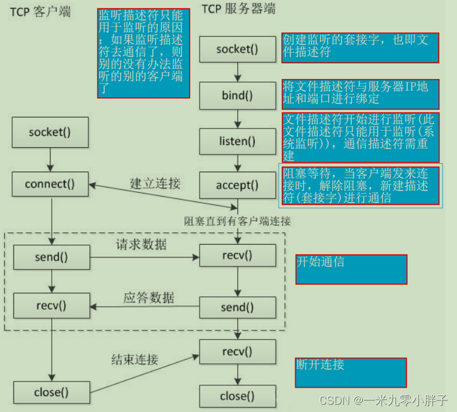
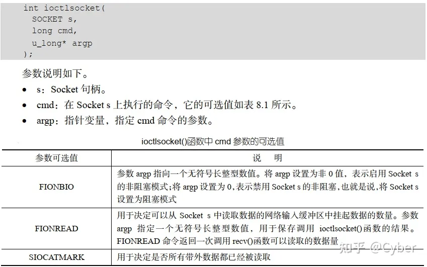

# TCP通信

* [返回上层目录](../tcp-ip-protocol-family.md)
* [TCP原理介绍](#TCP原理介绍)
  * [TCP的流程](#TCP的流程)
  * [非阻塞式](#非阻塞式)
* [单Server与单Client通信](#单Server与单Client通信)
  * [Windows版](#Windows版)
    * [Server端代码C++阻塞式](#Server端代码C++阻塞式)
    * [Client端代码C++阻塞式](#Client端代码C++阻塞式)
    * [Server端代码C++非阻塞式](#Server端代码C++非阻塞式)
* [单Server与多Client通信](#单Server与多Client通信)
  * [Windows版](#Windows版)
    * [Server端C++阻塞式（多线程）](#Server端C++阻塞式（多线程）)
    * [Client端C++阻塞式](#Client端C++阻塞式)
    * [Server端Python阻塞式（多线程）](#Server端Python阻塞式（多线程）)
    * [Server端代码C++非阻塞式（单线程）](#Server端代码C++非阻塞式（单线程）)
    * [Client端C++非阻塞式](#Client端C++非阻塞式)
    * [Server端Python非阻塞式（单线程）](#Server端Python非阻塞式（单线程）)

# TCP原理介绍

## TCP的流程



服务端必须先监听该端口，使用accept阻塞等待，等待客户端用connect请求；

客户端用connect请求服务端，accept收到后就分配给该客户端一个专用的socker建立专用链接；

后续就在该链接(socket)上和该客户端用recv和send进行通信。

总结：也就比Udp多了一个accept和connect环节，这能保证专用稳定的链接。

## 非阻塞式

默认情况下，新建的 Socket 是阻塞模式的。可以调用 ioctlsocket()函数将 Socket 设置为非阻塞模式，函数原型如下：



## socket缓冲区

[socket缓冲区](https://www.pianshen.com/article/1466786924/)


# 单Server与单Client通信

## Windows版

参考链接：[socket编程TCP/IP通信（windows下，C++实现）](https://blog.csdn.net/qq_44184049/article/details/122291617)

先别看那些原理介绍，会看晕的，直接看代码，很容易懂，再返回去看原理介绍。

话不多说，代码如下：

### Server端代码C++阻塞式

```c++
//server.cpp
#include<iostream>
#include<winsock.h>   // windows平台的网络库头文件
#pragma comment(lib,"ws2_32.lib")   // 库文件
using namespace std;

// 服务端
// socket编程TCP/IP通信（windows下，C++实现）
// https://blog.csdn.net/qq_44184049/article/details/122291617

#define PORT 5050
#define BUFSIZ 512

void initialization() {
    //初始化套接字库
    // WSA  windows socket async  windows异步套接字     WSAStartup启动套接字
    // parm1:请求的socket版本 2.2 2.1 1.0     parm2:传出参数    参数形式：WORD  WSADATA
    WORD w_req = MAKEWORD(2, 2);//版本号
    WSADATA wsadata;
    // 成功：WSAStartup函数返回零
    if (WSAStartup(w_req, &wsadata) != 0) {
        cout << "init socket lib failed!" << endl;
    }
    else {
        cout << "init socket lib success!" << endl;
    }
}

SOCKET createServeSocket(const char* ip)
{
    //1.创建空的Socket
    //parm1:af 地址协议族 ipv4 ipv6
    //parm2:type 传输协议类型 流式套接字(SOCK_STREAM) 数据报
    //parm3：protocl 使用具体的某个传输协议
    SOCKET s_server = socket(AF_INET, SOCK_STREAM, IPPROTO_TCP);
    if (s_server == INVALID_SOCKET)
    {
        cout << "socket create failed!" << endl;
        WSACleanup();
    }
    else {
        cout << "socket create sucess!" << endl;
    }
    //2.给socket绑定ip地址和端口号
    struct sockaddr_in server_addr;   // sockaddr_in, sockaddr  老版本和新版的区别
    server_addr.sin_family = AF_INET;  // 和创建socket时必须一样
    server_addr.sin_port = htons(PORT);       // 端口号  大端（高位）存储(本地)和小端（低位）存储(网络），两个存储顺序是反着的  htons 将本地字节序转为网络字节序
    server_addr.sin_addr.S_un.S_addr = inet_addr(ip); //inet_addr将点分十进制的ip地址转为二进制
    if (bind(s_server, (SOCKADDR*)&server_addr, sizeof(SOCKADDR)) == SOCKET_ERROR) {
        cout << "socket bind failed!" << endl;
        WSACleanup();
    }
    else {
        cout << "socket bind success!" << endl;
    }

    //3.设置套接字为监听状态  SOMAXCONN 监听的端口数 右键转到定义为5
    if (listen(s_server, SOMAXCONN) < 0) {
        cout << "set listen states failed!" << endl;
        WSACleanup();
    }
    else {
        cout << "set listen status succes!" << endl;
    }
    return s_server;
}

int main_tcp_send() {
    //定义发送缓冲区和接受缓冲区长度
    char send_buf[BUFSIZ];
    char recv_buf[BUFSIZ];
    //定义服务端套接字，接受请求套接字
    SOCKET s_server;
    SOCKET s_accept;

    initialization(); // 初始化启动套接字
    s_server = createServeSocket("127.0.0.1");
    cout << "wait client connect..." << endl;
    // 如果有客户端请求连接
    printf("waiting for client! zuse!!!!\n");
    s_accept = accept(s_server, NULL, NULL);  // 阻塞住，等待客户端发消息
    printf("client send info to server! zuse end!!!!\n");
    if (s_accept == INVALID_SOCKET) {
        cout << "link failed!" << endl;
        WSACleanup();
        return 0;
    }
    // 可以和客户端进行通信了
    while (true) {
        // recv从指定的socket接受消息
        if (recv(s_accept, recv_buf, BUFSIZ, 0) > 0){
            cout << "client info: " << recv_buf << endl;
        }
        else {
            cout << "receive failed!" << endl;
            break;
        }
        cout << "please input replay info:";
        cin >> send_buf;
        if (send(s_accept, send_buf, BUFSIZ, 0) < 0) {
            cout << "sned failed!" << endl;
            break;
        }
    }
    //关闭套接字
    closesocket(s_server);
    closesocket(s_accept);
    //释放DLL资源
    WSACleanup();
    return 0;
}
```

### Client端代码C++阻塞式

参考链接：[socket编程TCP/IP通信（windows下，C++实现）](https://blog.csdn.net/qq_44184049/article/details/122291617)

代码如下：

```c++
// client.cpp
#include<iostream>
#include<winsock.h>   // windows平台的网络库头文件
#pragma comment(lib,"ws2_32.lib")   // 库文件
using namespace std;

// 客户端
// socket编程TCP/IP通信（windows下，C++实现）
// https://blog.csdn.net/qq_44184049/article/details/122291617

#define PORT 5050
#define BUFSIZ 512

void initialization() {
	//初始化套接字库
	// WSA  windows socket async  windows异步套接字     WSAStartup启动套接字
	// parm1:请求的socket版本 2.2 2.1 1.0     parm2:传出参数    参数形式：WORD  WSADATA
	WORD w_req = MAKEWORD(2, 2);//版本号  
	WSADATA wsadata;
	// 成功：WSAStartup函数返回零
	if (WSAStartup(w_req, &wsadata) != 0) {
		cout << "初始化套接字库失败！" << endl;
	}
	else {
		cout << "初始化套接字库成功！" << endl;
	}
}

SOCKET createClientSocket(const char* ip)
{
	//1.创建空的Socket					
		//parm1:af 地址协议族 ipv4 ipv6
		//parm2:type 传输协议类型 流式套接字(SOCK_STREAM) 数据报
		//parm3：protocl 使用具体的某个传输协议
	SOCKET c_client = socket(AF_INET, SOCK_STREAM, IPPROTO_TCP);
	if (c_client == INVALID_SOCKET)
	{
		cout << "套接字创建失败！" << endl;
		WSACleanup();
	}
	else {
		cout << "套接字创建成功！" << endl;
	}

	//2.连接服务器
	struct sockaddr_in addr;   // sockaddr_in, sockaddr  老版本和新版的区别
	addr.sin_family = AF_INET;  // 和创建socket时必须一样
	addr.sin_port = htons(PORT);       // 端口号  大端（高位）存储(本地)和小端（低位）存储(网络），两个存储顺序是反着的  htons 将本地字节序转为网络字节序
	addr.sin_addr.S_un.S_addr = inet_addr(ip); //inet_addr将点分十进制的ip地址转为二进制

	if (connect(c_client, (struct sockaddr*)&addr, sizeof(addr)) == INVALID_SOCKET)
	{
		cout << "服务器连接失败！" << endl;
		WSACleanup();
	}
	else {
		cout << "服务器连接成功！" << endl;
	}
	return c_client;
}

int main() {
	//定义发送缓冲区和接受缓冲区长度
	char send_buf[BUFSIZ];
	char recv_buf[BUFSIZ];
	//定义客户端套接字，接受请求套接字
	SOCKET s_server;
	initialization(); // 初始化启动套接字
	s_server = createClientSocket("127.0.0.1");


	//发送,接收数据
	while (true) {
		cout << "请输入发送信息:";
		cin >> send_buf;
		if (send(s_server, send_buf, BUFSIZ, 0) < 0) {
			cout << "发送失败！" << endl;
			break;
		}
		if (recv(s_server, recv_buf, BUFSIZ, 0) < 0) {
			cout << "接受失败！" << endl;
			break;
		}
		else {
			cout << "服务端信息:" << recv_buf << endl;
		}

	}
	//关闭套接字
	closesocket(s_server);
	//释放DLL资源
	WSACleanup();
	return 0;
}
```

### Server端代码C++非阻塞式

参考资料：[TCP Socket编程（非阻塞模式）（C++）](https://blog.csdn.net/wlff_csdn/article/details/70510841)

```
#include<iostream>
#include <WinSock2.h>
#include <WS2tcpip.h>
#include<vector>
#include<List>
using namespace std;
#pragma comment(lib,"ws2_32.lib")
#define PORT  65432
#define buff_len 500
int main_tcp_send()
{
    //初始化winsock2.DLL
    WSADATA wsaData;
    WORD wVersionRequested = MAKEWORD(2, 2);
    if (WSAStartup(wVersionRequested, &wsaData) != 0)
    {
        cout << "load winsock.dll failed！" << endl;
        return 0;
    }
    //创建套接字
    SOCKET  sock_server;
    if ((sock_server = socket(AF_INET, SOCK_STREAM, 0)) == SOCKET_ERROR)
    {
        cout << "create socket failed! error code:" << WSAGetLastError() << endl;
        WSACleanup();
        return 0;
    }
    //设置为非阻塞方式
    u_long ul = 1;
    if (ioctlsocket(sock_server, FIONBIO, &ul) == SOCKET_ERROR)
    {
        cout << "ioctlsocket failure, error:" << GetLastError() << endl;
        WSACleanup();
        return 0;
    }
    //绑定端口和Ip
    sockaddr_in addr;
    int addr_len = sizeof(struct sockaddr_in);
    addr.sin_family = AF_INET;
    addr.sin_port = htons(PORT);
    inet_pton(AF_INET, "127.0.0.1", &addr.sin_addr);//绑定本机的环回地址
    if (SOCKET_ERROR == bind(sock_server, (SOCKADDR*)&addr, sizeof(sockaddr_in)))
    {
        cout << "addr bind failed! error code:" << WSAGetLastError() << endl;
        closesocket(sock_server);
        WSACleanup();
        return 0;
    }
    //将套接字设为监听状态
    int size=listen(sock_server, 0);
    if (size != 0)
    {
        cout << "listen func use failed!\n";
        closesocket(sock_server);
        WSACleanup();
        return 0;
    }
    list<SOCKET> liSock;//将连接的套接字存储在list中
    char msg[buff_len];//发送数据缓冲区
    char msgbuffer[buff_len];//接收数据缓冲区
    int n = 0; //标记已经连接的套接字数量
    int num = 0;
    //实现交互
    while (1)
    {
        num++;
        sockaddr_in  client_addr;
        auto sc = accept(sock_server, (struct sockaddr*)&client_addr, &addr_len);
        if (sc == INVALID_SOCKET)
        {
            if (GetLastError() == WSAEWOULDBLOCK)
            {
                cout << "this time accept func has no client build link!" << endl;
                Sleep(3000);//设置令其间隔一段时间
            }
            else
            {
                cout << "accept func use failed! net not normal, program exit" << endl;
                closesocket(sock_server);
                WSACleanup();
                return 0;
            }
        }
        else
        {
            cout << "server link with: " << sc << "success!" << endl;
            liSock.push_back(sc);//将建立连接的套接字压入list
        }
        auto it = liSock.begin();
        auto ccc = liSock.end();
        while (it != liSock.end())
        {
            auto itTemp = it++;
            cout << "please input, server send data to client" << *itTemp << "." << endl;
//            cin.getline(msg, sizeof(msg));
            sprintf(msg,"%d",num);
            int size = send(*itTemp, msg, sizeof(msg), 0);
//            int size = send(*itTemp, "abc", 4, 0);
            if (strcmp(msg, "end\0") == 0)
            {
                cout << "close link with " << *itTemp << "!" << endl;
                liSock.erase(itTemp);//移除已关闭连接的套接字
                system("pause");
            }
            if (size <= 0)
            {
                if (GetLastError() == WSAEWOULDBLOCK)
                {
                    cout << "Send data failure！\n";
                }
                else
                {
                    cout << *itTemp << " is closed" << endl;
                    liSock.erase(itTemp);
                    system("pause");
                }
            }
        }
        it = liSock.begin();
        while (it != liSock.end())
        {
            auto itTemp = it++;
            size = recv(*itTemp, msgbuffer, sizeof(msgbuffer), 0);
            if (size <= 0)
            {
                if (GetLastError() == WSAEWOULDBLOCK)
                {
                    cout << "recv data failure！\n";
                }
                else
                {
                    cout << *itTemp << " is closed" << endl;
                    liSock.erase(itTemp);
                    system("pause");
                }
            }
            else
            {
                cout << *itTemp << "   say:   " << msgbuffer << endl;
                system("pause");
            }
        }
    }
    return 0;
}
```

```c++
#include<iostream>
#include <WinSock2.h>
#include <WS2tcpip.h>
#include<vector>
#include<List>
using namespace std;
#pragma comment(lib,"ws2_32.lib")
#define PORT  65432
#define buff_len 500
int main_tcp_send()
{
    //初始化winsock2.DLL
    WSADATA wsaData;
    WORD wVersionRequested = MAKEWORD(2, 2);
    if (WSAStartup(wVersionRequested, &wsaData) != 0)
    {
        cout << "load winsock.dll failed！" << endl;
        return 0;
    }
    //创建套接字
    SOCKET  sock_server;
    if ((sock_server = socket(AF_INET, SOCK_STREAM, 0)) == SOCKET_ERROR)
    {
        cout << "create socket failed! error code:" << WSAGetLastError() << endl;
        WSACleanup();
        return 0;
    }
    //设置为非阻塞方式
    u_long ul = 1;
    if (ioctlsocket(sock_server, FIONBIO, &ul) == SOCKET_ERROR)
    {
        cout << "ioctlsocket failure, error:" << GetLastError() << endl;
        WSACleanup();
        return 0;
    }
    //绑定端口和Ip
    sockaddr_in addr;
    int addr_len = sizeof(struct sockaddr_in);
    addr.sin_family = AF_INET;
    addr.sin_port = htons(PORT);
    inet_pton(AF_INET, "127.0.0.1", &addr.sin_addr);//绑定本机的环回地址
    if (SOCKET_ERROR == bind(sock_server, (SOCKADDR*)&addr, sizeof(sockaddr_in)))
    {
        cout << "addr bind failed! error code:" << WSAGetLastError() << endl;
        closesocket(sock_server);
        WSACleanup();
        return 0;
    }
    //将套接字设为监听状态
    int size=listen(sock_server, 0);
    if (size != 0)
    {
        cout << "listen func use failed!\n";
        closesocket(sock_server);
        WSACleanup();
        return 0;
    }
    list<SOCKET> liSock;//将连接的套接字存储在list中
    char msg[buff_len];//发送数据缓冲区
    char msgbuffer[buff_len];//接收数据缓冲区
    int n = 0; //标记已经连接的套接字数量
    int num = 0;
    //实现交互
    while (1)
    {
        num++;
        sockaddr_in  client_addr;
        auto sc = accept(sock_server, (struct sockaddr*)&client_addr, &addr_len);
        if (sc == INVALID_SOCKET)
        {
            if (GetLastError() == WSAEWOULDBLOCK)
            {
                cout << "this time accept func has no client build link!" << endl;
                Sleep(3000);//设置令其间隔一段时间
            }
            else
            {
                cout << "accept func use failed! net not normal, program exit" << endl;
                closesocket(sock_server);
                WSACleanup();
                return 0;
            }
        }
        else
        {
            cout << "server link with: " << sc << "success!" << endl;
            liSock.push_back(sc);//将建立连接的套接字压入list
        }
        auto it = liSock.begin();
        auto ccc = liSock.end();
        while (it != liSock.end())
        {
            auto itTemp = it++;
            cout << "please input, server send data to client" << *itTemp << "." << endl;
//            cin.getline(msg, sizeof(msg));
            sprintf(msg,"%d",num);
            int size = send(*itTemp, msg, sizeof(msg), 0);
//            int size = send(*itTemp, "abc", 4, 0);
            if (strcmp(msg, "end\0") == 0)
            {
                cout << "close link with " << *itTemp << "!" << endl;
                liSock.erase(itTemp);//移除已关闭连接的套接字
                system("pause");
            }
            if (size <= 0)
            {
                if (GetLastError() == WSAEWOULDBLOCK)
                {
                    cout << "Send data failure！\n";
                }
                else
                {
                    cout << *itTemp << " is closed" << endl;
                    liSock.erase(itTemp);
                    system("pause");
                }
            }
        }
        it = liSock.begin();
        while (it != liSock.end())
        {
            auto itTemp = it++;
            size = recv(*itTemp, msgbuffer, sizeof(msgbuffer), 0);
            if (size <= 0)
            {
                if (GetLastError() == WSAEWOULDBLOCK)
                {
                    cout << "recv data failure！\n";
                }
                else
                {
                    cout << *itTemp << " is closed" << endl;
                    liSock.erase(itTemp);
                    system("pause");
                }
            }
            else
            {
                cout << *itTemp << "	say:	" << msgbuffer << endl;
                system("pause");
            }
        }
    }
    return 0;
}
```


# 单Server与多Client通信

## Windows版

参考链接：[C++实现TCP服务器端同时和多个客户端通信(多线程)](https://blog.csdn.net/qq_45929428/article/details/116709789)

### Server端C++阻塞式（多线程）

```c++
#include <WinSock2.h>
#include <WS2tcpip.h>
#include <iostream>
using namespace std;
#pragma comment(lib, "ws2_32.lib")
#define PORT 65432
DWORD WINAPI ThreadFun(LPVOID lpThreadParameter);
int main_tcp_send()
{
    //初始化winsock2.DLL
    WSADATA wsaData;
    WORD wVersionRequested = MAKEWORD(2, 2);
    if (WSAStartup(wVersionRequested, &wsaData) != 0)
    {
        cout << "load winsock.dll failed！" << endl;
        return 0;
    }
    //创建套接字
    SOCKET  sock_server;
    if ((sock_server = socket(AF_INET, SOCK_STREAM, 0)) == SOCKET_ERROR)
    {
        cout << "create socket failed! error code:" << WSAGetLastError() << endl;
        WSACleanup();
        return 0;
    }
    //绑定端口和Ip
    sockaddr_in addr;
    addr.sin_family = AF_INET;
    addr.sin_port = htons(PORT);
    inet_pton(AF_INET, "127.0.0.1", &addr.sin_addr);//绑定本机的环回地址
    if (SOCKET_ERROR == bind(sock_server, (SOCKADDR*)&addr, sizeof(sockaddr_in)))
    {
        cout << "addr bind failed! error code:" << WSAGetLastError() << endl;
        closesocket(sock_server);
        WSACleanup();
        return 0;
    }
    //将套接字设为监听状态
    listen(sock_server, 0);

    int i = 0;
    //主线程循环接收客户端的连接
    while (1)
    {
        sockaddr_in addrClient;
        int len = sizeof(sockaddr_in);
        //接收成功返回与client通讯的socket
        SOCKET con = accept(sock_server, (SOCKADDR*)&addrClient, &len);
        printf("the %dth time accept!\n", i + 1);
        if (con != INVALID_SOCKET)
        {
            //创建线程 并且传入与client通讯的套接字
            HANDLE hThread = CreateThread(NULL, 0, ThreadFun, (LPVOID)con, 0, NULL);
            CloseHandle(hThread); //关闭对线程的引用
        }
        cout << "===" << endl;
        if (i >= 1) break;
        i++;
    }
    cout << "end" << endl;
    getchar();

    closesocket(sock_server);
    WSACleanup();
    return 0;
}
//线程通讯部分
DWORD WINAPI ThreadFun(LPVOID lpThreadParameter)
{
    //与客户端通讯 先发送再接收数据
    SOCKET sock = (SOCKET)lpThreadParameter;
    cout << "establish link with " << sock << " success!" << endl;
    while (1)
    {
        char msgbuffer[1000];//字符缓冲区
        printf("server send data to %d: aaa\n", sock);
        //cin.getline(msgbuffer, sizeof(msgbuffer));
        //int size = send(sock, msgbuffer, sizeof(msgbuffer), 0);//给客户端发送一段信息
        // 为了方便，我把server端的输入，改成了直接发aaa
        int size = send(sock, "aaa", 4, 0);//给客户端发送一段信息
        if (strcmp(msgbuffer, "end\0") == 0)
        {
            cout << "close link with " << sock << "!" << endl;
            return 0;
        }
        if (size == SOCKET_ERROR || size == 0)
        {
            cout << "send info failed! error code:" << WSAGetLastError() << endl;
            return 0;
        }
        else cout << "info send success!" << endl;

        //接收客户端数据
        msgbuffer[999] = { 0 };
        int ret = recv(sock, msgbuffer, sizeof(msgbuffer), 0);
        if(ret == SOCKET_ERROR || ret == 0)
        {
            cout << sock << "link breaked!" << endl;
            break;
        }
        else cout << sock << "  say: " << msgbuffer << endl;
    }
    return 0;
}
```

### Client端C++阻塞式

参考链接：[C++实现TCP服务器端同时和多个客户端通信(多线程)](https://blog.csdn.net/qq_45929428/article/details/116709789)

```c++
#include <winsock2.h>
#include <WS2tcpip.h>
#include <iostream>
using  namespace std;
#pragma comment(lib, "ws2_32.lib")
#define PORT 65432
int  main()
{
	//初始化winsock2.DLL
	WSADATA wsaData;
	WORD wVersionRequested = MAKEWORD(2, 2);
	if (WSAStartup(wVersionRequested, &wsaData) != 0)
	{
		cout << "加载winsock.dll失败！" << endl;
		return 0;
	}
	//创建套接字
	SOCKET  sock_client;
	if ((sock_client = socket(AF_INET, SOCK_STREAM, 0)) == SOCKET_ERROR)
	{
		cout << "创建套接字失败！错误代码：" << WSAGetLastError() << endl;
		WSACleanup();
		return 0;
	}
	//连接服务器
	sockaddr_in   addr;
	addr.sin_family = AF_INET;
	addr.sin_port = htons(PORT);
	inet_pton(AF_INET, "127.0.0.1", &addr.sin_addr);//绑定本机的环回地址
	int len = sizeof(sockaddr_in);
	if (connect(sock_client, (SOCKADDR*)&addr, len) == SOCKET_ERROR) {
		cout << "连接失败！错误代码：" << WSAGetLastError() << endl;
		return 0;
	}
	//实现交互部分，客户端先接收后发送数据
	while (1)
	{
		//接收服务端的消息
		char msgbuffer[1000] = { 0 };
		int size = recv(sock_client, msgbuffer, sizeof(msgbuffer), 0);
		if (strcmp(msgbuffer, "end\0") == 0)
		{
			cout << "服务器端已经关闭连接！" << endl;
			break;
		}
		if (size < 0)
		{
			cout << "接收信息失败！错误代码：" << WSAGetLastError() << endl;
			break;
		}
		else if (size == 0)
		{
			cout << "对方已经关闭连接" << endl;
			break;
		}
		else cout << "The message from Server:" << msgbuffer << endl;

		//从键盘输入一行文字发送给服务器
		msgbuffer[999] = 0;
		cout << "从键盘输入发给服务器的信息：" << endl;
		cin.getline(msgbuffer, sizeof(msgbuffer));
		if (strcmp(msgbuffer, "end\0") == 0)
		{
			cout << "关闭连接！" << endl;
			break;
		}
		int ret = send(sock_client, msgbuffer, sizeof(msgbuffer), 0);
		if (ret == SOCKET_ERROR || ret == 0)
		{
			cout << "发送信息失败！错误代码：" << WSAGetLastError() << endl;
			break;
		}
		else cout << "信息发送成功！" << endl;
	}
	closesocket(sock_client);
	WSACleanup();
	return 0;
}
```

### Server端Python阻塞式（多线程）

参考资料：[python多线程实现TCP服务端](http://www.3qphp.com/python/pybase/3884.html)

```python
# 导入模块
import socket
import threading


# 接收消息
def recv(client_socket, ip_port):
    while True:
        client_socket.send("send test\n".encode())
        client_text = client_socket.recv(1024)
        # 如果接收的消息长度不为0，则将其解码输出
        if client_text:
            print("[客户端消息]", ip_port, ":", client_text.decode("gbk"))
            # 给客户端响应
            client_socket.send("received\n".encode())
        # 当客户端断开连接时，会一直发送''空字符串，所以长度为0已下线
        else:
            print("客户端", ip_port, "已下线")
            client_socket.close()
            break


# 程序主入口
def main():
    # 创建TCP套接字
    tcp_socket = socket.socket(socket.AF_INET, socket.SOCK_STREAM)
    # 设置端口复用
    tcp_socket.setsockopt(socket.SOL_SOCKET, socket.SO_REUSEADDR, True)
    # 绑定端口
    tcp_socket.bind(("", 65432))
    # 设置为被动监听状态，128表示最大连接数
    tcp_socket.listen(128)
    while True:
        # 等待客户端连接
        client_socket, ip_port = tcp_socket.accept()
        print("[新客户端]:", ip_port, "已连接")
        # 有客户端连接后，创建一个线程将客户端套接字，IP端口传入recv函数，
        t1 = threading.Thread(target=recv, args=(client_socket, ip_port))
        # 设置线程守护
        # Python多线程中的setDaemon: https://www.cnblogs.com/-wenli/p/12907355.html
        # 当子线程不设置时(默认)，主进程结束后，子线程会继续执行完后，程序结束。
        # 当设置时，主进程不会等待子线程，当主线程结束，子线程就会被强制停止运行并回收。
        t1.setDaemon(True)
        # 启动线程
        t1.start()


if __name__ == '__main__':
    main()
```

### Server端代码C++非阻塞式（单线程）

参考资料：[C++实现TCP服务器端非阻塞方式同时和多个客户端通信](https://blog.csdn.net/qq_45929428/article/details/117133413)

```c++
#include<iostream>
#include <WinSock2.h>
#include <WS2tcpip.h>
#include<vector>
#include<List>
using namespace std;
#pragma comment(lib,"ws2_32.lib")
#define PORT  65432
#define buff_len 500
int main_tcp_send()
{
    //初始化winsock2.DLL
    WSADATA wsaData;
    WORD wVersionRequested = MAKEWORD(2, 2);
    if (WSAStartup(wVersionRequested, &wsaData) != 0)
    {
        cout << "load winsock.dll failed！" << endl;
        return 0;
    }
    //创建套接字
    SOCKET  sock_server;
    if ((sock_server = socket(AF_INET, SOCK_STREAM, 0)) == SOCKET_ERROR)
    {
        cout << "create socket failed! error code:" << WSAGetLastError() << endl;
        WSACleanup();
        return 0;
    }
    //设置为非阻塞方式
    u_long ul = 1;
    if (ioctlsocket(sock_server, FIONBIO, &ul) == SOCKET_ERROR)
    {
        cout << "ioctlsocket failure, error:" << GetLastError() << endl;
        WSACleanup();
        return 0;
    }
    //绑定端口和Ip
    sockaddr_in addr;
    int addr_len = sizeof(struct sockaddr_in);
    addr.sin_family = AF_INET;
    addr.sin_port = htons(PORT);
    inet_pton(AF_INET, "127.0.0.1", &addr.sin_addr);//绑定本机的环回地址
    if (SOCKET_ERROR == bind(sock_server, (SOCKADDR*)&addr, sizeof(sockaddr_in)))
    {
        cout << "addr bind failed! error code:" << WSAGetLastError() << endl;
        closesocket(sock_server);
        WSACleanup();
        return 0;
    }
    //将套接字设为监听状态
    int size=listen(sock_server, 0);
    if (size != 0)
    {
        cout << "listen func use failed!\n";
        closesocket(sock_server);
        WSACleanup();
        return 0;
    }
    list<SOCKET> liSock;//将连接的套接字存储在list中
    char msg[buff_len];//发送数据缓冲区
    char msgbuffer[buff_len];//接收数据缓冲区
    int n = 0; //标记已经连接的套接字数量
    int num = 0;
    //实现交互
    while (1)
    {
        num++;
        sockaddr_in  client_addr;
        auto sc = accept(sock_server, (struct sockaddr*)&client_addr, &addr_len);
        if (sc == INVALID_SOCKET)
        {
            if (GetLastError() == WSAEWOULDBLOCK)
            {
                cout << "this time accept func has no client build link!" << endl;
                Sleep(3000);//设置令其间隔一段时间
            }
            else
            {
                cout << "accept func use failed! net not normal, program exit" << endl;
                closesocket(sock_server);
                WSACleanup();
                return 0;
            }
        }
        else
        {
            cout << "server link with: " << sc << "success!" << endl;
            liSock.push_back(sc);//将建立连接的套接字压入list
        }
        auto it = liSock.begin();
        auto ccc = liSock.end();
        while (it != liSock.end())
        {
            auto itTemp = it++;
            cout << "please input, server send data to client" << *itTemp << "." << endl;
//            cin.getline(msg, sizeof(msg));
            sprintf(msg,"%d",num);
            int size = send(*itTemp, msg, sizeof(msg), 0);
//            int size = send(*itTemp, "abc", 4, 0);
            if (strcmp(msg, "end\0") == 0)
            {
                cout << "close link with " << *itTemp << "!" << endl;
                liSock.erase(itTemp);//移除已关闭连接的套接字
                system("pause");
            }
            if (size <= 0)
            {
                if (GetLastError() == WSAEWOULDBLOCK)
                {
                    cout << "Send data failure！\n";
                }
                else
                {
                    cout << *itTemp << " is closed" << endl;
                    liSock.erase(itTemp);
                    system("pause");
                }
            }
        }
        it = liSock.begin();
        while (it != liSock.end())
        {
            auto itTemp = it++;
            size = recv(*itTemp, msgbuffer, sizeof(msgbuffer), 0);
            if (size <= 0)
            {
                if (GetLastError() == WSAEWOULDBLOCK)
                {
                    cout << "recv data failure！\n";
                }
                else
                {
                    cout << *itTemp << " is closed" << endl;
                    liSock.erase(itTemp);
                    system("pause");
                }
            }
            else
            {
                cout << *itTemp << "	say:	" << msgbuffer << endl;
                system("pause");
            }
        }
    }
    return 0;
}
```

### Client端C++非阻塞式

参考资料：[TCP Socket编程（非阻塞模式）（C++）](https://blog.csdn.net/wlff_csdn/article/details/70510841)

```c++
// TcpClient.cpp : 定义控制台应用程序的入口点。
//


#include <winsock2.h>
#include <string>
#include <iostream>

#pragma comment(lib,"ws2_32.lib")
#define BUF_SIZE 64


int main(int argc, char* argv[])
{
	WSADATA wsd;
	SOCKET sHost;
	SOCKADDR_IN servAddr;
	char buf[BUF_SIZE];
	int retVal;
	//初始化Socket
	if (WSAStartup(MAKEWORD(2, 2), &wsd) != 0)
	{
		printf("WSAStartup failed!\n");
		return -1;
	}
	//创建Socket
	sHost = socket(AF_INET, SOCK_STREAM, IPPROTO_TCP);
	if (INVALID_SOCKET == sHost)
	{
		printf("socket failed!\n");
		WSACleanup();
		return -1;
	}
	//设置Socket为非阻塞模式
	int iMode = 1;
	retVal = ioctlsocket(sHost, FIONBIO, (u_long FAR*) & iMode);
	if (retVal == SOCKET_ERROR)
	{
		printf("ioctlsocket failed!\n");
		WSACleanup();
		return -1;
	}
	//设置服务器Socket地址
	servAddr.sin_family = AF_INET;
	servAddr.sin_port = htons(65432);
	servAddr.sin_addr.S_un.S_addr = inet_addr("127.0.0.1");//htonl(INADDR_ANY);

	int sServerAddlen = sizeof(servAddr);

	//连接到服务器
	while (true)
	{
		retVal = connect(sHost, (LPSOCKADDR)&servAddr, sizeof(servAddr));
		if (SOCKET_ERROR == retVal)
		{
			int err = WSAGetLastError();
			if (err == WSAEWOULDBLOCK || err == WSAEINVAL)
			{
				Sleep(1000);
				printf("try next connect!\n");
				continue;
			}
			else if (err == WSAEISCONN)
			{
				break;
			}
			else
			{
				printf("connection failed!\n");
				closesocket(sHost);
				WSACleanup();
				return -1;
			}
		}
	}

	//收发数据
	while (true)
	{
		printf("Please input a string to send:");
		std::string str;
		std::getline(std::cin, str);
		ZeroMemory(buf, BUF_SIZE);
		strcpy_s(buf, str.c_str());
		while (true)
		{
			retVal = send(sHost, buf, strlen(buf), 0);
			if (SOCKET_ERROR == retVal)
			{
				int err = WSAGetLastError();
				if (err == WSAEWOULDBLOCK)
				{
					Sleep(500);
					continue;
				}
				else
				{
					printf("send failed!\n");
					closesocket(sHost);
					WSACleanup();
					return -1;
				}
			}
			break;

		}

		while (true)
		{
			ZeroMemory(buf, BUF_SIZE);
			retVal = recv(sHost, buf, sizeof(buf) + 1, 0);
			if (SOCKET_ERROR == retVal)
			{
				int err = WSAGetLastError();
				if (err == WSAEWOULDBLOCK)
				{
					Sleep(100);
					printf("waiting back msg!\n");
					continue;
				}
				else if (err == WSAETIMEDOUT || err == WSAENETDOWN)
				{
					printf("recv failed!\n");
					closesocket(sHost);
					WSACleanup();
					return -1;
				}
				break;
			}
			break;

		}
		printf("Recv From Server:%s\n", buf);
		if (strcmp(buf, "quit") == 0)
		{
			printf("quit!\n");
			break;
		}
	}

	closesocket(sHost);
	WSACleanup();
	system("pause");

	return 0;
}
```

### Server端Python非阻塞式（单线程）

参考资料：[[python实现单线程多任务非阻塞TCP服务端](https://www.cnblogs.com/vathe/p/7001127.html)](https://www.cnblogs.com/vathe/p/7001127.html)

```python
# coding:utf-8
from socket import *

# 1.创建服务器socket
sock = socket(AF_INET, SOCK_STREAM)

# 2.绑定主机和端口
addr = ('', 65432)  #
sock.bind(addr)

# 3. 设置最大监听数目，并发
sock.listen(10)

# 4. 设置成非阻塞
sock.setblocking(False)
# 保存客户端socket
clientAddrList = []
# print(sock.)

while 1:
    try:
        clientSocket, clientAddr = sock.accept()
        print("accepp!")
    except:
        pass
        # print("accept failed!")
    else:
        print("一个新客户端到来：%s" % str(clientAddr))
        clientSocket.setblocking(False)
        clientAddrList.append((clientSocket, clientAddr))

    for clientSocket, clientAddr in clientAddrList:
        # try:
        #     # 给客户端响应
        #     clientSocket.send("received\n".encode())
        # except:
        #     pass
        # else:
        #     pass

        try:
            recvData = clientSocket.recv(1024)
        except:
            pass
        else:
            if len(recvData) > 0:
                print("%s:%s" % (str(clientAddr), recvData))
            else:
                clientSocket.close()
                clientAddrList.remove((clientSocket, clientAddr))
                print("%s 已经下线" % str(clientAddr))
```


# 参考资料

===

* [基于Visual Studio C++TCP服务器多线程非阻塞模式Socket模型服务器高级网络编程技术研究](https://zhuanlan.zhihu.com/p/377770586)

这个介绍原理比较详细，比如非阻塞式，多线程机制，三次握手等。


