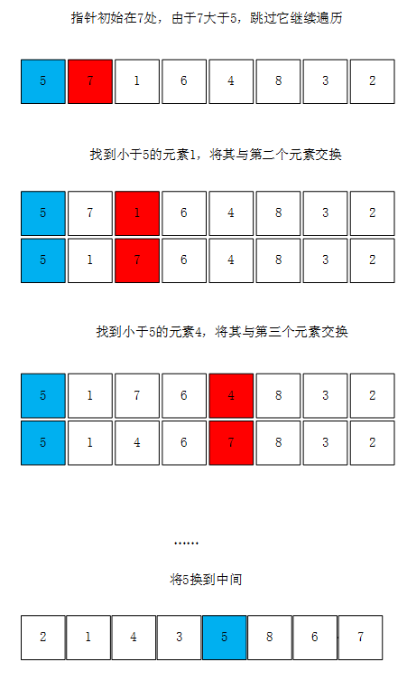
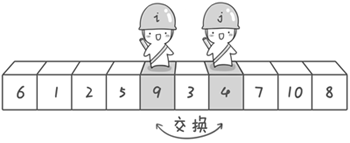
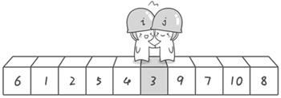

# 快速排序

* [返回上层目录](sort.md)
* [快排的大致思想](#快排的大致思想)
* [单指针遍历法](#单指针遍历法)
  * [单指针遍历法图解](#单指针遍历法图解)
  * [单指针遍历法代码](#单指针遍历法代码)
* [双指针遍历法](#双指针遍历法)
  * [双指针遍历法图解](#双指针遍历法图解)
  * [双指针遍历法代码](#双指针遍历法代码)


快速排序是一种高效且使用广泛的排序算法，在很多语言的标准库中自带的排序都是快速排序，所以我们也有必要了解快排的原理以及其实现方法。

# 快排的大致思想

快速排序实现的重点在于数组的拆分，通常我们将数组的第一个元素定义为比较元素，然后将数组中小于比较元素的数放到左边，将大于比较元素的放到右边，

这样我们就将数组拆分成了左右两部分：小于比较元素的数组；大于比较元素的数组。我们再对这两个数组进行同样的拆分，直到拆分到不能再拆分，数组就自然而然地以升序排列了。


不难看出，拆分算法是整个快速排序中的核心，快速排序拥有非常多的拆分方式，在本篇文章中我们介绍其中的两种，我个人将它称作：单指针遍历法与双指针遍历法（在下文中用英文单词split和partition称呼）。

快速排序之所比较快，因为相比冒泡排序，每次交换是跳跃式的。每次排序的时候设置一个基准点，将小于等于基准点的数全部放到基准点的左边，将大于等于基准点的数全部放到基准点的右边。这样在每次交换的时候就不会像冒泡排序一样每次只能在相邻的数之间进行交换，交换的距离就大的多了。因此总的比较和交换次数就少了，速度自然就提高了。当然在最坏的情况下，仍可能是相邻的两个数进行了交换。因此快速排序的最差时间复杂度和冒泡排序是一样的都是O(N2)，它的平均时间复杂度为O(NlogN)。

# 单指针遍历法

## 单指针遍历法图解

单指针遍历法使用一个单向的指针来对数组进行遍历，首先将数组首元素设置为比较元素，然后将第二个开始的元素依次与比较元素比较，如果大于比较元素则跳过，如果小于比较元素，则将其与前面较大的元素进行交换，将数组中所有元素交换完毕后，再将比较元素放到中间位置。



## 单指针遍历法代码

```c
#include<stdio.h>

void swap(int &a, int &b)
{
	int t = a;
	a = b;
	b = t;
}

//划分数组的函数
int split(int a[], int low, int high)
{
	int i = low;    //i指向比较元素的期望位置
	int x = a[i];    //将该数组第一个元素设置为比较元素
	//从数组的第二个元素起开始遍历，若找到的元素大于比较元素，则跳过
	for(int j = low+1;j<=high;j++)
		//若找到了小于比较元素的数，则将其与前面较大的数进行交换
		if (a[j] <= x)
		{
			i++;
			if(i != j) {
				swap(a[i], a[j]);
			}
		}
	swap(a[low], a[i]);    //将比较元素交换到期望位置
	return i;
}

//快速排序
void quicksort(int a[], int low, int high)
{
	if (low < high)
	{
		int i = split(a, low, high);    //划分数组并获得比较元素位置
		quicksort(a, low, i - 1);    //对比较元素左边进行排序
		quicksort(a, i + 1, high);    //对比较元素右边进行排序
	}
}

int main()
{
	int a[] = { 5,7,1,6,4,8,3,2 };
	int length = sizeof(a) / sizeof(a[0]);
	quicksort(a, 0, length - 1);
	for (int i = 0; i < length; i++)
		printf("%d ", a[i]);
	printf("\n");
	return 0;
}
```

# 双指针遍历法

## 双指针遍历法图解

假设我们现在对`6 1 2 7 9 3 4 5 10 8`这个10个数进行排序。首先在这个序列中随便找一个数作为基准数（不要被这个名词吓到了，就是一个用来参照的数，待会你就知道它用来做啥的了）。为了方便，就让第一个数6作为基准数吧。接下来，需要将这个序列中所有比基准数大的数放在6的右边，比基准数小的数放在6的左边，类似下面这种排列：

`3 1 2 5 4 6 9 7 10 8`

在初始状态下，数字6在序列的第1位。我们的目标是将6挪到序列中间的某个位置，假设这个位置是k。现在就需要寻找这个k，并且以第k位为分界点，左边的数都小于等于6，右边的数都大于等于6。想一想，你有办法可以做到这点吗？

给你一个提示吧。请回忆一下冒泡排序，是如何通过“交换”，一步步让每个数归位的。此时你也可以通过“交换”的方法来达到目的。具体是如何一步步交换呢？怎样交换才既方便又节省时间呢？先别急着往下看，拿出笔来，在纸上画画看。我高中时第一次学习冒泡排序算法的时候，就觉得冒泡排序很浪费时间，每次都只能对相邻的两个数进行比较，这显然太不合理了。于是我就想了一个办法，后来才知道原来这就是“快速排序”，请允许我小小的自恋一下(^o^)。

方法其实很简单：分别从初始序列`6  1  2  7  9  3  4  5 10  8`两端开始“探测”。先从右往左找一个小于6的数，再从左往右找一个大于6的数，然后交换他们。这里可以用两个变量i和j，分别指向序列最左边和最右边。我们为这两个变量起个好听的名字“哨兵i”和“哨兵j”。刚开始的时候让哨兵i指向序列的最左边（即i=1），指向数字6。让哨兵j指向序列的最右边（即j=10），指向数字8


首先哨兵j开始出动。因为此处设置的基准数是最左边的数，所以需要让哨兵j先出动，这一点非常重要（请自己想一想为什么，**其实每次都让j开始移动保证了最后相遇的位置一定是比基准要小的，这样和基准再交换的话就符合一边比基准大，一边比基准小的要求了，例如序列7，2，8，9 。以7作为比较元素。如果i先动的话，ij均指向8，最后结果为8279，如果j先动的话，ij均指向2，最后结果为2789**）。哨兵j一步一步地向左挪动（即j–），直到找到一个小于6的数停下来。接下来哨兵i再一步一步向右挪动（即i++），直到找到一个数大于6的数停下来。最后哨兵j停在了数字5面前，哨兵i停在了数字7面前。


现在交换哨兵i和哨兵j所指向的元素的值。交换之后的序列如下。

```
6  1  2  5  9  3  4  7  10  8
```



到此，第一次交换结束。接下来开始哨兵j继续向左挪动（再友情提醒，每次必须是哨兵j先出发）。他发现了4（比基准数6要小，满足要求）之后停了下来。哨兵i也继续向右挪动的，他发现了9（比基准数6要大，满足要求）之后停了下来。此时再次进行交换，交换之后的序列如下。

```
6  1  2  5  4  3  9  7  10  8
```

第二次交换结束，“探测”继续。哨兵j继续向左挪动，他发现了3（比基准数6要小，满足要求）之后又停了下来。哨兵i继续向右移动，糟啦！此时哨兵i和哨兵j相遇了，哨兵i和哨兵j都走到3面前。说明此时“探测”结束。我们将基准数6和3进行交换。交换之后的序列如下。

```
3  1  2  5  4  6  9  7  10  8
```



到此第一轮“探测”真正结束。此时以基准数6为分界点，6左边的数都小于等于6，6右边的数都大于等于6。回顾一下刚才的过程，其实哨兵j的使命就是要找小于基准数的数，而哨兵i的使命就是要找大于基准数的数，直到i和j碰头为止。

OK，解释完毕。现在基准数6已经归位，它正好处在序列的第6位。此时我们已经将原来的序列，以6为分界点拆分成了两个序列，左边的序列是“3  1 2  5  4”，右边的序列是“9  7  10  8”。接下来还需要分别处理这两个序列。因为6左边和右边的序列目前都还是很混乱的。不过不要紧，我们已经掌握了方法，接下来只要模拟刚才的方法分别处理6左边和右边的序列即可。现在先来处理6左边的序列现吧。

左边的序列是`3  1  2  5  4`。请将这个序列以3为基准数进行调整，使得3左边的数都小于等于3，3右边的数都大于等于3。好了开始动笔吧。

如果你模拟的没有错，调整完毕之后的序列的顺序应该是。

```
2  1  3  5  4
```

OK，现在3已经归位。接下来需要处理3左边的序列“2 1”和右边的序列“5 4”。对序列“2 1”以2为基准数进行调整，处理完毕之后的序列为“1 2”，到此2已经归位。序列“1”只有一个数，也不需要进行任何处理。至此我们对序列“2 1”已全部处理完毕，得到序列是“1 2”。序列“5 4”的处理也仿照此方法，最后得到的序列如下。

```
1  2  3  4  5  6  9  7  10  8
```

对于序列`9  7  10  8`也模拟刚才的过程，直到不可拆分出新的子序列为止。最终将会得到这样的序列，如下。

```
1  2  3  4  5  6  7  8  9  10
```

到此，排序完全结束。细心的同学可能已经发现，快速排序的每一轮处理其实就是将这一轮的基准数归位，直到所有的数都归位为止，排序就结束了。下面上个霸气的图来描述下整个算法的处理过程。


## 双指针遍历法代码

```c
#include<stdio.h>

//交换函数
void swap(int &a, int &b)
{
    int t = a;
    a = b;
    b = t;
}

int partition(int a[], int low, int high)
{
    int x = a[low];    //将该数组第一个元素设置为比较元素
    int i = low;    //指向数组头的指针
    int j = high;    //指向数组尾的指针
    while (i < j)
    {
        while (i < j && a[j] >= x)
            j--;    //从右至左找到第一个小于比较元素的数
        while (i < j && a[i] <= x)
            i++;    //从左至右找到第一个大于比较元素的数
        /*需要注意的是，这里的j--与i++的顺序不可以调换！
          如果调换了顺序，i会走过头，以至于将后面较大的元素交换到数组开头*/

        //将大数与小数交换
        if (i != j)
            swap(a[i], a[j]);
    }
    swap(a[low], a[i]);    //将比较元素交换到期望位置
    return i;    //返回比较元素的位置
}

void quicksort(int a[], int low, int high)
{
    if (low < high)
    {
        int i = partition(a, low, high);    //划分数组并获取比较元素的位置
        quicksort(a, low, i - 1);    //对比较元素左边进行排序
        quicksort(a, i + 1, high);    //对比较元素右边进行排序
    }
}

int main()
{
    int a[] = { 5,7,1,6,4,8,3,2 };
    int length = sizeof(a) / sizeof(a[0]);
    quicksort(a, 0, length - 1);
    for (int i = 0; i < length; i++)
        printf("%d ", a[i]);
    printf("\n");
    return 0;
}
```


# 参考资料

* [算法设计：两种快速排序代码实现](https://www.cnblogs.com/sunriseblogs/p/10009890.html)
* [快速排序（过程图解 参考啊哈算法）](https://blog.csdn.net/starlet_kiss/article/details/86010904)

本文参考此博客。

