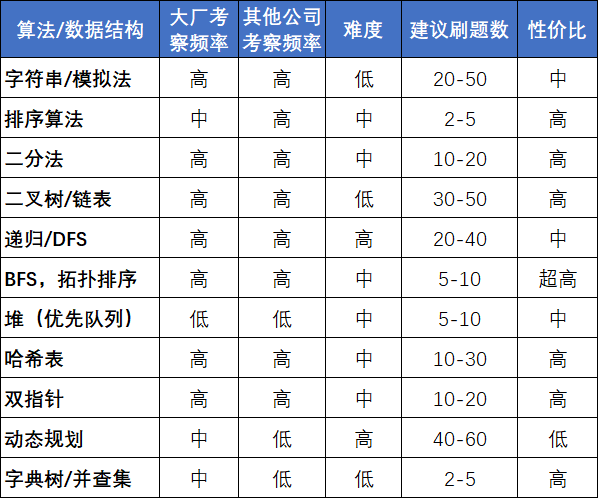
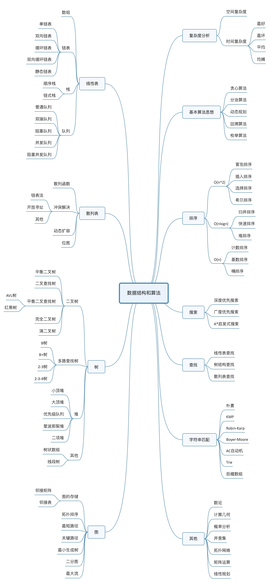

# 数据结构与算法概述

* [返回上层目录](../data-structures-and-algorithms.md)

# 题目类型分类

# 数据结构算法的组成

## 算法

1. 排序算法：快速排序、归并排序、计数排序
2. 搜索算法：回溯、递归、剪枝技巧
3. 图论：最短路、最小生成树、网络流建模
4. 动态规划：背包问题、最长子序列、计数问题
5. 基础技巧：分治、倍增、二分、贪心

## 数据结构

1. 数组与链表：单 / 双向链表、跳舞链
2. 栈与队列
3. 树与图：最近公共祖先、并查集
4. 哈希表
5. 堆：大 / 小根堆、可并堆
6. 字符串：字典树、后缀树

# 参考资料

