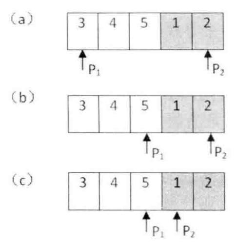
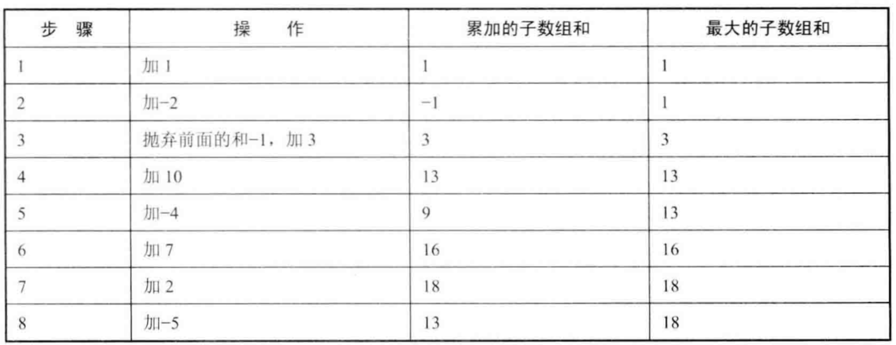
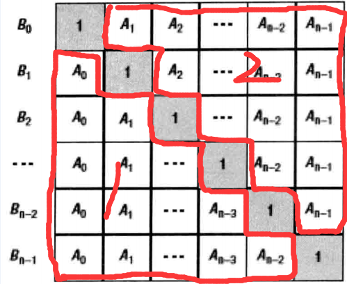

# 数组

* [返回上层目录](../jianzhi-offer.md)
* [剑指Offer4：二维数组中的查找](#剑指Offer4：二维数组中的查找)
* [剑指Offer11：旋转数组的最小数字](#剑指Offer11：旋转数组的最小数字)
* [剑指Offer21：调整数组顺序使奇数位于偶数前面](#剑指Offer21：调整数组顺序使奇数位于偶数前面)
* [剑指Offer39：数组中出现次数超过一半的数字](#剑指Offer39：数组中出现次数超过一半的数字)
* [剑指Offer42：数组中出现次数超过一半的数字](#剑指Offer42：数组中出现次数超过一半的数字)
* [剑指Offer45：把数组排成最小的数](#剑指Offer45：把数组排成最小的数)
* [剑指Offer51：数组中的逆序对](#剑指Offer51：数组中的逆序对)
* [剑指Offer56x：数字在排序数组中出现的次数](#剑指Offer56x：数字在排序数组中出现的次数)
* [剑指Offer56：数组中只出现一次的两个数字](#剑指Offer56：数组中只出现一次的两个数字)
* [剑指Offer57：数组中重复的数字](#剑指Offer57：数组中重复的数字)
* [剑指Offer66：构建乘积数组](#剑指Offer66：构建乘积数组)


# 剑指Offer4：二维数组中的查找

> 题目：在一个二维数组中，每一行都按照从左到右递增的顺序排序，每一列都按照从上到下递增的顺序排序。请完成一个函数，输入这样的一个二维数组和一个整数，判断数组中是否含有该整数。

如果在一个二维数组中找到数字7，则返回true，如果没有找到，则返回false。


查找过程如下：


c++:

```c++
class Solution {
public:
    bool Find(int target, vector<vector<int> > array) {
        int rows = array.size();
        int cols = array[0].size();
        if(!array.empty() && rows > 0 && cols > 0){
            int row = 0;
            int col = cols - 1;
            while(row < rows && col >= 0){
                if(array[row][col] == target){
                    return true;
                }
                else if(array[row][col] > target){
                    --col;
                }
                else{
                    ++row;
                }
            }
        }
        return false;
    }
};
```

[详情](https://cuijiahua.com/blog/2017/11/basis_1.html)，[练习](https://www.nowcoder.com/practice/abc3fe2ce8e146608e868a70efebf62e?tpId=13&tqId=11154&tPage=1&rp=1&ru=/ta/coding-interviews&qru=/ta/coding-interviews/question-ranking)。


# 剑指Offer11：旋转数组的最小数字

> 题目：把一个数组最开始的若干个元素搬到数组的末尾，我们称之为数组的旋转。 输入一个非递减排序的数组的一个旋转，输出旋转数组的最小元素。 例如数组{3,4,5,1,2}为{1,2,3,4,5}的一个旋转，该数组的最小值为1。

我们注意到旋转之后的数组实际上可以划分为两个排序的字数组，而且前面的字数组的元素大于或者等于后面字数组的元素。我们还注意到最小的元素刚好是这两个字数组的分界线。在排序的数组中可以用二分查找实现O(logn)的查找。本题给出的数组在一定程度上是排序的，因此我们可以试着用二分查找法的思路来寻找这个最小的元素。

- 和二分查找法一样，我们用两个指针分别指向数组的第一个元素和最后一个元素。按照题目中旋转的规则，第一个元素应该是大于或者等于最后一个元素的（这其实并不完全对，还有特例，后面再加以讨论）。
- 接着我们可以找到数组中间的元素。如果中间元素位于前面的递增子数组，那么它应该大于或者等于第一个指针指向的元素。此时最小元素应该位于该中间元素之后，然后我们把第一个指针指向该中间元素，移动之后第一个指针仍然位于前面的递增子数组中。
- 同样，如果中间元素位于后面的递增子数组，那么它应该小于或者等于第二个指针指向的元素。此时最小元素应该位于该中间元素之前，然后我们把第二个指针指向该中间元素，移动之后第二个指针仍然位于后面的递增子数组中。
- 第一个指针总是指向前面递增数组的元素，第二个指针总是指向后面递增数组的元素。最终它们会指向两个相邻的元素，而第二个指针指向的刚好是最小的元素，这就是循环结束的条件。

示意图如下：



特殊情况：

- 如果把排序数组的0个元素搬到最后面，这仍然是旋转数组，我们的代码需要支持这种情况。如果发现数组中的第一个数字小于最后一个数字，就可以直接返回第一个数字了。
- 下面这种情况，即第一个指针指向的数字、第二个指针指向的数字和中间的数字三者相等，我们无法判断中间的数字1是属于前面的递增子数组还是后面的递增子数组。正样的话，我们只能进行顺序查找。


c++:

```c++
class Solution {
public:
    int minNumberInRotateArray(vector<int> rotateArray) {
        int size = rotateArray.size();						//数组长度
        if(size == 0){
            return 0;
        }
        int left = 0;										//左指针
        int right = size - 1;								//右指针
        int mid = 0;										//中间指针
        while(rotateArray[left] >= rotateArray[right]){		//确保旋转
            if(right - left == 1){							//左右指针相邻
                mid = right;
                break;
            }
            mid = left + (right - left) / 2;				//计算中间指针位置
            //特殊情况：如果无法确定中间元素是属于前面还是后面的递增子数组，只能顺序查找
            if(rotateArray[left] == rotateArray[right] && rotateArray[mid] == rotateArray[left]){
                return MinInOrder(rotateArray, left, right);
            }
            //中间元素位于前面的递增子数组，此时最小元素位于中间元素的后面
            if(rotateArray[mid] >= rotateArray[left]){
                left = mid;
            }
            //中间元素位于后面的递增子数组，此时最小元素位于中间元素的前面
            else{
                right = mid;
            }
        }
        return rotateArray[mid];
    }
private:
    //顺序寻找最小值
    int MinInOrder(vector<int> &num, int left, int right){
        int result = num[left];
        for(int i = left + 1; i < right; i++){
            if(num[i] < result){
                result = num[i];
            }
        }
        return result;
    }
};
```

[详情](https://cuijiahua.com/blog/2017/11/basis_6.html)，[练习](https://www.nowcoder.com/practice/9f3231a991af4f55b95579b44b7a01ba?tpId=13&tqId=11159&tPage=1&rp=1&ru=/ta/coding-interviews&qru=/ta/coding-interviews/question-ranking)。

这是我写的一个递归版：

```c++
class Solution {
public:
	int minNumberInRotateArray(vector<int> rotateArray) {
        if(rotateArray.size() == 0) return 0;
		return Core(rotateArray, 0, int(rotateArray.size() -1));
	}

	int Core(vector<int>& rotateArray, int begin, int end) {
		if(begin + 1 >= end) return rotateArray[end];

		int mid = (end + begin) / 2;
		if(rotateArray[begin] == rotateArray[mid] && rotateArray[mid] == rotateArray[end]) {
			return MinInOrder(rotateArray, begin, end);
		} else if(rotateArray[mid] >= rotateArray[begin]) {
			begin = mid;
		} else {
			end = mid;
		}

		return Core(rotateArray, begin, end);
	}

	int MinInOrder(vector<int> &rotateArray, int left, int right){
		for(int i = left + 1; i < right; i++){
			if(rotateArray[i] < rotateArray[left]){
				return rotateArray[i];
			}
		}
		return rotateArray[left];
	}
};
```


# 剑指Offer21：调整数组顺序使奇数位于偶数前面

> 题目：输入一个整数数组，实现一个函数来调整该数组中数字的顺序，使得所有的奇数位于数组的前半部分，所有的偶数位于位于数组的后半部分，并保证奇数和奇数，偶数和偶数之间的相对位置不变。

创建双向队列，遍历数组，奇数前插入，偶数后插入。最后使用assign方法实现不同容器但相容的类型赋值。

重点：掌握双向队列deque的用法。

c++:

```c++
class Solution {
public:
    void reOrderArray(vector<int> &array) {
        deque<int> result;
        int num = array.size();
        for(int i = 0; i < num; i++){
            if(array[num - i - 1] % 2 == 1){
                result.push_front(array[num - i - 1]);
            }
            if(array[i] % 2 == 0){
                result.push_back(array[i]);
            }
        }
        array.assign(result.begin(),result.end());
    }
};
```

[详情](https://cuijiahua.com/blog/2017/11/basis_13.html)，[练习](https://www.nowcoder.com/practice/beb5aa231adc45b2a5dcc5b62c93f593?tpId=13&tqId=11166&tPage=1&rp=1&ru=/ta/coding-interviews&qru=/ta/coding-interviews/question-ranking)。


# 剑指Offer39：数组中出现次数超过一半的数字

> 题目：数中有一个数字出现的次数超过数组长度的一半，请找出这个数字。例如输入一个长度为9的数组{1,2,3,2,2,2,5,4,2}。由于数字2在数组中出现了5次，超过数组长度的一半，因此输出2。如果不存在则输出0。

数组中有一个数字出现的次数超过数组长度的一半，也就是说它出现的次数比其他所有数字出现次数的和还要多。因此我们可以考虑在遍历数组的时候保存两个值：一个是数组的一个数字，一个是次数。当我们遍历到下一个数字的时候，如果下一个数字和我们之前保存的数字相同，则次数加1；如果下一个数字和我们之前保存的数字不同，则次数减1。如果次数为零，我们需要保存下一个数字，并把次数设为1。由于我们要找的数字出现的次数比其他所有数字出现的次数之和还要多，那么要找的数字肯定是最后一次把次数设为1时对应的数字。

c++:

```c++
class Solution {
public:
    int MoreThanHalfNum_Solution(vector<int> numbers) {
        if(numbers.empty()){
            return 0;
        }
        // 遍历每个元素，并记录次数；若与前一个元素相同，则次数加1，否则次数减1
        int result = numbers[0];
        int times = 1;
        for(int i = 1; i < numbers.size(); ++i){
            if(times == 0){
                // 更新result的值为当前元素，并置次数为1
                result = numbers[i];
                times = 1;
            }
            else if(numbers[i] == result){
                times++;
            }
            else{
                times--;
            }
        }
        // 判断result是否符合条件，即出现次数大于数组长度的一半
        times = 0;
        for(int i = 0; i < numbers.size(); ++i)
        {
            if(numbers[i] == result){
                times++;
            }
        }
        return (times > (numbers.size() >> 1)) ? result : 0;
    }
};
```

[详情](https://cuijiahua.com/blog/2017/12/basis_28.html)，[练习](https://www.nowcoder.com/practice/e8a1b01a2df14cb2b228b30ee6a92163?tpId=13&tqId=11181&tPage=1&rp=1&ru=/ta/coding-interviews&qru=/ta/coding-interviews/question-ranking)。

我写的一个更简单的，主要是用了map的思想：

```c++
class Solution {
public:
    int MoreThanHalfNum_Solution(vector<int> numbers) {
        int size = numbers.size();
        if(size == 0) return 0;
        
        int val[10] = {0};
        for(int i = 0; i < size; i++) {
            val[numbers[i]]++;
        }
        
        for(int i = 0; i < 10; i++) {
            if(val[i] > size / 2) {
                return i;
            }
        }
        return 0;
    }
};
```


# 剑指Offer42：连续子数组的最大和

> 题目：HZ偶尔会拿些专业问题来忽悠那些非计算机专业的同学。今天测试组开完会后,他又发话了:在古老的一维模式识别中,常常需要计算连续子向量的最大和,当向量全为正数的时候,问题很好解决。但是,如果向量中包含负数,是否应该包含某个负数,并期望旁边的正数会弥补它呢？例如:{6,-3,-2,7,-15,1,2,2},连续子向量的最大和为8(从第0个开始,到第3个为止)。你会不会被他忽悠住？(子向量的长度至少是1)

**解法一：**

数组分析：下图是我们计算数组（1，-2，3，10，-4，7，2，-5）中子数组的最大和的过程。通过分析我们发现，累加的子数组和，如果大于零，那么我们继续累加就行；否则，则需要剔除原来的累加和重新开始。

过程如下：



c++:

```c++
class Solution {
public:
    int FindGreatestSumOfSubArray(vector<int> array) {
        if(array.empty()){
            return 0;
        }
        // 初始化变量，maxSum为最大和，curSum为当前和
        int maxSum = array[0];
        int curSum = array[0];
        // 遍历所有元素
        for(int i = 1; i < array.size(); i++){
            // 如果当前和小于等于0，说明之前的是负数，则抛弃前面的和，重新计算
            if(curSum <= 0){
                curSum = array[i];
            }
            // 如果没有问题，直接累加
            else{
                curSum += array[i];
            }
            // 更新最大和
            if(curSum > maxSum){
                maxSum = curSum;
            }
        }
        return maxSum;
    }
};
```

[详情](https://cuijiahua.com/blog/2017/12/basis_30.html)，[练习](https://www.nowcoder.com/practice/459bd355da1549fa8a49e350bf3df484?tpId=13&tqId=11183&tPage=1&rp=1&ru=/ta/coding-interviews&qru=/ta/coding-interviews/question-ranking)。

**解法二：应用动态规划法**

如果算法的功底足够扎实，那么我们还可以用动态规划的思想来分析这个问题。如果用函数$f(i)$来表示以第$i$个数字结尾的子数组的最大和，那么我们需要求出$max[f(i)]$，其中$0\le i\le n$。我们可用如下的递归公式求$f(i)$：
$$
\begin{aligned}
f(i)=\left\{\begin{matrix}
&pData[i]\ &i=0\ \text{or}\ f(i-1) \le 0\\ 
&f(i-1)\ +\ pData[i]\ &i\neq 0\ \text{and}\ f(i-1)>0
\end{matrix}\right.
\end{aligned}
$$
这个公式的意义：当以第i-1个数字结尾的子数组中所有数字的和小于0时，如果把这个负数与第i个数累加，则得到的结果比第i个数字本身还要小，所以这种情况下以第i个数字结尾的子数组就是第i个数字本身（如上图中的第3步）。如果以第i个数字数字结尾的子数组中所有数字的和大于0，则与第i个数字累加就得到以第i个数字结尾的子数组中所有数字的和。

虽然通常我们用递归的方式分析动态规划的问题，但最终都会基于循环去编码。上述公式对应的代码和前面给出的代码一致。递归公式中的$f(i)$对应的变量是`nCurSum`，而`max[f(i)]`就是`nGreatestSum`。因此，可以说这两种思路是异曲同工的。


# 剑指Offer45：把数组排成最小的数

> 题目：输入一个正整数数组，把数组里所有数字拼接起来排成一个数，打印能拼接出的所有数字中最小的一个。例如输入数组{3，32，321}，则打印出这三个数字能排成的最小数字为321323。

遇到这个题，全排列当然可以做，但是时间复杂度为O(n!)。在这里我们自己定义一个规则，对拼接后的字符串进行比较。

排序规则如下：

- 若ab > ba 则 a 大于 b，
- 若ab < ba 则 a 小于 b，
- 若ab = ba 则 a 等于 b；

根据上述规则，我们需要先将数字转换成字符串再进行比较，因为需要串起来进行比较。比较完之后，按顺序输出即可。

c++:

```c++
class Solution {
public:
    string PrintMinNumber(vector<int> numbers) {
        int length = numbers.size();
        if(length == 0){
            return "";
        }
        sort(numbers.begin(), numbers.end(), cmp);
        string res;
        for(int i = 0; i <　length; i++){
            res += to_string(numbers[i]);
        }
        return res;
    }
private:
    // 升序排序
    static bool cmp(int a, int b){
        string A = to_string(a) + to_string(b);
        string B = to_string(b) + to_string(a);
        return A < B;
    }
};
```

[详情](https://cuijiahua.com/blog/2018/01/basis_32.html)，[练习](https://www.nowcoder.com/practice/8fecd3f8ba334add803bf2a06af1b993?tpId=13&tqId=11185&tPage=1&rp=1&ru=/ta/coding-interviews&qru=/ta/coding-interviews/question-ranking)。


# 剑指Offer51：数组中的逆序对

> 题目：在数组中的两个数字，如果前面一个数字大于后面的数字，则这两个数字组成一个逆序对。输入一个数组,求出这个数组中的逆序对的总数P。并将P对1000000007取模的结果输出。 即输出P%1000000007。如数组{7,5,6,4}，逆序对总共有5对，{7,5}，{7,6}，{7,4}，{5,4}，{6,4}；

思路1：暴力解法，顺序扫描整个数组，每扫描到一个数字的时候，逐个比较该数字和它后面的数字的大小。如果后面的数字比它小，则这两个数字就组成一个逆序对。假设数组中含有n个数字，由于每个数字都要和O(n)个数字作比较，因此这个算法的时间复杂度是O(n^2)。

思路2：分治思想，采用归并排序的思路来处理，如下图，先分后治：


先把数组分解成两个长度为2的子数组，再把这两个子数组分解成两个长度为1的子数组。接下来一边合并相邻的子数组，一边统计逆序对的数目。在第一对长度为1的子数组{7}、{5}中7>5，因此（7,5）组成一个逆序对。同样在第二对长度为1的子数组{6}，{4}中也有逆序对（6,4），由于已经统计了这两对子数组内部的逆序对，因此需要把这两对子数组进行排序，避免在之后的统计过程中重复统计。


**逆序对的总数** = 左边数组中的逆序对的数量 + 右边数组中逆序对的数量 + 左右结合成新的顺序数组时中出现的逆序对的数量

总结一下：

这是一个归并排序的合并过程，主要是考虑合并两个有序序列时，计算逆序对数。

对于两个升序序列，设置两个下标：两个有序序列的末尾。每次比较两个末尾值，如果前末尾大于后末尾值，则有”后序列当前长度“个逆序对；否则不构成逆序对。然后把较大值拷贝到辅助数组的末尾，即最终要将两个有序序列合并到辅助数组并有序。

这样，每次在合并前，先递归地处理左半段、右半段，则左、右半段有序，且左右半段的逆序对数可得到，再计算左右半段合并时逆序对的个数。

c++:

```c++
class Solution {
public:
    int InversePairs(vector<int> data) {
        if(data.size() == 0){
            return 0;
        }
        // 排序的辅助数组
        vector<int> copy;
        for(int i = 0; i < data.size(); ++i){
            copy.push_back(data[i]);
        }
        return InversePairsCore(data, copy, 0, data.size() - 1) % 1000000007;
    }
    long InversePairsCore(vector<int> &data, vector<int> &copy, int begin, int end){
        // 如果指向相同位置，则没有逆序对。
        if(begin == end){
            return 0;
        }
        // 求中点
        int mid = (end + begin) >> 1;
        // 使data左半段有序，并返回左半段逆序对的数目
        long leftCount = InversePairsCore(data, copy, begin, mid) % 1000000007;
        // 使data右半段有序，并返回右半段逆序对的数目
        long rightCount = InversePairsCore(data, copy, mid + 1, end) % 1000000007;
        
        int i = mid; // i初始化为前半段最后一个数字的下标
        int j = end; // j初始化为后半段最后一个数字的下标
        int indexcopy = end; // 辅助数组复制的数组的最后一个数字的下标
        long count = 0; // 计数，逆序对的个数，注意类型
        
        // 让copy有序
        while(i >= begin && j >= mid + 1){
            if(data[i] > data[j]){
                copy[indexcopy--] = data[i--];
                count += j - mid;
            }
            else{
                copy[indexcopy--] = data[j--];
            }
        }
        for(;i >= begin; --i){
            copy[indexcopy--] = data[i];
        }
        for(;j >= mid + 1; --j){
            copy[indexcopy--] = data[j];
        }
        for(int k = begin; k <= end; ++k) {
            data[k] = copy[k];
        }
        return (leftCount + rightCount + count) % 1000000007;
    }
};

```

[详情](https://cuijiahua.com/blog/2018/01/basis_35.html)，[练习](https://www.nowcoder.com/practice/96bd6684e04a44eb80e6a68efc0ec6c5?tpId=13&tqId=11188&tPage=1&rp=1&ru=/ta/coding-interviews&qru=/ta/coding-interviews/question-ranking)。


# 剑指Offer56x：数字在排序数组中出现的次数

> 题目：统计一个数字在排序数组中出现的次数。如(1,2,2,3,3,3,4)这个排序数组中，3出现的次数为3。

既然是已经排序好的数组，那么第一个想到的就是二分查找法。

做法就是使用二分法找到数字在数组中出现的第一个位置，再利用二分法找到数字在数组中出现的第二个位置。时间复杂度为O(logn + logn)，最终的时间复杂度为O(logn)。

举个例子，找到数字k在数组data中出现的次数。

数组data中，数字k出现的第一个位置：

我们对数组data进行二分，如果数组中间的数字小于k，说明k应该出现在中间位置的右边；如果数组中间的数字大于k，说明k应该出现在中间位置的左边；如果数组中间的数字等于k，并且中间位置的前一个数字不等于k，说明这个中间数字就是数字k出现的第一个位置。

同理，数字k出现的最后一个位置，也是这样找的。但是判断稍有不同。我们使用两个函数分别获得他们。

c++:

```c++
class Solution {
public:
    int GetNumberOfK(vector<int> data ,int k) {
        int length = data.size();
        if(length == 0){
            return 0;
        }
        int first = GetFirstK(data, k, 0, length - 1);
        int last = GetLastK(data, k, 0, length - 1);
        if(first != -1 && last != -1){
            return last - first + 1;
        }
        return 0;
    }
private:
    // 迭代实现找到第一个K
    int GetFirstK(vector<int> data, int k, int begin, int end){
        if(begin > end){
            return -1;
        }
        int middleIndex = (begin + end) >> 1;
        int middleData = data[middleIndex];
        
        if(middleData == k){
            if((middleIndex > 0 && data[middleIndex - 1] != k) || middleIndex == 0){
                return middleIndex;
            }
            else{
                end = middleIndex - 1;
            }
        }
        else if (middleData > k){
            end = middleIndex - 1;
        }
        else{
            begin = middleIndex + 1;
        }
        return GetFirstK(data, k, begin, end);
    }
    // 循环实现找到最后一个K
    int GetLastK(vector<int> data, int k, int begin, int end){
        int length = data.size();
        int middleIndex = (begin + end) >> 1;
        int middleData = data[middleIndex];
        
        while(begin <= end){
            if(middleData == k){
                if((middleIndex < length - 1 && data[middleIndex + 1] != k) || middleIndex == length - 1){
                    return middleIndex;
                }
                else{
                    begin = middleIndex + 1;
                }
            }
            else if(middleData > k){
                end = middleIndex - 1;
            }
            else{
                begin = middleIndex + 1;
            }
            middleIndex = (begin + end) >> 1;
            middleData = data[middleIndex];
        }
        return -1;
    }
};
```

[详情](https://cuijiahua.com/blog/2018/01/basis_37.html)，[练习](https://www.nowcoder.com/practice/70610bf967994b22bb1c26f9ae901fa2?tpId=13&tqId=11190&tPage=1&rp=1&ru=/ta/coding-interviews&qru=/ta/coding-interviews/question-ranking)。


# 剑指Offer56：数组中只出现一次的两个数字

> 题目：一个整型数组里除了两个数字之外，其他的数字都出现了两次。请写程序找出这两个只出现一次的数字。要求时间复杂度是O(n)，空间复杂度是O(1)。

大家首先想到的是顺序扫描法，但是这种方法的时间复杂度是O（n^2）。接着大家又会考虑用哈希表的方法，但是空间复杂度不是O（1）。

应该怎么做才能即满足时间复杂度是O（n）又满足空间复杂度是O（1）的要求呢？

我们可以想一想“异或”运算的一个性质，我们直接举例说明。

举例：{2,4,3,6,3,2,5,5}

这个数组中只出现一次的两个数分别是4和6。怎么找到这个两个数字呢？

我们先不看找到俩个的情况，先看这样一个问题，如何在一个数组中找到一个只出现一次的数字呢？比如数组：{4,5,5}，唯一一个只出现一次的数字是4。

我们知道异或的一个性质是：**任何一个数字异或它自己都等于0**。也就是说，如果我们从头到尾依次异或数组中的每一个数字，那么最终的结果刚好是那个只出现一次的数字。比如数组{4,5,5}，我们先用数组中的第一个元素4（二进制形式：0100）和数组中的第二个元素5（二进制形式：0101）进行异或操作，0100和0101异或得到0001，用这个得到的元素与数组中的三个元素5（二进制形式：0101）进行异或操作，0001和0101异或得到0100，正好是结果数字4。这是因为数组中相同的元素异或是为0的，**因此就只剩下那个不成对的孤苦伶仃元素。**

现在好了，我们已经知道了如何找到一个数组中找到一个只出现一次的数字，那么我们如何在一个数组中找到两个只出现一次的数字呢？如果，我们可以将原始数组分成两个子数组，使得每个子数组包含一个只出现一次的数字，而其他数字都成对出现。这样，我们就可以用上述方法找到那个**孤苦伶仃的元素。**

我们还是从头到尾一次异或数组中的每一个数字，那么最终得到的结果就是两个只出现一次的数组的异或结果。**因为其他数字都出现了两次，在异或中全部抵消了。**由于两个数字肯定不一样，那么异或的结果肯定不为0，也就是说这个结果数组的二进制表示至少有一个位为1。我们在结果数组中找到第一个为1的位的位置，记为第n位。现在我们以第n位是不是1为标准把元数组中的数字分成两个子数组，第一个子数组中每个数字的第n位都是1，而第二个子数组中每个数字的第n位都是0。

举例：{2,4,3,6,3,2,5,5}

我们依次对数组中的每个数字做异或运行之后，得到的结果用二进制表示是0010。异或得到结果中的倒数第二位是1，于是我们根据数字的倒数第二位是不是1分为两个子数组。第一个子数组{2,3,6,3,2}中所有数字的倒数第二位都是1，而第二个子数组{4,5,5}中所有数字的倒数第二位都是0。接下来只要分别两个子数组求异或，就能找到第一个子数组中只出现一次的数字是6，而第二个子数组中只出现一次的数字是4。

c++:

```c++
class Solution {
public:
    void FindNumsAppearOnce(vector<int> data,int* num1,int *num2) {
        int length = data.size();
        if(length < 2){
            return;
        }
        
        // 对原始数组每个元素求异或
        int resultExclusiveOR = 0;
        for(int i = 0; i < length; ++i){
            resultExclusiveOR ^= data[i];
        }
        
        unsigned int indexOf1 = FindFirstBitIs1(resultExclusiveOR);
        
        *num1 = *num2 = 0;
        for(int j = 0; j < length; j++){
            if(IsBit1(data[j], indexOf1)){
                *num1 ^= data[j];
            }
            else{
                *num2 ^= data[j];
            }
        }
    }
private:
    // 找到二进制数num第一个为1的位数，比如0010，第一个为1的位数是2。
    unsigned int FindFirstBitIs1(int num){
        unsigned int indexBit = 0;
        // 8 * sizeof(unsigned int) = 8 * 4 = 4个字节 = 32位
        while((num & 1) == 0 && (indexBit < 8 * sizeof(unsigned int))){
            num = num >> 1;
            indexBit++;
        }
        return indexBit;
    }
    // 判断第indexBit位是否为1
    bool IsBit1(int num, unsigned int indexBit){
        num = num >> indexBit;
        return (num & 1);
    }
};
```

[详情](https://cuijiahua.com/blog/2018/01/basis_40.html)，[练习](https://www.nowcoder.com/practice/e02fdb54d7524710a7d664d082bb7811?tpId=13&tqId=11193&tPage=1&rp=1&ru=/ta/coding-interviews&qru=/ta/coding-interviews/question-ranking)。


# 剑指Offer57：数组中重复的数字

> 题目：在一个长度为n的数组里的所有数字都在0到n-1的范围内。 数组中某些数字是重复的，但不知道有几个数字是重复的。也不知道每个数字重复几次。请找出数组中任意一个重复的数字。 例如，如果输入长度为7的数组{2,3,1,0,2,5,3}，那么对应的输出是第一个重复的数字2。

还可以把当前序列当成是一个下标和下标对应值是相同的数组（时间复杂度为O(n),空间复杂度为O(1)）； 遍历数组，判断当前位的值和下标是否相等：

- 若相等，则遍历下一位；
- 若不等，则将当前位置i上的元素和a[i]位置上的元素比较：若它们相等，则找到了第一个相同的元素；若不等，则将它们两交换。换完之后a[i]位置上的值和它的下标是对应的，但i位置上的元素和下标并不一定对应；重复2的操作，直到当前位置i的值也为i，将i向后移一位，再重复2。

本文采用思路3，如果还是不懂，看下面的实例分析就懂了！

**举例说明：**{2,3,1,0,2,5,3}

- 0(索引值)和2(索引值位置的元素)不相等，并且**2**(索引值位置的元素)和1(以该索引值位置的元素**2**为索引值的位置的元素)不相等，则交换位置，数组变为：{1,3,2,0,2,5,3}；
- 0(索引值)和1(索引值位置的元素)仍然不相等，并且**1**(索引值位置的元素)和3(以该索引值位置的元素**1**为索引值的位置的元素)不相等，则交换位置，数组变为：{3,1,2,0,2,5,3}；
- 0(索引值)和3(索引值位置的元素)仍然不相等，并且**3**(索引值位置的元素)和0(以该索引值位置的元素**3**为索引值的位置的元素)不相等，则交换位置，数组变为：{0,1,2,3,2,5,3}；
- 0(索引值)和0(索引值位置的元素)相等，遍历下一个元素；
- 1(索引值)和1(索引值位置的元素)相等，遍历下一个元素；
- 2(索引值)和2(索引值位置的元素)相等，遍历下一个元素；
- 3(索引值)和3(索引值位置的元素)相等，遍历下一个元素；
- 4(索引值)和2(索引值位置的元素)不相等，但是**2**(索引值位置的元素)和2(以该索引值位置的元素**2**为索引值的位置的元素)相等，则找到了第一个重复的元素。

c++:

```c++
class Solution {
public:
    bool duplicate(int numbers[], int length, int* duplication) {
        // 非法输入
        if(numbers == NULL || length <= 0){
            return false;
        }
        // 非法输入
        for(int i = 0; i < length; i++){
            if(numbers[i] < 0 || numbers[i] > length - 1){
                return false;
            }
        }
        // 遍历查找第一个重复的数
        for(int i = 0; i < length; i++){
            while(numbers[i] != i){
                if(numbers[i] == numbers[numbers[i]]){
                    *duplication = numbers[i];
                    return true;
                }
                swap(numbers[i], numbers[numbers[i]]);
            }
        }
        return false;
    }
};
```

[详情](https://cuijiahua.com/blog/2018/01/basis_50.html)，[练习](https://www.nowcoder.com/practice/623a5ac0ea5b4e5f95552655361ae0a8?tpId=13&tqId=11203&tPage=1&rp=1&ru=/ta/coding-interviews&qru=/ta/coding-interviews/question-ranking)。


# 剑指Offer66：构建乘积数组

> 题目：给定一个数组$A[0,1,...,n-1]$,请构建一个数组$B[0,1,...,n-1]$,其中$B$中的元素$B[i]=A[0]*A[1]*...*A[i-1]*A[i+1]*...*A[n-1]$。不能使用除法。

观察下公式，你会发现，$B[i]$公式中没有$A[i]$项，也就是说如果可以使用除法，就可以用公式$B[i]=A[0]*A[1]*.....*A[n-1]/A[i]$来计算$B[i]$，但是题目要求不能使用，因此我们只能另想办法。

现在要求不能使用除法，只能用其他方法。一个直观的解法是用连乘n-1个数字得到$B[i]$。显然这个方法需要O(n*n)的时间复杂度。

好在还有更高效的算法。可以把$B[i]=A[0]*A[1]*.....*A[i-1]*A[i+1]*...*A[n-1]$。看成$A[0]*A[1]*...*A[i-1]$和$A[i+1]*...*A[n-2]*A[n-1]$两部分的乘积。

即通过$A[i]$项将$B[i]$分为两部分的乘积。效果如下图所示：


不妨设定$C[i]=A[0]*A[1]*...*A[i-1]$，$D[i]=A[i+1]*...*A[n-2]*A[n-1]$。$C[i]$可以用自上而下的顺序计算出来，即$C[i]=C[i-1]*A[i-1]$。类似的，$D[i]$可以用自下而上的顺序计算出来，即$D[i]=D[i+1]*A[i+1]$。

如果还是不明白，没有关系，直接看下代码，细细体会下就懂了。



第一个for循环用来计算上图1范围的数，第二个for循环用来计算上图2范围的数。

c++:

```c++
class Solution {
public:
    vector<int> multiply(const vector<int>& A) {
        int length = A.size();
        vector<int> B(length);
        if(length <= 0){
            return B;
        }
        B[0] = 1;
        for(int i = 1; i < length; i++){
            B[i] = B[i - 1] * A[i - 1];
        }
        int temp = 1;
        for(int i = length - 2; i >= 0; i--){
            temp *= A[i + 1];
            B[i] *= temp;
        }
        return B;
    }
};
```

[详情](https://cuijiahua.com/blog/2018/01/basis_51.html)，[练习](https://www.nowcoder.com/practice/94a4d381a68b47b7a8bed86f2975db46?tpId=13&tqId=11204&tPage=1&rp=1&ru=/ta/coding-interviews&qru=/ta/coding-interviews/question-ranking)。


# 参考资料

* [剑指Offer系列刷题笔记汇总](https://cuijiahua.com/blog/2018/02/basis_67.html)

本文参考此博客。

