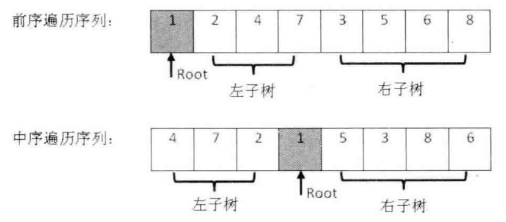
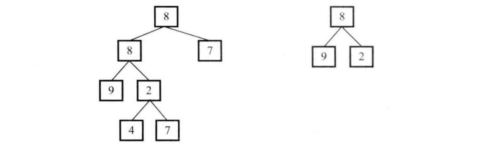
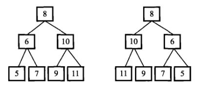
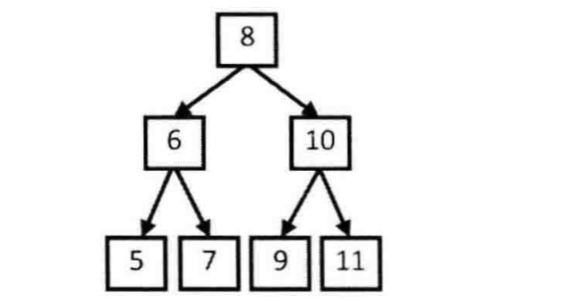
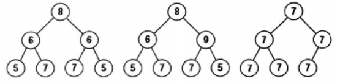
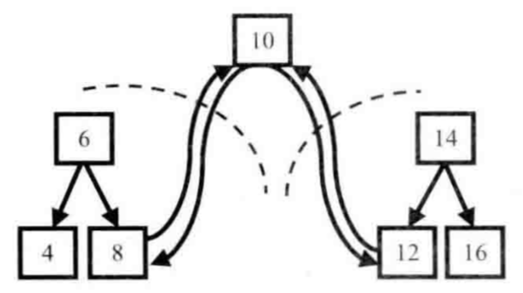

# 二叉树

* [返回上层目录](../jianzhi-offer.md)
* [二叉树](#二叉树)
* [剑指Offer7：重建二叉树](#剑指Offer7：重建二叉树)
* [剑指Offer26：树的子结构](#剑指Offer26：树的子结构)
* [剑指Offer27：二叉树的镜像](#剑指Offer27：二叉树的镜像)
* [剑指Offer32：从上到下打印二叉树](#剑指Offer32：从上到下打印二叉树)
* [剑指Offer34：二叉树中和为某一值的路径](#剑指Offer34：二叉树中和为某一值的路径)
* [剑指Offer55：二叉树的深度](#剑指Offer55：二叉树的深度)
* [剑指Offerx：是否平衡二叉树](#剑指Offerx：是否平衡二叉树)
* [剑指Offer8：二叉树的下一个结点](#剑指Offer8：二叉树的下一个结点)
* [剑指Offer28：对称的二叉树](#剑指Offer28：对称的二叉树)
* [剑指Offer32-2：分行从上到下打印二叉树](#剑指Offer32-2：分行从上到下打印二叉树)
* [剑指Offer32-3：之字形打印二叉树](#剑指Offer32-3：之字形打印二叉树)
* [剑指Offer37：序列化二叉树](#剑指Offer37：序列化二叉树)
* [二叉搜索树](#二叉搜索树)
* [剑指Offer33：二叉搜索树的后序遍历序列](#剑指Offer33：二叉搜索树的后序遍历序列)
* [剑指Offer36：二叉搜索树与双向链表](#剑指Offer36：二叉搜索树与双向链表)
* [剑指Offer54：二叉搜索树的第k个结点](#剑指Offer54：二叉搜索树的第k个结点)


# 剑指Offer7：重建二叉树

> 题目：输入某二叉树的前序遍历和中序遍历的结果，请重建出该二叉树。假设输入的前序遍历和中序遍历的结果中都不含重复的数字。例如输入前序遍历序列{1,2,4,7,3,5,6,8}和中序遍历序列{4,7,2,1,5,3,8,6}，则重建二叉树并返回。
>
> 
>
> 二叉树节点定义如下：
>
> ```c++
> struct TreeNode {
>   int val;
>   TreeNode *left;
>   TreeNode *right;
>   TreeNode(int x) : val(x), left(NULL), right(NULL) {}
> };
> ```

通常树有如下几种遍历方式：

- 前序遍历：先访问根结点，再访问左子结点，最后访问右子结点。
- 中序遍历：先访问左子结点，再访问根结点，最后访问右子结点。
- 后序遍历：先访问左子结点，再访问右子结点，最后访问根结点。

本题为前序遍历和中序遍历，最少需要两种遍历方式，才能重建二叉树。

前序遍历序列中，第一个数字总是树的根结点的值。在中序遍历序列中，根结点的值在序列的中间，左子树的结点的值位于根结点的值的左边，而右子树的结点的值位于根结点的值的右边。剩下的我们可以递归来实现，具体如图：



c++:

```c++
TreeNode* reConstructBinaryTree(vector<int> pre,vector<int> vin) {
    if(pre.size() == 0){  //如果为空，返回NULL
        return NULL;
    }
    //依次是前序遍历左子树，前序遍历右子树，中序遍历左子树，中序遍历右子树
    vector<int> left_pre, right_pre, left_vin, right_vin;

    //找到中序遍历的根节点
    int root = 0;
    //遍历找到中序遍历根节点索引值
    for(int i = 0; i < pre.size(); i++){
        if(pre[0] == vin[i]){
            root = i;
            break;
        }
    }
    //利用中序遍历的根节点，对二叉树节点进行归并
    for(int i = 0; i < root; i++){
        left_vin.push_back(vin[i]);
        left_pre.push_back(pre[i + 1]); //前序遍历第一个为根节点
    }

    for(int i = root + 1; i < pre.size(); i++){
        right_vin.push_back(vin[i]);
        right_pre.push_back(pre[i]);
    }

    //前序遍历第一个节点一定为根节点
    TreeNode* head = new TreeNode(pre[0]);
    //递归，再对其进行上述所有步骤，即再区分子树的左、右子子数，直到叶节点
    head->left = reConstructBinaryTree(left_pre, left_vin);
    head->right = reConstructBinaryTree(right_pre, right_vin);
    return head;
}
```

[详情](https://cuijiahua.com/blog/2017/11/basis_4.html)，[练习](https://www.nowcoder.com/practice/8a19cbe657394eeaac2f6ea9b0f6fcf6?tpId=13&tqId=11157&tPage=1&rp=1&ru=/ta/coding-interviews&qru=/ta/coding-interviews/question-ranking)。


# 剑指Offer26：树的子结构

> 题目：输入两颗二叉树A，B，判断B是不是A的子结构。（PS：我们约定空树不是任意一个树的子结构）。
>
> 二叉树节点定义如下：
>
> ```c++
> struct TreeNode {
> 	int val;
> 	struct TreeNode *left;
> 	struct TreeNode *right;
> 	TreeNode(int x) :
> 			val(x), left(NULL), right(NULL) {
> 	}
> };
> ```

要查找树A中是否存在和树B结构一样的子树，我们可以分为两步：第一步在树A中找到和B的根结点的值一样的结点R，第二步再判断树A中以R为根节点的子树是不是包含和树B一样的结构。



c++:

```c++
bool HasSubtree(TreeNode* pRoot1, TreeNode* pRoot2)
{
    bool result = false;
    if(pRoot1 != NULL && pRoot2 != NULL){
        if(pRoot1->val == pRoot2->val){
        	result = DoesTree1HasTree2(pRoot1, pRoot2);
    	}
        if(!result){
            result = HasSubtree(pRoot1->left, pRoot2);
        }
        if(!result){
            result = HasSubtree(pRoot1->right, pRoot2);
        }
    }
    return result;
}

bool DoesTree1HasTree2(TreeNode* pRoot1, TreeNode* pRoot2){
    if(pRoot2 == NULL){
        return true;
    }
    if(pRoot1 == NULL){
        return false;
    }
    if(pRoot1->val != pRoot2->val){
        return false;
    }
    return DoesTree1HasTree2(pRoot1->left, pRoot2->left) && DoesTree1HasTree2(pRoot1->right, pRoot2->right);
}
```

[详情](https://cuijiahua.com/blog/2017/12/basis_17.html)，[练习](https://www.nowcoder.com/practice/6e196c44c7004d15b1610b9afca8bd88?tpId=13&tqId=11170&tPage=1&rp=1&ru=/ta/coding-interviews&qru=/ta/coding-interviews/question-ranking)。


# 剑指Offer27：二叉树的镜像

> 操作给定的二叉树，将其变换为源二叉树的镜像。
>
> 如下图所示：
>
> 
>
> 二叉树节点定义如下：
>
> ```c++
> struct TreeNode {
>     int val;
>     struct TreeNode *left;
>     struct TreeNode *right;
>     TreeNode(int x) :
>             val(x), left(NULL), right(NULL) {
>     }
> };
> ```

先交换根节点的两个子结点之后，我们注意到值为10、6的结点的子结点仍然保持不变，因此我们还需要交换这两个结点的左右子结点。做完这两次交换之后，我们已经遍历完所有的非叶结点。此时变换之后的树刚好就是原始树的镜像。交换示意图如下所示：


c++:

```c++
void Mirror(TreeNode *pRoot) {
    if((pRoot == NULL) || (pRoot->left == NULL && pRoot->right == NULL)){
        return;
    }

    //交换根节点的左右结点
    TreeNode *pTemp = pRoot->left;
    pRoot->left = pRoot->right;
    pRoot->right = pTemp;

    //递归左子树
    if(pRoot->left){
        Mirror(pRoot->left);
    }
    //递归右子树
    if(pRoot->right){
        Mirror(pRoot->right);
    }
}
```

[详情](https://cuijiahua.com/blog/2017/12/basis_18.html)，[练习](https://www.nowcoder.com/practice/564f4c26aa584921bc75623e48ca3011?tpId=13&tqId=11171&tPage=1&rp=1&ru=/ta/coding-interviews&qru=/ta/coding-interviews/question-ranking)。


# 剑指Offer32：从上到下打印二叉树

> 从上往下打印出二叉树的每个节点，同层节点从左至右打印。
>
> 例如输入下图中的二叉树，则依次打印出8, 6, 10, 5, 7, 9, 11。
>
> 
>
> 二叉树节点定义如下：
>
> ```c++
> struct TreeNode {
> 	int val;
> 	struct TreeNode *left;
> 	struct TreeNode *right;
> 	TreeNode(int x) :
> 			val(x), left(NULL), right(NULL) {
> 	}
> };
> ```

如上图所示，因为按层打印的顺序决定应该先打印根结点，所以我们从树的根结点开始分析。为了接下来能够打印值为8的结点的两个子结点，我们应该在遍历该结点时把值为6和10的两个结点保存到一个容器里，现在容器内就有两个结点了。按照从左到右打印的要求，我们先取出为6的结点。打印出值6之后把它的值分别为5和7的两个结点放入数据容器。此时数据容器中有三个结点，值分别为10、5和7。接下来我们从数据容器中取出值为10的结点。注意到值为10的结点比值为5、7的结点先放入容器，此时又比这两个结点先取出，这就是我们通常说的先入先出，因此不难看出这个数据容器应该是一个队列。由于值为5、7、9、11的结点都没有子结点，因此只要依次打印即可。


c++:

```c++
vector<int> PrintFromTopToBottom(TreeNode* root) {
    TreeNode* fr;
    if(root == NULL){
        return result;
    }
    que.push(root);
    while(!que.empty()){
        fr = que.front();
        result.push_back(fr->val);
        if(fr->left != NULL){
            que.push(fr->left);
        }
        if(fr->right != NULL){
            que.push(fr->right);
        }
        que.pop();
    }
    return result;
}
private:
	vector<int> result;
	queue<TreeNode*> que;
```

[详情](https://cuijiahua.com/blog/2017/12/basis_22.html)，[练习](https://www.nowcoder.com/practice/7fe2212963db4790b57431d9ed259701?tpId=13&tqId=11175&tPage=1&rp=1&ru=/ta/coding-interviews&qru=/ta/coding-interviews/question-ranking)。


# 剑指Offer34：二叉树中和为某一值的路径

> 输入一颗二叉树和一个整数，打印出二叉树中结点值的和为输入整数的所有路径。路径定义为从树的根结点开始往下一直到叶结点所经过的结点形成一条路径。
>
> 二叉树节点定义如下：
>
> ```c++
> struct TreeNode {
> 	int val;
> 	struct TreeNode *left;
> 	struct TreeNode *right;
> 	TreeNode(int x) :
> 			val(x), left(NULL), right(NULL) {
> 	}
> };
> ```

深度优先搜索。使用前序遍历，使用两个全局变量result和tmp，result来存放最终结果，tmp用来存放临时结果。

每次遍历，我们先把root的值压入tmp，然后判断当前root是否同时满足：

- 与给定数值相减为0；
- 左子树为空；
- 右子树为空。

如果满足条件，就将tmp压入result中，否则，依次遍历左右子树。需要注意的是，遍历左右子树的时候，全局变量tmp是不清空的，直到到了根结点才清空tmp。

c++:

```c++
vector<vector<int> > FindPath(TreeNode* root,int expectNumber){
    if(root == NULL){
        return result;
    }

    tmp.push_back(root->val);
    if((expectNumber - root->val ) == 0 && root->left == NULL && root->right == NULL){
        result.push_back(tmp);
    }

    //遍历左子树
    FindPath(root->left, expectNumber - root->val);
    //遍历右子树
    FindPath(root->right, expectNumber - root->val);

    tmp.pop_back();
    return result;
}

vector<vector<int> > result;
vector<int> tmp;
```

[详情](https://cuijiahua.com/blog/2017/12/basis_24.html)，[练习](https://www.nowcoder.com/practice/b736e784e3e34731af99065031301bca?tpId=13&tqId=11177&tPage=1&rp=1&ru=/ta/coding-interviews&qru=/ta/coding-interviews/question-ranking)。


# 剑指Offer55：二叉树的深度

> 输入一棵二叉树，求该树的深度。从根结点到叶结点依次经过的结点（含根、叶结点）形成树的一条路径，最长路径的长度为树的深度。
>
> 二叉树节点定义如下：
>
> ```c++
> struct TreeNode {
> 	int val;
> 	struct TreeNode *left;
> 	struct TreeNode *right;
> 	TreeNode(int x) :
> 			val(x), left(NULL), right(NULL) {
> 	}
> };
> ```

这道题蛮简单的，求二叉树的深度。可以是递归的方法，属于DFS（深度优先搜索）；另一种方法是按照层次遍历，属于BFS（广度优先搜索）。

c++:

**DFS方法：**

```c++
int TreeDepth(TreeNode* pRoot)
{
    if(pRoot == NULL) return 0;

    int left = TreeDepth(pRoot->left);
    int right = TreeDepth(pRoot->right);
    return (left > right) ? (left + 1) : (right + 1);
}
```

**BFS方法：**

```c++
int TreeDepth(TreeNode* pRoot)
{
    if(pRoot == NULL){
        return 0;
    }
    queue<TreeNode*> que;
    int depth = 0;
    que.push(pRoot);
    while(!que.empty()){
        int size = que.size();
        depth++;
        for(int i = 0; i < size; i++){
            TreeNode* node = que.front();
            que.pop();
            if(node->left){
                que.push(node->left);
            }
            if(node->right){
                que.push(node->right);
            }
        }
    }
    return depth;
}
```

[详情](https://cuijiahua.com/blog/2018/01/basis_38.html)，[练习](https://www.nowcoder.com/practice/435fb86331474282a3499955f0a41e8b?tpId=13&tqId=11191&tPage=1&rp=1&ru=/ta/coding-interviews&qru=/ta/coding-interviews/question-ranking)。


# 剑指Offerx：是否平衡二叉树

> 输入一棵二叉树，判断该二叉树是否是平衡二叉树
>
> 二叉树节点定义如下：
>
> ```c++
> struct TreeNode {
> 	int val;
> 	struct TreeNode *left;
> 	struct TreeNode *right;
> 	TreeNode(int x) :
> 			val(x), left(NULL), right(NULL) {
> 	}
> };
> ```

平衡二叉树的定义是：所谓的平衡之意，就是树中任意一个结点下左右两个子树的高度差不超过 1。

解题思路有两种，只遍历一次的方法最优。

**重复遍历多次：**

在遍历树的每个结点的时候，调用函数TreeDepth得到它的左右子树的深度。如果每个结点的左右子树的深度相差都不超过1，则这是一颗平衡的二叉树。这种方法的缺点是，首先判断根结点是不是平衡的，需要使用TreeDepth获得左右子树的深度，然后还需要继续判断子树是不是平衡的，还是需要使用TreeDepth获得子树的左右子树的深度，这样就导致了大量的重复遍历。

**只遍历一次：**

重复遍历会影响算法的性能，所以很有必要掌握不需要重复遍历的方法。如果我们用后序遍历的方式遍历二叉树的每一个结点，在遍历到一个结点之前我们就已经遍历了它的左右子树。只要在遍历每个结点的时候记录它的深度（某一结点的深度等于它到叶结点的路径的长度），我们就可以一边遍历一边判断每个结点是不是平衡的。

c++:

**重复遍历多次：**

```c++
class Solution {
public:
    bool IsBalanced_Solution(TreeNode* pRoot) {
        if(pRoot == NULL){
            return true;
        }
        int left = TreeDepth(pRoot->left);
        int right = TreeDepth(pRoot->right);
        int diff = left - right;
        if(diff > 1 || diff < -1){
            return false;
        }
        return IsBalanced_Solution(pRoot->right) && IsBalanced_Solution(pRoot->left);
    }
private:
    int TreeDepth(TreeNode* pRoot)
    {
        if(pRoot == NULL){
            return 0;
        }
        int left = TreeDepth(pRoot->left);
        int right = TreeDepth(pRoot->right);
        return (left > right) ? (left + 1) : (right + 1);
    }
};
```

**只遍历一次：**

```c++
class Solution {
public:
    bool IsBalanced_Solution(TreeNode* pRoot) {
        int depth = 0;
        return IsBalanced(pRoot, &depth);
    }
private:
    bool IsBalanced(TreeNode* pRoot, int* depth){
        if(pRoot == NULL){
            *depth = 0;
            return true;
        }
        int left, right;
        if(IsBalanced(pRoot->left, &left) && IsBalanced(pRoot->right, &right)){
            int diff = left - right;
            if(diff <= 1 && diff >= -1){
                *depth = 1 + (left > right ? left : right);
                return true;
            }
        }
        return false;
    }
};
```

[详情](https://cuijiahua.com/blog/2018/01/basis_39.html)，[练习](https://www.nowcoder.com/practice/8b3b95850edb4115918ecebdf1b4d222?tpId=13&tqId=11192&tPage=1&rp=1&ru=/ta/coding-interviews&qru=/ta/coding-interviews/question-ranking)。


# 剑指Offer8：二叉树的下一个结点

> 给定一个二叉树和其中的一个结点，请找出中序遍历顺序的下一个结点并且返回。注意，树中的结点不仅包含左右子结点，同时包含指向父结点的指针。
>
> 二叉树节点定义如下：
>
> ```c++
> struct TreeLinkNode {
>     int val;
>     struct TreeLinkNode *left;
>     struct TreeLinkNode *right;
>     struct TreeLinkNode *next;
>     TreeLinkNode(int x) :val(x), left(NULL), right(NULL), next(NULL) {}
> };
> ```

这道题思路捋清楚，还是很简单的。


我们以上图为例进行讲解，上图二叉树的中序遍历是d,b,h,e,i,a,f,c,g。我们以这棵树为例来分析如何找出二叉树的下一个结点。

如果一个结点有右子树，那么它的下一个结点就是它的右子树的最左子结点。也就是说从右子结点出发一直沿着指向左子树结点的指针，我们就能找到它的下一个结点。例如，图中结点b的下一个结点是h，结点a的下一个结点是f。

接着我们分析一下结点没有右子树的情形。如果结点是它父结点的左子结点，那么它的下一个结点就是它的父结点。例如，途中结点d的下一个结点是b，f的下一个结点是c。

如果一个结点既没有右子树，并且它还是父结点的右子结点，这种情形就比较复杂。我们可以沿着指向父结点的指针一直向上遍历，直到找到一个是它父结点的左子结点的结点。如果这样的结点存在，那么这个结点的**父结点**就是我们要找的下一个结点。例如，为了找到结点g的下一个结点，我们沿着指向父结点的指针向上遍历，先到达结点c。由于结点c是父结点a的右结点，我们继续向上遍历到达结点a。由于结点a是树的根结点。它没有父结点。因此结点g没有下一个结点。

c++:

```c++
class Solution {
public:
    TreeLinkNode* GetNext(TreeLinkNode* pNode)
    {
        if(pNode == NULL){
            return NULL;
        }
        TreeLinkNode* pNext = NULL;
        // 当前结点有右子树，那么它的下一个结点就是它的右子树中最左子结点
        if(pNode->right != NULL){
            TreeLinkNode* pRight = pNode->right;
            while(pRight->left != NULL){
                pRight = pRight-> left;
            }
            pNext = pRight;
        }
        // 当前结点无右子树，则需要找到一个是它父结点的左子树结点的结点
        else if(pNode->next != NULL){
            // 当前结点
            TreeLinkNode* pCur = pNode;
            // 父节点
            TreeLinkNode* pPar = pNode->next;
            while(pPar != NULL && pCur == pPar->right){
                pCur = pPar;
                pPar = pCur->next;
            }
            pNext = pPar;
        }
        return pNext;
    }
};
```

[详情](https://cuijiahua.com/blog/2018/01/basis_57.html)，[练习](https://www.nowcoder.com/practice/9023a0c988684a53960365b889ceaf5e?tpId=13&tqId=11210&tPage=1&rp=1&ru=/ta/coding-interviews&qru=/ta/coding-interviews/question-ranking)。


# 剑指Offer28：对称的二叉树

> 请实现一个函数，用来判断一颗二叉树是不是对称的。注意，如果一个二叉树同此二叉树的镜像是同样的，定义其为对称的。
>
> 二叉树节点定义如下：
>
> ```c++
> struct TreeNode {
>     int val;
>     struct TreeNode *left;
>     struct TreeNode *right;
>     TreeNode(int x) :
>             val(x), left(NULL), right(NULL) {}
> };
> ```
>
> 例如，下图所示的3棵二叉树中，第一棵是对称的，而另外两棵不是。



我们通常有三种不同的二叉树遍历算法，即前序遍历、中序遍历和后序遍历。在这三种遍历算法中，都是先遍历左子结点再遍历右子结点。以前序遍历为例，我们可以定义一个遍历算法，先遍历右子结点再遍历左子结点，暂且称其为前序遍历的对称遍历。

遍历第一棵树，前序遍历的遍历序列为{8,6,5,7,6,7,5}，其对称遍历的遍历序列为{8,6,5,7,6,7,5}。

遍历第二颗树，前序遍历的遍历序列为{8,6,5,7,9,7,5}，其对称遍历的遍历序列为{8,9,5,7,6,7,5}。

可以看到，使用此方法可以区分前两棵树，第一棵树为对称树，第二颗树不是对称树。但是当使用此方法，你会发现第三颗树的前序遍历和对称前序遍历的遍历序列是一样的。

怎么区分第三颗树呢？解决办法就是我们也要考虑NULL指针。此时，前序遍历的遍历序列{7,7,7,NULL,NULL,7,NULL,NULL,7,7,NLL,NULL,NULL}，其对称遍历的遍历序列为{7,7,NULL,7,NULL,NULL,7,7,NULL,NULL,7,NULL,NULL}。因为两种遍历的序列不同，因此这棵树不是对称树。

c++:

```c++
class Solution {
public:
    bool isSymmetrical(TreeNode* pRoot)
    {
        if(pRoot == nullptr) return true;
        
        return Symmetrical(pRoot->left, pRoot->right);
    }
    
    bool Symmetrical(TreeNode* pRoot1, TreeNode* pRoot2) {
        if(pRoot1 == nullptr && pRoot2 == nullptr) return true;
        if(pRoot1 == nullptr || pRoot2 == nullptr) return false;
        if(pRoot1->val != pRoot2->val) return false;
        
        return Symmetrical(pRoot1->left, pRoot2->right) && Symmetrical(pRoot1->right, pRoot2->left);
    }
};
```

[详情](https://cuijiahua.com/blog/2018/01/basis_58.html)，[练习](https://www.nowcoder.com/practice/ff05d44dfdb04e1d83bdbdab320efbcb?tpId=13&tqId=11211&tPage=1&rp=1&ru=/ta/coding-interviews&qru=/ta/coding-interviews/question-ranking)。


# 剑指Offer32-2：分行从上到下打印二叉树

> 从上到下按层打印二叉树，同一层的节点按从左到右的顺序打印，每一层打印到一行。例如，打印下图中二叉树的结果为
>
> ```js
> 8
> 6 10
> 5 7 9 11
> ```
>
> 
>
> 二叉树节点定义如下：
>
> ```c++
> struct TreeNode {
> 	int val;
> 	struct TreeNode *left;
> 	struct TreeNode *right;
> 	TreeNode(int x) :
> 			val(x), left(NULL), right(NULL) {}
> };
> ```

这把是先入先出，使用队列即可。

c++:

```c++
class Solution {
public:
        vector<vector<int> > Print(TreeNode* pRoot) {
            vector<vector<int> > result;
            if(pRoot == NULL){
                return result;
            }
            queue<TreeNode* > nodes[2];
            nodes[0].push(pRoot);
            while(!nodes[0].empty() || !nodes[1].empty()){
                vector<int> v[2];
                while(!nodes[0].empty()){
                    v[0].push_back(nodes[0].front()->val);
                    if(nodes[0].front()->left != NULL){
                        nodes[1].push(nodes[0].front()->left);
                    }
                    if(nodes[0].front()->right != NULL){
                        nodes[1].push(nodes[0].front()->right);
                    }
                    nodes[0].pop();
                }
                if(!v[0].empty()){
                    result.push_back(v[0]);
                }
                while(!nodes[1].empty()){
                    v[1].push_back(nodes[1].front()->val);
                    if(nodes[1].front()->left != NULL){
                        nodes[0].push(nodes[1].front()->left);
                    }
                    if(nodes[1].front()->right != NULL){
                        nodes[0].push(nodes[1].front()->right);
                    }
                    nodes[1].pop();
                }
                if(!v[1].empty()){
                    result.push_back(v[1]);
                }
            }
            return result;
        }
};
```

[详情](https://cuijiahua.com/blog/2018/01/basis_60.html)，[练习](https://www.nowcoder.com/practice/445c44d982d04483b04a54f298796288?tpId=13&tqId=11213&tPage=1&rp=1&ru=/ta/coding-interviews&qru=/ta/coding-interviews/question-ranking)。

我自己的办法：

```c++
class Solution {
public:
        vector<vector<int> > Print(TreeNode* pRoot) {
            vector<vector<int>> ret;
            if(pRoot == nullptr) return ret;
            
            queue<TreeNode*> que;
            que.push(pRoot);
            int i = 0
            while(!que.empty()) {
                int size = que.size();
                vector<int> vec;
                for(int i = 0; i < size; i++) {
                    TreeNode* pTemp = que.front();
                    vec.push_back(pTemp->val);
                    que.pop();
                    if(pTemp->left) que.push(pTemp->left);
                    if(pTemp->right) que.push(pTemp->right);
                }
                if(i % 2 != 0) {
                    for(int j = 0; j < vec.size() / 2; j++) {
                        swap(vec[j], vec[vec.size() - 1 - j]);
                    }
                }
                ret.push_back(vec);
                i++;
            }
            return ret;
        }
};
```


# 剑指Offer32-3：之字形打印二叉树

> 请实现一个函数按照之字形打印二叉树，即第一行按照从左到右的顺序打印，第二层按照从右至左的顺序打印，第三行按照从左到右的顺序打印，其他行以此类推。
>
> 
>
> 二叉树节点定义如下：
>
> ```c++
> struct TreeNode {
> 	int val;
> 	struct TreeNode *left;
> 	struct TreeNode *right;
> 	TreeNode(int x) :
> 			val(x), left(NULL), right(NULL) {}
> };
> ```

按之字顺序打印上图二叉树，打印顺序为：

```js
1
3 2
4 5 6 7
15 14 13 12 12 10 9 8
```

为了达到这样打印的效果，我们需要使用两个栈。我们在打印某一行结点时，把下一层的子结点保存到相应的栈里。如果当前打印的是奇数层（第一层、第三层等），则先保存左子树结点再保存右子树结点到第一个栈里。如果当前打印的是偶数层（第二层、第四层等），则则先保存右子树结点再保存左子树结点到第二个栈里。


详细步骤，如上图所示。

c++:

```c++
class Solution {
public:
    vector<vector<int> > Print(TreeNode* pRoot) {
        vector<vector<int> > result;
        if(pRoot == NULL){
            return result;
        }
        stack<TreeNode* > s[2];
        s[0].push(pRoot);
        while(!s[0].empty() || !s[1].empty()){
            vector<int> v[2];
            // 偶数行
            while(!s[0].empty()){
                v[0].push_back(s[0].top()->val);
                if(s[0].top()->left != NULL){
                    s[1].push(s[0].top()->left);
                }
                if(s[0].top()->right != NULL){
                    s[1].push(s[0].top()->right);
                }
                s[0].pop();
            }
            if(!v[0].empty()){
                result.push_back(v[0]);
            }
            // 奇数行
            while(!s[1].empty()){
                v[1].push_back(s[1].top()->val);
                if(s[1].top()->right != NULL){
                    s[0].push(s[1].top()->right);
                }
                if(s[1].top()->left != NULL){
                    s[0].push(s[1].top()->left);
                }
                s[1].pop();
            }
            if(!v[1].empty()){
                result.push_back(v[1]);
            }
        }
        return result;
    }
};
```

[详情](https://cuijiahua.com/blog/2018/01/basis_59.html)，[练习](https://www.nowcoder.com/practice/91b69814117f4e8097390d107d2efbe0?tpId=13&tqId=11212&tPage=1&rp=1&ru=/ta/coding-interviews&qru=/ta/coding-interviews/question-ranking)。

我自己的办法：

```c++
class Solution {
public:
        vector<vector<int> > Print(TreeNode* pRoot) {
            vector<vector<int>> ret;
            if(pRoot == nullptr) return ret;
            
            queue<TreeNode*> que;
            que.push(pRoot);
            int i = 0;
            while(!que.empty()) {
                int size = que.size();
                vector<int> vec;
                for(int i = 0; i < size; i++) {
                    TreeNode* pTemp = que.front();
                    vec.push_back(pTemp->val);
                    que.pop();
                    if(pTemp->left) que.push(pTemp->left);
                    if(pTemp->right) que.push(pTemp->right);
                }
                if(i % 2 != 0) {
                    for(int j = 0; j < vec.size() / 2; j++) {
                        swap(vec[j], vec[vec.size() - 1 - j]);
                    }
                }
                ret.push_back(vec);
                i++;
            }
            return ret;
        }
};
```


# 剑指Offer37：序列化二叉树

> 请实现两个函数，分别用来序列化和反序列化二叉树。
>
> 二叉树节点定义如下：
>
> ```c++
> struct TreeNode {
> 	int val;
> 	struct TreeNode *left;
> 	struct TreeNode *right;
> 	TreeNode(int x) :
> 			val(x), left(NULL), right(NULL) {}
> };
> ```

这道题思路简单，使用前序遍历来序列化和反序列化即可。只要自己写的程序格式对应上即可。可以使用`#`符号表示NULL，同时每个结点之间，需要添加逗号，即`,`进行分隔。

根据这样的规则，下图中的二叉树会被序列化为字符串`1,2,4,#,#,#,3,5,#,#,6,#,#`。


c++:

```c++
class Solution {
public:
    char* Serialize(TreeNode *root) {    
        if(!root){
            return NULL;
        }
        string str;
        SerializeCore(root, str);
        // 把str流中转换为字符串返回
        int length = str.length();
        char* res = new char[length+1];
        // 把str流中转换为字符串返回
        for(int i = 0; i < length; i++){
            res[i] = str[i];
        }
        res[length] = '\0';
        return res;
    }
    TreeNode* Deserialize(char *str) {
        if(!str){
            return NULL;
        }
        TreeNode* res = DeserializeCore(&str);
        return res;
    }
    void SerializeCore(TreeNode* root, string& str){
        // 如果指针为空，表示左子节点或右子节点为空，则在序列中用#表示
        if(!root){
            str += '#';
            return;
        }
        string tmp = to_string(root->val);
        str += tmp;
        // 加逗号，用于区分每个结点
        str += ',';
        SerializeCore(root->left, str);
        SerializeCore(root->right, str);
    }
    // 递归时改变了str值使其指向后面的序列，因此要声明为char**
    TreeNode* DeserializeCore(char** str){
        // 到达叶节点时，调用两次，都返回null，所以构建完毕，返回父节点的构建
        if(**str == '#'){
            (*str)++;
            return NULL;
        }
        // 因为整数是用字符串表示，一个字符表示一位，先进行转换
        int num = 0;
        while(**str != ',' && **str != '\0'){
            num = num * 10 + ((**str) - '0');
            (*str)++;
        }
        TreeNode* root = new TreeNode(num);
        if(**str == '\0'){
            return root;
        }
        else{
            (*str)++;
        }
        root->left = DeserializeCore(str);
        root->right = DeserializeCore(str);
        return root;
    }
};
```

[详情](https://cuijiahua.com/blog/2018/01/basis_61.html)，[练习](https://www.nowcoder.com/practice/cf7e25aa97c04cc1a68c8f040e71fb84?tpId=13&tqId=11214&tPage=1&rp=1&ru=/ta/coding-interviews&qru=/ta/coding-interviews/question-ranking)。


# 二叉搜索树

# 剑指Offer33：二叉搜索树的后序遍历序列

> 输入一个整数数组，判断该数组是不是某二叉搜索树的后序遍历的结果。如果是则输出Yes，否则输出No。假设输入的数组的任意两个数字都互不相同。
>
> 二叉树节点定义如下：
>
> ```c++
> struct TreeNode {
> 	int val;
> 	struct TreeNode *left;
> 	struct TreeNode *right;
> 	TreeNode(int x) :
> 			val(x), left(NULL), right(NULL) {}
> };
> ```


以{5,7,6,9,11,10,8}为例，后序遍历结果的最后一个数字8就是根结点的值。在这个数组中，前3个数字5、7和6都比8小，是值为8的结点的左子树结点；后3个数字9、11和10都比8大，是值为8的结点的右子树结点。

我们接下来用同样的方法确定与数组每一部分对应的子树的结构。这其实就是一个递归的过程。对于序列5、7、6，最后一个数字6是左子树的根结点的值。数字5比6小，是值为6的结点的左子结点，而7则是它的右子结点。同样，在序列9、11、10中，最后一个数字10是右子树的根结点，数字9比10小，是值为10的结点的左子结点，而11则是它的右子结点。

我们使用递归的方法，先判断数组的左子树和右子树的位置，然后再判断左子树、右子树是不是二叉搜索树。

c++:

```c++
class Solution {
public:
    bool VerifySquenceOfBST(vector<int> sequence) {
        return bst(sequence, 0, sequence.size() - 1);
    }
private:
    bool bst(vector<int> seq, int begin, int end){
        if(seq.empty() || begin > end){
            return false;
        }
        
        //根结点
        int root = seq[end];
        
        //在二叉搜索树中左子树的结点小于根结点
        int i = begin;
        for(; i < end; ++i){
            if(seq[i] > root){
                break;
            }
        }
        
        //在二叉搜索书中右子树的结点大于根结点
        for(int j = i; j < end; ++j){
            if(seq[j] < root){
                return false;
            }
        }
        
        //判断左子树是不是二叉搜索树
        bool left = true;
        if(i > begin){
            left = bst(seq, begin, i - 1);
        }
        
        //判断右子树是不是二叉搜索树
        bool right = true;
        if(i < end - 1){
            right = bst(seq, i , end - 1);
        }
        
        return left && right;
    }
};
```

[详情](https://cuijiahua.com/blog/2017/12/basis_23.html)，[练习](https://www.nowcoder.com/practice/a861533d45854474ac791d90e447bafd?tpId=13&tqId=11176&tPage=1&rp=1&ru=/ta/coding-interviews&qru=/ta/coding-interviews/question-ranking)。


# 剑指Offer36：二叉搜索树与双向链表

> 输入一棵二叉搜索树，将该二叉搜索树转换成一个排序的双向链表。要求不能创建任何新的结点，只能调整树中结点指针的指向。
>
> 二叉树节点定义如下：
>
> ```c++
> struct TreeNode {
> 	int val;
> 	struct TreeNode *left;
> 	struct TreeNode *right;
> 	TreeNode(int x) :
> 			val(x), left(NULL), right(NULL) {}
> };
> ```


二叉搜索树如上图所示，我们将其转换为配需双向链表。

根据二叉搜索树的特点：左结点的值<根结点的值<右结点的值，我们不难发现，使用二叉树的中序遍历出来的数据的数序，就是排序的顺序。因此，首先，确定了二叉搜索树的遍历方法。

接下来，我们看下图，我们可以把树分成三个部分：值为10的结点、根结点为6的左子树、根结点为14的右子树。根据排序双向链表的定义，值为10的结点将和它的左子树的最大一个结点链接起来，同时它还将和右子树最小的结点链接起来。



按照中序遍历的顺序，当我们遍历到根结点时，它的左子树已经转换成一个排序的好的双向链表了，并且处在链表中最后一个的结点是当前值最大的结点。我们把值为8的结点和根结点链接起来，10就成了最后一个结点，接着我们就去遍历右子树，并把根结点和右子树中最小的结点链接起来。


c++:

```c++
class Solution {
public:
    TreeNode* Convert(TreeNode* pRootOfTree)
    {
        //用于记录双向链表尾结点
        TreeNode* pLastNodeInList = NULL;
        
        //开始转换结点
        ConvertNode(pRootOfTree, &pLastNodeInList);
        
        //pLastNodeInList指向双向链表的尾结点，我们需要重新返回头结点
        TreeNode* pHeadOfList = pLastNodeInList;
        while(pHeadOfList != NULL && pHeadOfList->left != NULL){
            pHeadOfList = pHeadOfList->left;
        }
        return pHeadOfList;
    }
    
    void ConvertNode(TreeNode* pNode, TreeNode** pLastNodeInList){
        //叶结点直接返回
        if(pNode == NULL){
            return;
        }
        TreeNode* pCurrent = pNode;
        //递归左子树
        if(pCurrent->left != NULL)
            ConvertNode(pCurrent->left, pLastNodeInList);
        
        //左指针
        pCurrent->left = *pLastNodeInList;
        //右指针
        if(*pLastNodeInList != NULL){
            (*pLastNodeInList)->right = pCurrent;
        }
        //更新双向链表尾结点
        *pLastNodeInList = pCurrent;
        //递归右子树
        if(pCurrent->right != NULL){
            ConvertNode(pCurrent->right, pLastNodeInList);
        }
    }
};
```

[详情](https://cuijiahua.com/blog/2017/12/basis_26.html)，[练习](https://www.nowcoder.com/practice/947f6eb80d944a84850b0538bf0ec3a5?tpId=13&tqId=11179&tPage=1&rp=1&ru=/ta/coding-interviews&qru=/ta/coding-interviews/question-ranking)。


# 剑指Offer54：二叉搜索树的第k个结点

> 给定一颗二叉搜索树，请找出其中的第k大的结点。例如，在下图中，按结点数值大小顺序第三个结点的值为4。
>
> 二叉树节点定义如下：
>
> ```c++
> struct TreeNode {
> 	int val;
> 	struct TreeNode *left;
> 	struct TreeNode *right;
> 	TreeNode(int x) :
> 			val(x), left(NULL), right(NULL) {}
> };
> ```


这棵树是二叉搜索树，首先想到的是二叉搜索树的一个特点：左子结点的值 < 根结点的值 < 右子结点的值。

如上图所示，如果使用终须遍历，则得到的序列式为{2,3,4,5,6,7,8}。因此，只需要用中序遍历一棵二叉搜索树，就很容易找出它的第k大结点。

c++:

```c++
class Solution {
public:
    TreeNode* KthNode(TreeNode* pRoot, int k)
    {
        if(pRoot == NULL || k == 0){
            return NULL;
        }
        return KthNodeCore(pRoot, k);
    }
private:
    TreeNode* KthNodeCore(TreeNode* pRoot, int &k){
        TreeNode* target = NULL;
        // 先遍历左结点
        if(pRoot->left != NULL){
            target = KthNodeCore(pRoot->left, k);
        }
        // 如果没有找到target，则继续减小k，如果k等于1，说明到了第k大的数
        if(target == NULL){
            if(k == 1){
                target = pRoot;
            }
            k--;
        }
        // 如果没有找到target，继续找右结点
        if(pRoot->right != NULL && target == NULL){
            target = KthNodeCore(pRoot->right, k);
        }
        return target;
    }
};
```

[详情](https://cuijiahua.com/blog/2018/01/basis_62.html)，[练习](https://www.nowcoder.com/practice/ef068f602dde4d28aab2b210e859150a?tpId=13&tqId=11215&tPage=1&rp=1&ru=/ta/coding-interviews&qru=/ta/coding-interviews/question-ranking)。

# 参考资料

* [剑指Offer系列刷题笔记汇总](https://cuijiahua.com/blog/2018/02/basis_67.html)

本文参考此博客。

