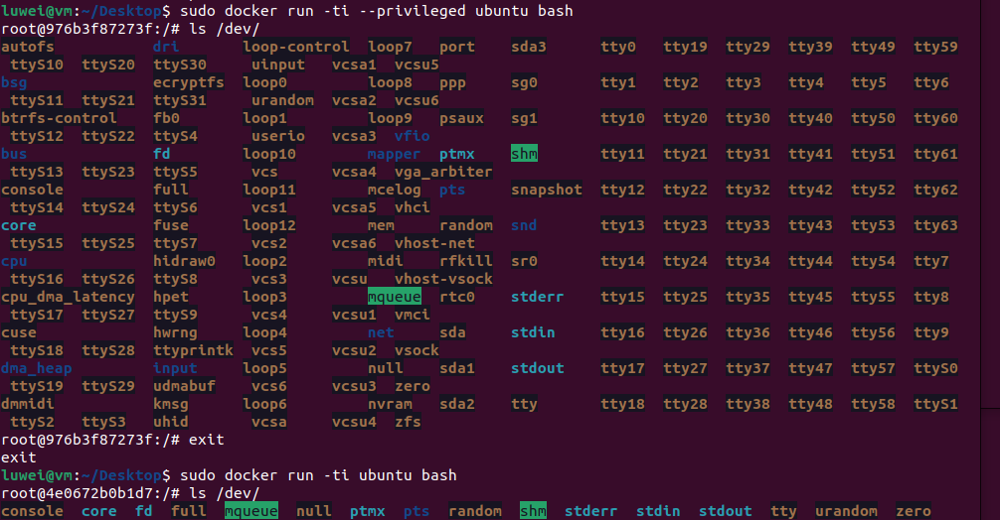
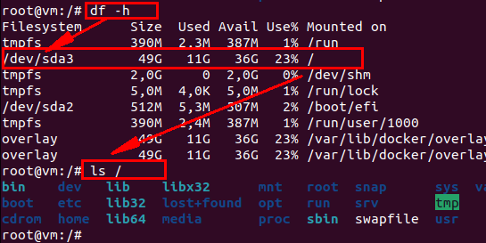
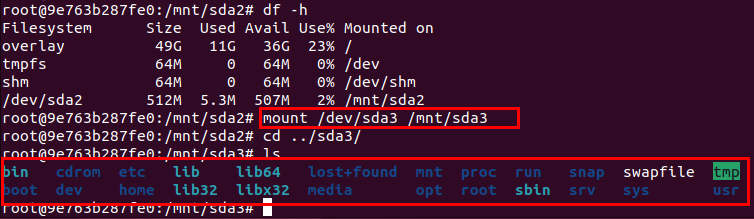

# Docker

* [返回上层目录](../operating-system.md)
* [镜像和容器](#镜像和容器)
  * [镜像和容器的区别](#镜像和容器的区别)
  * [镜像理解](#镜像理解)
  * [容器理解](#容器理解)
* [docker命令](#docker命令)
  * [docker常见命令](#docker常见命令)
  * [docker命令集](#docker命令集)
* [知识点](#知识点)
  * [docker使用privileged参数进入特权模式](#docker使用privileged参数进入特权模式)
    * [docker逃逸原理](#docker逃逸原理)

# 镜像和容器

## 镜像和容器的区别


两种理解：

* **光盘操作系统**：简单点说，镜像就类似操作系统光盘介质，容器相当于通过光盘安装后的系统。通过光盘(镜像)，我们能在不同机器上部署系统(容器)，系统内的操作只会保留在当前的系统(容器)中，如果要升级系统，需要使用到光盘，但是可能会导致操作系统的数据丢失。

* **类和对象**：容器是由镜像实例化而来，这和我们学习的面向对象的概念十分相似，我们可以把镜像看作类，把容器看作类实例化后的对象。

## 镜像理解

docker的镜像概念类似虚拟机的镜像。是一个只读的模板，一个独立的文件系统，包括运行容器所需的数据，可以用来创建新的容器。（  docker create <image -id > ：为指定的镜像添加一个可读写层，构成一个新的容器；）

例如：一个镜像可以包含一个完整的ubuntu操作系统环境，里面仅安装了mysql或用户需要的其他应用程序。

docker镜像实际上是由一层一层的系统文件组成，这种层级的文件系统被称为UnionFS( Union file system  统一文件系统)，镜像可以基于dockerfile构建，dockerfile是一个描述文件，里面包含了若干条密令，每条命令都会对基础文件系统创建新的层次结构。

docker提供了一个很简单的机制来创建镜像或更新现有的镜像。用户甚至可以从其他人那里下载一个已经做好的镜像直接使用。（镜像是只读的，可以理解为静态文件）

## 容器理解

docker利用容器来运行应用：

docker容器是由docker镜像创建的运行实例。docker容器类似虚拟机，可以执行包含启动，停止，删除等。

每个容器间是相互隔离的。

容器中会运行特定的运用，包含特定应用的代码及所需的依赖文件。可以**把容器看作一个简易版的linux环境**（包含root用户权限，进程空间，用户空间和网络空间等）和运行在其中的应用程序。

相对于镜像来说容器是动态的，容器在启动的时候创建了一层可写层次作为最上层。（   docker create <image -id > ：为指定的镜像添加一个可读写层，构成一个新的容器；）

```shell
docker 容器=镜像+可读层
```


# docker命令

## docker常见命令

* 新建镜像：

```shell
docker build -t image_01.qc:v0.1 /path/to/Dockerfile
```

* 查看镜像：

```shell
docker images -a
```

* 新建容器：

```shell
docker create  --name myrunoob  nginx:latest 
```

* 查看容器：

```shell
docker ps -a
```

* 运行容器：

说明：这个命令是核心命令，可以配置的参数多达28个参数。详细的解释可以通过docker run --help列出。

```shell
docker run --name mynginx -d nginx:latest
docker run -it -v /test:/soft centos /bin/bash
```

* 进入容器退出，并结束容器运行 

```shell
exit
```

* 退出容器但是容器仍在执行，按`ctrl + p + q`，会回到宿主机桌面 

```shell
ctrl + p + q
```

* 关闭容器：

```shell
docker kill e7c  # 支持模糊查找，只写名称的前三个就可以
```

* 重启容器：

```shell
docker start e7c
docker restart e7c  # 即便容器已经启动，restart也会给重启
```

* **容器启动并进入后台后，这个时候进入容器进行操作，可以使用docker attach命令或docker exec命令**：

（1）docker attach 容器id：

attach是docker自带的命令。**注意**，该命令的前提是，容器是已经被启动的，一旦kill或exit，就先需要start启动容器，否则会报错：`You cannot attach to a stopped container, start it first`。

```shell
docker attach e7c
```

（2）以交互模式进入容器：

从Docker的1.3版本起，Docker提供了更加方便的工具exec命令，可以在运行容器内直接执行任意命令。**注意**，该命令的前提是，容器是已经被启动的，一旦kill或exit，就先需要start来启动，然后再执行该命令，不然会报错：`Error response from daemon: Container e7c is not running`。

```shell
docker exec -it e7c /bin/bash
```

docker attach命令和docker exec命令的区别：

（a）当多个窗口同是attach到同一个容器的时候，所有窗口都会同步显示；当某个窗口因命令阻塞时，其他窗口也无法执行操作。（b）可以使用`docker exec -it 容器id /bin/bash`进入容器并开启一个新的bash终端。 退出容器终端时，不会导致容器的停止。（c）使用`docker attach 容器id`进入正在执行容器，不会启动新的终端， 退出容器时，会导致容器的停止。

* 删除容器：

```shell
docker rm e7c
```

* 删除镜像：

```shell
docker rmi image
```


## docker命令集

[docker官网docker base command line](https://docs.docker.com/engine/reference/commandline/docker/)

[菜鸟：docker命令大全](https://www.runoob.com/docker/docker-command-manual.html)

* 为指定的镜像添加一个可读写层，构成一个新的容器：

```shell
docker create <image -id> 
```

* docker start 命令为容器文件系统创建一个进程的隔离空间。注意，每一个容器只能够有一个进行隔离空间；（运行容器）：

```shell
docker start <container -id>
```

* 这个是先利用镜像创建一个容器，然后运行了这个容器：

说明：这个命令是核心命令，可以配置的参数多达28个参数。详细的解释可以通过docker run --help列出。

```shell
docker run <image -id>
```

* 停止所用的进程：

```shell
docker stop <container -id>
```

* 向所用运行在容器的进行发送一个不友好的sigkill信号：

```shell
docker kill <container -id>
```

* 将运行中的进程空间暂停：

```
docker pause <container -id>
```

* `docker rm`命令会移除构成容器的可读写层。注意，这个命令**只能对非运行态容器执行**：

```shell
docker rm <container -id>
```

* docker rmi是docker image rm的别名。`docker rmi`命令会移除构成镜像的一个只读层。你只能够使用`docker rmi`来移除最顶层（top level layer）（也可以说是镜像），你也可以使用`-f`参数来强制删除中间的只读层：

```
docker rmi <image -id>
```

* `docker commit`命令将容器的可读写层转换为一个只读层，这样就把一个容器转换成了不可变的镜像：

```shell
docker commit <container-id>
```

* `docker save`命令会创建一个镜像的压缩文件，这个文件能够在另外一个主机的Docker上使用。和export命令不同，这个命令为每一个层都保存了它们的元数据。这个命令只能对镜像生效：

```shell
docker save <image-id>
```

* `docker export`命令创建一个tar文件，并且移除了元数据和不必要的层，将多个层整合成了一个层，只保存了当前统一视角看到的内容（注：expoxt后的容器再import到Docker中，通过`docker images –tree`命令只能看到一个镜像；而save后的镜像则不同，它能够看到这个镜像的历史镜像）：

```shell
docker export <container-id>
```

* `docker history`命令递归地输出指定镜像的历史镜像：

```
docker history <image-id>
```

* 会列出所有运行中的容器；`docker ps -a`列出运行中和未运行的容器：

```shell
docker ps -a
```

* 列出所用的镜像，也可以说列出所用的可读层：

```shell
docker images -a
```

* 显示容器內运行的进程：

```
docker top <container-id>
```

# 知识点

## docker使用privileged参数进入特权模式

```
docker run [选项] 镜像名
选项
-d 后台运行
-it 提供容器交互
--name 设置容器名
--cpus 设置cpu个数
--env 设置环境变量
--mount type=bind,source=/root/target,target=/app或者--mount type=tmpfs,destination=/app 
--volume <host>:<container>:[rw|ro]挂载一个磁盘卷 例如 --volume /home/hyzhou/docker:/data:rw
--restart 设置重启策略on-failure,no,always
--privileged 使用该参数，container内的root拥有真正的root权限。否则，container内的root只是外部的一个普通用户权限。privileged启动的容器，可以看到很多host上的设备，并且可以执行mount。甚至允许你在docker容器中启动docker容器。
```

这个是先利用镜像创建一个容器，然后运行了这个容器：

```shell
sudo docker run -ti --privileged ubuntu bash
```

`--privileged`使用该参数，container内的root拥有真正的root权限。否则，container内的root只是外部的一个普通用户权限。privileged启动的容器，可以看到很多host上的设备，并且可以执行mount。甚至允许你在docker容器中启动docker容器。

使用特权模式启动容器后（docker run --privileged），Docker容器被允许可以访问主机上的所有设备、可以获取大量设备文件的访问权限、并可以执行mount命令进行挂载。




docker 启动nvidia/cuda的镜像的时候使得容器真正获取主机硬件资源

```shell
sudo docker run -it —privileged=true —name detectron nvidia/cuda:9.0-cudnn7-devel-ubuntu16.04 /bin/bash
```

此处必须添加—privileged=true使得容器真正获取主机硬件资源，包括GPU显卡资源。

- [docker privileged作用_美创安全实验室 | Docker逃逸原理](https://blog.csdn.net/weixin_39664998/article/details/110639657?spm=1001.2101.3001.6650.10&utm_medium=distribute.pc_relevant.none-task-blog-2~default~CTRLIST~default-10-110639657-blog-90576040.pc_relevant_default&depth_1-utm_source=distribute.pc_relevant.none-task-blog-2~default~CTRLIST~default-10-110639657-blog-90576040.pc_relevant_default)

### docker逃逸原理

因为Docker所使用的是隔离技术，就导致了容器内的进程无法看到外面的进程，但外面的进程可以看到里面，所以如果一个容器可以访问到外面的资源，甚至是获得了宿主主机的权限，这就叫做“Docker逃逸”。
目前产生Docker逃逸的原因总共有三种：

1. 由内核漏洞引起。
2. 由Docker软件设计引起。
3. 由特权模式与配置不当引起。

03 由于特权模式+目录挂载引起的逃逸

这一种逃逸方法较其他两种来说用的更多。特权模式在6.0版本的时候被引入Docker，其核心作用是允许容器内的root拥有外部物理机的root权限，而此前在容器内的root用户只有外部物理机普通用户的权限。

使用特权模式启动容器后（docker run --privileged），Docker容器被允许可以访问主机上的所有设备、可以获取大量设备文件的访问权限、并可以执行mount命令进行挂载。

当控制使用特权模式的容器时，Docker管理员可通过mount命令将外部宿主机磁盘设备挂载进容器内部，获取对整个宿主机的文件读写权限，此外还可以通过写入计划任务等方式在宿主机执行命令。

除了使用特权模式启动Docker会引起Docker逃逸外，使用功能机制也会造成Docker逃逸。Linux内核自版本2.2引入了功能机制（Capabilities），打破了UNIX/LINUX操作系统中超级用户与普通用户的概念，允许普通用户执行超级用户权限方能运行的命令。例如当容器以--cap-add=SYSADMIN启动，Container进程就被允许执行mount、umount等一系列系统管理命令，如果攻击者此时再将外部设备目录挂载在容器中就会发生Docker逃逸。

下面是使用特权模式后，docker可以挂载主机设备的例子：

主机上的设备`/dev/sda3`：



docker上挂载主机的设备`/dev/sda3`，然后就能在docker上看到主机的设备`/dev/sda3`了，并且还能直接修改，其实就相当于docker获取了主机的root权限：



# 参考资料

===

* [容器技术及其应用白皮书（上）-- 容器技术](https://blog.csdn.net/wh211212/article/details/53535881)
* [容器技术及其应用白皮书（下）-- 容器应用](https://blog.csdn.net/wh211212/article/details/53540342)

对容器技术写的不错的文章，待看

* [认识容器，我们从它的历史开始聊起](https://bbs.huaweicloud.com/blogs/285728)

写了对容器的理解。

* [docker -v 挂载问题](https://blog.csdn.net/hnmpf/article/details/80924494)

深入分析了docker -v的挂载问题。

