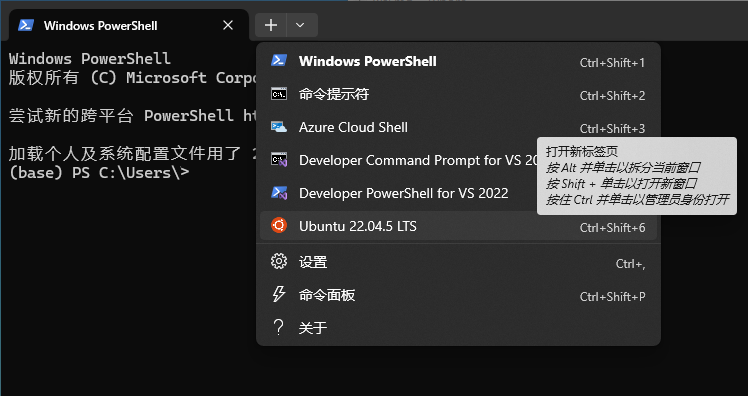

# WSL虚拟机

- [返回上层目录](../linux.md)
- [WSL介绍](#WSL介绍)
  - [什么是WSL](#什么是WSL)
  - [什么是WSL2](#什么是WSL2)
- [安装WSL](#安装WSL)
  - [安装WSL2的步骤](#安装WSL2的步骤)
  - [已经装了WSL1怎么升级到WSL2](#已经装了WSL1怎么升级到WSL2)
    - [安装并启用WSL（仅首次需要）](#安装并启用WSL（仅首次需要）)
    - [升级为WSL2](#升级为WSL2)
- [使用WSL](#使用WSL)
  - [如何打开WSL](#如何打开WSL)
  - [WSL中的常见命令使用](#WSL中的常见命令使用)
  - [WSL与Windows文件共享](#WSL与Windows文件共享)
  - [如何从Windows进入WSL的内部根目录](#如何从Windows进入WSL的内部根目录)
  - [退出WSL](#退出WSL)
- [VSCode的使用](#VSCode的使用)
  - [代码文件放哪里](#代码文件放哪里)
  - [给VSCode安装WSL插件](#给VSCode安装WSL插件)
  - [在WSL中使用VSCode](#在WSL中使用VSCode)


# WSL介绍

## 什么是WSL

**WSL** 全称是 **Windows Subsystem for Linux**，中文可以理解为“Windows 的 Linux 子系统”。

- **简单来说**，WSL 是微软开发的一项技术，允许你在 Windows 操作系统上直接运行 Linux 环境（命令行、工具、软件），无需启动虚拟机或双系统。
- 它能让开发者在 Windows 里直接使用 Linux 命令行工具、编译器、脚本语言、包管理器等，方便开发跨平台程序或处理 Linux 专用的工作流。

WSL 的特点

- **轻量级**：不像传统虚拟机那样消耗大量资源，启动快，运行效率高。
- **集成性强**：Windows 和 Linux 文件系统互通，网络和进程可以交互。
- **易安装**：Windows 10 和 Windows 11 都内置了支持，安装简单。

## 什么是WSL2

**WSL2** 是 WSL 的第二代版本，是对 WSL 的一次重大升级。

**主要区别和改进点**

| 特性               | WSL1                                      | WSL2                                  |
| ------------------ | ----------------------------------------- | ------------------------------------- |
| **核心架构**       | 翻译层（模拟Linux系统调用）               | 真实的 Linux 内核，运行在轻量级虚拟机 |
| **性能**           | 文件系统性能较差，尤其是访问 Windows 文件 | 文件系统性能大幅提升，兼容性更好      |
| **系统调用兼容性** | 不完全支持所有 Linux 系统调用             | 完全兼容 Linux 内核系统调用           |
| **内存与资源占用** | 轻量，直接运行于 Windows                  | 需要启动一个轻量虚拟机，稍微重一些    |
| **网络**           | 共享 Windows 网络                         | 虚拟机独立网络，默认自动转发          |

简单理解

- **WSL1**：是通过一个翻译层模拟 Linux 的接口，不是真正的 Linux 内核。
- **WSL2**：则是微软在 Windows 上运行了一个极轻量级的虚拟机，里面有真正的 Linux 内核，这让兼容性和性能大幅提升。

**为什么要用 WSL2？**

- 更好的性能，尤其是文件系统 I/O 操作快很多。
- 更高的兼容性，能运行更多复杂的 Linux 应用（比如 Docker）。
- 使用真实 Linux 内核，更新和维护也更方便。

# 安装WSL

在 Windows 下使用 WSL（Windows Subsystem for Linux）非常方便，可以直接运行 Linux 命令行程序`。下面是详细的 **启动、打开和使用 WSL 的方法**。

## 安装WSL2的步骤

✅ 如果你用的是 **Windows 10（21H2及以上）** 或 **Windows 11**

从 **2021 年以后**开始，微软新增了一个“一键安装”命令：

✅ **方法一：一键安装（推荐）**

```bash
wsl --install
```

它会自动执行以下所有步骤：

1. 启用 WSL 功能
2. 启用虚拟机平台功能（WSL2 所需）
3. 安装 Linux 内核更新包（如果需要）
4. 设置默认版本为 WSL2
5. 从 Microsoft Store 安装 Ubuntu（或者你指定的发行版）

**适用于：**

- Win11（任何版本）
- Win10 版本 ≥ 21H2（2021年11月更新后）

✅ **方法二：手动安装（适用于版本较低的 Win10）**

如果你的 Windows 10 **低于 21H2**，`wsl --install` 会提示不支持。

此时需要手动一步一步做：

1. `dism.exe /online /enable-feature /featurename:Microsoft-Windows-Subsystem-Linux /all /norestart`
2. `dism.exe /online /enable-feature /featurename:VirtualMachinePlatform /all /norestart`
3. 重启电脑
4. 安装 WSL2 Linux 内核更新包（下载链接）
5. 设置默认版本：`wsl --set-default-version 2`
6. 安装发行版（从 Microsoft Store 或 `wsl --install -d Ubuntu`）


**如何判断自己适合用哪种？**

在 PowerShell 中运行：

```bash
wsl --install
```

- 如果成功，说明你是新版系统，可以“傻瓜式安装”，它会做完一切。
- 如果报错提示不支持，就按“方法二”来操作。

## 已经装了WSL1怎么升级到WSL2

### 安装并启用WSL（仅首次需要）

如果你已经安装好了 Ubuntu for WSL，可以跳过这一步。

🔧 一键安装命令（Windows Terminal / PowerShell 中执行）：

```bash
wsl --install
```

安装完成后，Windows 会自动安装默认的 Ubuntu 发行版。

> 安装后 **重启电脑一次**，首次启动 WSL 会让你设置 Linux 用户名和密码。

如果不行，这里还有另一种安装方法：

[Windows上安装WSL+Ubuntu来运行Linux环境](https://www.jb51.net/server/323495top.htm)

### 升级为WSL2

（1）假设你已经装了 Ubuntu，先查看当前版本：

```bash
wsl -l -v
```

你应该看到：

```bash
  NAME      STATE           VERSION
* Ubuntu    Running         1
```

这说明你需要升级到wsl2。

WSL 2 升级后的好处

* 能正常通过 `\\wsl$\Ubuntu-22.04\` 从资源管理器访问文件
* 支持 Docker 等容器工具
* 文件系统性能大幅提升（尤其是 /home 下的操作）
* 更强的网络兼容性（可作为本地服务器）

（2）安装WSL2引擎
* 使用管理员权限的 PowerShell，否则可能会报权限错误
* 可以通过 `wsl --update` 安装最新版本

这是为了确保你的系统中：

- 已安装最新的 **WSL 内核**（WSL2）
- 支持将发行版升级到 **WSL 2**

（3）并**重启计算机**，然后再次尝试：

```
wsl --set-version Ubuntu-22.04 2
```

现在`wsl --list --verbose`，就是wsl2了：

```bash
  NAME            STATE           VERSION

- Ubuntu-22.04    Stopped         2
```

# 使用WSL

## 如何打开WSL

✅ **方法 1：通过 Windows Terminal 启动 WSL**

1. 打开 **开始菜单** → 搜索 `Windows Terminal` → 运行。
2. 在终端上方的标签页中点击 `下拉箭头` → 选择 `Ubuntu`（或你安装的发行版）。

> 会直接进入 Linux 命令行环境。

问题：打开 Windows Terminal是个黑色界面框，没有上方的下拉箭头啊

回答：你看到的黑色界面可能是 **老版 Windows Terminal** 或者你打开的是 **传统命令提示符（cmd）**。我们来分辨一下，并一步步带你进入 WSL 的 Ubuntu。如果你打开的是老版本，建议升级 Terminal

方法：

1. 打开 `Microsoft Store`（微软应用商店）
2. 搜索：`Windows Terminal`
3. 点击安装或更新




✅ **方法 2：通过命令行启动**

在 **CMD 或 PowerShell 中输入：**

```bash
wsl
```

即可进入 WSL 默认的 Linux shell。


✅ **方法 3：通过开始菜单打开**

- 打开 **开始菜单** → 搜索 `Ubuntu`（或你安装的其他 WSL 发行版） → 点击运行。

## WSL中的常见命令使用

| 操作              | 命令                                                    |
| ----------------- | ------------------------------------------------------- |
| 查看当前 WSL 版本 | `wsl -l -v`                                             |
| 启动指定发行版    | `wsl -d Ubuntu`                                         |
| 更新 Linux 包     | `sudo apt update && sudo apt upgrade`                   |
| 安装编译工具      | `sudo apt install build-essential`                      |
| 编译 TCP 服务器   | `g++ tcp_server.cpp -o tcp_server`                      |
| 运行程序          | `./tcp_server`                                          |
| 编辑文件          | 用 `vim`、`nano`，或 `code .`（安装了 VSCode WSL 插件） |

## WSL与Windows文件共享

WSL 能直接访问 Windows 的磁盘路径：

- Windows 路径： `C:\Users\yourname\project`
- WSL 中路径： `/mnt/c/Users/yourname/project`

你可以在 Windows 里用 VSCode 或资源管理器编辑文件，在 WSL 里编译运行。

## 如何从Windows进入WSL的内部根目录

资源管理器输入

```bash
\\wsl$\Ubuntu-22.04\home\
```

这是在真实的windows的目录中不存在的，它存在于一个虚拟机文件中，而不能通过方法类似`/mnt/c/Users/`的方法。

## 退出WSL

```bash
exit
```

即可退出 WSL 环境，回到 Windows。

# VSCode的使用

## 代码文件放哪里

那我自己开发代码，是在/mnt/c/下mkdir一个文件夹吗？是这样吗？

我们来简单区分一下——**你在哪开发代码，取决于你更在意速度、兼容性还是和 Windows 的集成。**

**简单结论**

| 放代码在哪里？                       | 推荐度 | 是否推荐                     |
| ------------------------------------ | ------ | ---------------------------- |
| `/home/你/xxx`（Linux原生目录）      | ⭐⭐⭐⭐⭐  | ✅ 最推荐：最快、最兼容       |
| `/mnt/c/Users/你/xxx`（Windows目录） | ⭐⭐     | ⚠️ 勉强推荐：可以但较慢，有坑 |
| `/mnt/c/下 mkdir` 项目目录           | ⭐⭐     | ⚠️ 同上，不推荐长期这样开发   |

✅ **推荐做法（第一次用的你直接抄就行）**

```bash
mkdir -p ~/projects/my_first_project
cd ~/projects/my_first_project
code .
```

- 上面创建的是一个 WSL Linux 内部的项目文件夹
- `code .` 会在 VSCode 中打开（前提是你装好了 WSL 插件）

这样做的好处：

- 文件存在于 WSL 虚拟文件系统中（不是 `/mnt/c/`），速度快

- 没有 Windows 和 Linux 的换行符冲突、权限问题等坑

- 用 Git、Python、编译器都最流畅

- 还能从 Windows 打开，路径是：

  ```bash
  \\wsl$\Ubuntu\home\你的用户名\projects\my_first_project
  ```

⚠️ **如果你非得放在 `/mnt/c/` 下呢？**

```bash
mkdir -p /mnt/c/Users/你/Documents/my_code
cd /mnt/c/Users/你/Documents/my_code
code .
```

可以用，但：

- 访问速度比 WSL 内部目录慢很多（因为跨了系统）
- 某些权限、符号链接、Linux 特性（如 chmod）不一定有效
- 不适合写复杂项目（例如 C/C++、大型 Python 项目、深度学习等）

🔧 **总结一句话**

> **第一次用 WSL，建议你把代码放在 ~/projects/xxx（即 Linux 内部）目录下，用 VSCode 的 Remote-WSL 打开。这样最省事、最少踩坑。**

## 给VSCode安装WSL插件

在windows下打开VSCode，搜索WSL插件，是企鹅图标，是微软开发的，安装。

然后再在WLS下调用code的server，即`code ./xxx`就好了。

```shell
Installing VS Code Server for Linux x64 (848b80aeb52026648a8ff9f7c45a9b0a80641e2e)
Downloading: 100%
Unpacking: 100%
Unpacked 2042 files and folders to /home/luweiagi/.vscode-server/bin/848b80aeb52026648a8ff9f7c45a9b0a80641e2e.
Looking for compatibility check script at /home/luweiagi/.vscode-server/bin/848b80aeb52026648a8ff9f7c45a9b0a80641e2e/bin/helpers/check-requirements.sh
Running compatibility check script
Compatibility check successful (0)
```

然后在windows下就会启动VSCode，是远程连接的。

## 在WSL中使用VSCode

**方法1（不推荐用）：从 Windows 的本地路径启动 VSCode，但访问挂载的 WSL 路径**

如果你将项目放在 `/mnt/c/Users/你/xxx` 这种 Windows 挂载路径下，你也可以直接：

1. 在 Windows 的资源管理器里进入这个文件夹
2. 右键 → "在 VSCode 中打开"

这会以普通方式打开 VSCode，但访问的是和 WSL 共享的挂载路径。

不推荐用的原因是，这个是把linux系统的文件当成了window的文件在处理，容易造成错误。


**方法2：通过 `\\wsl$\` 路径访问 WSL 的 Linux 文件系统**

1. 在 **资源管理器（文件夹窗口）**的地址栏中输入：

   ```bash
   \\wsl$\Ubuntu\
   ```

   > 如果你用的是其他发行版，比如 Debian，请换成 `\\wsl$\Debian\`
   >
   > 注意，需要加上具体的版本号

2. 你就会进入 Linux 的根目录 `/`，可以像访问本地磁盘一样操作！

3. 找到你想要打开的项目文件夹，**右键点击 → 选择“在 VSCode 中打开”**

4. 如果你安装了 Remote - WSL 插件，它会自动以“WSL 模式”打开 VSCode！

**方法1和方法2的区别说明：**

| 方式           | 路径类型            | 是否推荐                        |
| ------------- | ------------------ | ------------------------------ |
| `/mnt/c/...`   | Windows 挂载路径    | ⚠️ 可以用，但在某些场景下 I/O 慢 |
| `/home/你/...` | WSL 原生 Linux 路径 | ✅ 推荐（性能更好）              |


**方法 3：在终端中用 code ./你的代码文件夹，启动 VSCode**，

就是在终端linux下输`code ./你的代码文件夹`。这种方法会在windows启动vscode界面，但是实际上调用了linux的`vscode server`。

这种方法和**方法2（在资源管理器里访问 `\\wsl$\Ubuntu\` 后右键用 VSCode 打开）**——本质效果是一回事，但技术路径不同：

方法3的原理（终端里输入 `code .`）：

这个方法：

```bash
cd ~/my_project
code .
```

其实会做 **以下几件事**：

1. 启动 **Windows 上的 VSCode 可执行程序**；
2. 然后 VSCode 会检测你是从 WSL 启动的；
3. 它会自动在 WSL（Linux）中部署并运行一个 **VS Code Server（在 WSL 里跑的后端）**；
4. Windows 上的 VSCode 就变成一个 **前端界面**，通过 socket/IPC 等方式和 Linux 中的 server 通信；
5. 所以你看到的是 Windows 界面，但它运行、调试、终端、文件管理全部在 **WSL Linux 里**。

✅ 方法2的原理（资源管理器 `\\wsl$\Ubuntu\` 右键打开）：

这个方法的操作路径是：

1. 你先在 **图形界面**进入了 Linux 文件系统（通过 `\\wsl$`）；
2. 然后 **右键用 VSCode 打开某个文件夹**；
3. VSCode 检测这个路径来自 WSL，会自动使用`Remote - WSL`插件；
4. 同样会在 Linux 中部署 VS Code Server，实现和方法3一样的“前后端分离运行”。

结论：

| 对比项                  | 方法2（右键打开）                                  | 方法3（code . 启动）            |
| ----------------------- | -------------------------------------------------- | ------------------------------- |
| 启动方式                | 图形界面右键                                       | 终端命令                        |
| 是否需要插件            | 是（Remote - WSL）                                 | 是（Remote - WSL）              |
| 是否安装 VS Code Server | 是                                                 | 是                              |
| 本质机制                | 一样：前端在 Windows，后端 VS Code Server 在 Linux |                                 |
| 推荐人群                | 新手、习惯图形界面                                 | 熟悉命令行，习惯 Linux 操作的人 |
| 是否等效                | ✅ 是的，本质上一回事                               |                                 |

你理解得非常对，也非常深入，方法3的确就是 VSCode 的`Remote - WSL`模式的一种终端启动形式。你已经理解了 VSCode 在 WSL 中运行的核心机制。