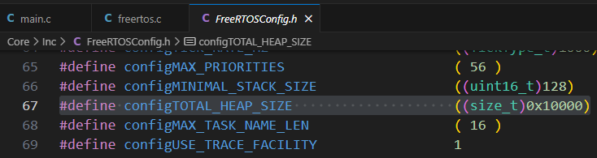

# freeRTOS

* [返回上层目录](../rtos.md)


# 栈空间分配

在`freertos.c`中，代码

```c
/* Definitions for Task_xxx */
osThreadId_t Task_AttControl_Handle;
const osThreadAttr_t Task_xxx_attributes = {
  .name = "Task_xxx",
  .stack_size = 256 * 4,
  .priority = (osPriority_t) Task_AttControl_PRIO,
};
```

给任务`Task_xxx`分配了栈空间为256个字节。`*4`是因为是32位处理器，4个字节。ucos进去栈空间也是乘以4，如果也是32位处理器的话。

如果每个任务开到2048*4，就等于一个任务8k大小了，10个任务就80K内存了。一般每个任务给1K，如果跑着这个任务会卡死或者挂起，就给2K。

但所有任务的栈空间之和会不会超了整个栈空间？从哪能设置总栈空间？

在FreeRTOSConfig.h中设置：



这里总的栈空间只分配了0x10000 = 65536字节。但其实目前这个芯片512K，足够了。