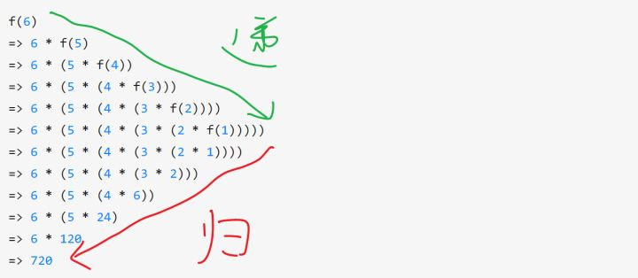
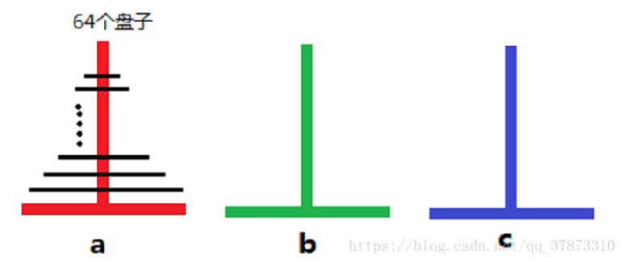
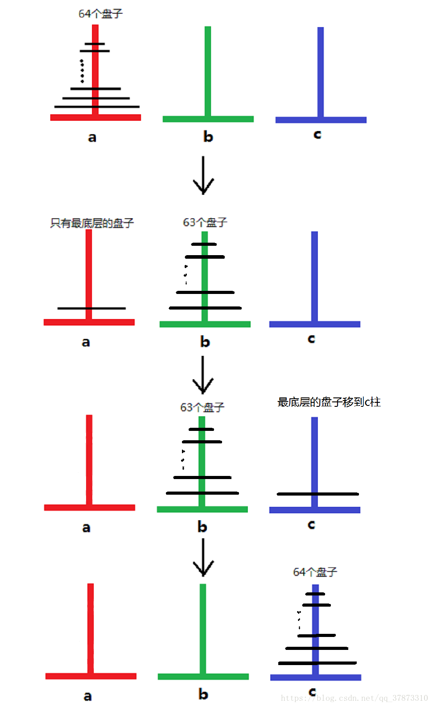

# 递归

* [返回上层目录](../algorithms.md)
* [理解递归的核心](#理解递归的核心)
* [理解递归](#理解递归)
  * [理解简单递归](#理解简单递归)
  * [理解复杂递归](#理解复杂递归)
* [递归的关键](#递归的关键)
* [递归的难点](#递归的难点)
* [递归三要素](#递归三要素)
* [汉诺塔](#汉诺塔)
  * [题目介绍](#题目介绍)
  * [写递归程序](#写递归程序)
  * [汉诺塔完整代码](#汉诺塔完整代码)


# 理解递归的核心

>对递归的理解的要点主要在于放弃!
>
>放弃你对于理解和跟踪递归全程的企图，只理解递归两层之间的交接，以及递归终结的条件。
>
>也就是说， 一定不要试图跟踪大型递归的过程！ 要写出递归，关键就是找出递归的递归方程式： 也就是说，**要完成最后一步，那么最后一步的前一步要做什么**。
>
>放弃的基础在于信任，信任数学归纳法。

# 理解递归

## 理解简单递归

用数学代入法来理解就好。

假设我们用递归来算阶乘 f(n)

```js
f(n) => n = 1? 1 : n * f(n-1) 
```

f里面用到了f，怎么理解呢？

很简单，把式子展开即可：

```js
f(6)
=> 6 * f(5)
=> 6 * (5 * f(4))
=> 6 * (5 * (4 * f(3)))
=> 6 * (5 * (4 * (3 * f(2))))
=> 6 * (5 * (4 * (3 * (2 * f(1)))))
=> 6 * (5 * (4 * (3 * (2 * 1))))
=> 6 * (5 * (4 * (3 * 2)))
=> 6 * (5 * (4 * 6))
=> 6 * (5 * 24)
=> 6 * 120
=> 720 
```

看到递归了吗？



先递进，再回归——这就是「递归」。

**可以理解为依次外包分发任务，然后开始执行**。

其实程序是用栈来实现递归的，那我们就用栈的形式来完成上面的流程：


## 理解复杂递归

```js
f(0) = 0
f(1) = 1
f(n) = f(n-1) + f(n-2)
```

递归调用的状态图如下：


# 递归的关键

递归的关键有两个：

（1）递归的结束条件（不写会死循环，TLE）

（2）递归最后一层和其他有关系的层的关系怎样用非递归函数来表达

比如：斐波纳契亚数列，（1）当n==1和n==2的时候f(n)=1，这就是递归的终止条件。给了终止条件，计算机才能进行求解子问题并回溯，最终求出f(n)

# 递归的难点

问：递归的特殊性（同时也是难点）是什么？
答：**自己调用自己**

那么，如果把递归改写成不存在“自己调用自己”的形式，是不是就好理解了呢？
我们来试一试。

以阶乘为例，代码如下：

```python
def f(n):
    if n == 0:
        return 1
    return n * f(n - 1)

# 结果是6
f(3)
```

好了注意了，我们要以另一种方式重写这段代码：

```python
def f(n):
    if n == 0:
        return 1
    return n * f_a(n - 1)

def f_a(n):
    if n == 0:
        return 1
    return n * f_b(n - 1)

def f_b(n):
    if n == 0:
        return 1
    return n * f_c(n - 1)

def f_c(n):
    if n == 0:
        return 1
    return n * f_d(n - 1)

# ...

# 结果是6
f(3)
```

怎么样，没有递归了吧？好理解了吧？

所以，搞懂解递归的关键在于：不要把递归理解成“自己调用了自己”，而是理解成：

> **调用了另一个不同的函数，只不过被调用函数的函数体（以及函数签名等）恰好与当前函数一模一样。**

只不过编程语言的设计者根据DRY（不重复自己，不写重复代码）原则，给语言增加了**递归**这种特性。好处自然是少些代码，坏处就是导致理解困难。

# 递归三要素

**递归的定义**：接受什么参数，返回什么值，代表什么意思 。当函数直接或者间接调⽤⾃⼰时，则发⽣了递归

**递归的拆解**：每次递归都是为了让问题规模变小

**递归的出口：**必须有⼀个明确的结束条件。因为递归就是有“递”有“归”，所以必须又有一个明确的点，到了这个点，就不用“递下去”，而是开始“归来”。

递归的过程：


下面这个求 n! 的例子中，递归出口（确定递归什么时候结束）是fun(1)=1，递归体（确定递归求解时的递归关系）是fun(n)=n*fun(n-1)，n>1。

```c
int fun(int n) { 
    if(n == 1)
        return 1;
    else
        return n * fun(n-1);
 }
```

# 汉诺塔

> 关于递归：
>
> （1）在求f(n, other variables)的时候，你就默认f(n -1, other variables)已经被求出来了——至于怎么求的，这个是计算机通过回溯求出来的。
>
> PS:这里用到了一种叫做栈(stack)的先进后出的数据结构，所以递归输出的答案一般是自下而上的。
>
> （2）递归和二叉树是密切相关的。可以尝试通过二叉树的数据结构来理解递归是如何将一个问题拆分成若干子问题，求解再回溯的。这里可以参考以下快速排序(QuickSort)的过程（快速排序的核心思想是分治，分治即分而治之，通过递归将原问题分解为若干容易求解的子问题，再通过递归将这些子问题联系起来并向二叉树的上层回溯，最终求解出原问题）

对于这个汉诺塔问题，在写递归时，我们只需要确定两个条件：

1.递归何时结束？

2.递归的核心公式是什么？即：

怎样将n个盘子全部移动到C柱上？

即：若使n个盘子全部移动到C柱上，上一步应该做什么？

## 题目介绍

**下面正式进入该题：**

> 汉诺塔：汉诺塔(Tower of Hanoi)源于印度传说中，大梵天创造世界时造了三根金钢石柱子，其中一根柱子自底向上叠着64片黄金圆盘。大梵天命令婆罗门把圆盘从下面开始按大小顺序重新摆放在另一根柱子上。并且规定，在小圆盘上不能放大圆盘，在三根柱子之间一次只能移动一个圆盘。           

下面来对汉诺塔问题进行解释和建立模型



这是示意图，a是起始柱，c是目标柱，b起到中转作用

在进行转移操作时，都必须确保大盘在小盘下面，且每次只能移动一个圆盘，最终c柱上有所有的盘子且也是从上到下按从小到大的顺序。

问题看起来并不复杂：

* 当a柱子上只有一个盘子时只要把那个盘子直接移到c就行了，

* 有两个盘子的话把1号盘先移到b柱，在把2号盘移到c柱，最后把b柱上的1号盘移到c柱就行了，

但现在我们要移动的是64个盘子。。。要是我们自己手动操作，那画面会很美，闲着无聊的人可以试试。

下面我用图来描述64个盘子的转移流程：



这里我们先把上方的63个盘子看成整体，这下就等于只有两个盘子，自然很容易了，我们只要完成两个盘子的转移就行了，好了现在我们先不管第64个盘子，假设a柱只有63个盘子，与之前一样的解决方式，前62个盘子先完成移动目标。

嗯，就这样一步步向前找到可以直接移动的盘子，62,61,60，......，2,1，最终，最上方的盘子是可以直接移动到c柱的，那就好办了，我们的2号盘也能完成向c柱的转移，这时c柱上时已经转移成功的2个盘，于是3号盘也可以了，一直到第64号盘。

## 写递归程序

下面我们来写递归函数。

首先，题目要求的是如何操作，那么我们就必须**写一个输出操作语句的函数**。

这个操作语句必须说明：第几步将哪个盘子从哪个柱子移动到哪个柱子上（这样人类才知道怎样移动盘子嘛）

这里，我们定义这个函数的函数名为`move`。

接下来，我们来确定这个函数的参数列表。

显然，为了说明第几步将哪个盘子从哪个柱子移动到哪个柱子上，我们参数列表至少应该包含：

id，表示被移动的盘子的序号。

from，表示从哪个柱子上移动这个编号为id的盘子

to，表示移动到哪个柱子上

那么这个函数的函数头就确定了：

```c++
// 打印移动方式：编号，从哪个盘子移动到哪个盘子
void move(int id, char from, char to) 
```

那么函数体呢？

唯一的难点就是如何记录这是操作的第几步。

注意到，每次操作必须输出移动方式且仅能输出一次，那么显然，我们已经printf的当前总数不就是第几次操作了嘛

我们开一个全局变量用于记录printf的次数即可

所以函数体中就只有这一个语句：

```c++
printf ("step %d: move %d from %c->%c\n", ++cnt, id, from, to);
```

合并起来就是：

```c++
// 打印移动方式：编号，从哪个盘子移动到哪个盘子
void move(int id, char from, char to) {
    printf ("step %d: move %d from %c->%c\n", ++cnt, id, from, to);
}
```

敲黑板：

**递归函数怎么写呢?**

我们先来想一下我们人类应该怎样操作吧。

我们每次操作都会这样问自己：我们需要将哪个柱子上的多少个盘子通过哪个柱子移动到哪个柱子上呢？

我们必须也只能用这么几个参数：

需要移动的盘子的总数，3个柱子。

所以函数头为：

```c++
void hanoi(int n, char a, char b, char c)
```

其中，n代表盘子总数，a，b，c代表柱子

`hanoi(n, a, b, c)`的意思就是：**将n个在a柱子上的盘子通过b这个柱子移动到c这个柱子上。**

`hanoi(n, a, b, c)`的意思就是：**将n个在a柱子上的盘子通过b这个柱子移动到c这个柱子上。**

`hanoi(n, a, b, c)`的意思就是：**将n个在a柱子上的盘子通过b这个柱子移动到c这个柱子上。**

那不就完了！

`hanoi(n, 'A', 'B', 'C')`就是这道问题的答案！

那么**这一步的前一步是什么？**

记住了，在求解f(n, other variables)的时候，我们直接默认f(n - 1, other variables)已经完了就可以了！这个在前面已经解释过了，在此不再鳌述。

我们**将n-1个盘子当作一个整体**：这就是类似于**分治求解子问题**的思想

那么，前一步也就是f(n - 1, other variables)显然是**先将n-1个在A柱子上的盘子通过C柱移动到B柱上，再将在A柱子上的编号为n的盘子移动到C柱上，再将B柱子上的n-1个盘子通过A柱移动到C柱上**，over

```c++
void hanoi(int n, char a, char b, char c)
{
    if (n == 0)
        return;
    hanoi(n - 1, a, c, b);
    move(n, a, c);
    hanoi(n - 1, b, a, c);
}
```

## 汉诺塔完整代码

```c++
#include <iostream>
#include <stdio>
using namespace std;
 
int cnt;
 
void move(int id, char from, char to) // 打印移动方式：编号，从哪个盘子移动到哪个盘子
{
    printf ("step %d: move %d from %c->%c\n", ++cnt, id, from, to);
}
 
void hanoi(int n, char x, char y, char z)
{
    if (n == 0)
        return;
    hanoi(n - 1, x, z, y);
    move(n, x, z);
    hanoi(n - 1, y, x, z);
}
 
int main()
{
    int n;
    cnt = 0;
    scanf ("%d", &n);
    hanoi(n, 'A', 'B', 'C');
    return 0;
}
```

p.s. 这里有一个描写递归汉诺塔的有意思的小故事，通过故事来理解：[如何理解汉诺塔的递归？](https://www.zhihu.com/question/24385418/answer/257751077)。


# 参考资料

* [如何理解汉诺塔的递归？](https://www.zhihu.com/question/24385418/answer/257751077)

“理解递归的核心”参考此知乎回答。

* [对于递归有没有什么好的理解方法？](https://www.zhihu.com/question/31412436/answer/738989709)

"理解简单递归"参考此知乎回答。

* [对于递归有没有什么好的理解方法？](https://www.zhihu.com/question/31412436/answer/683820765)

"理解复杂递归"参考此知乎回答。

* [怎么样可以很好地理解编程中的递归呢？](https://www.zhihu.com/question/24732787/answer/685687391)

“递归的难点”参考此知乎回答。

* [怎么样可以很好地理解编程中的递归呢？](https://www.zhihu.com/question/24732787/answer/930238132)

“递归三要素”参考此知乎回答。

* [汉诺塔问题——递归（时隔9个月，终于懂了）](https://blog.csdn.net/qq_41705423/article/details/82025409)
* [图解汉诺塔问题（递归求解）](https://blog.csdn.net/qq_37873310/article/details/80461767)

“汉诺塔”参考此知乎回答。

===

https://www.cnblogs.com/mld-code-life/p/10473605.html

[为什么你学不会递归？告别递归，谈谈我的一些经验](https://mp.weixin.qq.com/s?__biz=Mzg2NzA4MTkxNQ==&mid=2247485092&idx=1&sn=ff44f169aa57cac8a8e6595b7ff49ab8&scene=19#wechat_redirect)

