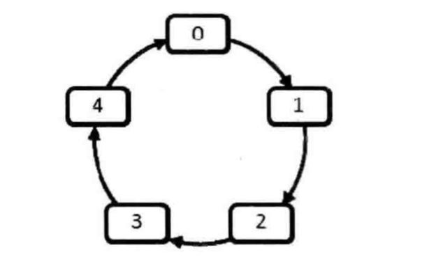
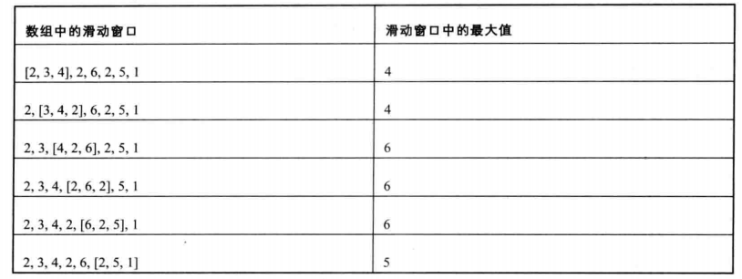

# 其他

* [返回上层目录](../jianzhi-offer.md)
* [剑指offer15：二进制中1的个数](#剑指offer15：二进制中1的个数)
* [剑指offer16：数值的整数次方](#剑指offer16：数值的整数次方)
* [剑指offer29：顺时针打印矩阵](#剑指offer29：顺时针打印矩阵)
* [剑指offer40：最小的K个数](#剑指offer40：最小的K个数)
* [剑指offer43：从1到n整数中1出现的次数](#剑指offer43：从1到n整数中1出现的次数)
* [剑指offer49：丑数](#剑指offer49：丑数)
* [剑指offer57-1：和为S的两个数字](#剑指offer57-1：和为S的两个数字)
* [剑指offer57-2：和为S的连续正数序列](#剑指offer57-2：和为S的连续正数序列)
* [剑指offer61：扑克牌顺子](#剑指offer61：扑克牌顺子)
* [剑指offer62：圆圈中最后剩下的数](#剑指offer62：圆圈中最后剩下的数)
* [剑指offer64：求1+2+3+…+n](#剑指offer64：求1+2+3+…+n)
* [剑指offer65：不用加减乘除做加法](#剑指offer65：不用加减乘除做加法)
* [剑指offerxx：字符流中第一个不重复的字符](#剑指offerxx：字符流中第一个不重复的字符)
* [剑指offer41：数据流中的中位数](#剑指offer41：数据流中的中位数)
* [剑指offer59：滑动窗口的最大值](#剑指offer59：滑动窗口的最大值)


# 剑指offer15：二进制中1的个数

> 题目：输入一个整数，输出该数二进制表示中1的个数。其中负数用补码表示。

不右移输入的数字n，左移数字1.

c++:

```c++
class Solution {
public:
     int  NumberOf1(int n) {
         int count = 0;
         unsigned int flag = 1;
         while(flag){
             if(n & flag){
                 count++;
             }
             
             flag = flag << 1;
         }
         
         return count;
     }
};
```

[详情](https://cuijiahua.com/blog/2017/11/basis_11.html)，[练习](https://www.nowcoder.com/practice/8ee967e43c2c4ec193b040ea7fbb10b8?tpId=13&tqId=11164&tPage=1&rp=1&ru=/ta/coding-interviews&qru=/ta/coding-interviews/question-ranking)。


# 剑指offer16：数值的整数次方

> 题目：给定一个double类型的浮点数base和int类型的整数exponent。求base的exponent次方。

当指数为负数的时候，可以先对指数求绝对值，然后算出次方的结果之后再取倒数。如果底数为0，则直接返回0。此时的次方在数学上是没有意义的。

除此之外，我们要**注意**：由于计算机表示小数（包括float和double型小数）都有误差，我们不能直接用等号（==）判断两个小数是否相等。如果两个小数的差的绝对值很小，比如小于0.0000001，就可以认为它们相等。

c++:

```c++
class Solution {
    bool g_InvalidInput = false;
    
public:
    double Power(double base, int exponent) {
        g_InvalidInput = false;
        if(equal(base, 0.0) && exponent < 0) {
            g_InvalidInput = true;
            return 0.0;
        }
        unsigned int absExponent = (unsigned int)(exponent);
        if(exponent < 0) {
            absExponent = (unsigned int)(-exponent);
        }
        
        double result = PowerWithUnsignedExponent(base, absExponent);
        if(exponent < 0) {
            result =  1.0 / result;
        }
        return result;
    }
private:
    double PowerWithUnsignedExponent(double base, unsigned int exponent) {
        double result = 1.0;
        for(int i = 1; i <= exponent; i++) {
            result *= base;
        }
        return result;
    }
    
    bool equal(double num1, double num2){
        if(num1 - num2 > -0.0000001 && (num1 - num2) < 0.0000001){
            return true;
        } else{
            return false;
        }
    }
};
```

[详情](https://cuijiahua.com/blog/2017/11/basis_12.html)，[练习](https://www.nowcoder.com/practice/1a834e5e3e1a4b7ba251417554e07c00?tpId=13&tqId=11165&tPage=1&rp=1&ru=/ta/coding-interviews&qru=/ta/coding-interviews/question-ranking)。


# 剑指offer29：顺时针打印矩阵

> 题目：输入一个矩阵，按照从外向里以顺时针的顺序依次打印出每一个数字，例如，如果输入如下矩阵：
>
> 
>
> 则依次打印出数组：1，2，3，4，8，12，16，15，14，13，9，5，6，7，11，10。

将结果存入vector数组，从左到右，再从上到下，再从右到左，最后从下到上遍历。

c++:

```c++
class Solution {
public:
    vector<int> printMatrix(vector<vector<int> > matrix) {
        int rows = matrix.size();			//行数
        int cols = matrix[0].size();		//列数
        vector<int> result;
        
        if(rows == 0 || cols == 0){
            return result;
        }
        int left = 0, right = cols - 1, top = 0, bottom = rows - 1;
        
        while(left <= right && top <= bottom){
            //从左到右
            for(int i = left; i <= right; ++i){
                result.push_back(matrix[top][i]);
            }
            //从上到下
            for(int i = top + 1; i <= bottom; ++i){
                result.push_back(matrix[i][right]);
            }
            //从右到左
            if(top != bottom){
                for(int i = right - 1; i >= left; --i){
                    result.push_back(matrix[bottom][i]);
                }
            }
            //从下到上
            if(left != right){
                for(int i = bottom - 1; i > top; --i){
                    result.push_back(matrix[i][left]);
                }
            }
            left++, top++, right--, bottom--;
        }
        return result;
    }
};
```

[详情](https://cuijiahua.com/blog/2017/12/basis_19.html)，[练习](https://www.nowcoder.com/practice/9b4c81a02cd34f76be2659fa0d54342a?tpId=13&tqId=11172&tPage=1&rp=1&ru=/ta/coding-interviews&qru=/ta/coding-interviews/question-ranking)。


# 剑指offer40：最小的K个数

> 题目：输入n个整数，找出其中最小的K个数。例如输入4,5,1,6,2,7,3,8这8个数字，则最小的4个数字是1,2,3,4。

维护k个元素的最大堆，即用容量为k的最大堆存储最先遍历到的k个数，并假设他们是最小的k个数。继续遍历数列，每次遍历到一个元素，将它与堆顶元素比较，若小于堆顶元素，更新堆，否则，不更新堆。

c++:

```c++
class Solution {
public:
    vector<int> GetLeastNumbers_Solution(vector<int> input, int k) {
        vector<int> minVec;
        
        int size = input.size();
        if(size < k || k <= 0 || size <= 0) return minVec;
        else if(size == k) return input;
        
        for(int i = 0; i < k; i++) {
            minVec.push_back(input[i]);
        }
        
        // 建立大顶堆
        build_heap(minVec);
        
        for(int i = k; i < size; i++) {
            if(input[i] < minVec[0]) {
                minVec[0] = input[i];
                heapify(minVec, 0);
            }
        }
        
        return minVec;
    }
private:
    void heapify(vector<int> &tree, int i) {
        int size = tree.size();
        int last_index = size - 1;
        if(i > (last_index - 1) / 2) return;
        
        int max = i, left_child = 2 * i + 1, right_child = 2 * i + 2;
        if(left_child < size && tree[left_child] > tree[max]) {
            max = left_child;
        }
        if(right_child < size && tree[right_child] > tree[max]) {
            max = right_child;
        }
        if(max != i) {
            swap(tree[i], tree[max]);
            heapify(tree, max);
        }
    }
    
    void build_heap(vector<int> &tree) {
        int size = tree.size();
        int last_index = size - 1;
        for(int i = (last_index - 1) / 2; i >= 0; i--) {
            heapify(tree, i);
        }
    }
};
```

[详情](https://cuijiahua.com/blog/2017/12/basis_29.html)，[练习](https://www.nowcoder.com/practice/6a296eb82cf844ca8539b57c23e6e9bf?tpId=13&tqId=11182&tPage=1&rp=1&ru=/ta/coding-interviews&qru=/ta/coding-interviews/question-ranking)。


# 剑指offer43：从1到n整数中1出现的次数

> 题目：输入一个整数n，求从1到n这n个整数的十进制表示中1出现的次数。例如输入12，从1到12这些整数中包含1的数字有1，10，11和12，1一共出现了5次。

两种方法，一种是从1到n遍历，每次通过对10求余数判断整数的个位数字是不是1，大于10的除以10之后再判断。我们对每个数字都要做除法和求余运算以求出该数字中1出现的次数。如果输入数字n，n有O(logn)位，我们需要判断每一位是不是1，那么时间复杂度为O(n*logn)。这样做，计算量大，效率不高。

第二种是数学之美第134页上面提出的方法，设定整数点（如1、10、100等等）作为位置点i（对应n的各位、十位、百位等等），分别对每个数位上有多少包含1的点进行分析。这个有点太难了，面试也不会出这个。

只看第一种简单的遍历：

c++:

```c++
class Solution {
public:
    int NumberOf1Between1AndN_Solution(int n)
    {
        int number = 0;
        for(unsigned int i = 1; i <= n; i++) {
            number += GetOneNum(i);
        }
        return number;
    }
private:
    int GetOneNum(unsigned int i) {
        int num = 0;
        while(i) {
            if(i % 10 == 1) {
                num++;
            }
            i = i / 10;
        }
        return num;
    }
};
```

[详情](https://cuijiahua.com/blog/2017/12/basis_31.html)，[练习](https://www.nowcoder.com/practice/bd7f978302044eee894445e244c7eee6?tpId=13&tqId=11184&tPage=1&rp=1&ru=/ta/coding-interviews&qru=/ta/coding-interviews/question-ranking)。


# 剑指offer49：丑数

> 题目： 把只包含因子2、3和5的数称作丑数（Ugly Number）。例如6、8都是丑数，但14不是，因为它包含因子7。 习惯上我们把1当做是第一个丑数。求按从小到大的顺序的第N个丑数。

所谓的一个数m是另一个数n的因子，是指n能被m整除，也就是n%m==0。根据丑数的定义，丑数只能被2、3和5整除。根据丑数的定义，丑数应该是另一个丑数乘以2、3或者5的结果（1除外）。因此我们可以创建一个数组，里面的数字是排好序的丑数，每一个丑数都是前面的丑数乘以2、3或者5得到的。

这个思路的关键问题在于怎样保证数组里面的丑数是排好序的。对乘以2而言，肯定存在某一个丑数T2，排在它之前的每一个丑数乘以2得到的结果都会小于已有最大的丑数，在它之后的每一个丑数乘以乘以2得到的结果都会太大。我们只需要记下这个丑数的位置，同时每次生成新的丑数的时候，去更新这个T2。对乘以3和5而言，也存在着同样的T3和T5。

c++:

```c++
class Solution {
public:
    int GetUglyNumber_Solution(int index) {
        if(index <= 0){
            return 0;
        }
        vector<int> res(index);
        res[0] = 1;
        int t2 = 0, t3 = 0, t5 = 0;
        for(int i = 1; i < index; i++){
            res[i] = min(res[t2] * 2, min(res[t3] * 3, res[t5] * 5));
            while(res[i] >= res[t2] * 2){
                t2++;
            }
            while(res[i] >= res[t3] * 3){
                t3++;
            }
            while(res[i] >= res[t5] * 5){
                t5++;
            }
        }
        return res[index - 1];
    }
};
```

[详情](https://cuijiahua.com/blog/2018/01/basis_33.html)，[练习](https://www.nowcoder.com/practice/6aa9e04fc3794f68acf8778237ba065b?tpId=13&tqId=11186&tPage=1&rp=1&ru=/ta/coding-interviews&qru=/ta/coding-interviews/question-ranking)。


# 剑指offer57-1：和为S的两个数字

> 题目：输入一个递增排序的数组和一个数字S，在数组中查找两个数，是的他们的和正好是S，如果有多对数字的和等于S，输出两个数的乘积最小的。

对于一个数组，我们可以定义两个指针，一个从左往右遍历（pleft），另一个从右往左遍历（pright）。首先，我们比较第一个数字和最后一个数字的和curSum与给定数字sum，如果curSum < sum，那么我们就要加大输入值，所以，pleft向右移动一位，重复之前的计算；如果curSum > sum，那么我们就要减小输入值，所以，pright向左移动一位，重复之前的计算；如果相等，那么这两个数字就是我们要找的数字，直接输出即可。

这么做的好处是，也保证了乘积最小。为什么？
$$
\begin{aligned}
&(b+a)^2-(b-a)^2=4ab\\
\Rightarrow&S^2-(b-a)^2=4ab\\
\Rightarrow&min(ab)\Rightarrow max(b-a)
\end{aligned}
$$
要让ab最小，需要让b-a最大，这正好能够满足。

c++:

```c++
class Solution {
public:
    vector<int> FindNumbersWithSum(vector<int> array,int sum) {
        vector<int> result;
        int length = array.size();
        if(length < 1){
            return result;
        }
        int pright = length - 1;
        int pleft = 0;
        
        while(pright > pleft){
            int curSum = array[pleft] + array[pright];
            if(curSum == sum){
                result.push_back(array[pleft]);
                result.push_back(array[pright]);
                break;
            }
            else if(curSum < sum){
                pleft++;
            }
            else{
                pright--;
            }
        }
        return result;
    }
};
```

[详情](https://cuijiahua.com/blog/2018/01/basis_42.html)，[练习](https://www.nowcoder.com/practice/390da4f7a00f44bea7c2f3d19491311b?tpId=13&tqId=11195&tPage=1&rp=1&ru=/ta/coding-interviews&qru=/ta/coding-interviews/question-ranking)。


# 剑指offer57-2：和为S的连续正数序列

> 题目：小明很喜欢数学,有一天他在做数学作业时,要求计算出9~16的和,他马上就写出了正确答案是100。但是他并不满足于此,他在想究竟有多少种连续的正数序列的和为100(至少包括两个数)。没多久,他就得到另一组连续正数和为100的序列:18,19,20,21,22。现在把问题交给你,你能不能也很快的找出所有和为S的连续正数序列? Good Luck!

这道题还是蛮简单的。

设定两个指针，一个指向第一个数，一个指向最后一个数，在此之前需要设定第一个数和最后一个数的值，由于是正数序列，所以可以把第一个数设为1，最后一个数为2（因为是要求是连续正数序列，最后不可能和第一个数重合）。下一步就是不断改变第一个数和最后一个数的值，如果从第一个数到最后一个数的和刚好是要求的和，那么把所有的数都添加到一个序列中；如果大于要求的和，则说明从第一个数到最后一个数之间的范围太大，因此减小范围，需要把第一个数的值加1，同时把当前和减去原来的第一个数的值；如果小于要求的和，说明范围太小，因此把最后一个数加1，同时把当前的和加上改变之后的最后一个数的值。这样，不断修改第一个数和最后一个数的值，就能确定所有连续正数序列的和等于S的序列了。

注意：初中的求和公式应该记得吧，首项加尾项的和乘以个数除以2，即sum = (a + b) * n / 2。

c++:

```c++
class Solution {
public:
    vector<vector<int> > FindContinuousSequence(int sum) {
        vector<vector<int> > result;
        // 高位指针和低位指针
        int phigh = 2, plow = 1;
        
        // 终止条件是phigh等于sum
        while(phigh > plow){
            // 当前和，使用求和公式s = (a+b) * n / 2
            int curSum = (plow + phigh) * (phigh - plow + 1) >> 1;
            if(curSum < sum){
                phigh++;
            }
            if(curSum == sum){
                vector<int> temp;
                for(int i = plow; i <= phigh; i++){
                    temp.push_back(i);
                }
                result.push_back(temp);
                plow++;
            }
            if(curSum > sum){
                plow++;
            }
        }
        return result;
    }
};
```

[详情](https://cuijiahua.com/blog/2018/01/basis_41.html)，[练习](https://www.nowcoder.com/practice/c451a3fd84b64cb19485dad758a55ebe?tpId=13&tqId=11194&tPage=1&rp=1&ru=/ta/coding-interviews&qru=/ta/coding-interviews/question-ranking)。


# 剑指offer61：扑克牌顺子

> 题目：LL今天心情特别好,因为他去买了一副扑克牌,发现里面居然有2个大王,2个小王(一副牌原本是54张😊)...他随机从中抽出了5张牌,想测测自己的手气,看看能不能抽到顺子,如果抽到的话,他决定去买体育彩票,嘿嘿！！“红心A,黑桃3,小王,大王,方片5”,“Oh My God!”不是顺子.....LL不高兴了,他想了想,决定大\小 王可以看成任何数字,并且A看作1,J为11,Q为12,K为13。上面的5张牌就可以变成“1,2,3,4,5”(大小王分别看作2和4),“So Lucky!”。LL决定去买体育彩票啦。 现在,要求你使用这幅牌模拟上面的过程,然后告诉我们LL的运气如何。为了方便起见,你可以认为大小王是0。

这题说了一堆，提取主要信息，我们不难整理出，满足如下条件才可以认为是顺子：

- 输入数据个数为5；
- 输入数据都在0-13之间；
- 没有相同的数字；
- 最大值与最小值的差值不大于5。

PS：大小王可以当成任意数。

c++:

```c++
class Solution {
public:
    bool IsContinuous( vector<int> numbers ) {
        int size = numbers.size();
        if(size <= 0) return false;
        
        sort(numbers.begin(), numbers.end());
        
        int zeroNum = 0;
        for(int i = 0; i < size; i++) {
            if(numbers[i] == 0) zeroNum++;
        }
        
        int gapNum = 0;
        for(int j = zeroNum; j < size - 1; j++) {
            if(numbers[j] == numbers[j + 1]) return false;
            gapNum += numbers[j + 1] - numbers[j] - 1;
        }
        
        return gapNum <= zeroNum? true: false;
    }
};
```

[详情](https://cuijiahua.com/blog/2018/01/basis_45.html)，[练习](https://www.nowcoder.com/practice/762836f4d43d43ca9deb273b3de8e1f4?tpId=13&tqId=11198&tPage=1&rp=1&ru=/ta/coding-interviews&qru=/ta/coding-interviews/question-ranking)。


# 剑指offer62：圆圈中最后剩下的数

> 题目：每年六一儿童节,牛客都会准备一些小礼物去看望孤儿院的小朋友,今年亦是如此。HF作为牛客的资深元老,自然也准备了一些小游戏。其中,有个游戏是这样的:首先,让小朋友们围成一个大圈。然后,他随机指定一个数m,让编号为0的小朋友开始报数。每次喊到m-1的那个小朋友要出列唱首歌,然后可以在礼品箱中任意的挑选礼物,并且不再回到圈中,从他的下一个小朋友开始,继续0...m-1报数....这样下去....直到剩下最后一个小朋友,可以不用表演,并且拿到牛客名贵的“名侦探柯南”典藏版(名额有限哦!!^_^)。请你试着想下,哪个小朋友会得到这份礼品呢？(注：小朋友的编号是从0到n-1)

例如，0，1，2，3，4这5个数字组成一个圆圈，从数字0开始每次删除第3个数字，则删除的前4个数字依次是2、0、4、1，因此最后剩下的数字是3。



解法1：用环形链表模拟圆圈。

c++:

```c++
class Solution {
public:
    int LastRemaining_Solution(int n, int m)
    {
        if(n < 1 || m < 1) return -1;
        
        vector<int> circle;
        for(int i = 0; i < n; i++) {
            circle.push_back(i);
        }
        
        vector<int>::iterator point = circle.begin();
        while(circle.size() > 1) {
            // 这里从1开始，是因为从0开始的话还要后退一位
            for(int i = 1; i < m; i++) {
                point++;
                if(point == circle.end()) {
                    point = circle.begin();
                }
            }
            // 删除操作后返回下一个地址
            point = circle.erase(point); 
            if(point == circle.end()) {
                point = circle.begin();
            }
        }
        return *point;
    }
};
```

[详情](https://cuijiahua.com/blog/2018/01/basis_46.html)，[练习](https://www.nowcoder.com/practice/f78a359491e64a50bce2d89cff857eb6?tpId=13&tqId=11199&tPage=1&rp=1&ru=/ta/coding-interviews&qru=/ta/coding-interviews/question-ranking)。

解法2：[用递归或循环](https://www.zhihu.com/question/20065611/answer/78681758)：

可以这样理解这个方法：

当有n个人的时候，他们的编号依次是0、1、2、3、4、………、n-1。假设最后编号为x(n)的人会留下来。

因为数到m的那个人会出列，那么此轮中编号为(m-1)%n的人会出列，编号为(m+0)%n的人将做为下一轮编号为0的人，此轮编号为(m+i)%n的人将做为下一轮编号为i的人…

因此当有n-1个人的时候，编号为i的人对应着上一轮编号为(m+i)%n的人。假设此轮编号为x(n-1)的人最终会留下来。因为编号为x(n-1)的人肯定对应着上一轮的x(n)，所以有**x(n)=(m+x(n-1))%n**。

有了这个递推公式，那我们就可以一直递推到x(2)=(m+x(1))%2，而x(1)=0。

所以我们可以这么来写这个函数:

c++:

```c++
class Solution {
public:
    int LastRemaining_Solution(int n, int m)
    {
        if(n < 1 || m < 1) {
            return -1;
        }
        int last = 0;
        for(int i = 2; i <= n; i++) {
            last = (last + m) % i;
        }
        return last;
    }
};
```

[详情](https://cuijiahua.com/blog/2018/01/basis_46.html)，[练习](https://www.nowcoder.com/practice/f78a359491e64a50bce2d89cff857eb6?tpId=13&tqId=11199&tPage=1&rp=1&ru=/ta/coding-interviews&qru=/ta/coding-interviews/question-ranking)。


# 剑指offer64：求1+2+3+…+n

> 题目：求1+2+3+...+n，要求不能使用乘除法、for、while、if、else、switch、case等关键字及条件判断语句（A?B:C）。

没什么好说的，这是一道超级无敌送分题，使用递归即可。

c++:

```c++
class Solution {
public:
    int Sum_Solution(int n) {
        int ans = n;
        // &&就是逻辑与，逻辑与有个短路特点，前面为假，后面不计算。即递归终止条件
        ans && (ans += Sum_Solution(n - 1));
        return ans;
    }
};
```

[详情](https://cuijiahua.com/blog/2018/01/basis_47.html)，[练习](https://www.nowcoder.com/practice/7a0da8fc483247ff8800059e12d7caf1?tpId=13&tqId=11200&tPage=1&rp=1&ru=/ta/coding-interviews&qru=/ta/coding-interviews/question-ranking)。


# 剑指offer65：不用加减乘除做加法

> 题目：写一个函数，求两个整数之和，要求在函数体内不得使用+、-、*、/四则运算符号。

首先看十进制是如何做的： 5+7=12，

可以使用三步走：

第一步：相加各位的值，不算进位，得到2。

第二步：计算进位值，得到10. 如果这一步的进位值为0，那么第一步得到的值就是最终结果。

第三步：重复上述两步，只是相加的值变成上述两步的得到的结果2和10，得到12。 同样我们可以

三步走的方式计算二进制值相加： 5-101，7-111

第一步：相加各位的值，不算进位，得到010，二进制每位相加就相当于各位做异或操作，101^111。

第二步：计算进位值，得到1010，相当于各位做与操作得到101，再向左移一位得到1010，(101&111)<<1。

第三步：重复上述两步， 各位相加 010^1010=1000，进位值为100=(010&1010)<<1。

继续重复上述两步：1000^100 = 1100，进位值为0，跳出循环，1100为最终结果。

c++:

```c++
class Solution {
public:
    int Add(int num1, int num2)
    {
        return num2 ? Add(num1 ^ num2, (num1 & num2) << 1) : num1;
    }
};
```

[详情](https://cuijiahua.com/blog/2018/01/basis_48.html)，[练习](https://www.nowcoder.com/practice/59ac416b4b944300b617d4f7f111b215?tpId=13&tqId=11201&tPage=1&rp=1&ru=/ta/coding-interviews&qru=/ta/coding-interviews/question-ranking)。


# 剑指offerxx：字符流中第一个不重复的字符

> 题目：请实现一个函数用来找出字符流中第一个只出现一次的字符。例如，当从字符流中只读出前两个字符"go"时，第一个只出现一次的字符是"g"。当从该字符流中读出前六个字符“google"时，第一个只出现一次的字符是"l"。
>
> 输出描述：
>
> 如果当前字符流没有存在出现一次的字符，返回#字符。

这道题还是很简单的。将字节流保存起来，通过哈希表统计字符流中每个字符出现的次数，顺便将字符流保存在string中，然后再遍历string，从哈希表中找到第一个出现一次的字符。

c++:

```c++
class Solution
{
public:
  //Insert one char from stringstream
    void Insert(char ch)
    {
        s += ch;
        count[ch]++;
    }
  //return the first appearence once char in current stringstream
    char FirstAppearingOnce()
    {
        int length = s.size();
        for(int i = 0; i < length; i++){
            if(count[s[i]] == 1){
                return s[i];
            }
        }
        return '#';
    }
private:
    string s;
    int count[256] = {0};
};
```

[详情](https://cuijiahua.com/blog/2018/01/basis_54.html)，[练习](https://www.nowcoder.com/practice/00de97733b8e4f97a3fb5c680ee10720?tpId=13&tqId=11207&tPage=1&rp=1&ru=/ta/coding-interviews&qru=/ta/coding-interviews/question-ranking)。


# 剑指offer41：数据流中的中位数

> 题目：如何得到一个数据流中的中位数？如果从数据流中读出奇数个数值，那么中位数就是所有数值排序之后位于中间的数值。如果从数据流中读出偶数个数值，那么中位数就是所有数值排序之后中间两个数的平均值。

这道题的解法有很多，文本使用最大堆和最小堆实现。

主要思想：

最大堆 | 最小堆

我们将数据分为两部分，位于左边最大堆的数据比右边最小堆的数据要小，左、右两边内部的数据没有排序，也可以根据左边最大的数及右边最小的数得到中位数。

接下来考虑用最大堆和最小堆实现的一些细节。

首先要保证数据平均分配到两个堆中，因此两个堆中数据的数目之差不能超过1.为了实现平均分配，可以在数据的总数目是偶数时把新数据插入到最小堆中，否则插入到最大堆中。

此外，还要保证最大堆中所有数据小于最小堆中数据。所以，新传入的数据需要先和最大堆的最大值或者最小堆中的最小值进行比较。以总数目为偶数为例，按照我们制定的规则，新的数据会被插入到最小堆中，但是在这之前，我们需要判断这个数据和最大堆中的最大值谁更大，如果最大堆中的数据比较大，那么我们就需要把当前数据插入最大堆，然后弹出新的最大值，再插入到最小堆中。由于最终插入到最小堆的数字是原最大堆中最大的数字，这样就保证了最小堆中所有数字都大于最大堆的数字。


下面代码中，我们基于stl中的函数push_heap、pop_heap以及vector实现堆。比较仿函数less和greater分别用来实现最大堆和最小堆。

c++:

```c++
class Solution {
public:
    void Insert(int num)
    {
        // 如果已有数据为偶数，则放入最小堆
        if(((max.size() + min.size()) & 1) == 0){
            // 如果插入的数字小于最大堆里的最大的数，则将数字插入最大堆
            // 并将最大堆中的最大的数字插入到最小堆
            if(max.size() > 0 && num < max[0]){
                // 插入数据插入到最大堆数组
                max.push_back(num);
                // 调整最大堆
                push_heap(max.begin(), max.end(), less<int>());
                // 拿出最大堆中的最大数
                num = max[0];
                // 删除最大堆的栈顶元素
                pop_heap(max.begin(), max.end(), less<int>());
                max.pop_back();
            }
            // 将数据插入最小堆数组
            min.push_back(num);
            // 调整最小堆
            push_heap(min.begin(), min.end(), greater<int>());
        }
        // 已有数据为奇数，则放入最大堆
        else{
            if(min.size() > 0 && num > min[0]){
                // 将数据插入最小堆
                min.push_back(num);
                // 调整最小堆
                push_heap(min.begin(), min.end(), greater<int>());
                // 拿出最小堆的最小数
                num = min[0];
                // 删除最小堆的栈顶元素
                pop_heap(min.begin(), min.end(), greater<int>());
                min.pop_back();
            }
            // 将数据插入最大堆
            max.push_back(num);
            push_heap(max.begin(), max.end(), less<int>());
        }
    }
    double GetMedian()
    {
        // 统计数据大小
        int size = min.size() + max.size();
        if(size == 0){
            return 0;
        }
        // 如果数据为偶数
        if((size & 1) == 0){
            return (min[0] + max[0]) / 2.0;
        }
        // 奇数
        else{
            return min[0];
        }
    }
private:
    // 使用vector建立最大堆和最小堆,min是最小堆数组,max是最大堆数组
    vector<int> min;
    vector<int> max;
};
```

[详情](https://cuijiahua.com/blog/2018/02/basis_63.html)，[练习](https://www.nowcoder.com/practice/9be0172896bd43948f8a32fb954e1be1?tpId=13&tqId=11216&tPage=1&rp=1&ru=/ta/coding-interviews&qru=/ta/coding-interviews/question-ranking)。

当然，上述的那些内置函数也很难记住，那就自己动手丰衣足食，自己写堆排序，如下所示：

```c++
class Solution {
public:
	void Insert(int num)
	{
		if((max_heap.size() + min_heap.size()) % 2 == 0) {
			if(max_heap.size() > 0 && num <= max_heap[0]) {
				add_build(max_heap, num, greater);
				num = max_heap[0];
				erase_build(max_heap, greater);
			}
			add_build(min_heap, num, less);
		} else {
			if(min_heap.size() > 0 && num >= min_heap[0]) {
				add_build(min_heap, num, less);
				num = min_heap[0];
				erase_build(min_heap, less);
			}
			add_build(max_heap, num, greater);
		}
	}

	double GetMedian()
	{
		if((max_heap.size() + min_heap.size()) == 0) {
			return 0;
		} else if((max_heap.size() + min_heap.size()) % 2 == 0) {
			return (max_heap[0] + min_heap[0]) / 2.0;
		} else {
			return min_heap[0];
		}
	}
private:
	vector<int> max_heap;
	vector<int> min_heap;

	static bool less(int i, int j) {
		return i < j? true: false;
	}

	static bool greater(int i, int j) {
		return i > j? true: false;
	}

	void heapify(vector<int> &heap, int i, bool (*cmp)(int, int)) {
		int size = heap.size();

		int max_min_index = i;
		if((2 * i + 1) < size && cmp(heap[2 * i + 1], heap[i])) {
			max_min_index = 2 * i + 1;
		}
		if((2 * i + 2) < size && cmp(heap[2 * i + 2], heap[max_min_index])) {
			max_min_index = 2 * i + 2;
		}
		if(max_min_index != i) {
			int temp = heap[i];
			heap[i] = heap[max_min_index];
			heap[max_min_index] = temp;
			heapify(heap, max_min_index, cmp);
		}
	}

	void build_heap(vector<int> &heap, bool (*cmp)(int, int)) {
		if(heap.size() <= 1) {
			return;
		}
		int size = heap.size();
		int last_index = size - 1;
		for(int i = (last_index - 1) / 2; i >= 0; i--) {
			heapify(heap, i, cmp);
		}
	}

	void add_build(vector<int> &heap, int num, bool (*cmp)(int, int)) {
		heap.push_back(num);
		build_heap(heap, cmp);
	}

	void erase_build(vector<int> &heap, bool (*cmp)(int, int)) {
		heap.erase(heap.begin());
		build_heap(heap, cmp);
	}
};
```


# 剑指offer59：滑动窗口的最大值

> 题目：给定一个数组和滑动窗口的大小，找出所有滑动窗口里数值的最大值。例如，如果输入数组{2,3,4,2,6,2,5,1}及滑动窗口的大小3，那么一共存在6个滑动窗口，他们的最大值分别为{4,4,6,6,6,5}。

针对数组{2,3,4,2,6,2,5,1}的滑动窗口有以下6个： {[2,3,4],2,6,2,5,1}， {2,[3,4,2],6,2,5,1}， {2,3,[4,2,6],2,5,1}， {2,3,4,[2,6,2],5,1}， {2,3,4,2,[6,2,5],1}， {2,3,4,2,6,[2,5,1]}，如下图所示：



我们可以使用一个双端队列deque。

我们可以用STL中的deque来实现，接下来我们以数组{2,3,4,2,6,2,5,1}为例，来细说整体思路。

数组的第一个数字是2，把它存入队列中。第二个数字是3，比2大，所以2不可能是滑动窗口中的最大值，因此把2从队列里删除，再把3存入队列中。第三个数字是4，比3大，同样的删3存4。此时滑动窗口中已经有3个数字，而它的最大值4位于队列的头部。

第四个数字2比4小，但是当4滑出之后它还是有可能成为最大值的，所以我们把2存入队列的尾部。下一个数字是6，比4和2都大，删4和2，存6。就这样依次进行，最大值永远位于队列的头部。

但是我们怎样判断滑动窗口是否包括一个数字？应该在队列里存入数字在数组里的下标，而不是数值。当一个数字的下标与当前处理的数字的下标之差大于或者相等于滑动窗口大小时，这个数字已经从窗口中滑出，可以从队列中删除。

整体过程示意图：


c++:

```c++
class Solution {
public:
    vector<int> maxInWindows(const vector<int>& num, unsigned int size)
    {
        vector<int> maxVec;
        if(num.size() < size || size <= 0) return maxVec;
        
        deque<int> maxIndex;
        for(int i = 0; i < size; i++) {
            while(!maxIndex.empty() && num[i] >= num[maxIndex.back()]) {
                maxIndex.pop_back();
            }
            maxIndex.push_back(i);
        }
        maxVec.push_back(num[maxIndex.front()]);
        
        for(int i = size; i < num.size(); i++) {
            if(maxIndex.front() <= i - size) {
                maxIndex.pop_front();
            }
            while(!maxIndex.empty() && num[i] >= num[maxIndex.back()]) {
                maxIndex.pop_back();
            }
            maxIndex.push_back(i);
            maxVec.push_back(num[maxIndex.front()]);
        }
        return maxVec;
    }
};
```

[详情](https://cuijiahua.com/blog/2018/02/basis_64.html)，[练习](https://www.nowcoder.com/practice/1624bc35a45c42c0bc17d17fa0cba788?tpId=13&tqId=11217&tPage=1&rp=1&ru=/ta/coding-interviews&qru=/ta/coding-interviews/question-ranking)。


# 参考资料

* [剑指Offer系列刷题笔记汇总](https://cuijiahua.com/blog/2018/02/basis_67.html)

本文参考此博客。

