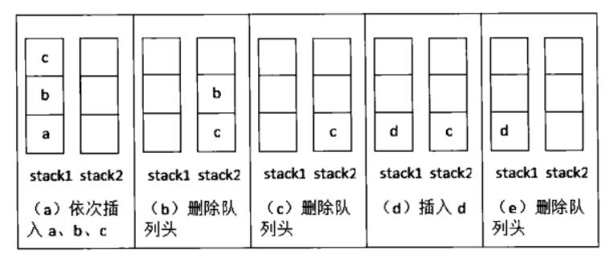

# 栈和队列

* [返回上层目录](../jianzhi-offer.md)
* [剑指offer9：用两个栈实现队列](#剑指offer9：用两个栈实现队列)
* [剑指offer30：包含min函数的栈](#剑指offer30：包含min函数的栈)
* [剑指offer31：栈的压入、弹出序列](#剑指offer31：栈的压入、弹出序列)


# 剑指offer9：用两个栈实现队列

> 题目：用两个栈来实现一个队列，完成队列的Push和Pop操作。 队列中的元素为int类型。

创建两个栈stack1和stack2，使用两个“先进后出”的栈实现一个“先进先出”的队列。

我们通过一个具体的例子分析往该队列插入和删除元素的过程。首先插入一个元素a，不妨先把它插入到stack1，此时stack1中的元素有{a}，stack2为空。再压入两个元素b和c，还是插入到stack1中，此时stack1的元素有{a,b,c}，其中c位于栈顶，而stack2仍然是空的。

这个时候我们试着从队列中删除一个元素。按照先入先出的规则，由于a比b、c先插入队列中，最先删除的元素应该是a。元素a存储在stack1中，但并不在栈顶，因此不能直接进行删除操作。注意stack2我们一直没有使用过，现在是让stack2发挥作用的时候了。如果我们把stack1中的元素逐个弹出压入stack2，元素在stack2中的顺序正好和原来在stack1中的顺序相反。因此经过3次弹出stack1和要入stack2操作之后，stack1为空，而stack2中的元素是{c,b,a}，这个时候就可以弹出stack2的栈顶a了。此时的stack1为空，而stack2的元素为{b,a}，其中b在栈顶。

因此我们的思路是：当stack2中不为空时，在stack2中的栈顶元素是最先进入队列的元素，可以弹出。如果stack2为空时，我们把stack1中的元素逐个弹出并压入stack2。由于先进入队列的元素被压倒stack1的栈底，经过弹出和压入之后就处于stack2的栈顶，有可以直接弹出。如果有新元素d插入，我们直接把它压入stack1即可。

流程示意图：



c++:

```c++
class Solution
{
public:
    void push(int node) {
        stack1.push(node);
    }

    int pop() {
        if(stack2.empty()){
            while(stack1.size() > 0){
                int data = stack1.top();
                stack1.pop();
                stack2.push(data);
            }
        }
        int pop_element = stack2.top();
        stack2.pop();
        return pop_element;
    }

private:
    stack<int> stack1;
    stack<int> stack2;
};
```

[详情](https://cuijiahua.com/blog/2017/11/basis_5.html)，[练习](https://www.nowcoder.com/practice/54275ddae22f475981afa2244dd448c6?tpId=13&tqId=11158&tPage=1&rp=1&ru=/ta/coding-interviews&qru=/ta/coding-interviews/question-ranking)。


# 剑指offer30：包含min函数的栈

> 题目：定义栈的数据结构，请在类型中实现一个能够得到栈最小元素的min函数。

使用两个stack，一个为数据栈，另一个为辅助栈。数据栈用于存储所有数据，辅助栈用于存储最小值。

举个例子：

入栈的时候：首先往空的数据栈里压入数字3，显然现在3是最小值，我们也把最小值压入辅助栈。接下来往数据栈里压入数字4。由于4大于之前的最小值，因此我们只要入数据栈，不压入辅助栈。

出栈的时候：当数据栈和辅助栈的栈顶元素相同的时候，辅助栈的栈顶元素出栈。否则，数据栈的栈顶元素出栈。

获得栈顶元素的时候：直接返回数据栈的栈顶元素。

栈最小元素：直接返回辅助栈的栈顶元素。

c++:

```c++
class Solution {
public:
    void push(int value) {
        Data.push(value);
        if(Min.empty()){
            Min.push(value);
        }
        if(Min.top() > value){
            Min.push(value);
        }
    }
    void pop() {
        if(Data.top() == Min.top()){
            Min.pop();
        }
        Data.pop();
    }
    int top() {
        return Data.top();
    }
    int min() {
        return Min.top();
    }
private:
    stack<int> Data;			//数据栈
    stack<int> Min;				//最小栈
};
```

[详情](https://cuijiahua.com/blog/2017/12/basis_20.html)，[练习](https://www.nowcoder.com/practice/4c776177d2c04c2494f2555c9fcc1e49?tpId=13&tqId=11173&tPage=1&rp=1&ru=/ta/coding-interviews&qru=/ta/coding-interviews/question-ranking)。


# 剑指offer31：栈的压入、弹出序列

> 题目：输入两个整数序列，第一个序列表示栈的压入顺序，请判断第二个序列是否为该栈的弹出顺序。假设压入栈的所有数字均不相等。例如序列1,2,3,4,5是某栈的压入顺序，序列4,5,3,2,1是该压栈序列对应的一个弹出序列，但4,3,5,1,2就不可能是该压栈序列的弹出序列。（注意：这两个序列的长度是相等的）
>
> 不一定是全部压入栈之后再弹出，也可以是压几个弹一个，再压入，再弹出。那4,5,3,2,1举例的话，就是先压入了1,2,3,4，弹出4，再压入5，再弹出所有

借用一个辅助的栈，遍历压栈顺序，先将第一个放入栈中，这里是1，然后判断栈顶元素是不是出栈顺序的第一个元素，这里是4，很显然1≠4，所以我们继续压栈，直到相等以后开始出栈，出栈一个元素，则将出栈顺序向后移动一位，直到不相等，这样循环等压栈顺序遍历完成，如果辅助栈还不为空，说明弹出序列不是该栈的弹出顺序。

c++:

```c++
class Solution {
public:
    bool IsPopOrder(vector<int> pushV,vector<int> popV) {
        if(pushV.size() == 0){
            return false;
        }
        for(int i = 0, j = 0; i < pushV.size();i++){
            stackData.push(pushV[i]);
            while(j < popV.size() && stackData.top() == popV[j]){
                stackData.pop();
                j++;
            }
        }
        return stackData.empty();
    }
private:
    stack<int> stackData;
};
```

[详情](https://cuijiahua.com/blog/2017/12/basis_21.html)，[练习](https://www.nowcoder.com/practice/d77d11405cc7470d82554cb392585106?tpId=13&tqId=11174&tPage=1&rp=1&ru=/ta/coding-interviews&qru=/ta/coding-interviews/question-ranking)。


# 参考资料

* [剑指Offer系列刷题笔记汇总](https://cuijiahua.com/blog/2018/02/basis_67.html)

本文参考此博客。

