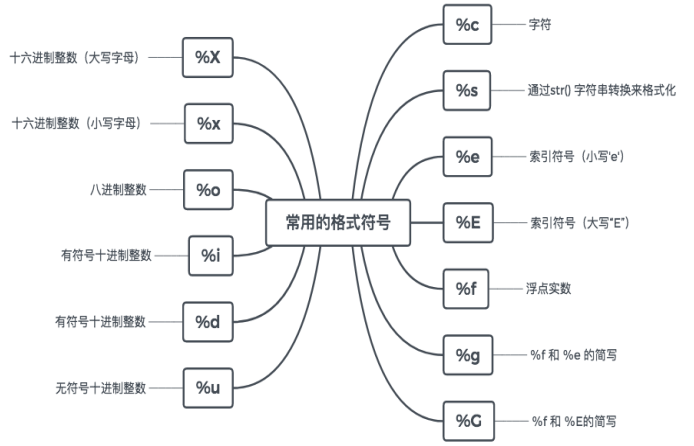

# 基础语法

* [返回上层目录](../python.md)
* [第一个python程序](#第一个python程序)
* [注释](#注释)
* [变量类型](#变量类型)
  * [查看变量类型](#查看变量类型)
  * [整数的最大最小值](#整数的最大最小值)
* [输入输出](#输入输出)
* [格式化符号](#格式化符号)
* [类型转换](#类型转换)
* [变量名、命名规则、关键字](#变量名、命名规则、关键字)
* [运算符](#运算符)


# 第一个python程序

在开始的搜索框中输入cmd，打开cmd命令窗口，然后输入python，进入python


打印“hello,world!”：

```
print("hello,world!")
```

退出python：


```
exit()
```


工欲善其事，必先利其器，我们使用**pycharm**作为我们的开发环境。当然你也可以用spyder(anaconda自带)。

# 注释

- 单行注释
  - 以#开头，只注释一行
  - 快捷键ctrl+/

```python
#单行注释，打印hello world
print("hello,world!")
```

- 多行注释
  - '''注释内容'''，实现多行注释

```python
'''
多行注释，打印hello world
'''
print("hello,world!")
```

# 变量类型

比C语言主要多了列表、元组、字典这三种类型。


注意：

- Boolean类型的True和False首字母要大写。
- python不需要指定变量类型，其解释器会根据变量值来判断是什么类型。

## 查看变量类型

```python
name = "zhangsan"
age = 28
print(type(name))
print(type(age))
```

输出为

```js
<class 'str'>
<class 'int'>
```

## 整数的最大最小值

在Python 3中，这个问题不适用。 普通的`int`类型是无界的。

但是，您实际上可能正在寻找机器的字大小。 这在Python 3中仍然可用，如`-sys.maxint - 1`。

您可以使用`-sys.maxint - 1`计算最小值，如下所示。

一旦超过此值，Python就会**从普通整数切换为长整数**。 所以大多数时候，你不需要知道它。

```python
import sys
max = sys.maxsize  # 9223372036854775807
min = -sys.maxsize -1. # -922337203685477580
```

# 输入输出

- 输入input()

```python
# 输入
name = input("请输入用户名：")
password = input("请输入密码：")
print(name)
print(password)
```

注意：接收的类型都是默认字符串"str"类型。

- print输出
  - 直接输出内容
  - 输出单个和多个变量
  - 格式化输出
  - format输出，可免去定义格式

```python
# 直接输出内容
print("luwei,28")
name = "luwei"
age = 28
# 输出单个和多个变量
print(name,age)
# 格式化输出
print("你的名字是：%s"%name)
print("你的年龄是：%d"%age)
print("name:%s,age:%d"%(name,age))#一行输出多个变量
# format输出
print("name:{},age:{}".format(name,age))#可免去定义格式
```

- 无换行输出
  - 加end=""
- 换行输出
  - 加\n

```python
name = "luwei"
age = 28
# 无换行输出，加end=""
print("你的名字是：%s "%name,end="")
print("你的年龄是：%d"%age)
# 换行输出，加\n
print("name:%s\nage:%d"%(name,age))
```

# 格式化符号



**浮点数精度显示控制**

```python
percent = 99.99
print("你战胜了全国%.2f%%的用户"%percent)
```

在格式化输出的时候**%**是特殊字符，表示转换说明符，如果想打印普通的%，那么要使用%%来表示。

# 类型转换


特别的，其中eval()会根据你所需要的数据类型来自动转换。

```python
name = input("请输入姓名：")
age = input("请输入年龄：")
print("name:%s,age:%d"%(name,int(age)))
print("name:%s,age:%d"%(name,eval(age)))
```

# 变量名、命名规则、关键字

- 变量名

  - 区分大小写
  - 字母、数字、下划线组成，但是不能以数字开头

- 命名规则

  - 见名知意，如name
  - 驼峰命名法，如：类名(UserInfo)、异常名(ValueError)
  - 小写字符+下划线，如变量名(user_name)、函数名(get_name())

- 关键字

  - 在python内部具有特殊功能的标识符

  - 通过keyword模块的kwlist函数查看

  - ```python
    import keyword as kw
    print(kw.kwlist)
    ```

# 运算符

- 算数运算符
  - +，加
  - -，减
  - *，乘
  - /，除
  - %，取余，10%3=1
  - **，幂次方
  - //，取整，返回商的整数部分，10//3=3
- 比较运算符
  - ==，等于
  - !=，不等于
  - \>，大于
  - \<，小于
  - \>=，大于等于
  - <=，小于等于
- 赋值运算符
  - =，赋值运算符
  - +=，自加
  - -=，自减
  - *=，自乘
  - /=，自除
  - %=，自取余
  - **=，自幂次方
  - //=，自取整
- 逻辑运算
  - and， x and y，与
  - or，x or y，或
  - not，not x，非

**运算符的优先级**


