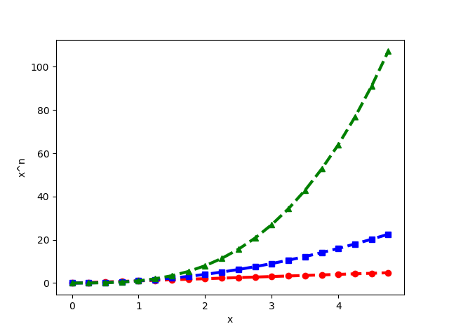
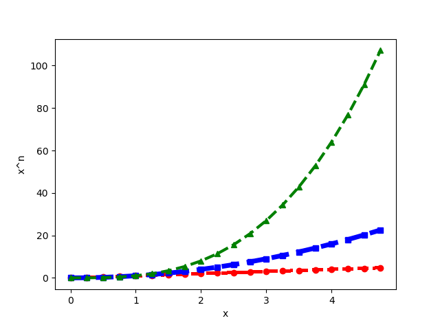

# matplotlib

* [返回上层目录](python.md#python)

# matplotlib简介

matplotlib给python提供了丰富的绘图库，尤其是二维图像绘制。

**官网**：http://matplotlib.org/

**简单介绍**

Python中最著名的绘图系统，很多其他的绘图例如seaborn（针对pandas绘图而来）也是由其封装而成。创世人John Hunter于2012年离世。这个绘图系统操作起来很复杂，和R的ggplot,lattice绘图相比显得望而却步，这也是为什么我个人不丢弃R的原因，虽然调用

```python
plt.style.use("ggplot")
```

绘制的图形可以大致按照ggplot的颜色显示，但是还是感觉很鸡肋。但是matplotlib的复杂给其带来了很强的定制性。其具有面向对象的方式及Pyplot的经典高层封装。

需要掌握的是：

1. 散点图，折线图，条形图，直方图，饼状图，箱形图的绘制。
2. 绘图的三大系统：pyplot，pylab(不推荐)，面向对象
3. 坐标轴的调整，添加文字注释，区域填充，及特殊图形patches的使用
4. 金融的同学注意的是：可以直接调用Yahoo财经数据绘图（真。。。）

Pyplot快速入门：[Pyplot tutorial](http://matplotlib.org/users/pyplot_tutorial.html)

下面就是对官网pyplot快速入门教程的学习记录和翻译。

# 图形的基本绘制

这个已经翻译好了http://blog.csdn.net/qq_31192383/article/details/53977822


```python
import matplotlib.pyplot as plt
plt.plot([1,2,3,4],[5,6,6,4])
plt.ylabel('some numbers')
plt.show()
```


```python
import matplotlib.pyplot as plt
plt.plot([1,2,3,4],[1,2,9,16],'ro')
plt.axis([0,6,0,20])
plt.show()
```


```python
import numpy as np
import matplotlib.pyplot as plt

#x = np.array(range(5))
x = np.arange(0,5,0.25)

plt.plot(x, x, 'r--o', x, x**2, 'b--s', x, x**3, 'g--^')
plt.ylabel('x^n')
plt.xlabel('x')
plt.show()
```


# 绘图设置

## 控制线条的属性


* 使用关键字参数


```python
import numpy as np
import matplotlib.pyplot as plt

#x = np.array(range(5))
x = np.arange(0,5,0.25)

#plt.plot(x, x, 'r--o', x, x**2, 'b--s', x, x**3, 'g--^')
plt.plot(x, x, 'r--o', x, x**2, 'b--s', x, x**3, 'g--^', linewidth = 3.0)
plt.ylabel('x^n')
plt.xlabel('x')
plt.show()
```

和上一张图相比，通过对线宽属性进行设置，即`linewidth = 3.0`，线条明显变粗了。



* 通过获得线对象，对线对象进行设置

```python
import numpy as np
import matplotlib.pyplot as plt

#x = np.array(range(5))
x = np.arange(0,5,0.25)

#line1, = plt.plot(x, x, 'r--o')
(line1, line2, line3) = plt.plot(x, x, 'r--o', x, x**2, 'b--s', x, x**3, 'g--^', linewidth = 3.0)
print(type(line1))
#<class 'matplotlib.lines.Line2D'>
line1.set_antialiased(False)
line2.set_linewidth(5)
plt.ylabel('x^n')
plt.xlabel('x')
plt.show()
```




* dads

```python
import numpy as np
import matplotlib.pyplot as plt

#x = np.array(range(5))
x = np.arange(0,5,0.25)

lines = plt.plot(x, x, 'r--o', x, x**2, 'b--s', x, x**3, 'g--^', linewidth = 3.0)
# use keyword args
plt.setp(lines, color = 'r', linewidth = 6.0)
# 很显然，setp函数一次只能对一个线对象设置属性
# or MATLAB style string value pairs
#plt.setp(lines, 'color', 'r', 'linewidth', 6.0)
plt.ylabel('x^n')
plt.xlabel('x')
plt.show()
```


​     同时获取多个线对象，分别使用`plt.setp()`函数设置每个线对象的属性。

```python
import numpy as np
import matplotlib.pyplot as plt

x = np.arange(0,5,0.25)

(line1, line2, line3) = plt.plot(x, x, 'r--o', x, x**2, 'b--s', x, x**3, 'g--^', linewidth = 3.0)
print(type(line1))
#<class 'matplotlib.lines.Line2D'>
plt.setp(line1, color = 'r', lw = 10.0)
plt.setp(line2, color = 'g', linewidth = 7.0)
plt.setp(line3, color = 'b', lw = 4.0)
# 这样通过setup函数就能对所有线对象设置属性了
# or MATLAB style string value pairs
#plt.setp(lines, 'color', 'r', 'linewidth', 6.0)
plt.ylabel('x^n')
plt.xlabel('x')
plt.show()
```


### Line2D线对象的属性

下面是可选的Line2D线对象的属性

|        Property        |                Value Type                |
| :--------------------: | :--------------------------------------: |
|         alpha          |                  float                   |
|        animated        |             [True \| False]              |
|   antialiased or aa    |             [True \| False]              |
|        clip_box        |   a matplotlib.transform.Bbox instance   |
|        clip_on         |             [True \| False]              |
|       clip_path        | a Path instance and a Transform instance, a Patch |
|       color or c       |           any matplotlib color           |
|        contains        |         the hit testing function         |
|     dash_capstyle      |                [`'butt'`                 |
|     dash_joinstyle     |                [`'miter'`                |
|         dashes         |     sequence of on/off ink in points     |
|          data          |     (np.array xdata, np.array ydata)     |
|         figure         |   a matplotlib.figure.Figure instance    |
|         label          |                any string                |
|    linestyle or ls     |                 [ `'-'`                  |
|    linewidth or lw     |          float value in points           |
|          lod           |             [True \| False]              |
|         marker         |                 [ `'+'`                  |
| markeredgecolor or mec |           any matplotlib color           |
| markeredgewidth or mew |          float value in points           |
| markerfacecolor or mfc |           any matplotlib color           |
|    markersize or ms    |                  float                   |
|       markevery        | [ None \| integer \| (startind, stride) ] |
|         picker         |    used in interactive line selection    |
|       pickradius       |      the line pick selection radius      |
|     solid_capstyle     |                [`'butt'`                 |
|    solid_joinstyle     |                [`'miter'`                |
|       transform        | a matplotlib.transforms.Transform instance |
|        visible         |             [True \| False]              |
|         xdata          |                 np.array                 |
|         ydata          |                 np.array                 |
|         zorder         |                any number                |


为了得到可以设置的线对象的属性列表，调用`plt.setp()`函数，该函数以线对象为参数。

```python
import numpy as np
import matplotlib.pyplot as plt

x = np.array([0,1,2,3,4,5])
print(x)
line1, = plt.plot(x, 'or')
print(type(line1))
#<class 'matplotlib.lines.Line2D'>

plt.setp(line1)
```


### 支持的颜色

http://blog.csdn.net/mmc2015/article/details/47746195

如果颜色不显示指出，则默认循环使用不同的颜色，

| character |  color  |
| :-------: | :-----: |
|    ‘b’    |  blue   |
|    ‘g’    |  green  |
|    ‘r’    |   red   |
|    ‘c’    |  cyan   |
|    ‘m’    | magenta |
|    ‘y’    | yellow  |
|    ‘k’    |  black  |
|    ‘w’    |  white  |

python的plt画图支持的全部颜色种类及对应单词：[Python的plt画图中常用颜色值对应的单词](https://blog.csdn.net/u011808596/article/details/121335672)。

### 支持的线型

http://blog.csdn.net/mmc2015/article/details/47746195

| character |      description      |
| :-------: | :-------------------: |
|   `'-'`   |   solid line style    |
|  `'--'`   |   dashed line style   |
|  `'-.'`   |  dash-dot line style  |
|   `':'`   |   dotted line style   |
|   `'.'`   |     point marker      |
|   `','`   |     pixel marker      |
|   `'o'`   |     circle marker     |
|   `'v'`   | triangle_down marker  |
|   `'^'`   |  triangle_up marker   |
|   `'<'`   | triangle_left marker  |
|   `'>'`   | triangle_right marker |
|   `'1'`   |    tri_down marker    |
|   `'2'`   |     tri_up marker     |
|   `'3'`   |    tri_left marker    |
|   `'4'`   |   tri_right marker    |
|   `'s'`   |     square marker     |
|   `'p'`   |    pentagon marker    |
|   `'*'`   |      star marker      |
|   `'h'`   |    hexagon1 marker    |
|   `'H'`   |    hexagon2 marker    |
|   `'+'`   |      plus marker      |
|   `'x'`   |       x marker        |
|   `'D'`   |    diamond marker     |
|   `'d'`   |  thin_diamond marker  |
|   `'|'`   |     vline marker      |
|   `'_'`   |     hline marker      |

## 绘制多个图像和轴


```python
import matplotlib.pyplot as plt
import numpy as np

def func(t):
    return np.exp(-t)*np.cos(2*np.pi*t)

t1 = np.arange(0,5,0.2)
t2 = np.arange(0,5,0.05)

plt.figure(1)
plt.subplot(211)
plt.plot(t1,func(t1),'bo',t2,func(t2),'k')

plt.subplot(212)
plt.plot(t2,np.cos(2*np.pi*t2),'r--')
plt.show()
```


---


```python
import matplotlib.pyplot as plt

plt.figure(1)               # the first figure
plt.subplot(211)            # the first subplot in the first figure
plt.plot([1,2,3])
plt.subplot(212)            # the second subplot in tthe first figure
plt.plot([4,5,6])

plt.figure(2)               # a second figure
plt.plot([4,5,6])

plt.figure(1)               # figure 1 current; ubplot(212) still current
plt.subplot(211)            # make subplot(211) in figure1 current
plt.title("Easy as 1, 2, 3")# subplot 211 tittle

plt.show()
```


---


```python
import numpy as np
import matplotlib.pyplot as plt

# Fixing random state for reproducibility
np.random.seed(19680801)

mu, sigma = 100, 15
x = mu + sigma * np.random.randn(10000)

# the histogram of the data
n, bins, patches = plt.hist(x, bins=10, normed=1, facecolor='g', edgecolor='k', alpha=0.75, histtype='bar')
#hist的参数非常多，但常用的就这六个，只有第一个是必须的，后面六个可选
#x: 需要计算直方图的一维数组
#bins: 直方图的柱数，可选项，默认为10，可不写bins=10,直接在x后面写10
#normed: 是否将得到的直方图向量归一化。默认为0
#facecolor: 直方图颜色
#edgecolor: 直方图边框颜色
#alpha: 透明度
#histtype: 直方图类型，‘bar’, ‘barstacked’, ‘step’, ‘stepfilled’
#返回值：
#n: 直方图向量，是否归一化由参数normed设定
#bins: 返回各个bin的区间范围
#patches: 返回每个bin里面包含的数据，是一个list
print(n)#直方图的y值向量，是否归一化由参数normed决定
#[  1.28221796e-04   9.14648810e-04   5.06048687e-03   1.65919004e-02
#   2.51229239e-02   2.27209022e-02   1.13262586e-02   3.09441934e-03
#   4.87242824e-04   3.41924789e-05]
print(bins)#返回各个bin的区间范围
#[  43.48262893   55.18110804   66.87958716   78.57806627   90.27654539
#  101.97502451  113.67350362  125.37198274  137.07046185  148.76894097
#  160.46742008]
print(patches)#返回每一个bin里包含的数据，是一个list
#<a list of 10 Patch objects>
print(type(patches))
#<class 'matplotlib.cbook.silent_list'>

plt.xlabel('Smarts')
plt.ylabel('Probability')
plt.title('Histogram of IQ')
plt.text(60, .025, r'$\mu=100,\ \sigma=15$')
plt.axis([40, 160, 0, 0.03])
plt.grid(True)
plt.show()
```


# 各种图形的绘制


## 柱形图


```python
data = [3685588454,	1399975394,	670070036,	413226974,	298643648,	247590988,	136104912,	115126068,	61071716,	48001466,	38891784,	25692216,	6555850,	5839100,	4661722]
labels = ['0.00-0.01', "", '0.02-0.03', "", '0.04-0.05', "", '0.06-0.07', "", '0.08-0.09', "", '0.10-0.11', "", '0.12-0.13', "", '0.14-0.15']
data = [a/7177459576 for a in data]
print(sum(data))
plt.bar(range(len(data)), data, tick_label=labels, width=0.85)
plt.xticks(rotation=90)
plt.xlabel(u'区间')  # 给x轴数据加上名称
plt.ylabel(u'数量占比')  # 给y轴数据加上名称
plt.title(u'区间数量占比分布')  # 给整个图表加上标题
x = [0,1,2,3,4,5,6,7,8,9,10,11,12,13,14]
for xx, yy in zip(range(len(data)),data):
    plt.text(xx, yy+0.005, str(round(yy*100, 1)) + '%', ha='center')
plt.show()
```


两个bar并列，且加上说明和bar顶部的文字描述


```python
# coding:utf-8
import numpy as np
import matplotlib.pyplot as plt
# 指定默认字体
plt.rcParams['font.sans-serif'] = ['SimHei']
plt.rcParams['font.family'] = 'sans-serif'
# 用来正常显示负号
plt.rcParams['axes.unicode_minus'] = False


data1 = [30986452, 50727653, 78679555, 126869295, 166980873]
data1 = [round(a/378880486*100,2) for a in data1]

data2 = [4812099, 6957302, 9347045, 11852169, 13049122]
data2 = [round(a/25753696*100,2) for a in data2]
width = 0.3
labels = ['Top50', 'Top100', 'Top200', 'Top500', 'Top1000', ]
plt.bar(np.arange(0, len(data2), 1), data1, tick_label=labels, width=0.3, facecolor = '#9999ff', edgecolor = 'white', label='xx召回')
plt.bar(np.arange(width, len(data2), 1), data2, width=0.3, facecolor = '#ff9999', edgecolor = 'white', label='yy召回')
plt.legend(loc="upper left") # label的位置在左上，没有这句会找不到label去哪了


plt.xlabel(u'Top-K不同K值')  # 给x轴数据加上名称
plt.ylabel(u'平均xx率')  # 给y轴数据加上名称
plt.title(u'Top-K平均xx率')  # 给整个图表加上标题

for xx, yy in zip(range(len(data1)),data1):
    plt.text(xx, yy+0.5, str(yy) + '%', ha='center')
for xx, yy in zip(range(len(data2)),data2):
    plt.text(xx+width, yy+0.5, str(yy) + '%', ha='center')

plt.show()
```


# 常见问题


## 中文乱码


具体参见如下帖子：

[Mac系统彻底解决matplotlib中文显示乱码的问题](https://blog.csdn.net/Fantasy_Muse/article/details/78585049)

[mac上Matplotlib中文乱码问题](https://blog.csdn.net/minixuezhen/article/details/81516949)


```python
#coding:utf-8
# 指定默认字体
plt.rcParams['font.sans-serif'] = ['SimHei']
plt.rcParams['font.family'] = 'sans-serif'
# 用来正常显示负号
plt.rcParams['axes.unicode_minus'] = False

# 有中文出现的情况，需要 u'内容'，比如 
plt.xlabel(u'横坐标')
```


# 参考资料

* [如何系统地学习Python 中 matplotlib, numpy, scipy, pandas？](https://www.zhihu.com/question/37180159)

matplotlib简介中的简单介绍就是复制的这里。
