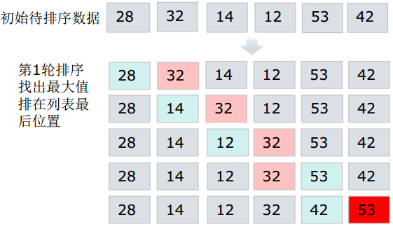
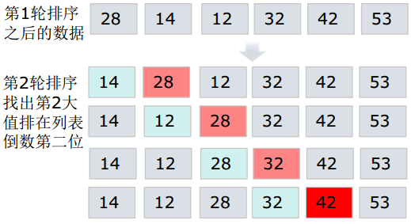
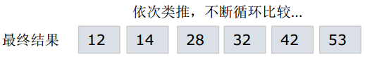
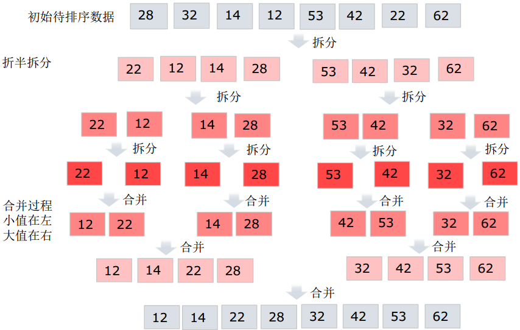

# 排序

* [返回上层目录](../application.md)
* [冒泡排序](#冒泡排序)
* [选择排序](#选择排序)
* [快速排序](#快速排序)
* [归并排序](#归并排序)

# 冒泡排序

- 原理
  - 循环遍历列表，每次循环找出本次循环最大的元素排在后边
  - 需要使用嵌套循环实现，外层循环控制总循环次数，内存循环负责每轮的循环比较（共n-1轮）







```python
'''
len(list) = n
轮数：n-1
每轮两两元素比较的次数为：n-1-i(i为预警排好序的元素个数，等于已经排序过的轮数)
'''
'''
参数：data_list：待排序的元素列表
'''
def bubble_sort(data_list):
    num = len(data_list) #待排序的元素个数
    for i in range(0, num-1):#控制总体轮数
        for j in range(0, num-1-i):
            if data_list[j] > data_list[j+1]:
                data_list[j], data_list[j+1] = data_list[j+1], data_list[j]
            print(data_list)

list = [28, 32, 14, 12, 53, 42]
bubble_sort(list)
print("----排序结果-----")
print(list)
# [12, 14, 28, 32, 42, 53]
```

# 选择排序

- 原理
  - 将待排序列表看成是已排序和未排序两部分
  - 每次从未排序列表中找出最小值，放到已排序列表末尾


```python
'''
带排序元素有n个，总共需要n-1轮排序
'''
def select_sort(data_list):
    list_len = len(data_list)
    # 控制排序轮数
    for i in range(list_len-1):
        # 初始假设的最小值脚标
        temp_min_index = i
        for j in range(i+1, list_len):
            if data_list[temp_min_index] > data_list[j]:
                # 更新临时最小值脚标
                temp_min_index = j
        # 如果初始假设最小值脚标和临时最小值脚标不等，
        # 则交换两个元素的位置。
        if i != temp_min_index:
            data_list[i], data_list[temp_min_index] = data_list[temp_min_index], data_list[i]

list = [28, 32, 14, 12, 53, 42]
select_sort(list)
print("----排序结果-----")
print(list)
# [12, 14, 28, 32, 42, 53]
```

# 快速排序

- 原理
  - 一次排序按照一个基准值将带排序的列表分割成两部分，基准值左边是比基准值小的元素，基准值邮编是比基准值大的元素
  - 按照上一步的方法对基准值左右两部分数据分别进行快速排序


```python
'''
基准值：默认带排序的第一个元素
使用临时变量存储基准值
高位游标，和低位游标，
'''
def quick_sort(data_list, start, end):
    # 结束递归标识
    if start >= end:
        return
    # 低位游标
    low_index = start
    # 高位游标
    high_index = end
    # 基准值
    basic_data = data_list[low_index]
    # 开始比较
    while low_index < high_index:
        # 如果高位游标指向的元素>=基准值，高位游标向左移动一位
        while low_index < high_index and data_list[high_index] >= basic_data:
            high_index -= 1

        if low_index != high_index:
            # 当高位游标指向的元素小于基准值
            data_list[low_index] = data_list[high_index]
            low_index += 1

        # 如果低位游标指向的元素<基准值，低位游标向右移动一位
        while low_index < high_index and data_list[low_index] < basic_data:
            low_index += 1

        if low_index != high_index:
            # 当低位游标指向的元素大于等于基准值
            data_list[high_index] = data_list[low_index]

    data_list[low_index] = basic_data
    # 对基准值左侧位置采用快速排序
    quick_sort(data_list, start, low_index-1)
    # 对基准值右侧位置采用快速排序
    quick_sort(data_list, high_index, end)
    high_index -= 1

list = [28, 32, 14, 12, 53, 42]
quick_sort(list, 0, len(list)-1)
print("----排序结果-----")
print(list)
```

# 归并排序

归并排序在大数据中经常用到。

- 原理
  - 先递归分解序列，再排序合并序列



```python
'''
归并排序
'''
def merge_sort(data_list):
    if len(data_list) <= 1:
        return data_list
    # 根据列表长度，确定拆分的中间位置
    mid_index = len(data_list) // 2
    left_list = merge_sort(data_list[:mid_index])
    right_list = merge_sort(data_list[mid_index:])
    return merge(left_list, right_list)

def merge(left_list, right_list):
    l_index = 0 # 左侧列表游标
    r_index = 0 # 右侧列表游标
    merge_list = []
    while l_index < len(left_list) and r_index < len(right_list):
        if left_list[l_index] < right_list[r_index]:
            merge_list.append(left_list[l_index])
            l_index += 1
        else:
            merge_list.append(right_list[r_index])
            r_index += 1
    if l_index < len(left_list):
        merge_list += left_list[l_index:]
    if r_index < len(right_list):
        merge_list += right_list[r_index:]
    return merge_list

list = [28, 32, 14, 12, 53, 42]
sorted_list = merge_sort(list)
print("----排序结果-----")
print(sorted_list)
# [12, 14, 28, 32, 42, 53]
```


