# TensorFlow基础概念解析

* [返回上层目录](../tensorflow1.0.md)
* [理解TensorFlow](#理解TensorFlow)
* [计算图](#计算图)
* [会话](#会话)
* [占位符和feed_dict](#占位符和feed_dict)
* [计算路径](#计算路径)
* [变量和副作用](#变量和副作用)
* [初始化器](#初始化器)
* [变量共享](#变量共享)
* [优化器](#优化器)
* [用tf.Print进行调试](#用tf.Print进行调试)
* [结论](#结论)


“我叫 Jacob，是谷歌 AI Residency 项目的学者。2017 年夏天我进入这个项目的时候，我自己的编程经验很丰富，对机器学习理解也很深刻，但以前我从未使用过 Tensorflow。当时我认为凭自己的能力可以很快掌握 Tensorflow，但没想到我学习它的过程竟然如此跌宕起伏。甚至加入项目几个月后我还偶尔会感到困惑，不知道怎样用 Tensorflow 代码实现自己的新想法。

这篇博文就像是我给过去自己写的瓶中信：回顾当初，我希望在开始学习的时候有这样一篇入门介绍。我也希望本文能够帮助同行，为他们提供参考。

过去的教程缺少哪些内容？

Tensorflow 发布已经有三年，如今它已成为深度学习生态系统的基石。然而对于初学者来说它并不怎么简单易懂，与 PyTorch 或 DyNet 这样的运行即定义的神经网络库相比就更明显了。

有很多 Tensorflow 的入门教程，内容涵盖线性回归、MNIST 分类乃至机器翻译。这些内容具体、实用的指南能帮助人们快速启动并运行 Tensorflow 项目，并且可以作为类似项目的切入点。但有的开发者开发的应用并没有很好的教程参考，还有的项目在探索全新的路线（研究中很常见），对于这些开发者来说入门 Tensorflow 是非常容易感到困惑的。

我写这篇文章就想弥补这一缺口。本文不会研究某个具体任务，而是提出更加通用的方法，并解析 Tensorflow 的基础抽象概念。掌握好这些概念后，用 Tensorflow 进行深度学习就会更加直观易懂。

目标受众

本教程适用于在编程和机器学习方面有一定经验，并想要入门 Tensorflow 的从业者。他们可以是：想在深度学习课程的最后一个项目中使用 Tensorflow 的 CS 专业学生；刚刚被调到涉及深度学习的项目的软件工程师；或者是一位处于困惑之中的 Google AI 新手（向 Jacob 大声打个招呼吧）。如果你需要基础知识入门，请参阅以下资源。这些都了解的话，我们就开始吧！

# 理解TensorFlow

> **Tensorflow 不是一个普通的 Python 库。**

大多数 Python 库被编写为 Python 的自然扩展形式。当你导入一个库时，你得到的是一组变量、函数和类，它们补充并扩展了你的代码“工具箱”。使用这些库时，你知道它们将产生怎样的结果。我认为谈及 Tensorflow 时应该抛弃这些认识，这些认知从根本上就不符合 Tensorflow 的理念，无法反映 TF 与其它代码交互的方式。

Python 和 Tensorflow 之间的联系，可以类比 Javascript 和 HTML 之间的关系。Javascript 是一种全功能的编程语言，可以实现各种出色的效果。HTML 是用于表示某种类型的实用计算抽象（这里指的是可由 Web 浏览器呈现的内容）的框架。Javascript 在交互式网页中的作用是组装浏览器看到的 HTML 对象，然后在需要时通过将其更新为新的 HTML 来与其交互。

与 HTML 类似，Tensorflow 是用于表示某种类型的计算抽象（称为“计算图”）的框架。当我们用 Python 操作 Tensorflow 时，我们用 Python 代码做的第一件事是组装计算图。之后我们的第二个任务就是与它进行交互（使用 Tensorflow 的“会话”）。但重要的是，要记住计算图不在变量内部，它处在全局命名空间内。莎士比亚曾经说过：“所有的 RAM 都是一个阶段，所有的变量都只不过是指针。”

# 计算图

第一个关键抽象：计算图

我们在浏览 Tensorflow 文档时，有时会发现内容提到“图形”和“节点”。如果你仔细阅读、深入挖掘，甚至可能已经发现了这个页面，该页面中涵盖的内容我将以更精确和技术化的风格详细解释。本节将从顶层入手，把握关键的直觉概念，同时略过一些技术细节。

那么什么是计算图？它实质上是一个全局数据结构：计算图是一个有向图，捕获有关计算方法的指令。

我们来看看如何构建一个示例。下图中，上半部分是我们运行的代码和它的输出，下半部分是结果计算图。

代码：

```python
import tensorflow as tf
```

Graph:


显然，仅仅导入 Tensorflow 并不会给我们生成一个有趣的计算图，而只有一个孤独的，空白的全局变量。但是当我们调用一个 Tensorflow 操作时会发生什么呢？

```python
import tensorflow as tf
two_node = tf.constant(2)
print(two_node)
```

输出：

```python
Tensor("Const:0", shape=(), dtype=int32)
```

Graph:

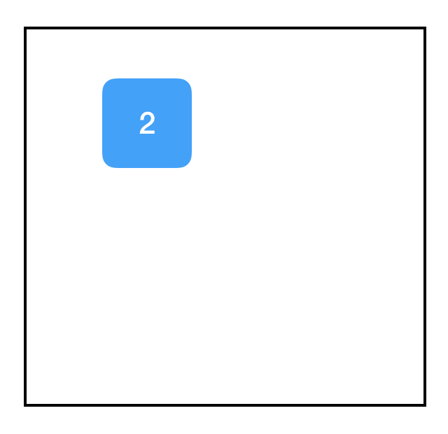

快看！我们得到了一个节点，它包含常量：2。我知道你很惊讶，惊讶的是一个名为 tf.constant 的函数。当我们打印这个变量时，我们看到它返回一个 tf.Tensor 对象，它是一个指向我们刚创建的节点的指针。为了强调这一点，这里是另一个例子：

```python
import tensorflow as tf
two_node = tf.constant(2)
another_two_node = tf.constant(2)
two_node = tf.constant(2)
tf.constant(3)
```

Graph：

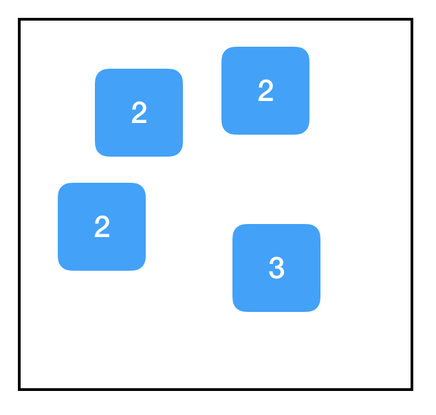

**每次我们调用 tf.constant 的时候，我们都会在图中创建一个新节点**。即使节点在功能上与现有节点完全相同，即使我们将节点重新分配给同一个变量，甚至我们根本没有将其分配给变量，结果都一样。

相反，如果创建一个新变量并将其设置为与现有节点相等，则只需将该指针复制到该节点，并且不会向该图添加任何内容：

```python
import tensorflow as tf
two_node = tf.constant(2)
another_pointer_at_two_node = two_node
two_node = None
print(two_node)
print(another_pointer_at_two_node)
```

输出：

```python
None
Tensor("Const:0", shape=(), dtype=int32)
```

Graph:


好的，我们更进一步。

```python
import tensorflow as tf
two_node = tf.constant(2)
three_node = tf.constant(3)
sum_node = two_node + three_node  
# equivalent to tf.add(two_node, three_node)
```

Graph:


现在我们来看——这才是我们要的真正的计算图表！请注意，+ 操作在 Tensorflow 中过载，所以同时添加两个张量会在图中增加一个节点，尽管它看起来不像是 Tensorflow 操作。

好的，所以 two_node 指向包含 2 的节点，three_node 指向包含 3 的节点，而 sum_node 指向包含... + 的节点？什么情况？它不是应该包含 5 吗？

事实证明，没有。**计算图只包含计算步骤，不包含结果**。至少...... 还没有！

# 会话

第二个关键抽象：会话

如果错误地理解 TensorFlow 抽象也有个疯狂三月竞赛（美国大学篮球繁忙冠军赛季），那么“会话”将成为每年排名第一的种子选手。能获此尴尬的荣誉，是因为会话的命名反直觉，应用却如此广泛——几乎每个 Tensorflow 程序都至少会调用一次 tf.Session() 。

**会话的作用是处理内存分配和优化，使我们能够实际执行由图形指定的计算**。可以将计算图想象为我们想要执行的计算的“模板”：它列出了所有的步骤。**为了使用这个图表，我们还需要发起一个会话，它使我们能够实际地完成任务**。例如，遍历模板的所有节点来分配一组用于存储计算输出的存储器。**为了使用 Tensorflow 进行各种计算，我们既需要图也需要会话**。

会话包含一个指向全局图的指针，该指针通过指向所有节点的指针不断更新。这意味着在创建节点之前还是之后创建会话都无所谓。

创建会话对象后，可以使用 sess.run(node) 返回节点的值，并且 Tensorflow 将执行确定该值所需的所有计算。

```python
import tensorflow as tf
two_node = tf.constant(2)
three_node = tf.constant(3)
sum_node = two_node + three_node
sess = tf.Session()
print(sess.run(sum_node))
```

输出：

```
5
```

Graph：

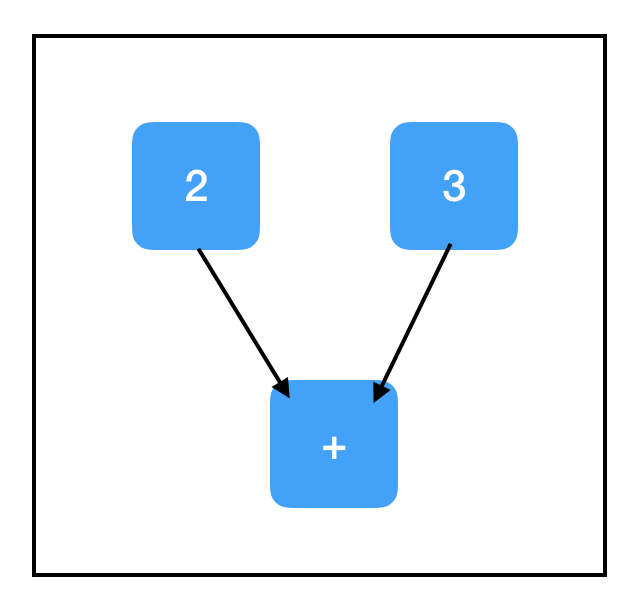

精彩！我们还可以传递一个列表，sess.run([node1，node2，...])，并让它返回多个输出：

```python
import tensorflow as tf
two_node = tf.constant(2)
three_node = tf.constant(3)
sum_node = two_node + three_node
sess = tf.Session()
print(sess.run([two_node, sum_node]))
```

输出：

```python
[2, 5]
```

Graph:


一般来说，**sess.run() 调用往往是最大的 TensorFlow 瓶颈之一，所以调用它的次数越少越好。可以的话在一个 sess.run() 调用中返回多个项目，而不是进行多个调用**。

# 占位符和feed_dict

我们迄今为止所做的计算一直很乏味：没有机会获得输入，所以它们总是输出相同的东西。一个实用的应用可能涉及构建这样一个计算图：它接受输入，以某种（一致）方式处理它，并返回一个输出。

最直接的方法是使用占位符。占位符是一种用于接受外部输入的节点。

```python
import tensorflow as tf
input_placeholder = tf.placeholder(tf.int32)
sess = tf.Session()
print(sess.run(input_placeholder))
```

输出：

```python
Traceback (most recent call last):
...
InvalidArgumentError (see above for traceback): You must feed a value for placeholder tensor 'Placeholder' with dtype int32
	 [[Node: Placeholder = Placeholder[dtype=DT_INT32, shape=<unknown>, _device="/job:localhost/replica:0/task:0/device:CPU:0"]()]]
```

Graph:

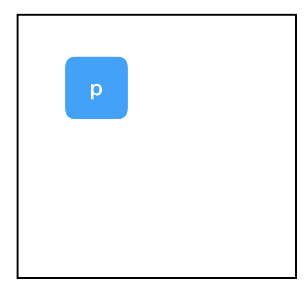

……这是个糟糕的例子，因为它引发了一个异常。占位符预计会被赋予一个值，但我们没有提供，因此 Tensorflow 崩溃了。

为了提供一个值，我们使用 sess.run() 的 feed_dict 属性。

```python
import tensorflow as tf
input_placeholder = tf.placeholder(tf.int32)
sess = tf.Session()
print(sess.run(input_placeholder, feed_dict={input_placeholder: 2}))
```

输出：

```
2
```

Graph:


好多了。注意传递给 feed_dict 的数值格式。这些键应该是与图中占位符节点相对应的变量（如前所述，它实际上意味着指向图中占位符节点的指针）。相应的值是要分配给每个占位符的数据元素——通常是标量或 Numpy 数组。

# 计算路径

第三个关键抽象：计算路径下面是另一个使用占位符的例子：

```python
import tensorflow as tf
input_placeholder = tf.placeholder(tf.int32)
three_node = tf.constant(3)
sum_node = input_placeholder + three_node
sess = tf.Session()
print(sess.run(three_node))
print(sess.run(sum_node))
```

输出：

```python
3

Traceback (most recent call last):
...
InvalidArgumentError (see above for traceback): You must feed a value for placeholder tensor 'Placeholder_2' with dtype int32
	 [[Node: Placeholder_2 = Placeholder[dtype=DT_INT32, shape=<unknown>, _device="/job:localhost/replica:0/task:0/device:CPU:0"]()]]
```

Graph:

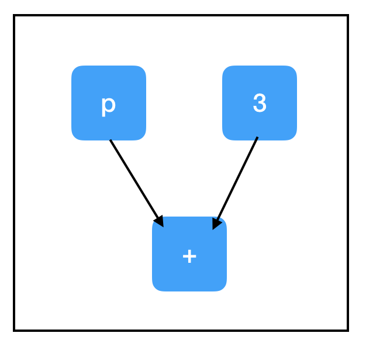

为什么第二次调用 sess.run() 会失败？我们并没有在检查 input_placeholder，为什么会引发与 input_placeholder 相关的错误？答案在于最终的关键 Tensorflow 抽象：计算路径。还好这个抽象非常直观。

当我们在依赖于图中其他节点的节点上调用 sess.run() 时，我们也需要计算这些节点的值。如果这些节点有依赖关系，那么我们需要计算这些值（依此类推......），直到达到计算图的“顶端”，也就是所有的节点都没有前置节点的情况。

考察 sum_node 的计算路径：

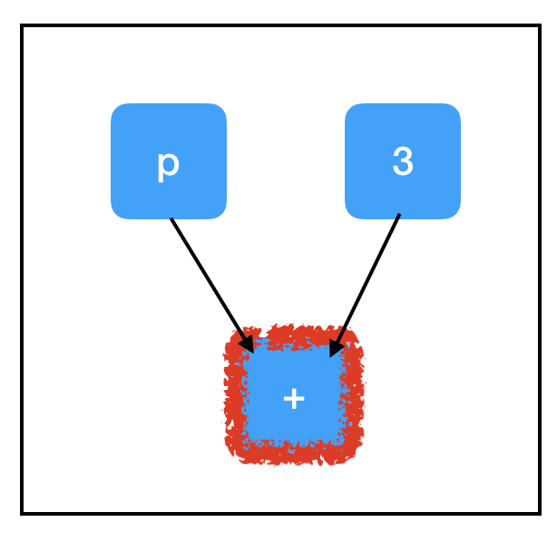

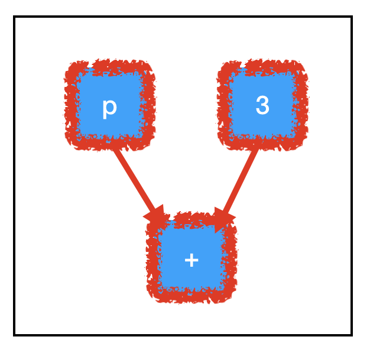

所有三个节点都需要评估以计算 sum_node 的值。最重要的是，这里面包含了我们未填充的占位符，并解释了例外情况！

相反，考察 three_node 的计算路径：

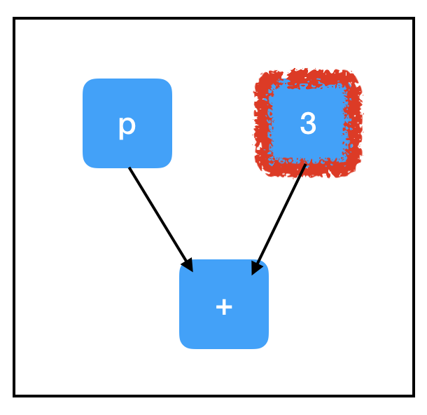

根据图的结构，我们不需要计算所有的节点也可以评估我们想要的节点！因为我们不需要评估 placeholder_node 来评估 three_node，所以运行 sess.run(three_node) 不会引发异常。

**Tensorflow 仅通过必需的节点自动路由计算这一事实是它的巨大优势**。如果计算图非常大并且有许多不必要的节点，它就能节约大量运行时间。它允许我们构建大型的“多用途”图形，这些图形使用单个共享的核心节点集合根据采取的计算路径来做不同的任务。对于几乎所有应用程序而言，根据所采用的计算路径考虑 sess.run() 的调用方法是很重要的。

# 变量和副作用

到目前为止，我们已经看到两种类型的“无祖先”节点：tf.constant（每次运行都一样）和 tf.placeholder（每次运行都不一样）。还有第三种节点：通常情况下具有相同的值，但也可以更新成新值。这个时候就要用到变量。

了解变量对于使用 Tensorflow 进行深度学习来说至关重要，因为模型的参数就是变量。在训练期间，你希望通过梯度下降在每个步骤更新参数，但在计算过程中，你希望保持参数不变，并将大量不同的测试输入集传入到模型中。模型所有的可训练参数很有可能都是变量。

要创建变量，请使用 tf.get_variable()。tf.get_variable() 的前两个参数是必需的，其余是可选的。它们是 tf.get_variable(name,shape）。name 是一个唯一标识这个变量对象的字符串。它在全局图中必须是唯一的，所以要确保不会出现重复的名称。shape 是一个与张量形状相对应的整数数组，它的语法很直观——每个维度对应一个整数，并按照排列。例如，一个 3×8 的矩阵可能具有形状 [3,8]。要创建标量，请使用空列表作为形状：[]。

```python
import tensorflow as tf
count_variable = tf.get_variable("count", [])
sess = tf.Session()
print(sess.run(count_variable))
```

输出：

```python
Traceback (most recent call last):
...
tensorflow.python.framework.errors_impl.FailedPreconditionError: Attempting to use uninitialized value count
	 [[Node: _retval_count_0_0 = _Retval[T=DT_FLOAT, index=0, _device="/job:localhost/replica:0/task:0/device:CPU:0"](count)]]
```

Graph:


发现另一个异常。一个变量节点在首次创建时，它的值基本上就是“null”，任何尝试对它进行计算的操作都会抛出这个异常。我们只能先给一个变量赋值后才能用它做计算。有两种主要方法可以用于给变量赋值：初始化器和 tf.assign()。我们先看看 tf.assign()：

```python
import tensorflow as tf
count_variable = tf.get_variable("count", [])
zero_node = tf.constant(0.)
assign_node = tf.assign(count_variable, zero_node)
sess = tf.Session()
print(sess.run(assign_node))
print(sess.run(count_variable))
```

输出：

```
0.0
0.0
```

Graph:

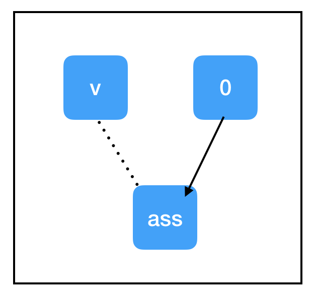

与我们迄今为止看到的节点相比，tf.assign(target,value) 有一些独特的属性：

- 标识操作。tf.assign(target,value) 不做任何计算，它总是与 value 相等。
- 副作用。当计算“流经”assign_node 时，就会给图中的其他节点带来副作用。在这种情况下，副作用就是用保存在 zero_node 中的值替换 count_variable 的值。
- 非依赖边。即使 count_variable 节点和 assign_node 在图中是相连的，但并不互相依赖。这意味着在计算任一节点时，计算不会通过该边回流。不过，assign_node 依赖 zero_node，它需要知道要分配什么。

“副作用”节点充斥在大部分 Tensorflow 深度学习工作流中，因此，请确保你对它们了解得一清二楚。当我们调用 sess.run(assign_node) 时，计算路径将经过 assign_node 和 zero_node。

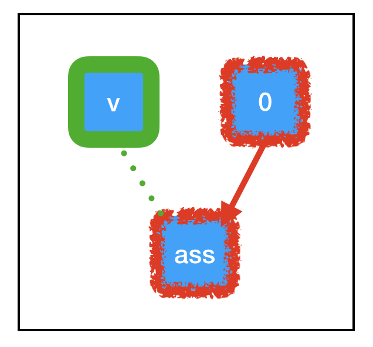

当计算流经图中的任何节点时，它还会让该节点控制的副作用（绿色所示）起效。由于 tf.assign 的特殊副作用，与 count_variable（之前为“null”）关联的内存现在被永久设置为 0。这意味着，当我们下一次调用 sess.run(count_variable) 时，不会抛出任何异常。相反，我们将得到 0。

# 初始化器

接下来，让我们来看看初始化器：

```python
import tensorflow as tf
const_init_node = tf.constant_initializer(0.)
count_variable = tf.get_variable("count", [], initializer=const_init_node)
sess = tf.Session()
print(sess.run([count_variable]))
```

输出：

```python
Traceback (most recent call last):
...
tensorflow.python.framework.errors_impl.FailedPreconditionError: Attempting to use uninitialized value count
	 [[Node: _retval_count_0_0 = _Retval[T=DT_FLOAT, index=0, _device="/job:localhost/replica:0/task:0/device:CPU:0"](count)]]
```

Graph:

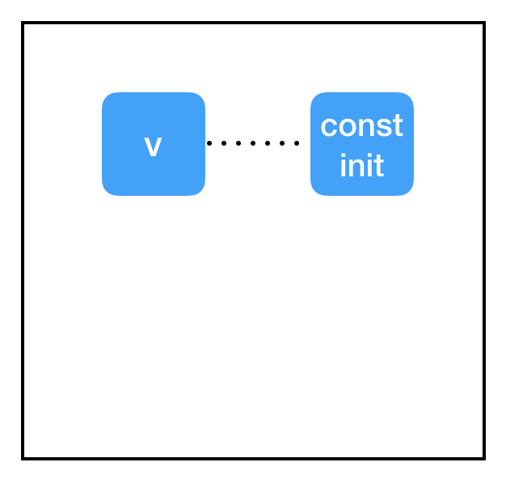

这里都发生了什么？为什么初始化器不起作用？

问题在于**会话和图之间的分隔**。我们已经将 get_variable 的 initializer 属性指向 const_init_node，但它只是在图中的节点之间添加了一个新的连接。我们还没有做任何与导致异常有关的事情：与变量节点（保存在会话中，而不是图中）相关联的内存仍然为“null”。我们需要通过会话让 const_init_node 更新变量。

```python
import tensorflow as tf
const_init_node = tf.constant_initializer(0.)
count_variable = tf.get_variable("count", [], initializer=const_init_node)
init = tf.global_variables_initializer()
sess = tf.Session()
sess.run(init)
print(sess.run(count_variable))
```

输出：

```python
0.0
```

Graph:

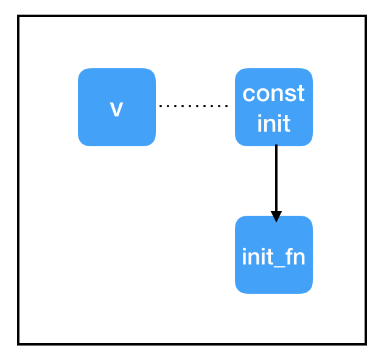

为此，我们添加了另一个特殊节点：init = tf.global_variables_initializer()。与 tf.assign() 类似，这是一个带有副作用的节点。与 tf.assign() 不一样的是，我们实际上并不需要指定它的输入！tf.global_variables_initializer() 将在其创建时查看全局图，自动将依赖关系添加到图中的每个 tf.initializer 上。当我们调用 sess.run(init) 时，它会告诉每个初始化器完成它们的任务，初始化变量，这样在调用 sess.run(count_variable) 时就不会出错。

# 变量共享

你可能会碰到带有变量共享的 Tensorflow 代码，代码有它们的作用域，并设置“reuse=True”。我强烈建议你不要在代码中使用变量共享。如果你想在多个地方使用单个变量，只需要使用指向该变量节点的指针，并在需要时使用它。换句话说，对于打算保存在内存中的每个参数，应该只调用一次 tf.get_variable()。

# 优化器

最后：进行真正的深度学习！如果你还在状态，那么其余的概念对于你来说应该是非常简单的。

在深度学习中，典型的“内循环”训练如下：

- 获取输入和 true_output
- 根据输入和参数计算出一个“猜测”
- 根据猜测和 true_output 之间的差异计算出一个“损失”
- 根据损失的梯度更新参数

让我们把所有东西放在一个脚本里，解决一个简单的线性回归问题：

```python
import tensorflow as tf
import random

# build the graph
# first set up the parameters
m = tf.get_variable("m", [], initializer=tf.constant_initializer(0.))
b = tf.get_variable("b", [], initializer=tf.constant_initializer(0.))
init = tf.global_variables_initializer()

# then set up the computations
input_placeholder = tf.placeholder(tf.float32)
output_placeholder = tf.placeholder(tf.float32)

x = input_placeholder
y = output_placeholder
y_guess = m * x + b

loss = tf.square(y - y_guess)

# finally, set up the optimizer and minimization node
optimizer = tf.train.GradientDescentOptimizer(1e-3)
train_op = optimizer.minimize(loss)

# start the session
sess = tf.Session()
sess.run(init)

# #### perform the training loop ##############

# set up problem
true_m = random.random()
true_b = random.random()

for update_i in range(100000):
    # (1) get the input and output
    input_data = random.random()
    output_data = true_m * input_data + true_b

    # (2), (3), and (4) all take place within a single call to sess.run()!
    _loss, _ = sess.run([loss, train_op], feed_dict={input_placeholder: input_data, output_placeholder: output_data})
    print(update_i, _loss)

# finally, print out the values we learned for our two variables
print("True parameters:     m=%.4f, b=%.4f" % (true_m, true_b))
print("Learned parameters:  m=%.4f, b=%.4f" % tuple(sess.run([m, b])))
```

输出：

```python
0 2.3205383
1 0.5792742
2 1.55254
3 1.5733259
4 0.6435648
5 2.4061265
6 1.0746256
7 2.1998715
8 1.6775116
9 1.6462423
10 2.441034
...
99990 2.9878322e-12
99991 5.158629e-11
99992 4.53646e-11
99993 9.422685e-12
99994 3.991829e-11
99995 1.134115e-11
99996 4.9467985e-11
99997 1.3219648e-11
99998 5.684342e-14
99999 3.007017e-11
True parameters:     m=0.3519, b=0.3242
Learned parameters:  m=0.3519, b=0.3242
```

正如你所看到的，损失基本上没有变化，而且我们对真实参数有了很好的估计。这部分代码只有一两行对你来说是新的：

```python
# finally, set up the optimizer and minimization node
optimizer = tf.train.GradientDescentOptimizer(1e-3)
train_op = optimizer.minimize(loss)
```

既然你对 Tensorflow 的基本概念已经有了很好的理解，这段代码应该很容易解释！第一行，optimizer = tf.train.GradientDescentOptimizer(1e-3) 不会向图中添加节点。它只是创建了一个 Python 对象，包含了一些有用的函数。第二行 train_op = optimizer.minimize(loss)，将一个节点添加到图中，并将一个指针赋给 train_op。train_op 节点没有输出，但有一个非常复杂的副作用：

train_op 回溯其输入的计算路径，寻找变量节点。对于找到的每个变量节点，它计算与损失相关的变量梯度。然后，它为该变量计算新值：当前值减去梯度乘以学习率。最后，它执行一个赋值操作来更新变量的值。

基本上，**当我们调用 sess.run(train_op) 时，它为我们对所有的变量做了一个梯度下降的操作**。当然，我们还需要使用 feed_dict 来填充输入和输出占位符，并且我们还希望打印这些损失，因为这样方便调试。

# 用tf.Print进行调试

当你开始使用 Tensorflow 做更复杂的事情时，你需要进行调试。一般来说，检查计算图中发生了什么是很困难的。你不能使用常规的 Python 打印语句，因为你永远无法访问到要打印的值——它们被锁定在 sess.run() 调用中。举个例子，假设你想检查一个计算的中间值，在调用 sess.run() 之前，中间值还不存在。但是，当 sess.run() 调用返回时，中间值不见了！

我们来看一个简单的例子。

```python
import tensorflow as tf
two_node = tf.constant(2)
three_node = tf.constant(3)
sum_node = two_node + three_node
sess = tf.Session()
print(sess.run(sum_node))
```

输出：

```python
5
```

我们看到了结果是 5。但是，如果我们想检查中间值 two_node 和 three_node，该怎么办？检查中间值的一种方法是向 sess.run() 添加一个返回参数，该参数指向要检查的每个中间节点，然后在返回后打印它。

```python
import tensorflow as tf
two_node = tf.constant(2)
three_node = tf.constant(3)
sum_node = two_node + three_node
sess = tf.Session()
answer, inspection = sess.run([sum_node, [two_node, three_node]])
print(inspection)
print(answer)
```

输出：

```python
[2, 3]
5
```

这样做通常没有问题，但当代码变得越来越复杂时，这可能有点尴尬。

更方便的方法是使用 tf.Print 语句。令人困惑的是，tf.Print 实际上是 Tensorflow 的一种节点，它有输出和副作用！它有两个必需的参数：一个要复制的节点和一个要打印的内容列表。“要复制的节点”可以是图中的任何节点，tf.Print 是与“要复制的节点”相关的标识操作，也就是说，它将输出其输入的副本。不过，它有个副作用，就是会打印“打印清单”里所有的值。

```python
import tensorflow as tf
two_node = tf.constant(2)
three_node = tf.constant(3)
sum_node = two_node + three_node
print_sum_node = tf.Print(sum_node, [two_node, three_node])
sess = tf.Session()
print(sess.run(print_sum_node))
```

输出：

```python
[2][3]
5
```

Graph:

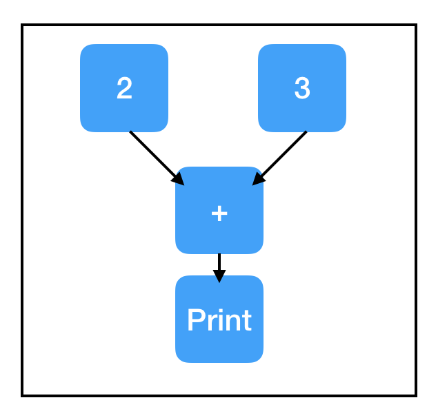

有关 tf.Print 的一个重要却有些微妙的点：打印其实只是它的一个副作用。与所有其他副作用一样，只有在计算流经 tf.Print 节点时才会进行打印。如果 tf.Print 节点不在计算路径中，则不会打印任何内容。即使 tf.Print 节点所复制的原始节点就位于计算路径上，但 tf.Print 节点本身可能并米有位于计算路径上。这个问题要注意！当这种情况发生时，它会让你感到非常沮丧，你需要费力地找出问题所在。一般来说，最好在创建要复制的节点后立即创建 tf.Print 节点。

```python
import tensorflow as tf
two_node = tf.constant(2)
three_node = tf.constant(3)
sum_node = two_node + three_node
# this new copy of two_node is not on the computation path, so nothing prints!
print_two_node = tf.Print(two_node, [two_node, three_node, sum_node])
sess = tf.Session()
print(sess.run(sum_node))
```

输出：

```python
5
```

Graph:


这里（https://wookayin.github.io/tensorflow-talk-debugging/#1）有一个很好的资源，提供了更多实用的调试建议。

# 结论

希望这篇文章能够帮助你更好地理解Tensorflow，了解它的工作原理以及如何使用它。毕竟，这里介绍的概念对所有 Tensorflow 程序来说都很重要，但这些还都只是表面上的东西。在你的 Tensorflow 探险之旅中，你可能会遇到各种你想要使用的其他有趣的东西：条件、迭代、分布式 Tensorflow、变量作用域、保存和加载模型、多图、多会话和多核数据加载器队列等。

原文链接：

https://jacobbuckman.com/post/tensorflow-the-confusing-parts-1/#understanding-tensorflow


# 参考资料

* [这是我看过解释TensorFlow最透彻的文章！](https://juejin.im/post/5b345a49f265da599c561b25)

本文主要参考这篇博客。

===

[Tensorflow中的图（tf.Graph）和会话（tf.Session）](http://looop.cn/?p=3365)

