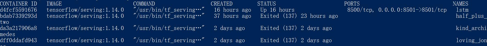
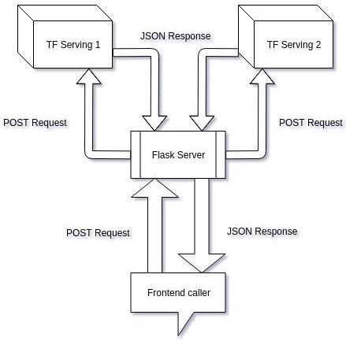

# TensorFlow Serving

- [返回上层目录](../tensorflow.md)

# TFserving介绍

TensorFlow服务是你训练应用机器学习模型的方式。

TensorFlow服务使得投入生产的过程模型更容易、更快速。它允许你安全地部署新模型并运行实验，同时保持相同的服务器体系结构和API。开箱即用，它提供了与TensorFlow的集成，而且它可以扩展为其他类型的模型。


大家习惯使用TensorFlow进行模型的训练、验证和预测，但模型完善之后的生产上线流程，就变得五花八门了。针对这种情况Google提供了TensorFlow Servering，可以将训练好的模型直接上线并提供服务。在2017年的TensorFlow开发者Summit上便提出了TensorFlow Serving。

但那时候客户端和服务端的通信只支持gRPC。在实际的生产环境中比较广泛使用的C/S通信手段是基于RESTfull API的，幸运的是从TF1.8以后，TF Serving也正式支持RESTfull API通信方式了。

* 用什么来部署：当然是TFserving

* 怎么提供api接口：TFserving有提供restful api接口，现实部署时会在前面再加一层如flask api

* 多个模型GPU资源如何分配：TFserving支持部署多模型，通过配置

* 线上模型如何更新而服务不中断：TFserving支持模型的不同的版本，如your_model中1和2两个版本，当你新增一个3模型时，TFserving会自动判断，自动加载模型3为当前模型，不需要重启

# 安装Docker

## win10安装

对于win10环境，需要[Docker Desktop for Windows](https://hub.docker.com/editions/community/docker-ce-desktop-windows)，点击`get docker`进行下载，大约500MB。

注意，win10家庭版要升级到专业版，否则无法安装，可让淘宝帮助升级。


然后进行安装。这样就安装好了docker了。

win10的docker是基于hyper-v的，但是开启了hyper-v，就无法打开其他虚拟机，比如vmware。如果要关闭hyper-v虚拟机，则运行

```shell
Disable-WindowsOptionalFeature -Online -FeatureName Microsoft-Hyper-V-Hypervisor
```

## linux安装

安装docker：

```shell
sudo apt install docker.io
```

需要下载的文件有近300M大小，所以如果下载速度很慢，就将apt换成国内的源（具体参考[Ubuntu使用apt-get下载速度慢的解决方法](https://blog.csdn.net/qq_24326765/article/details/81916222)）。

后续的docker的linux命令，前面都要加sudo。

关于docker的一些命令：[Docker在Linux下载安装及部署](https://blog.csdn.net/qq_35139965/article/details/109475695)。

# 拉取 tf.Serving镜像

打开`powershell`，然后这里我们选择tensorflow 1.14.0版本的镜像。

```shell
docker pull tensorflow/serving:1.14.0
```


如果下载错了，可以这样删除：

```shell
docker rmi tensorflow/serving:1.14.0
```

# 运行容器

上述准备工作完成后可以运行容器：

对于RESTful，使用8501端口（如下所示）：

```shell
docker run -p 8501:8501 --name="lstm" --mount type=bind,source=D:\code\PycharmProject\tf_model\sentiment-analysis\v1_lstm_csv\saved_model,target=/models/lstm -e MODEL_NAME=lstm -t tensorflow/serving:1.14.0 "&"
```

而如果使用gRPC请求预测，则需将下面的8501改成8500端口：

```shell
docker run -p 8500:8500 --name="lstm" --mount type=bind,source=D:\code\PycharmProject\tf_model\sentiment-analysis\v1_lstm_csv\saved_model,target=/models/lstm -e MODEL_NAME=lstm -t tensorflow/serving:1.14.0 "&"
```

上面的命令中：

* `-p 8501:8501`是端口映射，是将容器的8501端口映射到宿主机的8501端口，后面预测的时候使用该端口；
* `-e MODEL_NAME=lstm` 设置模型名称；
* `--mount type=bind,source=D:\xxx\v1_lstm_csv\saved_model,target=/models/lstm` 是将宿主机的路径D:\xxx\v1_lstm_csv\saved_model挂载到容器的/models/lstm下。D:\xxx\v1_lstm_csv\saved_model是存放的是上述准备工作中保存的模型文件，在D:\xxx\v1_lstm_csv\saved_model下新建一个以数字命名的文件夹，如100001，并将模型文件（包含一个.pb文件和一个variables文件夹）放到该文件夹中。容器内部会根据绑定的路径读取模型文件；
* `-t tensorflow/serving:1.14.0` 根据名称“tensorflow/serving:1.14.0”运行容器；

注意：上面的`source=D:\code\xxx\v1_lstm_csv\saved_model`里的模型，是一个中文评论情感分类的模型，可以直接在github上下载：[linguishi/**chinese_sentiment**](https://github.com/linguishi/chinese_sentiment/tree/master/model/lstm/saved_model)，要将包含模型数据的数字名字的文件夹放在`D:\code\xxx\v1_lstm_csv\saved_model`路径下，因为docker会自动找最新的数字文件夹名进行加载。


此外，如果想停止tfserving服务或者删除同名服务，则

停掉tfserving服务

先找到Docker容器进程：

> docker ps
>
> 或者更精确一点：docker ps | grep "tensorflow/serving"

输出：



第一列为container id，干掉它即可：

```shell
docker kill d4fcf5591676
```

删除该任务的话，需要输入：

```shell
docker rm d4fcf5591676
```

# 通过API查看模型状态，元数据

## 通过model status API 查看模型状态

```shell
curl http://localhost:8501/v1/models/lstm
```

可得

> {
>  "model_version_status": [
>   {
>    "version": "1609392632",
>    "state": "AVAILABLE",
>    "status": {
>     "error_code": "OK",
>     "error_message": ""

## 通过model metadata API 查看模型的元数据

```
curl http://localhost:8501/v1/models/lstm/metadata
```

可得

> {
> "model_spec":{
>  "name": "lstm",
>  "signature_name": "",
>  "version": "1609392632"
> }
> ,
> "metadata": {"signature_def": {
>  "signature_def": {
>   "serving_default": {
>    "inputs": {
>     "nwords": {
>      "dtype": "DT_INT32",
>      "tensor_shape": {
>       "dim": [
>        {
>         "size": "-1",
>         "name": ""
>        }
>       ],
>       "unknown_rank": false
>      },
>      "name": "nwords:0"
>     },
>     "words": {
>      "dtype": "DT_STRING",
>      "tensor_shape": {
>       "dim": [
>        {
>         "size": "-1",
>         "name": ""
>        },
>        {
>         "size": "-1",
>         "name": ""
>        }
>       ],
>       "unknown_rank": false
>      },
>      "name": "words:0"
>     }
>    },
>    "outputs": {
>     "labels": {
>      "dtype": "DT_STRING",
>      "tensor_shape": {
>       "dim": [
>        {
>         "size": "-1",
>         "name": ""
>        }
>       ],
>       "unknown_rank": false
>      },
>      "name": "index_to_string_Lookup:0"
>     },
>     "classes_id": {
>      "dtype": "DT_INT64",
>      "tensor_shape": {
>       "dim": [
>        {
>         "size": "-1",
>         "name": ""
>        }
>       ],
>       "unknown_rank": false
>      },
>      "name": "ArgMax:0"
>     },
>     "softmax": {
>      "dtype": "DT_FLOAT",
>      "tensor_shape": {
>       "dim": [
>        {
>         "size": "-1",
>         "name": ""
>        },
>        {
>         "size": "3",
>         "name": ""
>        }
>       ],
>       "unknown_rank": false
>      },
>      "name": "Softmax:0"
>     }
>    },
>    "method_name": "tensorflow/serving/predict"

我们就知道了模型的`signature_def`的名字（即`serving_default`），输入`inputs`的名称（即`nwords`和`words`），还有输出`outputs`的名称（即`classes_id`、`labels`和`softmax`）。这些名字在随后的tf_serving代码中是要用到的。

或者还可以使用`saved_model_cli`命令行：

```shell
saved_model_cli show --all --dir D:\code\PycharmProject\tf_model\sentiment-analysis\v1_lstm_csv\saved_model\1609392632
```

来获取模型的`signature_def`的名字（即`serving_default`），输入`inputs`的名称（即`nwords`和`words`），还有输出`outputs`的名称（即`classes_id`、`labels`和`softmax`）。这些名字在随后的tf_serving代码中是要用到的。

>MetaGraphDef with tag-set: 'serve' contains the following SignatureDefs:
>
>signature_def['serving_default']:
>  The given SavedModel SignatureDef contains the following input(s):
>    inputs['nwords'] tensor_info:
>        dtype: DT_INT32
>        shape: (-1)
>        name: nwords:0
>    inputs['words'] tensor_info:
>        dtype: DT_STRING
>        shape: (-1, -1)
>        name: words:0
>  The given SavedModel SignatureDef contains the following output(s):
>    outputs['classes_id'] tensor_info:
>        dtype: DT_INT64
>        shape: (-1)
>        name: ArgMax:0
>    outputs['labels'] tensor_info:
>        dtype: DT_STRING
>        shape: (-1)
>        name: index_to_string_Lookup:0
>    outputs['softmax'] tensor_info:
>        dtype: DT_FLOAT
>        shape: (-1, 3)
>        name: Softmax:0
>  Method name is: tensorflow/serving/predict

# gRPC与RESTful请求的区别

* **gRPC**

  gRPC是一个高性能、开源和通用的RPC框架，面向服务端和移动端，基于HTTP/2设计。

  RPC(remote procedure call远程过程调用)框架目标就是让远程服务调用更加简单、透明。RPC框架负责屏蔽底层的传输方式（TCP或者UDP）、序列化方式（XML/Json/二进制）和通信细节。服务调用者可以像调用本地接口一样调用远程的服务提供者，而不需要关心底层通信细节和调用过程。

  gRPC的g是google，意思是google开发的。

* **RESTful**

  REST（Representational State Transfer）表现层状态转换，RESTful一般是采用http+JSON实现的架构。

* gRPC与RESTful API的**区别**

  **RESTful API**通常使用JSON或XML的格式传输信息，比较通俗易懂，但文本格式序列化性能较差；

  **gRPC**对接口有严格的约束条件，安全性更高，对于高并发的场景更适用。

  gRPC是HTTP/2协议，REST API是HTTP/1协议

# 使用RESTful API请求预测

第一种方式是命令行下使用**curl**请求预测：

```shell
curl -Body '{"instances":[{"words": ["\u5f88", "\u559c\u6b22"], "nwords": 2}]}' -Uri http://localhost:8501/v1/models/lstm:predict -Method 'POST'
```

返回结果：

```shell
Content: {
    "predictions": [
        {
            "softmax": [0.00012, 0.99938, 0.00049],
            "labels": "POS",
            "classes_id": 1
        }
    ]
}
```

这种比较简单，但是遇到稍微复杂的情况就不方便处理。比如上面的`["\u5f88", "\u559c\u6b22"]`其实是`['很', '喜欢']`的字符。这是因为RESTful接受的数据必须是json格式，而json格式就需要把中文转成unicode格式，不然得出的结果就是错的。

如果机器有公网IP（如将tfsevring部署在阿里云服务器上），则可以在其他机器上通过IP地址访问进行预测，将上面的地址中的localhost改为运行容器的机器的公网IP地址即可。

第二种方式是使用**Python代码**请求预测：

```python
from __future__ import print_function
import base64
import requests
import json
import numpy as np

# grpc vs RESTful
# 代码来自 https://medium.com/tensorflow/serving-ml-quickly-with-tensorflow-serving-and-docker-7df7094aa008

# The server URL specifies the endpoint of your server running the lstm
# model with the name "lstm" and using the predict interface.
SERVER_URL = ' http://localhost:8501/v1/models/lstm:predict'


def main():
    # 数字
    # predict_request = '{"instances" : [1.0, 2.0, 5.0]}'  # for example half_plus_two
    # 文本
    predict_request = {
        #"signature_name": "serving_default",  # 这个可加可不加
        # 单个：
        # "instances": [{"words": words, "nwords": nwords}]
        # 同时输入多个：
        "instances": [{"words": ["很", "喜欢"], "nwords": 2}, {"words": ["很", "垃圾"], "nwords": 2}]

    }
    print("请求文本的原始格式 predict_request = {}".format(predict_request))

    # json.dumps在默认情况下，对于非ascii字符生成的是相对应的字符编码，而非原始字符
    predict_request = json.dumps(predict_request)
    print("请求文本的json格式 predict_request = {}".format(predict_request))

    # Send few actual requests and report average latency.
    total_time = 0
    # 发送请求
    response = requests.post(SERVER_URL, data=predict_request)
    response.raise_for_status()  # assert response.status_code == 200, "http request error!"
    total_time += response.elapsed.total_seconds()
    prediction = response.json()['predictions']
    for i in range(len(prediction)):
        prediction_i = prediction[i]
        print("第{}个：labels = {}, 详细信息 = {}".format(i, prediction_i["labels"], prediction_i))
    print('latency: {} ms'.format(total_time*1000))


if __name__ == '__main__':
    main()
```

结果为:

```
请求文本的原始格式 predict_request = {'instances': [{'words': ['很', '喜欢'], 'nwords': 2}, {'words': ['很', '垃圾'], 'nwords': 2}]}

请求文本的json格式 predict_request = {"instances": [{"words": ["\u5f88", "\u559c\u6b22"], "nwords": 2}, {"words": ["\u5f88", "\u5783\u573e"], "nwords": 2}]}

第0个：labels = POS, 详细信息 = {'labels': 'POS', 'classes_id': 1, 'softmax': [0.000121352808, 0.999383211, 0.000495323213]}
第1个：labels = NEG, 详细信息 = {'labels': 'NEG', 'classes_id': 0, 'softmax': [0.998190105, 3.86381435e-05, 0.0017712554]}

latency: 9.841000000000001 ms
```

# 使用gRPC请求预测

## 输入数据为文本或数字类型

这里需要在运行容器时将gRPC的端口映射到宿主机的8500端口，前面`运行容器`章节已经说过了，这里再重复一遍：

> ```shell
> docker run -p 8500:8500 --name="lstm" --mount type=bind,source=D:\code\PycharmProject\tf_model\sentiment-analysis\v1_lstm_csv\saved_model,target=/models/lstm -e MODEL_NAME=lstm -t tensorflow/serving:1.14.0 "&"
> ```
>
> 如果发生冲突就删除已有的容器：
>
> ```shell
> docker ps  # 根据冲突提示找到冲突的已有容器
> docker kill d4fcf5591676  # 停止冲突的已有容器
> docker rm d4fcf5591676  # 删除冲突的的已有容器
> ```

运行python版的gRPC请求预测，需要安装tensorflow-serving-api，即`C:\Users\user_name\Anaconda3\envs\tf14\Scripts\pip install tensorflow_serving_api`（根据自己实际来选择pip路径，一般直接pip就可以了，这里是要安装到ananconda的虚拟环境中）。

```python
import grpc
import numpy as np
# C:\Users\luwei\Anaconda3\envs\tf14\Scripts\pip install tensorflow_serving_api
from tensorflow_serving.apis import model_service_pb2_grpc, model_management_pb2, get_model_status_pb2, predict_pb2, prediction_service_pb2_grpc
from tensorflow_serving.config import model_server_config_pb2
from tensorflow.contrib.util import make_tensor_proto
from tensorflow.core.framework import types_pb2

def predict_test(batch_size, serving_config):
    channel = grpc.insecure_channel(serving_config['hostport'], options=[
        ('grpc.max_send_message_length', serving_config['max_message_length']),
        ('grpc.max_receive_message_length', serving_config['max_message_length'])])
    stub = prediction_service_pb2_grpc.PredictionServiceStub(channel)

    # Creating random images for given batch size
    input_data_words = ["很", "喜欢"]
    input_data_nwords = 2

    request = predict_pb2.PredictRequest()
    request.model_spec.name = serving_config['model_name']
    request.model_spec.signature_name = serving_config['signature_name']
    request.inputs['words'].CopyFrom(make_tensor_proto(
        input_data_words, shape=[1, 2]))  # , dtype=types_pb2.DT_STRING))
    request.inputs['nwords'].CopyFrom(make_tensor_proto(
        input_data_nwords, shape=[1]))  # , dtype=types_pb2.DT_INT32))
    result = stub.Predict(request, serving_config['timeout'])
    channel.close()
    return result

if __name__ == "__main__":
    serving_config = {
        "hostport": "127.0.0.1:8500",
        "max_message_length": 10 * 1024 * 1024,
        "timeout": 300,
        "signature_name": "serving_default",
        "model_name": "lstm"
    }
    predict_result = predict_test(1, serving_config)
    # print(predict_result)  # 通过打印此语句获知output含有什么项及其类型
    print(predict_result.outputs['classes_id'].int64_val[0])
    print(predict_result.outputs['labels'].string_val[0].decode())
    print(predict_result.outputs['softmax'].float_val)
```

上面的代码中，`serving_config`里的`signature_name`（`serving_default`）是从前面的`通过model metadata API 查看模型的元数据`章节中得到的，`model_name`（`lstm`）是从前面的`运行容器`章节中的`docker run -p 8501:8501 --name="lstm"`得到的。

上述代码运行结果为：

```
1
POS
[0.00012, 0.99938, 0.00049]
```

## 输入数据为图像类型


# Flask服务


## 为什么需要Flask服务器

我们可以看到，我们在serving_sample_request.py（前端调用者）中执行了一些图像预处理步骤。以下是在TensorFlow服务器上创建Flask服务器的原因：

* 当我们向前端团队提供API端点时，我们需要确保不会因预处理技术问题而造成阻碍。
* 我们可能并不总是拥有Python后端服务器（例如Node.js服务器），因此使用numpy和keras库进行预处理可能会很麻烦。
* 如果我们计划提供多个模型，那么我们将不得不创建多个TensorFlow服务服务器，并且必须在我们的前端代码中添加新的URL。但是我们的Flask服务器会保持域URL相同，我们只需要添加一个新路由（一个函数）。
* 可以在Flask应用程序中执行基于订阅的访问、异常处理和其他任务。

我们要做的是消除TensorFlow服务器和我们的前端之间的紧密耦合。



## Flask的HelloWorld代码

```python
from flask import Flask
app = Flask(__name__)


@app.route("/")
def hello():
    return "Hello World!"


if __name__ == "__main__":
    # http://127.0.0.1:5000/
    app.run()
```

## Flask的缺陷

Flask 自带的网关不是并发的，性能不好，不适用于生产环境。

Flask是一个web框架，而非web server，直接用Flask拉起的web服务仅限于开发环境使用，生产环境不够稳定，也无法承受大量请求的并发，在生产环境下需要使用服务器软件来处理各种请求，如Gunicorn、 Nginx或Apache。

**Flask框架是通过多线程/多进程+阻塞的socket实现非阻塞，其本质是基于python的源库socketserver实现的**

## gevent+flask同步变异步

gevent+flask是最简单的把同步程序变成异步程序的方法。

Flask 自带的网关不是并发的，性能不好，不适用于生产环境。Flask的web server，不能用于生产环境，不稳定，比如说，每隔十几分钟，有一定概率遇到连接超时无返回的情况。因此 Flask, Django，webpy 等框架自带的 web server 性能都很差，只能用来做测试用途。

**gevent的原理**

Python通过`yield`提供了对协程的基本支持，但是不完全。而第三方的gevent为Python提供了比较完善的协程支持。

gevent是第三方库，通过greenlet实现协程，其基本思想是：

当一个greenlet遇到IO操作时，比如访问网络，就自动切换到其他的greenlet，等到IO操作完成，再在适当的时候切换回来继续执行。由于IO操作非常耗时，经常使程序处于等待状态，有了gevent为我们自动切换协程，就保证总有greenlet在运行，而不是等待IO。

由于切换是在IO操作时自动完成，所以gevent需要修改Python自带的一些标准库，这一过程在启动时通过monkey patch完成。

具体gevent+flask代码如下：

```python
# -*- coding: utf-8 -*-
from gevent import monkey  # 猴子补丁
monkey.patch_all()  # 这两行必须放到代码最前面
from flask import Flask
from flask import request
import json
import numpy as np
from time import sleep
from tf_serving_grpc_text import serving_config, predict_test
from gevent import pywsgi
from werkzeug.debug import DebuggedApplication


app = Flask(__name__)


@app.route("/")
def hello():
    return "Hello World!"


@app.route("/predict", methods=["GET", "POST"])
def predict():
    # flask url中参数 https://zhuanlan.zhihu.com/p/43656865
    print("request.method =", request.method)
    if request.method == 'GET':  # get方法 ?num=10
        data = request.args.to_dict()
    elif request.method == 'POST':
        data = request.get_json(force=True)
    else:
        return "ERROR: request.method is not GET or POST!"
    print("data = ", data)

    ret_data = {"status": -1}
    if 'words' in data and 'nwords' in data:
        ret_data["status"] = 0
    else:
        return ret_data

    predict_result = predict_test(1, serving_config, data)

    ret_data['classes_id'] = predict_result.outputs['classes_id'].int64_val[0]
    ret_data['labels'] = predict_result.outputs['labels'].string_val[0].decode()
    ret_data['softmax'] = [i for i in predict_result.outputs['softmax'].float_val]

    print("ret_data =", ret_data)
    return ret_data


if __name__ == "__main__":
    # flask原生服务
    # app.run(host="0.0.0.0", port=5100, debug=True, threaded=True)  # threaded默认为True

    dapp = DebuggedApplication(app, evalex=True)
    server = pywsgi.WSGIServer(("0.0.0.0", 5100), dapp)
    server.serve_forever()
```


# nginx+gunicorn+flask部署

线上发布则需要选择更高性能的 wsgi server 。这里推荐的部署方式：nginx + gunicorn + flask + supervisor

用Flask开发之后，很多人，喜欢用`nohup python manage.py &`这样的形式，放到后台运行，其实这样只是个发开模式，很简陋，无法支持并发，进程监控等功能。所以采用nginx+uwsgi+flask的方式进行部署。


Flask自带的wsgi性能低下，只适合你开发调试的时候用，线上你必须用Gunicorn+Nginx才能获得更强的性能，和更高的安全性

nginx + gunicorn，是利用nginx高并发的优势，nginx收到http请求之后，把他转发给wsgi服务器gunicorn，gunicorn上运行flask应用，处理请求之后再返回给nginx，而gunicorn擅长于管理多进程，一般用来管理多个进程，有进程挂了Gunicorn可以把它拉起来，防止服务器长时间停止服务，还可以动态调整 worker的数量，请求多的时候增加 worker 的数量，请求少的时候减少，这就是所谓的 pre-fork 模型。

[TensorFlow Serving + Docker + Tornado机器学习模型生产级快速部署](https://zhuanlan.zhihu.com/p/52096200)

[用tensorflow/serving部署深度学习模型及gRPC远程访问服务器](https://blog.csdn.net/u010404548/article/details/104307393?utm_medium=distribute.pc_relevant.none-task-blog-baidujs_title-2&spm=1001.2101.3001.4242)

[deeplab_client.ipynb](https://github.com/sthalles/deeplab_v3/blob/master/serving/deeplab_client.ipynb)

[tensorflow中ckpt转pb](https://zhuanlan.zhihu.com/p/102302133)

[GET 和 POST 到底有什么区别？](https://www.zhihu.com/question/28586791)

[win10 Nginx gunicorn Flask](https://www.baidu.com/s?wd=win10%20Nginx%20gunicorn%20Flask%20&rsv_spt=1&rsv_iqid=0xcb4be9e40000865a&issp=1&f=8&rsv_bp=1&rsv_idx=2&ie=utf-8&rqlang=cn&tn=sitehao123&rsv_dl=tb&rsv_enter=0&oq=Nginx%2520gunicorn%2520Flask%2520win10&rsv_btype=t&inputT=2190&rsv_t=ea67For%2F6HFKbc6nfx8j%2FhUHHcdWSMQJlcn3hdp7thX0f31%2BvB3iuAVoYrnbov8dbg&rsv_pq=fbb132c700116cf9&rsv_sug3=28&rsv_sug1=20&rsv_sug7=100&rsv_n=2&rsv_sug4=2419)

[Python3 Flask+nginx+Gunicorn部署（上）](https://blog.csdn.net/xudailong_blog/article/details/80490137)

[Flask应用示例3 - 通过nginx+gunicorn+flask搭建web服务](https://www.jianshu.com/p/d71d6d793aaa)

[uwsgi、wsgi和nginx的区别和关系](https://blog.csdn.net/CHENYAoo/article/details/83055108)


# 参考资料

- [使用docker和tf serving搭建模型预测服务](https://blog.csdn.net/JerryZhang__/article/details/85107506)

本文结构主要参考此博客。

- [gRPC与RESTful的区别](https://blog.csdn.net/baidu_37648998/article/details/109598522)

"gRPC与RESTful的区别"参考此资料

* [Flask: flask框架是如何实现非阻塞并发的](https://zhuanlan.zhihu.com/p/99669985)

“Flask的缺陷”参考此部分。

* [在 Flask 应用中使用 gevent](https://www.cnblogs.com/brifuture/p/10050946.html)
* [python gevent使用-最简单把同步程序变成异步程序](https://blog.csdn.net/iloveyin/article/details/42921583?utm_medium=distribute.pc_relevant_t0.none-task-blog-BlogCommendFromMachineLearnPai2-1.baidujs&dist_request_id=b658a88f-6566-4d2c-a723-b4d98a19084c&depth_1-utm_source=distribute.pc_relevant_t0.none-task-blog-BlogCommendFromMachineLearnPai2-1.baidujs)
* [Python Flask 高并发部署（简易）](https://blog.csdn.net/qq_19707521/article/details/105072362?utm_medium=distribute.pc_relevant.none-task-blog-baidujs_title-0&spm=1001.2101.3001.4242)

“gevent+flask同步变异步”部分参考此博客。

* [nginx 和 gunicorn 和 flask 的关系？](https://www.zhihu.com/question/297267614?sort=created)

“nginx+gunicorn+flask部署”参考此博客。

===

- [TensorFlow Serving入门](https://www.jianshu.com/p/afe80b2ed7f0)

这个有使用RESTful和gRPC的官方例子，比较简单，初学者可以看这个。

- [小白Bert系列-生成pb模型，tfserving加载，flask进行预测](https://zhuanlan.zhihu.com/p/144800734)

讲了一个tfserving同时加载多个模型，即docker --model_config_file。

* [教程帖：使用TensorFlow服务和Flask部署Keras模型！ ](https://www.seoxiehui.cn/article-73681-1.html)

讲了图像如何从前端传给flask。

