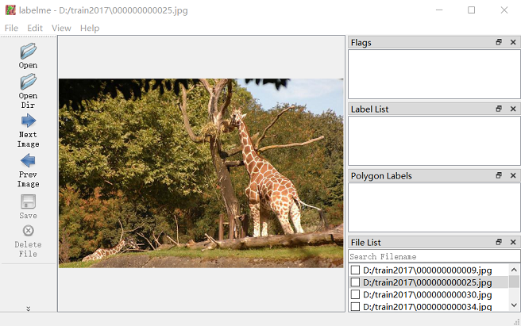
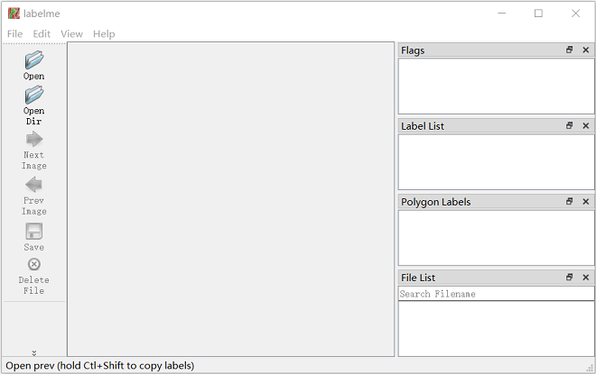
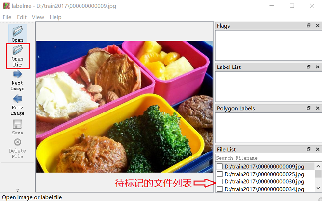
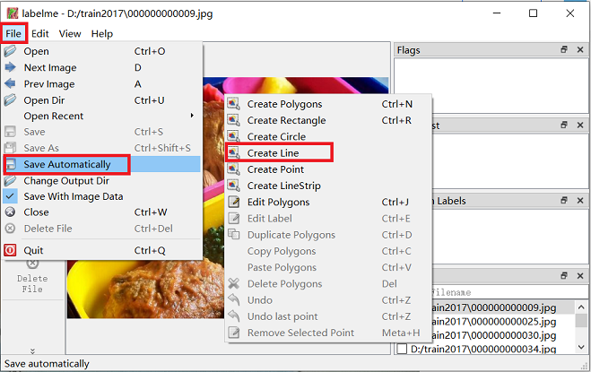

# Labelme打标工具

* [返回上层目录](../image-mark-tool.md)
* [Labelme介绍](#Labelme介绍)
* [Labelme安装](#Labelme安装)
* [Labelme的使用](#Labelme的使用)
  * [启动](#启动)
  * [标注](#标注)

# Labelme介绍



Labelme是开源的图像标注工具，常用做检测，分割和分类任务的图像标注。

Labelme官方文档Github：[wkentaro/**labelme**](https://github.com/wkentaro/labelme)

* 分类标注：[Classification](https://github.com/wkentaro/labelme/tree/v3.11.2/examples/classification)

* 目标检测标注：[Object Detection](https://github.com/wkentaro/labelme/tree/v3.11.2/examples/bbox_detection)

* 语义分割标注：[Semantic Segmentation](https://github.com/wkentaro/labelme/tree/v3.11.2/examples/semantic_segmentation)

* 实例分割标注：[Instance Segmentation](https://github.com/wkentaro/labelme/tree/v3.11.2/examples/instance_segmentation)

* 视频标注：[Video Annotation](https://github.com/wkentaro/labelme/tree/v3.11.2/examples/video_annotation)

* 其他形式标注：[LabelMe Primitives](https://github.com/wkentaro/labelme/tree/v3.11.2/examples/primitives)

# Labelme安装

所有操作在已经安装Anaconda环境下运行

1.安装pyqt5

```shell
pip install pyqt5 -i https://pypi.tuna.tsinghua.edu.cn/simple
```

2.安装labelme

```shell
pip install labelme -i https://pypi.tuna.tsinghua.edu.cn/simple
```

3.安装完成后命令行启动labelme

```shell
labelme
```

如果输入上述命令遇到如下问题，无法启动

> Fatal error in launcher: Unable to create process using '"c:\users\yourname\anaconda3\envs\tf14\python.exe"  "C:\Users\yourname\Anaconda3\envs\tf1.14\Scripts\labelme.exe" ': ???????????

这说明你可能之前装好Labelme后又改过环境名字，解决办法有两个：

要么删除Labelme重装，这最彻底

```shell
pip uninstall labelme
pip install labelme -i https://pypi.tuna.tsinghua.edu.cn/simple
```

要么用`-m`命令直接打开Labelme的安装包

```shell
python -m labelme
```

# Labelme的使用

## 启动

进入到安装Labelme的环境里

```shell
conda activate xxx(include lableme)
```

启动Labelme

```shell
lableme
```

 启动后的界面如下：



## 标注

打开界面左侧的`Open Dir`，选择要标注的文件夹。随后界面如下图所示



1）首先在file栏里勾选`save automatically`，这样可以使标记的图片和生成的标签文件自动保存，免去手动保存的麻烦。

2）鼠标右击图片，会弹出很多标注类型，可以创建Plygons，Rectange，Circle，Line，Point，LineStrip等，如下图所示



3）按下快捷键A会开始弹出下一张图，按下快捷键D会返回上一张图。

4）当对所有图片打完标签之后，json标签文件和对应的图在同一目录下。一张图片对应一张同名的json格式的标签文件。

5）至此，标记任务已经完成。若后期想查看或编辑图片上的标记框，直接在打开的Labelme里，选择`Open Dir`即可。

# 参考资料

* [图片标注工具Labelme的安装及使用方法](https://blog.csdn.net/zong596568821xp/article/details/83375227)
* [Labelme的安装和使用](https://zhuanlan.zhihu.com/p/393166944)

本文参考上述博客。

===

[图片标注工具Labelme-简明使用教程](https://blog.csdn.net/xjm850552586/article/details/112268837)