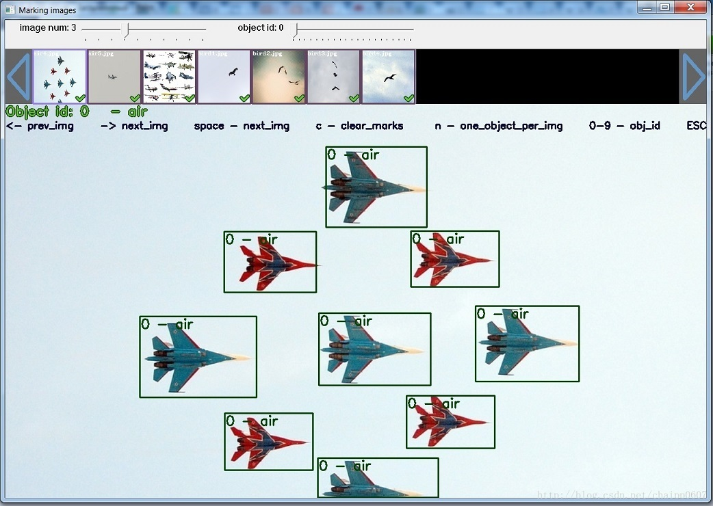
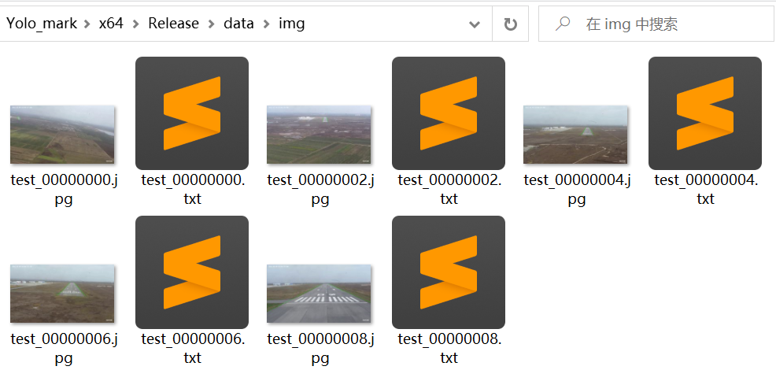

# yolo_mark打标工具

* [返回上层目录](../image-mark-tool.md)
* [yolo_mark介绍](#yolo_mark介绍)
* [源码编译](#源码编译)
* [打标配置与打标方法](#打标配置与打标方法)
* [视频文件分割](#视频文件分割)
* [遇到的问题](#遇到的问题)
  * [找不到opencv_worldxxx.dll](#找不到opencv_worldxxx.dll)


# yolo_mark介绍

yolo_mark适用于图像检测任务的数据集制作，它是yolo2的团队开源的一个图像标注工具，为了方便其他人使用yolo2训练自己的任务模型。在linux和win下都可运行，依赖opencv库。

它来自于下面的项目：[https://github.com/AlexeyAB/Yolo_mark](https://github.com/AlexeyAB/Yolo_mark)。



# 源码编译

在windows或linux下都可编译，这里以windows为例。

下载源码[https://github.com/AlexeyAB/Yolo_mark](https://github.com/AlexeyAB/Yolo_mark)，具体编译方法参考里面的ReadMe。下面仅简单说明下。

在`Visual Studio`IDE中，打开`yolo_mark.sln`，设置为**x64 & Release**进行编译。但前提是要先下载好[OpenCV](https://sourceforge.net/projects/opencvlibrary/)并配置`Visual Studio`。

- (right click on project) -> properties -> C/C++ -> General -> Additional Include Directories: `C:\opencv_3.0\opencv\build\include;`
- (right click on project) -> properties -> Linker -> General -> Additional Library Directories: `C:\opencv_3.0\opencv\build\x64\vc14\lib;`

# 打标配置与打标方法

（1）删除`x64/Release/data/img`里的原有图片

（2）将你自己的图片放入`x64/Release/data/img`

（3）将类别名填入`x64/Release/data/obj.names`，每行一个，要和下一步的classes数目一致。

```
air
bird
```

（4）更改 `x64/Release/data/obj.data`文件里的classes数目，实际有多少个类别就改为多少，要和上一步的`x64/Release/data/obj.names`里写的类别数目一样。此文件包含了需要标记的物体有几类，训练集和验证集对应的txt文件路径，物体名字，backup是训练生成的权重文件路径。标记只需要修改第一行后面的数字，后面的数字表示标记的物体有几类。 例子：

```
classes= 2
train  = data/train.txt
valid  = data/train.txt
names = data/obj.names
backup = backup/
```

（5）双击`x64\Release\yolo_mark.cmd`运行打标工具开始打标。

`yolo_mark.cmd`内部语句为：

```shell
yolo_mark.exe data/img data/train.txt data/obj.names
```

标注完成后，会在`x64\Release\data\img`文件夹下面生成与图片相对应的同名txt文件，



同名txt文件里面为训练需要标注的数据。例子：

`0 0.425781 0.645833 0.235938 0.436111`

第一个参数是对应的类，后面的四个参数为标记物体归一化后中心位置和尺寸。

打标的YOLO标签的格式为：

```
<object-class> <x> <y> <width> <height>
```

`x, y`是目标的中心坐标，`width, height`是目标的宽和高。这些坐标是通过归一化的，其中`x, width`是使用原图的`width`进行归一化；而`y, height`是使用原图的`height`进行归一化。

同时，会在生成`x64\Release\data\train.txt`文件，里面包含了已经完成标记的图片的路径，比如：

```shell
data/img/test_00000000.jpg
data/img/test_00000002.jpg
data/img/test_00000004.jpg
data/img/test_00000006.jpg
data/img/test_00000008.jpg
```

（6）具体打标方法


主界面顶部为图片预览，绿色的小勾表示已有标记或者标记完成。

下面的Object id是你标记对应的类，可以通过键盘上面的快捷键切换。例如你标记的物体名字是：`person air bird`, 最前面 `person` 的ID是`0`，要切换到`bird`，按下数字键`2`即可。

在中间部分的大图上，按下鼠标左键拖动，松开左键后会生成上图所示的矩形框，包含类对应的ID，自定义的名字。

快捷键`C`会清除当前图片上面的所有标记，`空格键`保存标记信息并切换到下一张。用`Esc`或者`Ctrl + c`退出。

# 视频文件分割

对应视频文件，需要先每隔固定帧数截取图片，使用如下命令，即可将截图存放进`x64/Release/data/img`文件夹中。

```
yolo_mark.exe data/img cap_video test.mp4 10
```

注意要将里面的视频文件名字`test.mp4`改为你自己的文件名，视频文件放在`yolo_mark.exe`同目录下。命令里的`10`是指每隔10帧截取一次图片。

# 遇到的问题

## 找不到opencv_worldxxx.dll

运行打标程序时遇到问题：

> 由于找不到opencv_world453.dll，无法继续执行代码。重新安装程序可能会解决此问题。

这是因为没有安装opencv。

有两种解决办法，**如果你觉得你以后还可能要用opencv，那就建议用第二种方法**。

**第一种方法**：把缺少的dll文件放在`system32`里

参考：[OPENCV配置：找不到opencv_worldXXXd.dll的问题](https://blog.csdn.net/qq_25038325/article/details/100922393)。

dll文件需要先[下载opencv](https://sourceforge.net/projects/opencvlibrary/files/)，再从路径`C:\Library\opencv\build\x64\vc15\bin`里找到`opencv_worldxxx.dll`复制到C盘的`system32`里。

**第二种方法**：下载完整版的opencv

下载地址：[下载opencv](https://sourceforge.net/projects/opencvlibrary/files/)。安装的具体方法参考（只需要看需要的那部分即可）：[windows下OpenCV的安装配置部署详细教程](https://blog.csdn.net/maizousidemao/article/details/81474834)，并将文件解压在`C:\Library\opencv`中，然后在系统路径path上添加`C:\Library\opencv\build\x64\vc15\bin`。

# 参考资料

* [open_cv下载地址](https://sourceforge.net/projects/opencvlibrary/files/)

这是open_cv下载地址。

