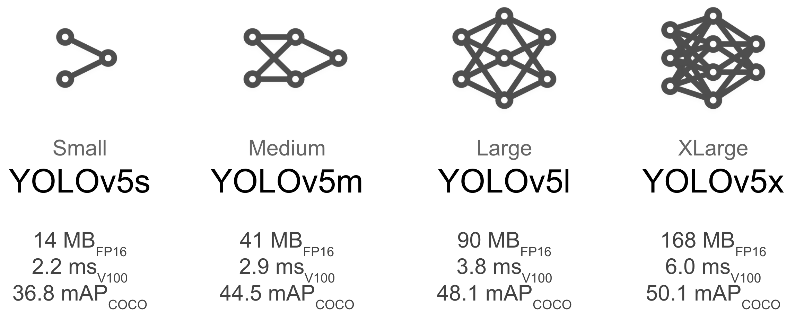
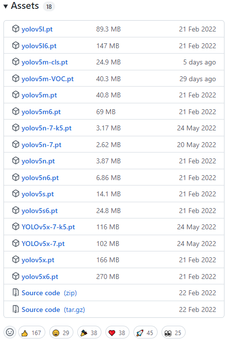
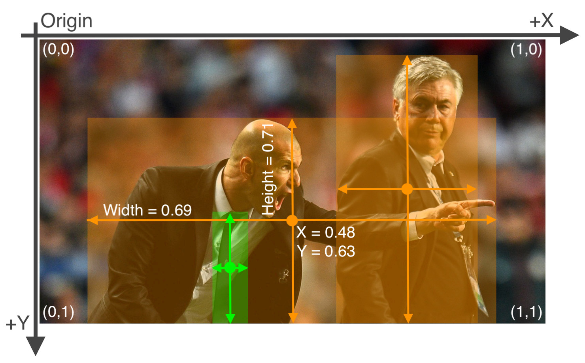
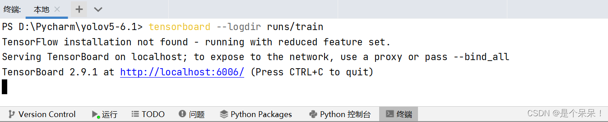

# YOLOv5


# 前言

yolov5源码：[ultralytics/yolov5](https://github.com/ultralytics/yolov5)

yolov5主要是有四种模型，分别是yolov5s，yolov5m，yolov5l，yolov5x，就跟我们买衣服的码一样的标号哈哈，网络的宽度深度也是依次递增。



# 主要代码介绍

## data文件夹

data文件夹里面主要是放数据配置文件(.yaml)，即指明数据存放位置和检测类别，当然你也可以自定义一个放数据集的文件，我是自定义了一个mydata文件夹专门放数据集，不然都放data文件夹有点乱。

```shell
│  Argoverse.yaml
│  coco.yaml
│  coco128.yaml
│  GlobalWheat2020.yaml
│  Objects365.yaml
│  SKU-110K.yaml
│  VisDrone.yaml
│  VOC.yaml
│  xView.yaml
│
├─hyps
│      hyp.Objects365.yaml
│      hyp.scratch-high.yaml
│      hyp.scratch-low.yaml
│      hyp.scratch-med.yaml
│      hyp.VOC.yaml
│
├─images
│      bus.jpg
│      zidane.jpg
│
└─scripts
        download_weights.sh
        get_coco.sh
        get_coco128.sh
```

## model文件夹

model文件夹里主要放的是四种网络(s, m, l, x)的配置文件(.yaml)；

common.py是每个模块的代码，如果要改进网络结构，添加新的模块可以模仿里面的代码写；

```shell
│  common.py
│  experimental.py
│  tf.py
│  yolo.py
│  yolov5l.yaml
│  yolov5m.yaml
│  yolov5n.yaml
│  yolov5s.yaml
│  yolov5x.yaml
│  __init__.py
│
└─hub
        anchors.yaml
        yolov3-spp.yaml
        yolov3-tiny.yaml
        yolov3.yaml
        yolov5-bifpn.yaml
        yolov5-fpn.yaml
        yolov5-p2.yaml
        yolov5-p34.yaml
        yolov5-p6.yaml
        yolov5-p7.yaml
        yolov5-panet.yaml
        yolov5l6.yaml
        yolov5m6.yaml
        yolov5n6.yaml
        yolov5s-ghost.yaml
        yolov5s-transformer.yaml
        yolov5s6.yaml
        yolov5x6.yaml
```

yolo.py是用于查看模型的结构和参数数量的，改一下299行的cfg，如改成下面的就可以查看yolov5x的模型结构和参数数量了。

```python
parser.add_argument('--cfg', type=str, default='yolov5x.yaml', help='model.yaml')
```

## 主要py文件

train.py用于训练模型

val.py用于测试结果，输出precision, recall, mAP等信息

detect.py用于对图片进行检测

## 新建weights文件夹

需要新建weights文件夹，放预训练的权重文件。

下载地址：https://github.com/ultralytics/yolov5/releases



# 训练

## 创建yaml

在`data`文件夹中，

```shell
│  Argoverse.yaml
│  coco.yaml
│  coco128.yaml
│  GlobalWheat2020.yaml
│  Objects365.yaml
│  SKU-110K.yaml
│  VisDrone.yaml
│  VOC.yaml
│  xView.yaml
│
├─hyps
├─images
└─scripts
```

打开`coco128.yaml`文件：

```shell
# Train/val/test sets as 1) dir: path/to/imgs, 2) file: path/to/imgs.txt, or 3) list: [path/to/imgs1, path/to/imgs2, ..]
path: ../datasets/coco128  # dataset root dir
train: images/train2017  # train images (relative to 'path') 128 images
val: images/train2017  # val images (relative to 'path') 128 images
test:  # test images (optional)

# Classes
nc: 80  # number of classes
names: ['person', ..., 'toothbrush']  # class names


# Download script/URL (optional)
download: https://ultralytics.com/assets/coco128.zip
```

复制该文件，重命名，修改为自己数据集的种类。注意，无需指定打标文件的地址，训练代码会自动根据`train: images/train2017`的地址，替换最后一个images得到打标文件的地址`train: labels/train2017`。

## 数据集准备

以[coco128](https://www.kaggle.com/ultralytics/coco128)数据集为例，如下如所示，在和yolov5同一个目录下，新建`datasets`文件夹，里边存放数据。

```shell
├─datasets
│  ├─coco128
│  │  ├─images
│  │  │  └─train2017
│  │  └─labels
│  │      └─train2017
└─yolov5
    ├─data
    ├─models
    └─utils
```

`coco128/images/train2017`文件夹中存放图片，`coco128/labels/train2017`文件夹中存放图片对应的打标txt，每个图片对应一个打标txt文件。

打标的txt的格式为`class x_center y_center width height`，即`图片类别 框的x中心位置 框的y中心位置 框的x长度 框的y长度`。注意，都是归一化的。

如下图所示：

```
45 0.479492 0.688771 0.955609 0.5955
45 0.736516 0.247188 0.498875 0.476417
50 0.637063 0.732938 0.494125 0.510583
```



## 修改train.py

将train.py对应的地方修改为：

```python
def parse_opt(known=False):
    parser = argparse.ArgumentParser()
    # 修改成模型对应的权重文件
    # parser.add_argument('--weights', type=str, default=ROOT / 'yolov5s.pt', help='initial weights path')
    parser.add_argument('--weights', type=str, default=ROOT / 'weights/yolov5s.pt', help='initial weights path')
    # 修改成要训练的模型的配置文件
    # parser.add_argument('--cfg', type=str, default='', help='model.yaml path')
    parser.add_argument('--cfg', type=str, default=ROOT / 'models/yolov5s.yaml', help='model.yaml path')
    # parser.add_argument('--data', type=str, default=ROOT / 'data/coco128.yaml', help='dataset.yaml path')
    parser.add_argument('--data', type=str, default=ROOT / 'data/hm.yaml', help='dataset.yaml path')
    # 超参数设置，不需要修改
    parser.add_argument('--hyp', type=str, default=ROOT / 'data/hyps/hyp.scratch-low.yaml', help='hyperparameters path')
    # 训练多少代
    # parser.add_argument('--epochs', type=int, default=300)
    parser.add_argument('--epochs', type=int, default=500)
    # 训练中断后重新开始，是否接上次训练结果继续
    parser.add_argument('--resume', nargs='?', const=True, default=False, help='resume most recent training')
    # 自动计算锚框，设置成False，则不会自动计算
    parser.add_argument('--noautoanchor', action='store_true', help='disable AutoAnchor')
    # 是否用GPU
    # parser.add_argument('--device', default='', help='cuda device, i.e. 0 or 0,1,2,3 or cpu')
    parser.add_argument('--device', default='0', help='cuda device, i.e. 0 or 0,1,2,3 or cpu')
```

主要是修改 --weights, --cfg, --data, --epochs 和 --batch-size。修改完就可以train啦。

注意:

> epochs 迭代次数,根据自己需求设置,默认300代
>
> batch-size 一般要修改小一点,默认是32,根据自己电脑配置设置
>
> workers 一般也要设置小一点,他需要很大的虚拟内存,实在不行设置为0.

注意，

> 还要添加一个字体文件，[Arial.ttf](https://ultralytics.com/assets/Arial.ttf)，下载下来放到yolov5的根目录下
>
> 因为这里有要求：general.py，可以注释掉
>
> ```python
> def check_font(font=FONT, progress=False):
>     # Download font to CONFIG_DIR if necessary
>     font = Path(font)
>     file = CONFIG_DIR / font.name
>     if not font.exists() and not file.exists():
>         url = "https://ultralytics.com/assets/" + font.name
>         LOGGER.info(f'Downloading {url} to {file}...')
>         torch.hub.download_url_to_file(url, str(file), progress=progress)
> ```
>
> 参考：[yolov5-6.0 出现Arial.ttf无法下载问题解决办法](https://blog.csdn.net/weixin_39048703/article/details/124405145)

## 训练

运行train，等待模型跑完，可以中断，他会生成一个run/train文件夹，里面保存有训练好的权重，best.pt 和 last.pt，按我的经验，best.pt的测试效果更好一些，可以都试试。

若要继续跑则，将这里的default改为True：

```python
# 断点续训,是否在上一次训练的基础上继续训练，若要继续跑则，将这里的default改为True
parser.add_argument('--resume', nargs='?', const=True, default=False, help='resume most recent training')
```

运行时，可以通过终端查看，点击链接，进入tensorboard页面查看曲线



训练结束后，你就可以进行预测了，当然，未结束，中断后也可以采用现有模型进行预测

# 推理(检测detect)

对`detect.py`进行如下修改：

```python
def parse_opt():
    parser = argparse.ArgumentParser()
    # 指定网络权重的路径
    parser.add_argument('--weights', nargs='+', type=str, default=ROOT / 'runs/train/exp2/weights/best.pt', help='model path(s)')
    # 指定网络输入的路径,默认文件夹,可以是具体文件或扩展名 :   path/   path/*.jpg
    parser.add_argument('--source', type=str, default=r'D:\1work\code\PycharmProjects\model_deep_learning\yolov5_pytorch\datasets\coco128\images\train2017', help='file/dir/URL/glob, 0 for webcam')
    # 配置文件的一个路径,配置文件包含下载路径和一些数据集基本信息,若不指定数据集,则自动下载coco128数据集
    parser.add_argument('--data', type=str, default=ROOT / 'data/coco128.yaml', help='(optional) dataset.yaml path')
    # 置信度的阈值。这里之所以把置信度调到0，是因为想看看检测情况再确定一个合适的值
    parser.add_argument('--conf-thres', type=float, default=0.0, help='confidence threshold')
    # 最大检测数量。注意：由于本项目只检测一个类别，且图像中该类别只有一个，故设置为1
    parser.add_argument('--max-det', type=int, default=1, help='maximum detections per image')
    # 指定GPU数量,不指定则自动检测
    parser.add_argument('--device', default='0', help='cuda device, i.e. 0 or 0,1,2,3 or cpu')
    # 是否把检测结果保存成一个txt格式
    parser.add_argument('--save-txt', default=True, action='store_true', help='save results to *.txt')
    # 是否以txt格式保存目标的置信度 必须和--save-txt一起使用,单独指定无效
    parser.add_argument('--save-conf', default=True, action='store_true', help='save confidences in --save-txt labels')
    # 是否把模型检测的物体裁剪下来
    parser.add_argument('--save-crop', action='store_true', help='save cropped prediction boxes')
```

接着运行即可，他将在`runs`文件夹下生成`detect`文件夹，`runs\detect\exp`文件下会有显示预测框的图片，`runs\detect\labels`文件夹下会有每个图片对应的预测结果txt，内容和训练标注txt的内容几乎一样，只是可以多一个预测置信度（`--save-conf=True`）。

# 参考资料

* [yolov5-pytorch训练自己的数据集-超详细](https://www.ngui.cc/article/show-301276.html)

本文参考此博客。

* [YOLOv5（v6.1）解析（三）](https://baijiahao.baidu.com/s?id=1731898927430277672&wfr=spider&for=pc)

解析各种参数的含义。

* [YOLOv5-v6.1训练自己的数据速成---pytorch（GPU实现）](https://blog.csdn.net/weixin_60520739/article/details/125884505)

介绍了训练流程，以及各种参数的含义。

===

[YOLO系列梳理（三）YOLOv5](https://zhuanlan.zhihu.com/p/503971609)

[Yolov5总结文档(理论、代码、实验结果)](https://www.bilibili.com/read/cv17162688/)

介绍了yolo模型。

