# ANN人工神经网络

* [返回上层目录](../deep-learning.md)
* [神经元模型](#神经元模型)
* [激活函数](#激活函数)
  * [为什么需要激活函数](#为什么需要激活函数)
  * [什么样的函数可以做激活函数](#什么样的函数可以做激活函数)
  * [如何评价激活函数](#如何评价激活函数)
  * [激活函数的作用](#激活函数的作用)
    * [加入非线性因素，解决非线性问题](#加入非线性因素，解决非线性问题)
    * [组合训练数据的特征，特征的充分组合](#组合训练数据的特征，特征的充分组合)
  * [常用的激活函数](#常用的激活函数)
  * [不同激活函数的区别](#不同激活函数的区别)
* [感知机与多层网络](#感知机与多层网络)
* [误差逆向传播（BP）算法](#误差逆向传播（BP）算法)
* [全局最小与局部极小](#全局最小与局部极小)
* [其他常见神经网络](#其他常见神经网络)
  * [Elman网络](#Elman网络)
  * [Boltzmann机](#Boltzmann机)

# 神经元模型

神经网络（neural networks）方面的研究很早就已出现，今天"神经网络"己是一个相当大的、多学科交叉的学科领域。各相关学科对神经网络的定义多种多样，本书采用目前使用得最广泛的一种，即"**神经网络是由具有适应性的简单单元组成的广泛并行互连的网络，它的组织能够模拟生物神经系统对真实世界物体所作出的交互反应**"[Kohonen, 1988]。我们在机器学习中谈论神经网络时指的是"神经网络学习"或者说，是机器学习与神经网络这两个学科领域的交叉部分。

神经网络中最基本的成分是神经元（neuron）模型，即上述定义中的"简单单元"。在生物神经网络中，每个神经元与其他神经元相连，当它"兴奋"时，就会向相连的神经元发送化学物质，从而改变这些神经元内的电位；如果某神经元的电位超过了一个"阈值"（threshold），那么它就会被激活，即 "兴奋 "起来，向其他神经元发送化学物质。

1943年，[McCulloch and Pitts, 1943]将上述情形抽象为下图所示的简单模型，这就是一直沿用至今的 "M-P神经元模型"。在这个模型中，**神经元接收到来自n个其他神经元传递过来的输入信号，这些输入信号通过带权重的连接（connection）进行传递，神经元接收到的总输入值将与神经元的阀值进行比较，然后通过"激活函数"（activation function）处理以产生神经元的输出**。

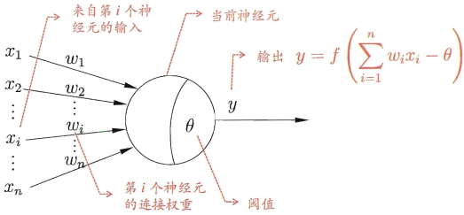

理想中的激活函数是下图(a)所示的阶跃函数，它将输入值映射为输出值"0" 或”1“，显然"1"对应于神经元兴奋，"0"对应于神经元抑制。然而，阶跃函数具有不连续、不光滑等不太好的性质，因此实际常用Sigmoid函数作为激活函数。典型的Sigmoid 函数如下图(b)所示，它把可能在较大范围内变化的输入值挤压到(0, 1)输出值范围内，因此有时也称为"挤压函数"。

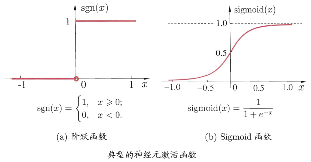

把许多个这样的神经元按-定的层次结构连接起来，就得到了神经网络。

事实上，从计算机科学的角度看，我们可以先不考虑神经网络是否真的模拟了生物神经网络，只需将一个神经网络视为包含了许多参数的数学模型，这个模型是若干个函数， 例如
$$
y_j=f\left( \sum_iw_ix_i-\theta_j \right)
$$
相互（嵌套）代入而得.有效的神经网络学习算法大多以数学证明为支撑。

# 感知机与多层网络

**感知机（Perceptron）由两层神经元组成**，如下图所示，输入层接收外界输入信号后传递给输出层，输出层是M-P神经元，亦称"阈值逻辑单元"（threshold logic unit）。

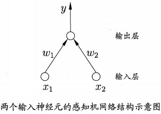

感知机能容易地实现逻辑与、或、非运算。注意到
$$
y=f\left( \sum_iw_ix_i-\theta \right)
$$
，假定f是激活函数中的阶跃函数，有

*  “与”（x1 && x2）：令w1 = w2 = 1，θ = 2，则y = f( 1·x1 + 1·x2 - 2 )，仅在x1 =1且x2 = 1时，y = 1
*  “或”（x1 || x2）：令w1 = w2 = 1，θ = 0.5，则y = f( 1·x1 + 1·x2 - 0.5 )，当x1 = 1或x2 = 1时，y = 1
*  “非”（! x1）：令w1 = -0.6，w2 = 0，θ = -0.5，则y = f( -0.6·x1 + 0·x2 + 0.5 )，当x1 = 1时，y = 0；当x1 = 0时，y = 1

更一般地，给定训练数据集，权重wi(i = 1, 2, ... , n)以及阈值θ可通过学习得到。阈值θ可看作一个固定输入为-1.0的"哑结点"（dummy node）所对应的连接权重W(n+1)，这样，权重和阈值的学习就可统一为权重的学习。感知机学习规则非常简单，对训练样例(x, y)，若当前感知机的输出为hat(y)，则感知机权重将这样调整：
$$
\begin{aligned}
&w_i\leftarrow w_i+\Delta w_i\\
&w_i=\eta(y-\hat{y})x_i
\end{aligned}
$$
其中η∈(0, 1)称为学习率。从上式可看出，若感知机对训练样例(x, y)预测正确，即hat(y) = y，则感知机不发生变化，否则将根据错误的程度进行权重调整。

需注意的是，感知机只有输出层神经元进行激活函数处理，即只拥有一层功能神经单元，其学习能力非常有限。事实上，上述与、或、非问题都是线性可分的问题。可以证明，若两类模式是线性可分的，即存在一个线性超平面能将它们分开，如下图(a)-(c) 所示，则感知机的学习过程一定会收敛而求得适当的权向量w = (w1, w2, ... , w(n+1))；否则感知机学习过程将会发生震荡，w难以稳定下来，不能求得合适解，例如**感知机甚至不能解决如下图(d)所示的异或这样简单的非线性可分问题**。

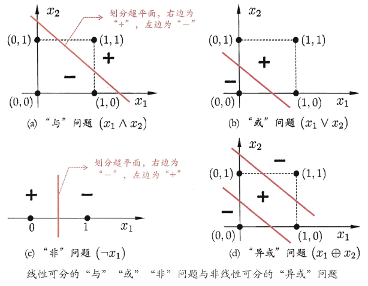

**要解决非线性可分问题，需考虑使用多层功能神经元**。例如下图中这个简单的两层感知机就能解决异或问题。在下图(a)中，输出层与输入层之间的一层神经元，被称为隐层或隐藏层（hidden layer），隐含层和输出层神经元都是拥有激活函数的功能神经元。

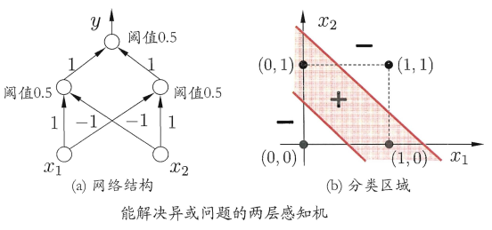

更一般的，常见的神经网络是形如下图所示的层级结构，每层神经元与下层神经元全互连，神经元之间不存在同层连接， 也不存在跨层连接。这样的神经网络结构通常称为"**多层前馈神经网络**"（multi-layer feedforward neural networks），其中输入层神经元接收外界输入，隐层与输出层神经元对信号进行加工，最终结果由输出层神经元输出；换言之，输入层神经元仅是接受输入，不进行函数处理，隐层与输出层包含功能神经元。因此，下图(a)通常被称为"两层网络"。为避免歧义，本书称其为"单隐层网络"。**只需包含隐层，即可称为多层网络**。神经网络的**学习过程，就是根据训练数据来调整神经元之间的"连接权值"以及每个功能神经元的阈值**；换言之，神经网络"学"到的东西，蕴涵在连接权值与阈值中。

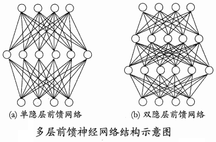

# 误差逆向传播（BP）算法

多层网络的学习能力比单层感知机强得多。欲训练多层网络，前面的简单感知机学习规则显然不够了，需要更强大的学习算法。误差逆传播（error BackPropagation，简称BP）算法就是其中最杰出的代表。**误差逆向传播算法是迄今最成功的神经网络学习算法**。现实任务中使用神经网络时，大多是在使用BP算法进行训练。

下面我们来看看 BP 算法究竟是什么样。

给定训练集D = \{ (x1, y1), (x2, y2), ... , (xm, ym) \}， xi∈R^d，yi∈R^l，即输入示例由d个属性描述，输出l维实值向量。

为便于讨论，下图给出了一个拥有d个输入神经元、l个输出神经元、q个隐层神经元的多层前馈网络结构，其中输出层第j个神经元的阈值用θj表示，隐层第h个神经元的阈值用γh表示。输入层第i个神经元与隐层第h个神经元之间的连接权为v(ih)，隐层第h个神经元与输出层第j个神经元之间的连接权为w(hj)。

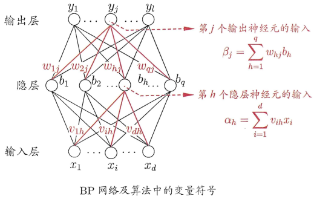

记隐层第h个神经元接收到的输入为
$$
\alpha_h=\sum_{i=1}^dv_{ih}x_i
$$

， 输出层第j个神经元接收到的输入为
$$
\beta_j=\sum_{h=1}^qw_{hj}b_h
$$
，其中bh为隐层第h个神经元的输出。假设隐层和输出层神经元都使用Sigmoid激活函数。

对训练例(xk, yk)，假定神经网络的输出为
$$
\hat{y}_k=(\hat{y}_1^k, \hat{y}_2^k, ... , \hat{y}_l^k)
$$
，即
$$
\hat{y}_j^k=f(\beta_j-\theta_j)
$$
则网络在(xk, yk)上的均方误差为
$$
E_k=\frac{1}{2}\sum_{j=1}^l(\hat{y}_j^k-y_j^k)^2
$$
其中，1/2是为了后续求导的便利。

上图的网络中有(d + l + 1)q + l个参数需确定：输入层到隐层的d x q个权值 、 隐层到输出层的q x l个权值、q个隐层神经元的阈值、l个输出层神经元的阈值。BP是一个迭代学习算法，在迭代的每一轮中采用广义的感知机学习规则对参数进行更新估计，即与前面的感知机更新算法类似，任意参数v的更新估计式为
$$
v\leftarrow v+\Delta v 
$$
下面我们以上图中隐层到输出层的连接权w(hj)为例来进行推导。

BP算法基于梯度下降策略，以目标的负梯度方向对参数进行调整。对上上式的均方误差Ek，给定学习率η，有
$$
\Delta w_{hj}=-\eta\frac{\partial E_k}{\partial w_{hj}}
$$
注意到w(hj)先影响到第j个输出层神经元的输入值βj，再影响到其输出值hat(y)_j^k，再影响到Ek，有
$$
\frac{\partial E_k}{\partial w_{hj}}=\frac{\partial E_k}{\partial \hat{y}_j^k}\frac{\partial \hat{y}_j^k}{\partial \beta_j}\frac{\partial \beta_j}{\partial w_{hj}}
$$
根据βj的定义，显然有
$$
\frac{\partial \beta_j}{\partial w_{hj}}=b_h
$$
Sigmoid激活函数有一个很好的性质：
$$
f'(x)=f(x)(1-f(x))
$$
于是有输出层灵敏度gj为
$$
\begin{aligned}
g_j&=\frac{\partial E_k}{\partial \hat{y}_j^k}\frac{\partial \hat{y}_j^k}{\partial \beta_j}\\
&=(\hat{y}_j^k-y_j^k)f'(\beta_j-\theta_j)\\
&=(\hat{y}_j^k-y_j^k)\hat{y}_j^k(1-\hat{y}_j^k)\\
\end{aligned}
$$
则BP算法中关于输出层权值w(hj)的更新公式为
$$
\Delta w_{hj}=-\eta g_jb_h
$$
输出层的阈值θj更新公式为（θj为阈值，本身前面带有负号，所以这里负负得正了）
$$
\Delta\theta_j=\eta g_j
$$
类似可得隐层灵敏度eh为
$$
\begin{aligned}
e_h&=\frac{\partial E_k}{\partial b_h}\frac{\partial b_h}{\partial \alpha_h}\\
&=\left( \sum_{j=1}^l \frac{\partial E_k}{\partial \beta_j}\cdot \frac{\partial \beta_j}{\partial b_h} \right) \cdot \frac{\partial b_h}{\partial \alpha_h}\\
&=\left( \sum_{j=1}^l g_j w_{hj}\right)f'(\alpha_h-\gamma_h)\\
&=b_h(1-b_h)\sum_{j=1}^l g_j w_{hj}
\end{aligned}
$$

学习率η∈(0, 1)控制着算法每一轮迭代中的更新步长（常设置为η = 0.1），若太大则容易振荡，太小则收敛速度又会过但。有时为了做精细调节，可分别在每层设置不同的学习率。

下图给出了BP算法的工作流程。对每个训练样例，BP算法执行以下操作：先将输入示例提供给输入层神经元，然后逐层将信号前传，直到产生输出层的结果；然后计算输出层的误差（第4-5行），再将误差逆向传播至隐层神经元（第6行），最后根据隐层神经元的误差来对连接权和阈值进行调整（第7行）。该迭代过程循环进行，直到达到某些停止条件为止，例如训练误差己达到一个很小的值（停止条件与缓解BP过拟合的策略有关）。

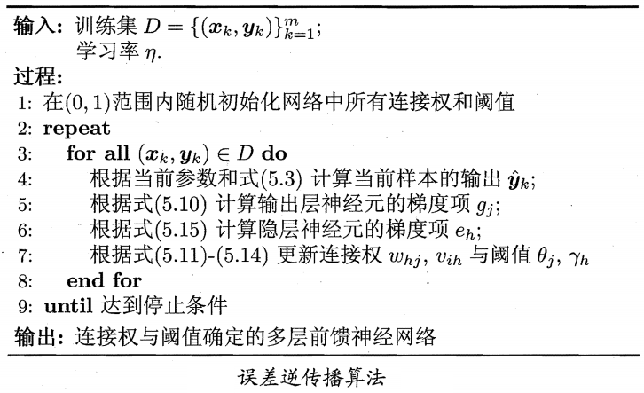

下图给出了在2个属性、5个样本的西瓜数据上，随着训练轮数的增加，网络参数和分类边界的变化情况。

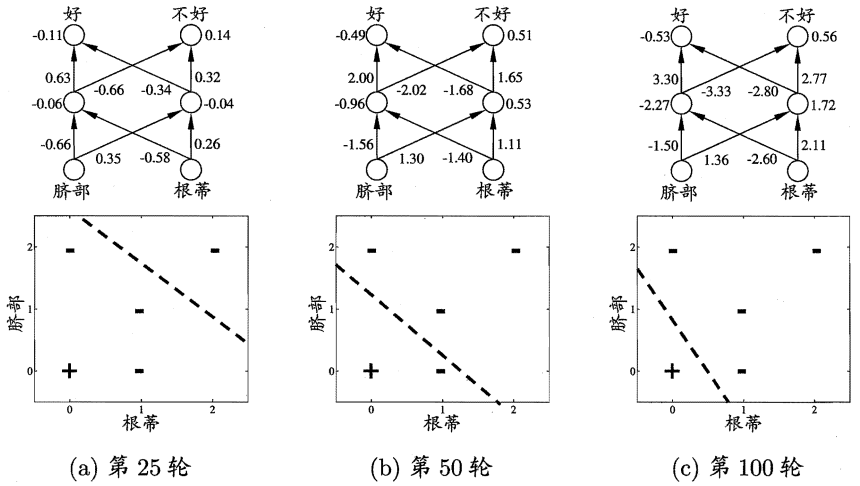

需注意的是， BP算法的目标是要最小化训练集D上的累积误差
$$
E=\frac{1}{m}\sum_{k=1}^mE_k
$$
但我们上面介绍的"标准BP算法"每次仅针对一个训练样例更新连接权和阈值，也就是说，上上图所示算法的更新规则是基于单个的Ek推导而得。如果类似地推导出基于累积误差最小化的更新规则，就得到了累积误差逆传播算法。累积BP算法与标准BP算法都很常用。一般来说，标准BP算法每次更新只针对单个样例，参数更新得非常**频繁**，而且对不同样例进行更新的效果可能出现"**抵消**"现象。因此，为了达到同样的累积误差极小点，标准BP算法往往需进行更多次数的法代。累积BP算法直接针对累积误差最小化，它在读取整个训练集D一遍后才对参数进行更新，其参数更新的频率低得多。但在很多任务中，累积误差下降到一定程度之后，进一步下降会非常缓慢，这时标准BP往往会更快获得较好的解，尤其是在训练集D非常大时更明显。

[Hornik et al., 1989]证明，**只需一个包含足够多神经元的隐层，多层前馈网络就能以任意精度逼近任意复杂度的连续函数**。点这里查看为什么：[神经网络为什么可以（理论上）拟合任何函数？](https://www.zhihu.com/question/268384579)。然而，如何设置隐层神经元的个数仍是个未决问题，实际应用中通常靠"试错法"调整。

正是由于其强大的表示能力，BP神经网络经常遭遇**过拟合**，其训练误差持续降低，但测试误差却可能上升。有两种策略常用来缓解BP网络的过拟合。

第一种策略是"**早停**"：将数据分成训练集和验证集，训练、集用来计算梯度、更新连接权和阔值，验证集用来估计误差，若训练集误差降低但验证集误差升高，则停止训练，同时返回具有最小验证集误差的连接权和阈值。

第二种策略是"**正则化**"[Barron, 1991; Girosi et al., 1995]，其非常相似。基本思想是在误差目标函数中增加一个用于描述网络复杂度的部分，例如连接权与阈值的平方和。仍令Ek表示第k个训练样例上的误差，wi表示连接权和
阈值，则误差目标函数改变为
$$
E=\lambda\frac{1}{m}\sum_{k=1}^mE_k+(1-\lambda)\sum_iw_i^2
$$
其中λ∈(0, 1)用于对经验误差与网络复杂度这两项进行折中，常通过交叉验证法来估计。

增加连接权与阈值平方和这一项后，训练过程将会偏好比较小的连接权和阈值，使网络输出更加"光滑"，从而对过拟合有所缓解。

# 全局最小与局部极小

若用E表示神经网络在训练集上的误差，则它显然是关于连接权w和阈值θ的函数。此时，神经网络的训练过程可看作一个参数寻优过程， 即在参数空间中，寻找一组最优参数使得E最小。

我们常会谈到两种"最优" ："局部极小" 和"全局极小"，如下图所示。显然，我们在参数寻优的过程中是希望找到全局最小。

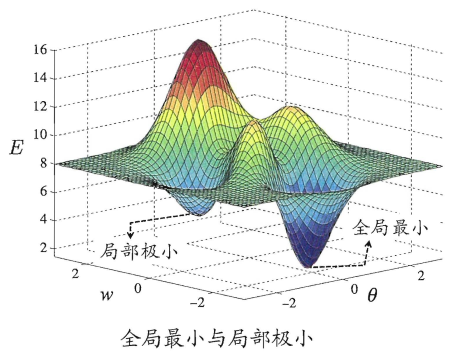

基于梯度的搜索是使用最为广泛的参数寻优方法。如果误差函数具有多个局部极小，则不能保证找到的解是全局最小，我们称参数寻优陷入了局部极小，这显然不是我们所希望的。

在现实任务中，人们常采用以下策略来试图 "跳出"局部极小，从而进一步接近全局最小：

* 以多组不同参数值初始化多个神经网络，按标准方法训练后，取其中误差最小的解作为最终参数。这相当于从多个不同的初始点开始搜索，这样就可能陷入不同的局部极小从中进行选择有可能获得更接近全局最小的结果 
* 使用 "模拟退火"技术[Aarts and Korst, 1989]。模拟退火在每一步都以一定的概率接受比当前解更差的结果，从而有助于"跳出"局部极小。在每步迭代过程中，接受"次优解"的概率要随着时间的推移而逐渐降低，从而保证算法稳定。但是也会造成"跳出"全局最小。 
* 使用随机梯度下降。与标准梯度下降法精确计算梯度不同，随机梯度下降法在计算梯度时加入了随机因素。于是，即便陷入局部极小点，它计算出的梯度仍可能不为零，这样就有机会跳出局部极小继续搜索

此外，遗传算法[Goldberg, 1989]也常用来训练神经网络，以更好地逼近全局最小。需注意的是，上述用于跳出局部极小的技术大多是启发式，理论上尚缺乏保障。

# 其他常见神经网络

## Elman网络

与前馈神经网络不同，"递归神经网络"（recurrent neural networks）允许网络中出现环形结构，从而可让一些神经元的输出反馈回来作为输入信号。这样的结构与信息反馈过程，使得网络在t时刻的输出状态不仅与t时刻的输入有关，还与t-1时刻的网络状态有关，从而能处理与时间有关的动态变化。

Elman网络[Elman, 1990]是最常用的递归神经网络之一，其结构如下图所示，它的结构与多层前馈网络很相似，但隐层神经元的输出被反馈回来，与下一时刻输入层神经元提供的信号一起，作为隐层神经元在下一时刻的输入。隐层神经元通常采用Sigmoid激活函数，而网络的训练则常通过**推广的BP算法**进行[Pineda, 1987]。

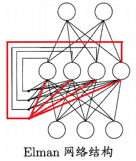

## Boltzmann机

神经网络中有一类模型是为网络状态定义一个"能量" ，能量最小化时网络达到理想状态，而网络的训练就是在最小化这个能量函数.

Boltzmann机[Ackley et al., 1985]就是一种"基于能量的模型"，常见结构如下图(a)所示，其神经元分为两层：显层与隐层。显层用于表示数据的输入与输出，隐层则被理解为数据的内在表达。Boltzmann机中的神经元都是布尔型的，即只能取0、1两种状态，状态1表示激活，状态0表示抑制。令向量 s ∈ \{0, 1\}^n表示n个神经元的状态，w_ij表示神经元i与j之间的连接权，θi表示神经元i的阈值，则状态向量s所对应的Boltzmann机能量定义为
$$
E(s)=-\sum_{i=1}^{n-1}\sum_{j=i+1}^nw_{ij}s_is_j-\sum_{i=1}^n\theta_is_i
$$
若网络中的神经元以任意不依赖于输入值的顺序进行更新，则网络最终将达到Boltzmann分布，此时状态向量s出现的概率将仅由其能量与所有可能状态向量的能量确定（能量越负，出现概率越大）：
$$
P(s)=\frac{e^{-E(s)}}{\sum_te^{-E(t)}}
$$
Boltzmann机的训练过程就是将每个训练样本视为一个状态向量，使其出现的概率尽可能大。标准的Boltzmann机是一个全连接图，训练网络的复杂度很高，这使其难以用于解决现实任务。现实中常采用**受限Boltzmann机**（Restricted Boltzmann Machine，简称RBM）。如下图(b)所示，受限Boltzmann机仅保留显层与隐层之间的连接，从而将Boltzmann机结构由完全图简化为二部图。

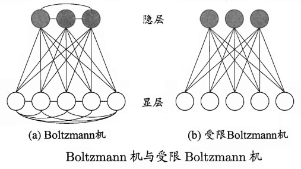

受限Boltzmann机常用"对比散度"（Contrastive Dìvergence，简称CD）算法[Hinton, 2010]来进行训练。假定网络中有d个显层神经元和q个隐层神经元，令v和h分别表示显层与隐层的状态向量，则由于同一层内不存在连接，有
$$
\begin{aligned}
&P(v|h)=\prod_{i=1}^dP(v_i|h)\\
&P(h|v)=\prod_{j=1}^qP(h_j|v)\\
\end{aligned}
$$
CD算法对每个训练样本，先根据上式中第二式计算出隐层神经元状态的概率分布，然后根据这个概率分布采样得到h；此后，类似地根据上式中第一式从h产生v'，再从v'产生h‘；连接权的更新公式为
$$
\Delta w=\eta(vh^T-v'{h'}^T)
$$
阈值的更新公式可类似获得。

# 参考资料

* 《机器学习》周志华

本文主要参考此资料。
