# CNN卷积神经网络

* [返回上层目录](../convolutional-neural-network.md)
* [卷积神经网络可视化认识](#卷积神经网络可视化认识)
* [卷积神经网络的直观解释](#卷积神经网络的直观解释)
  * [LeNet架构（1990s）](#LeNet架构（1990s）)
  * [图像是像素值的矩阵](#图像是像素值的矩阵)
  * [卷积直观解释](#卷积直观解释)
  * [激活函数（ReLU）](#激活函数（ReLU）)
  * [池化直观解释](#池化直观解释)
  * [目前为止的故事](#目前为止的故事)
  * [全连接层直观解释](#全连接层直观解释)
  * [组合并用反向传播训练](#组合并用反向传播训练)
  * [卷积神经网络的可视化](#卷积神经网络的可视化)
  * [其他的ConvNet架构](#其他的ConvNet架构)
  * [CNN直观解释的总结](#CNN直观解释的总结)
* [卷积神经网络的发展历程](#卷积神经网络的发展历程)
  * [网络加深](#网络加深)
    * [LeNet](#LeNet)
    * [AlexNet](#AlexNet)
  * [增强卷积层的功能](#增强卷积层的功能)
    * [VGGNet](#VGGNet)
    * [GoogLeNet](#GoogLeNet)
  * [ResNet（网络加深+增强卷积层）](#ResNet（网络加深+增强卷积层）)
  * [从分类任务到检测任务](#从分类任务到检测任务)
  * [增加新的功能模块](#增加新的功能模块)

* [卷积层](#卷积层)
  * [什么是卷积运算](#什么是卷积运算)
    * [基本假设：特征局部相关性](#基本假设：特征局部相关性)
    * [卷积运算的数学公式](#卷积运算的数学公式)
    * [CNN中的卷积核](#CNN中的卷积核)
  * [使用卷积运算的动机](#使用卷积运算的动机)
    * [稀疏交互](#稀疏交互)
    * [参数共享](#参数共享)
    * [等变表示](#等变表示)
  * [对CNN中卷积的理解](#对CNN中卷积的理解)
* [池化层](#池化层)
  * [池化层概念](#池化层概念)
  * [池化层的目的与好处](#池化层的目的与好处)
  * [池化层具体操作](#池化层具体操作)
* [对CNN各流派的重新审视](#对CNN各流派的重新审视)
* [全连接层](#全连接层)
* [损失函数](#损失函数)
  * [从方差损失函数说起](#从方差损失函数说起)
  * [交叉熵损失函数](#交叉熵损失函数)
  * [损失函数总结](#损失函数总结)
* [CNN训练原理](#CNN训练原理)
  * [CNN训练原理引言](#CNN训练原理引言)
  * [用BP训练全连接网络](#用BP训练全连接网络)
    * [全连接网络前向传播](#全连接网络前向传播)
    * [全连接网络反向传播](#全连接网络反向传播)
  * [卷积层前后向传播](#卷积层前后向传播)
    * [卷积层前向传播](#卷积层前向传播)
    * [下层为卷积层的反向传播](#下层为卷积层的反向传播)
    * [卷积层梯度计算](#卷积层梯度计算)
  * [降采样层前后向传播](#降采样层前后向传播)
    * [降采样层前向传播](#降采样层前向传播)
    * [下层为降采样层的反向传播](#下层为降采样层的反向传播)
    * [降采样层梯度计算](#降采样层梯度计算)
  * [全连接层前后向传播](#全连接层前后向传播)
    * [全连接层前向传播](#全连接层前向传播)
    * [下层为全连接层的反向传播](#下层为全连接层的反向传播)
    * [全连接层梯度计算](#全连接层梯度计算)
  * [学习特征图的组合](#学习特征图的组合)
  * [加强稀疏组合](#加强稀疏组合)
  * [在Matlab中的加速](#在Matlab中的加速)
  * [实际训练问题](#实际训练问题)
    * [批量更新VS在线更新](#批量更新VS在线更新)
    * [学习率](#学习率)
    * [损失函数的选择](#损失函数的选择)
    * [检查求导是否正确](#检查求导是否正确)
* [梯度下降法的改进—动量法](#梯度下降法的改进—动量法)
  * [梯度下降法存在的问题](#梯度下降法存在的问题)
  * [动量法](#动量法)
* [项目实践](#项目实践)
  * [LeNet5手写数字识别的C++实现](#LeNet5手写数字识别的C++实现)

卷积神经网络是一种专门用来处理具有类似网络结构的神剧的神经网络。例如时间序列数据（可以认为是在时间轴上有规律地采样形成的一维网格）和图像数据（可以看作二维的像素网格）。卷积神经网络在诸多应用领域都表现优异。“卷积神经网络”一词表明该网络使用了卷积这种数学运算。卷积是一种特殊的线性运算。**卷积网络是指那些至少在网络的一层中使用卷积运算来替代一般的矩阵乘法运算的神经网络**。

CNN（Convolution Neural Network，卷积神经网络）作为一种经典的DNN结构，上世纪90年代就已经被提出了，却沉寂近20年。有趣的是，在2012年AlexNet大放异彩后，CNN在随后几年近乎卷席了整个图像处理领域，很有点戏剧性。近些年，CNN在语音处理、NLP领域也发展迅速。

CNN其实可以看作DNN的一种特殊形式。它跟传统DNN标志性的区别在于两点，Convolution Kernel以及Pooling。

# 卷积神经网络可视化认识

Adam Harley创建了一个卷积神经网络的可视化结果http://scs.ryerson.ca/~aharley/vis/conv/，使用的是MNIST手写数字的训练集。我强烈建议使用它来理解CNN的工作原理。

http://scs.ryerson.ca/~aharley/vis/conv/

# 卷积神经网络的直观解释

这篇文章原地址为[An Intuitive Explanation of Convolutional Neural Networks](https://ujjwalkarn.me/2016/08/11/intuitive-explanation-convnets/)，卷积神经网络的讲解非常通俗易懂。翻译版：[[翻译\] 神经网络的直观解释](http://www.hackcv.com/index.php/archives/104/?hmsr=toutiao.io&utm_medium=toutiao.io&utm_source=toutiao.io)

卷积神经网络（ConvNets 或者 CNNs）属于神经网络的范畴，已经在诸如图像识别和分类的领域证明了其高效的能力。卷积神经网络可以成功识别人脸、物体和交通信号，从而为机器人和自动驾驶汽车提供视力。

在上图中，卷积神经网络可以识别场景，也可以提供相关的插图说明（足球运动员正在踢足球）；而下图展示了卷积神经网络可以用来识别日常物体、人和动物。最近，卷积神经网络也在一些自然语言处理任务（比如语句分类）上面展示了良好的效果。

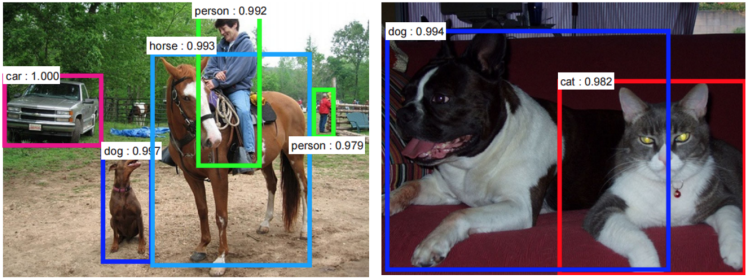

因此，卷积神经网络对于今天大多数的机器学习用户来说都是一个重要的工具。然而，理解卷积神经网络以及首次学习使用它们有时会很痛苦。那本篇博客的主要目的就是让我们对卷积神经网络如何处理图像有一个基本的了解。

如果你是神经网络的新手，我建议你阅读下[这篇短小的多层感知器的教程](https://ujjwalkarn.me/2016/08/09/quick-intro-neural-networks/)，在进一步阅读前对神经网络有一定的理解。在本篇博客中，多层感知器叫做“全连接层”。

## LeNet架构（1990s）

LeNet是推进深度学习领域发展的最早的卷积神经网络之一。经过多次成功迭代，到 1988 年，Yann LeCun把这一先驱工作命名为[LeNet5](http://yann.lecun.com/exdb/publis/pdf/lecun-01a.pdf)。当时，LeNet架构主要用于字符识别任务，比如读取邮政编码、数字等等。

接下来，我们将会了解LeNet架构是如何学会识别图像的。近年来有许多在LeNet 上面改进的新架构被提出来，但它们都使用了LeNet中的主要概念，如果你对LeNet 有一个清晰的认识，就相对比较容易理解。

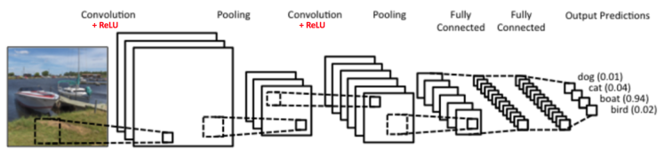

上图中的卷积神经网络和原始的LeNet的结构比较相似，可以把输入的图像分为四类：狗、猫、船或者鸟（原始的LeNet主要用于字符识别任务）。正如上图说示，当输入为一张船的图片时，网络可以正确的从四个类别中把最高的概率分配给船（0.94）。在输出层所有概率的和应该为一（本文稍后会解释）。

在上图中的ConvNet有四个主要操作：

1. 卷积
2. 非线性处理（ReLU）
3. 池化或者亚采样
4. 分类（全连接层）

这些操作对于各个卷积神经网络来说都是基本组件，因此理解它们的工作原理有助于充分了解卷积神经网络。下面我们将会尝试理解各步操作背后的原理。

## 图像是像素值的矩阵

本质上来说，每张图像都可以表示为像素值的矩阵：

[通道](https://en.wikipedia.org/wiki/Channel_(digital_image))常用于表示图像的某种组成。一个标准数字相机拍摄的图像会有三通道 - 红、绿和蓝；你可以把它们看作是互相堆叠在一起的二维矩阵（每一个通道代表一个颜色），每个通道的像素值在 0 到 255 的范围内。

[灰度](https://en.wikipedia.org/wiki/Grayscale)图像，仅仅只有一个通道。在本篇文章中，我们仅考虑灰度图像，这样我们就只有一个二维的矩阵来表示图像。矩阵中各个像素的值在0到255的范围内——零表示黑色，255 表示白色。

## 卷积直观解释

卷积神经网络的名字就来自于其中的[卷积操作](http://en.wikipedia.org/wiki/Convolution)。卷积的主要目的是为了从输入图像中提取特征。卷积可以通过从输入的一小块数据中学到图像的特征，并可以保留像素间的空间关系。我们在这里并不会详细讲解卷积的数学细节，但我们会试着理解卷积是如何处理图像的。

如我们上面所说，每张图像都可以看作是像素值的矩阵。考虑一下一个5x5的图像，它的像素值仅为0或者1（注意对于灰度图像而言，像素值的范围是0到255，下面像素值为0和1的绿色矩阵仅为特例）：

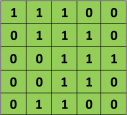

同时，考虑下另一个3x3的矩阵，如下所示：

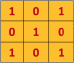

接下来，5x5的图像和3x3的矩阵的卷积可以按下图所示的动画一样计算：

现在停下来好好理解下上面的计算是怎么完成的。我们用橙色的矩阵在原始图像（绿色）上滑动，每次滑动一个像素（也叫做“步长”），在每个位置上，我们计算对应元素的乘积（两个矩阵间），并把乘积的和作为最后的结果，得到输出矩阵（粉色）中的每一个元素的值。注意，3x3 的矩阵每次步长中仅可以“看到”输入图像的一部分。

在CNN的术语中，3x3的矩阵叫做“滤波器（filter）”或者“核（kernel）”或者“特征检测器（feature detector）”，通过在图像上滑动滤波器并计算点乘得到矩阵叫做“卷积特征（Convolved Feature）”或者“激活图（Activation Map）”或者“特征图（Feature Map）”。记住滤波器在原始输入图像上的作用是特征检测器。

从上面图中的动画可以看出，对于同样的输入图像，不同值的滤波器将会生成不同的特征图。比如，对于下面这张输入图像：

在下表中，我们可以看到不同滤波器对上图卷积的效果。正如表中所示，通过在卷积操作前修改滤波矩阵的数值，我们可以进行诸如边缘检测、锐化和模糊等操作 —— 这表明不同的滤波器可以从图中检测到不同的特征，比如边缘、曲线等。在[这里的 8.2.4 部分](http://docs.gimp.org/en/plug-in-convmatrix.html)中可以看到更多的例子。

另一个理解卷积操作的好方法是看下面这张图的动画：

滤波器（红色框）在输入图像滑过（卷积操作），生成一个特征图。另一个滤波器（绿色框）在同一张图像上卷积可以得到一个不同的特征图。注意卷积操作可以从原图上获取局部依赖信息。同时注意这两个不同的滤波器是如何从同一张图像上生成不同的特征图。记住上面的图像和两个滤波器仅仅是我们上面讨论的数值矩阵。

在实践中，**CNN会在训练过程中学习到这些滤波器的值**（尽管如此，但我们依然需要在训练前指定诸如滤波器的个数、滤波器的大小、网络架构等参数）。我们使用的滤波器越多，提取到的图像特征就越多，网络所能在未知图像上识别的模式也就越好。

特征图的大小（卷积特征）由下面三个参数控制，我们需要在卷积前确定它们：

- 深度（Depth）：深度对应的是卷积操作所需的滤波器个数。在下图的网络中，我们使用三个不同的滤波器对原始图像进行卷积操作，这样就可以生成三个不同的特征图。你可以把这三个特征图看作是堆叠的2d矩阵，那么，特征图的“深度”就是三。

* 步长（Stride）：步长是我们在输入矩阵上滑动滤波矩阵的像素数。当步长为1时，我们每次移动滤波器一个像素的位置。当步长为2时，我们每次移动滤波器会跳过2个像素。步长越大，将会得到更小的特征图。
* 零填充（Zero-padding）：有时，在输入矩阵的边缘使用零值进行填充，这样我们就可以对输入图像矩阵的边缘进行滤波。零填充的一大好处是可以让我们控制特征图的大小。使用零填充的也叫做泛卷积，不适用零填充的叫做严格卷积。这个概念在下面的参考文献14中介绍的非常详细。

## 激活函数（ReLU）

在上面图中，在每次的卷积操作后都使用了一个叫做ReLU的操作。ReLU表示修正线性单元（Rectified Linear Unit），是一个非线性操作。它的输入如下所示：

ReLU是一个元素级别的操作（应用到各个像素），并将特征图中的所有小于0的像素值设置为零。ReLU的目的是在ConvNet中引入非线性，因为在大部分的我们希望 ConvNet学习的实际数据是非线性的（卷积是一个线性操作——元素级别的矩阵相乘和相加，所以我们需要通过使用非线性函数ReLU 来引入非线性。

ReLU操作可以从下面的图中理解。它展示的ReLU操作是应用到上面那张城市图像得到的特征图之一。这里的输出特征图也可以看作是“修正”过的特征图。

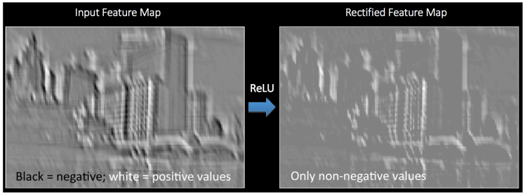

其他非线性函数，比如tanh或者sigmoid也可以用来替代ReLU，但ReLU在大部分情况下表现是更好的。

## 池化直观解释

空间池化（Spatial Pooling）（也叫做降采用或者下采样）降低了各个特征图的维度，但可以保持大部分重要的信息。空间池化有下面几种方式：最大化、平均化、加和等等。

对于最大池化（Max Pooling），我们定义一个空间邻域（比如，2x2的窗口），并从窗口内的修正特征图中取出最大的元素。除了取最大元素，我们也可以取平均（Average Pooling）或者对窗口内的元素求和。在实际中，最大池化被证明效果更好一些。

下面的图展示了使用2x2窗口在修正特征图（在卷积 + ReLU操作后得到）使用最大池化的例子。

我们以2个元素（也叫做“步长”）滑动我们2x2的窗口，并在每个区域内取最大值。如上图所示，这样操作可以降低我们特征图的维度。

在下图展示的网络中，池化操作是分开应用到各个特征图的（注意，因为这样的操作，我们可以从三个输入图中得到三个输出图）。

下图展示了在上面的图中我们在ReLU操作后得到的修正特征图的池化操作的效果。

池化函数可以逐渐降低输入表示的空间尺度。特别地，池化：

* 使输入表示（特征维度）变得更小，并且网络中的参数和计算的数量更加可控的减小，因此，可以控制过拟合
* 使网络对于输入图像中更小的变化、冗余和变换变得不变性（输入的微小冗余将不会改变池化的输出——因为我们在局部邻域中使用了最大化/平均值的操作
* 帮助我们获取图像最大程度上的尺度不变性（准确的词是“不变性”）。它非常的强大，因为我们可以检测图像中的物体，无论它们位置在哪里（参考18和19获取详细信息）

## 目前为止的故事

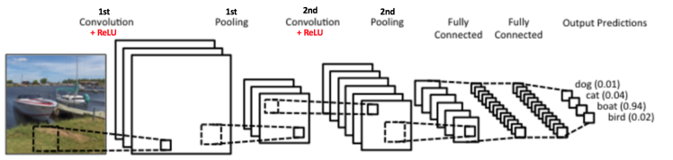

到目前为止我们了解了卷积、ReLU和池化是如何操作的。理解这些层是构建任意CNN的基础是很重要的。正如上图所示，我们有两组卷积、ReLU&池化层 —— 第二组卷积层使用六个滤波器对第一组的池化层的输出继续卷积，得到一共六个特征图。接下来对所有六个特征图应用ReLU。接着我们对六个修正特征图分别进行最大池化操作。

这些层一起就可以从图像中提取有用的特征，并在网络中引入非线性，减少特征维度，同时保持这些特征具有某种程度上的尺度变化不变性。

第二组池化层的输出作为全连接层的输入，我们会在下一部分介绍全连接层。

## 全连接层直观解释

全连接层是传统的多层感知器，在输出层使用的是softmax激活函数（也可以使用其他像SVM的分类器，但在本文中只使用softmax）。“全连接（Fully Connected）”这个词表明前面层的所有神经元都与下一层的所有神经元连接。如果你对多层感知器不熟悉的话，我推荐你阅读[这篇文章](https://ujjwalkarn.me/2016/08/09/quick-intro-neural-networks/)。

**卷积和池化层的输出表示了输入图像的高级特征。全连接层的目的是为了使用这些特征把输入图像基于训练数据集进行分类**。比如，在下面图中我们进行的图像分类有四个可能的输出结果（注意下图并没有显示全连接层的节点连接）。

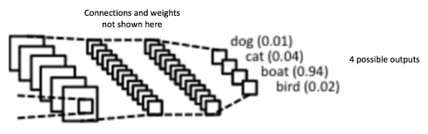

除了分类，添加一个全连接层也（一般）是学习这些特征的非线性组合的简单方法。从卷积和池化层得到的大多数特征可能对分类任务有效，但这些特征的组合可能会更好。

从全连接层得到的输出概率和为1。这个可以在输出层使用softmax作为激活函数进行保证。softmax函数输入一个任意大于0值的矢量，并把它们转换为零一之间的数值矢量，其和为一。

## 组合并用反向传播训练

正如上面讨论的，**卷积+池化层的作用是从输入图像中提取特征，而全连接层的作用是分类器**。

注意在下面的图中，因为输入的图像是船，对于船这一类的目标概率是1，而其他三类的目标概率是0，即

* 输入图像 = 船
* 目标矢量 = [0, 0, 1, 0]

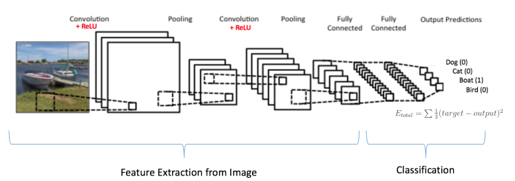

完整的卷积网络的训练过程可以总结如下：

* 第一步：我们初始化所有的滤波器，使用随机值设置参数/权重
* 第二步：网络接收一张训练图像作为输入，通过前向传播过程（卷积、ReLU 和池化操作，以及全连接层的前向传播），找到各个类的输出概率
  * 我们假设船这张图像的输出概率是 [0.2, 0.4, 0.1, 0.3]
  * 因为对于第一张训练样本的权重是随机分配的，输出的概率也是随机的
* 第三步：在输出层计算总误差（计算4类的和）
  * Total Error = ∑  ½ (target probability – output probability) ²
* 第四步：使用反向传播算法，根据网络的权重计算误差的梯度，并使用梯度下降算法更新所有滤波器的值/权重以及参数的值，使输出误差最小化
  * 权重的更新与它们对总误差的占比有关
  * 当同样的图像再次作为输入，这时的输出概率可能会是 [0.1, 0.1, 0.7, 0.1]，这就与目标矢量 [0, 0, 1, 0] 更接近了
  * 这表明网络已经通过调节权重/滤波器，可以正确对这张特定图像的分类，这样输出的误差就减小了
  * 像滤波器数量、滤波器大小、网络结构等这样的参数，在第一步前都是固定的，在训练过程中保持不变——仅仅是滤波器矩阵的值和连接权重在更新
* 第五步：对训练数据中所有的图像重复步骤1~4

上面的这些步骤可以**训练**ConvNet——这本质上意味着对于训练数据集中的图像，ConvNet在更新了所有权重和参数后，已经优化为可以对这些图像进行正确分类。

当一张新的（未见过的）图像作为ConvNet的输入，网络将会再次进行前向传播过程，并输出各个类别的概率（对于新的图像，输出概率是使用已经在前面训练样本上优化分类的参数进行计算的）。如果我们的训练数据集非常的大，网络将会（有希望）对新的图像有很好的泛化，并把它们分到正确的类别中去。

注：

1. 上面的步骤已经简化，也避免了数学详情，只为提供训练过程的直观内容。可以参考文献4和12了解数学公式和完整过程。
2. 在上面的例子中我们使用了两组卷积和池化层。然而请记住，这些操作可以在一个ConvNet中重复多次。实际上，现在有些表现最好的ConvNet 拥有多达十几层的卷积和池化层！同时，每次卷积层后面不一定要有池化层。如下图所示，我们可以在池化操作前连续使用多个卷积+ReLU操作。还有，请注意ConvNet的各层在下图中是如何可视化的。

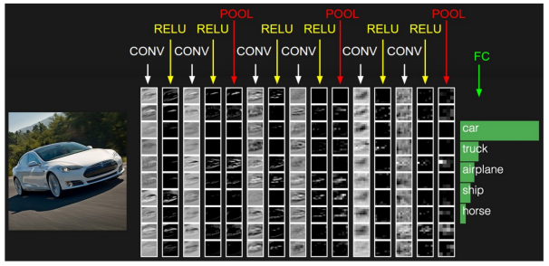

## 卷积神经网络的可视化

一般而言，越多的卷积步骤，网络可以学到的识别特征就越复杂。比如，ConvNet 的图像分类可能在第一层从原始像素中检测出边缘，然后在第二层使用边缘检测简单的形状，接着使用这些形状检测更高级的特征，比如更高层的人脸。下面的图中展示了这些内容——我们使用[卷积深度置信网络](http://web.eecs.umich.edu/~honglak/icml09-ConvolutionalDeepBeliefNetworks.pdf)学习到的特征，这张图仅仅是用来证明上面的内容（这仅仅是一个例子：真正的卷积滤波器可能会检测到对我们毫无意义的物体）。

Adam Harley创建了一个卷积神经网络的可视化结果http://scs.ryerson.ca/~aharley/vis/conv/，使用的是MNIST手写数字的训练集。我强烈建议使用它来理解CNN的工作原理。

我们可以在下图中看到网络是如何识别输入“8” 的。注意下图中的可视化并没有单独展示ReLU操作。

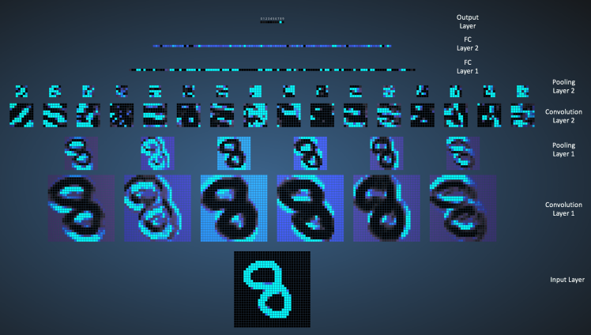

输入图像包含1024个像素（32x32 大小），第一个卷积层（卷积层1）由六个独特的5x5（步长为1）的滤波器组成。如图可见，使用六个不同的滤波器得到一个深度为六的特征图。

卷积层1后面是池化层1，在卷积层1得到的六个特征图上分别进行2x2的最大池化（步长为2）的操作。你可以在池化层上把鼠标移动到任意的像素上，观察在前面卷积层（如上图所示）得到的4x4的小格。你会发现4x4小格中的最大值（最亮）的像素将会进入到池化层。

池化层1后面的是十六个5x5（步长为 1）的卷积滤波器，进行卷积操作。后面就是池化层2，进行2x2的最大池化（步长为2）的操作。这两层的概念和前面描述的一样。

接下来我们就到了三个全连接层。它们是：

* 第一个全连接层有120个神经元
* 第二层全连接层有84个神经元
* 第三个全连接层有10个神经元，对应10个数字——也就做输出层

注意在下图中，输出层中的10个节点的各个都与第二个全连接层的所有100个节点相连（因此叫做全连接）。

同时，注意在输出层那个唯一的亮的节点是如何对应于数字 “8” 的——这表明网络把我们的手写数字正确分类（越亮的节点表明从它得到的输出值越高，即，8是所有数字中概率最高的）。

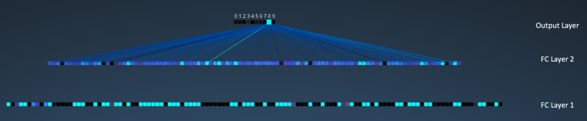

同样的3D可视化可以在[这里](http://scs.ryerson.ca/~aharley/vis/conv/)看到。

## 其他的ConvNet架构

卷积神经网络从上世纪90年代初期开始出现。我们上面提到的LeNet是早期卷积神经网络之一。其他有一定影响力的架构如下所示：

- LeNet(1990s)：本文已介绍
- 1990s to 2012：在上世纪90年代后期至2010年初期，卷积神经网络进入孵化期。随着数据量和计算能力的逐渐发展，卷积神经网络可以处理的问题变得越来越有趣。
- AlexNet(2012)–在2012，Alex Krizhevsky（与其他人）发布了[AlexNet](https://papers.nips.cc/paper/4824-imagenet-classification-with-deep-convolutional-neural-networks.pdf)，它是比LeNet更深更宽的版本，并在2012年的ImageNet大规模视觉识别大赛（ImageNet Large Scale Visual Recognition Challenge，ILSVRC）中以巨大优势获胜。这对于以前的方法具有巨大的突破，当前CNN大范围的应用也是基于这个工作。
- ZF Net(2013)–ILSVRC 2013的获胜者是来自Matthew Zeiler和Rob Fergus的卷积神经网络。它以[ZFNet](http://arxiv.org/abs/1311.2901)（Zeiler & Fergus Net的缩写）出名。它是在AlexNet 架构超参数上进行调整得到的效果提升。
- GoogleNet(2014)–ILSVRC 2014的获胜者是来自于Google的[Szegedy](http://arxiv.org/abs/1409.4842)等人的卷积神经网络。它的主要贡献在于使用了一个Inception模块，可以大量减少网络的参数个数（4M，AlexNet有60M的参数）。
- VGGNet(2014)–在ILSVRC 2014的领先者中有一个[VGGNet](http://www.robots.ox.ac.uk/~vgg/research/very_deep/) 的网络。它的主要贡献是展示了网络的深度（层数）对于性能具有很大的影响。
- ResNets(2015)–[残差网络](http://arxiv.org/abs/1512.03385)是何凯明（和其他人）开发的，并赢得ILSVRC 2015的冠军。ResNets是当前卷积神经网络中最好的模型，也是实践中使用ConvNet的默认选择（截至到2016年五月）。
- DenseNet(2016八月)–近来由Gao Huang（和其他人）发表的，[the Densely Connected Convolutional Network](http://arxiv.org/abs/1608.06993)的各层都直接于其他层以前向的方式连接。DenseNet在五种竞争积累的目标识别基准任务中，比以前最好的架构有显著的提升。可以在[这里](https://github.com/liuzhuang13/DenseNet)看Torch实现。

## CNN直观解释的总结

在本篇文章中，我尝试使用简单的方式来解释卷积神经网络背后的主要概念。我简化/跳过了一些细节，但希望本篇文章可以让你对它们有一定的了解。

本文最开始是受Denny Britz 的[理解用于自然语言处理的卷积神经网络](http://www.wildml.com/2015/11/understanding-convolutional-neural-networks-for-nlp/)（我强烈建议阅读）启发，大量的解释也是基于那篇文章。如果你想要对这些概念有更深的理解，我建议你浏览一下[Stanford 的 ConvNet 课程](http://cs231n.stanford.edu/)中的[笔记](http://cs231n.github.io/)，以及下面所列的参考文献。如果你对上面的概念有什么疑问，或者有问题和建议，欢迎在下面留言。

本文中使用的所有图像和动画的版权都归下面参考文献中对应作者所有。

**参考文献**

1. [Clarifai Home Page](https://www.clarifai.com/)
2. Shaoqing Ren, et al, “Faster R-CNN: Towards Real-Time Object Detection with Region Proposal Networks”, 2015, [arXiv:1506.01497](http://arxiv.org/pdf/1506.01497v3.pdf)
3. [Neural Network Architectures](http://culurciello.github.io/tech/2016/06/04/nets.html), Eugenio Culurciello’s blog
4. [CS231n Convolutional Neural Networks for Visual Recognition, Stanford](http://cs231n.github.io/convolutional-networks/)
5. [Clarifai / Technology](https://www.clarifai.com/technology)
6. [Machine Learning is Fun! Part 3: Deep Learning and Convolutional Neural Networks](https://medium.com/@ageitgey/machine-learning-is-fun-part-3-deep-learning-and-convolutional-neural-networks-f40359318721#.2gfx5zcw3)
7. [Feature extraction using convolution, Stanford](http://deeplearning.stanford.edu/wiki/index.php/Feature_extraction_using_convolution)
8. [Wikipedia article on Kernel (image processing)](https://en.wikipedia.org/wiki/Kernel_(image_processing))
9. [Deep Learning Methods for Vision, CVPR 2012 Tutorial](http://cs.nyu.edu/~fergus/tutorials/deep_learning_cvpr12)
10. [Neural Networks by Rob Fergus, Machine Learning Summer School 2015](http://mlss.tuebingen.mpg.de/2015/slides/fergus/Fergus_1.pdf)
11. [What do the fully connected layers do in CNNs?](http://stats.stackexchange.com/a/182122/53914)
12. [Convolutional Neural Networks, Andrew Gibiansky](http://andrew.gibiansky.com/blog/machine-learning/convolutional-neural-networks/)
13. A. W. Harley, “An Interactive Node-Link Visualization of Convolutional Neural Networks,” in ISVC, pages 867-877, 2015 ([link](http://scs.ryerson.ca/~aharley/vis/harley_vis_isvc15.pdf))
14. [Understanding Convolutional Neural Networks for NLP](http://www.wildml.com/2015/11/understanding-convolutional-neural-networks-for-nlp/)
15. [Backpropagation in Convolutional Neural Networks](http://andrew.gibiansky.com/blog/machine-learning/convolutional-neural-networks/)
16. [A Beginner’s Guide To Understanding Convolutional Neural Networks](https://adeshpande3.github.io/adeshpande3.github.io/A-Beginner's-Guide-To-Understanding-Convolutional-Neural-Networks-Part-2/) Vincent Dumoulin, et al, “A guide to convolution arithmetic for deep learning”, 2015, [arXiv:1603.07285](http://arxiv.org/pdf/1603.07285v1.pdf)
17. [What is the difference between deep learning and usual machine learning?](https://github.com/rasbt/python-machine-learning-book/blob/master/faq/difference-deep-and-normal-learning.md)
18. [How is a convolutional neural network able to learn invariant features?](https://github.com/rasbt/python-machine-learning-book/blob/master/faq/difference-deep-and-normal-learning.md)
19. [A Taxonomy of Deep Convolutional Neural Nets for Computer Vision](http://journal.frontiersin.org/article/10.3389/frobt.2015.00036/full)

# 卷积神经网络的发展历程

卷积神经网络的发展过程如图所示：

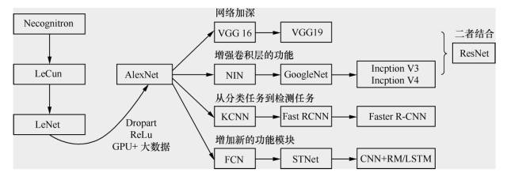

卷积神经网络发展的起点是神经认知机(neocognitron)模型，当时已经出现了卷积结构。第一个卷积神经网络模型诞生于1989年，其发明人是 LeCun。学习卷积神经网络的读本是 Lecun的论文，在这篇论文里面较为详尽地解释了什么是卷积神经网络，并且阐述了为什么要卷积，为什么要降采样，径向基函数(radial basis function，RBF)怎么用，等等。

1998年 LeCun 提出了 LeNet，但随后卷积神经网络的锋芒逐渐被 SVM 等手工设计的特征的分类器盖过。随着 ReLU 和 Dropout 的提出，以及GPU和大数据带来的历史机遇，卷积神经网络在2012年迎来了历史性突破—AlexNet。

如图所示，AlexNet 之后卷积神经网络的演化过程主要有4个方向的演化：

- 一个是网络加深；
- 二是增强卷积层的功能；
- 三是从分类任务到检测任务；
- 四是增加新的功能模块。

如上图，分别找到各个阶段的几个网络的论文，理解他们的结构和特点之后，在 TensorFlow Models 下，都有对这几个网络的实现。

对着代码理解，并亲自运行。随后在自己的数据集上做一做 finetune，会对今后工业界进行深度学习网络的开发流程有个直观的认识。

下面就简单讲述各个阶段的几个网络的结构及特点。

## 网络加深

### LeNet

> LeNet 的论文《GradientBased Learning Applied to Document  Recognition》
>
> http://vision.stanford.edu/cs598_spring07/papers/Lecun98.pdf
>
> LeCun的LeNet个人网站
>
> http://yann.lecun.com/exdb/lenet/index.html

LeNet包含的组件如下。

- 输入层：32×32
- 卷积层：3个
- 降采样层：2个
- 全连接层：1个
- 输出层（高斯连接）：10个类别（数字0～9的概率）

LeNet的网络结构如图所示：

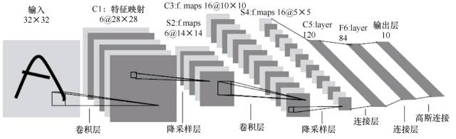

下面就介绍一下各个层的用途及意义。

- 输入层。输入图像尺寸为32×32。这要比MNIST数据集中的字母（28×28）还大，即对图像做了预处理 reshape 操作。这样做的目的是希望潜在的明显特征，如笔画断续、角点，能够出现在最高层特征监测卷积核的中心。
- 卷积层(C1, C3, C5)。卷积运算的主要目的是使原信号特征增强，并且降低噪音。在一个可视化的在线演示示例中，我们可以看出不同的卷积核输出特征映射的不同，如图所示。
- 下采样层(S2, S4)。下采样层主要是想降低网络训练参数及模型的过拟合程度。通常有以下两种方式。
  - 最大池化(max pooling)：在选中区域中找最大的值作为采样后的值。
  - 平均值池化(mean pooling)：把选中的区域中的平均值作为采样后的值。
- 全连接层(F6)。F6是全连接层，计算输入向量和权重向量的点积，再加上一个偏置。随后将其传递给sigmoid函数，产生单元i的一个状态。
- 输出层。输出层由欧式径向基函数(Euclidean radial basis function)单元组成，每个类别(数字的0～9)对应一个径向基函数单元，每个单元有84个输入。也就是说，每个输出RBF单元计算输入向量和该类别标记向量之间的欧式距离。距离越远，RBF 输出越大。

经过测试，采用 LeNet，6万张原始图片的数据集，错误率能够降低到0.95%；54万张人工处理的失真数据集合并上6万张原始图片的数据集，错误率能够降低到0.8%。

接着，历史转折发生在2012年，Geoffrey Hinton和他的学生Alex Krizhevsky在ImageNet竞赛中一举夺得图像分类的冠军，刷新了图像分类的记录，通过比赛回应了对卷积方法的质疑。比赛中他们所用网络称为AlexNet。

### AlexNet

AlexNet 在2012年的 ImageNet 图像分类竞赛中，Top-5错误率为15.3%；2011年的冠军是采用基于传统浅层模型方法，Top-5错误率为25.8%。AlexNet也远远超过2012年竞赛的第二名，错误率为26.2%。AlexNet 的论文详见Alex Krizhevsky、Ilya Sutskever和Geoffrey E．Hinton 的[《ImageNet Classification with Deep Convolutional Neural Networks》](https://papers.nips.cc/paper/4824-imagenet-classification-with-deep-convolutional-neural-networks.pdf)。

AlexNet 的结构如图所示。图中明确显示了两个GPU之间的职责划分：一个GPU运行图中顶部的层次部分，另一个GPU运行图中底部的层次部分。GPU之间仅在某些层互相通信。

AlexNet由5个卷积层、5个池化层、3个全连接层，大约5000万个可调参数组成。最后一个全连接层的输出被送到一个1000维的softmax层，产生一个覆盖1000类标记的分布。

AlexNet之所以能够成功，让深度学习卷积的方法重回到人们视野，原因在于使用了如下方法：

- **防止过拟合**：**Dropout**、**数据增强**（data augmentation）
- 非线性激活函数：**ReLU**
- **大数据训练**：120万（百万级）ImageNet图像数据
- **GPU**实现、LRN（local responce normalization）规范化层的使用

要学习如此多的参数，并且防止过拟合，可以采用两种方法：数据增强和Dropout。

**数据增强**：增加训练数据是避免过拟合的好方法，并且能提升算法的准确率。当训练数据有限的时候，可以通过一些变换从已有的训练数据集中生成一些新数据，来扩大训练数据量。通常采用的变形方式以下几种，具体效果如图所示。

- 水平翻转图像（又称反射变化，flip）
- 从原始图像（大小为256×256）随机地平移变换（crop）出一些图像（如大小为224×224）
- 给图像增加一些随机的光照（又称光照、彩色变换、颜色抖动）

**Dropout**。AlexNet做的是以0.5的概率将每个隐层神经元的输出设置为0。以这种方式被抑制的神经元既不参与前向传播，也不参与反向传播。因此，每次输入一个样本，就相当于该神经网络尝试了一个新结构，但是所有这些结构之间共享权重。因为神经元不能依赖于其他神经元而存在，所以这种技术降低了神经元复杂的互适应关系。因此，网络需要被迫学习更为健壮的特征，这些特征在结合其他神经元的一些不同随机子集时很有用。如果没有Dropout，我们的网络会表现出大量的过拟合。Dropout 使收敛所需的迭代次数大致增加了一倍。

Alex 用非线性激活函数ReLU代替了sigmoid，发现得到的SGD的收敛速度会比 sigmoid/tanh快很多。单个GTX 580 GPU只有3 GB 内存，因此在其上训练的数据规模有限。从AlexNet结构图可以看出，它将网络分布在两个GPU上，并且能够直接从另一个GPU的内存中读出和写入，不需要通过主机内存，极大地增加了训练的规模。

## 增强卷积层的功能

### VGGNet

VGGNet 可以看成是加深版本的AlexNet，参见Karen Simonyan和Andrew Zisserman的论文[《Very Deep Convolutional Networks for Large-Scale Visual Recognition》](https://arxiv.org/pdf/1409.1556.pdf)。

VGGNet和下文中要提到的GoogLeNet是2014年ImageNet竞赛的第二名和第一名，Top-5错误率分别为7.32%和6.66%。VGGNet也是5个卷积组、2层全连接图像特征、1层全连接分类特征，可以看作和AlexNet一样总共8个部分。根据前5个卷积组，VGGNet论文中给出了A～E这5种配置，如图所示。卷积层数从8（A 配置）到16（E 配置）递增。VGGNet不同于AlexNet的地方是：VGGNet使用的层更多，通常有16～19层，而AlexNet只有8层。

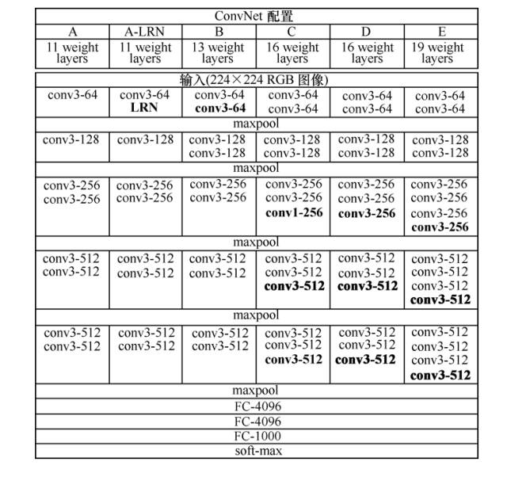

### GoogLeNet

提到GoogleNet，我们首先要说起NIN(Network in Network)的思想（详见Min Lin和Qiang Chen和Shuicheng Yan的论文[《Network In Network》](https://arxiv.org/pdf/1312.4400.pdf)），它对传统的卷积方法做了两点改进：将原来的线性卷积层（linear convolution layer）变为多层感知卷积层（multilayer perceptron）；将全连接层的改进为全局平均池化。这使得卷积神经网络向另一个演化分支：增强卷积模块的功能的方向演化，2014年诞生了GoogLeNet（即Inception V1）。谷歌公司提出的GoogLeNet是2014年ILSVRC挑战赛的冠军，它将Top-5的错误率降低到了6.67%。GoogLeNet的更多内容详见Christian Szegedy和Wei Liu等人的论文[《Going Deeper with Convolutions》](https://arxiv.org/pdf/1409.4842.pdf)。

GoogLeNet的主要思想是围绕“深度”和“宽度”去实现的。

- 深度。层数更深，论文中采用了22层。为了避免梯度消失问题，GoogleNet巧妙地在**不同深度处增加了两个损失函数来避免反向传播时梯度消失的现象**。
- 宽度。增加了多种大小的卷积核，如1×1、3×3、5×5，但并没有将这些全都用在特征映射上，都结合起来的特征映射厚度将会很大。但是采用了[论文](https://arxiv.org/pdf/1409.4842.pdf)中Figure2右侧所示的降维的**Inception**模型，在3×3、5×5卷积前，和最大池化后都分别加上了1×1的卷积核，起到了**降低特征映射厚度**的作用。

## ResNet（网络加深+增强卷积层）

**网络退化现象：** 
层数增加，错误率却上升。 
解决方法：ResNet中引入了shortcut结构，将输入跳层传递与卷积的结果相加。

**残差ResNet思想：** 
如果能用几层网络去逼近一个复杂的非线性映射H(x)来预测图片的分类，那么同样可以用这几层网络去逼近它的残差函数F(x)=H(x)-x，且我们认为优化残差映射要比直接优化H(x)简单。当输入层的图像比原图大，**reshape的目的：**希望潜在的明显特征，如笔画断续、角点，能够出现在最高层特征检测卷积核的中心

## 从分类任务到检测任务

RCNN → Fast RCNN → Faster RCNN

可达到实时。辅助无人驾驶。

## 增加新的功能模块

FCN → STnet → CNN+RM/LSTM

FCN（反卷积）

# 卷积层

## 什么是卷积运算

### 基本假设：特征局部相关性

CNN（卷积神经网络），它的基本假设是特征的不同维度之间有局部相关性，卷积操作可以抓住这种局部相关性，形成新的特征，这是卷积神经网络**有效的基础**。比如自然语言里，有重复出现的bigram，或者图像里代表性的局部像素块。**由于对图像提取的各特征之间有局部相关性，所以才能做卷积层层提取并组合抽象形成新的特征**。不满足这种局部相关性的数据，比如收到的邮件序列，这种局部相关性很弱，那用CNN就不能抓到有用的特征。

### 卷积运算的数学公式

现在从最基础的开始，对二维数字信号（图像）的操作，可以写成矩阵形式：

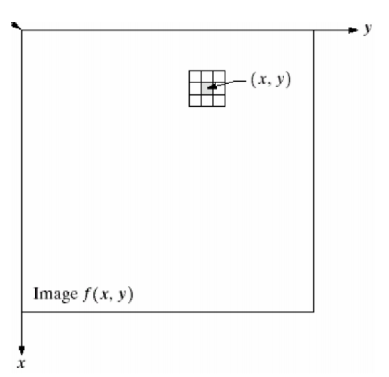

比如对图像做平滑，一个典型的8领域平滑，其结果中的每个值都来源于原对应位置和其周边8个元素与一个3 × 3矩阵的乘积：

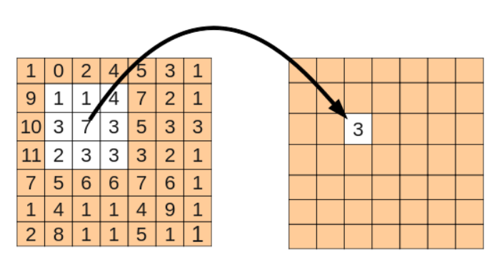

也就相当于对原矩阵，按照顺序将各区域元素与W矩阵相乘，W矩阵为：

这也被称作核(Kernel, 3X3)，其处理效果如下：

也就是，这个核对图像进行操作，相当于对图像进行了低通滤波。因此这个核也被称为滤波器，整个操作过程按照概念称为卷积。

扩展来讲，对二维图像的滤波操作可以写成卷积，比如常见的高斯滤波、拉普拉斯滤波（算子）等。
$$
G(x,y)=\frac{1}{2\pi\sigma^2}\text{exp}\left(-\frac{x^2+y^2}{2\sigma^2}\right)
$$

为什么深度学习中图像的卷积有用呢？因为它**能找出特征**。

图像中可能含有很多我们不关心的噪音。一个好例子是针对时尚图像用深度编码器做的搜索引擎：你上传一幅时尚服饰的图片，编码器自动找出款式类似的服饰。

如果你想要区分衣服的式样，那么衣服的颜色就不那么重要了；另外像商标之类的细节也不那么重要。最重要的可能是衣服的外形。如果我们过滤掉这些多余的噪音，那我们的算法就不会因颜色、商标之类的细节分心了。我们可以通过卷积轻松地实现这项处理。

下图展示了通过索贝尔边缘检测滤波器去掉了图像中除了边缘之外的所有信息——这也是为什么卷积应用经常被称作滤波而卷积核经常被称作滤波器的原因。由边缘检测滤波器生成的feature map对区分衣服类型非常有用，因为只有外形信息被保留下来。

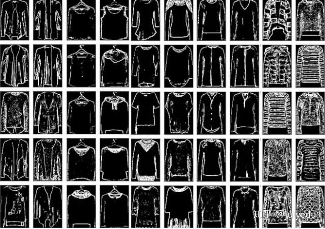

使用这种手段——读入输入、变换输入、然后把feature map喂给某个算法——被称为**特征工程**。特征工程非常难，很少有资料帮你上手。造成的结果是，很少有人能熟练地在多个领域应用特征工程。特征工程是纯手工，也是Kaggle比赛中最重要的技能。特征工程这么难的原因是，对每种数据每种问题，有用的特征都是不同的：图像类任务的特征可能对时序类任务不起作用；即使两个任务都是图像类的，也很难找出相同的有效特征，因为视待识别的物体的不同，有用的特征也不同。这非常依赖经验。

所以特征工程对新手来讲特别困难。不过对图像而言，是否可以利用卷积核自动找出某个任务中最适合的特征？卷积神经网络就是干这个的。不同于刚才使用固定数字的卷积核，我们赋予参数给这些核，参数将在数据上得到训练。随着卷积神经网络的训练，这些卷积核为了得到有用信息，在图像或feature map上的过滤工作会变得越来越好。这个过程是自动的，称作特征学习。特征学习自动适配新的任务：我们只需在新数据上训练一下自动找出新的过滤器就行了。这是卷积神经网络如此强大的原因——**不需要繁重的特征工程**了！

现在我们来正式解释一下Convolution（卷积）。一般我们接触过的都是一维信号的卷积，也就是
$$
y[n]=x[n]*h[n]=\sum_kx[k]h[n-k]
$$
在信号处理中，x[n]是输入信号，h[n]是单位响应。于是输出信号y[n]就是输入信号x[n]响应的延迟叠加。这也就是一维卷积本质：加权 叠加/积分。

那么对于二维信号，比如图像，卷积的公式就成了：
$$
y[m,n]=x[m,n]*h[m,n]=\sum_j\sum_ix[i,j]h[m-i,n-j]
$$
假设现在Convolution Kernel大小3x3，我们就可以化简上式为
$$
\begin{aligned}
y[1,1]&=\sum_{j=-\infty}^{\infty}\sum_{i=-\infty}^{\infty}x[i,j]\cdot h[1-i,1-j]\\
&=x[0,0]\cdot h[1,1]+x[1,0]\cdot h[0,1]+x[2,0]\cdot h[-1,1]\\
&=x[0,1]\cdot h[1,0]+x[1,1]\cdot h[0,0]+x[2,1]\cdot h[-1,0]\\
&=x[0,2]\cdot h[1,-1]+x[1,2]\cdot h[0,-1]+x[2,2]\cdot h[-1,-1]\\
\end{aligned}
$$
看公式很繁琐，我们画个图看看，假如Convolution Kernel如下图

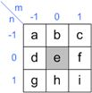

那么，从Input Image到Output Image的变化如下：

可以看出，其实二维卷积一样也是**加权 叠加/积分**。需要注意的是，其中Convolution Kernel进行了水平和竖直方向的翻转。

Convolution Kernel其实在图像处理中并不是新事物，Sobel算子等滤波算子，一直都在被用于边缘检测等工作中，只是以前被称为Filter。图像处理的同学应该有印象。

Convolution Kernel的一个属性就是局部性。即它只关注局部特征，局部的程度取决于Convolution Kernel的大小。比如用Sobel算子进行边缘检测，本质就是比较图像邻近像素的相似性。

也可以从另外一个角度理解Convolution Kernel的意义。学过信号处理的同学应该记得，时域卷积对应频域相乘。所以原图像与Convolution Kernel的卷积，其实对应频域中对图像频段进行选择。比如，图像中的边缘和轮廓属于是高频信息，图像中区域强度的综合考量属于低频信息。在传统图像处理里，这些物理意义是指导设计Convolution Kernel的一个重要方面。

### CNN中的卷积核

CNN中的Convolution Kernel跟传统的Convolution Kernel本质没有什么不同。仍然以图像为例，Convolution Kernel依次与Input不同位置的图像块做卷积，得到Output，如下图：

同时，CNN有一些它独特的地方，比如各种定义，以及它属于DNN的那些属性：

1. CNN可以看作是DNN的一种简化形式，Input和Output是DNN中的Layer，Convolution Kernel则是这两层连线对应的w，且与DNN一样，会加一个参数Bias b
2. 一个Convolution Kernel在与Input不同区域做卷积时，它的参数是固定不变的。放在DNN的框架中理解，就是对Output Layer中的神经元而言，它们的w和b是相同的，只是与Input Layer中连接的节点在改变。在CNN里，这叫做Shared Weights and Biases
3. 在 CNN 中，Convolution Kernel可能是高维的。假如输入是m × n × k维的，那么一般Convolution Kernel就会选择为d × d × k维，也就是与输入的Depth一致
4. 最重要的一点，在CNN中，Convolution Kernel的权值其实就是w，因此不需要提前设计，而是跟DNN一样利用梯度下降法来优化
5. 如上面所说，Convolution Kernel卷积后得到的会是原图的某些特征（如边缘信息），所以在CNN中，Convolution Kernel卷积得到的Layer称作Feature Map
6. 一般CNN中一层会含有多个Convolution Kernel，目的是学习出Input的不同特征，对应得到多个Feature Map。又由于Convolution Kernel中的参数是通过梯度下降法优化得到而非设定的，于是w的初始化就显得格外重要了

滤波器跟卷积神经网络有什么关系呢。不如我们预想一个识别问题：我们要识别图像中的某种特定曲线，也就是说，这个滤波器要对这种曲线有很高的输出，对其他形状则输出很低，这也就像是神经元的**激活**。

我们设计的滤波器和想要识别的曲线如下：

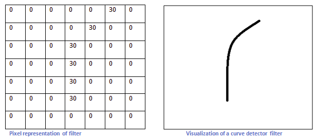

假设上面的核（滤波器）按照卷积顺序沿着下图移动：

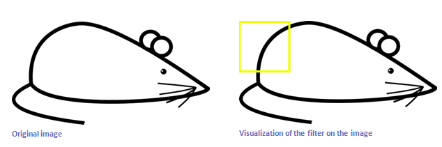

注意：上图没有考虑卷积核的翻转，数学上的卷积核确实要翻转，但是这里的卷积核是学习到的，所以有没有反转没有任何影响。

那么当它移动到上面的位置时，按照矩阵操作，将这个区域的图像像素值与滤波器相乘，我们得到一个很大的值（6600）：

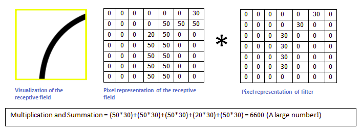

而当这个滤波器移动到其他区域时，我们得到一个相对很小的值：

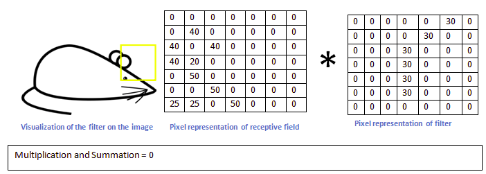

如此，我们对整个原图进行一次卷积，得到的结果中，**在那个特定曲线和周边区域，值就很高**，在其他区域，值相对低。这就是一张**激活**图。对应的**高值区域就是我们所要检测曲线的位置**。

在训练卷积审计网络（CNN）的某一个卷积层时，我们实际上是在训练一系列的滤波器（filter）。比如，对于一个32 × 32 × 3（宽32像素 × 高32像素 × RGB三通道）的图像，如果我们在CNN的第一个卷积层定义训练12个滤波器，那就这一层的输出便是32 × 32 × 12。按照不同的任务，我们可以对这个输出做进一步的处理，这包括激活函数，池化，全连接等。

简单来说，训练CNN在相当意义上是在训练每一个卷积层的滤波器。让这些滤波器组**对特定的模式有高的激活**，以达到CNN网络的分类/检测等目的。

下图为一个实际CNN（AlexNet）第一个卷积层的滤波器：

卷积神经网络的第一个卷积层的滤波器用来检测低阶特征，比如边、角、曲线等。随着卷积层的增加，对应滤波器检测的特征就更加复杂（理性情况下，也是我们想要的情况）。比如第二个卷积层的输入实际上是第一层的输出（滤波器激活图），这一层的滤波器便是用来检测**低阶特征的组合**等情况（半圆、四边形等），**如此累积，层层抽象概括，以检测越来越复杂的特征**。实际上，我们的人类大脑的视觉信息处理也遵循这样的低阶特征到高阶特征的模式。最后一层的滤波器按照训练CNN目的的不同，可能是在检测到人脸、手写字体等时候激活。

所以，在相当程度上，构建卷积神经网络的任务就在于构建这些滤波器。也就是，将这些滤波器变成这样（改变滤波器矩阵的值，也就是Weight）的——能识别特定的特征。这个过程叫做**训练**。

在训练开始之时，卷积层的滤波器是完全随机的，它们不会对任何特征激活（不能检测任何特征）。这就像刚出生的孩子，它不知道什么是人脸、什么是狗，什么是上下左右。它需要学习才知道这些概念，也就是通过接触人脸、狗、上下左右，并被告知这些东西分别是人脸、狗、上下左右。然后它才能在头脑中记住这些概念，并在之后的某一次见到之后能准确的给出结果。

把一个空白的滤波器，修改其权重（weights）以使它能检测特定的模式，整个过程就如工程里面的反馈：

想想一下，如果有一只无意识的猴子，完全随机的修改一个5 × 5滤波器矩阵的25个值，那完全可能经过一定的轮次之后，这个滤波器能够检测棱角等特征。这是一种无反馈的训练情况。对神经网络的训练当然不能如此，我们不可能靠运气去做这件事情。

举个例子，我们要训练一个用于分类的神经网络，让它能判定输入图像中的物体最可能是十个类别的哪一类。那么，训练过程就是这样的：

第一次训练，输入一张图像，这个图像通过各层卷积处理输出量一组向量[1,1,1,1,1,1,1,1,1,1]，也就是，对于完全由随机滤波器构建的网络，其输出认为这张图等概率的是十个类别中的某一种。但是对于训练，我们有一个真实标签，也就是这张图中物体所属的类别：[0，0，1，0，0，0，0，0，0，0]，也就是属于第三类。这时候我们可以定义一个损失函数，比如常见的MSE（mean squared error）。我们假定L是这个损失函数的输出。这时候我们的目的就是，让L的值反馈（这种神经网络概念下称为back propagation， 反向传输）给整个卷积神经网络，以修改各个滤波器的权重，使得损失值L最小。

这是一个典型的最优化问题。当然地，在工程上我们几乎不可能一次就把滤波器的权重W修改到使L最小的情况，而是需要多次训练和多次修改。

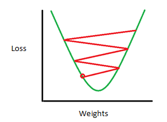

如果情况理想的话，权重修改的方向是使得L的变化收敛的。这也就是说很可能达到了我们训练这个神经网络的目的——**让各个卷积层的滤波器能够组合起来最优化的检测特定的模式**。

## 使用卷积运算的动机

卷积运算通过三个重要的思想来帮助改进机器学习系统： 稀疏交互（sparse interactions）、 参数共享（parameter sharing）、 等变表示（equivariant representations）。另外，卷积提供了一种处理大小可变的输入的方法。我们下面依次介绍这些思想。 

###  稀疏交互

传统的神经网络使用矩阵乘法来建立输入与输出的连接关系。其中，参数矩中每一个单独的参数都描述了一个输入单元与一个输出单元间的交互。这意着每一个输出单元与每一个输入单元都产生交互。

然而， 卷积网络具有稀疏交互（sparse interactions）（也叫做稀疏连接（sparse connectivity）或者稀疏权重（sparse weights））的特征。这是使**核的大小远小于输入的大小**来达到的。举个例子，处理一张图像时，输入的图像可能包含成千上万个像素点，但是我们可以通过只用几十到上百个像素点的核来检测一些小的有意义的特征，例如图像的边缘。这味着我们需要存储的参数更少，不仅减少了模型的存储需求，而且提高了它的统计效率。这也意味着为了得到输出我们只需要更少的计算量。这些效率上的提高往往是很显著的。如果有m个输入和n个输出，那么矩阵乘法需要m×n个参数并且相应算法的时间复杂度为O(m×n)（对于每一个例子）。如果我们限制每一个输出拥有的连接数为k，那么稀疏的连接方法只需要k×n个参数以及O(k×n)的运行时间。在很多实际应用中，只需保持k比m小几个数量级，就能在机器学习的任务中取得好的表现。 稀疏连接的**图形化解释**如下图和下下图所示。

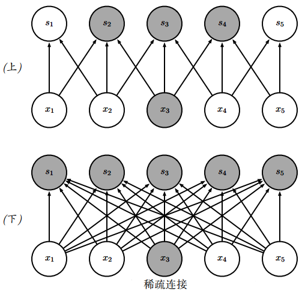

上图中，对每幅图从上往下看。我们强调了一个输入单元x3以及在s中受该单元影响的输出单元。

* （上）当s是由核宽度为3的卷积产生时，只有三个输出受到x的影响
* （下）当s是由矩阵乘法产生时，连接不再是稀疏的，所以所有的输出都会受到x3的影响

在上图中，对每幅图从上往下看。我们强调了一个输出单元s3以及x中影响该单元的输入单元。这些单元被称为s3的接受域（receptive field）。 

* （上）当s是由核宽度为3的卷积产生时，只有三个输入影响s3
* （下）当s是由矩阵乘法产生时，连接不再是稀疏的，所以所有的输入都会影响s3

在深度卷积网络中，**处在网络深层的单元可能与绝大部分输入是间接交互的**，如下图所示。这允许网络可以通过只描述稀疏交互的基石来高效地描述多个变量的复杂交互。 

如上图所示，处于卷积网络更深的层中的单元，它们的接受域要比处在浅层的单元的接受域更大。如果网络还包含类似步幅卷积或者池化之类的结构特征，这种效应会加强。这意味着在卷积网络中尽管直接连接都是很稀疏的，但处在更深的层中的单元可以间接地连接到全部或者大部分输入图像。 

###  参数共享

参数共享（parameter sharing）是指在一个模型的多个函数中使用相同的参数。在传统的神经网络中，当计算一层的输出时，权重矩阵的每一个元素只使用一次，当它乘以输入的一个元素后就再也不会用到了。作为参数共享的同义词，我们可以说一个网络含有**绑定的权重**（tied weights），因为用于一个输入的权重也会被绑定在其他的权重上。在卷积神经网络中，核的每一个元素都作用在输入的每一位置上（是否考虑边界像素取决于对边界决策的设计）。卷积运算中的参数共享保证了我们只需要学习一个参数集合，而不是对于每一位置都需要学习一个单独的参数集合。这虽然没有改变前向传播的运行时间（仍然是O(k×n)），但它显著地把模型的存储需求降低至k个参数，并且k通常要比m小很多个数量级。因为m和n通常有着大致相同的大小， k在实际中相对于m×n是很小的。因此，**卷积在存储需求和统计效率方面极大地优于稠密矩阵的乘法运算**。

下图演示了参数共享是如何实现的：

上图中，黑色箭头表示在两个不同的模型中使用了特殊参数的连接：

*  （上） 黑色箭头表示在卷积模型中对3元素核的中间元素的使用。因为参数共享，这个单独的参数被用于所有的输入位置
*  （下）这个单独的黑色箭头表示在全连接模型中对权重矩阵的中间元素的使用。这个模型没有使用参数共享，所以参数只使用了一次

作为前两条原则的一个**实际例子**，下图说明了稀疏连接和参数共享是如何显著提高线性函数在一张图像上进行边缘检测的效率的。

在上图中，右边的图像是通过先获得原始图像中的每个像素，然后减去左边相邻像素的值而形成的。这个操作给出了输入图像中所有垂直方向上的边缘的强度，对目标检测来说是有用的。两个图像的高度均为280个像素。输入图像的宽度为320个像素，而输出图像的宽度为319个像素。这个变换可以通过包含两个元素的卷积核来描述，使用卷积需要319 × 280 × 3 = 267960次浮点运算（每个输出像素需要两次乘法和一次加法）。为了用矩阵乘法描述相同的变换，需要一个包含320 × 280 × 319 × 280个或者说超过80亿个元素的矩阵，这使得卷积对于表示这种变换更有效40亿倍。直接运行矩阵乘法的算法将执行超过160亿次浮点运算，这使得卷积在计算上大约有60000倍的效率。当然，矩阵的大多数元素将为零。如果我们只存储矩阵的非零元，则矩阵乘法和卷积都需要相同数量的浮点运算来计算。矩阵仍然需要包含2 × 319 × 280 = 178640个元素。**将小的局部区域上的相同线性变换应用到整个输入上**，卷积是描述这种变换的极其有效的方法。 

### 等变表示

对于卷积，参数共享的特殊形式使得神经网络层具有对**平移等变**（equivariance）的性质。如果一个函数满足输入改变，输出也以同样的方式改变这一性质，我们就说它是等变（equivariant）的。特别地，如果函数f(x)与g(x)满足f(g(x)) = g(f(x))，我们就说f(x)对于变换g具有等变性。

对于卷积来说，如果令g是输入的任意平移函数，那么卷积函数对于g具有等变性。

举个例子，令I表示图像在整数坐标上的亮度函数，g表示图像函数的变换函数（把一个图像函数映射到另一个图像函数的函数）使得I′ = g(I)，其中图像函数I′满足I′(x, y) = I(x-1, y)。这个函数把I中的每个像素向右移动一个单位。如果我们先对I进行这种变换然后进行卷积操作所得到的结果，与先对I进行卷积然后再对输出使用平移函数g得到的结果是一样的。

当处理时间序列数据时，这意味着通过卷积可以得到一个由输入中出现不同特征的时刻所组成的时间轴。如果我们把输入中的一个事件向后延时，在输出中仍然会有完全相同的表示，只是时间延后了。图像与之类似，卷积产生了一个2维映射来表明某些特征在输入中出现的位置。如果我们移动输入中的对象，它的表示也会在输出中移动同样的量。当处理多个输入位置时，一些作用在邻居像素的函数是很有用的。例如在处理图像时，在卷积网络的第一层进行图像的边缘检测是很有用的。相同的边缘或多或少地散落在图像的各处，所以应当对整个图像进行参数共享。但在某些情况下，我们并不希望对整幅图进行参数共享。例如，在处理已经通过剪裁而使其居中的人脸图像时，我们可能想要提取不同位置上的不同特征（处理人脸上部的部分网络需要去搜寻眉毛，处理人脸下部的部分网络就需要去搜寻下巴了） 。

卷积对其他的一些变换**并不是天然等变**的，例如对于图像的放缩或者旋转变换，需要其他的一些机制来处理这些变换。

最后，一些不能被传统的由（固定大小的）矩阵乘法定义的神经网络处理的特殊数据，可能通过卷积神经网络来处理。

## 对CNN中卷积的理解

CNN的**核心**其实就是卷积核的作用，只要明白了这个问题，其余的就都是数学坑了（当然，相比较而言之后的数学坑更难）。

如果学过数字图像处理，对于卷积核的作用应该不陌生，比如你做一个最简单的方向滤波器，那就是一个二维卷积核，这个核其实就是一个**模板**，利用这个模板再通过卷积计算的定义就可以计算出一幅新的图像，**新的图像会把这个卷积核所体现的特征突出显示出来**。比如这个卷积核可以侦测水平纹理，那卷积出来的图就是原图水平纹理的图像。

现在假设要做一个图像的分类问题，比如辨别一个图像里是否有一只猫，我们可以先判断是否有猫的头，猫的尾巴，猫的身子等等，如果这些特征都具备，那么我就判定这应该是一只猫（如果用心的话你就会发现这就是CNN最后的分类层，这一部分是我们传统的神经网络的范畴）。关键在于这些特征是高级的语义特征，这种特征怎么用卷积核提取呢？

原来的卷积核都是人工事先定义好的，是经过算法设计人员精心设计的，他们发现这样或那样的设计卷积核通过卷积运算可以突出一个什么样的特征，于是就高高兴兴的拿去卷积了。但是现在我们所需要的这种特征**太高级**了，而且随任务的不同而不同，人工设计这样的卷积核非常困难。

于是，利用机器学习的思想，我们可以让他自己去**学习出卷积核来**！也就是**学习出特征**！

如前所述，判断是否是一只猫，只有一个特征不够，比如仅仅有猫头是不足的，因此需要多个高级语义特征的组合，所以应该需要**多个卷积核**，这就是为什么需要学习多个卷积核的原因。

还有一个问题，那就是为什么CNN要设计这么多层呢？首先，应该要明白，猫的头是一个特征，但是对于充斥着像素点的图像来说，用几个卷积核直接判断存在一个猫头的还是太困难，怎么办？简单，**把猫头也作为一个识别目标**，比如猫头应该具有更底层的一些语义特征，比如应该有猫的眼睛、猫的耳朵、猫的鼻子等等。这些特征有的还是太高级了，没关系，继续**向下寻找低级特征**，一直到最低级的像素点，这样就构成了多层的神经网络。

最好，CNN最不好理解的就要放大招了。虽然我们之前一直用一些我们人常见的语义特征做例子，但是实际上CNN会学习出猫头、猫尾巴、猫身然后经判定这是猫吗？显然我们的CNN完全不知道什么叫猫头、猫尾巴，也就是说，CNN不知道什么是猫头猫尾巴，它学习到的只是一种**抽象特征**，甚至可能**有些特征在现实世界并没有对应的名词，但是这些特征组合在一起计算机就会判定这是一只猫**！关于这一点，确实有些难以理解，比如一个人判断猫是看看有没有猫头、猫身子、猫尾巴，但是另一个选取的特征就是有没有猫的毛，猫的爪子，还有的人更加奇怪，他会去通过这张图像里是不是有老鼠去判断，而我们的CNN，则是**用它自己学习到的特征去判断**。

CNN称之为深度学习，要义就在这个**深**字上，对于CNN而言，这个深其实就是意味着**层层的特征表示**。比如浅层的特征，例如点、线、面之类的简单几何形状，都是在底层训练出来的，对于这些**底层的特征继续进行组合表示，就是后面的若干层的任务**。**最后把从低级特征组合而来的高级特征在进一步变成语义特征，就可以使用全连接层进行分类了**。也就是说，最后一次分类并不一定要用神经网络，如果已经拿到了足够好的特征信息，使用其余的分类器也未尝不可。

这就是为什么CNN可以基于原来已经训练好的网络进行微调的原因，例如你要完成一个分类猫和狗的任务，你需要从头训练一个CNN网络吗？假设你的猫狗图片样本量并不是很大，这并不是一个好主意。好的办法是，拿一个经过大型图像数据集，比如ImageNet，训练过的大规模CNN（比如VGG NET）直接载入训练，这个过程称之为fine-tuning（微调）。因为这个CNN底层已经训练到了丰富的细节信息，你所需要训练的其实是上层对这些特征的组合信息，以及最后全连接层的分类信息，所以**完全不需要从头再来**。这也证明了CNN确实可以有**迁移学习**的能力。

从上面我们可以看出来，CNN里结构大都对应着传统图像处理某种操作。区别在于，以前是我们利用**专家知识**设计好每个操作的细节，而现在是利用训练样本+优化算法**学习出网络的参数**。在实际工程中，我们也必须根据实际物理含义对CNN结构进行取舍。

但是，随着Convolution的堆叠，Feature Map变得越来越**抽象**，人类已经很难去理解了。为了攻克这个黑箱，现在大家也都在尝试各种不同的方式来对CNN中的细节进行理解，因为如果没有足够深的理解，或许很难发挥出CNN更多的能力。不过，这就是另外一个很大的课题了。

# 池化层

## 池化层概念

CNN的部件其实大致分为三个，卷积层、池化层、全连接层，这也是LeNet-5的经典结构，之后大部分CNN网络其实都是在这三个基本部件上做各种组合和改进。卷积层之前已经介绍过了，全连接层就是连在最后的分类器，是一个普通的bp网络，实际上如果训练得到的特征足够好，这里也可以选择其他的分类器，比如SVM等。

在通过卷积获得了特征（features）之后，下一步我们希望利用这些特征去做分类。理论上讲，人们可以用所有提取得到的特征去训练分类器，例如softmax分类器，但这样做面临计算量的挑战。例如：对于一个 96 × 96 像素的图像，假设我们已经学习得到了400个定义在8 × 8输入上的特征，每一个特征和图像卷积都会得到一个(96 − 8 + 1) × (96 − 8 + 1) = 7921维的卷积特征，由于有400个特征，所以每个样例（example）都会得到一个 892 × 400 = 3168400 维的卷积特征向量。学习一个拥有超过3百万特征输入的分类器十分不便，并且容易出现过拟合（over-fitting）。

为了解决这个问题，首先回忆一下，我们之所以决定使用卷积后的特征是因为图像具有一种“静态性”的属性，这也就意味着在一个图像区域有用的特征极有可能在另一个区域同样适用。因此，为了描述大的图像，一个很自然的想法就是对不同位置的特征进行**聚合统计**，例如，人们可以计算图像一个区域上的某个特定特征的平均值 (或最大值)。这些概要统计特征不仅具有低得多的维度（相比使用所有提取得到的特征），同时还会改善结果（不容易过拟合）。这种**聚合的操作**就叫做池化（pooling）。

池化层亦称子采样层，它也是卷积神经网络的另外一个“神来之笔”。通常来说，当卷积层提取目标的某个特征之后，我们都要在两个相邻的卷积层之间安排一个池化层。

池化层是干什么的呢？

下图显示池化如何应用于一个图像的四块不重合区域。

池化，英文是pooling，字面上看挺难懂，但其实这可能是CNN里**最简单**的一步了。我们可以不按字面理解，把它理解成下采样（subsampling）。池化分为最大值池化和平均值池化，和卷积差不多，也是取一小块区域，比如一个5 × 5的方块，如果是最大值池化，那就选这25个像素点最大的那个输出，如果是平均值池化，就把25个像素点取平均输出。

池化层函数实际上是一个**统计函数**。以如下图所示的二维数据为例，如果输入数据的维度大小为W×H，给定一个池化过滤器，其大小为w×h。池化函数考察的是在输入数据中，大小为w×h的子区域之内，所有元素具有的某一种特性。常见的统计特性包括最大值、均值、累加和及L2范数等。池化层函数力图用统计特性反应出来的1个值，来代替原来w×h的整个子区域。

## 池化层的目的与好处

因此，可以这么说，池化层设计的**目的**主要有两个：

* 最直接的目的，就是**降低了下一层待处理的数据量**。比如说，当卷积层的输出大小是32×32时，如果池化层过滤器的大小为2×2时，那么经过池化层处理后，输出数据的大小为16×16，也就是说现有的数据量一下子减少到池化前的1/4
* 当池化层最直接的目的达到了，那么它的间接目的也达到了：**减少了参数数量，从而可以预防网络过拟合**

这样做有什么好处呢？

* 应该很明显可以看出，图像经过了下采样**尺寸缩小**了，具有低得多的维度（相比使用所有提取得到的特征）。按上面的例子，原来5 × 5的一个区域，现在只要一个值就表示出来！其实，采样的**本质就是力图以合理的方式“以偏概全”**。这样一来，数据量自然就降低了。
* 增强了**旋转不变性**，池化操作可以看做是一种强制性的模糊策略，举个不恰当的例子，假设一个猫的图片，猫的耳朵应该处于左上5 × 5的一个小区域内（实际上猫的耳朵不可能这么小），无论这个耳朵如何旋转，经过池化之后结果都是近似的，因为就是这一块取平均和取最大对旋转并不care。
* 增强了**平移不变性**，它表示对于 Input，当其中像素在邻域发生微小位移时，Pooling Layer 的输出是不变的。这就增强了网络的鲁棒性，有一定抗扰动的作用。在很多任务中（例如物体检测、声音识别），我们都更希望得到具有平移不变性的特征，因为即使图像经过了平移，样例（图像）的标记仍然保持不变。
* 下采样层的作用可以等效为**正则化**，可以降低模型的耦合度，可以预防过拟合。

当然和之前的卷积一样，池化也是层层递进的，底层的池化是在模糊底层特征，如线条等，高层的池化模糊了高级语义特征，如猫耳朵。所以，一般的CNN架构都是三明治一样，卷积池化交替出现，保证提取特征的同时也强制模糊增加特征的旋转不变性。

## 池化层具体操作

下面我们举例说明常用的池化策略最大化和平均化是如何工作的。我们以一维向量数据[1, 2, 3, 2]为例，来说明两种不同的池化策略在正向传播和方向传播中的差异

* 最大池化函数（max pooling）
  * **前向传播操作**：取滤波器最大值作为输出结果，因此有forward(1, 2, 3, 2) = 3.
  * **反向传播操作**：滤波器的最大值不变，其余元素置0。因此有backward(3) = [0, 0, 3, 0]。
* 平均池化函数（average pooling）
  * **前向传播操作**：取滤波器范围所有元素的平均值作为数据结果，因此有forward(1, 2, 3, 2) = 2.
  * **后向传播操作**：滤波器中所有元素的值，都取平均值，因此有backward(2) = [2, 2, 2, 2]。

有了上面的解释，我们很容易得出上图所示的池化策略前向传播结果，两种不同的池化策略结果比对如下图所示：

阅读到此，读者可能会有个疑问？对于处理图片而言，如果池化层的过滤器2×2，就相当于将上一层4个像素合并到一个1像素。如果过滤器的大小是6×6，那就相当于将上一层36个像素合并到一个1像素，这也岂不是让图像更加模糊了。的确是这样，通过池化操作后，原始图像就好像被打上了一层马赛克，池化前后的特征图谱变化如下图所示。对池化如何影响可视化图像的理论分析，感兴趣的读者可参阅LeCun团队的论文《Theoretical Analysis of Feature Pooling in Visual Recognition》Boureau Y L, Ponce J, Lecun Y. A 。

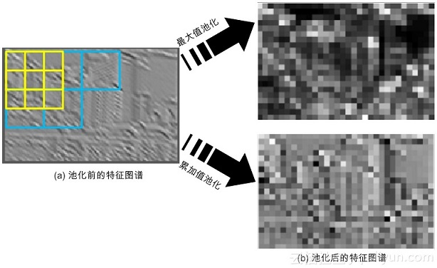

上图给出了池化之后的“马赛克”类的图片，很显然，人类是不喜欢这样模糊图片的。但请注意，计算机的“视界”和人类完全不同，池化后的图片，丝毫不会影响它们对图片的特征提取。

这么说是有理论支撑的。这个理论就是**局部线性变换的不变性**（invariant）。它说的是，如果输入数据的局部进行了线性变换操作（如平移或旋转等），那么经过池化操作后，输出的结果并不会发生变化。局部平移“不变性”特别有用，尤其是我们关心某个特征是否出现，而不关心它出现的位置时。例如，在模式识别场景中，当我们检测人脸时，我们只关心图像中是否具备人脸的特征，而并不关心人脸是在图像的左上角和右下角。

因为池化综合了（过滤核范围内的）全部邻居的反馈，即通过*k*个像素的统计特性而不是单个像素来提取特征，自然这种方法能够大大提高神经网络的性能。

注意：**引入下采样层会导致信息丢失**，就看丢失的信息是否重要，所以现在很多最新的网络基本减少使用pooling，使用其他降维技术处理。pooling肯定会导致网络获取信息的不足。在应用pooling的时候会减小图像的信息，所以是否使用pooling往往取决于你的目的。如果是希望进行图像分割，图像分类等等不需要关注图像细节的任务时，使用pooling往往可以加速训练或者获取更deep的feature，例如unet在downsamling的应用。但是如果你希望最终产生图像的细节，比如生成图像，补全信息等等任务，一定一定不要使用pooling，那样会导致最终结果变糊，因为经过了pooling之后要补全缺失的信息需要convolution kernel去拟合，也就是猜的过程，那样一定是不准确的。

附：对池化这个名字的理解：

在卷积神经网络中，采样是针对若干个相邻的神经元而言的，因此也称为“下采样（Subsampling）”。可能是“下采样”这个词的逼格不够高吧，于是研究者们又给它取了个更难懂的词：“池化（Pooling）”。“池化”其实仅仅是个字面的翻译，远没达不到“信达雅”的要求，如果非要向“采样”的含义靠拢，中国那句古话，“弱水三千只取一瓢”，似乎更有韵味。南京大学周志华老师就将其的意译为“汇合”，这样的翻译似乎更加传神。但拗不过太多人都把“Pooling”翻译成“池化”，那我们也就“池化”叫下去吧

# 对CNN各流派的重新审视

现代CNN相比于之前的远古CNN发生了很大变化，虽然这里的远古CNN大约在2014年论文中出现，距今也只有不到4年时间。这里也可以看出深度学习的发展日新月异，一日千里的可怕速度。

理解了本身CNN的基础含义，再来看看这些先进的CNN，是很有必要的，不要指望只靠卷积层池化层就可以得到好的效果，后来加入CNN的trick不计其数，而且也都是里程碑式的成果。下面主要以图像分类的CNN来阐述。

* **暴力加深流派**：以**AlexNet**和**VGGNet**为首的模型，这一派观点很直接，就是不断交替使用卷积层池化层，暴力增加网络层数，最后接一下全连接层分类。这类模型在CNN早期是主流，特点是参数量大，尤其是后面的全连接层，几乎占了一般参数量。而且相比于后续的模型，效果也较差。因此这类模型后续慢慢销声匿迹了。
* **Inception流派**：**谷歌**流派，这一派最早起源于NIN，称之为网络中的网络，后被谷歌发展成Inception模型（这个单词真的不好翻译。。。）。这个模型的特点是增加模型的宽度，使得模型不仅仅越长越高，还越长越胖。也就是说每一层不再用单一的卷积核卷积，而是用多个尺度的卷积核试试。显然，如果你熟悉CNN，就不难发现，这样做会使每一层的feature map数量猛增，因为一种尺寸的卷积核就能卷出一系列的feature map，何况多个！这里google使用了1*1的卷积核专门用来降channel。谷歌的特点是一个模型不玩到烂绝不算完，所以又发展出了Inception v2、Inception v3、Inception v4等等。
* **残差流派**：2015年**ResNet**横空出世，开创了残差网络。使用残差直连边跨层连接，居然得到了意想不到的好效果。最重要的是，这一改进几乎**彻底突破了层数的瓶颈**，1000层的resnet不是梦！之后，最新的**DenseNet**丧心病狂地在各个层中间都引入了残差连接。目前大部分模型都在尝试引入残差连接。

注意，到此为止，大部分模型已经丢弃了全连接层，改为全局平均池化。大大降低了参数量。

* **混合流派**：这一派不说了，就是看到哪几类模型效果好，就把这类技术混杂起来。典型的就是Xception和ResIception，将Inception和残差网络结合起来了。

# 全连接层

前面我们讲解了卷积层、激活层（在前面的“人工神经网络”中讲到）和池化层。但别忘了，在卷积神经网络的最后，还有一个至关重要的“全连接层（Fully Connected Layer，简称FC）”。“全连接”意味着，前层网络中的所有神经元都与下一层的所有神经元连接。全连接层设计目的在于，它将前面各个层学习到的“分布式特征表示”，映射到样本标记空间，然后利用损失函数来调控学习过程，最后给出对象的分类预测。

实际上，全连接层是就是传统的**多层感知器**。不同于BP全连接网络的是，卷积神经网络在输出层使用的激活函数不同，比如说它可能会使用**Softmax**函数。

这里，我们简单介绍一下这个Softmax函数。在数学上，Softmax函数又称归一化指数函数，它是逻辑函数的一种多分类形式，其公式如下所示：
$$
\sigma(z)_j=\frac{e^{z_j}}{\sum_{k=1}^Ke^{z_k}}\quad \text{for }j=1,...,k
$$
我们常用SVM（支持向量机）来做分类器，SVM在分类的最后，会给一系列的标签如“猫”“狗”“船”等打一个具体分值，如[4, 1, -2]，而Softmax函数有所不同，它把这些分值实施规则化（regularization），也就是说，将这些实分值转换为一系列的概率值（信任度），如[0.95, 0.04, 0.0]，如下图所示。由此可见，其实SVM和Softmax是高度相互兼容的，不过是表现形式不同而已。

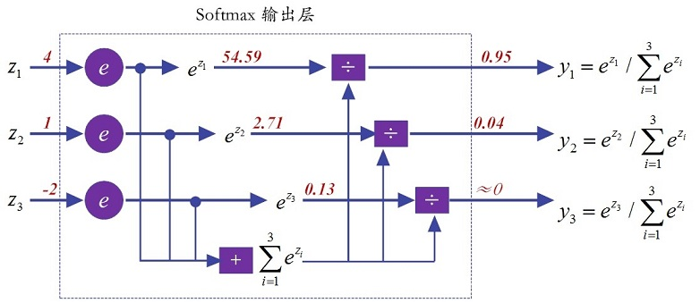

虽然全连接层处于卷积神经网络最末的位置，看起来**貌不惊人**似的，但由于全连接层的**参数冗余**，导致**该层的参数个数占据整个网络参数的绝大部分**。这样一来，稍有不慎，全连接层就容易陷入**过拟合**的窘境，导致网络的泛化能力难尽人意。

由于全连接层因为参数个数太多，容易出现过拟合的现象，Hinton教授的团队采取Dropout措施来弱化过拟合。

全连接层的性能不甚如人意，很多研究人员做了改进。比如，现任360公司首席科学家颜水成博士团队曾发表了论文“网中网（Network In Network，NIN）”。文中提出了用全局均值池化策略（Global Average Pooling，GAP），取代全连接层。

# 损失函数

## 从方差损失函数说起

代价函数经常用方差代价函数（即采用均方误差MSE），比如对于一个神经元（单输入单输出，sigmoid函数）,定义其代价函数为：
$$
C=\frac{(y-a)^2}{2}
$$
其中，

y是我们期望的输出，a为神经元的实际输出：
$$
a=\frac{1}{1+\text{exp}(-z)},\quad \text{where}\ \ z=wx+b
$$
在训练神经网络过程中，我们通过梯度下降算法来更新w和b，因此需要计算代价函数对w和b的导数：
$$
\begin{aligned}
&\frac{\partial C}{\partial w}=(a-y)\sigma'(z)x\\
&\frac{\partial C}{\partial b}=(a-y)\sigma'(z)
\end{aligned}
$$
然后更新w、b：
$$
\begin{aligned}
&w\leftarrow w-\eta \frac{\partial C}{\partial w}=w-\eta (a-y)\sigma'(z)x\\
&b\leftarrow b-\eta \frac{\partial C}{\partial b}=b-\eta (a-y)\sigma'(z)\\
\end{aligned}
$$
因为sigmoid函数的性质，导致σ′(z)在z取大部分值时会很小（如下图标出来的两端，几近于平坦），这样会使得w和b更新非常慢（因为η \* a \* σ′(z)这一项接近于0）。

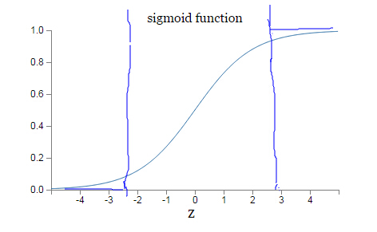

## 交叉熵损失函数

为了克服这个缺点，引入了交叉熵代价函数（下面的公式对应一个神经元，多输入单输出）：
$$
C=-\frac{1}{n}\sum_x\left[ y\ \text{ln}a + (1-y)\ \text{ln}(1-a) \right]
$$
其中，

$y$是期望的输出，$a$为神经元实际输出：
$$
a=\frac{1}{1+\text{exp}(-z)},\quad \text{where}\ \ z=wx+b
$$
与方差代价函数一样，交叉熵代价函数同样有两个性质：

- 非负性。（所以我们的目标就是最小化代价函数）

- 当真实输出$a$与期望输出$y$接近的时候，代价函数接近于0。（比如$y=0，a～0$；$y=1，a~1$时，代价函数都接近0）。

- 另外，它可以克服方差代价函数更新权重过慢的问题。我们同样看看它的导数：
  $
  \begin{aligned}
  &\frac{\partial C}{\partial w_j}=\frac{1}{n}\sum_xx_j(\sigma(z)-y)\\
  &\frac{\partial C}{\partial b}=\frac{1}{n}\sum_x(\sigma(z)-y)
  \end{aligned}
  $
  可以看到，导数中没有$\sigma^{′}(z)$这一项，权重的更新是受$\sigma(z)−y$这一项影响，即**受误差的影响**。所以**当误差大的时候，权重更新就快，当误差小的时候，权重的更新就慢**。这是一个**很好的性质**。

## 损失函数总结

- 当我们用sigmoid函数作为神经元的激活函数时，**最好使用交叉熵损失函数**来替代方差损失函数，以**避免训练过程太慢**。
- 不过，你也许会问，为什么是交叉熵函数？导数中不带$\sigma^{′}(z)$项的函数有无数种，怎么就想到用交叉熵函数？这自然是有来头的，更深入的讨论就不写了，少年请自行了解。
- 另外，交叉熵函数的形式是$−[ylna+(1−y)ln(1−a)]$而不是$−[alny+(1−a)ln(1−y)]$，为什么？因为当期望输出的$y=0$时，$lny$没有意义；当期望$y=1$时，$ln(1-y)$没有意义。而因为$a$是sigmoid函数的实际输出，永远不会等于0或1，只会无限接近于0或者1，因此不存在这个问题。
- 交叉熵损失函数（cross entropy loss），其本质就是最大似然估计MLE，而正则化等价于MLE加上**先验分布**。所以，从贝叶斯角度来看，损失函数＋正则化就是贝叶斯最大后验估计MAP。

# CNN训练原理

《[Notes on Convolutional Neural Networks](http://web.mit.edu/jvb/www/papers/cnn_tutorial.pdf)》，这是Jake Bouvrie在2006年写的关于CNN的训练原理，虽然文献老了点，不过对理解经典CNN的训练过程还是很有帮助的。该作者是剑桥的研究认知科学的。本文参照了这篇翻译《[Notes on Convolutional Neural Networks翻译](https://blog.csdn.net/zouxy09/article/details/9993371)》，并在此基础上增加了我自己的修改和理解。

这篇文章主要讲了CNN的Feedforward Pass和Backpropagation Pass，关键是卷积层和polling层的BP推导讲解。

## CNN训练原理引言

这个文档是为了讨论CNN的推导和执行步骤的，并加上一些简单的扩展。因为CNN包含着比权重还多的连接，所以结构本身就相当于实现了一种形式的正则化了。另外CNN本身因为结构的关系，也具有某种程度上的平移不变性。这种特别的NN可以被认为是以数据驱动的形式在输入中可以自动学习过滤器来自动的提取特征。我们这里提出的推导是具体指2D数据和卷积的，但是也可以无障碍扩展到任意维度上。

我们首先以在全连接网络上说明经典的Bp是如何工作的，然后介绍了在2DCNN中BP是如何在过滤器和子采样层上进行权值更新的。通过这些论述，我们强调了模型实际执行的高效的重要性，并给出一小段MATLAB代码来辅助说明这些式子。当然在CNN上也不能过度的夸大高效代码的重要性（毕竟结构放在那里了，就是很慢的）。接下来就是讨论关于如何将前层学到的特征图自动组合的主题，并具体的考虑学习特征图的稀疏组合问题。

免责声明：这个粗糙的笔记可能包含错误，各位看官且看且谨慎。（论文作者本人的免责声明，并非译者）。

## 用BP训练全连接网络

在许多文献中，可以发现经典的CNN是由卷积和子采样操作互相交替组成的，然后在最后加上一个普通的多层网络的结构：最后几层（最靠经输出层的部分）是全连接1D层。当准备好将最后的2D特征图作为输入馈送到这个全连接1D网络的时候，也能很方便的将所有的输出图中表现的特征连接到一个长输入向量中，并往回使用BP进行训练。这个标准的BP算法将会在具体介绍CNN的情况之前介绍（【1】中有更详细的介绍）。

### 全连接网络前向传播

在推导过程中，我们的损失函数采用的是误差平方和损失函数。对于一个有着c个类别和N个训练样本的多类问题，这个损失函数形式如下：

$$
E^N=\frac{1}{2}\sum_{n=1}^N\sum_{k=1}^c(t_k^n-y_k^n)^2\quad\quad\quad\quad\quad(1)
$$
这里$t_k^n$是第n个样本相对应的目标（标签）的第$k$维，$y_k^n$是由模型的第n个样本预测得到的目标（标签）的第$k$维。对于多分类问题，这个目标通常是以“one-of-c”编码的形式存在的，当$x^n$是属于第$k$类的，那么$t^n$的第$k$个元素就是正的，其他的元素就是0或者是负的（这取决于激活函数的选择）。

 因为在整个训练集上的误差只是简单的将每个样本产生的误差进行相加得到的，所以这里先在单个样本（第$n$个）上用BP来做讲解：

$$
E^n=\frac{1}{2}\sum_{k=1}^c(t_k^n-y_k^n)^2=\frac{1}{2}\left \| t^n-y^n \right \|_2^2\quad\quad\quad\quad\quad(2)
$$
在普通的全连接网络上，我们能够用下面的BP规则的形式来对E求关于权重的偏导。 这里$l$指示当前的第几层，输出层为第$L$层，而输入层（原始数据层）为第1层。这里第$l$层（当前层）的输出是：

$$
x^l=f(u^l),\quad \text{with } u^l=W^lx^{l-1}+b^l\quad\quad\quad\quad\quad(3)
$$
这里，当前层的$W$是指当前层输入一侧的权值，而不是当前层输出一侧的权值（那是下一层的$W$了）。这里输出的激活函数$ f(\cdot)$通常选择逻辑（sigmoid）函数
$$
f(x)=\frac{1}{1+e^{-\beta x}}
$$
或者双曲线tangent函数$f(x)=a\cdot tanh(b\cdot x)$。这个逻辑函数可以将$[-\infin, +\infin]$的数映射到$[0,1]$，而这个双曲线tangent函数可以将$[-\infin, +\infin]$的数映射到$[-a, +a]$。因此双曲线tangent函数的输出通常是靠近0 ，而sigmoid函数的输出通常是非0的。然而对训练数据进行归一化到0均值和单位方差（方差为1）可以在梯度下降上改善收敛。在基于一个归一化的数据集上，通常更喜欢选择双曲线tangent函数。LeCun建议$a=1.7159$；$b=2/3$。这样非线性最大化的点会出现在f(±1)=±1，因此当期望的训练目标以值±1进行归一化的时候，就可以可以避免在训练的时候饱和的问题（估计就是防止训练目标分布的太集中在0周围了，这样可以使它们更加合理的分布）。

### 全连接网络反向传播

网络中我们需要后向传播的“ 误差”可以被认为是关于有偏置项扰动的每个单元的 “灵敏度”（这个解释来自于Sebastian Seung）。也就是说：

$$
\frac{\partial E}{\partial b}=\frac{\partial E}{\partial u}\frac{\partial u}{\partial b}=\delta\quad\quad\quad\quad\quad(4)
$$
这里，$u$是当前层的输入，具体如公式3所示。

$$
x^l=f(u^l),\quad \text{with } u^l=W^lx^{l-1}+b^l\quad\quad\quad\quad\quad(3)
$$
因为
$$
\frac{\partial u}{\partial b}=1
$$
，所以偏置的灵敏度其实等于一个单元的所有输入产生的误差偏导。下面的就是从高层到低层的BP：

$$
\delta^l=\left[\left(W^{l+1}\right)^T\delta_{l+1}\right]\ \text{o}\ f'(u^l)\quad\quad\quad\quad\quad(5)
$$
这里的“o” 表示是逐元素相乘的，相当于matlab中的矩阵按各元素位置的点乘：$C=A\cdot *B$。

上式怎么理解呢？上式的左边是当前层$l$的输入$u$对误差的偏导，这是BP算法的难点，但是这个如果对BP算法有所了解的话应该很好理解。我们对照着下图来理解公式(5)

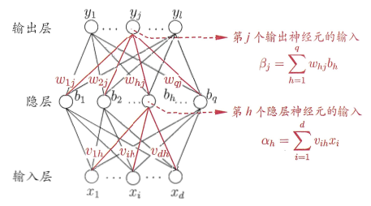

假设$l+1$层有m个神经元，$l$层有n个神经元，我们先对第$l$层的第$h$个神经元的输入求导，这个只要搞懂了，然后就很容易扩展为对第$l$层整个$n$个神经元求导了。

先对第$l$层的第$h$个神经元的输入求导：
$$
\begin{aligned}
\delta_h^l=\frac{\partial E}{\partial u_h^l}&=\frac{\partial E}{\partial x_h^l}\cdot \frac{\partial x_h^l}{\partial u_h^l}\\
&=\left[\sum_{j=1}^m\left(\frac{\partial E}{\partial u_j^{l+1}}\cdot \frac{\partial u_j^{l+1}}{\partial x_h^l}\right)\right]f'(u^l_h)\\
&=\left[\sum_{j=1}^m\left(\delta_j^{l+1}\cdot W_{hj}^{l+1}\right)\right]f'(u^l_h)\\
&=
\begin{bmatrix}
W_{h1}^{l+1} & W_{h2}^{l+1}  & ... & W_{hj}^{l+1}  & ... & W_{hm}^{l+1}
\end{bmatrix}\begin{bmatrix}
\delta_1^{l+1}\\
\delta_2^{l+1}\\
...\\
\delta_j^{l+1}\\
...\\
\delta_m^{l+1}\\
\end{bmatrix}
f'(u^l_h)
\end{aligned}
$$
然后容易扩展为对第$l$层整个$n$个神经元求导：
$$
\begin{aligned}
\delta^l=\frac{\partial E}{\partial u^l}
&=
\begin{bmatrix}
\delta_1^l\\ \delta_2^l\\ ... \\ \delta_h^l\\ ...\\ \delta_n^l
\end{bmatrix}\\
&=
\begin{bmatrix}
W_{11}^{l+1} & W_{12}^{l+1}  & ... & W_{1j}^{l+1}  & ... & W_{1m}^{l+1}\\
W_{21}^{l+1} & W_{22}^{l+1}  & ... & W_{2j}^{l+1}  & ... & W_{2m}^{l+1}\\
...& ...& ...& ...& ...& ...\\ 
W_{h1}^{l+1} & W_{h2}^{l+1}  & ... & W_{hj}^{l+1}  & ... & W_{hm}^{l+1}\\
...& ...& ...& ...& ...& ...\\ 
W_{n1}^{l+1} & W_{n2}^{l+1}  & ... & W_{nj}^{l+1}  & ... & W_{nm}^{l+1}\\
\end{bmatrix}\begin{bmatrix}
\delta_1^{l+1}\\
\delta_2^{l+1}\\
...\\
\delta_j^{l+1}\\
...\\
\delta_m^{l+1}\\
\end{bmatrix}
\text{o}
\begin{bmatrix}
f'(u^l_1)\\ 
f'(u^l_2)\\ 
...\\
f'(u^l_h)\\
...\\
f'(u^l_n)
\end{bmatrix}\\
&=\left(W^{l+1}\right)^T\delta^{l+1}\ \text{o}\ f'(u^l)
\end{aligned}
$$

其中，
$$
\begin{aligned}
& l\text{层有}n\text{个神经元,}l+1\text{层有}m\text{个神经元}\\
&W^{l+1}\text{为}[m\times n]\text{维向量,}\text{是}l+1\text{层神经元的输入权重,}m\text{是}l+1\text{层神经元的个数,}n\text{是}l\text{层神经元的个数;}\\
&\delta^{l+1}\text{为}[m\times 1]\text{维向量,}m\text{是}l+1\text{层神经元的个数;}\\
&f'(u^l)\text{是}[n\times 1]\text{维向量了}\\
\end{aligned}
$$

$$
E^n=\frac{1}{2}\sum_{k=1}^c(t_k^n-y_k^n)^2=\frac{1}{2}\left \| t^n-y^n \right \|_2^2\quad\quad\quad\quad\quad(2)
$$

对于公式(2)中的误差函数，输出层神经元的灵敏度如下：
$$
\delta^L=f'(u^L)\ \text{o}\ (y^n-t^n)\quad\quad\quad\quad\quad(6)
$$
最后，关于一个指定的神经元的权重的更新的求导规则仅仅就是该神经元的输入乘上该神经元的$\delta$进行缩放罢了（其实就是如下面公式7的两个相乘而已）。在向量的形式中，这相当于输入向量（前层的输出）和灵敏度向量的外积：

因为如公式(3)所示：
$$
u^l=W^lx^{l-1}+b^l\quad\quad\quad\quad\quad(3)
$$
所以有：

$$
\begin{aligned}
\frac{\partial E}{\partial W^l}&=\frac{\partial E}{\partial u^l}\frac{\partial u^l}{\partial x^{l-1}}=x^{l-1}(\delta^l)^T\\
&=\begin{bmatrix}
x_1^{l-1} \\ x_2^{l-1} \\ ... \\ x_h^{l-1} \\ ... \\ x_n^{l-1}
\end{bmatrix}\begin{bmatrix}
\delta_1^l & \delta_2^l & ... & \delta_j^l & ... & \delta_m^l
\end{bmatrix}\\
&=\begin{bmatrix}
x_{1}^{l-1}\delta_1^l & x_{1}^{l-1}\delta_2^l  & ... & x_{1}^{l-1}\delta_j^l  & ... & x_{1}^{l-1}\delta_m^l\\
x_{2}^{l-1}\delta_1^l & x_{2}^{l-1}\delta_2^l & ... & x_{2}^{l-1}\delta_j^l  & ... & x_{2}^{l-1}\delta_m^l\\
...& ...& ...& ...& ...& ...\\ 
x_{h}^{l-1}\delta_1^l & x_{h}^{l-1}\delta_2^l  & ... & x_{h}^{l-1}\delta_j^l  & ... & x_{h}^{l-1}\delta_m^l\\
...& ...& ...& ...& ...& ...\\ 
x_{n}^{l-1}\delta_1^l & x_{n}^{l-1}\delta_2^l  & ... & x_{n}^{l-1}\delta_j^l  & ... & x_{n}^{l-1}\delta_m^l\\
\end{bmatrix}
\end{aligned}\quad\quad\quad\quad\quad(7)
$$

$$
\Delta W^l=-\eta\frac{\partial E}{\partial W^l}\quad\quad\quad\quad\quad(8)
$$

和公式(4)的偏置更新的表现形式相类似。在实际操作中这里的学习率一般是每个权重都有不同的学习率$η_{ij}$。

## 卷积层前后向传播

通常卷积层都是有子采样层的附加以此来减少计算时间并且逐步的建立更深远的空间和构型的不变性。在照顾特异性的同时也需要一个小的子采样因子，当然这个不是新方法，但是这个概念却简单而又有效。哺乳动物的视觉皮层和在【12 8 7】中的模型着重的介绍了这些方面，在过去的10年中听觉神经科学的发展让我们知道在不同动物的皮层上primary和belt听觉领域中有相同的设计模型【6 11 9】。层级分析和学习结构也许就是听觉领域获得成功的关键。

### 卷积层前向传播

这里接着谈论网络中关于卷积层的BP更新。在一个卷积层中，先用可学习的卷积核对前层的特征图进行**卷积**，加上**偏置**，然后再通过**激活函数**来得到输出特征图。每个输出图可能是由多个输入图的卷积组合而成的。一般有：

$$
X_j^l=f\left(\sum_{i\in M_j}x_i^{l-1}*k_{ij}^l+b_j^l\right)\quad\quad\quad\quad\quad(9)
$$
这里$M_j$表示所选的输入图的集合，在MATLAB中这里的卷积是“valid”边缘处理的。那么到底选择哪些输入图呢？通常对输入图的选择包括选择“所有两个的组合”或者是“所有三个的组合”（比如LeNet5的第2个卷积层选择前一个池化层那样），但是下面会讨论如何去自动选择需要组合的特征图。每个输出图都有个额外的偏置$b$，然而对于一个特定的输出图来说，卷积每个输入图的卷积核是不一样的。也就是说如果输出图$j$和$k$都是在输入图$i$上相加得到的，输出图$j$应用在图$i$上的卷积核是和输出图$k$应用在图$i$上的卷积核是不同的。

### 下层为卷积层的反向传播

这里求的是，当下一层为卷积层时，当前层（**降采样层**，输入层不计算）的灵敏度。

你可能会问，输入层为啥不计算灵敏度嘞？你想啊，本层的灵敏度，都是给其权值和其上一层用的，输入层哪里还有权值和前一层啊。。输入层就是最开始的那一层了好不。。

**降采样层**的灵敏度（当前层输入对误差的偏导）为：
$$
\delta_j^l=f'(u_j^l)\text{ o }\text{conv2}\left(\delta_j^{l+1},\text{rot180}(k_j^{l+1}),\text{'full'}\right)
$$
先别急，你现在肯定无法理解上式，但是，只要你认真看完下面的推导，你就彻底明白了

这个推导我认为是CNN卷积神经网络里最难的一部分，但是，它的绝对难度并不大。

首先我们要明白，降采样层的反向传播的思想，依然和全连接的反向传播的思想完全一样。只不过由于卷积的存在，具体形式有一些变化而已。

我们来先看全连接的反向传播的思想：
$$
\delta^l=\left[\left(W^{l+1}\right)^T\delta^{l+1}\right]\ \text{o}\ f'(u^l)
$$
即第l层的误差敏感值等于第$l+1$层的误差敏感值乘以两者之间的权值。对吧，很简单。

只不过这里由于是用了卷积，且是有重叠的，$l$层中某个点会对$l+1$层中的多个点有影响。比如，$x^l$最中间的$e$，就会由于卷积，而对下一层的输入$u^{l+1}$（2x2矩阵）的四个位置都有影响，那么反向传播的时候，$x^l$中的中间位置$e$，对$\delta^{l+1}$的四个位置都能求偏导。

好了，话不多说，我们来实际算下：
$$
\begin{aligned}
\delta^l_i&=\left[\left(W^{l+1}\right)^T\delta^{l+1}\right]\ \text{o}\ f'(u^l)\\
&=\sum_{j=0}^J\left( \delta^{l+1}_j\ \text{o}\ \frac{\partial u^{l+1}_j}{\partial x^l_i} \right)\\
\end{aligned}
$$
给出下图作为参考：

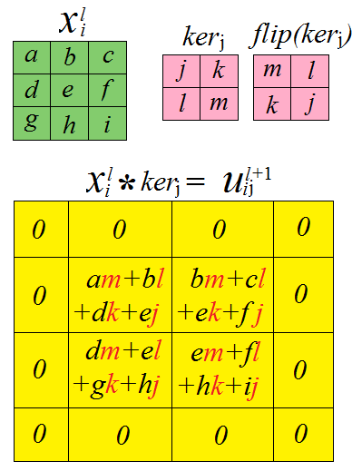

先来算算最典型的$x^l$中间的$e$的偏导数，由上图易知
$$
\begin{aligned}
&\frac{\partial u^{l+1}_j}{\partial x^l_{i,(1,1)}}\\
=&\begin{bmatrix}
\frac{\partial u^{l+1}_{ij,(0,0)}}{\partial x^l_{i,(1,1)}} &  \frac{\partial u^{l+1}_{ij,(0,1)}}{\partial x^l_{i,(1,1)}}\\ 
\frac{\partial u^{l+1}_{ij,(1,0)}}{\partial x^l_{i,(1,1)}} &  \frac{\partial u^{l+1}_{ij,(1,1)}}{\partial x^l_{i,(1,1)}}\\
\end{bmatrix}\\
=&\begin{bmatrix}
j &  k\\ 
l &  m\\
\end{bmatrix}
=\begin{bmatrix}
0 &  0 & 0 & 0\\
0 & j &  k & 0\\ 
0 & l &  m & 0\\
0 &  0 & 0 & 0\\
\end{bmatrix}\\
\end{aligned}
$$
再根据下图算算$x^l$中间上部位置的$b$的偏导数，由上图易知
$$
\begin{aligned}
&\frac{\partial u^{l+1}_j}{\partial x^l_{i,(0,1)}}\\
=&\begin{bmatrix}
0 &  l & m & 0\\
0 & 0 &  0 & 0\\ 
0 & 0 &  0 & 0\\
0 &  0 & 0 & 0\\
\end{bmatrix}\\
\end{aligned}
$$
再根据下图算算$x^l$左上位置的$a$的偏导数，由上图易知
$$
\begin{aligned}
&\frac{\partial u^{l+1}_j}{\partial x^l_{i,(0,0)}}\\
=&\begin{bmatrix}
0 &  0 & 0 & 0\\
0 & m &  0 & 0\\ 
0 & 0 &  0 & 0\\
0 &  0 & 0 & 0\\
\end{bmatrix}\\
\end{aligned}
$$
这时，你肯定有疑惑了，为什么要把2 x 2的矩阵补零成4 x 4的矩阵？

好的，现在就来解释：现在我们已经可以算下式
$$
\begin{aligned}
\delta^l_i&=\left[\left(W^{l+1}\right)^T\delta^{l+1}\right]\ \text{o}\ f'(u^l)\\
&=\sum_{j=0}^J\left( \delta^{l+1}_j\ \text{o}\ \frac{\partial u^{l+1}_j}{\partial x^l_i} \right)\\
\end{aligned}
$$
中的
$$
\delta^{l+1}_j\ \text{o}\ \frac{\partial u^{l+1}_j}{\partial x^l_i}
$$
了，仔细看看下图，我们会发现，原来上式其实就相当于一次卷积。。。同时，你也清楚了为什么要对$\delta^{l+1}$进行补零，因为是卷积的需要呀。

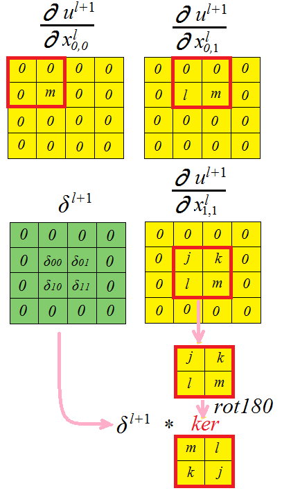

所以，就有了计算降采样层的灵敏度的公式（降采样层并没有激活函数，因为它不是神经元）：
$$
\delta_i^l=\sum_{j=0}^J\text{conv2}\left(\delta_j^{l+1},\text{rot180}(k_{ij}^{l+1}),\text{'full'}\right)
$$
其中，'full'代表对卷积对象$\delta$边缘补零，使卷积结果的维度大小与$\delta$相同。

### 卷积层梯度计算

我们用图形化来理解，会更直观更容易：

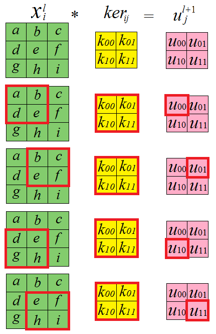

由上图可知，卷积核的每一个元素在$l+1$层（卷积层）的输入$u^{l+1}$上都有贡献，则有
$$
\begin{aligned}
\frac{\partial u}{\partial k_{00}}=
\begin{bmatrix}
\partial u_{00}/\partial k_{00} & \partial u_{01}/\partial k_{00} \\ 
\partial u_{10}/\partial k_{00} & \partial u_{11}/\partial k_{00}
\end{bmatrix}
=\begin{bmatrix}
e & f \\ 
h & i
\end{bmatrix}\\

\frac{\partial u}{\partial k_{01}}=
\begin{bmatrix}
\partial u_{00}/\partial k_{01} & \partial u_{01}/\partial k_{01} \\ 
\partial u_{10}/\partial k_{01} & \partial u_{11}/\partial k_{01}
\end{bmatrix}
=\begin{bmatrix}
d & e \\ 
g & h
\end{bmatrix}\\

\frac{\partial u}{\partial k_{10}}=
\begin{bmatrix}
\partial u_{00}/\partial k_{10} & \partial u_{01}/\partial k_{10} \\ 
\partial u_{10}/\partial k_{10} & \partial u_{11}/\partial k_{10}
\end{bmatrix}
=\begin{bmatrix}
b & c \\ 
e & f
\end{bmatrix}\\

\frac{\partial u}{\partial k_{11}}=
\begin{bmatrix}
\partial u_{00}/\partial k_{11} & \partial u_{01}/\partial k_{11} \\ 
\partial u_{10}/\partial k_{11} & \partial u_{11}/\partial k_{11}
\end{bmatrix}
=\begin{bmatrix}
a & b \\ 
d & e
\end{bmatrix}\\
\end{aligned}
$$
将上式用图像表示出来，如下图所示：

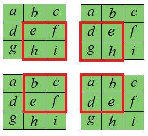

由上图可以看出，卷积核的偏导数
$$
\begin{aligned}
&\frac{\partial E}{\partial k_{ij}^l}\\
=&\text{conv2}\left( \text{rot180}(x_i^{l}),\ \delta_j^{l+1}, \ '\text{valid}' \right)\\
=&\text{rot180}\left( \text{conv2}\left( x_i^l,\ \text{rot180}(\delta_j^{l+1}), \ '\text{valid}' \right) \right)
\end{aligned}
$$
如果你对上式一时半会不能理解的话，建议你还是好好看看上图，想一想，因为这个只可意会不可言传，我已经尽力了，尽管其实很简单。

bias的梯度则非常简单，将层l中的灵敏度图$j$中的所有节点相加即可，因为只有一个加性因子$b$，它作用于每一个$u^{l+1}$：
$$
\frac{\partial E}{\partial b_j}=\sum_{u,v}\left(\delta_j^l\right)_{uv}
$$

## 降采样层前后向传播

### 降采样层前向传播

一个降采样层对输入层的图进行降采样。如果有N个输入图，那么一定会有N个输出图，但输出图的尺寸都会变小。更正式的描述为：
$$
x_j^l=\beta_j^l\ \text{down}(x_j^{l-1})+b_j^l
$$
其中，down( )代表一个降采样函数。典型的操作是，该函数会对输入图像中的各自区分的$n\times n$大小的像素块进行求和，这样的话，输出图就会在两个维度上都缩小了$n$倍。每一个输出图都有其各自的**乘性偏置$\beta$**和一个**加性偏置$b$**。

注意，降采样层没有激活函数，因为它并不是神经元。

### 下层为降采样层的反向传播

这里求的是，当下一层为全连接层时，当前层（一般就是卷积层）的灵敏度。

**卷积层**的灵敏度（当前层输入对误差的偏导）为：
$$
\delta^l=\left[\frac{1}{\text{SampleRate}^2}\text{UpSample}\left(\delta^{l+1} \text{o}\ \beta^{l+1} \right)\right]\ \text{o}\ f'(u^l)
$$
其中，SampleRate是下一层（降采样层）的采样率的平方（或者是采样区域的长乘以宽）；并且，上式其实是针对均匀采样的，其他采样见下面的分析。

怎么理解上式呢？

其中的函数UpSample()为上采样过程，其具体的操作得看是采用的什么pooling方法了。但UpSample的大概思想为：pooling层的每个节点是由卷积层中多个节点（一般为一个矩形区域）共同计算得到，所以pooling层每个节点的误差敏感值也是由卷积层中多个节点的误差敏感值共同产生的，只需满足两层间各自的误差敏感值相等，下面以mean-pooling和max-pooling为例来说明。

假设卷积层的矩形大小为4 × 4, pooling区域大小为2 × 2, 很容易知道pooling后得到的矩形大小也为2 × 2（本文默认pooling过程是没有重叠的，卷积过程是每次移动一个像素，即是有重叠的，后续不再声明），如果此时pooling后的矩形误差敏感值如下：

则按照mean-pooling，首先得到的卷积层应该是4×4大小（上采样），其值分布为(等值复制)：

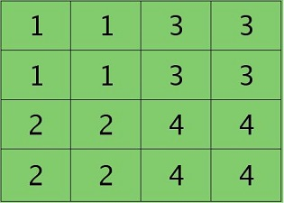

因为得满足反向传播时各层间误差敏感总和不变，所以卷积层对应每个值需要**平摊**（除以pooling区域大小即可，这里pooling层大小为2×2=4)），或者**理解为卷积层到池化层的权值为1/4**，最后的卷积层值分布为：

如果是max-pooling，则需要记录前向传播过程中pooling区域中最大值的位置，或者理解为，**卷积层到池化层的权值中，只有对应最大值的位置的权值为1，其余权值为0**，这里假设pooling层值1,3,2,4对应的pooling区域位置分别为右下、右上、左上、左下。则此时对应卷积层误差敏感值分布为：

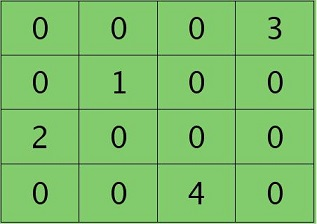

当然了，上面2种结果还需要点乘卷积层激活函数对应位置的导数值了，这里省略掉。

另外，我们注意到，在上采样时，下一层（池化层）的灵敏度还要再乘以该池化层的乘性系数β，这是因为下一层（池化层）的灵敏度计算并不包含该乘性系数β，所以，在这里必须要乘上该乘性系数β。

### 降采样层梯度计算

假设我们已经得到降采样层的灵敏度图，剩下的唯一需要更新的可学习的参数就是乘性偏置β和加性偏置b了。

到这里，我们就可以对加性偏置b和乘性偏置β计算梯度了。加性偏置b依然仅仅是灵敏度图中所有元素的加和：
$$
\frac{\partial E}{\partial b_j}=\mathop{\sum}_{u,v}\left(\delta_j^l\right)_{uv}
$$
乘性偏置β必然会涉及到前向传播时在当前层计算的初始降采样图。处于这个原因，在前向计算保存这些图是有利的，这样我们就不必在反向传播时重复计算了。

我们定义：
$$
d_j^l=\text{down}\left(x_j^{l-1}\right)
$$
然后乘性偏置β的梯度为：
$$
\frac{\partial E}{\partial \beta_j}=\sum_{u,v}\left(\delta_j^l\text{ o }d_j^l\right)_{uv}
$$
注：为什么计算乘性偏置和加性偏置时，要全部求和呢？因为这两个参数只有一个，影响了全部的元素，当然要相加了。

## 全连接层前后向传播

### 全连接层前向传播

全连接层的前向传播在前面已经讲了，就是加权，偏置，激活函数，即如下所示：
$$
X^l=f(W^l\times X^{l-1}+B^l)
$$
上式相信大家已经非常熟悉了，但是注意，对于**前层为非全连接层**（卷积层、**池化层**、输入层）时，即前层输出并非一维向量，而是矩阵时，需要把前层的输出**转化为一维向量**没具体怎么做呢？

假设上一层有两个输出，即
$$
\begin{aligned}
X^{l-1,1}=\begin{bmatrix}
1 & 3\\
2 & 4
\end{bmatrix}
,X^{l-1,2}=\begin{bmatrix}
5 & 7\\
6 & 8
\end{bmatrix}
\end{aligned}
$$
将其转化为一维向量：
$$
\begin{aligned}
X^{l-1}=\begin{bmatrix}
1\\
2\\
3\\
4\\
5\\
6\\
7\\
8
\end{bmatrix}
\end{aligned}
$$
然后再进行加权、偏置、激活操作。

### 下层为全连接层的反向传播

这里求的是，当下一层为全连接层时，当前层的灵敏度。

**（1）当前层为全连接层时**

全连接层的灵敏度（当前层输入对误差的偏导）为：
$$
\delta^l=\left[\left(W^{l+1}\right)^T\delta^{l+1}\right]\ \text{o}\ f'(u^l)
$$
这个前面已经说过了，相信大家已经很熟悉了。

**（2）当前层为下采样层时**

下采样层的**矢量**（列向量）灵敏度（当前层输入对误差的偏导）为：
$$
\delta^l=\left(W^{l+1}\right)^T\delta^{l+1}
$$
上式不包含激活函数的导数，因为下采样层并没有激活函数。**这里特别注意**，灵敏度$\delta^l$为紧接着进激活函数的那个输入（即加了乘性和加性偏置后的输入）对误差的偏导。所以这里的$\delta^l$不应当乘以下采样层的乘性偏置。但是，当 **当前层的下一层计算其灵敏度时，会用到当前层的$\delta^l$，就应该乘上当前层的乘性偏置$\beta$**。

下一步，将本层的矢量灵敏度， 每一列为一个样本，reshape成通道表示（矢量化全连接->通道化全连接），即如下所示：

将当前层的矢量灵敏度
$$
\begin{aligned}
\delta^l=\begin{bmatrix}
1\\
2\\
3\\
4\\
5\\
6\\
7\\
8
\end{bmatrix}
\end{aligned}
$$
转为当前层的每个通道的灵敏度图：
$$
\begin{aligned}
\delta^{l-1,1}=\begin{bmatrix}
1 & 3\\
2 & 4
\end{bmatrix}
,\delta^{l-1,2}=\begin{bmatrix}
5 & 7\\
6 & 8
\end{bmatrix}
\end{aligned}
$$
**（3）当前层为卷积层时**

卷积层的**矢量**（列向量）灵敏度（当前层输入对误差的偏导）为：
$$
\delta^l=\left[\left(W^{l+1}\right)^T\delta^{l+1}\right]\ \text{o}\ f'(u^l)
$$
这一步和当前层为全连接层时求灵敏度是一致的，只是还需要将矢量灵敏度变为每个通道的对应的灵敏度图。

下一步，将本层的矢量灵敏度， 每一列为一个样本，reshape成通道表示（矢量化全连接->通道化全连接），即如下所示：

将当前层的矢量灵敏度
$$
\begin{aligned}
\delta^l=\begin{bmatrix}
1\\
2\\
3\\
4\\
5\\
6\\
7\\
8
\end{bmatrix}
\end{aligned}
$$
转为当前层的每个通道的灵敏度图：
$$
\begin{aligned}
\delta^{l-1,1}=\begin{bmatrix}
1 & 3\\
2 & 4
\end{bmatrix}
,\delta^{l-1,2}=\begin{bmatrix}
5 & 7\\
6 & 8
\end{bmatrix}
\end{aligned}
$$

### 全连接层梯度计算

全连接层的参数有权重系数W和加性偏置B，其梯度为
$$
\begin{aligned}
&\frac{\partial E}{\partial W}=\delta_lX_{l-1}^T\\
&\frac{\partial B}{\partial W}=\delta_l
\end{aligned}
$$

## 学习特征图的组合

很多时候，通过卷积多个输入图，然后再对这些卷积值求和得到一个输出图，这样的效果往往是比较好的。在一些文献中，一般是人工选择哪些输入图去组合得到一个输出图。但我们这里尝试去让CNN在训练的过程中学习这些组合，也就是让网络自己学习挑选哪些输入图来计算得到输出图才是最好的。我们用$\alpha_{ij}$表示在得到第$j$个输出图的其中第$i$个输入图的权值或者贡献。这样，第$j$个输出图可以表示为：
$$
x_j^l=f\left(\sum_{i=1}^{N_{in}}\alpha_{ij}(x_i^{l-1}*k_i^l)+b_j^l\right)
$$
需要满足约束
$$
\sum_i\alpha_{ij}=1,\quad\text{and}\quad 0\leqslant\alpha_{ij}\leqslant 1
$$
这些受限条件可以通过设置$\alpha_{ij}$变量等于基于一组无约束，潜在权重$c_{ij}$的softmax来实现：
$$
\alpha_{ij}=\frac{\text{exp}(c_{ij})}{\sum_k\text{exp}(c_{kj})}
$$
因为对于一个固定的j来说，每组权值$c_{ij}$都与除第j组以外的其他组的权值是各自独立的，所以为了方面描述，我们把下标j去掉，只考虑一个输出图的更新，其他输出图的更新是一样的过程，只是图的索引j不同而已。

softmax函数的导数为：
$$
\frac{\partial \alpha_k}{\partial c_i}=\delta_{ki}\alpha_i-\alpha_i\alpha_k\quad\quad\quad\quad\quad(15)
$$
这里，δ被作为δ的克罗内克积使用（这里的解释详见[《Softmax函数及其导数》](https://www.itency.com/topic/show.do?id=516703)）。而在等式1中关于层l上的αi变量的偏导是：
$$
\frac{\partial E}{\partial \alpha_i}=\frac{\partial E}{\partial u^l}\frac{\partial u^l}{\partial \alpha_i}=\sum_{u,v}\left(\delta^l\text{ o }(x_i^{l-1}*k_i^l)\right)_{uv}
$$
这里δ^l是敏感性图，就相当于输出图的输入u 。再一次，这里的卷积是“valid”的，这样这个结果才能匹配敏感性图的尺寸。现在我们能使用这个链式法则去计算损失函数（1）关于潜在权重ci的梯度了：

$$
\begin{aligned}
\frac{\partial E}{\partial c_i}&=\sum_k\frac{\partial E}{\partial \alpha_k}\frac{\partial \alpha_k}{\partial c_i}\quad\quad\quad\quad\quad(16)\\
&=\alpha_i\left(\frac{\partial E}{\partial \alpha_i}-\sum_k\frac{\partial E}{\partial \alpha_k}\alpha_k\right)\quad\quad\quad\quad\quad(17)\\
\end{aligned}
$$

## 加强稀疏组合

为了限制权重αi是稀疏分布的，也就是限制一个输出map只与某些而不是全部的输入maps相连。我们在最终的代价函数里增加正则项罚函数Ω(α)。这样做的时候，我们将鼓励某些权值为零。这样就只有某一些输入图（而不是所有输入图）会贡献到一个给定的输出图中。

对于单个样本，重写代价函数为：
$$
\tilde{E}^n=E^n+\lambda\sum_{i,j}|(\alpha)_{i,j}|\quad\quad\quad\quad\quad(18)
$$
然后，找到该正则化项对权值ci梯度的贡献。用户自定义的超参数λ控制着网络对训练数据的拟合误差最小和正则项中的权值根据L1正则化结果最小之间的权衡。

我们再次只考虑用于给定输出图的权值αi并去掉下标j。首先，我们需要正则化项Ω(α)对αi求导（除了不可导的原点处）
$$
\frac{\partial \Omega}{\partial \alpha_i}=\lambda\text{sign}(\alpha_i)\quad\quad\quad\quad\quad(19)
$$
将上市和式（15）结合，可得正则项Ω(α)对ci的链式求导（即ci对正则项的贡献）
$$
\begin{aligned}
\frac{\partial \Omega}{\partial c_i}&=\sum_k\frac{\partial \Omega}{\partial \alpha_k}\frac{\partial \alpha_k}{\partial c_i}\quad\quad\quad\quad\quad(20)\\
&=\lambda\left( |\alpha_i|-\alpha_i\sum_k|\alpha_k| \right)\quad\quad\quad\quad\quad(21)\\
\end{aligned}
$$
当使用罚函数项（18）时，权值ci最终的梯度通过式（13）和式（9）来计算：
$$
\frac{\partial \tilde{E}^n}{\partial c_i}=\frac{\partial E^n}{\partial c_i}+\frac{\partial \Omega}{\partial c_i}
$$

## 在Matlab中的加速

在带有降采样和卷积层的网络中，主要的计算瓶颈是

1. 在前向传播中：对卷积层的输出图进行降采样
2. 在反向传播中：对上一层的降采样层的敏感度图δ进行上采样，以匹配下一层的卷积层输出图的尺寸大小
3. sigmoid的应用及其求导

当然在前馈和BP阶段中卷积的计算也是瓶颈，但是假设这个2D卷积程序是高效执行的，那么这部分也就没什么可以优化的了。

然而，人们可能会试图使用MATLAB的内置图像处理程序来处理上采样和下采样操作。对于上采样，imresize函数可以做这个工作，但是会有明显的开销。一个更快的可选方法是使用克罗内克积（Kronecker product ）函数kron，通过一个全一矩阵ones来和我们需要上采样的矩阵进行Kronecker乘积，就可以实现上采样的效果。这可以快一个数量级。对于前向传播过程中的下采样，imresize并没有提供在缩小图像的过程中还计算nxn块内像素的和的功能，所以没法用。“ 最近邻”方法仅仅用图块中的一个原始像素来替换整块像素。一个可选方法是用blkproc在每个不同的图块上进行操作，或者将im2col和colfilt组合起来。这些操作都只是计算需要的部分而没有其他的开销，而重复的调用用户自定义的图块处理函数会带来过大的开销。一个更快速的可用方法是用一个全一的矩阵（ones( )）来对图像进行卷积，然后简单的通过标准的索引方法来采样最后卷积结果。例如，如果下采样的域是2x2的，那么我们可以用2x2的元素全是1的卷积核来卷积图像。然后再卷积后的图像中，我们每个2个点采集一次数据，y=x(1:2:end,1:2:end)，这样就可以得到了两倍下采样，同时执行求和的效果。虽然在这种情况下卷积实际上计算的输出数量是我们真正需要的输出的四倍（假设2倍下采样），但这种方法仍然（经验上）比前面提到的方法快一个数量级或更快。

大多数作者执行sigmiod激活函数和他的偏导的时候都是使用inline函数定义的。但是在MATLAB中“inline”的定义和C中的宏定义完全不同，而且还需要大量的时间去评估，因此通常来说是用实际的代码进行替换的。这也是对于代码优化和可读性之间的权衡问题。

## 实际训练问题

### 批量更新VS在线更新

随机梯度下降vs批量学习

### 学习率

LeCun的随机在线方法（diagonal approx to hessian），这值得吗？Viren的观点是：至少对于每层来说有不同的学习率，因为更低层的梯度更小而且更不可靠。LeCun在参考文献【5】中也说了类似的话。

### 损失函数的选择

误差平方（MLE）VS交叉熵 （cross-entropy）。后者在某些分类任务上比前者好。

### 检查求导是否正确

当需要验证你的BP实现（或求导）的代码是否正确时，有限差分是不可缺少的工具（就是UFLDL中每个任务都需要进行cost函数验证的部分）。BP()或者求导写的代码不但容易犯错而且仍然是个需要学习某些东西的网络（这句可忽略）。通过将你写的代码所计算的梯度和有限差分所估计的梯度进行对比，可以验证你是否写错了：

对于单个输入样本，使用二阶有限差分来估计梯度：
$$
\frac{\partial E}{\partial w_i}\approx\frac{E(w_i+\epsilon)-E(w_i-\epsilon)}{2\epsilon}
$$
然后，和你写的BP代码的梯度返回值进行对比。Epsilon应该尽可能的小，但是不要太小而引起数值精度问题。例如ε=10e-8就还不错。应当注意，使用有限差分来训练网络的效率非常低（即对于网络中W权重的时间复杂度为O(W^2））；但是BP反向传播的时间复杂度只有O(W)，所以，虽然BP比较麻烦，但是相比其O(W)的速度优势，使用BP还是值得的。

# 梯度下降法的改进—动量法

## 梯度下降法存在的问题

考虑一个二维输入[x1, x2]，输出的损失函数L，下面是这个函数的等高线

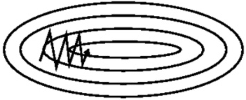

可以想象成一个很扁的漏斗，这样在竖直方向上，梯度就非常大，在水平方向上，梯度就相对较小，所以我耵在设置学习率的时候就不设置太大，为了防止竖直方向上参数更新太过了，这样一个较小的学习率又导致了水平方向上参数在更新的时候太过于缓慢，所以就导致最终收敛起来非常慢。

## 动量法

动量法的提出就是为了应对这个问题，我们对梯度下降法做一个修改如下
$$
\begin{aligned}
v_i&=\gamma v_{i-1}+\eta\triangledown L(\theta)\\
\theta_i&=\theta_{i-1}-v_i
\end{aligned}
$$
其中vi是当前速度，γ是动量参数，是一个小于1的正数（大于等于1不收敛）。η是学习率。

动量法相当于每次在进行参数更新的时候，都会将之前的速度考虑进来，每个参数在各方向上的移动幅度不仅取决于当前的梯度，还取决于过去各个梯度在各个方向上是否一致：

* 如果一个梯度一直沿着当前方向进行更新，那么每次更斩的幅度就越来越大
* 如果一个梯度在一个方向上不断变化，那么其更新幅度就会被衰减

这样我们就可以使用一个较大的学习率，使得收敛更快，同时梯度比较大的方向就会因为动量的关系每次更新的幅度减少，如下图

比如我扪的梯度每次都等于g，而旦方向都相同，那么动量法在该方向上使参数加速移动，有下面的公式：
$$
\begin{aligned}
&v_0=0\\
&v1=\gamma v_0+\eta g=\eta g\\
&v2=\gamma v_1+\eta g=(1+\gamma)\eta g\\
&v3=\gamma v_2+\eta g=(1+\gamma + \gamma^2)\eta g\\
&\quad\quad ...\\
&v_{+\infty}=(1+\gamma + \gamma^2 + \gamma^3+...)\eta g=\frac{1}{1-\gamma}\eta g\\
\end{aligned}
$$
如果我们把γ定为0.9,那么更新幅度的峰值就是原本梯度乘学习率的10倍。

本质上说，动量法就仿佛我们从高坡上推一个球，小球在向下滚动的过程中积累了动量，在途中也会变得越来越快，最后会达到一个峰值，对应于我们的算法中就是，动量项会沿着与负梯度指向方向相同的方向不断增大，对于梯度方向改变的方向逐渐减小，得到了更快的收敛速度以及更小的震荡。

该方法源于了物理学上动量的概念，试想一下小球从山上滚下来，那么小球每次前进不仅和当前时刻外力对它做的功所决定（当前时刻参数的更新，即当前计算出来的梯度∇L(θi)）而且还受到惯性的作用（以往的参数更新）。因此该方法引入参数v用于表示动量，v^(t−1)表示此前的更新结果，而v^t则表示当前的参数。

下图为动量法的直观图示：

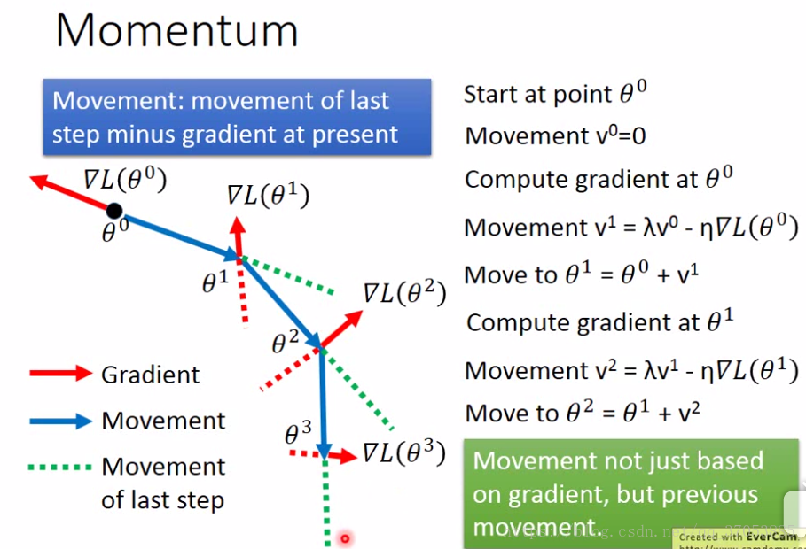
$$
\begin{aligned}
&v_1=\lambda v^0-\eta\bigtriangledown L(\theta^0)\\
&v_2=\lambda v^1-\eta\bigtriangledown L(\theta^1)\\
&\quad\quad ...\\
&v_t=\lambda v^{t-1}-\eta\bigtriangledown L(\theta^{t-1})\\
\end{aligned}
$$
其中，

θ为待更新的参数；v代表过往的参数更新结果（可以看做是之前更新数据积累下来的惯性）。θ^0为还未更新的参数；v0=0。

# 项目实践

## LeNet5手写数字识别的C++实现

这是我写的基于OpenCV和C++的LeNet5的手写数字识别项目。

在所有CNN卷积神经网络中，LeCun的LeNet5手写数字识别是最简单的了，但是麻雀虽小，五脏俱全，卷积层，池化层（下采样层），全连接层，前向传播，反向传播（基于残差计算梯度），基于梯度下降法的改进：动量法，池化层和卷积层的反响传播的链式法则，等都一应俱全，是学习卷积神经网络的最好方式。

项目我上传到了GitHub，

GitHub地址：https://github.com/luweikxy/CNN_LeNet

# 参考资料

* [行家 | 如何跨领域成为一位人工智能工程师？](https://blog.csdn.net/u4110122855/article/details/78043171)

"卷积神经网络的发展历程"一节参考了该文。

* [能否对卷积神经网络工作原理做一个直观的解释？](https://www.zhihu.com/question/39022858/answer/224446917)
* [当我们在谈论 Deep Learning：CNN 其常见架构（上）](https://zhuanlan.zhihu.com/p/27023778)

“什么是卷积运算”一节参考了该文。

* [能否对卷积神经网络工作原理做一个直观的解释？](https://www.zhihu.com/question/39022858/answer/120211609)

“对卷积的理解”和“对CNN各流派的重新审视”参考了该文。

* [斯坦福大学深度学习课程-池化](http://deeplearning.stanford.edu/wiki/index.php/池化)
* [CNN 中池化是否会丢失有价值特征信息？](https://www.zhihu.com/question/284156420/answer/505056420)
* [【深度学习之美】激活引入非线性，池化预防过拟合（入门系列之十二）](https://yq.aliyun.com/articles/167391?utm_content=m_28153)

“池化层”一节参考了上述文章。

* [交叉熵-有道云笔记](https://note.youdao.com/share/?id=4af91f7add3ab9b092e6855844c875c0&type=note#/)

“损失函数”一节参考了上述文章。

* [Notes on Convolutional Neural Networks](https://www.cnblogs.com/shouhuxianjian/p/4529202.html)
* [Deep Learning论文笔记之（四）CNN卷积神经网络推导和实现](https://blog.csdn.net/zouxy09/article/details/9993371)
* [卷积神经网络算法的实现](https://blog.csdn.net/qq_31780525/article/details/71389982)
* [Deep learning：五十一(CNN的反向求导及练习)](http://www.cnblogs.com/tornadomeet/p/3468450.html)

"CNN训练原理"参考了上述博客。

* [深度学习参数更新--自适应的学习率（Adative Learning Rate）](https://blog.csdn.net/qq_37053885/article/details/81605365)

“梯度下降法的改进—动量法”参考了上述博客。

---

资料收集：

[CNN卷积神经网络分析](https://zhuanlan.zhihu.com/p/36915223)

[深度卷积神经网络演化历史及结构改进脉络-40页长文全面解读](https://mp.weixin.qq.com/s?__biz=MzU4MjQ3MDkwNA==&mid=2247484037&idx=1&sn=13ad0d521b6a3578ff031e14950b41f4&chksm=fdb69f12cac11604a42ccb37913c56001a11c65a8d1125c4a9aeba1aed570a751cb400d276b6&scene=0#rd)

[入门 | 一文看懂卷积神经网络](https://mp.weixin.qq.com/s?__biz=MzA5ODUxOTA5Mg==&mid=2652557859&idx=1&sn=ad930ee2f1225b68750f6ba85d6c54ee&chksm=8b7e2378bc09aa6ebb8fc34fe51c9ffd7d644d98ead2c8de585d1394ff7e86dfc1ad1f4445ad&scene=0#rd)

[卷积网络背后的直觉](https://zhuanlan.zhihu.com/p/37657943)

[能否对卷积神经网络工作原理做一个直观的解释？](https://www.zhihu.com/question/39022858)

[机器视角：长文揭秘图像处理和卷积神经网络架构](https://mp.weixin.qq.com/s?__biz=MzA3MzI4MjgzMw==&mid=2650728746&idx=1&sn=61e9cb824501ec7c505eb464e8317915&scene=0#wechat_redirect)

[An Intuitive Explanation of Convolutional](https://ujjwalkarn.me/2016/08/11/intuitive-explanation-convnets/)

[[CV] 通俗理解『卷积』——从傅里叶变换到滤波器](https://zhuanlan.zhihu.com/p/28478034)

