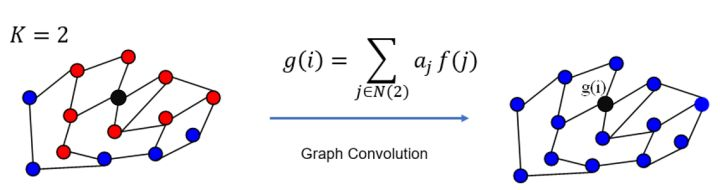
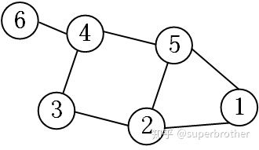
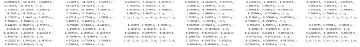
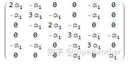
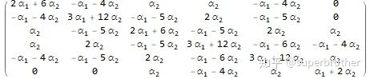

# GCN图卷积网络全面理解

* [返回上层目录](../graph-convolutional-networks.md)
* [前言](#前言)
* [离散卷积定义及其作用](#离散卷积定义及其作用)
* [GCN中的Graph指什么](#GCN中的Graph指什么)
* [提取拓扑图空间特征的两种方式](#提取拓扑图空间特征的两种方式)
  * [空间域Spatial-Domian](#空间域Spatial-Domian)
  * [频谱域Spectral-Domain](#频谱域Spectral-Domain)
* [拉普拉斯矩阵](#拉普拉斯矩阵)
  * [拉普拉斯矩阵定义](#拉普拉斯矩阵定义)
  * [无向图的拉普拉斯矩阵的性质](#无向图的拉普拉斯矩阵的性质)
  * [为什么GCN要用拉普拉斯矩阵](#为什么GCN要用拉普拉斯矩阵)
  * [拉普拉斯矩阵谱分解](#拉普拉斯矩阵谱分解)
* [图上的傅立叶变换](#图上的傅立叶变换)
  * [傅里叶正变换：从Spatial域到Spectral域](#傅里叶正变换：从Spatial域到Spectral域)
  * [傅里叶逆变换：从spectral域到spatial域](#傅里叶逆变换：从spectral域到spatial域)
* [图上的卷积](#图上的卷积)
* [GCN结构的演进](#GCN结构的演进)
  * [演进1原始方法](#演进1原始方法)
  * [演进2减少参数数量](#演进2减少参数数量)
  * [演进3降低计算复杂度](#演进3降低计算复杂度)
  * [演进4GCN](#演进4GCN)
* [在GCN中的Local-Connectivity和Parameter-Sharing](#在GCN中的Local-Connectivity和Parameter-Sharing)
  * [GCN中的Local-Connectivity](#GCN中的Local-Connectivity)
  * [GCN中的Parameter-Sharing](#GCN中的Parameter-Sharing)
* [关于有向图问题](#关于有向图问题)
* [结语](#结语)

# 前言

图神经网络的逐层更新公式简单优雅而高效，以GCN为例，节点Embedding是由自身和邻居节点Embedding的聚合之后再进行非线性变换而得到。如此简单优雅的更新规则是怎么推导出来的呢，背后有没有什么理论依据？在GCN的论文中，作者介绍了两种启发GCN逐层线性传播法则的方法，分别是从谱图卷积的角度和Weisfeiler-Lehman算法的角度。本篇博文将详细介绍如何从图拉普拉斯矩阵出发，通过定义图上的傅里叶变换和傅里叶逆变换而定义图上卷积公式，最后推导出优雅的GCN逐层更新公式。至于Weisfeiler-Lehman算法，因为涉及到图神经网络的表示能力的问题，后面我们会出一个专题详细的介绍它。

本篇博文的结构是这样的：(下面这段文字对快速理解这篇文章很重要，之后还会出现一次作为小结)

**图神经网络的核心工作是对空间域(Spatial Domain)中节点的Embedding进行卷积操作(即聚合邻居Embedding信息)，然而图数据和图像数据的差别在于节点邻居个数、次序都是不定的，因此传统用于图像上的CNN模型中的卷积操作(Convolution Operator)不能直接用在图上，因此需要从频谱域(Spectral Domain)上重新定义这样的卷积操作再通过卷积定理转换回空间域上。**

**为了在频谱域和空间域中转换，我们借助了傅里叶公式，并且定义了图上傅里叶变换(从空间域变换到频谱域)和图上傅里叶逆变换(从频谱域回到空间域)的变换公式。具体操作是我们将节点的Embedding f(i), i ∈ (1,⋯,N)通过傅里叶正变换从空间域变换到了频谱域$\hat{f}$，在频谱域上和卷积核h进行卷积操作，再将变换后的节点Embedding通过傅里叶逆变换回到空间域，参与后续的分类等任务。**

本篇博文是按照上面的思路组织的，下面首先我们来介绍一下什么是卷积。

# 离散卷积定义及其作用

了解GCN之前必须对离散卷积（或者说CNN中的卷积）有一个明确的认识：

[如何通俗易懂地解释卷积？](https://www.zhihu.com/question/22298352)这个链接的内容已经讲得很清楚了，**离散卷积本质就是一种滤波器，表象是加权求和。**即时域上的卷积就相当于频域上图像和卷积核的频率直接相乘，从而过滤掉图像上的卷积核中没有的频率。

如图1所示，CNN中的卷积本质上就是利用一个共享参数的过滤器（kernel），**通过计算中心像素点以及相邻像素点的加权和来构成feature map实现空间特征的提取**，当然加权系数就是卷积核的权重系数。

那么卷积核的系数如何确定的呢？是随机化初值，然后根据误差函数通过反向传播梯度下降进行迭代优化。这是一个关键点，**卷积核的参数通过优化求出才能实现特征提取的作用，GCN的理论很大一部分工作就是为了引入可以优化的卷积参数。**

*CNN中卷积提取feature map示意图*

**注：这里的卷积是指深度学习（CNN）中的卷积，与数学中定义的卷积运算严格意义上是有区别的。两者的区别与联系可以见我的另一个回答。**

哪位高手能解释一下卷积神经网络的卷积核？[哪位高手能解释一下卷积神经网络的卷积核？](https://www.zhihu.com/question/52237725/answer/545340892)

# GCN中的Graph指什么

CNN是Computer Vision里的大法宝，效果为什么好呢？原因在上面已经分析过了，可以很有效地提取空间特征。但是有一点需要注意：**CNN处理的图像或者视频数据中像素点（pixel）是排列成成很整齐的矩阵**（如下图所示，也就是很多论文中所提到的Euclidean Structure）。

*图像矩阵示意图（Euclidean Structure）*

与之相对应，科学研究中还有很多Non Euclidean Structure的数据，如下图所示。社交网络、信息网络中有很多类似的结构。

*社交网络拓扑示意（Non Euclidean Structure）*

实际上，这样的网络结构（Non Euclidean Structure）就是图论中抽象意义上的拓扑图。

所以，**Graph Convolutional Network中的Graph是指数学（图论）中的用顶点和边建立相应关系的拓扑图。**

那么为什么要研究GCN？原因有三：

**(1)**CNN无法处理Non Euclidean Structure的数据，学术上的表达是传统的离散卷积（如问题1中所述）**在Non Euclidean Structure的数据上无法保持平移不变性**。通俗理解就是在拓扑图中每个顶点的相邻顶点数目都可能不同，那么当然无法用一个同样尺寸的卷积核来进行卷积运算。

**(2)**由于CNN无法处理Non Euclidean Structure的数据，又**希望在这样的数据结构（拓扑图）上有效地提取空间特征来进行机器学习**，所以GCN成为了研究的重点。

**(3)**读到这里大家可能会想，自己的研究问题中没有拓扑结构的网络，那是不是根本就不会用到GCN呢？其实不然，**广义上来讲任何数据在赋范空间内都可以建立拓扑关联，谱聚类就是应用了这样的思想**（[谱聚类（spectral clustering）原理总结](https://www.cnblogs.com/pinard/p/6221564.html)）。**所以说拓扑连接是一种广义的数据结构，GCN有很大的应用空间。**

综上所述，GCN是要为除CV、NLP之外的任务提供一种处理、研究的模型。

# 提取拓扑图空间特征的两种方式

GCN的本质目的就是用来提取拓扑图的空间特征，那么实现这个目标只有graph convolution这一种途径吗？当然不是，在spatial domain(vertex domain)和spectral domain实现目标是两种最主流的方式。

##空间域Spatial-Domian

Spatial domain，翻译过来就是空间域，是最直观感受GCN逐层传播算法的域，即：节点v的Embedding是其所有邻居节点Embedding(包括自己的Embedding)的聚合结果。因此在一些文献上spatial domain又被称做”vertex domain”。

**spatial domain**(vertex domain)是非常直观的一种方式。顾名思义：提取拓扑图上的空间特征，那么就把每个顶点相邻的neighbors找出来。这里面蕴含的科学问题有二：

a.按照什么条件去找中心vertex的neighbors，也就是如何确定receptive field？

b.确定receptive field，按照什么方式处理包含不同数目neighbors的特征？

根据a,b两个问题设计算法，就可以实现目标了。推荐阅读这篇文章[*Learning Convolutional Neural Networks for Graphs*](http://proceedings.mlr.press/v48/niepert16.pdf)（下图是其中一张图片，可以看出大致的思路）。

*vertex domain提取空间特征示意*

这种方法主要的缺点如下：

c.每个顶点提取出来的neighbors不同，使得计算处理必须针对每个顶点

d.提取特征的效果可能没有卷积好

当然，对这个思路喜欢的读者可以继续搜索相关文献，学术的魅力在于百家争鸣嘛！

##频谱域Spectral-Domain

但是与CNN所应用的图像不同，空间域中图节点邻居的数目不是一定的，而且节点之间没有相对的次序性。**这就产生了一个问题，对于不同邻居个数的节点，卷积怎么定义呢？这就引出了spectral domain的概念**。spectral domain，即频谱域，借助卷积定理，我们可以通过定义频谱域上的卷积操作来得到空间域图上的卷积操作。

**spectral domain就是GCN的理论基础了**。这种思路就是希望借助图谱的理论来实现拓扑图上的卷积操作。从整个研究的时间进程来看：首先研究GSP（graph signal processing）的学者定义了graph上的Fourier Transformation，进而定义了graph上的convolution，最后与深度学习结合提出了Graph Convolutional Network。

那么图在频谱域上是如何表示的呢，这就引出了我们第二个概念：**谱图理论**，谱图理论主要研究的是图的拉普拉斯(Lapalacian)矩阵的特征值和所对应的特征向量对于图拓扑性质的影响，是对图空间拓扑的数学描述。下面一节我们就会介绍什么是拉普拉斯矩阵。

认真读到这里，脑海中应该会浮现出一系列问题：

* Q1 什么是Spectral graph theory？

[Spectral graph theory](https://en.wikipedia.org/wiki/Spectral_graph_theory)请参考这个，简单的概括就是**借助于图的拉普拉斯矩阵的特征值和特征向量来研究图的性质**

* Q2 GCN为什么要利用Spectral graph theory？

这应该是看论文过程中读不懂的核心问题了，要理解这个问题需要大量的数学定义及推导，没有一定的数学功底难以驾驭（我也才疏学浅，很难回答好这个问题）。（注：这里笔者认为，就是因为空间域的卷积很难在图上实现，所以自然就需要谱图理论了啊，为什么会原作者会说读不懂呢？）

所以，先绕过这个问题，来看Spectral graph实现了什么，再进行探究为什么。

# 拉普拉斯矩阵

Graph Fourier Transformation及Graph Convolution的定义都用到图的拉普拉斯矩阵，那么首先来介绍一下拉普拉斯矩阵。

## 拉普拉斯矩阵定义

对于**无向图** G=(V,E)，其Laplacian矩阵定义为L=D−A，其中D是节点的度矩阵(只在对角线上有元素)，A是图的邻接矩阵。

看下图的示例，就能很快知道Laplacian 矩阵的计算方法。

*Laplacian 矩阵的计算方法*

这里要说明的是：**常用的拉普拉斯矩阵实际有三种**：

拉普拉斯矩阵还有几种扩展定义：

(1)组合拉普拉斯矩阵(Combinatorial Laplacian)
$$
L=D-A
$$
(2)对称归一化拉普拉斯矩阵(Symmetric Normalized Laplacian)
$$
L^{sys}=D^{\text{—}\frac{1}{2}}LD^{\text{—}\frac{1}{2}}=I-D^{\text{—}\frac{1}{2}}AD^{\text{—}\frac{1}{2}}
$$
，很多GCN的论文中应用的是这种拉普拉斯矩阵。

(3)随机游走归一化拉普拉斯矩阵(Random Walk Normalized Laplacian)
$$
L^{rw}=D^{\text{—}1}L=I-D^{\text{—}1}A
$$
有读者的留言说看到了**Graph Convolution与Diffusion相似之处**，当然从Random walk normalized Laplacian就能看出了两者确有相似之处（**其实两者只差一个相似矩阵的变换**，可以参考[Diffusion-Convolutional Neural Networks](https://arxiv.org/pdf/1511.02136.pdf)，以及下图）

**不需要相关内容的读者可以略过此部分**

其实维基本科对[Laplacian matrix](https://en.wikipedia.org/wiki/Laplacian_matrix)的定义上写得很清楚，**国内的一些介绍中只有第一种定义**。这让我在最初看文献的过程中感到一些的困惑，特意写下来，帮助大家避免再遇到类似的问题。

## 无向图的拉普拉斯矩阵的性质

（1）拉普拉斯矩阵是半正定矩阵。（最小特征值大于等于0）
（2）特征值中0出现的次数就是图连通区域的个数
（3）最小特征值是0，因为拉普拉斯矩阵（普通形式：L=D−A）每一行的和均为0，并且最小特征值对应的特征向量是每个值全为1的向量
（4）最小非零特征值是图的代数连通度。
拉普拉斯矩阵的半正定性证明,如下：
要证明拉普拉斯矩阵是半正定的，只需要证明其二次型
$$
f^TLf\geqslant 0
$$
证明：
$$
\begin{aligned}
f^TLf&=f^T(D-A)f\\
&=f^TDf-f^TAf\\
&=f^T\ diag(d)\ f-f^TAf\\
&=\sum_{i=1}^md_if_i^2-\sum_{j=1}^m\left[\sum_{i=1}^mf_ia_{ij}\right]f_j\\
&=\sum_{i=1}^md_if_i^2-\sum_{i,j=1}^mf_if_ja_{ij}\\
&=\frac{1}{2}\left[\sum_{i=1}^md_if_i^2-2\sum_{i,j=1}^mf_if_ja_{ij}+\sum_{i=1}^md_if_i^2\right]\\
&=\frac{1}{2}\sum_{i,j=1}^ma_{ij}\left(f_i-f_j\right)^2\  \text{note:}\ d_i=\sum_{j=1}^ma_{ij}
\end{aligned}
$$

## 为什么GCN要用拉普拉斯矩阵

拉普拉斯矩阵矩阵有很多良好的性质，这里写三点我感触到的和GCN有关之处

**(1)拉普拉斯矩阵是对称矩阵，可以进行特征分解（谱分解），这就和GCN的spectral domain对应上了**

**(2)拉普拉斯矩阵只在中心顶点和一阶相连的顶点上（1-hop neighbor）有非0元素，其余之处均为0**

**(3)通过拉普拉斯算子与拉普拉斯矩阵进行类比**。由于卷积在傅里叶域的计算相对简单，为了在graph上做傅里叶变换，需要找到graph的连续的正交基对应于傅里叶变换的基，因此要使用拉普拉斯矩阵的特征向量。

以上三点是我的一些理解，当然严格意义上，拉普拉斯矩阵应用于GCN有严谨的数学推导与证明。

由于L=D−A，且无向图中A为对称矩阵，因此**拉普拉斯矩阵是对称矩阵，可以进行特征分解(谱分解)**，谱分解对于图从空间域到频谱域的变换至关重要，因为我们用来变换的工具傅里叶变换(Fourier Transform)需要利用Laplacian矩阵的特征值和特征向量，通过变换，从**拓扑结构的图**(spatial domain)到**拉普拉斯矩阵**再到**谱图**(spectral domain)这条链路就形成了。下面就先来介绍拉普拉斯矩阵的谱分解。

## 拉普拉斯矩阵谱分解

矩阵的**特征分解**，**对角化**，**谱分解**都是同一个概念，是指将矩阵分解为由其特征值和特征向量表示的矩阵乘积的方法。只有含有n个线性无关的特征向量的n维方阵才可以进行特征分解。

拉普拉斯矩阵是半正定矩阵，有如下三个性质：

1. 是实对称矩阵，有n个线性无关的特征向量（半正定矩阵本身就是对称矩阵，[半正定矩阵_百度百科](https://baike.baidu.com/item/%E5%8D%8A%E6%AD%A3%E5%AE%9A%E7%9F%A9%E9%98%B5/2152711?fr=aladdin)）
2. 对阵矩阵的特征向量相互正交，即所有特征向量构成的矩阵为正交矩阵
3. 半正定矩阵的所有的特征值非负

性质1告诉我们**拉普拉斯矩阵一定能进行特征分解(谱分解)**，且有如下形式：
$$
\begin{aligned}
L=U
\begin{bmatrix}
\lambda_1&&\\ 
&...&\\
&&\lambda_n
\end{bmatrix}
U^{-1}
\end{aligned}
$$
其中U=(u1,u2,…,un)为**列向量**ui组成的单位特征向量矩阵，
$$
\begin{aligned}
\begin{bmatrix}
\lambda_1&&\\ 
&...&\\
&&\lambda_n
\end{bmatrix}
\end{aligned}
$$
是n个特征值组成的对角阵。

由性质2可知，U是**正交矩阵**，即
$$
UU^T=I\ \rightarrow\ U^T=U^{-1}
$$
，所以特征分解又可以写成：
$$
\begin{aligned}
L=U
\begin{bmatrix}
\lambda_1&&\\ 
&...&\\
&&\lambda_n
\end{bmatrix}
U^{-1}
=U
\begin{bmatrix}
\lambda_1&&\\ 
&...&\\
&&\lambda_n
\end{bmatrix}
U^T
\end{aligned}
$$
这种写法是大部分文献中的写法。

# 图上的傅立叶变换

## 傅里叶正变换：从Spatial域到Spectral域

介绍了Laplacian矩阵，我们将图从Spatial domain变换到Spectral domain的准备工作就完成了。下面我们来介绍一下傅里叶变换。

连续域的傅里叶变换定义为：
$$
F(w)=\mathcal{F}[f(t)]=\int f(t)e^{-iwt}dt
$$
即信号f(t)与基函数$e^{−iωt}$的积分。

那我们该怎么把连续域的傅立叶变换推广到图上呢？最关键的是我们怎么找到图上的基函数呢？（连续域的基函数我们知道是$e^{−iωt}$）。

**把传统的傅里叶变换以及卷积迁移到Graph上来，核心工作其实就是把拉普拉斯算子的特征函数$e^{−iωt}$变为Graph对应的拉普拉斯矩阵的特征向量**。

傅立叶变换与拉普拉斯矩阵的关系：**传统傅立叶变换的基，就是拉普拉斯矩阵的一组特征向量。**

那我们就需要一种变换，在连续域其基函数是$e^{−iωt}$，这种变换放到图上，若其存在特征向量且相互正交，即其特征向量可作为基矢，从而作为图上离散傅立叶变换的基函数。

很巧，我们发现，拉普拉斯算子Δ无论在连续域还是图上的离散域，正好满足这一性质。首先在连续域上，
$$
\Delta e^{-iwt}=\frac{\partial ^2}{\partial t^2}e^{-iwt}=-w^2e^{-iwt}
$$
Δ 是拉普拉斯算子，即n维欧式空间中的一个二阶微分算子
$$
\Delta f=\bigtriangledown ^2f
$$
，拉普拉斯算子是对函数f的一种变换。

联想到广义特征值方程的定义：
$$
Au=\lambda u
$$
，其中A是矩阵(在线性代数上矩阵左乘表示对向量进行线性变换)，u是特征向量或者**特征函数(无穷维的向量)**，λ是u对应的特征值。由类比可知$e^{−iωt}$是Δ的特征函数，ω和对应的特征值密切相关。

因此，若要将傅里叶变换迁移到图上，我们有了拉普拉斯矩阵(拉普拉斯矩阵是离散的拉普拉斯算子)，下一步自然就是去找拉普拉斯矩阵的特征向量了(相当于我们有了Δ，下一步是要找Δ相应的$e^{−iωt}$)。

**小结一下：傅里叶变换迁移到图上核心的工作就是把拉普拉斯算子的特征函数$e^{−iωt}$对应到图拉普拉斯矩阵的特征向量上。因此求解图拉普拉斯矩阵的特征向量是至关重要的。而根据上文的介绍，图拉普拉斯矩阵是半正定矩阵，可以通过特征分解(谱分解)求得特征向量，即u1,⋯,un**。更加详细的内容可以参考 [*The Emerging Field of Signal Processing on Graphs: Extending High-Dimensional Data Analysis to Networks and Other Irregular Domains*](https://arxiv.org/abs/1211.0053) 。

前面讲到可以用一组正交函数cos和sin(或$e^{−iωt}$)表示任意函数，且傅里叶变换是连续形式的，在处理Graph时，用到的是傅里叶变换的离散形式。由于拉普拉斯矩阵进行谱分解以后，可以得到n个线性无关的特征向量，构成空间中的一组正交基，因此归一化拉普拉斯矩阵算子的特征向量构成了图傅里叶变换的基。图傅里叶变换将输入图的信号投影到了正交空间，相当于把图上定义的任意向量，表示成了拉普拉斯矩阵特征向量的线性组合。

有了特征向量u1,⋯,un之后，我们就可以定义图上的傅里叶变换了，将连续的傅里叶变换写成离散积分(求和)的形式，仿照连续域的傅立叶变换定义可得图上的傅里叶变换为：
$$
F(\lambda_l)=\hat{f}(\lambda_l)=\sum_{i=1}^Nf(i)u_l^{*}(i)
$$
其中f是对图上节点的变换，比如说返回节点Embedding，f(i)和图上的节点一一对应，u\_l(i)表示第l个特征向量的第i个分量。那么节点Embedding f(i)在特征值λ\_l下的图傅里叶变换就是与λ\_l对应的特征向量u\_l进行內积运算。

注：上述的内积运算是在复数空间中定义的，**所以采用了$u_l^*$，也就是特征向量$u_l$的共轭。**Inner product更多可以参考[Inner product space](https://en.wikipedia.org/wiki/Inner_product_space)。

利用矩阵乘法将图上的傅里叶变换推广到矩阵形式：
$$
\begin{aligned}
\begin{bmatrix}
\hat{f}(\lambda_1)\\
\hat{f}(\lambda_2)\\
\vdots\\
\hat{f}(\lambda_N)\\
\end{bmatrix}
=
\begin{bmatrix}
u_1(1)&u_1(2)&...&u_1(N)\\
u_2(1)&u_2(2)&...&u_2(N)\\
\vdots&\vdots&\ddots&\vdots\\
u_N(1)&u_N(2)&...&u_N(N)\\
\end{bmatrix}
\begin{bmatrix}
f(1)\\
f(2)\\
\vdots\\
f(N)
\end{bmatrix}
\end{aligned}
$$
即f在图上的傅里叶变换的矩阵形式为：
$$
\hat{f}=U^Tf
$$
简而言之，给定输入节点Embedding f, 左乘$U^T$，即可以得到f经图上傅里叶变换的输出Embedding $\hat{f}$。

## 傅里叶逆变换：从spectral域到spatial域

那么，我们将节点从空间域变换到频率域之后，怎么变换回空间域呢？传统的傅里叶逆变换是对频率ω积分：
$$
{\mathcal{F}}^{-1}[F(w)]=\frac{1}{2\pi}\int{\mathcal{F(w)}}e^{-iwt}dw
$$
类比到离散域(图上)则为对特征值λ_l求和：
$$
f(i)=\sum_{l=1}^N\hat{f}(\lambda_l)u_l(i)
$$
利用矩阵乘法将图上的傅里叶逆变换推广到矩阵形式：
$$
\begin{aligned}
\begin{bmatrix}
f(1)\\
f(2)\\
\vdots\\
f(N)\\
\end{bmatrix}
=
\begin{bmatrix}
u_1(1)&u_2(1)&...&u_N(1)\\
u_1(2)&u_2(2)&...&u_N(2)\\
\vdots&\vdots&\ddots&\vdots\\
u_1(N)&u_2(N)&...&u_N(N)\\
\end{bmatrix}
\begin{bmatrix}
\hat{f}(\lambda_1)\\
\hat{f}(\lambda_2)\\
\vdots\\
\hat{f}(\lambda_N)
\end{bmatrix}
\end{aligned}
$$
即f在图上的傅里叶逆变换的矩阵形式为：
$$
f=U\hat{f}
$$
简而言之，给定节点Embedding的在频率域上的表示$\hat{f}$，左乘U即可得到节点Embedding在空间域上的表示。

# 图上的卷积

上面我们介绍了作用于图上的傅里叶变换和傅里叶逆变换的定义，在上面的基础上，下面我们利用卷积定理推导图上进行卷积运算的形式：

>**卷积定理**：函数卷积的傅里叶变换是函数傅里叶变换的乘积，即对于函数f(t)与h(t)两者的卷积是其傅里叶变换乘积的逆变换：

$$
f(t)*h(t)={\mathcal{F}}^{-1}\left[\hat{f}(w)\hat{h}(w)\right]=\frac{1}{2\pi}\int\hat{f}(w)\hat{h}(w)e^{-iwt}dw
$$

其中*表示卷积运算，卷积核即是一个函数，在CNN上，卷积核通常是一个矩阵，表示对输入的线性变换。

因此f与卷积核h在图上的卷积操作可按照如下步骤求得：

1.计算f的傅里叶变换：
$$
\hat{f}=U^Tf
$$
2.卷积核h的在图上的傅里叶变换为：
$$
\hat{h}=U^Th
$$
，写成对角矩阵形式为：
$$
\begin{aligned}
\begin{bmatrix}
\hat{h}(\lambda_1)&&\\
&\ddots&\\
&&\hat{h}(\lambda_N)\\
\end{bmatrix}
\end{aligned}
$$
，其中
$$
\hat{h}(\lambda_l)=\sum_{i=1}^Nh(i)u_l^*(i)
$$
3.两者傅里叶变换的乘积为
$$
\begin{aligned}
\hat{h}\hat{f}
=U^Th\odot U^Tf=
\begin{bmatrix}
\hat{h}(\lambda_1)&&\\
&\ddots&\\
&&\hat{h}(\lambda_N)\\
\end{bmatrix}
U^Tf
\end{aligned}
$$
4.再乘以U求两者傅里叶变换乘积的逆变换，则求出卷积：
$$
\begin{aligned}
(f*h)_G=U
\begin{bmatrix}
\hat{h}(\lambda_1)&&\\
&\ddots&\\
&&\hat{h}(\lambda_N)\\
\end{bmatrix}
U^Tf
\end{aligned}
$$
**讲到这里，我从宏观的角度总结一下以上我们做了什么。下面这几段话对理解全文有很大帮助，不妨多读几遍领会全意。**

我们的**目的是对空间域中节点的Embedding进行卷积操作(即聚合邻居Embedding信息)**，然而图数据和图像数据的差别在于节点邻居个数、次序都是不定的，因此传统用于图像上的**CNN模型中的卷积操作(Convolution Operator)不能直接用在图上**，因此**需要从频谱域上重新定义这样的卷积操作**再转换回空间域上(通过卷积定理)。

为了在频谱域和空间域中转换，我们借助了傅里叶公式，并且定义了图上傅里叶变换(从空间域变换到频谱域)和图上傅里叶逆变换(从频谱域回到空间域)的变换公式。具体操作是我们将节点的Embedding f(i), i ∈ (1,⋯,N)通过傅里叶正变换从空间域变换到了频谱域$\hat{f}$，在频谱域上和卷积核h进行卷积操作，再将变换后的节点Embedding通过傅里叶逆变换回到空间域，参与后续的分类等任务。

**卷积核h通俗来讲可以看做为空间域上的一个矩阵**，在频谱域上和节点Embedding进行卷积之前，我们同样要通过傅里叶变换将h变换到频谱域$\hat{h}$，卷积核和节点Embedding在频谱域上的卷积定义为$\hat{h}\hat{f}$，最后在通过傅里叶逆变换将更新节点的Embedding变回空间域。

到这里为止，图上的卷积就介绍完了，下面我们看看各种图神经网络模型是怎么利用它的。

# GCN结构的演进

## 演进1原始方法

上文中定义的图卷积操作
$$
\begin{aligned}
(f*h)_G=U
\begin{bmatrix}
\hat{h}(\lambda_1)&&\\
&\ddots&\\
&&\hat{h}(\lambda_N)\\
\end{bmatrix}
U^Tf
\end{aligned}
$$
是对节点Embedding f在图中做的一次变换，其中图结构信息蕴含在了U中，那么对于图上的学习任务比如分类任务，我们需要找到一个合适的卷积核h，使得f经过卷积核h的卷积变换后能够降低分类任务定义的损失。因此图上的机器学习任务的核心就是找出可以降低损失(loss)的卷积核h，更直接得说，找到上式中适合的$\hat{h}(\lambda_1),...,\hat{h}(\lambda_n)$，它们是对角阵$diag(\hat{h}(λ_i))$中的自由参数。

将$\hat{h}(\lambda_1),...,\hat{h}(\lambda_n)$看做是模型的参数，我们可以利用梯度下降法使模型自动学习这些参数，即根据任务的loss，学习适合的卷积核。[Spectral Networks and Locally Connected Networks on Graphs](https://arxiv.org/abs/1312.6203) 用的就是这样的思路，它简单粗暴地将$diag(\hat{h}(λ_i))$当做是参数diag(θi)：
$$
\begin{aligned}
&y_{out}=\sigma(Ug_{\theta}(\Lambda)U^Tx)\\
&g_{\theta}(\Lambda)=
\begin{bmatrix}
\theta_1&&\\
&\ddots&\\
&&\theta_n\\
\end{bmatrix}
\end{aligned}
$$
这个式子可以看做是”第一代”的GCN中的一层(layer)，θi和神经网络中的weights一样是任意的参数，可以通过反向传播算法进行学习，x即f，对应于节点的Feature Embedding。

这种模型固然简单，但是存在着一些问题：

1. 每一次前向传播(每计算一次yout)，都要计算U， g_θ(Λ)和U^T三者的矩阵乘积，特别是对于大规模的graph，计算的代价较高，运算复杂度为O(n3)
2. 卷积核是由θ1, ⋯, θn这样n个参数构成的，其中n是图中的节点数，对于非常大的图，模型的自由度过高
3. 卷积核不具有spatial localization

## 演进2减少参数数量

上面提到卷积核由n个自由的参数构成，在一些情况下，我们不希望模型的参数过多，否则在数据量不够的情况下，模型可能陷入欠拟合的情况，因此在[*Convolutional Neural Networks on Graphs with Fast Localized Spectral Filtering*](http://arxiv.org/abs/1606.09375)中作者提出了一种多项式近似方法：
$$
\hat{h}(\lambda_i)=\sum_{j=0}^K\alpha_i\lambda_i^j
$$
其中$\lambda_i^j$表示$\lambda_j$的j次幂，即
$$
\begin{aligned}
&y_{out}=\sigma(Ug_{\theta}(\Lambda)U^Tx)\\
&g_{\theta}(\Lambda)=
\begin{bmatrix}
\sum_{j=0}^K\alpha_j\lambda_1^j&&\\
&\ddots&\\
&&\sum_{j=0}^K\alpha_j\lambda_n^j\\
\end{bmatrix}
\end{aligned}
$$
这样做带来了另一个优点，经过推导不难发现，我们可以进一步简化计算：
$$
\begin{aligned}
&g_{\theta}(\Lambda)=
\begin{bmatrix}
\sum_{j=0}^K\alpha_j\lambda_1^j&&\\
&\ddots&\\
&&\sum_{j=0}^K\alpha_j\lambda_n^j\\
\end{bmatrix}=\sum_{j=0}^K\alpha_j\Lambda^j\\
&y_{out}=\sigma(Ug_{\theta}(\Lambda)U^Tx)=\sigma\left(\sum_{j=0}^K\alpha_jU\Lambda^jU^T\right)=\sigma\left(\sum_{j=0}^K\alpha_jL^j\right)\\
\end{aligned}
$$
上式中省略了$L^j=U\Lambda^jU^T$的证明，举个例子：
$$
L^2=U\Lambda U^TU\Lambda U^T=U\Lambda^2U^T
$$
，因为$U^TU=I$，可以利用数学归纳法证明该式，在此不赘述。

因此，最终
$$
y_{out}=\sigma(Ug_{\theta}(\Lambda)U^Tx)=\sigma\left(\sum_{j=0}^K\alpha_jL^j\right)
$$
其中$\alpha_j,\ j \in (1,...,K)$是模型的参数，可以通过反向传播学习得到。

那么相比于演进1，演进2有几个明显的优点：

1. 模型参数由θi, i ∈ (1,⋯,n)变到了αj, j ∈ (1,⋯,K)，由于K≪n，模型的复杂度和自由度大大降低，减少了欠拟合的风险

2. 不再需要对拉普拉斯矩阵L进行特征分解了：
   $
   L=U\Lambda U^T
   $
   ，因为输出yout可以直接写成关于L^j的表达式，特征分解(其复杂度为O(n3))的时间节约了，但是然由于需要计算L^j，计算复杂度还是O(n3))

3. 通过对卷积核的多项式近似，我们引入了所谓的空间局部性(spatial localization)，**K被称为感知野**(receptive field)，表示对每个节点的Embedding更新只会涉及到它K-hop以内邻居Embedding的聚合，Hop k所有节点的加权聚合系数都为α_k。

   **更直观地看，** **K=1就是对每个顶点上一阶neighbor的feature进行加权求和，如下图所示：**

   

   同理，**K=2的情形如下图所示：**

   

   注：上图只是以一个顶点作为实例，GCN每一次卷积对所有的顶点都完成了图示的操作。

但是，这种方法仍然没有从根本上解决计算复杂度的问题，因为仍需要求解Lj，其复杂度为O(n3)。

## 演进3降低计算复杂度

演进2中使用多项式近似的方式避免对L进行谱分解，且降低了模型的自由度，但是并没有降低卷积计算的复杂度，论文[*Wavelets on graphs via spectral graph theory*](https://hal.inria.fr/inria-00541855)中提出了一种利用Chebyshev多项式拟合卷积核的方法，来降低计算复杂度。卷积核$g_θ(Λ)$可以利用截断（truncated）的shifted Chebyshev多项式来逼近，可以用来降低卷积运算的复杂度（这里本质上应该寻找Minimax Polynomial Approximation，但是作者说直接利用Chebyshev Polynomial的效果也很好）。定义为：
$$
g_{\theta}(\Lambda)\approx \sum_{k=0}^K\theta_kT_k(\tilde{\Lambda})
$$
其中θk是Chebyshev多项式的系数，$T_k(\tilde{\Lambda})$是取$\tilde{\Lambda}=\frac{2\Lambda}{\lambda_{max}}-I$的Chebyshev多项式，对Λ进行变换的原因是Chebyshev多项式的输入要求在[−1,1]之间。

Chebyshev多项式是由如下公式递归定义的：
$$
\begin{aligned}
&T_k(\tilde{\Lambda})x=2\tilde{\Lambda}T_{k-1}(\tilde{\Lambda})x-T_{k-2}(\tilde{\Lambda})x\\
&T_0(\tilde{\Lambda})=I,\ T_1(\tilde{\Lambda})=\tilde{\Lambda}
\end{aligned}
$$
其中，x是节点的embedding。

相比于演进2，我们可以看到，计算$g_θ(Λ)$不再需要矩阵相乘了，因为$T_k(\tilde{\Lambda})$的计算可以使用递推的方式实现，递推中的每一步都是线性复杂度的，计算$T_k(\tilde{\Lambda})$的复杂度为O(n^2)，因此计算$g_θ(Λ)$的复杂度为O(Kn^2)。

将Chebyshev近似带入到谱图卷积的公式里：
$$
y_{out}=\sigma(Ug_{\theta}(\Lambda)U^Tx)=\sigma\left(\sum_{j=0}^K\theta_kT_k(\tilde{L})x\right)
$$
其中，
$$
\begin{aligned}
Ug_{\theta}(\tilde{\Lambda})U^T&\approx U\left(\sum_{k=0}^K\theta_kT_K\left(\tilde{\Lambda}\right)\right)U^T\\
&=\sum_{k=0}^K\theta_kUT_k(\tilde{\Lambda})U^T\\
&=\sum_{k=0}^K\theta_kT_k\left(\tilde{L}\right)
\end{aligned}
$$
可由数学归纳法推导而来，即证明
$$
UT_k(\tilde{\Lambda})U^T=T_k\left(\tilde{L}\right),\ k\in (1,...,K)
$$
证明：

当k=0或k=1时，结论显然成立：
$$
\begin{aligned}
&U\ T_0(\tilde{\Lambda})\ U^T=U\ I\ U^T=I\\
&T_0(\tilde{L})=I\\
&U\ T_0(\tilde{\Lambda})\ U^T=T_0(\tilde{L})\\
\\
&U\ T_1(\tilde{\Lambda})\ U^T=U\ \tilde{\Lambda}\ U^T=U(\Lambda-I)U^T\\
&=U\Lambda U^T-UIU^T=L-I\\
&T_1(\tilde{L})=\tilde{L}=L-I\\
&U\ T_1(\tilde{\Lambda})\ U^T=T_1(\tilde{L})
\end{aligned}
$$
当k=n-1时，假设
$$
UT_{n-1}(\tilde{\Lambda})U^T=T_{n-1}(\tilde{L})
$$
成立，那么当K=n时，有
$$
\begin{aligned}
U\ T_n(\tilde{\Lambda})\ U^T&=U\left( 2\tilde{\Lambda}T_{n-1}(\tilde{\Lambda})-T_{n-2}(\tilde{\Lambda}) \right)U^T\\
&=2UT_{n-1}(\tilde{\Lambda})U^TU\tilde{\Lambda}U^T-UT_{n-2}(\tilde{\Lambda})U^T\\
&=2T_{n-1}(\tilde{L})\tilde{L}-T_{n-2}(\tilde{L})\\
&=T_n(\tilde{L})
\end{aligned}
$$
得证。同理，$T_k(\tilde{L})$也可以通过递推的方式计算，避免了与矩阵U和U^T的乘法运算，复杂度为O(Kn^2)。因此根据以上推导，使用Chebyshev近似降低了卷积核计算的复杂度。

**上面的讲述是GCN最基础的思路，很多论文中的GCN结构是在上述思路的基础上进行了一些简单数学变换。理解了上述内容，就可以做到“万变不离其宗”。**

## 演进4GCN

通过使用Chebyshev多项式近似，我们已经成功得降低了卷积核计算的复杂度。[*Semi-Supervised Classification with Graph Convolutional Networks*](https://arxiv.org/abs/1609.02907) 这篇文章中进一步对卷积核的计算做了近似，产生了我们所熟知的GCN逐层传播公式。

在GCN模型中，作者首先做了额外的两个假设：λmax≈2, K=1，这两个假设可以大大简化模型。而作者希望假设造成的误差可以通过神经网络参数训练过程来自动适应。在这两个假设的条件下：
$$
\begin{aligned}
y_{out}&=\sigma\left(Ug_{\theta}(\Lambda)U^Tx\right)\\
Ug_{\theta}(\Lambda)U^Tx&\approx \sum_{k=0}^1\theta_kT_k(\tilde{\Lambda})x\\
&=\theta_0T_0(\tilde{\Lambda})x+\theta_1T_1(\tilde{\Lambda})x\\
&=\theta_0Ix+\theta_1\tilde{\Lambda}x\\
&=\theta_0x+\theta_1(L-I)x\\
&=\theta_0x+\theta_1D^{\text{—}\frac{1}{2}}AD^{\text{—}\frac{1}{2}}x\\
\end{aligned}
$$
上式有两个参数θ0和θ1。这两个参数可以在整个图所有节点的计算中共享。在实践中，进一步限制参数的个数能够一定程度上避免过拟合的问题，并且减少计算量。因此作者又引入了另一个假设：
$$
\theta=\theta_0=-\theta_1
$$
做进一步的近似：
$$
Ug_{\theta}(\Lambda)U^Tx\approx\theta \left(I+D^{\text{—}\frac{1}{2}}AD^{\text{—}\frac{1}{2}}\right)x
$$
注意，$I+D^{\text{—}\frac{1}{2}}AD^{\text{—}\frac{1}{2}}$的特征值被限制在了[0,2]中。由于这一步生成的yout可能作为下一层的输入x， 会再次与
$$
I+D^{\text{—}\frac{1}{2}}AD^{\text{—}\frac{1}{2}}
$$
相乘重复这样的操作将会导致数值不稳定、梯度弥散/爆炸等问题。为了缓解这样的问题，作者引入了这样的再正则化(renormalization)技巧：
$$
I_N+D^{\text{—}\frac{1}{2}}AD^{\text{—}\frac{1}{2}}\ \rightarrow\ \tilde{D}^{\text{—}\frac{1}{2}}\tilde{A}\tilde{D}^{\text{—}\frac{1}{2}}
$$
，其中
$$
\tilde{A}=A+I_N,\ \tilde{D}_{i,i}=\sum_{j}\tilde{A}_{ij}
$$
最后得到了大家耳熟能详的GCN逐层更新公式：输入节点矩阵$X \in \mathbb{R}^{N\times C}$, 每个输入节点有C个通道(channels, 即每个图节点有C维特征)，卷积操作包含F个滤波器(filters)或特征映射(feature maps), 如下：
$$
Y=\sigma\left(\tilde{D}^{\text{—}\frac{1}{2}}\tilde{A}\tilde{D}^{\text{—}\frac{1}{2}}X{\Theta}\right)
$$
其中，$\Theta \in \mathbb{R}^{C\times F}$是filters的参数矩阵，$Y\in \mathbb{R}^{N\times F}$是卷积之后的节点矩阵。
# 在GCN中的Local-Connectivity和Parameter-Sharing

CNN中有两大核心思想：**网络局部连接，卷积核参数共享**。这两点内容的详细理解可以看这个回答。

[如何理解卷积神经网络中的权值共享？](https://www.zhihu.com/question/47158818/answer/670431317)

那么我们不禁会联想：这两点在GCN中是怎样的呢？以下图的graph结构为例来探究一下

## GCN中的Local-Connectivity

(a)如果利用第一代GCN，卷积运算矩阵$Ug_{\theta}(\Lambda)U^T$即为

*第一代卷积核示意*

这个时候，可以发现这个卷积核没有**local的性质，因为该卷积核得到的运算矩阵在所有位置上都有非0元素。以第一个顶点为例，如果考虑一阶local关系的话，那么卷积核中第一行应该只有[1,1],[1,2],[1,5]这三个位置的元素非0。换**句话说，这是一个global全连接的卷积核。

(b)如果是第二代GCN，根据
$$
y_{out}=\sigma(Ug_{\theta}(\Lambda)U^Tx)=\sigma\left(\sum_{j=0}^K\alpha_jL^j\right)
$$
当K=1卷积运算矩阵即为

当K=2卷积运算矩阵即为

看一下图的邻接结构，卷积运算矩阵的非0元素都在localize的位置上。

## GCN中的Parameter-Sharing

相关内容比较多，作者专门写了一篇文章，感兴趣的朋友可以阅读一下。

[解读三种经典GCN中的Parameter Sharing](https://zhuanlan.zhihu.com/p/72373094)

# 关于有向图问题

前面的理论推导都是**关于无向图，**如果是**有向图问题，最大的区别就是邻接矩阵会变成非对称矩阵，**这个时候不能直接定义**拉普利矩阵及其谱分解（拉普拉斯矩阵本身是定义在无向图上的）。这个时候有两条思路解决问题：**

**（a）要想保持理论上的完美，就需要重新定义图的邻接关系，保持对称性**

比如[MotifNet: a motif-based Graph Convolutional Network for directed graphs](https://arxiv.org/abs/1802.01572) 提出利用**Graph Motifs定义图的邻接关系。**

**（b）如果只是为了应用，有其他形式的GCN或者GAT可以处理有向图**

**（之后关于哪些形式可以处理有向图，我会专门写一篇文章，之后更新）**

**值得说明的是：GAT作者写道“It is worth noting that, as Kipf & Welling (2017) and Atwood & Towsley (2016), our work can also be reformulated as a particular instance of MoNet (Monti et al., 2016). ”**

**也就是说本质上这些模型都可以认为是在重新定义了图的邻接关系后，再进行基本的卷积运算。**

# 结语

本文详细介绍了GCN的逐层传播公式是如何由谱图卷积一步步推导而来的，我们定义了图上的傅里叶变换和傅里叶逆变换，并通过卷积定理将频谱域上的卷积转换到空间域上，最后通过一系列的近似操作得到了GCN的逐层传播公式，这个简单优雅的公式背后蕴藏着复杂的数学推导，很有启发意义。在GCN的论文中，作者还提到了另一种得出GCN逐层传播公式的方式—从Weisfeiler-Lehman算法的角度，接下来我们将会利用一个专栏的文章介绍Weisfeiler-Lehman算法，并且分析图神经网络的表达能力。

# 参考资料

* [GNN 教程：漫谈谱图理论和GCN的起源](https://archwalker.github.io/blog/2019/06/16/GNN-Spectral-Graph.html)

* [知乎：如何理解 Graph Convolutional Network（GCN）？](https://www.zhihu.com/question/54504471/answer/332657604)
* [图卷积网络Graph Convolutional Network（谱域GCN）的理解和详细推导](https://blog.csdn.net/yyl424525/article/details/100058264)

本文主要参考了这几篇文章。

