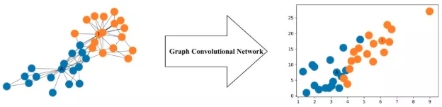
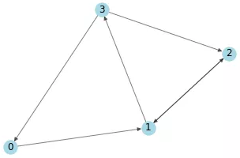
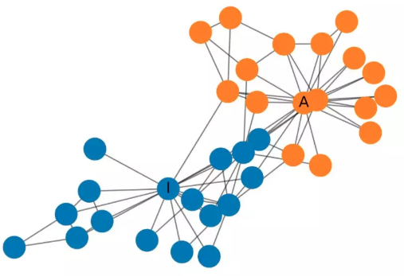
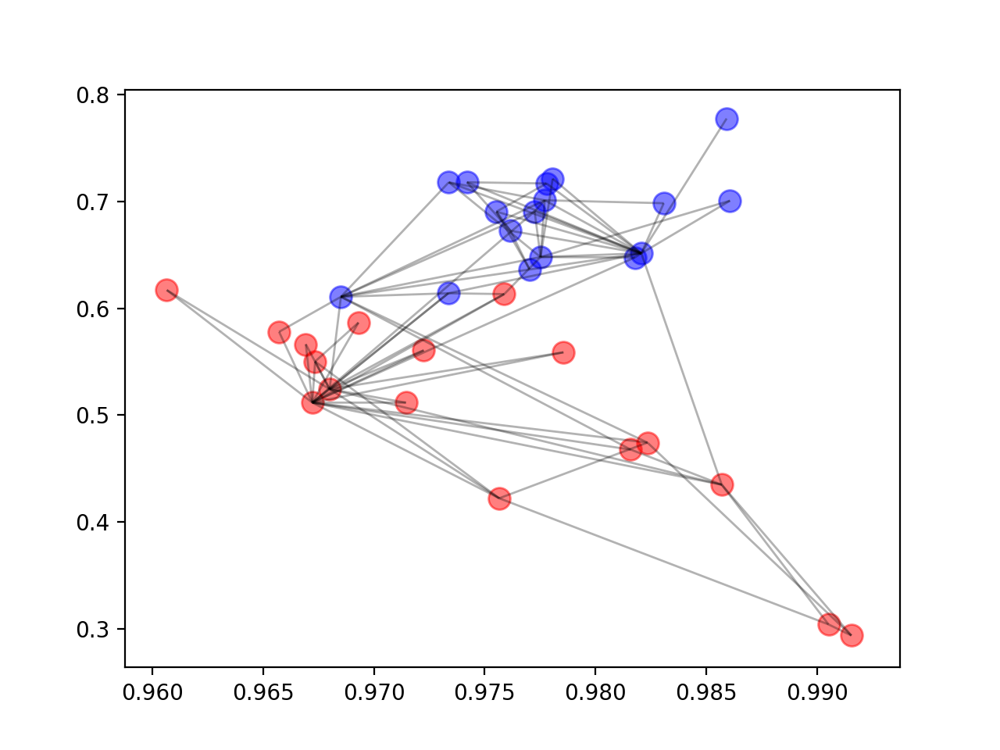
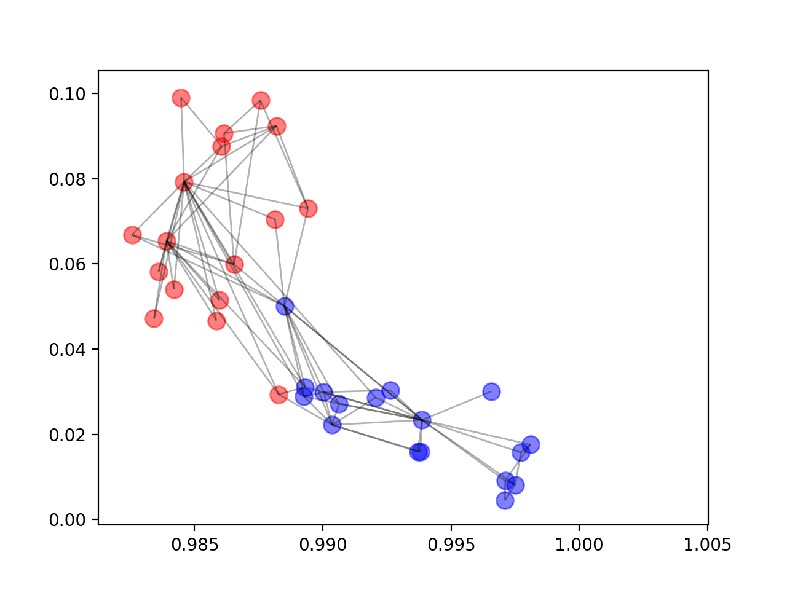
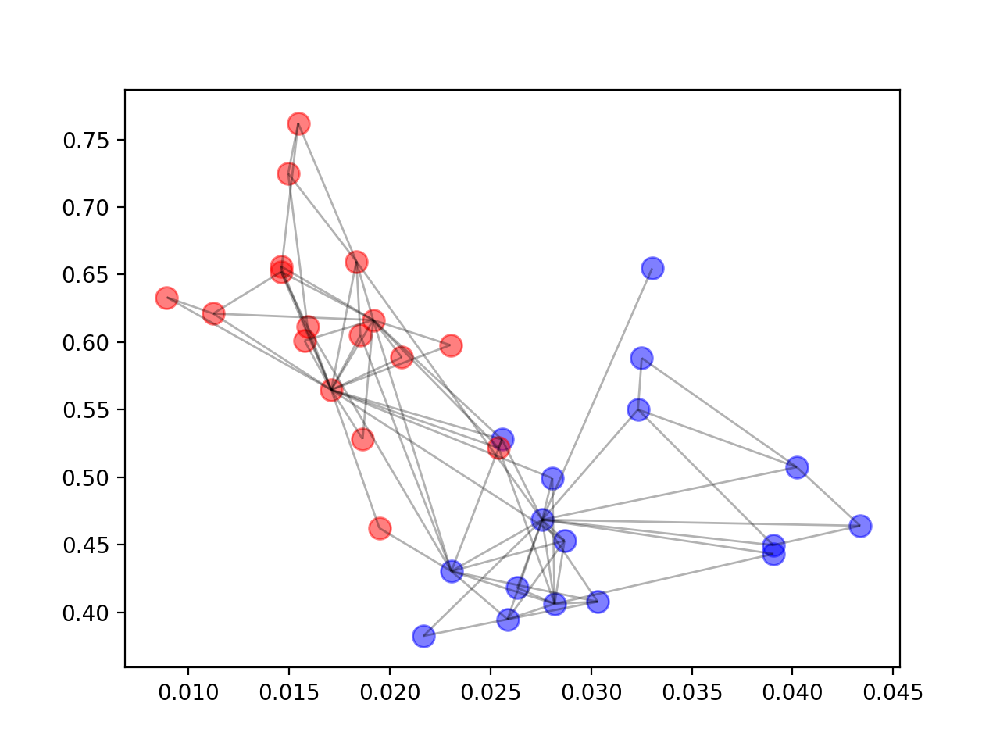
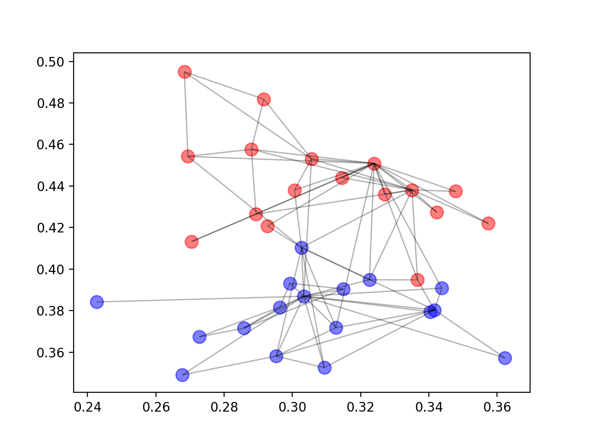

# GCN图卷积网络的numpy简单实现

* [返回上层目录](../graph-convolutional-networks.md)
* [何为图卷积网络](#何为图卷积网络)
* [传播规则的简单示例](#传播规则的简单示例)
  * [简化](#简化)
* [简单的图示例](#简单的图示例)
  * [应用传播规则](#应用传播规则)
  * [问题](#问题)
    * [增加自环](#增加自环)
    * [对特征表征进行归一化处理](#对特征表征进行归一化处理)
  * [整合](#整合)
    * [添加权重](#添加权重)
    * [添加激活函数](#添加激活函数)
* [在真实场景下的应用](#在真实场景下的应用)
  * [构建 GCN](#构建 GCN)
* [结语](#结语)
* [完整代码](#完整代码)


> 由于图结构非常复杂且信息量很大，因此对于图的机器学习是一项艰巨的任务。本文介绍了如何使用图卷积网络（GCN）对图进行深度学习，GCN是一种可直接作用于图并利用其结构信息的强大神经网络。
>
> 本文将介绍GCN，并使用代码示例说明信息是如何通过GCN的隐藏层传播的。读者将看到GCN如何聚合来自前一层的信息，以及这种机制如何生成图中节点的有用特征表征。

# 何为图卷积网络

GCN是一类非常强大的用于图数据的神经网络架构。事实上，它非常强大，即使是随机初始化的两层GCN也可以生成图网络中节点的有用特征表征。下图展示了这种两层GCN生成的每个节点的二维表征。请注意，即使没有经过任何训练，这些二维表征也能够保存图中节点的相对邻近性。



更形式化地说，图卷积网络（GCN）是一个对图数据进行操作的神经网络。给定图$G = (V, E)$，GCN的输入为：

- 一个输入维度为$N \times F^0$的特征矩阵$X$，其中$N$是图网络中的节点数，$F^0$是每个节点的输入特征数。
- 一个图结构的维度为$N \times N$的矩阵表征，例如图G的邻接矩阵A。

因此，GCN 中的隐藏层可以写作$H^i=f(H^{i-1}, A))$。其中，$H^0 = X$，$f$是一种传播规则。每一个隐藏层$H^i$都对应一个维度为$N \times F^i$的特征矩阵，该矩阵中的每一行都是某个节点的特征表征。在每一层中，GCN会使用传播规则f将这些信息聚合起来，从而形成下一层的特征。这样一来，在每个连续的层中特征就会变得越来越抽象。在该框架下，GCN的各种变体只不过是在传播规则f的选择上有所不同。

# 传播规则的简单示例

下面，本文将给出一个最简单的传播规则示例：
$$
f(H^i,A)=\sigma(AH^iW^i)
$$
其中，$W^i$是第$i$层的权重矩阵，$\sigma$是非线性激活函数（如ReLU函数）。权重矩阵的维度为$F^i \times F^{i+1}$，即权重矩阵第二个维度的大小决定了下一层的特征数。如果你对卷积神经网络很熟悉，那么**你会发现由于这些权重在图中的节点间共享，该操作与卷积核滤波操作类似**。

## 简化

接下来我们在最简单的层次上研究传播规则。令：

- $i = 1$，（约束条件$f$是作用于输入特征矩阵的函数）
- $\sigma$为恒等函数
- 选择权重（约束条件： $AH^0W^0 =AXW^0 = AX$）

换言之，$f(X, A) = AX$。该传播规则可能过于简单，本文后面会补充缺失的部分。此外，$AX$等价于多层感知机的输入层。

# 简单的图示例

我们将使用下面的图作为简单的示例：



*一个简单的有向图。*

使用numpy编写的上述有向图的邻接矩阵表征如下：

```python
# 有向图的邻接矩阵表征
A = np.matrix([
    [0, 1, 0, 0],
    [0, 0, 1, 1],
    [0, 1, 0, 0],
    [1, 0, 1, 0]],
    dtype=float
)
print("A = \n", A)
'''
[[0. 1. 0. 0.]
 [0. 0. 1. 1.]
 [0. 1. 0. 0.]
 [1. 0. 1. 0.]]
'''
```

接下来，我们需要抽取出特征！我们基于每个节点的索引为其生成两个整数特征，这简化了本文后面手动验证矩阵运算的过程。

```python
# 两个整数特征
X = np.matrix([
    [i, -i]
    for i in range(A.shape[0])],
    dtype=float
)
print("X = \n", X)
'''
[[ 0.  0.]
 [ 1. -1.]
 [ 2. -2.]
 [ 3. -3.]]
'''
```

## 应用传播规则

我们现在已经建立了一个图，其邻接矩阵为$A$，输入特征的集合为$X$。下面让我们来看看，当我们对其应用传播规则后会发生什么：

```python
print("A * X = \n", A * X)
'''
[[ 1. -1.]
 [ 5. -5.]
 [ 1. -1.]
 [ 2. -2.]]
'''
```

每个节点的表征（每一行）现在是其相邻节点特征的和！换句话说，图卷积层将每个节点表示为其相邻节点的聚合。大家可以自己动手验证这个计算过程。请注意，在这种情况下，如果存在从$v$到$n$的边，则节点$n$是节点$v$的邻居。

## 问题

你可能已经发现了其中的问题：

- 节点的聚合表征不包含它自己的特征！该表征是相邻节点的特征聚合，因此只有具有自环（self-loop）的节点才会在该聚合中包含自己的特征 [1]。
- 度大的节点在其特征表征中将具有较大的值，度小的节点将具有较小的值。这可能会导致梯度消失或梯度爆炸 [1, 2]，也会影响随机梯度下降算法（随机梯度下降算法通常被用于训练这类网络，且对每个输入特征的规模（或值的范围）都很敏感）。

接下来，本文将分别对这些问题展开讨论。

### 增加自环

为了解决第一个问题，我们可以直接为每个节点添加一个自环。具体而言，这可以通过在应用传播规则之前将邻接矩阵$A$与单位矩阵$I$相加来实现。

```python
I = np.matrix(np.eye(A.shape[0]))
print("I = \n", I)
'''
[[1. 0. 0. 0.]
 [0. 1. 0. 0.]
 [0. 0. 1. 0.]
 [0. 0. 0. 1.]]
'''
# 每个节点都是自己的邻居
A_hat = A + I
print("A_hat = \n", A_hat)
'''
[[1. 1. 0. 0.]
 [0. 1. 1. 1.]
 [0. 1. 1. 0.]
 [1. 0. 1. 1.]]
'''
# 由于每个节点都是自己的邻居，每个节点在对相邻节点的特征求和过程中也会囊括自己的特征！
print("A_hat * X = \n", A_hat * X)
'''
[[ 1. -1.]
 [ 6. -6.]
 [ 3. -3.]
 [ 5. -5.]]
'''
```

现在，由于每个节点都是自己的邻居，每个节点在对相邻节点的特征求和过程中也会囊括自己的特征！

### 对特征表征进行归一化处理

通过将邻接矩阵$A$与度矩阵$D$的逆相乘，对其进行变换，从而通过节点的度对特征表征进行归一化。因此，我们简化后的传播规则如下：
$$
f(X, A)=D^{-1}AX
$$
让我们看看发生了什么。我们首先计算出节点的度矩阵。

```python
# 首先计算出节点的度矩阵，这里改成了出度
print("A = \n", A)
D = np.array(np.sum(A, axis=1))[:, 0]
#D = np.array(np.sum(A, axis=0))[0]
D = np.matrix(np.diag(D))
print("D = \n", D)
'''
 [[1. 0. 0. 0.]
 [0. 2. 0. 0.]
 [0. 0. 1. 0.]
 [0. 0. 0. 2.]]
'''
```

变换之前

```python
A = np.matrix([
    [0, 1, 0, 0],
    [0, 0, 1, 1], 
    [0, 1, 0, 0],
    [1, 0, 1, 0]],
    dtype=float
)
```

变换之后

```python
# A归一化后,邻接矩阵中每一行的权重（值）都除以该行对应节点的度
print("D⁻¹ * A = \n", D**-1 * A)
'''
 [[0.  1.  0.  0. ]
 [0.  0.  0.5 0.5]
 [0.  1.  0.  0. ]
 [0.5 0.  0.5 0. ]]
'''
```

可以观察到，邻接矩阵中每一行的权重（值）都除以该行对应节点的度。我们接下来对变换后的邻接矩阵应用传播规则：

```python
# 接下来对变换后的邻接矩阵应用传播规则
# 得到与相邻节点的特征均值对应的节点表征。这是因为（变换后）邻接矩阵的权重对应于相邻节点特征加权和的权重
print("D⁻¹ * A * X = \n", D**-1 * A * X)
'''
 [[ 1.  -1. ]
 [ 2.5 -2.5]
 [ 1.  -1. ]
 [ 1.  -1. ]]
'''
```

得到与相邻节点的特征均值对应的节点表征。这是因为（变换后）邻接矩阵的权重对应于相邻节点特征加权和的权重。大家可以自己动手验证这个结果。

## 整合

现在，我们将把自环和归一化技巧结合起来。

```python
# 接下来得到D_hat, 是 A_hat = A + I 对应的度矩阵
D_hat = np.array(np.sum(A_hat, axis=1))[:, 0]
D_hat = np.matrix(np.diag(D_hat))
print("D_hat = \n", D_hat)
'''
 [[2. 0. 0. 0.]
 [0. 3. 0. 0.]
 [0. 0. 2. 0.]
 [0. 0. 0. 3.]]
'''
```

此外，我们还将重新介绍之前为了简化讨论而省略的有关权重和激活函数的操作。

### 添加权重

首先要做的是应用权重。请注意，这里的$\hat{D}$是$\hat{A} = A + I$对应的度矩阵，即具有强制自环的矩阵$A$的度矩阵。

```python
# 我们想要减小输出特征表征的维度，我们可以减小权重矩阵 W 的规模
# 但是这里故意增大了
W = np.matrix([
    [1, -1, 2],
    [-1, 1, -2]
])
print("W = \n", W)
'''
W = 
 [[ 1 -1  2]
 [-1  1 -2]]
'''
```

$\hat{D}^{-1} \cdot \hat{A} \cdot X\cdot W =$

```python
print("A_hat = \n", A_hat)
'''
 [[1. 1. 0. 0.]
 [0. 1. 1. 1.]
 [0. 1. 1. 0.]
 [1. 0. 1. 1.]]
'''

print("D_hat**-1 * A_hat = \n", D_hat**-1 * A_hat)
'''
 [[0.5        0.5        0.         0.        ]
 [0.         0.33333333 0.33333333 0.33333333]
 [0.         0.5        0.5        0.        ]
 [0.33333333 0.         0.33333333 0.33333333]]
'''

print("D_hat**-1 * A_hat * X = \n", D_hat**-1 * A_hat * X)
'''
 [[ 0.5        -0.5       ]
 [ 2.         -2.        ]
 [ 1.5        -1.5       ]
 [ 1.66666667 -1.66666667]]
'''

print("D_hat**-1 * A_hat * X * W = \n", D_hat**-1 * A_hat * X * W)
'''
 [[ 1.         -1.          2.        ]
 [ 4.         -4.          8.        ]
 [ 3.         -3.          6.        ]
 [ 3.33333333 -3.33333333  6.66666667]]
'''
```

### 添加激活函数

本文选择保持特征表征的维度，并应用ReLU激活函数。

```python
# 添加激活函数
print("relu(D_hat**-1 * A_hat * X * W) = \n", relu(D_hat**-1 * A_hat * X * W))
'''
 [[1.         0.         2.        ]
 [4.         0.         8.        ]
 [3.         0.         6.        ]
 [3.33333333 0.         6.66666667]]
'''
```

这就是一个带有邻接矩阵、输入特征、权重和激活函数的完整隐藏层！

我们一步步来看明白：
$$
\begin{aligned}
&\hat{D}^{-1} \cdot \hat{A} \cdot X\cdot W\\
=&\hat{D}^{-1} \cdot (A + I) \cdot X\cdot W\\
=&\begin{bmatrix}
2& 0& 0& 0\\
0& 3& 0& 0\\
0& 0& 2& 0\\
0& 0& 0& 3\\
\end{bmatrix} ^{-1}
\cdot
\left(
\begin{bmatrix}
0& 1& 0& 0\\
0& 0& 1& 1\\
0& 1& 0& 0\\
1& 0& 1& 0\\
\end{bmatrix} 
+I\right)
\cdot
\begin{bmatrix}
0& 0\\
1& -1\\
2& -2\\
3& -3\\
\end{bmatrix} 
\cdot
\begin{bmatrix}
1& -1& 2\\
-1& 1& -2\\
\end{bmatrix}\\
=&\begin{bmatrix}
0.5& 0& 0& 0\\
0& 0.33& 0& 0\\
0& 0& 0.5& 0\\
0& 0& 0& 0.33\\
\end{bmatrix}
\cdot
\begin{bmatrix}
1& 1& 0& 0\\
0& 1& 1& 1\\
0& 1& 1& 0\\
1& 0& 1& 1\\
\end{bmatrix} 
\cdot
\begin{bmatrix}
0& 0\\
1& -1\\
2& -2\\
3& -3\\
\end{bmatrix} 
\cdot
\begin{bmatrix}
1& -1& 2\\
-1& 1& -2\\
\end{bmatrix}\\ 
=&\begin{bmatrix}
0.5& 0.5& 0& 0\\
0& 0.33& 0.33& 0.33\\
0& 0.5& 0.5& 0\\
0.33& 0& 0.33& 0.33\\
\end{bmatrix} 
\cdot
\begin{bmatrix}
0& 0\\
1& -1\\
2& -2\\
3& -3\\
\end{bmatrix} 
\cdot
\begin{bmatrix}
1& -1& 2\\
-1& 1& -2\\
\end{bmatrix}\\
=&\begin{bmatrix}
0.5& 0.5\\
2& -2\\
1.5& -1.5\\
1.66& -1.66\\
\end{bmatrix} 
\cdot
\begin{bmatrix}
1& -1& 2\\
-1& 1& -2\\
\end{bmatrix}\\
=&\begin{bmatrix}
0& 0& 0\\
4& -4& 8\\
3& -3& 6\\
3.32& -3.32& 6.64\\
\end{bmatrix}\\
&\\
&\text{ReLU}\left(\hat{D}^{-1} \cdot \hat{A} \cdot X\cdot W\right)\\
=&\begin{bmatrix}
0& 0& 0\\
4& 0& 8\\
3& 0& 6\\
3.32& 0& 6.64\\
\end{bmatrix}\\
\end{aligned}\\
$$


# 在真实场景下的应用

最后，我们将图卷积网络应用到一个真实的图上。本文将向读者展示如何生成上文提到的特征表征。

**Zachary 空手道俱乐部**

Zachary 空手道俱乐部是一个被广泛使用的社交网络，其中的节点代表空手道俱乐部的成员，边代表成员之间的相互关系。当年，Zachary 在研究空手道俱乐部的时候，管理员和教员发生了冲突，导致俱乐部一分为二。下图显示了该网络的图表征，其中的节点标注是根据节点属于俱乐部的哪个部分而得到的，A和I分别表示属于管理员和教员阵营的节点。



*Zachary 空手道俱乐部图网络*

## 构建 GCN

接下来，我们将构建一个图卷积网络。**我们并不会真正训练该网络，但是会对其进行简单的随机初始化，从而生成我们在本文开头看到的特征表征**。

我们将使用networkx，它有一个可以很容易实现的Zachary空手道俱乐部的图表征。

该俱乐部有34个人，对应34个节点。

```python
import networkx as nx
from networkx import to_numpy_matrix

zkc = nx.karate_club_graph()
print(zkc)  # Zachary's Karate Club
print(type(zkc))  # <class 'networkx.classes.graph.Graph'>

print(zkc.nodes())
# [0, 1, 2, 3, 4, 5, 6, 7, 8, 9, 10, 11, 12, 13, 14, 15, 16, 17,
#  18, 19, 20, 21, 22, 23, 24, 25, 26, 27, 28, 29, 30, 31, 32, 33]
print(type(zkc.nodes()))
# <class 'networkx.classes.reportviews.NodeView'>

order = sorted(list(zkc.nodes()))
# [0, 1, 2, 3, 4, 5, 6, 7, 8, 9, 10, 11, 12, 13, 14, 15, 16, 17,
#  18, 19, 20, 21, 22, 23, 24, 25, 26, 27, 28, 29, 30, 31, 32, 33]
```

然后，我们将计算$\hat{A},\ \hat{B}$矩阵。

```python
A = to_numpy_matrix(zkc, nodelist=order)
print(A)
'''
[[0. 1. 1. ... 1. 0. 0.]
 [1. 0. 1. ... 0. 0. 0.]
 [1. 1. 0. ... 0. 1. 0.]
 ...
 [1. 0. 0. ... 0. 1. 1.]
 [0. 0. 1. ... 1. 0. 1.]
 [0. 0. 0. ... 1. 1. 0.]]
'''
print(A.shape[0], A.shape[1])
# 34 34

I = np.eye(zkc.number_of_nodes())  # 34 x 34
A_hat = A + I

D_hat = np.array(np.sum(A_hat, axis=0))[0]
D_hat = np.matrix(np.diag(D_hat))
```

接下来，我们将随机初始化权重。

```python
W_1 = np.random.normal(
    loc=0, scale=1, size=(zkc.number_of_nodes(), 4))
print("W_1 = \n", W_1)
'''
W_1 = 
 [[ 6.42144245e-01 -2.83590736e-01 -8.75764693e-01  4.17843912e-01]
 [-6.60605015e-01 -4.72658496e-01  1.10796818e+00 -1.64596954e+00]
 ...
 [-4.34570333e-01 -1.17468794e+00  3.94254896e-01  2.24888554e-01]]
'''
W_2 = np.random.normal(
    loc = 0, size=(W_1.shape[1], 2))
print("W_2 = \n", W_2)
'''
W_2 = 
 [[-0.41063717  0.61026865]
 [-0.20577127 -1.79543329]
 [ 1.1148323   0.34126572]]
'''
```

接着，我们会堆叠GCN层。这里，我们只使用单位矩阵作为特征表征，即每个节点被表示为一个one-hot编码的类别变量。

```python
def relu(x):
    #return np.maximum(x, 0)
    #试试sigmoid啥情况
    s = 1 / (1 + np.exp(-x))
    return s

def gcn_layer(A_hat, D_hat, X, W):
    return relu(D_hat**-1 * A_hat * X * W)

H_1 = gcn_layer(A_hat, D_hat, I, W_1)

H_2 = gcn_layer(A_hat, D_hat, H_1, W_2)

output = H_2

print("output = \n", output)
'''
output = 
 [[0.30333074 0.38689069]
 [0.34164209 0.3803171 ]
 ...
 [0.29526046 0.35807214]]
'''
print(output.shape[0], output.shape[1])
# 34 2
```

我们进一步抽取出特征表征。

```python
feature_representations = {
    node: np.array(output)[node]
    for node in zkc.nodes()}
```

然后我们开始画图：

```python
# 绘画
import matplotlib.pyplot as plt

# 原本的关系图
def plot_graph(G, weight_name=None):
    '''
    G: a networkx G
    weight_name: name of the attribute for plotting edge weights (if G is weighted)
    '''
    #% matplotlib
    #notebook
    import matplotlib.pyplot as plt

    plt.figure()
    pos = nx.spring_layout(G)
    edges = G.edges()
    weights = None

    if weight_name:
        weights = [int(G[u][v][weight_name]) for u, v in edges]
        labels = nx.get_edge_attributes(G, weight_name)
        nx.draw_networkx_edge_labels(G, pos, edge_labels=labels)
        nx.draw_networkx(G, pos, edges=edges, width=weights);
    else:
        nodelist1 = []
        nodelist2 = []
        for i in range(34):
            if zkc.nodes[i]['club'] == 'Mr. Hi':
                nodelist1.append(i)
            else:
                nodelist2.append(i)
        # nx.draw_networkx(G, pos, edges=edges);
        nx.draw_networkx_nodes(G, pos, nodelist=nodelist1, node_size=300, node_color='r', alpha=0.8)
        nx.draw_networkx_nodes(G, pos, nodelist=nodelist2, node_size=300, node_color='b', alpha=0.8)
        nx.draw_networkx_edges(G, pos, edgelist=edges, alpha=0.4)


plot_graph(zkc)

# 隐层参数的图
plt.figure()
for i in range (34):
    if zkc.nodes[i]['club'] == 'Mr. Hi':
        plt.scatter(np.array(output)[i,0],np.array(output)[i,1] ,color = 'b',alpha=0.5,s = 100)
    else:
        plt.scatter(np.array(output)[i,0],np.array(output)[i,1] ,color = 'r',alpha=0.5,s = 100)


H = nx.Graph()

node_num = len(feature_representations)

nodes = list(range(node_num))  # 34 nodes

# add edges
for i in range(node_num):
    src = i
    for j in range(node_num):
        if A[i, j] != 0 and i != j:
            dest = j
            H.add_edge(src, dest)

nx.draw_networkx_edges(H, feature_representations, alpha=0.3)
plt.show()
```

原本的关系图：

隐层的参数如下所示，你看，这样的特征表征可以很好地将 Zachary 空手道俱乐部的两个社区划分开来。至此，我们甚至都没有开始训练模型！



重复不同的次数就能得到不同的图。

我们应该注意到，在该示例中由于 ReLU 函数的作用，在 x 轴或 y 轴上随机初始化的权重很可能为 0，因此需要反复进行几次随机初始化才能生成上面的图。







# 结语

本文中对图卷积网络进行了高屋建瓴的介绍，并说明了GCN中每一层节点的特征表征是如何基于其相邻节点的聚合构建的。读者可以从中了解到如何使用numpy构建这些网络，以及它们的强大：**即使是随机初始化的GCN也可以将Zachary空手道俱乐部网络中的社区分离开来**。

# 完整代码

上文的完整代码如下：

```python
import pandas as pd
import numpy as np


def relu(x):
    #return np.maximum(x, 0)
    s = 1 / (1 + np.exp(-x))
    return s


# 有向图的邻接矩阵表征
A = np.matrix([
    [0, 1, 0, 0],
    [0, 0, 1, 1],
    [0, 1, 0, 0],
    [1, 0, 1, 0]],
    dtype=float
)
print("A = \n", A)
'''
[[0. 1. 0. 0.]
 [0. 0. 1. 1.]
 [0. 1. 0. 0.]
 [1. 0. 1. 0.]]
'''
# 两个整数特征
X = np.matrix([
    [i, -i]
    for i in range(A.shape[0])],
    dtype=float
)
print("X = \n", X)
'''
[[ 0.  0.]
 [ 1. -1.]
 [ 2. -2.]
 [ 3. -3.]]
'''
# 应用传播规则 A*X
# 每个节点的表征（每一行）现在是其相邻节点特征的和！
# 换句话说，图卷积层将每个节点表示为其相邻节点的聚合。
print("A * X = \n", A * X)
'''
[[ 1. -1.]
 [ 5. -5.]
 [ 1. -1.]
 [ 2. -2.]]
'''

# 上面存在的问题：
# 1、节点的聚合表征不包含它自己的特征！
# 2、度大的节点在其特征表征中将具有较大的值，度小的节点将具有较小的值。
#    这可能会导致梯度消失或梯度爆炸
I = np.matrix(np.eye(A.shape[0]))
print("I = \n", I)
'''
[[1. 0. 0. 0.]
 [0. 1. 0. 0.]
 [0. 0. 1. 0.]
 [0. 0. 0. 1.]]
'''
# 每个节点都是自己的邻居
A_hat = A + I
print("A_hat = \n", A_hat)
'''
[[1. 1. 0. 0.]
 [0. 1. 1. 1.]
 [0. 1. 1. 0.]
 [1. 0. 1. 1.]]
'''
# 由于每个节点都是自己的邻居，每个节点在对相邻节点的特征求和过程中也会囊括自己的特征！
print("A_hat * X = \n", A_hat * X)
'''
[[ 1. -1.]
 [ 6. -6.]
 [ 3. -3.]
 [ 5. -5.]]
'''
# 为了防止某些度很大的节点的特征值很大，对特征表征进行归一化处理
# 通过将邻接矩阵 A 与度矩阵 D 的逆相乘，对其进行变换，从而通过节点的度对特征表征进行归一化
# f(X, A) = D⁻¹AX

# 首先计算出节点的度矩阵，这里改成了出度
print("A = \n", A)
D = np.array(np.sum(A, axis=1))[:, 0]
#D = np.array(np.sum(A, axis=0))[0]
D = np.matrix(np.diag(D))
print("D = \n", D)
'''
 [[1. 0. 0. 0.]
 [0. 2. 0. 0.]
 [0. 0. 1. 0.]
 [0. 0. 0. 2.]]
'''

# A归一化后,邻接矩阵中每一行的权重（值）都除以该行对应节点的度
print("D⁻¹ * A = \n", D**-1 * A)
'''
 [[0.  1.  0.  0. ]
 [0.  0.  0.5 0.5]
 [0.  1.  0.  0. ]
 [0.5 0.  0.5 0. ]]
'''

# 接下来对变换后的邻接矩阵应用传播规则
# 得到与相邻节点的特征均值对应的节点表征。这是因为（变换后）邻接矩阵的权重对应于相邻节点特征加权和的权重
print("D⁻¹ * A * X = \n", D**-1 * A * X)
'''
 [[ 1.  -1. ]
 [ 2.5 -2.5]
 [ 1.  -1. ]
 [ 1.  -1. ]]
'''

# 接下来得到D_hat, 是 A_hat = A + I 对应的度矩阵
D_hat = np.array(np.sum(A_hat, axis=1))[:, 0]
D_hat = np.matrix(np.diag(D_hat))
print("D_hat = \n", D_hat)
'''
 [[2. 0. 0. 0.]
 [0. 3. 0. 0.]
 [0. 0. 2. 0.]
 [0. 0. 0. 3.]]
'''


# ================= 整合 ===============

# 现在，我们将把自环和归一化技巧结合起来。
# 此外，我们还将重新介绍之前为了简化讨论而省略的有关权重和激活函数的操作。

# 添加权重
# 我们想要减小输出特征表征的维度，我们可以减小权重矩阵 W 的规模
# 但是这里故意增大了
W = np.matrix([
    [1, -1, 2],
    [-1, 1, -2]
])
print("W = \n", W)
'''
W = 
 [[ 1 -1  2]
 [-1  1 -2]]
'''

print("A_hat = \n", A_hat)
'''
 [[1. 1. 0. 0.]
 [0. 1. 1. 1.]
 [0. 1. 1. 0.]
 [1. 0. 1. 1.]]
'''

print("D_hat**-1 * A_hat = \n", D_hat**-1 * A_hat)
'''
 [[0.5        0.5        0.         0.        ]
 [0.         0.33333333 0.33333333 0.33333333]
 [0.         0.5        0.5        0.        ]
 [0.33333333 0.         0.33333333 0.33333333]]
'''

print("D_hat**-1 * A_hat * X = \n", D_hat**-1 * A_hat * X)
'''
 [[ 0.5        -0.5       ]
 [ 2.         -2.        ]
 [ 1.5        -1.5       ]
 [ 1.66666667 -1.66666667]]
'''

print("D_hat**-1 * A_hat * X * W = \n", D_hat**-1 * A_hat * X * W)
'''
 [[ 1.         -1.          2.        ]
 [ 4.         -4.          8.        ]
 [ 3.         -3.          6.        ]
 [ 3.33333333 -3.33333333  6.66666667]]
'''

# 添加激活函数
print("relu(D_hat**-1 * A_hat * X * W) = \n", relu(D_hat**-1 * A_hat * X * W))
'''
 [[1.         0.         2.        ]
 [4.         0.         8.        ]
 [3.         0.         6.        ]
 [3.33333333 0.         6.66666667]]

'''


# ============ 我们将图卷积网络应用到一个真实的图上 ============

import networkx as nx
from networkx import to_numpy_matrix

zkc = nx.karate_club_graph()
print(zkc)  # Zachary's Karate Club
print(type(zkc))  # <class 'networkx.classes.graph.Graph'>

print(zkc.nodes())
# [0, 1, 2, 3, 4, 5, 6, 7, 8, 9, 10, 11, 12, 13, 14, 15, 16, 17,
#  18, 19, 20, 21, 22, 23, 24, 25, 26, 27, 28, 29, 30, 31, 32, 33]
print(type(zkc.nodes()))
# <class 'networkx.classes.reportviews.NodeView'>

order = sorted(list(zkc.nodes()))
# [0, 1, 2, 3, 4, 5, 6, 7, 8, 9, 10, 11, 12, 13, 14, 15, 16, 17,
#  18, 19, 20, 21, 22, 23, 24, 25, 26, 27, 28, 29, 30, 31, 32, 33]

A = to_numpy_matrix(zkc, nodelist=order)
print(A)
'''
[[0. 1. 1. ... 1. 0. 0.]
 [1. 0. 1. ... 0. 0. 0.]
 [1. 1. 0. ... 0. 1. 0.]
 ...
 [1. 0. 0. ... 0. 1. 1.]
 [0. 0. 1. ... 1. 0. 1.]
 [0. 0. 0. ... 1. 1. 0.]]
'''
print(A.shape[0], A.shape[1])
# 34 34

I = np.eye(zkc.number_of_nodes())  # 34 x 34
A_hat = A + I

D_hat = np.array(np.sum(A_hat, axis=0))[0]
D_hat = np.matrix(np.diag(D_hat))

# 接下来，我们将随机初始化权重。
W_1 = np.random.normal(
    loc=0, scale=1, size=(zkc.number_of_nodes(), 4))
'''
W_1 = 
 [[ 6.42144245e-01 -2.83590736e-01 -8.75764693e-01  4.17843912e-01]
 [-6.60605015e-01 -4.72658496e-01  1.10796818e+00 -1.64596954e+00]
 ...
 [-4.34570333e-01 -1.17468794e+00  3.94254896e-01  2.24888554e-01]]
'''
W_2 = np.random.normal(
    loc = 0, size=(W_1.shape[1], 2))
'''
W_2 = 
 [[-0.41063717  0.61026865]
 [-0.20577127 -1.79543329]
 [ 1.1148323   0.34126572]]
'''

print("W_1 = \n", W_1)
print("W_2 = \n", W_2)

# 接着，我们会堆叠 GCN 层。
# 这里，我们只使用单位矩阵作为特征表征，
# 即每个节点被表示为一个 one-hot 编码的类别变量。


def gcn_layer(A_hat, D_hat, X, W):
    return relu(D_hat**-1 * A_hat * X * W)


H_1 = gcn_layer(A_hat, D_hat, I, W_1)

H_2 = gcn_layer(A_hat, D_hat, H_1, W_2)

output = H_2
'''
output = 
 [[0.30333074 0.38689069]
 [0.34164209 0.3803171 ]
 ...
 [0.29526046 0.35807214]]
'''

print("output = \n", output)
print(output.shape[0], output.shape[1])


feature_representations = {
    node: np.array(output)[node]
    for node in zkc.nodes()}

print(feature_representations)
print(type(feature_representations))
print(feature_representations[0])

print(feature_representations[0][1])

print("len = ", len(feature_representations))

# 绘画
import matplotlib.pyplot as plt

# 原本的关系图
def plot_graph(G, weight_name=None):
    '''
    G: a networkx G
    weight_name: name of the attribute for plotting edge weights (if G is weighted)
    '''
    #% matplotlib
    #notebook
    import matplotlib.pyplot as plt

    plt.figure()
    pos = nx.spring_layout(G)
    edges = G.edges()
    weights = None

    if weight_name:
        weights = [int(G[u][v][weight_name]) for u, v in edges]
        labels = nx.get_edge_attributes(G, weight_name)
        nx.draw_networkx_edge_labels(G, pos, edge_labels=labels)
        nx.draw_networkx(G, pos, edges=edges, width=weights);
    else:
        nodelist1 = []
        nodelist2 = []
        for i in range(34):
            if zkc.nodes[i]['club'] == 'Mr. Hi':
                nodelist1.append(i)
            else:
                nodelist2.append(i)
        # nx.draw_networkx(G, pos, edges=edges);
        nx.draw_networkx_nodes(G, pos, nodelist=nodelist1, node_size=300, node_color='r', alpha=0.8)
        nx.draw_networkx_nodes(G, pos, nodelist=nodelist2, node_size=300, node_color='b', alpha=0.8)
        nx.draw_networkx_edges(G, pos, edgelist=edges, alpha=0.4)


plot_graph(zkc)

# 隐层参数的图
plt.figure()
for i in range (34):
    if zkc.nodes[i]['club'] == 'Mr. Hi':
        plt.scatter(np.array(output)[i,0],np.array(output)[i,1] ,color = 'b',alpha=0.5,s = 100)
    else:
        plt.scatter(np.array(output)[i,0],np.array(output)[i,1] ,color = 'r',alpha=0.5,s = 100)


H = nx.Graph()

node_num = len(feature_representations)

nodes = list(range(node_num))  # 34 nodes

# add edges
for i in range(node_num):
    src = i
    for j in range(node_num):
        if A[i, j] != 0 and i != j:
            dest = j
            H.add_edge(src, dest)

nx.draw_networkx_edges(H, feature_representations, alpha=0.3)
plt.show()
```


# 参考资料

* [图卷积网络到底怎么做，这是一份极简的Numpy实现](https://mp.weixin.qq.com/s/sg9O761F0KHAmCPOfMW_kQ)

本文主要参考此文章。

* [How to do Deep Learning on Graphs with Graph Convolutional Networks](https://towardsdatascience.com/how-to-do-deep-learning-on-graphs-with-graph-convolutional-networks-7d2250723780)

这是本文参考文章的英文版。

* [Graph Convolutional Network介绍及简单实现(一)](https://blog.csdn.net/qq_36793545/article/details/84844867)

本文的绘图主要参考此博客。

* [How to draw a small graph with community structure in networkx](https://stackoverflow.com/questions/40941264/how-to-draw-a-small-graph-with-community-structure-in-networkx)

本文的绘图中的连线部分参考此回答。


