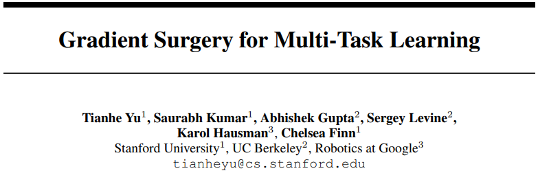

# PCGrad用于多任务的梯度手术

- [返回上层目录](../multi-task-rl.md)




pdf:  [Gradient Surgery for Multi-Task Learning](https://arxiv.org/pdf/2001.06782)

github: [PCGrad/PCGrad_tf.py](https://github.com/tianheyu927/PCGrad/blob/master/PCGrad_tf.py)

其他人实现的pytorch版：[woozch/PCGrad-pytorch-example](https://github.com/woozch/PCGrad-pytorch-example/blob/master/pcgrad-example.py)

PCGrad（**Projected Conflicting Gradient**）是一种多任务学习中的优化方法，尤其适用于多任务结构，用于 **解决不同任务之间梯度方向冲突** 的问题。

# PCGrad的核心思想

在标准反向传播中：

- 每个任务都会产生一组梯度；
- 如果两个任务的梯度方向是冲突的（夹角>90°），那它们会“拉扯” base 参数，互相干扰。

**PCGrad 的做法是：**

> 当两个任务的梯度方向冲突时，将其中一个任务的梯度投影到另一个任务梯度的法线方向上，从而去除“冲突成分”。

为什么强化学习特别适合用 PCGrad？

因为：

- actor 和 critic 是**目标不同的任务**；
- 往往在 early stage，critic loss 较大、方向变化快，很容易与 actor 相互干扰；
- PCGrad 可以保留两者的“意图”，但避免直接拉扯 base。

# 论文概述

这篇论文《Gradient Surgery for Multi-Task Learning》由Tianhe Yu等人撰写，发表于2020年的NeurIPS会议。论文提出了一种名为“PCGrad”（Projecting Conflicting Gradients）的算法，用于解决多任务学习中的优化问题。通过投影冲突梯度，PCGrad能够显著提高多任务学习的效率和性能，且该方法模型无关，可广泛应用于监督学习和强化学习任务。

## 论文背景

多任务学习（Multi-Task Learning, MTL）是一种通过同时学习多个相关任务来提高学习效率和性能的方法。然而，多任务学习在优化过程中面临诸多挑战，尤其是在任务梯度相互冲突时，可能导致学习效率低下甚至性能下降。尽管已有研究探讨了多任务学习中的优化问题，但其背后的机制尚未完全明确。本文通过分析多任务优化中的梯度冲突、梯度差异和高曲率等条件，提出了PCGrad算法来缓解这些问题。

- **多任务学习（MTL）**的挑战：多个任务的梯度在反向传播时可能发生冲突（方向相反或量级差异大），导致优化困难、性能下降。
- 现有方法（如梯度裁剪、权重调整）无法从根本上解决梯度冲突问题。

## 研究方法

本文首先分析了多任务学习中的优化挑战，指出当不同任务的梯度相互冲突（即梯度方向相反）时，会导致优化过程中的干扰。作者定义了三个关键条件，即“悲剧三元组”（Tragic Triad）：

1. **梯度冲突**：不同任务的梯度方向相反，即梯度的余弦相似度为负。
2. **梯度差异大**：不同任务的梯度大小差异显著，导致某些任务的梯度在优化过程中占据主导地位。
3. **高曲率**：优化目标函数在某些方向上的曲率较高，可能导致优化过程中的性能高估或低估。

针对这些挑战，作者提出了PCGrad算法。该算法的核心思想是通过“梯度手术”（gradient surgery）来调整梯度，避免不同任务梯度之间的冲突。具体来说，PCGrad通过将一个任务的梯度投影到另一个任务梯度的法平面上，从而去除冲突部分，减少梯度之间的破坏性干扰。

### 数学表达（简化版）

假设任务A和任务B的梯度是 `g1` 和 `g2`：

- 如果 `g1` 和 `g2` 的内积 < 0（表示冲突）：

  - 那就把 `g1` 投影到 `g2` 的法线方向：

    ```python
    g1 = g1 - (g1 · g2 / ||g2||^2) * g2
    ```

这就消除了冲突部分，让`g1`不再与`g2`对立。

## 算法描述

PCGrad算法的具体步骤如下：

1. **计算梯度**：对于每个任务，计算其损失函数关于模型参数的梯度。

2. **检查冲突**：对于每一对任务梯度，计算它们的余弦相似度。如果余弦相似度为负，说明这两个梯度存在冲突。

3. **投影梯度**：对于存在冲突的梯度对，将一个任务的梯度投影到另一个任务梯度的法平面上。具体公式为：
   $$
   \begin{aligned}
   g_{\text{PC}}^i&=g^i-\frac{g^i\cdot g^j}{\|g^j\|^2}g^j\\
   &=g^i-\frac{\|g^i\|\cdot \|g^j\|\cdot \cos\theta}{\|g^j\|}\frac{g^j}{\|g^j\|}\\
   &=g^i-\left(\|g^i\|\cdot \cos\theta\right)\frac{g^j}{\|g^j\|}
   \end{aligned}
   $$
   

   其中，$g^i$和分$g^j$分别是任务$i$和任务的梯度$j$的梯度，$g_{\text{PC}}^i$是调整后的梯度。

4. **梯度聚合**：将处理后的梯度加权平均，用于参数更新。

伪代码：

```python
for each task i:
    g_i = compute_gradient(task_i)
    for each task j ≠ i:
        g_j = compute_gradient(task_j)
        if cosine_similarity(g_i, g_j) < 0:
            g_i = g_i - project(g_i, g_j)
aggregate_gradients = average(all g_i)
update_parameters(aggregate_gradients)
```

## 实验

作者在多个多任务学习任务上验证了PCGrad算法的有效性，包括多任务监督学习和多任务强化学习。实验结果表明，PCGrad在以下方面表现出色：

1. **多任务监督学习**：在多个标准数据集（如MultiMNIST、CityScapes、CelebA、CIFAR-100和NYUv2）上，PCGrad均取得了优于或接近现有最佳方法的结果。特别是在CIFAR-100数据集上，PCGrad结合路由网络（routing networks）后，测试准确率达到了77.5%，比单独使用PCGrad提高了2.8%。
2. **多任务强化学习**：在Meta-World基准测试的MT10和MT50任务中，PCGrad结合软演员-评论家（SAC）算法，能够更高效地学习所有任务，并且在数据效率和最终性能上均优于其他方法。例如，在MT50任务中，PCGrad能够解决约70%的任务，而单独的SAC算法只能解决约50%的任务。

## 关键结论

1. **PCGrad的有效性**：PCGrad通过直接调整梯度来缓解多任务学习中的优化问题，显著提高了学习效率和性能。
2. **模型无关性**：PCGrad不依赖于具体的模型架构，可以与多种多任务学习架构结合使用，进一步提升性能。
3. **理论分析**：作者从理论上证明了PCGrad在某些条件下能够改善标准多任务梯度下降的性能，并通过实验验证了这些条件在实际问题中经常出现。
4. **广泛适用性**：PCGrad不仅适用于监督学习，还可以应用于强化学习和目标条件强化学习等任务，具有广泛的应用前景。

## 创新点与意义

- **理论贡献**：提出梯度冲突是MTL性能下降的关键原因，并通过投影法直接优化梯度方向。
- **通用性**：方法不依赖任务权重设计，适用于不同领域（RL、CV、NLP）。

## 总结

本文提出的PCGrad算法为多任务学习中的优化问题提供了一种有效的解决方案。通过投影冲突梯度，PCGrad能够显著提高多任务学习的效率和性能，且该方法模型无关，具有广泛的适用性。实验结果表明，PCGrad在多种多任务学习任务上均取得了优异的性能，为多任务学习领域的发展提供了新的思路和方法。

# 代码实现

## 伪代码

```python
for each task i:
    g_i = compute_gradient(task_i)
    for each task j ≠ i:
        g_j = compute_gradient(task_j)
        if cosine_similarity(g_i, g_j) < 0:
            g_i = g_i - project(g_i, g_j)
aggregate_gradients = average(all g_i)
update_parameters(aggregate_gradients)
```

## Pytorch实现

```python
import torch

class PCGrad:
    def __init__(self, optimizer, shared_params):
        self.optimizer = optimizer
        self.shared_params = list(shared_params)  # 共享参数

    def compute_pc_grad(self, losses):
        # Step 1: 分别计算每个 loss 对 shared_params 的梯度
        grads = []
        for loss in losses:
            self.optimizer.zero_grad()
            loss.backward(retain_graph=True)
            single_grad = [
                p.grad.detach().clone() if p.grad is not None else torch.zeros_like(p)
                for p in self.shared_params
            ]
            grads.append(single_grad)

        # Step 2: 冲突检测与修正（PCGrad 核心）
        adjusted_grads = [
            [g.clone() for g in task_grads]
            for task_grads in grads
        ]
        num_tasks = len(grads)

        for i in range(len(self.shared_params)):  # 遍历每一个参数
            for j in range(num_tasks):
                for k in range(num_tasks):
                    if j == k:
                        continue
                    g1 = adjusted_grads[j][i]
                    g2 = grads[k][i]  # 注意这里 g2 用的是原始梯度

                    if torch.dot(g1.flatten(), g2.flatten()) < 0:
                        proj = (torch.dot(g1.flatten(), g2.flatten()) / (g2.norm()**2 + 1e-6)) * g2
                        adjusted_grads[j][i] = g1 - proj

        # Step 3: 聚合修正后的梯度
        final_grads = []
        for i in range(len(self.shared_params)):
            avg_grad = sum([adjusted_grads[j][i] for j in range(num_tasks)]) / num_tasks
            final_grads.append(avg_grad)

        # Step 4: 将最终梯度写入 param.grad
        for i, param in enumerate(self.shared_params):
            param.grad = final_grads[i]

    def step(self):
        self.optimizer.step()
```

于

## 示例用法

假设你每次 forward 后得到了两个损失：

```python
model = ActorCritic()
optimizer = torch.optim.Adam(model.parameters(), lr=1e-3)
pcgrad = PCGrad(optimizer, shared_params=model.base.parameters())

for batch in dataloader:
    obs, action, reward = batch

    actor_loss = compute_actor_loss(model, obs, action)
    critic_loss = compute_critic_loss(model, obs, reward)

    shared_params = list(model.base.parameters())

    pcgrad.compute_pc_grad([actor_loss, critic_loss])
    pcgrad.step()

    optimizer.zero_grad()
```

## 注意事项

- 只对 `shared_params` 做 PCGrad，actor/critic 的独立部分还是用各自 loss 正常 backward 即可；
- 如果你有 `actor_loss * λ1 + critic_loss * λ2`，也可以先做加权再传进来；
- 如果 `loss.backward()` 报错记得加 `.to(device)` 或确保不为 `None`。

小结

| 方法              | 优点                                 | 缺点                                        |
| ----------------- | ------------------------------------ | ------------------------------------------- |
| Gradient Clipping | 简单易用，防止爆炸与过拟合           | 无法处理梯度方向冲突                        |
| **PCGrad**        | 解决任务冲突，适合 actor-critic 架构 | 实现稍复杂，计算成本略高（需多次 backward） |


# 参考资料

===

* [敢问多任务学习优化算法路在何方？｜附代码](https://zhuanlan.zhihu.com/p/350254329)

这里讲了PCGrad和pytorch源码

* [推荐开源项目：PyTorch-PCGrad — 多任务学习的梯度手术实现](https://blog.csdn.net/gitblog_00022/article/details/139541942)

项目地址:[https://gitcode.com/gh_mirrors/py/Pytorch-PCGrad](https://gitcode.com/gh_mirrors/py/Pytorch-PCGrad)

