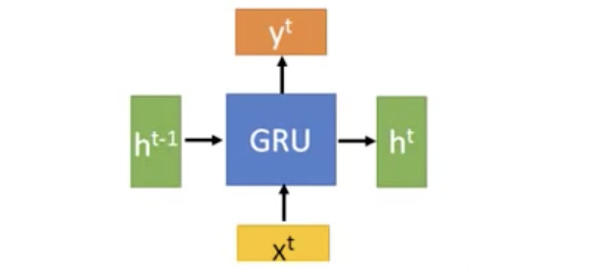
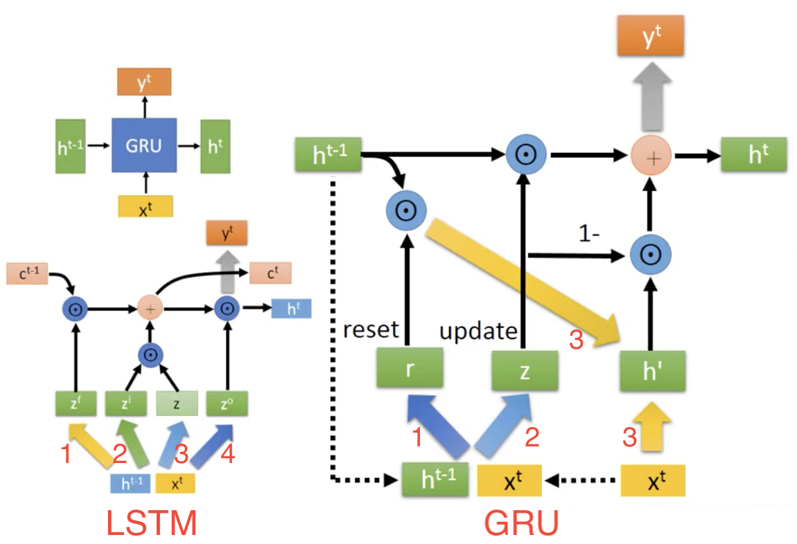

# GRU门控循环单元

* [返回上层目录](../recurrent-neural-network.md)
* [什么是GRU](#什么是GRU)
* [GRU的运作方式](GRU的运作方式)

# 什么是GRU

LSTM的一个稍微更显着的变化是由[Cho](http://arxiv.org/pdf/1406.1078v3.pdf)介绍的门控循环单元（GRU）。 它**将忘记和输入门组合成一个单一的“更新门”**。它还**将单元格状态（memory cell，即$C^t$）和隐藏状态（$h^t$）合并**，并进行了一些其他更改。 所得到的模型比标准LSTM模型更简单，并且越来越受欢迎。

如下图所示，**GRU就是把LSTM的输入门和遗忘门组合在一起**，少了一个门，参数量降了一些，但是性能和LSTM几乎一样。下图的条状物就是参数量，红线就是准确率。

# GRU的运作方式

在看GRU之前，我们先回顾一下LSTM，可见LSTM有两个向量会循环传递，一个是memory cell的$C^t$和隐藏状态$h^t$。其中，$C^t$经历的步骤比较少，变化较慢，后一个和前一个比较像，而$h^t$经历的步骤很多，所以变化较大。

而GRU的框架如下所示，它只传递$h^t$，不再有$C^t$。

那GRU里面的具体结构是什么呢？

我们把上一时刻的$h^{t-1}$和当前的输入$X^t$拼接在一起，这里和LSTM差不多。

然后分别经过两个神经网络，分别得到两个不同的向量$r$和$z$，即`reset gate`和`update gate`。

然后把向量$r$和$h^{t-1}$逐元素相乘，得到的向量结果再和$x^t$进行拼接，然后经过神经网络得到向量$h{'}$。

然后如下图所示，把向量$z$一个人当两个人来用，即同时会用在两个地方。

如果$z$的值接近1，则$h^{t-1}$对$h^t$的影响比较大，$h{'}$对结果的影响比较小，$h^{t-1}$和$h{'}$是互相拮抗的，一个多，另一个就少。

在GRU里，$h^t$的角色比较像LSTM中的$C^t$，不妨再看下LSTM中计算$C^t$的公式，如下图所示，GRU里的update gate（$z$）的角色，就相当于LSTM里遗忘门（$z^f$）的角色。而$1-z$相当于LSTM中的输入门（$z^i$），所以**GRU中的遗忘门和输入门是联动的**。具体就是说，如果有新的信息进来，才会忘掉之前的信息，而如果没有新信息进来，就不会忘记信息；当你忘记信息的时候，就会有新的信息进来，这个逻辑听上去也是颇为合理的。

前面已经讲过，LSTM中$C^t$的变化是慢的，$h^t$的变化是快的。所以，**GRU传递到下一个状态的信息$h^t$，和LSTM中的$C^t$一样，是可以保留得比较久的**。

由下图可见，LSTM的参数有四组，而GRU的参数只有三组，所以GRU的参数量是比LSTM少的。

# 参考资料

* [李宏毅深度学习(2017)](https://www.bilibili.com/video/av9770302?p=25)

本文参考该视频。

===

[GRU神经网络](https://blog.csdn.net/wangyangzhizhou/article/details/77332582)

