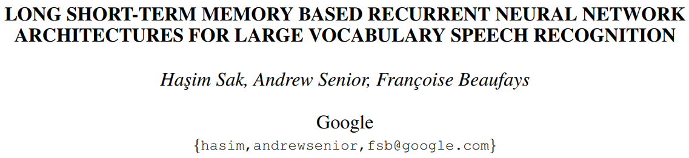
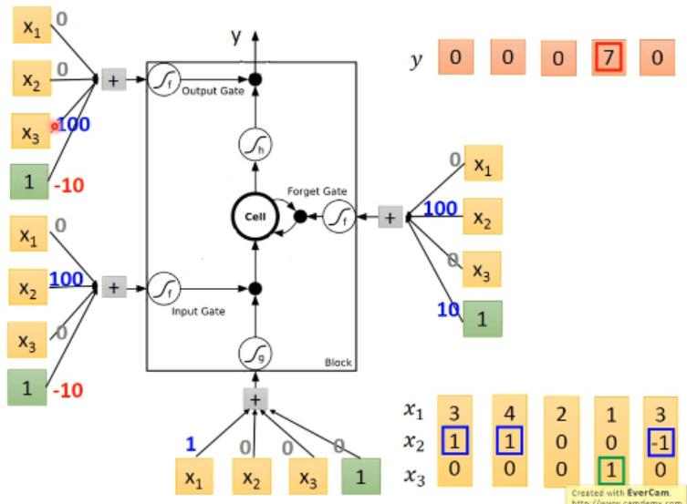
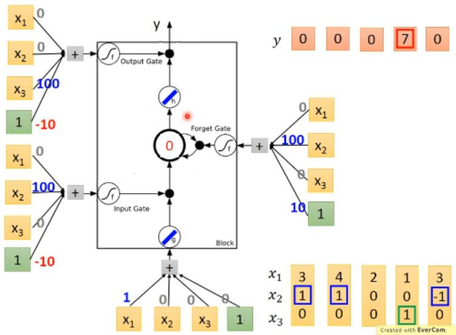
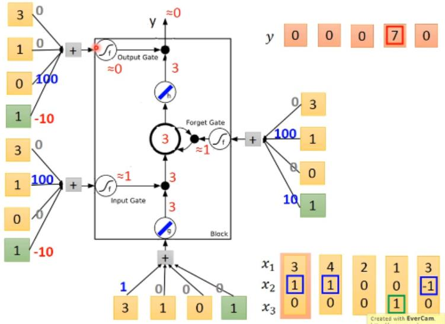
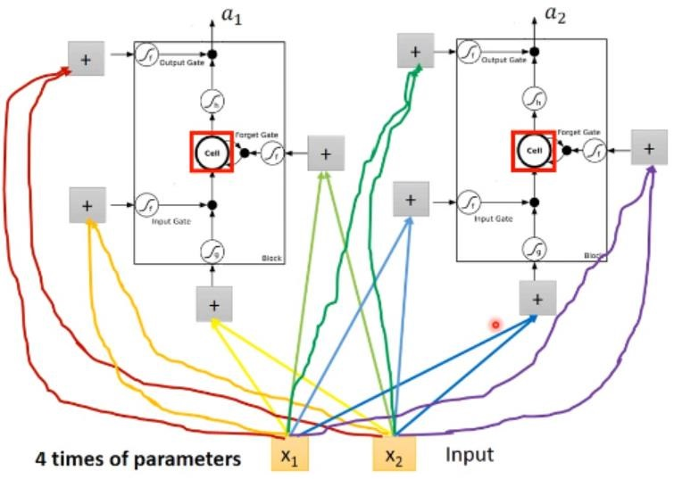
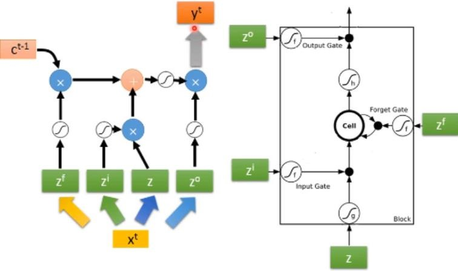
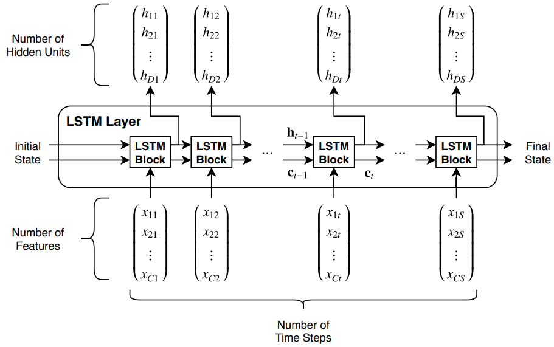

# LSTM长短期记忆网络

* [返回上层目录](../long-short-term-memory-networks.md)
* [LSTM原理介绍](#LSTM原理介绍)
  * [LSTM的结构](#LSTM的结构)
  * [LSTM的流程](#LSTM的流程)
    * [LSTM流程举例](#LSTM流程举例)
  * [将LSTM的cell作为神经元](#将LSTM的cell作为神经元)
  * [为什么LSTM属于RNN](#为什么LSTM属于RNN)
* [LSTM数据流分析](#LSTM数据流分析)
  * [LSTM数据流详细分析](#LSTM数据流详细分析)
  * [LSTM输入输出分析](#LSTM输入输出分析)




paper: [LSTM](https://arxiv.org/pdf/1402.1128v1.pdf)

# LSTM原理介绍

LSTM网络如下图所示，虽然看起来太复杂了，第一次看到的人都是一脸懵逼，这是啥？有用吗？但是原理不难，我们一点点分析。


LSTM的结构是怎么发现的？

> 有幸参加过google的内部训练营，讲师来自发明transformer的团队，他们自己也说，深度学习已经成为了一个工程学问题，搭积木问题。比如讲到LSTM的构造的时候，“我也不懂为什么设计成这样子，但就是有用”。
>
> 重点还是怎么想到设计成这样子的？知乎问题里有回复说：**似乎当时是设计了一千多种类似的结构，实验选出来的**。nn还是缺乏严格的理论支持，关于模型结构的解释，基本都是因为这种结构效果好所以为了解释而解释，就是按照枪眼的位置画靶子。
>
> 来自[深度学习一定程度上脱离了数学吗？](https://www.zhihu.com/question/609230832/answer/3102286500)

## LSTM的结构

前面讲的SimpleRNN只是RNN中最简单的版本，里面的memory是最简单的，可以随时把值写入，也可随时把值读出。但现在常用的memory称为Long Short-term Memory(LSTM)。


这个Long Short-term Memory是比较复杂的，它有3个Gate。

* Input Gate

  当某个网络（外界）的输出值想要写入到LSTM里面的时候，必须先通过一个闸门（Input Gate），并且只有当Input Gate打开的时候，才能把值写入到memory中去，当Input Gate关起来的时候，就无法写入值。至于什么时候把Input Gate打开还是关闭，这是网络自己学到的

* Output Gate

  输出的地方有一个Output Gate，可以决定外界是否可以把值从memory里面读出。只有当Output Gate打开的时候，外界才能读取。同样的，Output Gate什么时候打开还是关闭，也是Output Gate自己学到的。

* Forget Gate

  Forget Gate决定什么时候把过去记得的东西（存在memory中的值）忘掉，什么时候记住过去学的东西。同样的，Output Gate什么时候把存在memory中的值清除掉或者保留下来，也是Forget Gate自己学到的。

整个LSTM单元可以看成有四个Input，一个Output。

> 一个有意思的知识点：**LSTM的名字应该叫下面哪一个呢？**
>
> ```
> Long Short-term Memory
> Long-Short term Memory
> ```
>
> 应该是第一个，因为LSTM和前面讲的SimpleRNN一样，还是个Short-term的Memory，只不过SimpleRNN的Memory每一步都会被清除并更新，它的Short-term是非常Short的。相对的，LSTM的Memory不是每一步都会被更新，可以记得比较长一些，只要Forget Gate不Forget的话，它的Memory里的值就会被存起来，所以是比较长的Short-term Memory，即称之为Long Short-term Memory。

## LSTM的流程

LSTM这个Cell的具体结构和数据流程如下所示。


输入：输入$z$通过激活函数得到$g(z)$，然后乘上输入门的控制信号$z_i$经过激活函数得到的$f(z_i)$，得到$g(z)f(z_i)$。

Memory更新：memory中原有值为$c$，然后乘上遗忘门的控制信号$z_f$经过激活函数得到的$f(z_f)$，得到$cf(z_f)$，即遗忘门对memory中原有数据的处理，**$f(z_f)$为1代表记忆，为0代表遗忘**。然后加上输入值得到新的memory中要存储的值$c'=g(z)f(z_i)+cf(z_f)$。

输出：memory中的值$c'$经过激活函数得到$h(c')$，然后乘上输出门的控制信号$z_o$经过激活函数得到的$f(z_o)$，得到$h(c')f(z_o)$，就是输出了，即输出值$a=h(c')f(z_o)$。

### LSTM流程举例

假设该神经网络只有一个LSTM，如下图所示。再假设该网络的权值已知（权值是学习出来的），然后输入x序列。**三个门的输入值，都是序列x乘上一个权值矩阵得到的结果**。



我们来依次输入x序列，看整个流程是怎么运行的。为了简单起见，假设输入门和输出门的激活函数都是线性的，memory的初始值为0，具体如下图所示。



现在输入x的第一个向量[3, 1, 0]，计算流程如下图所示，具体就不细讲了，图里面的流程非常清楚，memory中的值会从0变为3+1x0=3，最后的输出是0。



接下来，输入x的第二个向量[4, 1, 0]，计算流程如下图所示，memory中的值会从0变为4+1x3=7，由于输出门关闭，最后的输出是0。


接下来，输入x的第三个向量[2, 0, 0]，计算流程如下图所示，memory中的值会从7变为0+1x7=7，由于输出门关闭，最后的输出是0。


接下来，输入x的第四个向量[1, 0, 1]，计算流程如下图所示，memory中的值会从7变为0+1x7=7，最后的输出是7。


接下来，输入x的最后一个向量[3, -1, 0]，计算流程如下图所示，memory中的值会从7变为0+0x7=0，最后的输出是0。


## 将LSTM的cell作为神经元

看到这里，你可能会疑惑，LSTM一个cell的结构我理解了，但是和神经网络有什么关系呢？其实，**直接把神经网络中的神经元替换成LSTM的cell**就可以了。

下图是一般的神经网络和里面的神经元。


然后输入x乘上不同的权值作为LSTM单元的四个输入（输入和三个门）。就好像一般的机器插一个电源线就能运行，但LSTM这个机器需要插四个电压不同的电源线才能跑。所以同样的neuron数目下，LSTM的参数是一般的四倍。



## 为什么LSTM属于RNN

只看上图的话，我们就会很疑惑，这个和RNN的关系是什么呢？怎么看起来不太像RNN。所以要画另外一个图来表示LSTM。


假设有一整排的LSTM单元，里面的memory的标量值按从左到右接起来，就是一个vector，我们把它记作$c^{t-1}$（c是cell单元的意思），作为memory上一刻时间点t-1的值。

现在在时间点t，我们输入一个向量$x^t$，然后乘以一个矩阵变为向量$z$，这个矩阵其实就是全连接神经网络的权值了，z向量中的每一个元素值，就是每一个LSTM的输入，所以向量z的维度就是LSTM的数目。

同样的，给向量$x^t$乘以另一个矩阵，得到向量$z^i$，向量$z^i$的维度就是LSTM的数目，其每一个值就会对应操控每一个LSTM的输入门。

同样的，给向量$x^t$乘以另一个矩阵，得到向量$z^f$，$z^f$中的每一个值会去操控每一个LSTM的遗忘门。

同样的，给向量$x^t$乘以另一个矩阵，得到向量$z^o$，$z^o$中的每一个值会去操控每一个LSTM的输出门。

这四个vector合起来就会操控这些LSTM单元的运作。

接下来，我们**向量化的并行**看一下LSTM单元的运作，不再去分开单独看。注意里面的乘号是逐元素运算。



然后里面相加后的向量$c^t$就是时刻t的memory中的值，然后如此反复下去，就会形成循环，那不就是RNN了吗。


虽然上图已经很复杂了，但这并不是LSTM的最终形态，真正的LSTM怎么做呢？

还会把隐藏层的值（即LSTM单元的输出值，但在整个神经网络上它的位置属于隐藏层）也加到输入，还会把memory单元中的值也加到输入中。即在操纵LSTM的时候，输入向量是由$x^t$、$h^t$和$c^t$组成的（注：这只是个变种，原始的LSTM输入向量只有$x^t$和$h^t$），然后再分别乘以四个矩阵作为四个门的输入或操纵信号。


上图只是LSTM只有一层的情况，但通常LSTM不会只有一层，再叠加个五六层才是我们要的样子。


每一次看到这个东西的人，它的反应都是这个样子：


每一个人第一次都看到这个图，都在想这应该是不work的吧，但其实它确实是work的。现在说自己在用RNN的时候，其实都是在用LSTM了，用Keras的时候，这些都帮你是写好的，你只要输入LSTM四个字就好了。GRU是LSTM的稍微简化版本，只有两个gate，但据说少了一个gate，但表现和LSTM差不多，所以少了三分之一的参数，比较不容易过拟合。所以，我们之前讲的那种最简单的RNN，要称其为SimpleRNN才行，即RNN包含了LSTM、GRU和SimpleRNN。

# LSTM数据流分析

## LSTM数据流详细分析

很多分析都没有细节分析，看了之后依然对细节不甚清楚。下图以一组数据为例详细进行了数据流分析，可点开看大图。


## LSTM输入输出分析



# 参考资料

* [李宏毅教授讲解 RNN LSTM的视频](http://speech.ee.ntu.edu.tw/~tlkagk/courses/ML_2017/Lecture/RNN1.mp4)

本文参考了此视频。

===

[完全图解RNN、RNN变体、Seq2Seq、Attention机制](https://zhuanlan.zhihu.com/p/28054589)

[Understanding LSTM Networks](https://colah.github.io/posts/2015-08-Understanding-LSTMs/)

[Understanding LSTM Networks翻译：如何简单的理解LSTM——其实没有那么复杂](https://www.jianshu.com/p/4b4701beba92)

[谁能用比较通俗有趣的语言解释RNN和LSTM？](https://www.zhihu.com/question/314002073)


[TensorFlow学习之LSTM --- 预测sin函数](https://blog.csdn.net/m0_38007695/article/details/84640702)

使用tf1.x，简单清晰，但是使用的是tf内建的lstm

[理解 LSTM 网络](https://www.jianshu.com/p/9dc9f41f0b29)

讲的估计挺好，里面提到了有一种变体就是输入把c也加进去了。这下解决了我对于输入加不加c的疑惑。

[Salon-sai：Tensorflow[基础篇]——LSTM的理解与实现](https://www.jianshu.com/p/b6130685d855)

[Salon-sai/learning-tensorflow/lstm](https://github.com/Salon-sai/learning-tensorflow/blob/master/lesson4/lstm_model.py)

[tensorflow/examples/courses/udacity_deep_learning/6_lstm.ipynb](https://github.com/tensorflow/examples/blob/master/courses/udacity_deep_learning/6_lstm.ipynb)

这里有人仿真tensorflow官网的例子，用tf1.x实现了lstm，手写实现lstm，没用tf内建的lstm。

[LiveCoding如何用TensorFlow2.x手写LSTM底层算法](https://www.bilibili.com/video/av415146151)


[Pytorch LSTM模型 参数详解](https://blog.csdn.net/weixin_53146190/article/details/120341669)

[tf.nn.dynamic_rnn 详解](https://zhuanlan.zhihu.com/p/43041436)

