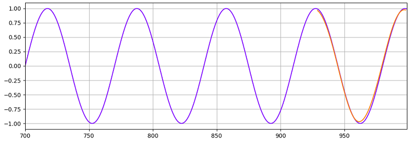
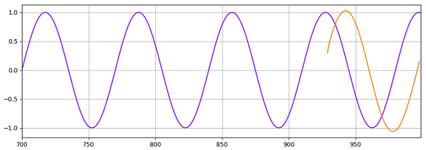
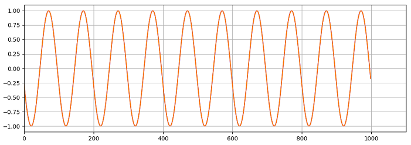

# Pytorch的LSTM源码分析

* [返回上层目录](../long-short-term-memory-networks.md)


官方API：[torch.nn.LSTM](https://pytorch.org/docs/stable/nn.html#torch.nn.LSTM)


# 基于PyTorch的LSTM例子

## 预测Sin函数

```python
# 【PyTorch修炼】用pytorch写一个经常用来测试时序模型的简单常规套路（LSTM多步迭代预测）
# https://zhuanlan.zhihu.com/p/450869349
import numpy as np
import pandas as pd
import matplotlib.pyplot as plt
import torch
import torch.nn as nn

x = torch.linspace(0, 999, 1000)
y = torch.sin(x*2*3.1415926/70)

# plt.xlim(-5, 1005)
# plt.xlabel('x')
# plt.ylabel('sin(x)')
# plt.title("sin")
# plt.plot(y.numpy(), color='#800080')
# plt.show()


# len(test):50
train_y = y[:-70]
test_y = y[-70:]


# 滑窗创建数据集
def create_data_seq(seq, time_window):
    out = []
    l = len(seq)
    for i in range(l-time_window):
        x_tw = seq[i:i+time_window]
        y_label = seq[i+time_window:i+time_window+1]
        out.append((x_tw, y_label))
    return out
time_window = 60
train_data = create_data_seq(train_y, time_window)


class MyLstm(nn.Module):
    def __init__(self, input_size=1, hidden_size=128, out_size=1):
        super(MyLstm, self).__init__()
        self.hidden_size = hidden_size

        # batch_first：是否将批量大小作为输入和输出数据的第一维，默认为False，此时数据的形状为(seq_len, batch, input_size)。
        self.lstm = nn.LSTM(input_size=input_size, hidden_size=self.hidden_size, num_layers=1, bidirectional=False)

        self.linear = nn.Linear(in_features=self.hidden_size, out_features=out_size, bias=True)
        # h_0和c_0：可选的初始隐藏状态和细胞状态，形状分别为(num_layers, batch, hidden_size)。如果不提供，它们将初始化为零。
        self.hidden_state = (torch.zeros(1, 1, self.hidden_size), torch.zeros(1, 1, self.hidden_size))  # (h0, c0)

    def forward(self, x):
        # 在LSTM中，输入数据通常需要是三维的：
        # 第一维是序列长度（seq_len），即每个样本中的元素数量。
        # 第二维是批大小（batch_size），即一次处理的样本数量。在很多情况下，当你处理单个序列时，批大小为1。
        # 第三维是特征数量（input_size），即每个时间步内的特征维度。

        # output, (h_n, c_n) = lstm(input, (h_0, c_0))
        # input：输入数据，形状为(seq_len, batch, input_size)或(batch, seq_len, input_size)（如果batch_first=True）。
        # h_0和c_0：可选的初始隐藏状态和细胞状态，形状分别为(num_layers, batch, hidden_size)。如果不提供，它们将初始化为零。
        # output：LSTM层的输出，形状为(seq_len, batch, num_directions * hidden_size)或(batch, seq_len, num_directions * hidden_size)
        # （如果batch_first=True）。num_directions是2如果LSTM是双向的，否则是1。
        out, self.hidden_state = self.lstm(x.view(len(x), 1, -1), self.hidden_state)
        # out.shape = torch.Size([60, 1, 128])

        # pred = self.linear(out.view(len(x), -1))
        # # out.view(len(x), -1).shape = torch.Size([60, 128])
        # # pread.shape =  torch.Size([60, 1])
        # print("pred[-1] = ", pred[-1])
        # return pred[-1]

        pred = self.linear(out.view(len(x), -1)[-1])
        # out.view(len(x), -1).shape = torch.Size([60, 128])
        # pread.shape =  torch.Size([60, 1])
        # print("pred = ", pred)
        return pred


learning_rate = 0.00001
epoch = 10
multi_step = 70

model = MyLstm()
mse_loss = nn.MSELoss()
optimizer = torch.optim.Adam(model.parameters(), lr=learning_rate, betas=(0.5, 0.999))
# optimizer = torch.optim.SGD(model.parameters(), lr=learning_rate)

device = torch.device("cuda:0" if torch.cuda.is_available() else "cpu")
print(device)
model.to(device)

for i in range(epoch):
    for x_seq, y_label in train_data:
        x_seq = x_seq.to(device)
        y_label = y_label.to(device)
        model.hidden_state = (torch.zeros(1, 1, model.hidden_size).to(device),
                              torch.zeros(1, 1, model.hidden_size).to(device))
        pred = model(x_seq)
        loss = mse_loss(y_label, pred)
        optimizer.zero_grad()
        loss.backward()
        optimizer.step()
    print(f"Epoch {i} Loss: {loss.item()}")
    preds = []
    labels = []
    preds = train_y[-time_window:].tolist()
    for j in range(multi_step):
        test_seq = torch.FloatTensor(preds[-time_window:]).to(device)
        with torch.no_grad():
            model.hidden_state = (torch.zeros(1, 1, model.hidden_size).to(device),
                                  torch.zeros(1, 1, model.hidden_size).to(device))
            preds.append(model(test_seq).item())
    loss = mse_loss(torch.tensor(preds[-multi_step:]), torch.tensor(test_y))
    print(f"Performance on test range: {loss}")

    plt.figure(figsize=(12, 4))
    plt.xlim(700, 999)
    plt.grid(True)
    plt.plot(y.numpy(), color='#8000ff')
    plt.plot(range(999 - multi_step, 999), preds[-multi_step:], color='#ff8000')
    plt.show()
```

预测结果：



## 单步预测LSTM

> pytorch中，常规的lstm是输入一个序列，然后预测下一帧的值，但是现在每一步只能获取序列的当前帧，即每一步给lstm的输入不是一个序列，而是序列中的当前帧，该怎么写lstm？

如果你在每一步只能获取序列的当前帧，而不是整个序列，那么你可以使用LSTM进行单步预测。在这种情况下，你需要在每个时间步更新LSTM的状态，并使用当前帧作为输入。以下是如何实现这一点的步骤：

> 1. **初始化LSTM模型**：定义一个LSTM模型，其中`input_size`是每个时间步的输入特征数，`hidden_size`是LSTM单元的特征数。
> 2. **初始化隐藏状态**：在序列开始时初始化隐藏状态和细胞状态。
> 3. **单步更新**：在每个时间步，使用当前帧更新LSTM的状态，并获取预测结果。

### 单步预测的简单模型模板

下面是一个简单的示例代码：

```python
import torch
import torch.nn as nn


# 定义LSTM模型
class SingleStepLSTM(nn.Module):
    def __init__(self, batch_size, input_size, hidden_size, output_size):
        super(SingleStepLSTM, self).__init__()

        self.lstm = nn.LSTM(
            input_size=input_size,
            hidden_size=hidden_size,
            num_layers=1,
            batch_first=False,  # False: (seq, batch, feature)
            bidirectional=False)

        self.linear = nn.Linear(
            in_features=hidden_size,
            out_features=output_size,
            bias=True)

        self.hidden_state = (
            torch.zeros(1, batch_size, hidden_size),  # hidden state (output)
            torch.zeros(1, batch_size, hidden_size))  # cell state
        # h_0和c_0：可选的初始隐藏状态和细胞状态，形状分别为(num_layers, batch, hidden_size)。如果不提供，它们将初始化为零。

    def forward(self, x):
        # LSTM前向传播
        self.hidden_state = (self.hidden_state[0].detach(), self.hidden_state[1].detach())  # 去掉梯度信息，因为这里是单步预测

        lstm_out, self.hidden_state = self.lstm(x, self.hidden_state)
        # lstm_out: (seq, batch, num_directions * hidden_size)

        # 获取最后一个时间步的输出
        linear_input = lstm_out[-1]

        # 通过线性层获取预测结果
        output = self.linear(linear_input)
        return output


# 初始化模型
batch_size = 2
input_size = 3  # 每个时间步的输入特征数
hidden_size = 4  # LSTM单元的特征数
output_size = 1  # 预测结果的特征数
model = SingleStepLSTM(batch_size, input_size, hidden_size, output_size)

# 假设我们正在处理一个序列
sequence = torch.randn(100, batch_size, input_size)  # (seq, batch, feature)

# 在每个时间步进行预测
predictions = []
for t in range(2):
    # 获取当前时间步的输入
    current_input = sequence[t:t+1, :, :]
    # 前向传播
    prediction = model(current_input)
    predictions.append(prediction)

# 将预测结果拼接起来
predictions = torch.cat(predictions, dim=1)
```

### 单步预测sin函数1

所谓单步预测，就是每次只输入一个单词，而不是一次性输入完整的句子。在单步情况下，一个完整的句子（长度为n）需要n次输入。

```python
# 【PyTorch修炼】用pytorch写一个经常用来测试时序模型的简单常规套路（LSTM多步迭代预测）
# https://zhuanlan.zhihu.com/p/450869349
import numpy as np
import pandas as pd
import matplotlib.pyplot as plt
import torch
import torch.nn as nn

x = torch.linspace(0, 999, 1000)
y = torch.sin(x*2*3.1415926/70)

# plt.xlim(-5, 1005)
# plt.xlabel('x')
# plt.ylabel('sin(x)')
# plt.title("sin")
# plt.plot(y.numpy(), color='#800080')
# plt.show()

# len(test):50
train_y = y[:-70]
test_y = y[-70:]


# 滑窗创建数据集
def create_data_seq(seq, time_window):
    out = []
    l = len(seq)
    for i in range(l-time_window):
        x_tw = seq[i:i+time_window]
        y_label = seq[i+time_window:i+time_window+1]
        out.append((x_tw, y_label))
    return out
time_window = 1  # 每次输入的单词长度为1
train_data = create_data_seq(train_y, time_window)

print(f"{train_data=}")

class MyLstm(nn.Module):
    def __init__(self, input_size=1, hidden_size=128, out_size=1):
        super(MyLstm, self).__init__()
        self.hidden_size = hidden_size

        # batch_first：是否将批量大小作为输入和输出数据的第一维，默认为False，此时数据的形状为(seq_len, batch, input_size)。
        self.lstm = nn.LSTM(input_size=input_size, hidden_size=self.hidden_size, num_layers=1, bidirectional=False)

        self.linear = nn.Linear(in_features=self.hidden_size, out_features=out_size, bias=True)
        self.hidden_state = (torch.zeros(1, 1, self.hidden_size), torch.zeros(1, 1, self.hidden_size))

    def forward(self, x):
        # 在LSTM中，输入数据通常需要是三维的：
        # 第一维是序列长度（seq_len），即每个样本中的元素数量。
        # 第二维是批大小（batch_size），即一次处理的样本数量。在很多情况下，当你处理单个序列时，批大小为1。
        # 第三维是特征数量（input_size），即每个时间步内的特征维度。

        # output, (h_n, c_n) = lstm(input, (h_0, c_0))
        # input：输入数据，形状为(seq_len, batch, input_size)或(batch, seq_len, input_size)（如果batch_first=True）。
        # h_0和c_0：可选的初始隐藏状态和细胞状态，形状分别为(num_layers, batch, hidden_size)。如果不提供，它们将初始化为零。
        # output：LSTM层的输出，形状为(seq_len, batch, num_directions * hidden_size)或(batch, seq_len, num_directions * hidden_size)
        # （如果batch_first=True）。num_directions是2如果LSTM是双向的，否则是1。
        out, self.hidden_state = self.lstm(x.view(len(x), 1, -1), self.hidden_state)
        # out.shape = torch.Size([60, 1, 128])

        # pred = self.linear(out.view(len(x), -1))
        # # out.view(len(x), -1).shape = torch.Size([60, 128])
        # # pread.shape =  torch.Size([60, 1])
        # print("pred[-1] = ", pred[-1])
        # return pred[-1]

        pred = self.linear(out.view(len(x), -1)[-1])
        # out.view(len(x), -1).shape = torch.Size([60, 128])
        # pread.shape =  torch.Size([60, 1])
        # print("pred = ", pred)
        return pred


learning_rate = 0.00001
epoch = 100
multi_step = 70

model = MyLstm()
mse_loss = nn.MSELoss()
optimizer = torch.optim.Adam(model.parameters(), lr=learning_rate, betas=(0.5, 0.999))
# optimizer = torch.optim.SGD(model.parameters(), lr=learning_rate)

device = torch.device("cuda:0" if torch.cuda.is_available() else "cpu")

model.to(device)

for i in range(epoch):
    model.hidden_state = (torch.zeros(1, 1, model.hidden_size).to(device),
                          torch.zeros(1, 1, model.hidden_size).to(device))
    for x_seq, y_label in train_data:
        x_seq = x_seq.to(device)
        y_label = y_label.to(device)
        # model.hidden_state = (torch.zeros(1, 1, model.hidden_size).to(device),
        #                       torch.zeros(1, 1, model.hidden_size).to(device))
        model.hidden_state[0].detach_()
        model.hidden_state[1].detach_()
        # print("x_seq = ", x_seq)
        pred = model(x_seq)
        # print("pred = ", pred)
        # print("y_label = ", y_label)
        loss = mse_loss(y_label, pred)
        optimizer.zero_grad()
        loss.backward()
        optimizer.step()
    print(f"Epoch {i} Loss: {loss.item()}")
    preds = []
    labels = []
    preds = train_y[-time_window:].tolist()
    model.hidden_state = (torch.zeros(1, 1, model.hidden_size).to(device),
                          torch.zeros(1, 1, model.hidden_size).to(device))
    for j in range(multi_step):
        test_seq = torch.FloatTensor(preds[-time_window:]).to(device)
        with torch.no_grad():
            # model.hidden_state = (torch.zeros(1, 1, model.hidden_size).to(device),
            #                       torch.zeros(1, 1, model.hidden_size).to(device))
            preds.append(model(test_seq).item())
    loss = mse_loss(torch.tensor(preds[-multi_step:]), torch.tensor(test_y))
    print(f"Performance on test range: {loss}")

    plt.figure(figsize=(12, 4))
    plt.xlim(700, 999)
    plt.grid(True)
    plt.plot(y.numpy(), color='#8000ff')
    plt.plot(range(999 - multi_step, 999), preds[-multi_step:], color='#ff8000')
    plt.show()
```

训练结果：



分析：

训练明显变慢了， 需要训练三四十次才能达到多步预测十次的程度。而且，显然也和实际真值不相符了，但是还是有个sin的形状。

所以，单步预测会导致训练变慢，预测不准，但是也还有一些效果。

### 单步预测sin函数2

```python
import numpy as np
import torch
import torch.nn as nn
import matplotlib.pyplot as plt
import math
import random


# 定义LSTM模型
class SingleStepLSTM(nn.Module):
    def __init__(self, batch_size, input_size, hidden_size, num_layers, output_size, device):
        super(SingleStepLSTM, self).__init__()

        self.lstm = nn.LSTM(
            input_size=input_size,
            hidden_size=hidden_size,
            num_layers=num_layers,
            batch_first=False,  # False: (seq, batch, feature)
            bidirectional=False)

        self.linear = nn.Linear(
            in_features=hidden_size,
            out_features=output_size,
            bias=True)

        self.hidden_state = (
            torch.zeros(num_layers, batch_size, hidden_size).to(device),  # hidden state (output)
            torch.zeros(num_layers, batch_size, hidden_size).to(device))  # cell state
        # h_0和c_0：可选的初始隐藏状态和细胞状态，形状分别为(num_layers, batch, hidden_size)。如果不提供，它们将初始化为零。

    def zero_hidden_state(self):
        self.hidden_state[0].zero_()  # 将张量清零
        self.hidden_state[1].zero_()  # 将张量清零

    def forward(self, x):
        # LSTM前向传播
        # self.hidden_state = (self.hidden_state[0].detach(), self.hidden_state[1].detach())  # 去掉梯度信息，因为这里是单步预测
        self.hidden_state[0].detach_()
        self.hidden_state[1].detach_()

        # output, (h_n, c_n) = lstm(input, (h_0, c_0))
        lstm_out, self.hidden_state = self.lstm(x, self.hidden_state)
        # input：(seq, batch, input_size)或(batch, seq_len, input_size)（如果batch_first=True）。
        # lstm_out: (seq, batch, num_directions * hidden_size)

        # 获取最后一个时间步的输出
        linear_input = lstm_out[-1]

        # 通过线性层获取预测结果
        output = self.linear(linear_input)
        return output


def gen_batch_data(seq_length, batch_size, input_size, output_size):  # input_size: 单步输入的特征数，即embedding size
    # 假设我们正在处理一个序列
    # sequence = torch.randn(100, batch_size, input_size)  # (seq, batch, feature)
    def get_single_data(seq_lengt, input_size, output_size):
        x = torch.linspace(0, seq_length - 1, seq_length)

        def gen_sin_curve(x):
            sin_curve = torch.sin((x / len(x) * 2 * math.pi + random.uniform(0, 2 * math.pi)) * 10)
            return sin_curve

        def gen_single_feature_label(seq, input_size, output_size):
            feature = []
            label = []
            for i in range(0, len(seq) - input_size):
                feature.append(seq[i: i+input_size])
                label.append(seq[i+input_size: i+input_size+1])
            feature = torch.cat(feature, dim=0).view(len(seq)-input_size, 1, input_size)  # (seq, batch=1, feature)
            label = torch.cat(label, dim=0).view(len(seq)-input_size, 1, output_size)  # (seq, batch=1, output_size)
            return feature, label

        sin_curve = gen_sin_curve(x)
        data_feature, data_label = gen_single_feature_label(sin_curve, input_size, output_size)
        return data_feature, data_label

    data_feature_batch = []
    data_label_batch = []
    for i in range(batch_size):
        data_feature, data_label = get_single_data(seq_length, input_size, output_size)
        data_feature_batch.append(data_feature)
        data_label_batch.append(data_label)

    data_feature_batch = torch.cat(data_feature_batch, dim=1)  # (seq, batch, feature)
    data_label_batch = torch.cat(data_label_batch, dim=1)  # (seq, batch, 1)
    # print("data_feature_batch = ", data_feature_batch)
    # print("data_label_batch = ", data_label_batch)

    return data_feature_batch, data_label_batch


def train(model_args, train_data, test_data):
    device = torch.device("cuda:0" if torch.cuda.is_available() else "cpu")

    # 模型
    model = SingleStepLSTM(
        batch_size=model_args['batch_size'],
        input_size=model_args['input_size'],
        hidden_size=model_args['hidden_size'],
        num_layers=model_args['num_layers'],
        output_size=model_args['output_size'],
        device=device)
    model.to(device)

    # 损失函数
    mse_loss = nn.MSELoss()

    # 优化器
    learning_rate = 0.00001
    learning_rate = 0.001
    optimizer = torch.optim.Adam(model.parameters(), lr=learning_rate, betas=(0.5, 0.999))

    # 训练
    epoch = 10
    for i in range(epoch):
        model.zero_hidden_state()
        for seq_feature, label in zip(train_data[0], train_data[1]):  # train_data = (data_feature_batch[:-2], data_label_batch[:-2])
            # 训练数据
            seq_feature = seq_feature.view(1, len(seq_feature), -1).to(device)  # (batch, input_size) -> (seq=1, batch, input_size)
            label = label.to(device)  # (batch, output_size)
            # 预测
            pred = model(seq_feature)
            # 求损失
            loss = mse_loss(label, pred)
            # 更新模型权值的梯度
            optimizer.zero_grad()
            loss.backward()
            optimizer.step()
        print(f"Epoch {i} Loss: {loss.item()}")

        # test
        test_preds = []
        test_label = []  # [..., [[-0.2846], [-0.3436]] ,...]
        model.zero_hidden_state()
        # 先从训练数据开始算起，这是为了在测试数据开始处算好hidden_state
        for seq_feature, label in zip(train_data[0], train_data[1]):
            seq_feature = seq_feature.view(1, len(seq_feature), -1).to(device)  # (batch, input_size) -> (seq=1, batch, input_size)
            with torch.no_grad():
                test_preds.append(model(seq_feature).tolist())  # (batch, output_size)
            test_label.append(label.tolist())
        # 然后从测试数据接着算
        for seq_feature, label in zip(test_data[0], test_data[1]):
            seq_feature = seq_feature.view(1, len(seq_feature), -1).to(device)  # (batch, input_size) -> (seq=1, batch, input_size)
            with torch.no_grad():
                test_preds.append(model(seq_feature).tolist())  #
            test_label.append(label.tolist())
        loss = mse_loss(torch.tensor(test_preds), torch.tensor(test_label))
        print(f"Performance on test range: {loss}")

        test_label = np.array(test_label)[:, 0, 0]
        test_preds = np.array(test_preds)[:, 0, 0]
        plt.figure(figsize=(12, 4))
        plt.xlim(0, 1100)
        plt.grid(True)
        plt.plot(test_label, color='#8000ff')
        plt.plot(test_preds, color='#ff8000')
        plt.show()

    exit()

if __name__ == '__main__':
    batch_size = 100
    input_size = 1  # 每个时间步的输入特征数，即word embedding size
    output_size = 1  # 预测结果的维度

    model_args = {}
    model_args['batch_size'] = batch_size
    model_args['input_size'] = input_size  # 每个时间步的输入特征数，即word embedding size
    model_args['hidden_size'] = 128  # LSTM单元的特征数
    model_args['num_layers'] = 1  # LSTM层数
    model_args['output_size'] = 1  # 预测结果的维度

    data_feature_batch, data_label_batch = gen_batch_data(seq_length=1000, batch_size=batch_size, input_size=input_size, output_size=output_size)

    test_data_len = 300
    train_data = (data_feature_batch[:-test_data_len], data_label_batch[:-test_data_len])  # -70
    test_data = (data_feature_batch[-test_data_len:], data_label_batch[-test_data_len:])

    print("data_feature_batch.shape = ", data_feature_batch.shape)

    # print("train_data = ", train_data)
    print("train_data[0].shape = ", train_data[0].shape)
    print("train_data[1].shape = ", train_data[1].shape)

    # print("test_data = ", test_data)
    print("test_data[0].shape = ", test_data[0].shape)
    print("test_data[1].shape = ", test_data[1].shape)

    train(model_args=model_args, train_data=train_data, test_data=test_data)
```




# 111

[lstm pytorch梳理之 batch_first 参数 和torch.nn.utils.rnn.pack_padded_sequence](https://www.cnblogs.com/yuqinyuqin/p/14100967.html)

[5. 可变序列使用pack_padded_sequence, pad_packed_sequence](https://www.jianshu.com/p/46e68eb265f9)

## 可变长序列的pad和pack的使用

```python
import torch
from torch.nn.utils.rnn import pad_sequence, pack_padded_sequence, pad_packed_sequence

# 假设有几个变长的序列
sequences = [torch.tensor([1, 2, 3], dtype=torch.float),
             torch.tensor([4, 5], dtype=torch.float),
             torch.tensor([6], dtype=torch.float)]
# [tensor([1., 2., 3.]), tensor([4., 5.]), tensor([6.])]

# Padding
padded_sequences = pad_sequence(sequences, batch_first=True).unsqueeze(-1)  # 增加维度
# 不增加维度
# tensor([[1., 2., 3.],
#         [4., 5., 0.],
#         [6., 0., 0.]])
# 增加维度后
# tensor([[[1.], [2.], [3.]],
#         [[4.], [5.], [0.]],
#         [[6.], [0.], [0.]]])

# 获取原始长度
lengths = torch.tensor([len(seq) for seq in sequences])
# tensor([3, 2, 1])

# Packing
packed_input = pack_padded_sequence(padded_sequences, lengths, batch_first=True, enforce_sorted=False)
# PackedSequence(data=tensor([
# [1.], [4.], [6.],
# [2.], [5.],
# [3.]]), batch_sizes=tensor([3, 2, 1]), sorted_indices=tensor([0, 1, 2]), unsorted_indices=tensor([0, 1, 2]))

# 将packed_input传入LSTM
lstm = torch.nn.LSTM(input_size=1, hidden_size=2, batch_first=True)
hidden_state = (torch.zeros(1, 3, 2), torch.zeros(1, 3, 2))  # 这里需要确保batch_size为3
output, (hn, cn) = lstm(packed_input, hidden_state)
# print(hn, cn)
# tensor([num_layers, batch_size, hidden_size])
# (tensor([[[-0.0811, -0.0972], [-0.0113, -0.1555], [-0.0014, -0.0870]]], grad_fn=<IndexSelectBackward0>),
#  tensor([[[-0.3840, -0.2644], [-0.1388, -1.0487], [-0.0323, -0.6705]]], grad_fn=<IndexSelectBackward0>))
#
# print(output)
# PackedSequence(data=tensor([
#   [-0.0844,  0.1342], [-0.0125, -0.1450], [-0.0014, -0.0870],
#   [-0.1024,  0.0706], [-0.0113, -0.1555],
#   [-0.0811, -0.0972]],
# grad_fn=<CatBackward0>),
# batch_sizes=tensor([3, 2, 1]),
# sorted_indices=tensor([0, 1, 2]),
# unsorted_indices=tensor([0, 1, 2]))

# 如果需要，将输出解压缩
output1, _ = pad_packed_sequence(output, batch_first=True)
# tensor([[[-0.0844,  0.1342], [-0.1024,  0.0706], [-0.0811, -0.0972]],
#         [[-0.0125, -0.1450], [-0.0113, -0.1555], [ 0.0000,  0.0000]],
#         [[-0.0014, -0.0870], [ 0.0000,  0.0000], [ 0.0000,  0.0000]]], grad_fn=<IndexSelectBackward0>)

# 切片操作以去掉填充的零
# 如果你希望解压缩后的输出不包含任何填充的零，可以在使用pad_packed_sequence之后，手动根据原始序列的长度进行切片操作。这样可以确保只保留实际有效的输出部分。
output = [output1[i, :lengths[i]] for i in range(len(lengths))]
for i, out in enumerate(output):
    print(f"Output for sequence {i}: {out}")

# Output for sequence 0: tensor([[-0.0844,  0.1342], [-0.1024,  0.0706], [-0.0811, -0.0972]], grad_fn=<SelectBackward0>)
# Output for sequence 1: tensor([[-0.0125, -0.1450], [-0.0113, -0.1555]], grad_fn=<SliceBackward0>)
# Output for sequence 2: tensor([[-0.0014, -0.0870]], grad_fn=<SliceBackward0>)
```

## 为什么pytorch的lstm中四个门的神经网络深度只有一层

一句话解释：为了简单，避免梯度消失。比起加深四个门的神经网络深度，使用多层的lstm效果更好。

- 为什么pytorch的lstm的具体实现中，每个门的神经网络深度只有一层呢？

> 在PyTorch的LSTM实现中，每个门的神经网络通常只有一层是因为这样可以减少计算复杂性和参数数量。每个门（输入门、遗忘门、输出门）主要通过一个简单的线性变换和非线性激活函数（如tanh或sigmoid）来处理输入和隐藏状态。这样的设计足以捕捉序列数据中的时序特征，并且训练和推理的效率较高。
>
> 此外，如果需要更复杂的特征表示，可以通过堆叠多个LSTM层来增加网络的深度，而不是在每个门中增加层数。这样的设计使得模型既灵活又高效。


- 我还是不明白，为什么不能在lstm的每个门中增加层数呢？我觉得增加层数可以提升性能啊，因为只有一层深度的神经网络的性能可能比较差

> 你提出的观点是合理的，增加网络的深度确实可以提升性能，特别是在复杂任务中。然而，在LSTM的设计中，每个门使用一层神经网络有几个原因：
>
> 1. **计算效率**：增加层数会显著增加计算开销。LSTM本身就是为处理序列数据而设计的，深度会影响训练和推理的速度。
> 2. **梯度消失/爆炸**：LSTM的设计本身就旨在缓解梯度消失的问题。如果在每个门中增加深度，可能会使得这个问题更复杂，尤其是在长序列的情况下。
> 3. **功能复用**：LSTM通过门控机制（输入门、遗忘门、输出门）有效地控制信息流。如果每个门都有多层，可能会导致信息处理过于复杂，反而影响其简单而有效的设计。
> 4. **堆叠层次**：通常情况下，为了提高模型的表达能力，可以通过堆叠多个LSTM层来实现。这种结构不仅能增加模型的深度，还能保持每个门的简单性和高效性。
>
> 总之，虽然增加层数可能会提升模型性能，但在LSTM的设计中，采用单层结构是为了在效率、稳定性和可解释性之间达到一个好的平衡。如果需要更复杂的特征学习，可以考虑使用多层堆叠的LSTM。


- 为什么堆叠多个LSTM层来增加网络的深度的效果，要好于在每个门中增加层数呢？

> 堆叠多个LSTM层通常被认为优于在每个门中增加层数的原因有几个：
>
> 1. **信息流动**：堆叠多个LSTM层可以让每一层捕捉到不同层次的特征表示。较低层可以学习更简单的模式（例如局部时间依赖），而较高层可以捕捉更复杂的模式（例如长时间依赖）。这种层次化的学习有助于提升模型的性能。
> 2. **避免过拟合**：在每个门中增加层数可能导致过拟合，因为每个门的参数会显著增加。相对而言，堆叠LSTM层的参数相对更可控，因为每层都在共享信息和功能。
> 3. **梯度稳定性**：LSTM设计用于减少梯度消失的问题。增加每个门的层数可能会增加梯度的传播路径，反而可能引入新的梯度消失或爆炸问题。堆叠LSTM层可以通过短路连接来保持梯度的稳定性。
> 4. **模型复杂性**：堆叠LSTM层能以更自然的方式增加模型的复杂性，同时保持每个门的简洁性和高效性。每个LSTM层的输出都可以作为下一层的输入，使得模型更具可解释性。
> 5. **训练效率**：在每个门中增加层数会增加计算复杂度，导致训练效率降低。堆叠LSTM层则可以通过并行计算和优化实现更高效的训练。
>
> 通过这些设计考虑，堆叠多个LSTM层通常能更有效地捕捉复杂的序列特征，同时保持模型的稳定性和效率。

> 堆叠多个LSTM层优于在每个门中增加层数，主要原因如下：
>
> 1. **信息流动性**：堆叠的LSTM层可以让每一层学习到不同层次的特征，第一层捕捉低级特征，后续层可以捕捉更复杂的模式。这种逐层处理有助于信息的有效传递。
> 2. **可控性**：每层的门控机制保持简单，有助于避免信息处理的复杂性，防止梯度消失或爆炸。每个门都有明确的角色，便于优化和调试。
> 3. **参数共享**：在堆叠层中，每层的结构相似，但可以独立学习不同的特征，这样既利用了参数的共享，又保持了灵活性。
> 4. **并行处理**：每层LSTM可以并行计算，使得训练和推理更高效。而如果在每个门中增加层数，可能会导致计算依赖性增加，降低效率。
> 5. **可解释性**：堆叠的层次结构使得模型的行为更加可解释，便于理解每层的功能和作用。
>
> 综合而言，堆叠LSTM层能够在复杂性和性能之间找到更好的平衡，使模型在处理序列数据时表现更佳。你对这个话题还有其他想了解的吗？


- 你只解释了堆叠多个LSTM层来增加网络的深度的效果好，但是并没有说明为什么会比在每个门中增加层数的效果好啊

> 你说得对，下面我来详细说明为什么堆叠多个LSTM层的效果通常优于在每个门中增加层数：
>
> 1. **逐层特征学习**：堆叠LSTM层允许每一层独立学习不同层次的特征，第一层专注于捕捉基础模式，后续层则能够学习更抽象的特征。相比之下，如果在每个门中增加层数，特征学习会变得复杂，导致不同门之间的信息交互不够明确。
> 2. **简化每个门的计算**：LSTM门的设计是为了有效管理信息流。每个门如果只有一层，可以确保简单且高效的操作。如果增加层数，会使得每个门的功能变得复杂，难以优化，且可能导致梯度传播不稳定。
> 3. **避免过拟合**：在每个门中增加层数会增加模型的参数数量，可能导致过拟合，特别是在训练数据较少的情况下。而堆叠层次结构能够通过共享参数和有效的正则化机制来降低过拟合风险。
> 4. **灵活性与可调性**：堆叠的LSTM层可以灵活调整深度，适应不同任务需求，而在门中增加层数会使得模型架构固定，调整起来不够灵活。
> 5. **更好的序列建模能力**：堆叠LSTM层可以在多个时间步之间建立复杂的依赖关系，而在每个门中增加层数则可能限制了时间序列中的信息流动。
>
> 综上所述，堆叠多个LSTM层的设计能更有效地学习复杂的序列模式，同时保持了模型的可控性和计算效率，因此通常表现得比在每个门中增加层数要好。

> 抱歉没有完全解释清楚！下面是对为什么堆叠多个LSTM层的效果比在每个门中增加层数要好的更详细的原因：
>
> 1. **模块化特性**：
>    - **堆叠层**：每层LSTM可以独立学习不同的特征，形成一个层次化的特征表示。第一层可能专注于捕捉基本的时间模式，后续层则可以捕捉更复杂的特征。每层都可以利用前一层的输出，使得模型能够有效地学习多层次的信息。
>    - **增加层数在每个门中**：如果在每个门中增加层数，可能会导致模型过于复杂，难以控制信息流动。每个门的复杂性增加可能会妨碍对时间序列信息的有效处理。
> 2. **简化优化过程**：
>    - **堆叠层**：每层的结构简单，便于优化，梯度在每层之间流动时相对稳定，从而降低梯度消失或爆炸的风险。
>    - **增加门中的层数**：这种方法可能导致梯度的复杂传播，特别是在处理长序列时，可能会引入更多的非线性，增加优化的难度。
> 3. **有效的特征提取**：
>    - **堆叠层**：通过逐层处理，能够逐步提取和抽象特征，使得高层次的抽象更具代表性。
>    - **门中增加层数**：如果在每个门中增加层数，可能会导致特征提取变得混乱，损失特征的可解释性。
> 4. **计算效率**：
>    - **堆叠层**：可以更好地利用并行计算的优势，尤其是在GPU上。每层的计算相对独立，效率更高。
>    - **门中增加层数**：这可能导致计算上的依赖关系更加复杂，影响计算效率。
> 5. **实验和实用性**：
>    - 在实际应用中，研究发现堆叠LSTM层通常能带来更好的性能和效果。这种方法在许多任务（如语言建模、机器翻译等）中表现更优。
>
> 总之，堆叠多个LSTM层提供了一种更清晰、有效的特征学习机制，同时保持了计算的高效性和模型的稳定性。这就是为什么在处理序列数据时，通常更倾向于使用堆叠LSTM层而不是在每个门中增加层数。

1


# 参考资料


===

[Pytorch LSTM模型 参数详解](https://blog.csdn.net/weixin_53146190/article/details/120341669)


[lstm pytorch梳理之 batch_first 参数 和torch.nn.utils.rnn.pack_padded_sequence](https://www.cnblogs.com/yuqinyuqin/p/14100967.html)


[pytorch中LSTM的输出的理解，以及batch_first=True or False的输出层的区别](https://zhuanlan.zhihu.com/p/509150611)

用隐藏层代替输出层进入全连接层理论上应该会有更好的效果。

如何不改变RNN的默认入参顺序解决问题？可以选择permute函数解决:

```python
batch_x = batch_x.permute((1, 0, 2))
```


[【PyTorch修炼】用pytorch写一个经常用来测试时序模型的简单常规套路（LSTM多步迭代预测）](https://zhuanlan.zhihu.com/p/450869349)


[理解Pytorch中LSTM的输入输出参数含义](https://zhuanlan.zhihu.com/p/100360301)

[LSTM细节分析理解（pytorch版）](https://zhuanlan.zhihu.com/p/79064602)